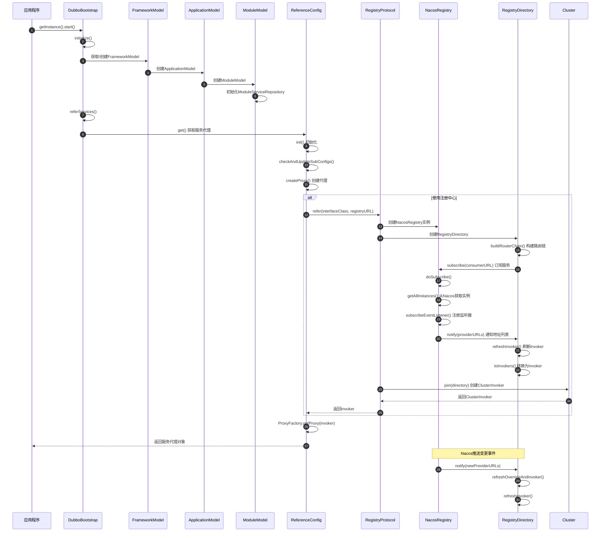
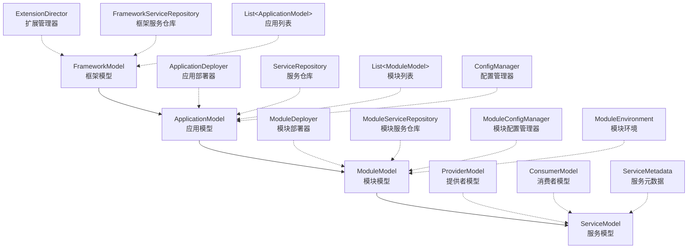
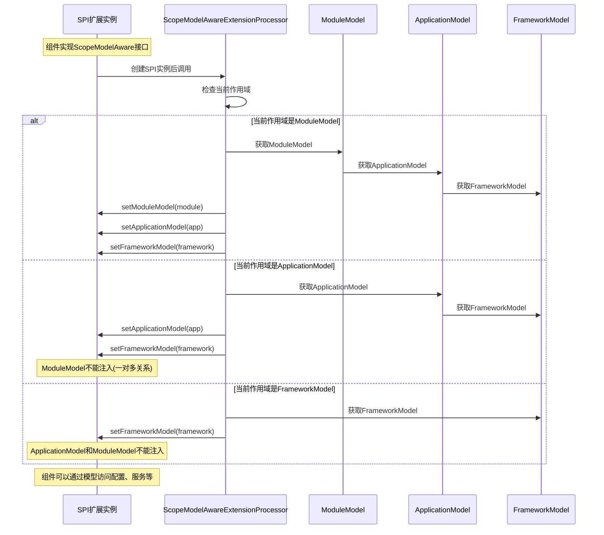
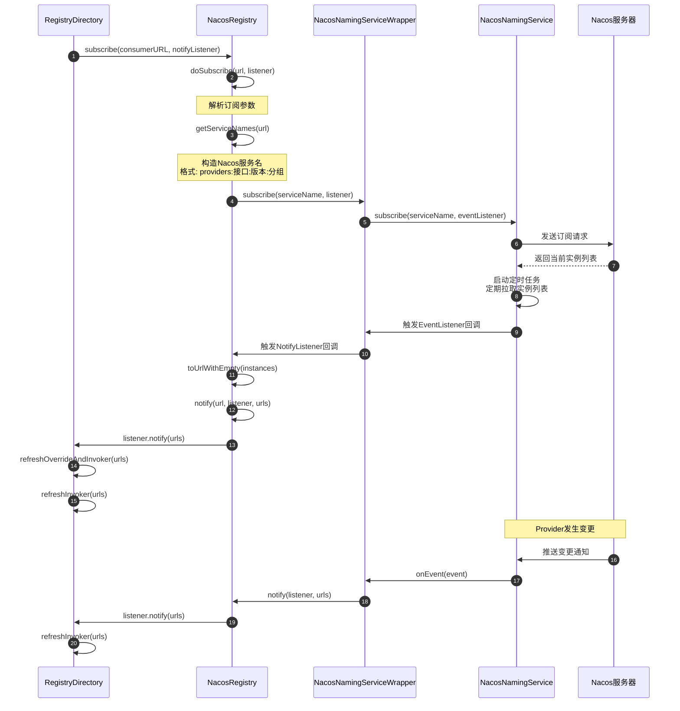
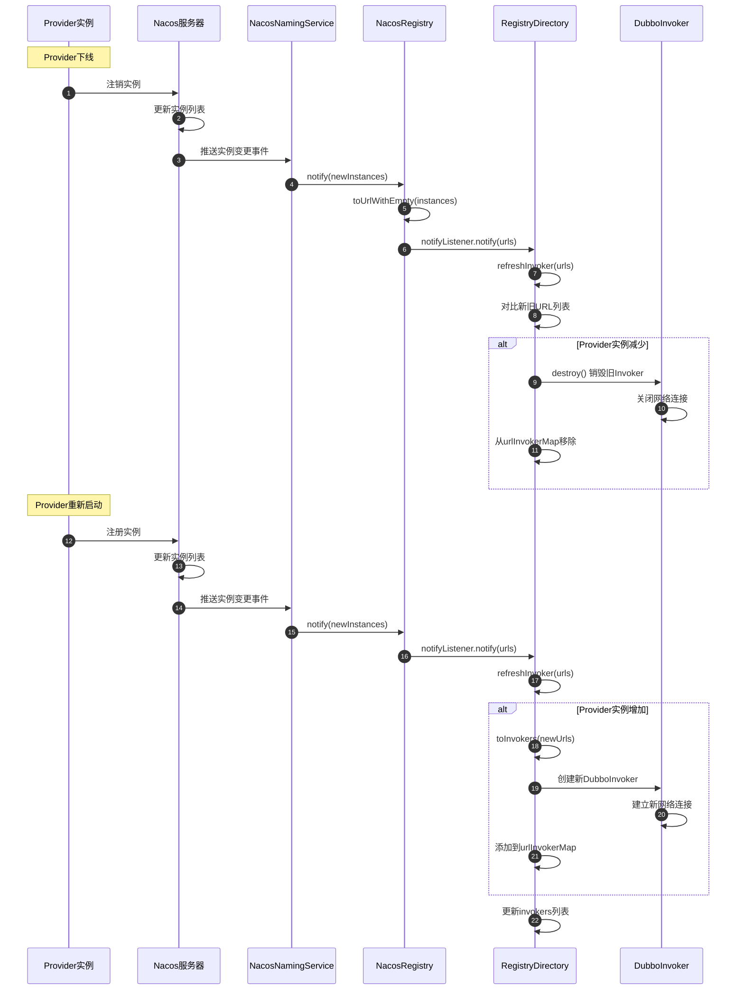
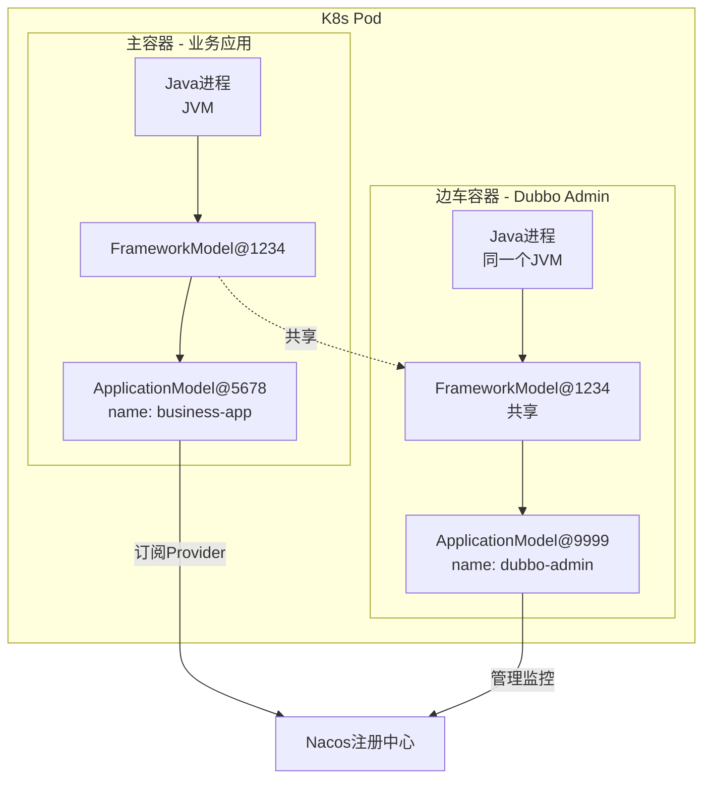
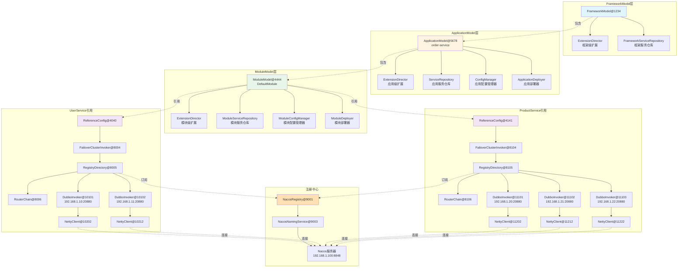
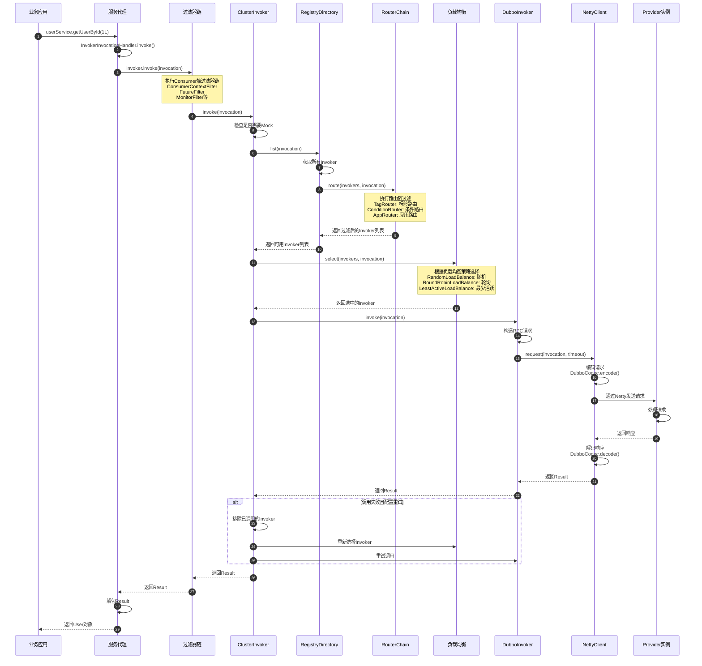
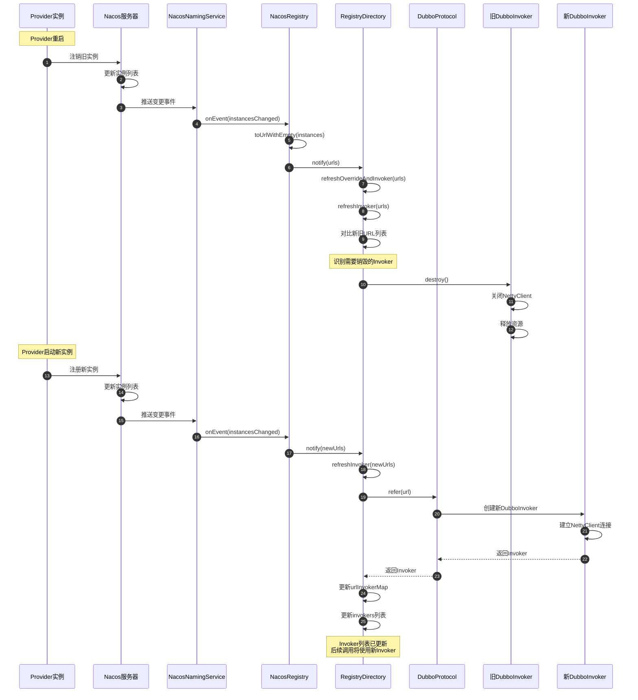
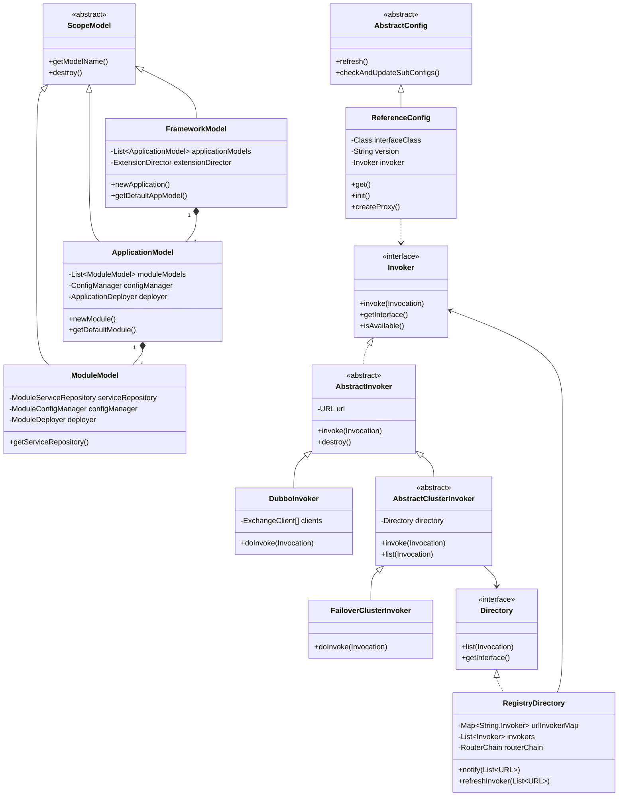

# Dubbo Consumer 启动流程与运行机制详解(小白视角)

## 一、概述

本文档从**小白开发者视角**,以实际场景为例,详细介绍Dubbo Consumer在启动过程中的工作原理、内存结构以及运行机制。

### 1.1 示例场景说明

为了便于理解,本文档将使用以下具体场景进行讲解:

**Consumer端场景:**
- 一个订单服务(OrderService)作为Consumer
- 需要调用2个不同的Provider服务:
  1. **用户服务(UserService)** - 提供用户信息查询
     - Provider实例1: 192.168.1.10:20880
     - Provider实例2: 192.168.1.11:20880
  2. **商品服务(ProductService)** - 提供商品信息查询
     - Provider实例1: 192.168.1.20:20880
     - Provider实例2: 192.168.1.21:20880
     - Provider实例3: 192.168.1.22:20880

**注册中心:**
- 使用Nacos作为注册中心
- Nacos服务器地址: 192.168.1.100:8848

**服务接口:**
- com.example.UserService (version: 1.0.0, group: default)
- com.example.ProductService (version: 2.0.0, group: default)

### 1.2 核心内容

本文档将详细介绍以下内容:

1. **Consumer启动完整流程** - 从框架初始化到服务可调用的全过程
2. **三层作用域模型详解** - FrameworkModel、ApplicationModel、ModuleModel的内存实例
3. **核心类详解** - 各个关键类的作用及数据结构实例
4. **Nacos注册中心交互** - 服务订阅、通知、Provider信息同步机制
5. **Provider信息本地存储** - 以2个Provider为例的完整内存结构
6. **Provider重启后的处理** - Consumer的感知与重连机制
7. **多ApplicationModel场景** - 特别是K8s边车模式的应用
8. **完整流程图** - 使用Mermaid绘制的整体架构和流程

### 1.3 适用场景

- 使用Nacos作为注册中心的Dubbo应用
- 需要深入理解Dubbo Consumer工作原理的开发人员
- 排查Consumer启动、服务调用相关问题的场景
- 理解Dubbo在K8s环境下的部署模式

---

## 二、Dubbo Consumer 启动完整流程

### 2.1 启动流程概览

Dubbo Consumer的启动是一个复杂的多阶段过程,涉及框架初始化、作用域模型构建、服务引用、注册中心订阅等多个环节。



### 2.2 启动阶段详解

#### 阶段一:框架与应用初始化

Dubbo Consumer启动的第一步是初始化Dubbo框架和应用上下文。这个过程建立了三层作用域模型的基础结构。

**核心步骤:**

1. **DubboBootstrap初始化**
   - 应用调用 `DubboBootstrap.getInstance()` 获取全局单例
   - 调用 `start()` 方法启动框架

2. **FrameworkModel创建**
   - 如果尚未创建,系统会创建全局默认的FrameworkModel实例
   - FrameworkModel是整个Dubbo框架的顶层模型
   - 一个JVM进程中通常只有一个FrameworkModel

3. **ApplicationModel创建**
   - 在FrameworkModel下创建ApplicationModel
   - ApplicationModel代表当前应用程序实例
   - 一个FrameworkModel可以包含多个ApplicationModel(边车模式)

4. **ModuleModel创建**
   - 在ApplicationModel下创建ModuleModel
   - 默认会创建InternalModule(内部模块)和DefaultModule(默认模块)
   - ModuleModel用于服务的逻辑分组

**内存结构关系:**

```
FrameworkModel (ID: 1)
  └─ ApplicationModel (ID: 1.1, name: order-service)
      ├─ InternalModule (ID: 1.1.0)
      └─ DefaultModule (ID: 1.1.1)
          ├─ ModuleServiceRepository (存储服务信息)
          ├─ ModuleConfigManager (管理配置)
          └─ ModuleDeployer (管理部署)
```

#### 阶段二:服务引用配置准备

在这个阶段,系统为每个需要引用的服务准备配置信息。

**核心步骤:**

1. **ReferenceConfig创建**
   - 为UserService创建ReferenceConfig实例
   - 为ProductService创建ReferenceConfig实例

2. **配置刷新**
   - 调用 `refresh()` 方法
   - 从配置中心、环境变量等加载配置

3. **子配置检查**
   - 调用 `checkAndUpdateSubConfigs()` 
   - 验证和补全配置信息(如未指定注册中心,使用默认值)

4. **ConsumerModel创建**
   - 创建ConsumerModel并注册到ModuleServiceRepository
   - ConsumerModel包含服务接口、方法元数据等信息

**配置参数收集:**

系统通过 `appendConfig()` 方法收集引用参数,包括:
- interface: 服务接口名
- version: 服务版本
- group: 服务分组
- timeout: 调用超时时间
- retries: 重试次数
- loadbalance: 负载均衡策略
- registry: 注册中心地址
- protocol: 通信协议

#### 阶段三:创建Invoker与订阅服务

这是Consumer启动的核心阶段,涉及与注册中心的交互和本地Invoker的创建。

**核心步骤:**

1. **构建注册中心URL**
   ```
   registry://192.168.1.100:8848/org.apache.dubbo.registry.RegistryService
     ?application=order-service
     &registry=nacos
     &refer=interface=com.example.UserService&version=1.0.0&...
   ```

2. **Protocol.refer调用**
   - 通过自适应扩展机制,根据URL协议选择RegistryProtocol
   - RegistryProtocol负责处理注册中心相关逻辑

3. **创建NacosRegistry实例**
   - 初始化NacosNamingService连接
   - 创建NacosNamingServiceWrapper包装器
   - 建立与Nacos服务器(192.168.1.100:8848)的连接

4. **创建RegistryDirectory**
   - RegistryDirectory是动态服务目录,维护Provider列表
   - 创建RouterChain路由链,包含条件路由、标签路由等

5. **订阅服务**
   - 构建订阅URL(consumer协议)
   - 向注册中心订阅Provider变更通知
   - 注册中心返回当前所有可用的Provider实例

#### 阶段四:Provider信息处理与Invoker创建

接收到Provider列表后,Consumer需要将其转换为可调用的Invoker对象。

**核心步骤:**

1. **接收Provider URL列表**
   - 从Nacos获取UserService的2个Provider实例
   - 从Nacos获取ProductService的3个Provider实例
   - 每个实例包含IP、端口、参数等信息

2. **URL转换与合并**
   - 将Nacos Instance转换为Dubbo URL
   - 合并Consumer端参数和Provider端参数
   - 确定最终的调用协议(如dubbo、tri等)

3. **创建Protocol Invoker**
   - 对每个Provider URL调用DubboProtocol.refer()
   - 建立网络连接(连接池)
   - 创建可发起RPC调用的DubboInvoker实例

4. **缓存Invoker映射**
   - 维护 `urlInvokerMap`: URL到Invoker的映射
   - 复用已有连接,避免重复创建

5. **路由链处理**
   - 将Invoker列表传递给RouterChain
   - 各个Router(条件路由、标签路由等)初始化
   - 准备运行时路由过滤

#### 阶段五:创建集群Invoker与代理对象

最后阶段是将多个Provider Invoker聚合为集群Invoker,并生成代理对象。

**核心步骤:**

1. **Cluster.join调用**
   - 根据配置的集群策略(默认failover)创建ClusterInvoker
   - ClusterInvoker包装RegistryDirectory
   - 提供容错、负载均衡等集群功能

2. **创建服务代理**
   - ProxyFactory.getProxy(invoker)创建JDK或Javassist代理
   - 代理对象实现服务接口
   - 方法调用会被拦截并转发到Invoker.invoke()

3. **注册ConsumerModel**
   - 将ConsumerModel注册到ModuleServiceRepository
   - 设置代理对象引用
   - 初始化方法模型

4. **返回代理对象**
   - ReferenceConfig.get()返回代理对象
   - 应用可以像调用本地方法一样调用远程服务

---

## 三、三层作用域模型详解

### 3.1 作用域模型层次结构

Dubbo采用三层作用域模型来管理配置、服务和资源的生命周期。这种设计支持多应用共享框架实例,同时保持各应用间的隔离。



### 3.2 FrameworkModel(框架模型)

FrameworkModel是Dubbo模型层次结构的最顶层,代表整个Dubbo框架实例,可以被多个应用共享。

#### 核心职责

1. **管理多个ApplicationModel** - 维护所有应用模型的列表
2. **提供全局SPI扩展** - 框架级别的扩展点加载和管理
3. **管理框架服务仓库** - 存储所有应用的服务元数据
4. **控制框架生命周期** - 管理框架的初始化和销毁

#### 内存实例结构示例

```java
// FrameworkModel内存结构
FrameworkModel@1234 {
  internalId: "1",
  desc: "Dubbo Framework[1]",
  
  // 应用模型列表
  applicationModels: [
    ApplicationModel@5678,  // order-service
  ],
  
  // 公开的应用模型(非内部)
  pubApplicationModels: [
    ApplicationModel@5678
  ],
  
  // 默认应用模型
  defaultAppModel: ApplicationModel@5678,
  
  // 内部应用模型(用于Dubbo内部)
  internalApplicationModel: ApplicationModel@9999,
  
  // 扩展管理器
  extensionDirector: ExtensionDirector@1111 {
    scope: ExtensionScope.FRAMEWORK,
    parent: null,
    // 管理框架级别的SPI扩展
  },
  
  // 框架服务仓库
  serviceRepository: FrameworkServiceRepository@2222 {
    // 存储所有应用的服务元数据
  }
}
```

### 3.3 ApplicationModel(应用模型)

ApplicationModel代表一个使用Dubbo的应用程序,存储RPC调用处理期间使用的基本元数据信息。

#### 核心职责

1. **管理多个ModuleModel** - 维护所有模块模型的列表
2. **提供应用级别配置** - 管理ApplicationConfig等配置
3. **管理应用服务仓库** - 存储应用的所有服务信息
4. **控制应用部署** - 通过ApplicationDeployer管理启动和停止

#### 内存实例结构示例

```java
// ApplicationModel内存结构
ApplicationModel@5678 {
  internalId: "1.1",
  modelName: "order-service",
  desc: "Dubbo Application[1.1](order-service)",
  
  // 所属的框架模型
  frameworkModel: FrameworkModel@1234,
  
  // 模块模型列表
  moduleModels: [
    ModuleModel@3333,  // InternalModule (ID: 1.1.0)
    ModuleModel@4444   // DefaultModule (ID: 1.1.1)
  ],
  
  // 公开的模块模型
  pubModuleModels: [
    ModuleModel@4444   // 只包含非内部模块
  ],
  
  // 内部模块(用于Dubbo内部服务)
  internalModule: ModuleModel@3333,
  
  // 默认模块(用于未指定模块的服务)
  defaultModule: ModuleModel@4444,
  
  // 应用部署器
  deployer: DefaultApplicationDeployer@5555 {
    state: DeployState.STARTED,
    // 管理应用的启动和停止
  },
  
  // 服务仓库
  serviceRepository: ServiceRepository@6666 {
    // 存储应用的所有服务模型
  },
  
  // 配置管理器
  configManager: ConfigManager@7777 {
    applicationConfig: ApplicationConfig {
      name: "order-service"
    },
    registries: [
      RegistryConfig {
        id: "nacos-registry",
        address: "nacos://192.168.1.100:8848"
      }
    ]
  },
  
  // 扩展管理器
  extensionDirector: ExtensionDirector@8888 {
    scope: ExtensionScope.APPLICATION,
    parent: ExtensionDirector@1111  // 指向FrameworkModel的扩展管理器
  }
}
```

### 3.4 ModuleModel(模块模型)

ModuleModel是服务的逻辑分组单位,每个模块可以包含多个服务的提供者和消费者。

#### 核心职责

1. **管理服务提供者和消费者** - 通过ModuleServiceRepository管理
2. **提供模块级别配置** - 管理模块的配置信息
3. **管理模块环境** - 提供ModuleEnvironment访问配置
4. **控制模块部署** - 通过ModuleDeployer管理服务的导出和引用

#### 内存实例结构示例(Consumer视角 - 以2个Provider为例)

```java
// ModuleModel内存结构(DefaultModule)
ModuleModel@4444 {
  internalId: "1.1.1",
  modelName: "defaultModule",
  desc: "Dubbo Module[1.1.1](order-service/defaultModule)",
  
  // 所属的应用模型
  applicationModel: ApplicationModel@5678,
  
  // 模块部署器
  deployer: DefaultModuleDeployer@9999 {
    state: DeployState.STARTED,
    
    // 引用缓存
    referenceCache: ReferenceCache@1010 {
      // 缓存服务引用,避免重复创建
    }
  },
  
  // 模块服务仓库 - 存储Consumer引用的服务
  serviceRepository: ModuleServiceRepository@1111 {
    // 消费者模型列表
    consumers: {
      // UserService的消费者模型
      "com.example.UserService:1.0.0:default": [
        ConsumerModel@2020
      ],
      // ProductService的消费者模型
      "com.example.ProductService:2.0.0:default": [
        ConsumerModel@2121
      ]
    },
    
    // 服务描述符
    services: {
      "com.example.UserService": ServiceDescriptor@3030 {
        interfaceName: "com.example.UserService",
        methods: {
          "getUserById": MethodDescriptor@3031,
          "getUserList": MethodDescriptor@3032
        }
      },
      "com.example.ProductService": ServiceDescriptor@3131 {
        interfaceName: "com.example.ProductService",
        methods: {
          "getProductById": MethodDescriptor@3132,
          "getProductList": MethodDescriptor@3133
        }
      }
    }
  },
  
  // 模块配置管理器
  configManager: ModuleConfigManager@1212 {
    // 服务引用配置列表
    references: [
      ReferenceConfig@4040,  // UserService的引用配置
      ReferenceConfig@4141   // ProductService的引用配置
    ],
    // 消费者全局配置
    consumers: [
      ConsumerConfig@5050 {
        timeout: 3000,
        retries: 2,
        loadbalance: "random"
      }
    ]
  },
  
  // 模块环境
  moduleEnvironment: ModuleEnvironment@1313 {
    // 环境配置信息
  },
  
  // 扩展管理器
  extensionDirector: ExtensionDirector@1414 {
    scope: ExtensionScope.MODULE,
    parent: ExtensionDirector@8888  // 指向ApplicationModel的扩展管理器
  }
}
```

### 3.5 作用域模型的注入与传递

在Dubbo中,作用域模型通过SPI扩展机制自动注入到组件中。



---

## 四、核心类详解与数据结构实例

本章节以**2个Provider(UserService和ProductService)**为例,详细说明各个核心类的作用和内部数据结构。

### 4.1 ReferenceConfig(服务引用配置)

#### 类的作用

ReferenceConfig是Consumer端引用远程服务的配置类,负责:
1. 存储服务引用的配置信息(接口、版本、分组等)
2. 触发服务引用流程
3. 创建并缓存服务代理对象
4. 管理服务的生命周期

#### 数据结构实例 - UserService

```java
// UserService的ReferenceConfig实例
ReferenceConfig@4040 {
  // 基本配置
  interfaceName: "com.example.UserService",
  interfaceClass: Class<UserService>,
  version: "1.0.0",
  group: "default",
  
  // 调用配置
  timeout: 3000,
  retries: 2,
  loadbalance: "random",
  cluster: "failover",
  connections: 0,  // 0表示共享连接
  
  // 注册中心配置
  registries: [
    RegistryConfig@7001 {
      id: "nacos-registry",
      protocol: "nacos",
      address: "192.168.1.100:8848"
    }
  ],
  
  // 所属的ModuleModel
  scopeModel: ModuleModel@4444,
  
  // 创建的服务代理对象
  ref: Proxy@8001 {
    // JDK动态代理或Javassist代理
    // 实现了UserService接口
    h: InvokerInvocationHandler@8002 {
      invoker: MockClusterInvoker@8003 {
        invoker: FailoverClusterInvoker@8004 {
          directory: RegistryDirectory@8005
        }
      }
    }
  },
  
  // 关联的Invoker
  invoker: MockClusterInvoker@8003,
  
  // 引用状态
  initialized: true,
  destroyed: false,
  
  // Consumer模型
  consumerModel: ConsumerModel@2020
}
```

#### 数据结构实例 - ProductService

```java
// ProductService的ReferenceConfig实例
ReferenceConfig@4141 {
  // 基本配置
  interfaceName: "com.example.ProductService",
  interfaceClass: Class<ProductService>,
  version: "2.0.0",
  group: "default",
  
  // 调用配置
  timeout: 5000,  // ProductService超时时间更长
  retries: 3,
  loadbalance: "roundrobin",  // 使用轮询负载均衡
  cluster: "failover",
  connections: 0,
  
  // 注册中心配置
  registries: [
    RegistryConfig@7001  // 复用同一个注册中心配置
  ],
  
  // 所属的ModuleModel
  scopeModel: ModuleModel@4444,
  
  // 创建的服务代理对象
  ref: Proxy@8101,
  
  // 关联的Invoker
  invoker: MockClusterInvoker@8103,
  
  // 引用状态
  initialized: true,
  destroyed: false,
  
  // Consumer模型
  consumerModel: ConsumerModel@2121
}
```

### 4.2 RegistryDirectory(注册中心目录服务)

#### 类的作用

RegistryDirectory是动态服务目录,负责:
1. 维护某个服务的所有Provider的Invoker列表
2. 监听注册中心的Provider变更通知
3. 动态刷新Invoker列表(增加、删除、更新)
4. 提供路由功能,根据路由规则过滤Provider
5. 聚合配置覆盖规则

#### 数据结构实例 - UserService的RegistryDirectory

```java
// UserService的RegistryDirectory实例
RegistryDirectory@8005 {
  // 服务接口信息
  serviceType: Class<UserService>,
  serviceKey: "com.example.UserService:1.0.0:default",
  
  // 注册中心相关
  registry: NacosRegistry@9001,
  registryUrl: URL {
    protocol: "registry",
    host: "192.168.1.100",
    port: 8848,
    path: "org.apache.dubbo.registry.RegistryService",
    parameters: {
      "registry": "nacos",
      "application": "order-service"
    }
  },
  
  // Consumer订阅URL
  consumerUrl: URL {
    protocol: "consumer",
    host: "192.168.1.50",  // Consumer所在机器IP
    parameters: {
      "interface": "com.example.UserService",
      "version": "1.0.0",
      "group": "default",
      "application": "order-service",
      "side": "consumer"
    }
  },
  
  // Provider URL到Invoker的映射
  urlInvokerMap: {
    // Provider 1: 192.168.1.10:20880
    URL@10001 {
      protocol: "dubbo",
      host: "192.168.1.10",
      port: 20880,
      path: "com.example.UserService",
      parameters: {
        "interface": "com.example.UserService",
        "version": "1.0.0",
        "group": "default",
        "application": "user-service-provider",
        "side": "provider",
        "methods": "getUserById,getUserList",
        "timestamp": "1703472000000"
      }
    } -> DubboInvoker@10101,
    
    // Provider 2: 192.168.1.11:20880
    URL@10002 {
      protocol: "dubbo",
      host: "192.168.1.11",
      port: 20880,
      path: "com.example.UserService",
      parameters: {
        "interface": "com.example.UserService",
        "version": "1.0.0",
        "group": "default",
        "application": "user-service-provider",
        "side": "provider",
        "methods": "getUserById,getUserList",
        "timestamp": "1703472100000"
      }
    } -> DubboInvoker@10102
  },
  
  // 可用的Invoker列表(已创建连接的)
  invokers: [
    DubboInvoker@10101,
    DubboInvoker@10102
  ],
  
  // 路由链
  routerChain: RouterChain@8006 {
    routers: [
      MockInvokersSelector@8007,  // Mock路由
      TagRouter@8008,              // 标签路由
      AppRouter@8009,              // 应用路由
      ServiceRouter@8010           // 服务路由
    ]
  },
  
  // 配置覆盖监听器
  overrideListeners: [
    OverrideListener@8011
  ],
  
  // 禁用状态
  forbidden: false,
  
  // 所属的ModuleModel
  moduleModel: ModuleModel@4444
}
```

#### 数据结构实例 - ProductService的RegistryDirectory

```java
// ProductService的RegistryDirectory实例
RegistryDirectory@8105 {
  // 服务接口信息
  serviceType: Class<ProductService>,
  serviceKey: "com.example.ProductService:2.0.0:default",
  
  // 注册中心相关(复用同一个NacosRegistry)
  registry: NacosRegistry@9001,
  registryUrl: URL {
    protocol: "registry",
    host: "192.168.1.100",
    port: 8848,
    path: "org.apache.dubbo.registry.RegistryService",
    parameters: {
      "registry": "nacos",
      "application": "order-service"
    }
  },
  
  // Consumer订阅URL
  consumerUrl: URL {
    protocol: "consumer",
    host: "192.168.1.50",
    parameters: {
      "interface": "com.example.ProductService",
      "version": "2.0.0",
      "group": "default",
      "application": "order-service",
      "side": "consumer"
    }
  },
  
  // Provider URL到Invoker的映射(3个Provider)
  urlInvokerMap: {
    // Provider 1: 192.168.1.20:20880
    URL@11001 {
      protocol: "dubbo",
      host: "192.168.1.20",
      port: 20880,
      path: "com.example.ProductService",
      parameters: {
        "interface": "com.example.ProductService",
        "version": "2.0.0",
        "group": "default",
        "application": "product-service-provider",
        "side": "provider",
        "methods": "getProductById,getProductList",
        "timestamp": "1703473000000"
      }
    } -> DubboInvoker@11101,
    
    // Provider 2: 192.168.1.21:20880
    URL@11002 {
      protocol: "dubbo",
      host: "192.168.1.21",
      port: 20880,
      path: "com.example.ProductService",
      parameters: {
        "interface": "com.example.ProductService",
        "version": "2.0.0",
        "group": "default",
        "application": "product-service-provider",
        "side": "provider",
        "methods": "getProductById,getProductList",
        "timestamp": "1703473100000"
      }
    } -> DubboInvoker@11102,
    
    // Provider 3: 192.168.1.22:20880
    URL@11003 {
      protocol: "dubbo",
      host: "192.168.1.22",
      port: 20880,
      path: "com.example.ProductService",
      parameters: {
        "interface": "com.example.ProductService",
        "version": "2.0.0",
        "group": "default",
        "application": "product-service-provider",
        "side": "provider",
        "methods": "getProductById,getProductList",
        "timestamp": "1703473200000"
      }
    } -> DubboInvoker@11103
  },
  
  // 可用的Invoker列表(3个)
  invokers: [
    DubboInvoker@11101,
    DubboInvoker@11102,
    DubboInvoker@11103
  ],
  
  // 路由链
  routerChain: RouterChain@8106 {
    routers: [
      MockInvokersSelector@8107,
      TagRouter@8108,
      AppRouter@8109,
      ServiceRouter@8110
    ]
  },
  
  // 配置覆盖监听器
  overrideListeners: [
    OverrideListener@8111
  ],
  
  // 禁用状态
  forbidden: false,
  
  // 所属的ModuleModel
  moduleModel: ModuleModel@4444
}
```

### 4.3 DubboInvoker(Dubbo调用器)

#### 类的作用

DubboInvoker是最底层的远程调用执行器,负责:
1. 封装与单个Provider的网络通信
2. 管理与Provider的连接(ExchangeClient)
3. 执行实际的远程调用
4. 处理调用超时、异常等情况

#### 数据结构实例 - UserService Provider 1的Invoker

```java
// UserService的Provider 1 (192.168.1.10:20880) 的DubboInvoker
DubboInvoker@10101 {
  // 服务接口类型
  type: Class<UserService>,
  
  // Provider的URL
  url: URL@10001 {
    protocol: "dubbo",
    host: "192.168.1.10",
    port: 20880,
    path: "com.example.UserService",
    parameters: {
      "interface": "com.example.UserService",
      "version": "1.0.0",
      "group": "default",
      "timeout": "3000",
      "retries": "2"
    }
  },
  
  // 网络通信客户端(连接池)
  clients: [
    // Dubbo默认使用HeaderExchangeClient
    HeaderExchangeClient@10201 {
      // Netty客户端
      client: NettyClient@10202 {
        // 连接状态
        connected: true,
        
        // Netty Channel
        channel: NioSocketChannel@10203 {
          remoteAddress: "192.168.1.10:20880",
          localAddress: "192.168.1.50:xxxxx",
          active: true
        },
        
        // 编解码器
        codec: DubboCodec,
        
        // 序列化方式
        serialization: Hessian2Serialization
      },
      
      // 心跳定时器
      heartbeatTimerTask: HeartbeatTimerTask@10204
    }
  ],
  
  // 当前客户端索引(用于多连接负载均衡)
  index: AtomicInteger(0),
  
  // 调用处理器集合(Attachment、Filter等)
  attachment: {},
  
  // 可用状态
  available: true,
  
  // 销毁状态
  destroyed: false
}
```

#### 数据结构实例 - ProductService Provider 1的Invoker

```java
// ProductService的Provider 1 (192.168.1.20:20880) 的DubboInvoker
DubboInvoker@11101 {
  // 服务接口类型
  type: Class<ProductService>,
  
  // Provider的URL
  url: URL@11001 {
    protocol: "dubbo",
    host: "192.168.1.20",
    port: 20880,
    path: "com.example.ProductService",
    parameters: {
      "interface": "com.example.ProductService",
      "version": "2.0.0",
      "group": "default",
      "timeout": "5000",
      "retries": "3"
    }
  },
  
  // 网络通信客户端
  clients: [
    HeaderExchangeClient@11201 {
      client: NettyClient@11202 {
        connected: true,
        channel: NioSocketChannel@11203 {
          remoteAddress: "192.168.1.20:20880",
          localAddress: "192.168.1.50:yyyyy",
          active: true
        },
        codec: DubboCodec,
        serialization: Hessian2Serialization
      },
      heartbeatTimerTask: HeartbeatTimerTask@11204
    }
  ],
  
  index: AtomicInteger(0),
  attachment: {},
  available: true,
  destroyed: false
}
```

**说明:**
- ProductService的另外2个Provider (192.168.1.21、192.168.1.22) 的DubboInvoker结构类似
- 每个DubboInvoker都维护独立的网络连接
- 所有连接都使用Netty实现,支持高并发

### 4.4 ClusterInvoker(集群调用器)

#### 类的作用

ClusterInvoker是集群容错层的调用器,负责:
1. 实现容错策略(Failover、Failfast、Failsafe等)
2. 调用负载均衡选择Provider
3. 调用路由链过滤Provider
4. 处理调用失败后的重试逻辑
5. 聚合多个Provider的调用结果

#### 数据结构实例 - UserService的FailoverClusterInvoker

```java
// UserService的FailoverClusterInvoker实例
FailoverClusterInvoker@8004 {
  // 服务接口类型
  type: Class<UserService>,
  
  // 关联的RegistryDirectory
  directory: RegistryDirectory@8005,
  
  // 负载均衡策略
  loadbalance: RandomLoadBalance@8020 {
    // 随机负载均衡
  },
  
  // 容错配置
  retries: 2,  // 失败重试2次,总共调用3次
  
  // 集群策略: failover(失败自动切换)
  // invoke方法的核心逻辑:
  // 1. 从directory.list()获取可用的Invoker列表
  // 2. 通过RouterChain过滤Invoker
  // 3. 使用LoadBalance选择一个Invoker
  // 4. 调用选中的Invoker.invoke()
  // 5. 如果失败,重试其他Provider(最多retries次)
}
```

#### 数据结构实例 - ProductService的FailoverClusterInvoker

```java
// ProductService的FailoverClusterInvoker实例
FailoverClusterInvoker@8104 {
  // 服务接口类型
  type: Class<ProductService>,
  
  // 关联的RegistryDirectory
  directory: RegistryDirectory@8105,
  
  // 负载均衡策略
  loadbalance: RoundRobinLoadBalance@8120 {
    // 轮询负载均衡
    // 会在3个Provider之间依次轮询选择
  },
  
  // 容错配置
  retries: 3,  // 失败重试3次,总共调用4次
  
  // 集群策略: failover
}
```

### 4.5 NacosRegistry(Nacos注册中心)

#### 类的作用

NacosRegistry是Nacos注册中心的实现,负责:
1. 与Nacos服务器建立连接
2. 订阅服务Provider列表
3. 监听Provider变更事件
4. 将变更通知给RegistryDirectory
5. 管理服务订阅关系

#### 数据结构实例

```java
// NacosRegistry实例(多个服务共享)
NacosRegistry@9001 {
  // 注册中心URL
  url: URL {
    protocol: "nacos",
    host: "192.168.1.100",
    port: 8848,
    parameters: {
      "application": "order-service",
      "namespace": "public",
      "group": "DEFAULT_GROUP"
    }
  },
  
  // Nacos命名服务包装器
  namingService: NacosNamingServiceWrapper@9002 {
    // 原生Nacos客户端
    namingService: NacosNamingService@9003 {
      serverList: ["192.168.1.100:8848"],
      namespace: "public",
      // Nacos客户端配置
    },
    
    // 事件监听器映射
    listenerMap: {
      // UserService的监听器
      "providers:com.example.UserService:1.0.0:default": [
        NacosEventListener@9101 {
          listener: NotifyListener@9102 {
            // RegistryDirectory的notify回调
            directory: RegistryDirectory@8005
          }
        }
      ],
      
      // ProductService的监听器
      "providers:com.example.ProductService:2.0.0:default": [
        NacosEventListener@9201 {
          listener: NotifyListener@9202 {
            directory: RegistryDirectory@8105
          }
        }
      ]
    }
  },
  
  // 服务订阅映射
  subscribed: {
    // UserService的订阅URL
    URL@10000 {
      protocol: "consumer",
      parameters: {
        "interface": "com.example.UserService",
        "version": "1.0.0",
        "category": "providers,configurators,routers"
      }
    } -> [NotifyListener@9102],
    
    // ProductService的订阅URL
    URL@11000 {
      protocol: "consumer",
      parameters: {
        "interface": "com.example.ProductService",
        "version": "2.0.0",
        "category": "providers,configurators,routers"
      }
    } -> [NotifyListener@9202]
  },
  
  // Nacos服务名缓存
  serviceNames: {
    "com.example.UserService:1.0.0:default": "providers:com.example.UserService:1.0.0:default",
    "com.example.ProductService:2.0.0:default": "providers:com.example.ProductService:2.0.0:default"
  }
}
```

### 4.6 ConsumerModel(消费者模型)

#### 类的作用

ConsumerModel是Consumer端服务引用的元数据模型,负责:
1. 存储服务引用的元数据信息
2. 关联服务代理对象
3. 提供方法级别的元数据
4. 支持服务治理和监控

#### 数据结构实例 - UserService的ConsumerModel

```java
// UserService的ConsumerModel实例
ConsumerModel@2020 {
  // 服务唯一标识
  serviceKey: "com.example.UserService:1.0.0:default",
  
  // 服务接口信息
  serviceInterfaceClass: Class<UserService>,
  
  // 服务代理对象
  proxyObject: Proxy@8001,
  
  // 服务元数据
  serviceMetadata: ServiceMetadata@2030 {
    serviceInterfaceName: "com.example.UserService",
    version: "1.0.0",
    group: "default",
    serviceType: "consumer",
    serviceName: "UserService"
  },
  
  // 方法模型映射
  methodModels: {
    "getUserById": MethodDescriptor@2031 {
      methodName: "getUserById",
      parameterClasses: [Long.class],
      returnClass: User.class,
      rpcType: RpcType.UNARY
    },
    "getUserList": MethodDescriptor@2032 {
      methodName: "getUserList",
      parameterClasses: [],
      returnClass: List.class,
      rpcType: RpcType.UNARY
    }
  },
  
  // 关联的ReferenceConfig
  referenceConfig: ReferenceConfig@4040,
  
  // 所属的ModuleModel
  moduleModel: ModuleModel@4444,
  
  // 初始化状态
  initialized: true
}
```

#### 数据结构实例 - ProductService的ConsumerModel

```java
// ProductService的ConsumerModel实例
ConsumerModel@2121 {
  // 服务唯一标识
  serviceKey: "com.example.ProductService:2.0.0:default",
  
  // 服务接口信息
  serviceInterfaceClass: Class<ProductService>,
  
  // 服务代理对象
  proxyObject: Proxy@8101,
  
  // 服务元数据
  serviceMetadata: ServiceMetadata@2131 {
    serviceInterfaceName: "com.example.ProductService",
    version: "2.0.0",
    group: "default",
    serviceType: "consumer",
    serviceName: "ProductService"
  },
  
  // 方法模型映射
  methodModels: {
    "getProductById": MethodDescriptor@2132 {
      methodName: "getProductById",
      parameterClasses: [Long.class],
      returnClass: Product.class,
      rpcType: RpcType.UNARY
    },
    "getProductList": MethodDescriptor@2133 {
      methodName: "getProductList",
      parameterClasses: [Integer.class, Integer.class],
      returnClass: List.class,
      rpcType: RpcType.UNARY
    }
  },
  
  // 关联的ReferenceConfig
  referenceConfig: ReferenceConfig@4141,
  
  // 所属的ModuleModel
  moduleModel: ModuleModel@4444,
  
  // 初始化状态
  initialized: true
}
```

---

## 五、Nacos注册中心交互机制

### 5.1 Nacos服务订阅流程

Consumer启动时需要向Nacos注册中心订阅服务,以获取和监听Provider实例的变化。



### 5.2 Provider信息转换

Nacos返回的Instance需要转换为Dubbo的URL格式。

**Nacos Instance示例(UserService Provider 1):**

```json
{
  "instanceId": "192.168.1.10#20880#DEFAULT#DEFAULT_GROUP@@providers:com.example.UserService:1.0.0:default",
  "ip": "192.168.1.10",
  "port": 20880,
  "weight": 1.0,
  "healthy": true,
  "enabled": true,
  "ephemeral": true,
  "metadata": {
    "dubbo.protocol": "dubbo",
    "dubbo.version": "3.2.0",
    "interface": "com.example.UserService",
    "version": "1.0.0",
    "group": "default",
    "application": "user-service-provider",
    "methods": "getUserById,getUserList",
    "side": "provider",
    "timestamp": "1703472000000"
  }
}
```

**转换后的Dubbo URL:**

```
dubbo://192.168.1.10:20880/com.example.UserService
  ?interface=com.example.UserService
  &version=1.0.0
  &group=default
  &application=user-service-provider
  &side=provider
  &methods=getUserById,getUserList
  &timestamp=1703472000000
  &dubbo.version=3.2.0
```

### 5.3 服务订阅后的内存结构

以UserService为例,订阅完成后的完整内存结构:

```
NacosRegistry@9001
  │
  ├─ NacosNamingServiceWrapper@9002
  │   ├─ NacosNamingService@9003 (连接到192.168.1.100:8848)
  │   └─ listenerMap: {
  │        "providers:com.example.UserService:1.0.0:default": [
  │          NacosEventListener@9101 -> NotifyListener@9102
  │        ]
  │      }
  │
  └─ subscribed: {
       URL(consumer://...UserService...) -> [NotifyListener@9102]
     }

RegistryDirectory@8005
  │
  ├─ registry: NacosRegistry@9001
  ├─ notifyListener: NotifyListener@9102
  │
  ├─ urlInvokerMap: {
  │    URL(dubbo://192.168.1.10:20880/...) -> DubboInvoker@10101,
  │    URL(dubbo://192.168.1.11:20880/...) -> DubboInvoker@10102
  │  }
  │
  └─ invokers: [
       DubboInvoker@10101 (连接到192.168.1.10:20880),
       DubboInvoker@10102 (连接到192.168.1.11:20880)
     ]
```

---

## 六、Provider重启后Consumer的处理机制

### 6.1 Provider重启检测流程

当Provider发生重启时,Consumer通过以下机制感知:



### 6.2 Invoker刷新详细过程

RegistryDirectory的refreshInvoker方法是核心逻辑:

**关键步骤:**

1. **URL对比**
   ```java
   // 旧的URL列表
   Map<String, Invoker<T>> oldUrlInvokerMap = {
     "dubbo://192.168.1.10:20880/..." -> DubboInvoker@10101,
     "dubbo://192.168.1.11:20880/..." -> DubboInvoker@10102
   }
   
   // 新的URL列表(假设192.168.1.10重启,IP变为192.168.1.12)
   List<URL> newUrls = [
     URL("dubbo://192.168.1.12:20880/..."),  // 新IP
     URL("dubbo://192.168.1.11:20880/...")   // 未变化
   ]
   ```

2. **识别需要销毁的Invoker**
   ```java
   // 需要销毁的Invoker
   toDestroy = [
     DubboInvoker@10101  // 192.168.1.10的Invoker
   ]
   ```

3. **创建新的Invoker**
   ```java
   // 为新URL创建Invoker
   newInvoker = protocol.refer(UserService.class, URL("dubbo://192.168.1.12:20880/..."))
   // 返回 DubboInvoker@10103
   ```

4. **更新映射关系**
   ```java
   // 新的URL-Invoker映射
   newUrlInvokerMap = {
     "dubbo://192.168.1.12:20880/..." -> DubboInvoker@10103,  // 新建
     "dubbo://192.168.1.11:20880/..." -> DubboInvoker@10102   // 复用
   }
   ```

5. **销毁旧Invoker**
   ```java
   // 异步销毁旧Invoker
   DubboInvoker@10101.destroy()
   // - 关闭NettyClient连接
   // - 释放资源
   ```

### 6.3 Provider重启前后的内存对比

#### 重启前的内存结构(UserService)

```
RegistryDirectory@8005
  ├─ urlInvokerMap: {
  │    "dubbo://192.168.1.10:20880/..." -> DubboInvoker@10101 {
  │      clients: [
  │        HeaderExchangeClient@10201 {
  │          client: NettyClient@10202 {
  │            channel: NioSocketChannel@10203 (连接到192.168.1.10:20880)
  │          }
  │        }
  │      ]
  │    },
  │    "dubbo://192.168.1.11:20880/..." -> DubboInvoker@10102 {
  │      clients: [
  │        HeaderExchangeClient@10211 {
  │          client: NettyClient@10212 {
  │            channel: NioSocketChannel@10213 (连接到192.168.1.11:20880)
  │          }
  │        }
  │      ]
  │    }
  │  }
  │
  └─ invokers: [
       DubboInvoker@10101,
       DubboInvoker@10102
     ]
```

#### 192.168.1.10重启后的内存结构

假设Provider重启后IP变为192.168.1.12:

```
RegistryDirectory@8005
  ├─ urlInvokerMap: {
  │    "dubbo://192.168.1.12:20880/..." -> DubboInvoker@10103 {  // 新创建
  │      clients: [
  │        HeaderExchangeClient@10301 {
  │          client: NettyClient@10302 {
  │            channel: NioSocketChannel@10303 (连接到192.168.1.12:20880)
  │          }
  │        }
  │      ]
  │    },
  │    "dubbo://192.168.1.11:20880/..." -> DubboInvoker@10102 {  // 复用
  │      clients: [
  │        HeaderExchangeClient@10211 {
  │          client: NettyClient@10212 {
  │            channel: NioSocketChannel@10213 (连接到192.168.1.11:20880)
  │          }
  │        }
  │      ]
  │    }
  │  }
  │
  └─ invokers: [
       DubboInvoker@10103,  // 新Invoker
       DubboInvoker@10102   // 原有Invoker
     ]

// DubboInvoker@10101已被销毁,不再引用
```

### 6.4 网络连接的断开与重连

**心跳检测机制:**

每个DubboInvoker内部的HeaderExchangeClient都有心跳定时任务:

```java
HeartbeatTimerTask@10204 {
  // 心跳间隔: 60秒
  heartbeat: 60000,
  
  // 心跳超时: 180秒(3倍心跳间隔)
  heartbeatTimeout: 180000,
  
  // 定时发送心跳请求
  // 如果超过heartbeatTimeout没有收到响应
  // 则认为连接断开,触发重连
}
```

**Provider下线时的处理:**

1. **心跳失败检测**
   - HeaderExchangeClient发送心跳请求
   - 超过180秒未收到响应
   - 标记Channel为inactive

2. **Nacos通知**
   - Nacos检测到Provider心跳超时(默认15秒)
   - 将Provider实例标记为unhealthy
   - 推送实例变更事件给Consumer

3. **Consumer处理**
   - RegistryDirectory收到notify
   - 刷新Invoker列表,移除不健康的Invoker
   - 销毁对应的网络连接

**Provider上线时的处理:**

1. **Nacos注册**
   - Provider向Nacos注册实例
   - Nacos更新实例列表

2. **推送通知**
   - Nacos推送新实例给订阅的Consumer

3. **Consumer创建连接**
   - RegistryDirectory创建新DubboInvoker
   - DubboInvoker建立NettyClient连接
   - 连接成功后Invoker可用

---

## 七、多ApplicationModel使用场景

### 7.1 什么情况下会有多个ApplicationModel

在一个FrameworkModel下,存在多个ApplicationModel的情况主要有:

1. **边车(Sidecar)模式** - K8s环境下的主要场景
2. **多租户隔离** - 同一JVM进程中运行多个逻辑应用
3. **测试环境** - 单元测试中模拟多个应用

### 7.2 K8s边车模式详解

#### 什么是边车模式

在Kubernetes中,边车模式是指在同一个Pod中运行多个容器,其中:
- **主容器(Main Container)**: 运行主要的业务应用
- **边车容器(Sidecar Container)**: 提供辅助功能,如日志收集、监控、代理等

#### Dubbo在边车模式下的架构



**注意:** 上述架构是理论上的边车模式,实际上Dubbo边车更常见的是通过Mesh模式实现。

#### 您公司的实际场景

根据您的描述:
> "我们公司使用的k8s,基本使用一个Pod启动一个java进程,有多个的情况是以边车的形式启动的"

**典型场景1: 一个Pod一个Java进程(常规模式)**

```yaml
apiVersion: v1
kind: Pod
metadata:
  name: order-service-pod
spec:
  containers:
  - name: order-service
    image: order-service:1.0.0
    # 一个Pod只有一个Java进程
    # FrameworkModel只有一个ApplicationModel
```

**对应的内存结构:**
```
JVM进程
  └─ FrameworkModel@1234
      └─ ApplicationModel@5678 (name: order-service)
          └─ DefaultModule@4444
              ├─ UserService引用
              └─ ProductService引用
```

**典型场景2: 边车模式(多ApplicationModel)**

```yaml
apiVersion: v1
kind: Pod
metadata:
  name: order-service-pod
spec:
  containers:
  - name: order-service
    image: order-service:1.0.0
    # 主应用容器
  
  - name: dubbo-sidecar
    image: dubbo-sidecar:1.0.0
    # 边车容器,用于服务治理、监控等
```

**对应的内存结构(如果在同一个JVM中):**
```
JVM进程
  └─ FrameworkModel@1234
      ├─ ApplicationModel@5678 (name: order-service)
      │   └─ DefaultModule@4444
      │       ├─ UserService引用
      │       └─ ProductService引用
      │
      └─ ApplicationModel@9999 (name: dubbo-sidecar)
          └─ DefaultModule@5555
              └─ 管理和监控功能
```

### 7.3 多ApplicationModel的隔离机制

#### 配置隔离

每个ApplicationModel有独立的ConfigManager:

```java
// ApplicationModel 1: order-service
ApplicationModel@5678 {
  configManager: ConfigManager@7777 {
    applicationConfig: ApplicationConfig {
      name: "order-service"
    },
    registries: [
      RegistryConfig { address: "nacos://192.168.1.100:8848" }
    ]
  }
}

// ApplicationModel 2: dubbo-sidecar
ApplicationModel@9999 {
  configManager: ConfigManager@8888 {
    applicationConfig: ApplicationConfig {
      name: "dubbo-sidecar"
    },
    registries: [
      RegistryConfig { address: "nacos://192.168.1.200:8848" }  // 可以使用不同的注册中心
    ]
  }
}
```

#### 服务隔离

每个ApplicationModel有独立的ServiceRepository:

```java
// order-service的服务仓库
ApplicationModel@5678 {
  moduleModels: [
    ModuleModel@4444 {
      serviceRepository: ModuleServiceRepository@1111 {
        consumers: {
          "com.example.UserService:1.0.0:default": [...],
          "com.example.ProductService:2.0.0:default": [...]
        }
      }
    }
  ]
}

// dubbo-sidecar的服务仓库(独立)
ApplicationModel@9999 {
  moduleModels: [
    ModuleModel@5555 {
      serviceRepository: ModuleServiceRepository@2222 {
        // 边车服务可能只提供监控接口,不引用业务服务
        providers: {
          "com.alibaba.dubbo.admin.MonitorService::": [...]
        }
      }
    }
  ]
}
```

#### 扩展隔离

每个ApplicationModel有独立的ExtensionDirector:

```java
// order-service的扩展管理器
ApplicationModel@5678 {
  extensionDirector: ExtensionDirector@8888 {
    scope: ExtensionScope.APPLICATION,
    parent: FrameworkModel@1234.extensionDirector
    // 可以加载应用级别的自定义扩展
  }
}

// dubbo-sidecar的扩展管理器
ApplicationModel@9999 {
  extensionDirector: ExtensionDirector@9990 {
    scope: ExtensionScope.APPLICATION,
    parent: FrameworkModel@1234.extensionDirector
    // 独立的扩展实例
  }
}
```

### 7.4 边车模式的优势与注意事项

#### 优势

1. **关注点分离**
   - 主应用专注业务逻辑
   - 边车处理服务治理、监控、日志等横切关注点

2. **独立升级**
   - 边车功能可以独立升级,不影响主应用

3. **资源隔离**
   - 通过ApplicationModel隔离,避免相互影响

4. **多语言支持**
   - 边车可以为非Java应用提供Dubbo能力

#### 注意事项

1. **资源消耗**
   - 多个ApplicationModel会消耗更多内存
   - 需要评估资源使用情况

2. **通信开销**
   - 如果主应用和边车需要通信,需要考虑性能

3. **配置一致性**
   - 确保不同ApplicationModel的配置不冲突

---

## 八、完整流程图汇总

### 8.1 Consumer启动完整架构图



### 8.2 服务调用完整流程图



### 8.3 Provider变更通知流程图



---

## 九、实战示例演练

### 9.1 场景描述

模拟实际业务场景:
1. **订单服务(Consumer)** 启动,引用UserService和ProductService
2. **UserService** 有2个Provider实例
3. **ProductService** 有3个Provider实例
4. **UserService的一个Provider重启**,观察Consumer的反应

### 9.2 启动日志分析

#### Consumer启动日志

```
[INFO] DubboBootstrap - Dubbo Application[order-service](order-service) is starting ...
[INFO] FrameworkModel - FrameworkModel[1] created
[INFO] ApplicationModel - ApplicationModel[1.1](order-service) created under FrameworkModel[1]
[INFO] ModuleModel - ModuleModel[1.1.0](order-service/internalModule) created
[INFO] ModuleModel - ModuleModel[1.1.1](order-service/defaultModule) created

[INFO] ReferenceConfig - Refer service: com.example.UserService:1.0.0:default
[INFO] RegistryProtocol - Register consumer URL: consumer://192.168.1.50/com.example.UserService?application=order-service&version=1.0.0&group=default
[INFO] NacosRegistry - Subscribe service: providers:com.example.UserService:1.0.0:default
[INFO] NacosNamingService - Current instances: 2
  - Instance: 192.168.1.10:20880 (healthy: true, weight: 1.0)
  - Instance: 192.168.1.11:20880 (healthy: true, weight: 1.0)
[INFO] RegistryDirectory - Refresh invoker for service: com.example.UserService
[INFO] DubboProtocol - Refer dubbo service: com.example.UserService from url: dubbo://192.168.1.10:20880/com.example.UserService
[INFO] NettyClient - Connect to server: 192.168.1.10:20880
[INFO] DubboProtocol - Refer dubbo service: com.example.UserService from url: dubbo://192.168.1.11:20880/com.example.UserService
[INFO] NettyClient - Connect to server: 192.168.1.11:20880
[INFO] ReferenceConfig - Refer service: com.example.UserService success, invokers: 2

[INFO] ReferenceConfig - Refer service: com.example.ProductService:2.0.0:default
[INFO] RegistryProtocol - Register consumer URL: consumer://192.168.1.50/com.example.ProductService?application=order-service&version=2.0.0&group=default
[INFO] NacosRegistry - Subscribe service: providers:com.example.ProductService:2.0.0:default
[INFO] NacosNamingService - Current instances: 3
  - Instance: 192.168.1.20:20880 (healthy: true, weight: 1.0)
  - Instance: 192.168.1.21:20880 (healthy: true, weight: 1.0)
  - Instance: 192.168.1.22:20880 (healthy: true, weight: 1.0)
[INFO] RegistryDirectory - Refresh invoker for service: com.example.ProductService
[INFO] DubboProtocol - Refer dubbo service: com.example.ProductService from url: dubbo://192.168.1.20:20880/com.example.ProductService
[INFO] NettyClient - Connect to server: 192.168.1.20:20880
[INFO] DubboProtocol - Refer dubbo service: com.example.ProductService from url: dubbo://192.168.1.21:20880/com.example.ProductService
[INFO] NettyClient - Connect to server: 192.168.1.21:20880
[INFO] DubboProtocol - Refer dubbo service: com.example.ProductService from url: dubbo://192.168.1.22:20880/com.example.ProductService
[INFO] NettyClient - Connect to server: 192.168.1.22:20880
[INFO] ReferenceConfig - Refer service: com.example.ProductService success, invokers: 3

[INFO] DubboBootstrap - Dubbo Application[order-service](order-service) has started
```

#### Provider重启时的日志

```
[INFO] NacosNamingService - Receive service change event: providers:com.example.UserService:1.0.0:default
[INFO] NacosRegistry - Notify instances changed for service: providers:com.example.UserService:1.0.0:default
[INFO] NacosRegistry - Current instances: 1 (decreased from 2)
  - Instance: 192.168.1.11:20880 (healthy: true, weight: 1.0)
[INFO] RegistryDirectory - Refresh invoker for service: com.example.UserService
[INFO] RegistryDirectory - Destroy invoker: dubbo://192.168.1.10:20880/com.example.UserService
[INFO] DubboInvoker - Close dubbo invoker: dubbo://192.168.1.10:20880/com.example.UserService
[INFO] NettyClient - Close netty client to: 192.168.1.10:20880
[INFO] RegistryDirectory - Current available invokers: 1

[INFO] NacosNamingService - Receive service change event: providers:com.example.UserService:1.0.0:default
[INFO] NacosRegistry - Notify instances changed for service: providers:com.example.UserService:1.0.0:default
[INFO] NacosRegistry - Current instances: 2 (increased from 1)
  - Instance: 192.168.1.11:20880 (healthy: true, weight: 1.0)
  - Instance: 192.168.1.12:20880 (healthy: true, weight: 1.0)  // 新IP
[INFO] RegistryDirectory - Refresh invoker for service: com.example.UserService
[INFO] DubboProtocol - Refer dubbo service: com.example.UserService from url: dubbo://192.168.1.12:20880/com.example.UserService
[INFO] NettyClient - Connect to server: 192.168.1.12:20880
[INFO] RegistryDirectory - Current available invokers: 2
```

### 9.3 内存快照对比

#### 启动完成后的内存快照

```java
// 三层作用域模型
FrameworkModel@1234
  └─ ApplicationModel@5678 (order-service)
      └─ ModuleModel@4444 (defaultModule)
          └─ ModuleServiceRepository@1111
              └─ consumers: {
                   "com.example.UserService:1.0.0:default": [ConsumerModel@2020],
                   "com.example.ProductService:2.0.0:default": [ConsumerModel@2121]
                 }

// UserService的RegistryDirectory
RegistryDirectory@8005 {
  invokers: [
    DubboInvoker@10101 (192.168.1.10:20880) {
      clients: [NettyClient@10202 (connected: true)]
    },
    DubboInvoker@10102 (192.168.1.11:20880) {
      clients: [NettyClient@10212 (connected: true)]
    }
  ],
  urlInvokerMap: {
    "dubbo://192.168.1.10:20880/..." -> DubboInvoker@10101,
    "dubbo://192.168.1.11:20880/..." -> DubboInvoker@10102
  }
}

// ProductService的RegistryDirectory
RegistryDirectory@8105 {
  invokers: [
    DubboInvoker@11101 (192.168.1.20:20880) {
      clients: [NettyClient@11202 (connected: true)]
    },
    DubboInvoker@11102 (192.168.1.21:20880) {
      clients: [NettyClient@11212 (connected: true)]
    },
    DubboInvoker@11103 (192.168.1.22:20880) {
      clients: [NettyClient@11222 (connected: true)]
    }
  ],
  urlInvokerMap: {
    "dubbo://192.168.1.20:20880/..." -> DubboInvoker@11101,
    "dubbo://192.168.1.21:20880/..." -> DubboInvoker@11102,
    "dubbo://192.168.1.22:20880/..." -> DubboInvoker@11103
  }
}

// NacosRegistry
 NacosRegistry@9001 {
  subscribed: {
    "consumer://...UserService...": [NotifyListener@9102],
    "consumer://...ProductService...": [NotifyListener@9202]
  },
  namingService: NacosNamingService@9003 {
    eventListeners: {
      "providers:com.example.UserService:1.0.0:default": [...],
      "providers:com.example.ProductService:2.0.0:default": [...]
    }
  }
}
```

#### UserService Provider重启后的内存快照

假设192.168.1.10重启后IP变为192.168.1.12:

```java
// UserService的RegistryDirectory(已更新)
RegistryDirectory@8005 {
  invokers: [
    DubboInvoker@10103 (192.168.1.12:20880) {  // 新创建
      clients: [NettyClient@10302 (connected: true)]
    },
    DubboInvoker@10102 (192.168.1.11:20880) {  // 保留
      clients: [NettyClient@10212 (connected: true)]
    }
  ],
  urlInvokerMap: {
    "dubbo://192.168.1.12:20880/..." -> DubboInvoker@10103,  // 新增
    "dubbo://192.168.1.11:20880/..." -> DubboInvoker@10102   // 保留
    // "dubbo://192.168.1.10:20880/..." 已移除
  }
}

// ProductService的RegistryDirectory(未变化)
RegistryDirectory@8105 {
  // 与UserService Provider重启无关,保持3个Invoker
  invokers: [
    DubboInvoker@11101,
    DubboInvoker@11102,
    DubboInvoker@11103
  ]
}

// DubboInvoker@10101已被销毁
DubboInvoker@10101 {
  destroyed: true,
  clients: []  // NettyClient已关闭
}
```

### 9.4 调用过程模拟

#### 调用UserService(使用随机负载均衡)

```java
// 第1次调用
User user1 = userService.getUserById(1L);
// RandomLoadBalance随机选择DubboInvoker@10101 (192.168.1.10:20880)
// NettyClient@10202发送请求
// 返回User(id=1, name="张三")

// 第2次调用
User user2 = userService.getUserById(2L);
// RandomLoadBalance随机选择DubboInvoker@10102 (192.168.1.11:20880)
// NettyClient@10212发送请求
// 返回User(id=2, name="李四")

// 第3次调用
User user3 = userService.getUserById(3L);
// RandomLoadBalance随机选择DubboInvoker@10101 (192.168.1.10:20880)
// NettyClient@10202发送请求
// 返回User(id=3, name="王五")
```

#### 调用ProductService(使用轮询负载均衡)

```java
// 第1次调用
Product product1 = productService.getProductById(101L);
// RoundRobinLoadBalance选择DubboInvoker@11101 (192.168.1.20:20880)
// NettyClient@11202发送请求
// 返回Product(id=101, name="iPhone")

// 第2次调用
Product product2 = productService.getProductById(102L);
// RoundRobinLoadBalance选择DubboInvoker@11102 (192.168.1.21:20880)
// NettyClient@11212发送请求
// 返回Product(id=102, name="MacBook")

// 第3次调用
Product product3 = productService.getProductById(103L);
// RoundRobinLoadBalance选择DubboInvoker@11103 (192.168.1.22:20880)
// NettyClient@11222发送请求
// 返回Product(id=103, name="iPad")

// 第4次调用(回到第一个)
Product product4 = productService.getProductById(104L);
// RoundRobinLoadBalance选择DubboInvoker@11101 (192.168.1.20:20880)
// NettyClient@11202发送请求
```

---

## 十、最佳实践与注意事项

### 10.1 Consumer配置最佳实践

#### 1. 超时配置

```java
@DubboReference(
    interfaceClass = UserService.class,
    version = "1.0.0",
    timeout = 3000,  // 设置合理的超时时间
    retries = 2      // 幂等操作可以重试,非幂等设为0
)
private UserService userService;
```

**建议:**
- 查询类接口: timeout=3000, retries=2
- 更新类接口: timeout=5000, retries=0(避免重复更新)
- 根据实际业务调整

#### 2. 连接数配置

```java
@DubboReference(
    interfaceClass = ProductService.class,
    connections = 0  // 0表示共享连接,适用于大部分场景
)
private ProductService productService;
```

**建议:**
- 默认使用共享连接(connections=0)
- 高并发场景可设置多连接(connections=5)

#### 3. 负载均衡策略

```java
@DubboReference(
    interfaceClass = UserService.class,
    loadbalance = "random"  // random, roundrobin, leastactive, consistenthash
)
private UserService userService;
```

**建议:**
- 默认使用random(随机)
- 有状态服务使用consistenthash(一致性哈希)
- 性能差异大的Provider使用leastactive(最少活跃)

#### 4. 集群容错策略

```java
@DubboReference(
    interfaceClass = UserService.class,
    cluster = "failover"  // failover, failfast, failsafe, failback, forking
)
private UserService userService;
```

**建议:**
- 查询接口: failover(失败自动切换)
- 写入接口: failfast(快速失败)
- 不重要接口: failsafe(失败安全,忽略异常)

### 10.2 常见问题排查

#### 问题1: Provider不可用

**现象:**
```
org.apache.dubbo.rpc.RpcException: No provider available for the service
```

**排查步骤:**
1. 检查Provider是否正常启动
2. 检查Nacos控制台服务列表
3. 检查Consumer和Provider的服务名、版本、分组是否一致
4. 检查网络连通性

**解决方案:**
```java
// 检查RegistryDirectory的invokers列表
RegistryDirectory directory = ...
List<Invoker> invokers = directory.list(invocation);
System.out.println("Available invokers: " + invokers.size());
```

#### 问题2: 调用超时

**现象:**
```
org.apache.dubbo.remoting.TimeoutException: Waiting server-side response timeout
```

**排查步骤:**
1. 检查Provider处理时间是否过长
2. 检查网络延迟
3. 检查timeout配置是否合理
4. 检查是否有大量重试

**解决方案:**
```java
// 调整超时时间
@DubboReference(timeout = 5000)
private UserService userService;

// 或者使用异步调用
CompletableFuture<User> future = RpcContext.getContext()
    .asyncCall(() -> userService.getUserById(1L));
```

#### 问题3: 连接断开

**现象:**
```
java.net.ConnectException: Connection refused
```

**排查步骤:**
1. 检查Provider是否重启
2. 检查Nacos通知是否正常
3. 检查Invoker列表是否刷新
4. 检查心跳机制

**解决方案:**
```java
// 调整心跳配置
application:
  parameters:
    heartbeat: 60000      # 心跳间隔
    heartbeat.timeout: 180000  # 心跳超时
```

### 10.3 监控与调优

#### 1. 启用Metrics

```java
// application.yml
dubbo:
  metrics:
    enable: true
    protocol: prometheus
    port: 9090
```

#### 2. 启用Tracing

```java
// 使用Dubbo集成的链路追踪
dubbo:
  tracing:
    enabled: true
    sampling:
      probability: 0.1  // 10%采样率
```

#### 3. JVM参数调优

```bash
# 堆内存
java -Xms2g -Xmx2g \
# GC配置
-XX:+UseG1GC \
-XX:MaxGCPauseMillis=200 \
# Dubbo线程池
-Ddubbo.provider.threads=200 \
-Ddubbo.consumer.threads=100 \
-jar order-service.jar
```

### 10.4 安全性建议

#### 1. 启用认证

```java
@DubboReference(
    interfaceClass = UserService.class,
    filter = "auth"  // 启用认证过滤器
)
private UserService userService;
```

#### 2. 限制访问来源

```java
// Provider端配置
dubbo:
  provider:
    access: 192.168.1.*  // 只允许内网访问
```

#### 3. 启用TLS

```java
// 启用SSL/TLS加密通信
dubbo:
  provider:
    ssl-enabled: true
  consumer:
    ssl-enabled: true
```

---

## 十一、总结

### 11.1 核心要点回顾

本文档以**2个Provider服务(UserService和ProductService)**为例,详细介绍了Dubbo Consumer的完整启动流程:

#### 1. 三层作用域模型
- **FrameworkModel**: JVM级别,管理多个ApplicationModel
- **ApplicationModel**: 应用级别,代表一个Dubbo应用
- **ModuleModel**: 模块级别,管理服务的引用和暴露

#### 2. 核心组件
- **ReferenceConfig**: 服务引用配置,触发引用流程
- **RegistryDirectory**: 动态服务目录,维护Provider列表
- **DubboInvoker**: 底层调用器,封装网络通信
- **ClusterInvoker**: 集群调用器,提供容错和负载均衡
- **NacosRegistry**: Nacos注册中心实现,处理服务订阅

#### 3. 关键流程
1. **初始化阶段**: 创建三层作用域模型
2. **配置阶段**: 准备ReferenceConfig和参数
3. **订阅阶段**: 向Nacos订阅服务,获取Provider列表
4. **Invoker创建**: 为每个Provider创建DubboInvoker
5. **代理生成**: 创建服务代理对象

#### 4. Provider重启处理
- Nacos推送变更通知
- RegistryDirectory刷新Invoker列表
- 销毁旧Invoker,创建新Invoker
- 无感知地切换到新Provider

#### 5. K8s边车模式
- 一个FrameworkModel可以包含多个ApplicationModel
- 各ApplicationModel之间配置、服务、扩展隔离
- 适用于边车容器、多租户等场景

### 11.2 学习路径建议

对于刚接触Dubbo的小白开发者,建议按以下顺序学习:

1. **基础概念** (本文档第一、二章)
   - 理解Consumer和Provider的角色
   - 掌握基本的启动流程

2. **作用域模型** (第三章)
   - 理解三层模型的层次关系
   - 掌握各层的职责和生命周期

3. **核心组件** (第四章)
   - 深入了解各个核心类的作用
   - 通过实例数据掌握内存结构

4. **注册中心交互** (第五章)
   - 掌握Nacos订阅和通知机制
   - 理解Provider变更的处理流程

5. **高级场景** (第七章)
   - 了解多ApplicationModel场景
   - 特别是K8s边车模式

6. **实战练习** (第九、十章)
   - 动手搭建Demo环境
   - 练习问题排查和调优

### 11.3 参考资料

1. **官方文档**
   - Apache Dubbo 官方文档: https://dubbo.apache.org/
   - Nacos 官方文档: https://nacos.io/

2. **源码阅读**
   - dubbo-common: SPI扩展、作用域模型
   - dubbo-registry: 注册中心实现
   - dubbo-rpc: RPC调用核心
   - dubbo-cluster: 集群容错和负载均衡

3. **社区资源**
   - GitHub: https://github.com/apache/dubbo
   - Stack Overflow: 搜索"Apache Dubbo"
   - 中文社区: https://dubbo.apache.org/zh/

### 11.4 后续深入方向

掌握Consumer启动流程后,可以继续学习:

1. **Provider端原理**
   - 服务暴露流程
   - 请求处理机制
   - 线程池模型

2. **通信协议**
   - Dubbo协议编解码
   - Triple协议(gRPC兼容)
   - 序列化机制

3. **服务治理**
   - 路由规则(标签路由、条件路由)
   - 流量控制
   - 熔断降级

4. **监控运维**
   - Metrics指标收集
   - 链路追踪集成
   - 性能调优

---

## 附录A: 关键类继承关系



---

## 附录B: 配置参考示例

### Spring Boot配置示例

```yaml
# application.yml
dubbo:
  application:
    name: order-service
    version: 1.0.0
    owner: tech-team
    
  registry:
    address: nacos://192.168.1.100:8848
    parameters:
      namespace: public
      group: DEFAULT_GROUP
      
  protocol:
    name: dubbo
    port: -1  # 随机端口
    
  consumer:
    timeout: 3000
    retries: 2
    loadbalance: random
    cluster: failover
    check: false  # 启动时不检查Provider
    
  metadata-report:
    address: nacos://192.168.1.100:8848
    
  metrics:
    enable: true
    protocol: prometheus
    port: 9090
```

### Java配置示例

```java
// 服务引用注解
@Service
public class OrderServiceImpl implements OrderService {
    
    @DubboReference(
        interfaceClass = UserService.class,
        version = "1.0.0",
        group = "default",
        timeout = 3000,
        retries = 2,
        loadbalance = "random",
        cluster = "failover",
        check = false,
        filter = "consumer,monitor"
    )
    private UserService userService;
    
    @DubboReference(
        interfaceClass = ProductService.class,
        version = "2.0.0",
        group = "default",
        timeout = 5000,
        retries = 3,
        loadbalance = "roundrobin",
        cluster = "failover",
        connections = 5  // 高并发场景使用多连接
    )
    private ProductService productService;
    
    @Override
    public Order createOrder(Long userId, Long productId) {
        // 调用用户服务
        User user = userService.getUserById(userId);
        
        // 调用商品服务
        Product product = productService.getProductById(productId);
        
        // 创建订单
        Order order = new Order();
        order.setUserId(userId);
        order.setProductId(productId);
        // ...
        
        return order;
    }
}
```

---

**文档版本**: v1.0  
**创建日期**: 2024-12-24  
**适用Dubbo版本**: 3.2.x  
**作者**: Qoder AI  
**面向用户**: 小白开发者