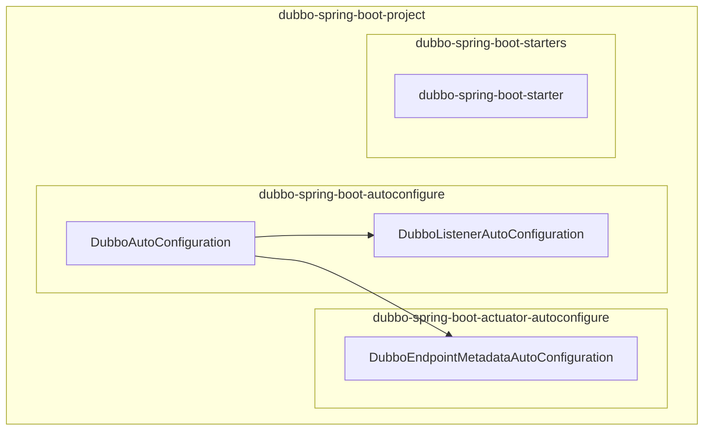
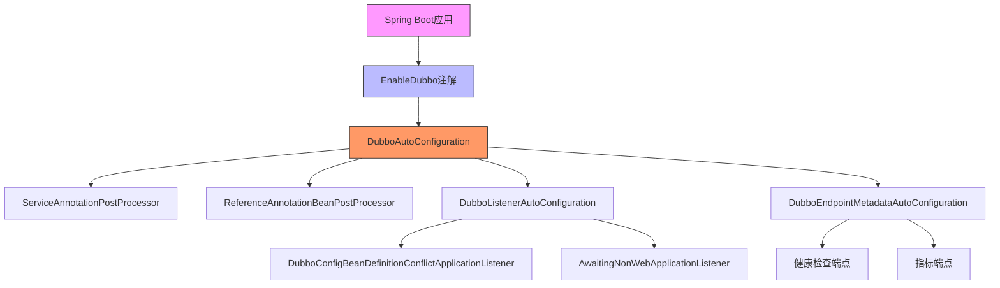
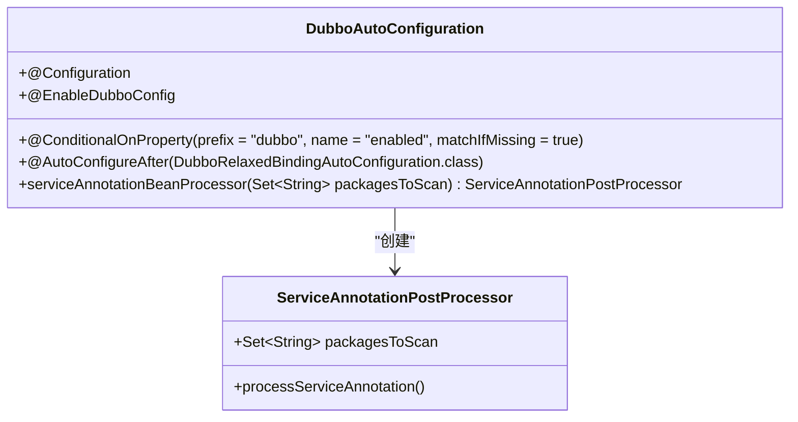
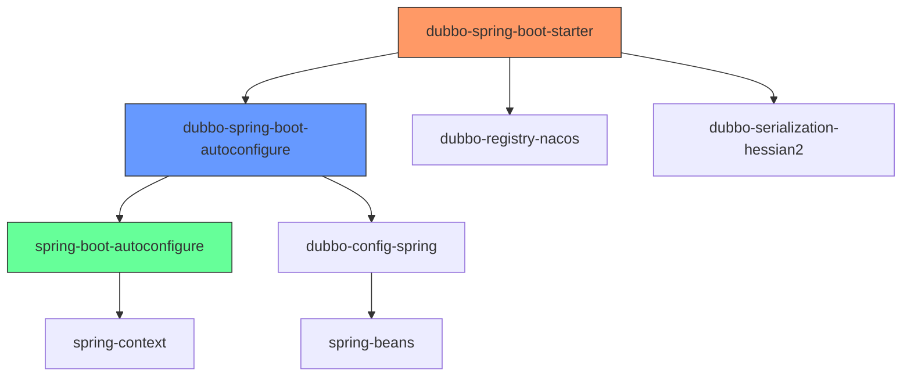

# Spring Boot集成

<cite>
**本文档引用的文件**   
- [DubboAutoConfiguration.java](file://dubbo-spring-boot-project/dubbo-spring-boot-autoconfigure/src/main/java/org/apache/dubbo/spring/boot/autoconfigure/DubboAutoConfiguration.java)
- [DubboListenerAutoConfiguration.java](file://dubbo-spring-boot-project/dubbo-spring-boot-autoconfigure/src/main/java/org/apache/dubbo/spring/boot/autoconfigure/DubboListenerAutoConfiguration.java)
- [DubboEndpointMetadataAutoConfiguration.java](file://dubbo-spring-boot-project/dubbo-spring-boot-actuator-autoconfigure/src/main/java/org/apache/dubbo/spring/boot/actuate/autoconfigure/DubboEndpointMetadataAutoConfiguration.java)
- [EnableDubbo.java](file://dubbo-config/dubbo-config-spring/src/main/java/org/apache/dubbo/config/spring/context/annotation/EnableDubbo.java)
- [dubbo-demo-spring-boot-provider/pom.xml](file://dubbo-demo/dubbo-demo-spring-boot/dubbo-demo-spring-boot-provider/pom.xml)
- [dubbo-demo-spring-boot-consumer/pom.xml](file://dubbo-demo/dubbo-demo-spring-boot/dubbo-demo-spring-boot-consumer/pom.xml)
- [application.yml](file://dubbo-demo/dubbo-demo-spring-boot/dubbo-demo-spring-boot-provider/src/main/resources/application.yml)
</cite>

## 目录
1. [简介](#简介)
2. [项目结构](#项目结构)
3. [核心组件](#核心组件)
4. [架构概述](#架构概述)
5. [详细组件分析](#详细组件分析)
6. [依赖分析](#依赖分析)
7. [性能考虑](#性能考虑)
8. [故障排除指南](#故障排除指南)
9. [结论](#结论)

## 简介
本文档全面介绍了Apache Dubbo与Spring Boot的集成机制，重点阐述了自动配置的实现方式、Spring Boot Starter的使用方法以及与Spring Boot Actuator的集成。文档为初学者提供了快速入门指南，同时也为经验丰富的开发者提供了高级配置选项和自定义自动配置的实现方式。

## 项目结构
Apache Dubbo项目采用模块化设计，其中与Spring Boot集成相关的模块主要位于`dubbo-spring-boot-project`目录下。该目录包含自动配置、执行器集成和启动器等关键组件。



**图示来源**
- [DubboAutoConfiguration.java](file://dubbo-spring-boot-project/dubbo-spring-boot-autoconfigure/src/main/java/org/apache/dubbo/spring/boot/autoconfigure/DubboAutoConfiguration.java)
- [DubboListenerAutoConfiguration.java](file://dubbo-spring-boot-project/dubbo-spring-boot-autoconfigure/src/main/java/org/apache/dubbo/spring/boot/autoconfigure/DubboListenerAutoConfiguration.java)
- [DubboEndpointMetadataAutoConfiguration.java](file://dubbo-spring-boot-project/dubbo-spring-boot-actuator-autoconfigure/src/main/java/org/apache/dubbo/spring/boot/actuate/autoconfigure/DubboEndpointMetadataAutoConfiguration.java)

**本节来源**
- [dubbo-spring-boot-project](file://dubbo-spring-boot-project)

## 核心组件

Dubbo与Spring Boot集成的核心组件包括自动配置类、注解处理器和执行器端点。这些组件共同实现了Dubbo服务的无缝集成和管理。

**本节来源**
- [DubboAutoConfiguration.java](file://dubbo-spring-boot-project/dubbo-spring-boot-autoconfigure/src/main/java/org/apache/dubbo/spring/boot/autoconfigure/DubboAutoConfiguration.java)
- [EnableDubbo.java](file://dubbo-config/dubbo-config-spring/src/main/java/org/apache/dubbo/config/spring/context/annotation/EnableDubbo.java)

## 架构概述

Dubbo与Spring Boot的集成架构基于Spring Boot的自动配置机制，通过@EnableDubbo注解启用Dubbo功能，并利用Spring Boot Starter简化依赖管理。



**图示来源**
- [DubboAutoConfiguration.java](file://dubbo-spring-boot-project/dubbo-spring-boot-autoconfigure/src/main/java/org/apache/dubbo/spring/boot/autoconfigure/DubboAutoConfiguration.java)
- [DubboListenerAutoConfiguration.java](file://dubbo-spring-boot-project/dubbo-spring-boot-autoconfigure/src/main/java/org/apache/dubbo/spring/boot/autoconfigure/DubboListenerAutoConfiguration.java)
- [DubboEndpointMetadataAutoConfiguration.java](file://dubbo-spring-boot-project/dubbo-spring-boot-actuator-autoconfigure/src/main/java/org/apache/dubbo/spring/boot/actuate/autoconfigure/DubboEndpointMetadataAutoConfiguration.java)

## 详细组件分析

### 自动配置组件分析

Dubbo的自动配置通过DubboAutoConfiguration类实现，该类使用条件化配置确保只有在特定条件下才会创建相应的Bean。

#### 自动配置类


**图示来源**
- [DubboAutoConfiguration.java](file://dubbo-spring-boot-project/dubbo-spring-boot-autoconfigure/src/main/java/org/apache/dubbo/spring/boot/autoconfigure/DubboAutoConfiguration.java)
- [ServiceAnnotationPostProcessor](file://dubbo-config/dubbo-config-spring/src/main/java/org/apache/dubbo/config/spring/beans/factory/annotation/ServiceAnnotationPostProcessor.java)

### 注解驱动组件分析

@EnableDubbo注解是Dubbo与Spring Boot集成的关键，它组合了多个注解来启用Dubbo功能。

#### EnableDubbo注解
```mermaid
classDiagram
class EnableDubbo {
+String[] scanBasePackages() default {}
+Class<?>[] scanBasePackageClasses() default {}
+boolean multipleConfig() default true
}
class EnableDubboConfig {
+boolean multiple() default true
}
class DubboComponentScan {
+String[] basePackages() default {}
+Class<?>[] basePackageClasses() default {}
}
EnableDubbo --> EnableDubboConfig : "@EnableDubboConfig"
EnableDubbo --> DubboComponentScan : "@DubboComponentScan"
```

**图示来源**
- [EnableDubbo.java](file://dubbo-config/dubbo-config-spring/src/main/java/org/apache/dubbo/config/spring/context/annotation/EnableDubbo.java)

### 执行器集成组件分析

Dubbo与Spring Boot Actuator的集成通过DubboEndpointMetadataAutoConfiguration类实现，提供了健康检查等监控功能。

#### 执行器元数据配置
```mermaid
classDiagram
class DubboEndpointMetadataAutoConfiguration {
+@ConditionalOnProperty(prefix = "dubbo", name = "enabled", matchIfMissing = true)
+@ConditionalOnClass(name = "org.springframework.boot.actuate.health.Health")
+@Configuration
+@AutoConfigureAfter({DubboAutoConfiguration.class, DubboRelaxedBindingAutoConfiguration.class})
+@ComponentScan(basePackageClasses = AbstractDubboMetadata.class)
}
class AbstractDubboMetadata {
+Map~String, Object~ getMetadata()
}
DubboEndpointMetadataAutoConfiguration --> AbstractDubboMetadata : "组件扫描"
```

**图示来源**
- [DubboEndpointMetadataAutoConfiguration.java](file://dubbo-spring-boot-project/dubbo-spring-boot-actuator-autoconfigure/src/main/java/org/apache/dubbo/spring/boot/actuate/autoconfigure/DubboEndpointMetadataAutoConfiguration.java)

**本节来源**
- [DubboAutoConfiguration.java](file://dubbo-spring-boot-project/dubbo-spring-boot-autoconfigure/src/main/java/org/apache/dubbo/spring/boot/autoconfigure/DubboAutoConfiguration.java)
- [DubboListenerAutoConfiguration.java](file://dubbo-spring-boot-project/dubbo-spring-boot-autoconfigure/src/main/java/org/apache/dubbo/spring/boot/autoconfigure/DubboListenerAutoConfiguration.java)
- [DubboEndpointMetadataAutoConfiguration.java](file://dubbo-spring-boot-project/dubbo-spring-boot-actuator-autoconfigure/src/main/java/org/apache/dubbo/spring/boot/actuate/autoconfigure/DubboEndpointMetadataAutoConfiguration.java)

## 依赖分析

Dubbo与Spring Boot的集成依赖关系清晰，通过Maven的依赖管理机制实现。



**图示来源**
- [dubbo-spring-boot-starter/pom.xml](file://dubbo-spring-boot-project/dubbo-spring-boot-starters/dubbo-spring-boot-starter/pom.xml)
- [dubbo-spring-boot-autoconfigure/pom.xml](file://dubbo-spring-boot-project/dubbo-spring-boot-autoconfigure/pom.xml)

**本节来源**
- [dubbo-spring-boot-starter/pom.xml](file://dubbo-spring-boot-project/dubbo-spring-boot-starters/dubbo-spring-boot-starter/pom.xml)
- [dubbo-spring-boot-autoconfigure/pom.xml](file://dubbo-spring-boot-project/dubbo-spring-boot-autoconfigure/pom.xml)

## 性能考虑

Dubbo与Spring Boot集成时的性能考虑主要包括自动配置的条件化处理、Bean的延迟初始化以及监控端点的开销。

- 自动配置使用@ConditionalOnProperty等条件注解，避免不必要的Bean创建
- 服务暴露和引用采用延迟初始化策略，减少启动时间
- 执行器端点默认启用，但可以通过配置关闭以减少运行时开销
- 配置属性绑定采用松散绑定模式，提高配置的灵活性

## 故障排除指南

### 常见问题及解决方案

1. **Dubbo服务未正确注册**
   - 检查是否在主应用类上添加了@EnableDubbo注解
   - 确认服务类上使用了@DubboService注解
   - 检查application.yml中的dubbo配置是否正确

2. **引用服务失败**
   - 确认引用方使用了@DubboReference注解
   - 检查服务提供方是否正常启动并注册
   - 验证网络连接和注册中心配置

3. **自动配置未生效**
   - 确认pom.xml中包含了dubbo-spring-boot-starter依赖
   - 检查Spring Boot版本是否兼容
   - 验证配置文件中的dubbo.enabled是否设置为true

**本节来源**
- [application.yml](file://dubbo-demo/dubbo-demo-spring-boot/dubbo-demo-spring-boot-provider/src/main/resources/application.yml)
- [DubboAutoConfiguration.java](file://dubbo-spring-boot-project/dubbo-spring-boot-autoconfigure/src/main/java/org/apache/dubbo/spring/boot/autoconfigure/DubboAutoConfiguration.java)

## 结论

Apache Dubbo与Spring Boot的集成通过自动配置机制实现了无缝对接，开发者只需添加少量配置即可享受Dubbo的强大功能。通过@EnableDubbo注解启用Dubbo功能，使用Spring Boot Starter简化依赖管理，并通过与Spring Boot Actuator的集成实现服务监控。这种集成方式既保持了Dubbo的核心功能，又充分利用了Spring Boot的便利性，为微服务架构提供了强大的支持。