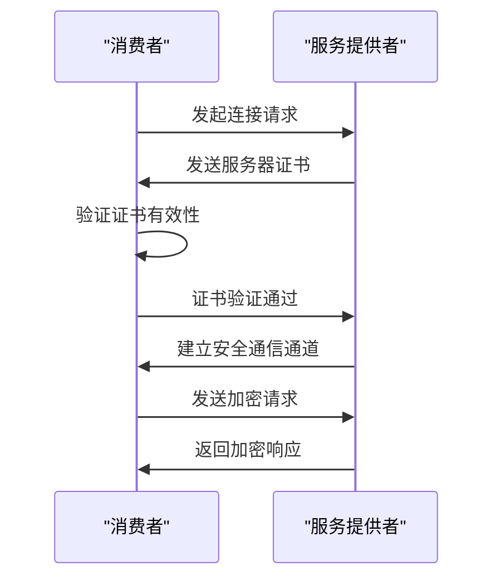
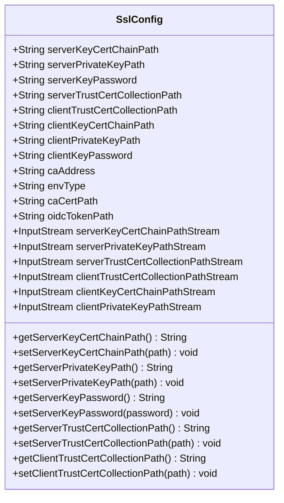
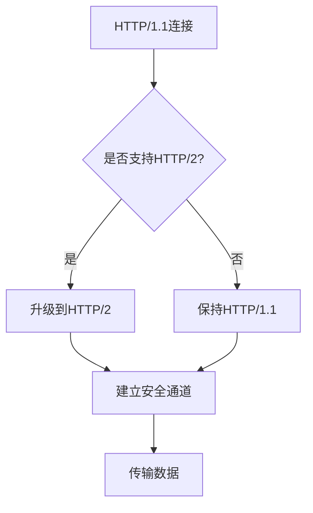

# 单向认证

<cite>
**本文档引用文件**   
- [SslConfig.java](file://dubbo-common\src\main\java\org\apache\dubbo\config\SslConfig.java)
- [SSLConfigCertProvider.java](file://dubbo-common\src\main\java\org\apache\dubbo\common\ssl\impl\SSLConfigCertProvider.java)
- [SslContexts.java](file://dubbo-remoting\dubbo-remoting-netty4\src\main\java\org\apache\dubbo\remoting\transport\netty4\ssl\SslContexts.java)
- [Http3SslContexts.java](file://dubbo-remoting\dubbo-remoting-http3\src\main\java\org\apache\dubbo\remoting\http3\Http3SslContexts.java)
- [CertManager.java](file://dubbo-common\src\main\java\org\apache\dubbo\common\ssl\CertManager.java)
- [TripleHttp2Protocol.java](file://dubbo-rpc\dubbo-rpc-triple\src\main\java\org\apache\dubbo\rpc\protocol\tri\TripleHttp2Protocol.java)
- [DubboProtocol.java](file://dubbo-rpc\dubbo-rpc-dubbo\src\main\java\org\apache\dubbo\rpc\protocol\dubbo\DubboProtocol.java)
</cite>

## 目录
1. [简介](#简介)
2. [单向认证实现机制](#单向认证实现机制)
3. [SslConfig配置类详解](#sslconfig配置类详解)
4. [证书文件格式与存放位置](#证书文件格式与存放位置)
5. [配置示例](#配置示例)
6. [不同通信协议的实现差异](#不同通信协议的实现差异)
7. [配置步骤指南](#配置步骤指南)
8. [高级扩展方法](#高级扩展方法)
9. [性能影响与优化策略](#性能影响与优化策略)
10. [常见配置错误与排查方法](#常见配置错误与排查方法)

## 简介
单向认证是SSL/TLS安全通信的基础模式，其中客户端验证服务器身份，确保通信的安全性。在Dubbo框架中，通过SslConfig配置类和相关的安全组件实现了这一机制。本文档全面解释Dubbo中SSL/TLS单向认证的实现机制，详细描述SslConfig配置类中与单向认证相关的属性配置方法，以及在不同通信协议中的具体实现差异。

## 单向认证实现机制
Dubbo中的单向认证实现基于Java的SSL/TLS标准，通过Netty等底层网络框架提供安全通信支持。核心实现机制包括证书管理、SSL上下文构建和安全通道建立三个主要部分。

在服务提供者端，系统通过SslConfig配置类获取服务器证书和私钥，构建服务器端的SSL上下文。在消费者端，系统配置信任的CA证书，用于验证服务器身份。认证过程遵循标准的SSL/TLS握手协议，客户端验证服务器证书的有效性，包括证书链的完整性和证书颁发机构的可信度。



**图示来源**
- [SslContexts.java](file://dubbo-remoting\dubbo-remoting-netty4\src\main\java\org\apache\dubbo\remoting\transport\netty4\ssl\SslContexts.java#L50-L97)
- [Http3SslContexts.java](file://dubbo-remoting\dubbo-remoting-http3\src\main\java\org\apache\dubbo\remoting\http3\Http3SslContexts.java#L49-L85)

## SslConfig配置类详解
SslConfig是Dubbo中用于配置SSL/TLS安全通信的核心类，定义了与单向认证相关的各种属性。

### 服务器端配置属性
服务器端配置属性主要用于服务提供者端，定义服务器的证书和密钥信息：

- **server-key-cert-chain-path**: 服务器密钥证书链文件的路径
- **server-private-key-path**: 服务器私钥文件的路径
- **server-key-password**: 服务器私钥的密码（如果适用）
- **server-trust-cert-collection-path**: 服务器信任的证书集合文件路径

### 客户端配置属性
客户端配置属性主要用于消费者端，定义客户端的信任证书信息：

- **client-trust-cert-collection-path**: 客户端信任的CA证书集合文件路径
- **client-key-cert-chain-path**: 客户端证书链文件路径（在双向认证中使用）
- **client-private-key-path**: 客户端私钥文件路径（在双向认证中使用）
- **client-key-password**: 客户端私钥密码（如果适用）

### 配置属性的实现
SslConfig类通过Java Bean的方式提供配置属性的getter和setter方法，同时支持通过流的方式直接提供证书内容，增加了配置的灵活性。



**图示来源**
- [SslConfig.java](file://dubbo-common\src\main\java\org\apache\dubbo\config\SslConfig.java#L55-L90)

## 证书文件格式与存放位置
### 证书文件格式要求
Dubbo支持多种证书文件格式，主要包括：

- **PEM格式**: 文本格式，以"-----BEGIN CERTIFICATE-----"开头，以"-----END CERTIFICATE-----"结尾，是推荐使用的格式
- **JKS格式**: Java密钥库格式，二进制格式，需要指定密码访问
- **PKCS12格式**: 通用的密钥库格式，支持存储私钥和证书链

### 证书文件存放位置
证书文件可以存放在以下位置：

- **文件系统路径**: 使用绝对路径或相对路径指定证书文件位置
- **类路径**: 使用"classpath:"前缀指定类路径下的证书文件
- **URL资源**: 支持从HTTP、FTP等网络位置加载证书文件

### 证书文件示例
在Dubbo的测试资源中，提供了标准的PEM格式证书文件示例：

- **ca.pem**: CA根证书文件
- **server.pem**: 服务器证书文件
- **client.pem**: 客户端证书文件
- **key.pem**: 私钥文件

这些文件通常存放在项目的resources/certs目录下，便于测试和开发使用。

**本节来源**
- [SslConfig.java](file://dubbo-common\src\main\java\org\apache\dubbo\config\SslConfig.java#L55-L90)
- [SSLConfigCertProviderTest.java](file://dubbo-common\src\test\java\org\apache\dubbo\common\ssl\SSLConfigCertProviderTest.java#L64-L67)

## 配置示例
### 服务提供者端配置
在服务提供者端，需要配置服务器证书和私钥，以便客户端验证服务器身份。

```java
SslConfig sslConfig = new SslConfig();
sslConfig.setServerKeyCertChainPath("classpath:certs/server.pem");
sslConfig.setServerPrivateKeyPath("classpath:certs/key.pem");
sslConfig.setServerKeyPassword("password");
```

在Spring配置文件中，可以使用XML方式配置：

```xml
<dubbo:ssl 
    server-key-cert-chain-path="classpath:certs/server.pem"
    server-private-key-path="classpath:certs/key.pem"
    server-key-password="password"/>
```

### 消费者端配置
在消费者端，需要配置信任的CA证书，用于验证服务器证书的有效性。

```java
SslConfig sslConfig = new SslConfig();
sslConfig.setClientTrustCertCollectionPath("classpath:certs/ca.pem");
```

在Spring配置文件中：

```xml
<dubbo:ssl 
    client-trust-cert-collection-path="classpath:certs/ca.pem"/>
```

### 完整配置示例
以下是一个完整的单向认证配置示例：

```java
// 创建SSL配置
SslConfig sslConfig = new SslConfig();

// 服务器端配置
sslConfig.setServerKeyCertChainPath("classpath:certs/server.pem");
sslConfig.setServerPrivateKeyPath("classpath:certs/key.pem");
sslConfig.setServerKeyPassword("changeit");

// 客户端信任配置
sslConfig.setClientTrustCertCollectionPath("classpath:certs/ca.pem");

// 应用配置
applicationConfig.setSsl(sslConfig);
```

**本节来源**
- [SslConfig.java](file://dubbo-common\src\main\java\org\apache\dubbo\config\SslConfig.java#L148-L182)
- [SSLConfigCertProviderTest.java](file://dubbo-common\src\test\java\org\apache\dubbo\common\ssl\SSLConfigCertProviderTest.java#L64-L67)

## 不同通信协议的实现差异
### Triple协议中的实现
Triple协议基于HTTP/2和gRPC，其SSL/TLS实现具有以下特点：

- 使用Netty的HTTP/2编解码器进行安全通信
- 支持ALPN（应用层协议协商）进行协议升级
- 在HTTP/1.1基础上支持升级到HTTP/2
- 配置了HTTP/2的特定参数，如流控制、帧大小等



**图示来源**
- [TripleHttp2Protocol.java](file://dubbo-rpc\dubbo-rpc-triple\src\main\java\org\apache\dubbo\rpc\protocol\tri\TripleHttp2Protocol.java#L144-L167)

### Dubbo协议中的实现
Dubbo协议是Dubbo框架的原生协议，其SSL/TLS实现特点包括：

- 基于Netty的自定义编解码器
- 支持端口统一（Port Unification）技术
- 使用Dubbo特有的消息格式和序列化方式
- 提供了更细粒度的连接管理和心跳机制

### 实现差异对比
| 特性 | Triple协议 | Dubbo协议 |
|------|-----------|----------|
| 基础协议 | HTTP/2 | 自定义二进制协议 |
| 编解码器 | Netty HTTP/2编解码器 | Dubbo自定义编解码器 |
| 协议升级 | 支持HTTP/1.1到HTTP/2升级 | 不支持协议升级 |
| 流控制 | HTTP/2流控制机制 | Dubbo自定义流控制 |
| 性能特点 | 高并发、低延迟 | 高吞吐量、低开销 |

**本节来源**
- [TripleHttp2Protocol.java](file://dubbo-rpc\dubbo-rpc-triple\src\main\java\org\apache\dubbo\rpc\protocol\tri\TripleHttp2Protocol.java#L144-L249)
- [DubboProtocol.java](file://dubbo-rpc\dubbo-rpc-dubbo\src\main\java\org\apache\dubbo\rpc\protocol\dubbo\DubboProtocol.java#L397-L416)

## 配置步骤指南
### 初学者配置步骤
对于初学者，以下是简单的单向认证配置步骤：

1. **准备证书文件**
   - 获取或生成CA根证书（ca.pem）
   - 获取或生成服务器证书（server.pem）
   - 获取或生成服务器私钥（key.pem）
   - 将证书文件放置在项目的resources/certs目录下

2. **配置服务提供者**
   ```java
   // 创建应用配置
   ApplicationConfig applicationConfig = new ApplicationConfig();
   
   // 创建SSL配置
   SslConfig sslConfig = new SslConfig();
   sslConfig.setServerKeyCertChainPath("classpath:certs/server.pem");
   sslConfig.setServerPrivateKeyPath("classpath:certs/key.pem");
   sslConfig.setServerKeyPassword("changeit");
   
   // 应用SSL配置
   applicationConfig.setSsl(sslConfig);
   ```

3. **配置消费者**
   ```java
   // 创建引用配置
   ReferenceConfig<DemoService> reference = new ReferenceConfig<>();
   
   // 创建SSL配置
   SslConfig sslConfig = new SslConfig();
   sslConfig.setClientTrustCertCollectionPath("classpath:certs/ca.pem");
   
   // 应用SSL配置
   reference.setSsl(sslConfig);
   ```

4. **启动服务**
   - 启动服务提供者
   - 启动消费者并调用服务

### 验证配置
配置完成后，可以通过以下方式验证单向认证是否正常工作：

- 检查服务启动日志，确认SSL上下文创建成功
- 使用网络抓包工具检查通信是否加密
- 尝试使用无效证书，确认连接被拒绝

**本节来源**
- [SslConfig.java](file://dubbo-common\src\main\java\org\apache\dubbo\config\SslConfig.java#L148-L182)
- [SSLConfigCertProviderTest.java](file://dubbo-common\src\test\java\org\apache\dubbo\common\ssl\SSLConfigCertProviderTest.java#L58-L67)

## 高级扩展方法
### 自定义证书验证逻辑
对于高级用户，可以扩展默认的证书验证逻辑，实现更复杂的验证策略。

```java
public class CustomCertProvider implements CertProvider {
    @Override
    public boolean isSupport(URL address) {
        // 自定义支持条件判断
        return address.getParameter("ssl-enabled", false);
    }
    
    @Override
    public ProviderCert getProviderConnectionConfig(URL localAddress) {
        // 自定义服务器证书配置
        return new ProviderCert(
            loadCertificate("custom-server-cert.pem"),
            loadPrivateKey("custom-server-key.pem"),
            null,
            "custom-password",
            AuthPolicy.NONE
        );
    }
    
    @Override
    public Cert getConsumerConnectionConfig(URL remoteAddress) {
        // 自定义客户端信任配置
        return new Cert(
            loadCertificate("custom-client-cert.pem"),
            loadPrivateKey("custom-client-key.pem"),
            loadCertificate("custom-trust-ca.pem"),
            "custom-password"
        );
    }
}
```

### 信任管理器扩展
可以扩展信任管理器，实现自定义的信任策略：

```java
public class CustomTrustManager extends X509ExtendedTrustManager {
    @Override
    public void checkClientTrusted(X509Certificate[] chain, String authType) {
        // 自定义客户端信任检查
    }
    
    @Override
    public void checkServerTrusted(X509Certificate[] chain, String authType) {
        // 自定义服务器信任检查
        // 可以添加额外的验证逻辑，如证书吊销检查、时间有效性检查等
    }
    
    @Override
    public X509Certificate[] getAcceptedIssuers() {
        return new X509Certificate[0];
    }
}
```

### 动态证书加载
实现动态证书加载机制，支持证书的热更新：

```java
public class DynamicCertProvider implements CertProvider {
    private volatile ProviderCert currentCert;
    private ScheduledExecutorService refreshScheduler;
    
    @PostConstruct
    public void init() {
        // 初始化证书
        refreshCert();
        
        // 启动定期刷新任务
        refreshScheduler = Executors.newSingleThreadScheduledExecutor();
        refreshScheduler.scheduleAtFixedRate(
            this::refreshCert, 
            0, 
            1, 
            TimeUnit.HOURS
        );
    }
    
    private void refreshCert() {
        // 重新加载证书
        ProviderCert newCert = loadCertFromSecureStorage();
        if (newCert != null) {
            currentCert = newCert;
        }
    }
    
    @Override
    public ProviderCert getProviderConnectionConfig(URL localAddress) {
        return currentCert;
    }
}
```

**本节来源**
- [CertProvider.java](file://dubbo-common\src\main\java\org\apache\dubbo\common\ssl\CertProvider.java#L26-L40)
- [SSLConfigCertProvider.java](file://dubbo-common\src\main\java\org\apache\dubbo\common\ssl\impl\SSLConfigCertProvider.java#L34-L74)

## 性能影响与优化策略
### 性能影响分析
SSL/TLS单向认证对系统性能有一定影响，主要体现在以下几个方面：

- **握手开销**: SSL/TLS握手过程需要额外的网络往返和计算资源
- **加密解密开销**: 数据传输过程中的加密和解密操作消耗CPU资源
- **内存开销**: SSL会话状态和密钥材料需要额外的内存空间
- **连接建立延迟**: 安全连接的建立时间比普通连接长

### 优化策略
#### 会话复用
启用SSL会话复用，减少握手开销：

```java
SslContextBuilder builder = SslContextBuilder.forServer(
    keyCertChainInputStream, 
    privateKeyInputStream
);
// 启用会话缓存
builder.sessionCacheSize(1000);
builder.sessionTimeout(86400); // 24小时
```

#### 连接池优化
使用连接池减少连接建立开销：

```java
// 配置连接池大小
protocolConfig.setConnections(10);
// 启用共享连接
protocolConfig.setShareConnections(5);
```

#### 算法优化
选择性能更好的加密算法：

```java
// 优先使用性能更好的加密套件
SslContextBuilder builder = SslContextBuilder.forServer(
    keyCertChainInputStream, 
    privateKeyInputStream
);
builder.ciphers(Arrays.asList(
    "TLS_ECDHE_RSA_WITH_AES_128_GCM_SHA256",
    "TLS_ECDHE_RSA_WITH_AES_256_GCM_SHA384"
));
```

#### 异步处理
使用异步I/O减少阻塞：

```java
// 使用Netty的异步处理能力
EventLoopGroup bossGroup = new NioEventLoopGroup();
EventLoopGroup workerGroup = new NioEventLoopGroup();
```

### 性能监控
建立性能监控机制，及时发现和解决性能问题：

```java
// 监控SSL握手时间
long handshakeStartTime = System.currentTimeMillis();
// ... SSL握手过程 ...
long handshakeTime = System.currentTimeMillis() - handshakeStartTime;
if (handshakeTime > 1000) { // 超过1秒
    logger.warn("SSL handshake time too long: " + handshakeTime + "ms");
}
```

**本节来源**
- [SslContexts.java](file://dubbo-remoting\dubbo-remoting-netty4\src\main\java\org\apache\dubbo\remoting\transport\netty4\ssl\SslContexts.java#L84-L93)
- [TripleHttp2Protocol.java](file://dubbo-rpc\dubbo-rpc-triple\src\main\java\org\apache\dubbo\rpc\protocol\tri\TripleHttp2Protocol.java#L100-L121)

## 常见配置错误与排查方法
### 常见配置错误
#### 证书路径错误
最常见的错误是证书文件路径配置错误：

```java
// 错误示例
sslConfig.setServerKeyCertChainPath("certs/server.pem"); // 缺少classpath:前缀

// 正确示例
sslConfig.setServerKeyCertChainPath("classpath:certs/server.pem");
```

#### 密码错误
私钥密码配置错误会导致SSL上下文创建失败：

```java
// 错误示例
sslConfig.setServerKeyPassword("wrong-password");

// 正确做法：确保密码正确
sslConfig.setServerKeyPassword("correct-password");
```

#### 证书不匹配
服务器证书和私钥不匹配：

```java
// 错误示例：使用了错误的私钥
sslConfig.setServerKeyCertChainPath("classpath:certs/server.pem");
sslConfig.setServerPrivateKeyPath("classpath:certs/wrong-key.pem"); // 错误的私钥

// 正确做法：确保证书和私钥匹配
sslConfig.setServerPrivateKeyPath("classpath:certs/server-key.pem");
```

### 排查方法
#### 日志分析
通过分析日志信息定位问题：

```java
// 启用详细的SSL日志
System.setProperty("javax.net.debug", "ssl,handshake");
```

常见的错误日志包括：
- "Could not find certificate file"：证书文件未找到
- "Invalid certificate"：证书无效
- "Handshake failed"：握手失败

#### 证书验证工具
使用OpenSSL工具验证证书：

```bash
# 验证证书链
openssl verify -CAfile ca.pem server.pem

# 查看证书详细信息
openssl x509 -in server.pem -text -noout
```

#### 逐步排查
采用逐步排查的方法：

1. **检查文件路径**: 确认证书文件路径正确且可访问
2. **验证证书有效性**: 使用工具验证证书是否有效
3. **检查密码**: 确认私钥密码正确
4. **测试连接**: 使用简单客户端测试连接
5. **分析日志**: 查看详细的错误日志信息

#### 调试技巧
使用调试工具和技巧：

```java
// 在关键位置添加调试日志
logger.debug("Loading certificate from: " + certPath);
logger.debug("Certificate loaded successfully");

// 使用断点调试
// 在SslContexts.buildServerSslContext方法中设置断点
```

**本节来源**
- [SslContexts.java](file://dubbo-remoting\dubbo-remoting-netty4\src\main\java\org\apache\dubbo\remoting\transport\netty4\ssl\SslContexts.java#L76-L78)
- [SSLConfigCertProvider.java](file://dubbo-common\src\main\java\org\apache\dubbo\common\ssl\impl\SSLConfigCertProvider.java#L64-L70)