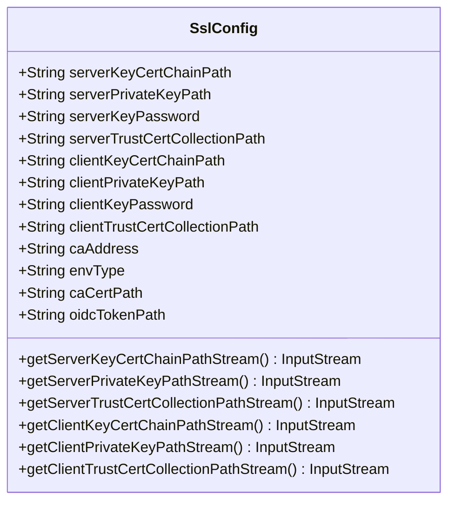
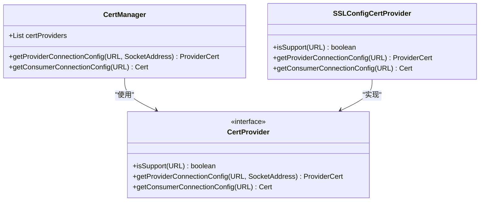
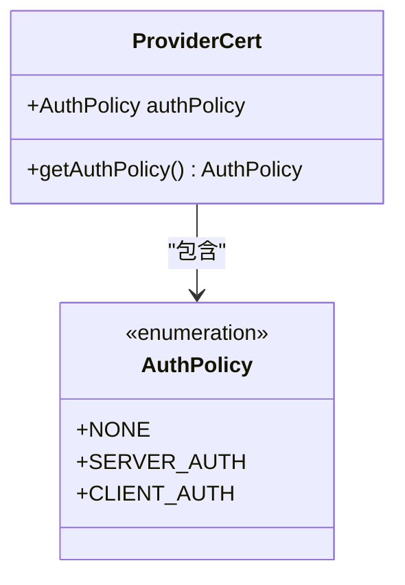
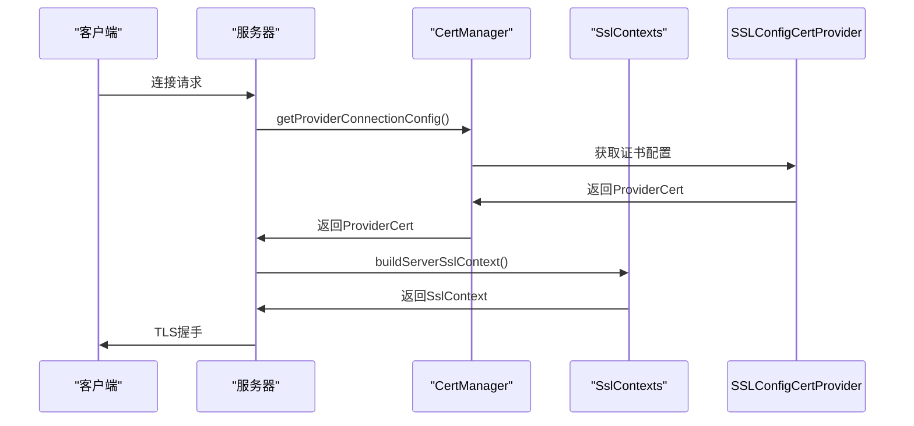
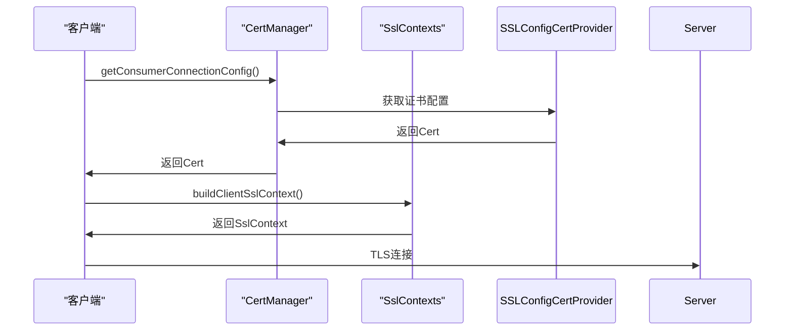
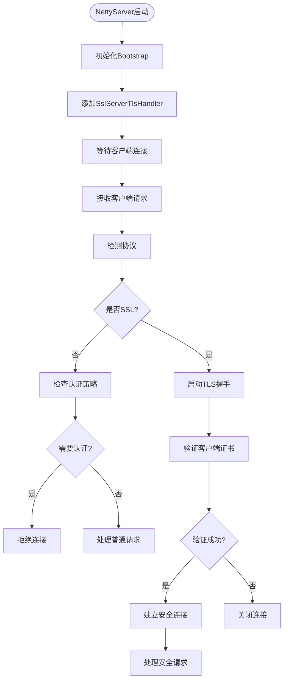
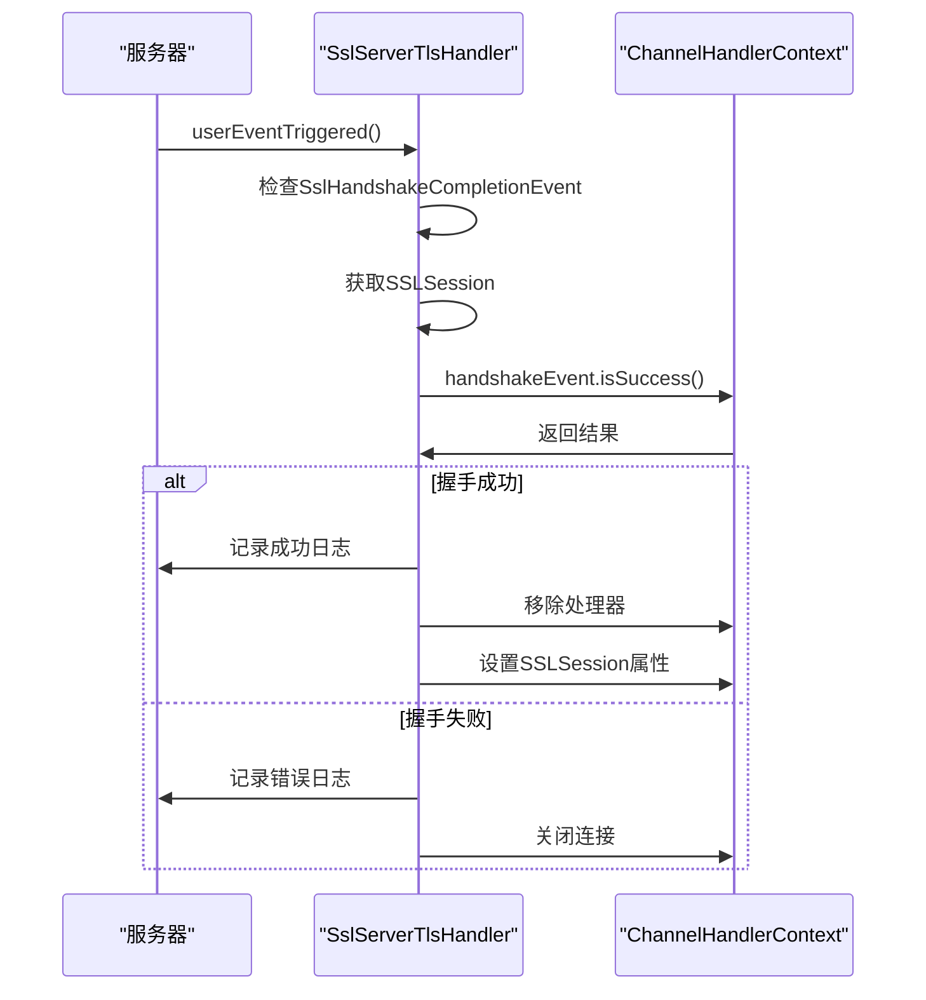
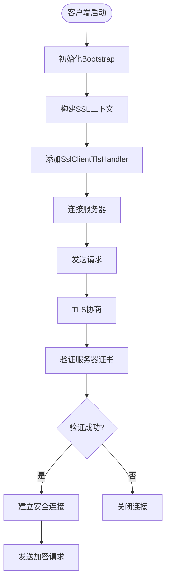
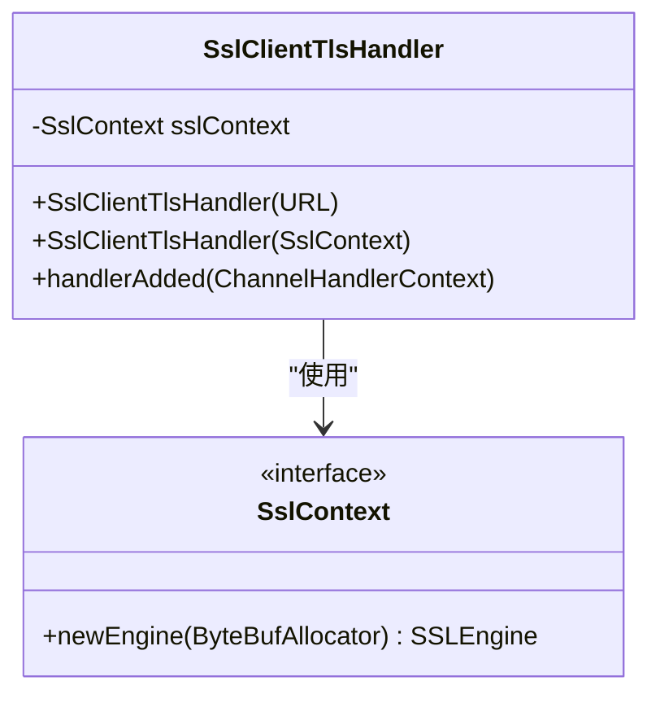
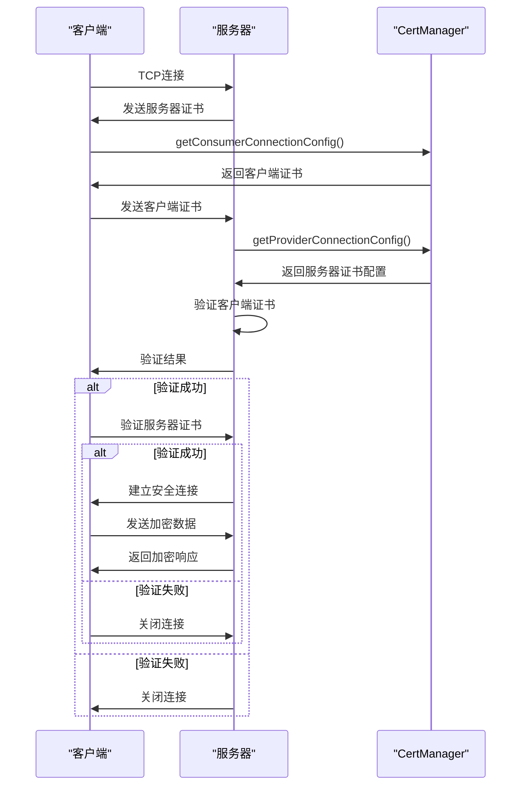

# 双向认证

<cite>
**本文档中引用的文件**  
- [SslConfig.java](file://dubbo-common\src\main\java\org\apache\dubbo\config\SslConfig.java)
- [CertManager.java](file://dubbo-common\src\main\java\org\apache\dubbo\common\ssl\CertManager.java)
- [SSLConfigCertProvider.java](file://dubbo-common\src\main\java\org\apache\dubbo\common\ssl\impl\SSLConfigCertProvider.java)
- [SslContexts.java](file://dubbo-remoting\dubbo-remoting-netty4\src\main\java\org\apache\dubbo\remoting\transport\netty4\ssl\SslContexts.java)
- [Http3SslContexts.java](file://dubbo-remoting\dubbo-remoting-http3\src\main\java\org\apache\dubbo\remoting\http3\Http3SslContexts.java)
- [SslServerTlsHandler.java](file://dubbo-remoting\dubbo-remoting-netty4\src\main\java\org\apache\dubbo\remoting\transport\netty4\ssl\SslServerTlsHandler.java)
- [SslClientTlsHandler.java](file://dubbo-remoting\dubbo-remoting-netty4\src\main\java\org\apache\dubbo\remoting\transport\netty4\ssl\SslClientTlsHandler.java)
- [NettyServer.java](file://dubbo-remoting\dubbo-remoting-netty4\src\main\java\org\apache\dubbo\remoting\transport\netty4\NettyServer.java)
- [NettyClient.java](file://dubbo-remoting\dubbo-remoting-netty4\src\main\java\org\apache\dubbo\remoting\transport\netty4\NettyClient.java)
</cite>

## 目录
1. [引言](#引言)
2. [核心组件](#核心组件)
3. [双向认证配置详解](#双向认证配置详解)
4. [证书管理机制](#证书管理机制)
5. [SSL/TLS上下文构建](#ssl/tls上下文构建)
6. [服务器端实现](#服务器端实现)
7. [客户端实现](#客户端实现)
8. [双向认证流程](#双向认证流程)
9. [配置示例](#配置示例)
10. [最佳实践与故障排查](#最佳实践与故障排查)

## 引言
Dubbo框架提供了完善的SSL/TLS双向认证机制，确保服务提供者和消费者之间的通信安全。本文档全面解析Dubbo中双向认证的实现机制，涵盖SslConfig配置类、证书管理、SSL上下文构建等核心组件的详细工作原理。

## 核心组件

Dubbo的双向认证机制由多个核心组件协同工作，包括SslConfig配置类、CertManager证书管理器、SSLContext构建器以及TLS处理处理器等。这些组件共同实现了服务器和客户端相互验证身份的安全通信机制。

**本节来源**
- [SslConfig.java](file://dubbo-common\src\main\java\org\apache\dubbo\config\SslConfig.java)
- [CertManager.java](file://dubbo-common\src\main\java\org\apache\dubbo\common\ssl\CertManager.java)

## 双向认证配置详解

SslConfig类是Dubbo双向认证的核心配置类，提供了完整的服务器和客户端证书配置属性。

### 服务器端配置属性
- **server-key-cert-chain-path**: 服务器密钥证书链文件路径
- **server-private-key-path**: 服务器私钥文件路径
- **server-key-password**: 服务器私钥密码（可选）
- **server-trust-cert-collection-path**: 服务器信任的CA证书集合文件路径

### 客户端配置属性
- **client-key-cert-chain-path**: 客户端密钥证书链文件路径
- **client-private-key-path**: 客户端私钥文件路径
- **client-key-password**: 客户端私钥密码（可选）
- **client-trust-cert-collection-path**: 客户端信任的CA证书集合文件路径

### 配置类结构


**图表来源**
- [SslConfig.java](file://dubbo-common\src\main\java\org\apache\dubbo\config\SslConfig.java#L42-L327)

**本节来源**
- [SslConfig.java](file://dubbo-common\src\main\java\org\apache\dubbo\config\SslConfig.java)

## 证书管理机制

Dubbo通过CertManager和CertProvider接口实现灵活的证书管理机制，支持多种证书提供方式。

### 证书管理器(CertManager)
CertManager是证书管理的核心类，负责协调多个CertProvider获取服务器和客户端的证书配置。



**图表来源**
- [CertManager.java](file://dubbo-common\src\main\java\org\apache\dubbo\common\ssl\CertManager.java#L25-L56)
- [SSLConfigCertProvider.java](file://dubbo-common\src\main\java\org\apache\dubbo\common\ssl\impl\SSLConfigCertProvider.java#L33-L105)

### 认证策略


**图表来源**
- [AuthPolicy.java](file://dubbo-common\src\main\java\org\apache\dubbo\common\ssl\AuthPolicy.java#L19-L23)
- [ProviderCert.java](file://dubbo-common\src\main\java\org\apache\dubbo\common\ssl\ProviderCert.java#L19-L36)

**本节来源**
- [CertManager.java](file://dubbo-common\src\main\java\org\apache\dubbo\common\ssl\CertManager.java)
- [SSLConfigCertProvider.java](file://dubbo-common\src\main\java\org\apache\dubbo\common\ssl\impl\SSLConfigCertProvider.java)

## SSL/TLS上下文构建

SSL上下文构建是双向认证的关键环节，负责根据配置创建服务器和客户端的SSL会话。

### 服务器端SSL上下文构建


**图表来源**
- [Http3SslContexts.java](file://dubbo-remoting\dubbo-remoting-http3\src\main\java\org\apache\dubbo\remoting\http3\Http3SslContexts.java#L49-L86)
- [SslContexts.java](file://dubbo-remoting\dubbo-remoting-netty4\src\main\java\org\apache\dubbo\remoting\transport\netty4\ssl\SslContexts.java#L140-L189)

### 客户端SSL上下文构建


**图表来源**
- [Http3SslContexts.java](file://dubbo-remoting\dubbo-remoting-http3\src\main\java\org\apache\dubbo\remoting\http3\Http3SslContexts.java#L102-L132)
- [SslContexts.java](file://dubbo-remoting\dubbo-remoting-netty4\src\main\java\org\apache\dubbo\remoting\transport\netty4\ssl\SslContexts.java#L99-L139)

**本节来源**
- [SslContexts.java](file://dubbo-remoting\dubbo-remoting-netty4\src\main\java\org\apache\dubbo\remoting\transport\netty4\ssl\SslContexts.java)
- [Http3SslContexts.java](file://dubbo-remoting\dubbo-remoting-http3\src\main\java\org\apache\dubbo\remoting\http3\Http3SslContexts.java)

## 服务器端实现

服务器端通过NettyServer和SslServerTlsHandler实现TLS握手和认证。

### 服务器启动流程


**图表来源**
- [NettyServer.java](file://dubbo-remoting\dubbo-remoting-netty4\src\main\java\org\apache\dubbo\remoting\transport\netty4\NettyServer.java#L167-L189)
- [SslServerTlsHandler.java](file://dubbo-remoting\dubbo-remoting-netty4\src\main\java\org\apache\dubbo\remoting\transport\netty4\ssl\SslServerTlsHandler.java#L106-L139)

### TLS握手事件处理


**图表来源**
- [SslServerTlsHandler.java](file://dubbo-remoting\dubbo-remoting-netty4\src\main\java\org\apache\dubbo\remoting\transport\netty4\ssl\SslServerTlsHandler.java#L70-L92)
- [NettyPortUnificationServerHandler.java](file://dubbo-remoting\dubbo-remoting-netty4\src\main\java\org\apache\dubbo\remoting\transport\netty4\NettyPortUnificationServerHandler.java#L91-L120)

**本节来源**
- [NettyServer.java](file://dubbo-remoting\dubbo-remoting-netty4\src\main\java\org\apache\dubbo\remoting\transport\netty4\NettyServer.java)
- [SslServerTlsHandler.java](file://dubbo-remoting\dubbo-remoting-netty4\src\main\java\org\apache\dubbo\remoting\transport\netty4\ssl\SslServerTlsHandler.java)

## 客户端实现

客户端通过NettyClient和SslClientTlsHandler实现与服务器的安全连接。

### 客户端连接流程


**图表来源**
- [NettyClient.java](file://dubbo-remoting\dubbo-remoting-netty4\src\main\java\org\apache\dubbo\remoting\transport\netty4\NettyClient.java#L111-L130)
- [NettyConnectionClient.java](file://dubbo-remoting\dubbo-remoting-netty4\src\main\java\org\apache\dubbo\remoting\transport\netty4\NettyConnectionClient.java#L94-L106)

### 客户端TLS处理器


**图表来源**
- [SslClientTlsHandler.java](file://dubbo-remoting\dubbo-remoting-netty4\src\main\java\org\apache\dubbo\remoting\transport\netty4\ssl\SslClientTlsHandler.java#L36-L54)

**本节来源**
- [NettyClient.java](file://dubbo-remoting\dubbo-remoting-netty4\src\main\java\org\apache\dubbo\remoting\transport\netty4\NettyClient.java)
- [SslClientTlsHandler.java](file://dubbo-remoting\dubbo-remoting-netty4\src\main\java\org\apache\dubbo\remoting\transport\netty4\ssl\SslClientTlsHandler.java)

## 双向认证流程

完整的双向认证流程包括服务器和客户端相互验证证书的全过程。



**图表来源**
- [SslConfig.java](file://dubbo-common\src\main\java\org\apache\dubbo\config\SslConfig.java)
- [CertManager.java](file://dubbo-common\src\main\java\org\apache\dubbo\common\ssl\CertManager.java)
- [SslContexts.java](file://dubbo-remoting\dubbo-remoting-netty4\src\main\java\org\apache\dubbo\remoting\transport\netty4\ssl\SslContexts.java)

**本节来源**
- [SslConfig.java](file://dubbo-common\src\main\java\org\apache\dubbo\config\SslConfig.java)
- [CertManager.java](file://dubbo-common\src\main\java\org\apache\dubbo\common\ssl\CertManager.java)

## 配置示例

以下是一个完整的双向认证配置示例：

```java
// 创建SSL配置
SslConfig sslConfig = new SslConfig();

// 服务器端配置
sslConfig.setServerKeyCertChainPath("path/to/server-cert.pem");
sslConfig.setServerPrivateKeyPath("path/to/server-key.pem");
sslConfig.setServerTrustCertCollectionPath("path/to/ca-cert.pem");

// 客户端配置
sslConfig.setClientKeyCertChainPath("path/to/client-cert.pem");
sslConfig.setClientPrivateKeyPath("path/to/client-key.pem");
sslConfig.setClientTrustCertCollectionPath("path/to/ca-cert.pem");

// 应用配置
applicationModel.getApplicationConfigManager().setSsl(sslConfig);
```

在实际应用中，可以通过Spring配置或属性文件进行配置：

```properties
# dubbo.properties
dubbo.ssl.server-key-cert-chain-path=path/to/server-cert.pem
dubbo.ssl.server-private-key-path=path/to/server-key.pem
dubbo.ssl.server-trust-cert-collection-path=path/to/ca-cert.pem
dubbo.ssl.client-key-cert-chain-path=path/to/client-cert.pem
dubbo.ssl.client-private-key-path=path/to/client-key.pem
dubbo.ssl.client-trust-cert-collection-path=path/to/ca-cert.pem
```

**本节来源**
- [TripleHttp3ProtocolTest.java](file://dubbo-rpc\dubbo-rpc-triple\src\test\java\org\apache\dubbo\rpc\protocol\tri\TripleHttp3ProtocolTest.java#L61-L69)

## 最佳实践与故障排查

### 最佳实践
1. **证书管理**: 使用统一的CA签发服务器和客户端证书，确保证书链的完整性
2. **密钥保护**: 私钥文件应设置适当的文件权限，避免未授权访问
3. **证书更新**: 建立证书轮换机制，定期更新证书以提高安全性
4. **性能优化**: 启用SSL会话复用，减少握手开销

### 常见问题排查
1. **连接被拒绝**: 检查服务器是否配置了正确的信任证书集合
2. **证书验证失败**: 确认证书链完整，CA证书正确配置
3. **性能问题**: 监控SSL握手时间，考虑优化密码套件配置
4. **配置不生效**: 确认SslConfig已正确注入到ApplicationModel中

**本节来源**
- [SslConfig.java](file://dubbo-common\src\main\java\org\apache\dubbo\config\SslConfig.java)
- [CertManager.java](file://dubbo-common\src\main\java\org\apache\dubbo\common\ssl\CertManager.java)