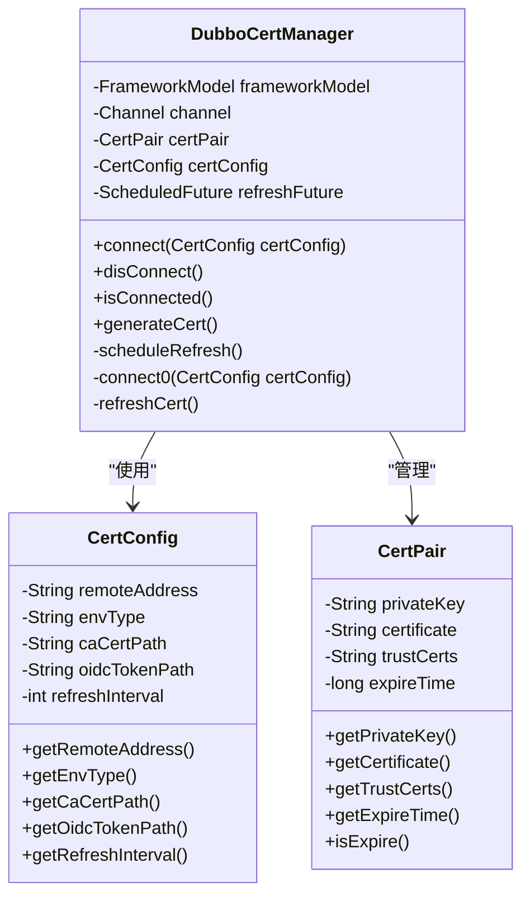
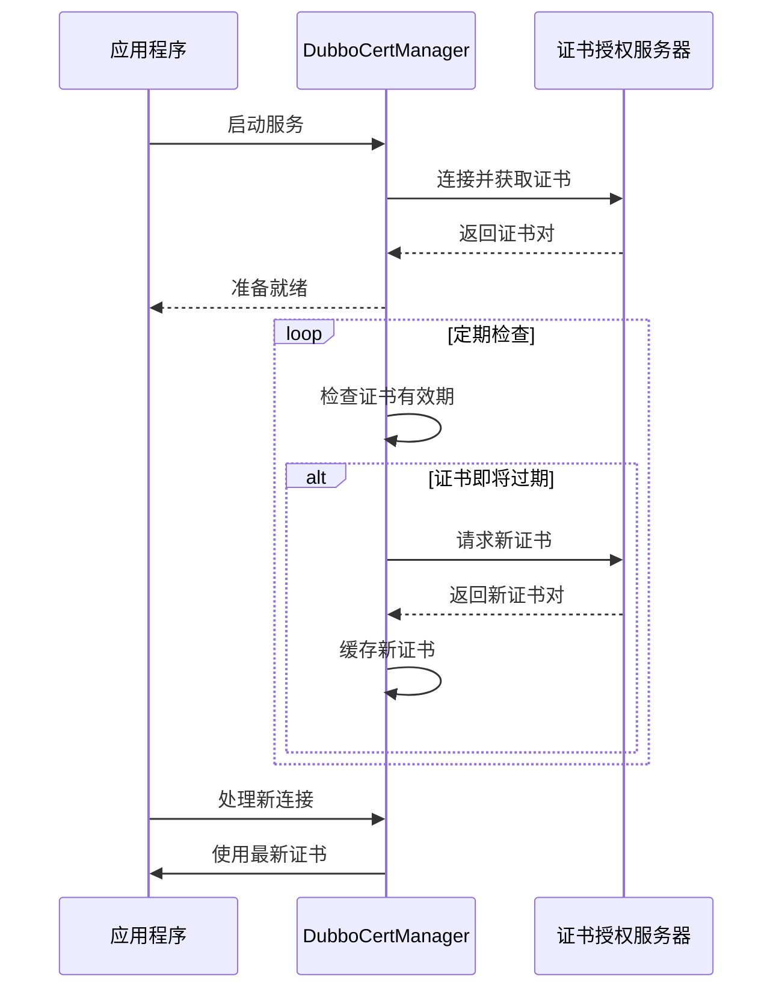
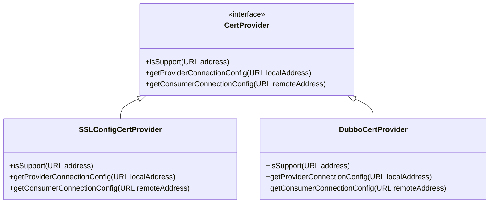

# 证书管理

<cite>
**本文档引用的文件**  
- [CertConfig.java](file://dubbo-plugin\dubbo-security\src\main\java\org\apache\dubbo\security\cert\CertConfig.java)
- [DubboCertManager.java](file://dubbo-plugin\dubbo-security\src\main\java\org\apache\dubbo\security\cert\DubboCertManager.java)
- [CertPair.java](file://dubbo-plugin\dubbo-security\src\main\java\org\apache\dubbo\security\cert\CertPair.java)
- [SslConfig.java](file://dubbo-common\src\main\java\org\apache\dubbo\config\SslConfig.java)
- [SSLConfigCertProvider.java](file://dubbo-common\src\main\java\org\apache\dubbo\common\ssl\impl\SSLConfigCertProvider.java)
- [CertDeployerListener.java](file://dubbo-plugin\dubbo-security\src\main\java\org\apache\dubbo\security\cert\CertDeployerListener.java)
- [DubboCertProvider.java](file://dubbo-plugin\dubbo-security\src\main\java\org\apache\dubbo\security\cert\DubboCertProvider.java)
- [Cert.java](file://dubbo-common\src\main\java\org\apache\dubbo\common\ssl\Cert.java)
</cite>

## 目录
1. [引言](#引言)
2. [证书生命周期管理](#证书生命周期管理)
3. [DubboCertManager核心功能](#dubbocertmanager核心功能)
4. [CertConfig配置类](#certconfig配置类)
5. [证书轮换与平滑过渡](#证书轮换与平滑过渡)
6. [配置示例](#配置示例)
7. [初学者指南](#初学者指南)
8. [高级扩展](#高级扩展)
9. [性能与高可用性](#性能与高可用性)
10. [常见问题处理](#常见问题处理)

## 引言
Dubbo的证书管理机制为微服务架构提供了安全的通信保障。本文档详细解释了Dubbo中证书的生命周期管理，包括证书的加载、缓存、轮换和自动更新机制。通过分析DubboCertManager的核心功能和实现原理，以及CertConfig配置类的相关属性，帮助开发者理解如何配置自动证书更新和监控证书有效期。

## 证书生命周期管理
Dubbo的证书生命周期管理通过DubboCertManager实现，涵盖了证书的加载、缓存、轮换和自动更新等关键环节。当服务启动时，DubboCertManager会根据配置连接到证书授权服务器，获取并缓存证书对。证书对包括私钥、证书链和信任证书，这些信息会被缓存并在证书有效期内重复使用。

证书的加载过程是动态的，支持从文件系统或配置中心获取证书信息。DubboCertManager通过定期调度任务检查证书的有效性，当证书接近过期时，会自动发起证书更新请求。这种机制确保了服务在证书轮换过程中不会中断，实现了平滑过渡。

**Section sources**
- [DubboCertManager.java](file://dubbo-plugin\dubbo-security\src\main\java\org\apache\dubbo\security\cert\DubboCertManager.java#L1-L422)
- [CertConfig.java](file://dubbo-plugin\dubbo-security\src\main\java\org\apache\dubbo\security\cert\CertConfig.java#L1-L87)

## DubboCertManager核心功能
DubboCertManager是证书管理的核心组件，负责与证书授权服务器的通信和证书对的管理。其主要功能包括：

1. **连接管理**：通过connect方法建立与证书授权服务器的gRPC连接，支持安全和非安全连接模式。
2. **证书生成**：通过generateCert方法获取或刷新证书对，该方法会检查当前证书的有效性，必要时发起更新请求。
3. **定期刷新**：通过scheduleRefresh方法创建定时任务，按照配置的刷新间隔定期检查和更新证书。
4. **连接断开**：通过disConnect方法优雅地断开与证书授权服务器的连接，清理相关资源。

DubboCertManager的实现考虑了线程安全和异常处理，确保在高并发场景下的稳定运行。它使用volatile关键字保证多线程环境下的可见性，并通过synchronized块确保关键操作的原子性。



**Diagram sources**
- [DubboCertManager.java](file://dubbo-plugin\dubbo-security\src\main\java\org\apache\dubbo\security\cert\DubboCertManager.java#L1-L422)
- [CertConfig.java](file://dubbo-plugin\dubbo-security\src\main\java\org\apache\dubbo\security\cert\CertConfig.java#L1-L87)
- [CertPair.java](file://dubbo-plugin\dubbo-security\src\main\java\org\apache\dubbo\security\cert\CertPair.java#L1-L74)

**Section sources**
- [DubboCertManager.java](file://dubbo-plugin\dubbo-security\src\main\java\org\apache\dubbo\security\cert\DubboCertManager.java#L1-L422)

## CertConfig配置类
CertConfig类定义了证书管理相关的配置属性，是Dubbo证书管理的基础。其主要属性包括：

- **remoteAddress**：证书授权服务器的地址，用于建立gRPC连接。
- **envType**：环境类型，目前仅支持Kubernetes环境。
- **caCertPath**：CA证书文件路径，用于验证服务器证书。
- **oidcTokenPath**：OIDC令牌文件路径，用于身份验证。
- **refreshInterval**：证书刷新间隔，单位为毫秒，默认值为30000毫秒。

这些配置属性通过构造函数注入，确保了配置的不可变性和线程安全性。CertConfig类还重写了equals和hashCode方法，便于在集合中进行比较和查找。

**Section sources**
- [CertConfig.java](file://dubbo-plugin\dubbo-security\src\main\java\org\apache\dubbo\security\cert\CertConfig.java#L1-L87)

## 证书轮换与平滑过渡
Dubbo的证书轮换机制设计精巧，确保了服务的高可用性和平滑过渡。当证书接近过期时，DubboCertManager会提前发起证书更新请求，获取新的证书对。在新证书生效前，服务继续使用旧证书处理现有连接，同时使用新证书处理新连接。

这种双证书机制避免了证书轮换过程中的连接中断，实现了无缝切换。DubboCertManager通过isExpire方法检查证书的有效性，当系统时间超过证书的过期时间时，标记证书为过期状态，触发更新流程。



**Diagram sources**
- [DubboCertManager.java](file://dubbo-plugin\dubbo-security\src\main\java\org\apache\dubbo\security\cert\DubboCertManager.java#L1-L422)
- [CertPair.java](file://dubbo-plugin\dubbo-security\src\main\java\org\apache\dubbo\security\cert\CertPair.java#L1-L74)

**Section sources**
- [DubboCertManager.java](file://dubbo-plugin\dubbo-security\src\main\java\org\apache\dubbo\security\cert\DubboCertManager.java#L1-L422)
- [CertPair.java](file://dubbo-plugin\dubbo-security\src\main\java\org\apache\dubbo\security\cert\CertPair.java#L1-L74)

## 配置示例
以下是一个典型的证书管理配置示例，展示了如何配置自动证书更新和监控证书有效期：

```xml
<dubbo:ssl 
    ca-address="127.0.0.1:30060" 
    env-type="Kubernetes" 
    ca-cert-path="/path/to/ca.crt" 
    oidc-token-path="/path/to/token" />
```

在Java代码中，可以通过SslConfig类进行配置：

```java
SslConfig sslConfig = new SslConfig();
sslConfig.setCaAddress("127.0.0.1:30060");
sslConfig.setEnvType("Kubernetes");
sslConfig.setCaCertPath("/path/to/ca.crt");
sslConfig.setOidcTokenPath("/path/to/token");
```

**Section sources**
- [SslConfig.java](file://dubbo-common\src\main\java\org\apache\dubbo\config\SslConfig.java#L1-L328)

## 初学者指南
对于初学者，建议从简单的文件系统证书管理开始。首先，在配置文件中指定CA证书路径和OIDC令牌路径，然后启动服务观察日志输出。确保证书授权服务器地址正确，并且网络连接正常。

基本配置步骤：
1. 准备CA证书文件和OIDC令牌文件
2. 在dubbo配置中设置ca-address、ca-cert-path和oidc-token-path
3. 启动服务并检查日志中的证书加载信息
4. 验证服务间的HTTPS通信是否正常

**Section sources**
- [SslConfig.java](file://dubbo-common\src\main\java\org\apache\dubbo\config\SslConfig.java#L1-L328)
- [CertDeployerListener.java](file://dubbo-plugin\dubbo-security\src\main\java\org\apache\dubbo\security\cert\CertDeployerListener.java#L1-L72)

## 高级扩展
对于高级用户，Dubbo提供了灵活的扩展机制。可以通过实现自定义的证书存储后端，如集成Hashicorp Vault，来增强证书管理的安全性。此外，可以实现证书事件监听器，监控证书的加载、更新和过期事件。

自定义证书提供者需要实现CertProvider接口，并通过@Activate注解注册。事件监听器可以通过监听ApplicationModel的生命周期事件来实现，如onStarting和onStopping方法。



**Diagram sources**
- [SSLConfigCertProvider.java](file://dubbo-common\src\main\java\org\apache\dubbo\common\ssl\impl\SSLConfigCertProvider.java#L1-L106)
- [DubboCertProvider.java](file://dubbo-plugin\dubbo-security\src\main\java\org\apache\dubbo\security\cert\DubboCertProvider.java#L1-L66)

**Section sources**
- [SSLConfigCertProvider.java](file://dubbo-common\src\main\java\org\apache\dubbo\common\ssl\impl\SSLConfigCertProvider.java#L1-L106)
- [DubboCertProvider.java](file://dubbo-plugin\dubbo-security\src\main\java\org\apache\dubbo\security\cert\DubboCertProvider.java#L1-L66)

## 性能与高可用性
Dubbo的证书管理机制在设计时充分考虑了性能和高可用性。通过缓存证书对和使用连接池，减少了与证书授权服务器的频繁通信。定时刷新机制采用共享的调度执行器，避免了资源浪费。

在高并发场景下，DubboCertManager的同步方法确保了线程安全，同时最小化了锁的竞争。异常处理机制保证了在证书更新失败时，服务仍能使用现有证书继续运行，提高了系统的容错能力。

**Section sources**
- [DubboCertManager.java](file://dubbo-plugin\dubbo-security\src\main\java\org\apache\dubbo\security\cert\DubboCertManager.java#L1-L422)
- [FrameworkExecutorRepository.java](file://dubbo-common\src\main\java\org\apache\dubbo\common\threadpool\manager\FrameworkExecutorRepository.java)

## 常见问题处理
证书过期是常见的安全问题，Dubbo通过提前刷新机制有效预防。当监控到证书即将过期时，系统会自动发起更新请求。如果更新失败，会记录错误日志并继续使用现有证书，同时重试更新。

其他常见问题包括：
- CA证书路径错误：检查文件路径和权限
- OIDC令牌无效：验证令牌的有效性和格式
- 网络连接问题：确保与证书授权服务器的网络通畅
- 环境类型不支持：目前仅支持Kubernetes环境

**Section sources**
- [DubboCertManager.java](file://dubbo-plugin\dubbo-security\src\main\java\org\apache\dubbo\security\cert\DubboCertManager.java#L1-L422)
- [CertDeployerListener.java](file://dubbo-plugin\dubbo-security\src\main\java\org\apache\dubbo\security\cert\CertDeployerListener.java#L1-L72)