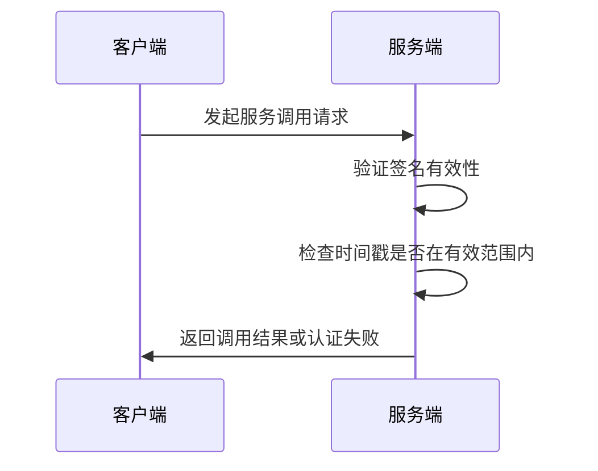
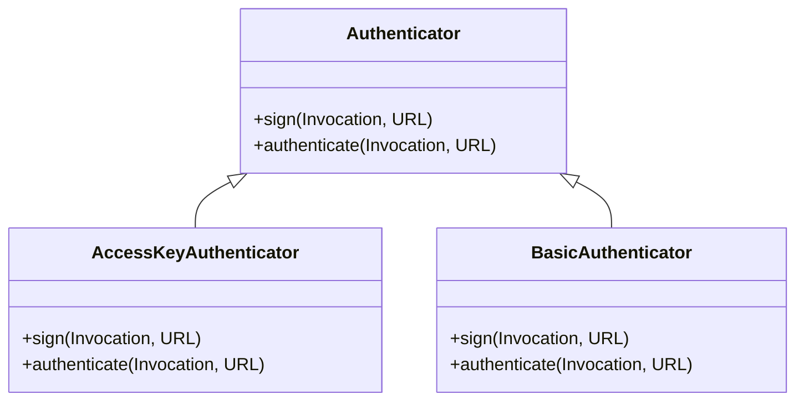
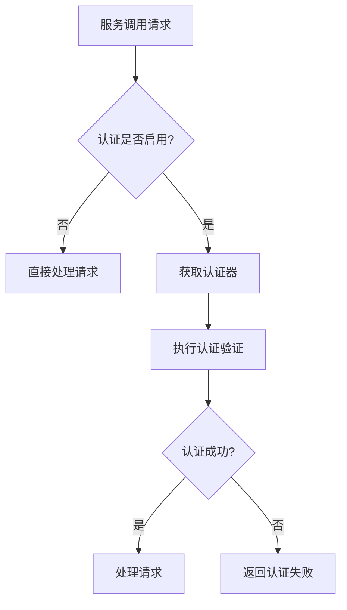
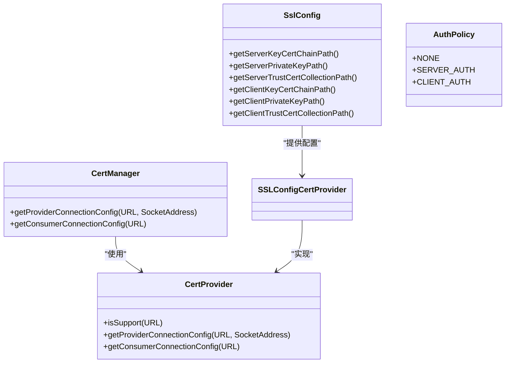
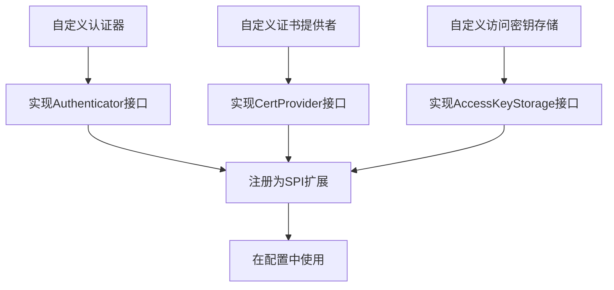

# 安全

<cite>
**本文档中引用的文件**  
- [Authenticator.java](file://dubbo-plugin/dubbo-auth/src/main/java/org/apache/dubbo/auth/spi/Authenticator.java)
- [AccessKeyAuthenticator.java](file://dubbo-plugin/dubbo-auth/src/main/java/org/apache/dubbo/auth/AccessKeyAuthenticator.java)
- [BasicAuthenticator.java](file://dubbo-plugin/dubbo-auth/src/main/java/org/apache/dubbo/auth/BasicAuthenticator.java)
- [ProviderAuthFilter.java](file://dubbo-plugin/dubbo-auth/src/main/java/org/apache/dubbo/auth/filter/ProviderAuthFilter.java)
- [ConsumerSignFilter.java](file://dubbo-plugin/dubbo-auth/src/main/java/org/apache/dubbo/auth/filter/ConsumerSignFilter.java)
- [SslConfig.java](file://dubbo-common/src/main/java/org/apache/dubbo/config/SslConfig.java)
- [AuthPolicy.java](file://dubbo-common/src/main/java/org/apache/dubbo/common/ssl/AuthPolicy.java)
- [CertManager.java](file://dubbo-common/src/main/java/org/apache/dubbo/common/ssl/CertManager.java)
- [SSLConfigCertProvider.java](file://dubbo-common/src/main/java/org/apache/dubbo/common/ssl/impl/SSLConfigCertProvider.java)
- [Constants.java](file://dubbo-plugin/dubbo-auth/src/main/java/org/apache/dubbo/auth/Constants.java)
</cite>

## 目录
1. [简介](#简介)
2. [认证机制](#认证机制)
3. [授权机制](#授权机制)
4. [SSL/TLS加密通信](#ssltls加密通信)
5. [安全配置指南](#安全配置指南)
6. [高级安全主题](#高级安全主题)
7. [结论](#结论)

## 简介

Dubbo框架提供了全面的安全特性，确保分布式服务调用的安全性。本文档详细介绍了Dubbo的安全架构，包括认证、授权和加密通信等核心安全机制。通过这些安全特性，Dubbo能够有效防止未授权访问、数据泄露和中间人攻击等安全威胁。

Dubbo的安全体系基于SPI（Service Provider Interface）扩展机制，允许开发者根据具体需求定制安全策略。框架提供了多种认证方式，包括基于访问密钥的认证和基本认证，同时支持SSL/TLS加密通信来保护数据传输的安全。此外，Dubbo还提供了灵活的权限控制机制，可以实现服务级别和方法级别的访问控制。

**本文档中引用的文件**
- [Authenticator.java](file://dubbo-plugin/dubbo-auth/src/main/java/org/apache/dubbo/auth/spi/Authenticator.java)
- [SslConfig.java](file://dubbo-common/src/main/java/org/apache/dubbo/config/SslConfig.java)

## 认证机制

Dubbo的认证机制通过`Authenticator`接口实现，该接口定义了签名和验证两个核心方法。框架提供了两种内置的认证方式：基于访问密钥的认证和基本认证。

### 基于访问密钥的认证

基于访问密钥的认证是一种更安全的认证方式，它使用访问密钥ID和秘密访问密钥进行身份验证。`AccessKeyAuthenticator`类实现了这种认证方式，其工作原理如下：

1. 在请求发起时，客户端使用访问密钥ID和秘密访问密钥对请求进行签名
2. 签名信息包括服务标识、方法名、秘密密钥和时间戳
3. 服务器端收到请求后，使用相同的算法重新计算签名
4. 比较客户端提供的签名和服务器计算的签名是否一致

这种认证方式具有防重放攻击的特性，因为签名中包含了时间戳，服务器可以验证请求是否在有效时间窗口内。



**图示来源**
- [AccessKeyAuthenticator.java](file://dubbo-plugin/dubbo-auth/src/main/java/org/apache/dubbo/auth/AccessKeyAuthenticator.java)

### 基本认证

基本认证是一种简单的认证方式，基于HTTP基本认证原理实现。`BasicAuthenticator`类负责实现这种认证机制：

1. 客户端将用户名和密码组合成"username:password"格式
2. 使用Base64编码对组合后的字符串进行编码
3. 将编码后的字符串作为Authorization头发送
4. 服务端解码并验证用户名和密码

虽然基本认证实现简单，但建议在生产环境中结合SSL/TLS使用，以防止凭据在传输过程中被窃取。



**图示来源**
- [Authenticator.java](file://dubbo-plugin/dubbo-auth/src/main/java/org/apache/dubbo/auth/spi/Authenticator.java)
- [AccessKeyAuthenticator.java](file://dubbo-plugin/dubbo-auth/src/main/java/org/apache/dubbo/auth/AccessKeyAuthenticator.java)
- [BasicAuthenticator.java](file://dubbo-plugin/dubbo-auth/src/main/java/org/apache/dubbo/auth/BasicAuthenticator.java)

**本节来源**
- [AccessKeyAuthenticator.java](file://dubbo-plugin/dubbo-auth/src/main/java/org/apache/dubbo/auth/AccessKeyAuthenticator.java)
- [BasicAuthenticator.java](file://dubbo-plugin/dubbo-auth/src/main/java/org/apache/dubbo/auth/BasicAuthenticator.java)
- [Constants.java](file://dubbo-plugin/dubbo-auth/src/main/java/org/apache/dubbo/auth/Constants.java)

## 授权机制

Dubbo的授权机制通过过滤器模式实现，提供了服务级别和方法级别的权限控制。授权过程主要由`ProviderAuthFilter`和`ConsumerSignFilter`两个过滤器完成。

### 服务级别访问控制

服务级别的访问控制通过配置`auth`参数实现。当服务提供者启用认证时，所有对该服务的调用都必须通过认证验证。`ProviderAuthFilter`是服务端的认证过滤器，其工作流程如下：

1. 检查服务URL中的`auth`参数是否启用
2. 如果启用，则获取配置的认证器（Authenticator）
3. 调用认证器的`authenticate`方法验证请求
4. 认证成功则继续处理请求，失败则返回错误

### 方法级别权限检查

方法级别的权限检查可以通过自定义认证器实现。开发者可以基于方法名、参数类型等信息进行更细粒度的权限控制。`ConsumerSignFilter`是客户端的签名过滤器，在请求发送前对调用进行签名。

授权机制的配置通过URL参数实现，主要参数包括：
- `auth`: 是否启用认证
- `authenticator`: 使用的认证器类型
- `username`和`password`: 基本认证的凭据
- `accessKey.storage`: 访问密钥存储方式



**图示来源**
- [ProviderAuthFilter.java](file://dubbo-plugin/dubbo-auth/src/main/java/org/apache/dubbo/auth/filter/ProviderAuthFilter.java)
- [ConsumerSignFilter.java](file://dubbo-plugin/dubbo-auth/src/main/java/org/apache/dubbo/auth/filter/ConsumerSignFilter.java)

**本节来源**
- [ProviderAuthFilter.java](file://dubbo-plugin/dubbo-auth/src/main/java/org/apache/dubbo/auth/filter/ProviderAuthFilter.java)
- [ConsumerSignFilter.java](file://dubbo-plugin/dubbo-auth/src/main/java/org/apache/dubbo/auth/filter/ConsumerSignFilter.java)
- [Constants.java](file://dubbo-plugin/dubbo-auth/src/main/java/org/apache/dubbo/auth/Constants.java)

## SSL/TLS加密通信

Dubbo支持SSL/TLS加密通信，确保服务调用过程中的数据传输安全。SSL/TLS配置通过`SslConfig`类实现，提供了服务器和客户端证书的配置选项。

### SSL/TLS配置

`SslConfig`类定义了SSL/TLS通信所需的各种配置参数：

- 服务器证书链路径（serverKeyCertChainPath）
- 服务器私钥路径（serverPrivateKeyPath）
- 服务器信任的CA证书路径（serverTrustCertCollectionPath）
- 客户端证书链路径（clientKeyCertChainPath）
- 客户端私钥路径（clientPrivateKeyPath）
- 客户端信任的CA证书路径（clientTrustCertCollectionPath）

### 双向认证实现

Dubbo支持双向SSL/TLS认证，即服务器验证客户端证书，同时客户端也验证服务器证书。双向认证通过`AuthPolicy`枚举实现，包含三种认证策略：

- `NONE`: 不进行认证
- `SERVER_AUTH`: 服务器认证（单向认证）
- `CLIENT_AUTH`: 客户端认证（双向认证）

`CertManager`类负责管理证书配置，它通过`CertProvider`接口的实现来获取证书信息。`SSLConfigCertProvider`是默认的证书提供者，从`SslConfig`中读取证书配置。



**图示来源**
- [SslConfig.java](file://dubbo-common/src/main/java/org/apache/dubbo/config/SslConfig.java)
- [AuthPolicy.java](file://dubbo-common/src/main/java/org/apache/dubbo/common/ssl/AuthPolicy.java)
- [CertManager.java](file://dubbo-common/src/main/java/org/apache/dubbo/common/ssl/CertManager.java)
- [SSLConfigCertProvider.java](file://dubbo-common/src/main/java/org/apache/dubbo/common/ssl/impl/SSLConfigCertProvider.java)

**本节来源**
- [SslConfig.java](file://dubbo-common/src/main/java/org/apache/dubbo/config/SslConfig.java)
- [AuthPolicy.java](file://dubbo-common/src/main/java/org/apache/dubbo/common/ssl/AuthPolicy.java)
- [CertManager.java](file://dubbo-common/src/main/java/org/apache/dubbo/common/ssl/CertManager.java)

## 安全配置指南

本节为初学者提供基本的安全配置指南，以及为经验丰富的开发者提供安全策略的扩展接口。

### 基本安全配置

对于初学者，可以通过简单的配置启用Dubbo的安全特性：

1. **启用认证**：在服务提供者和消费者配置中添加`auth=true`参数
2. **选择认证方式**：通过`authenticator`参数选择认证方式（basic或accesskey）
3. **配置凭据**：根据选择的认证方式配置相应的用户名/密码或访问密钥

```java
// 服务提供者配置
ServiceConfig<DemoService> service = new ServiceConfig<>();
service.setInterface(DemoService.class);
service.setRef(new DemoServiceImpl());
service.setParameters(Collections.singletonMap("auth", "true"));
service.setParameters(Collections.singletonMap("authenticator", "basic"));
service.setParameters(Collections.singletonMap("username", "dubbo"));
service.setParameters(Collections.singletonMap("password", "password"));
```

### 扩展接口和自定义实现

对于需要定制安全策略的开发者，Dubbo提供了丰富的扩展接口：

1. **自定义认证器**：实现`Authenticator`接口，提供自定义的认证逻辑
2. **自定义证书提供者**：实现`CertProvider`接口，从不同的数据源获取证书配置
3. **自定义访问密钥存储**：实现`AccessKeyStorage`接口，将访问密钥存储在数据库或其他安全存储中



**图示来源**
- [Authenticator.java](file://dubbo-plugin/dubbo-auth/src/main/java/org/apache/dubbo/auth/spi/Authenticator.java)
- [CertProvider.java](file://dubbo-common/src/main/java/org/apache/dubbo/common/ssl/CertProvider.java)

**本节来源**
- [Authenticator.java](file://dubbo-plugin/dubbo-auth/src/main/java/org/apache/dubbo/auth/spi/Authenticator.java)
- [Constants.java](file://dubbo-plugin/dubbo-auth/src/main/java/org/apache/dubbo/auth/Constants.java)

## 高级安全主题

本节涵盖安全漏洞防范、密钥轮换、安全审计等高级主题。

### 安全漏洞防范

Dubbo框架内置了多种安全漏洞防范机制：

1. **反序列化安全**：通过`SerializeSecurityManager`控制可反序列化的类，防止反序列化漏洞
2. **访问日志安全**：在`AccessLogFilter`中检查访问日志文件路径，防止路径遍历攻击
3. **配置安全**：通过`ConfigurationUtils`管理安全相关的配置项，防止敏感信息泄露

### 密钥轮换

为了提高安全性，建议定期轮换访问密钥。Dubbo支持密钥轮换的实现方式：

1. **多密钥支持**：系统可以同时配置多个访问密钥
2. **平滑过渡**：新旧密钥可以同时有效一段时间
3. **自动更新**：通过配置中心动态更新密钥配置

### 安全审计

Dubbo提供了安全审计功能，可以记录重要的安全事件：

1. **认证事件**：记录认证成功和失败的事件
2. **权限变更**：记录权限配置的变更
3. **安全配置**：记录安全相关配置的修改

安全审计日志可以帮助管理员监控系统的安全状态，及时发现异常行为。

**本节来源**
- [AccessLogFilter.java](file://dubbo-rpc/dubbo-rpc-api/src/main/java/org/apache/dubbo/rpc/filter/AccessLogFilter.java)
- [SerializeSecurityManager.java](file://dubbo-common/src/main/java/org/apache/dubbo/common/serialize/security/SerializeSecurityManager.java)

## 结论

Dubbo提供了全面的安全特性，包括多种认证方式、灵活的授权机制和SSL/TLS加密通信。通过合理的配置和使用，可以有效保护分布式服务的安全。

对于初学者，建议从基本认证开始，逐步了解和使用更高级的安全特性。对于经验丰富的开发者，可以利用Dubbo的扩展机制，实现定制化的安全策略。

在生产环境中，建议结合多种安全措施，如启用SSL/TLS加密、使用强认证方式、定期轮换密钥等，构建多层次的安全防护体系。同时，应建立完善的安全审计机制，及时发现和响应安全事件。