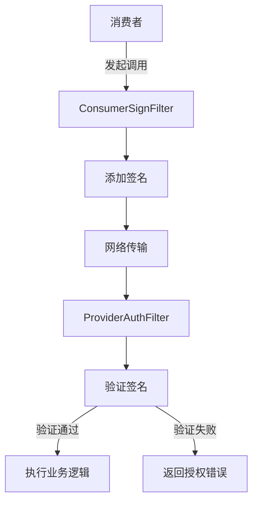
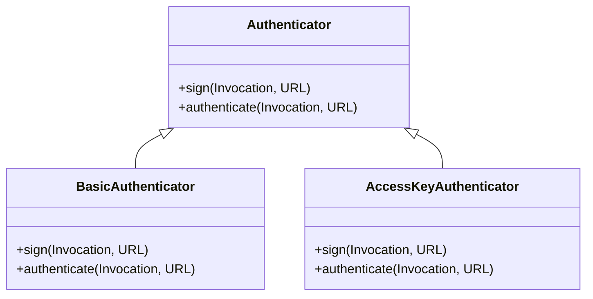
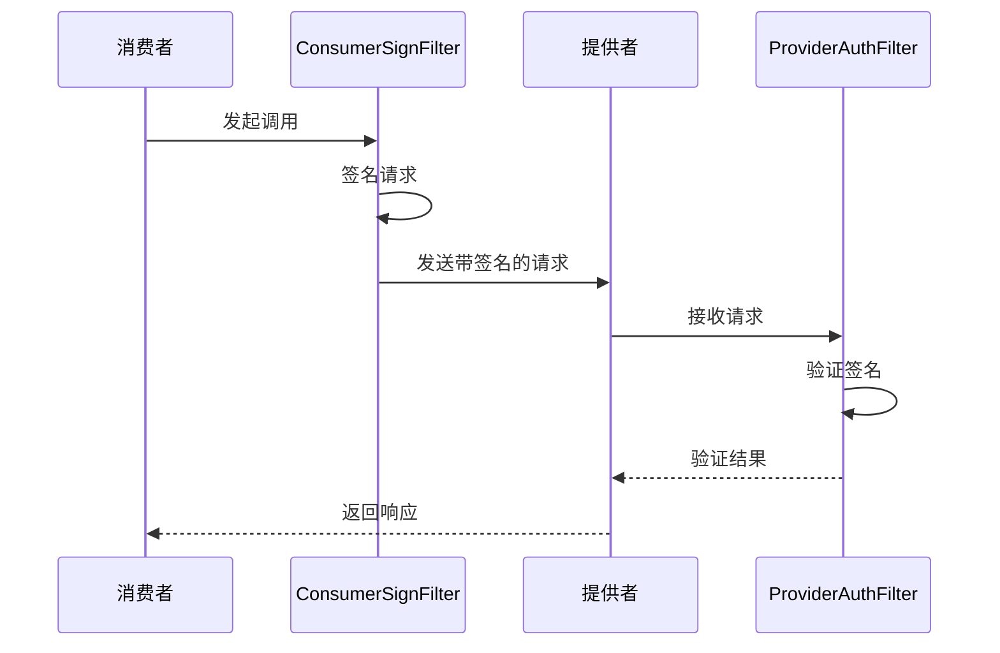
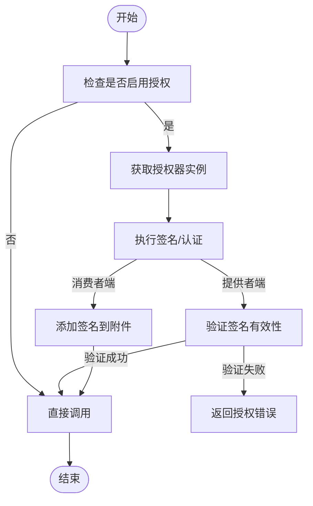
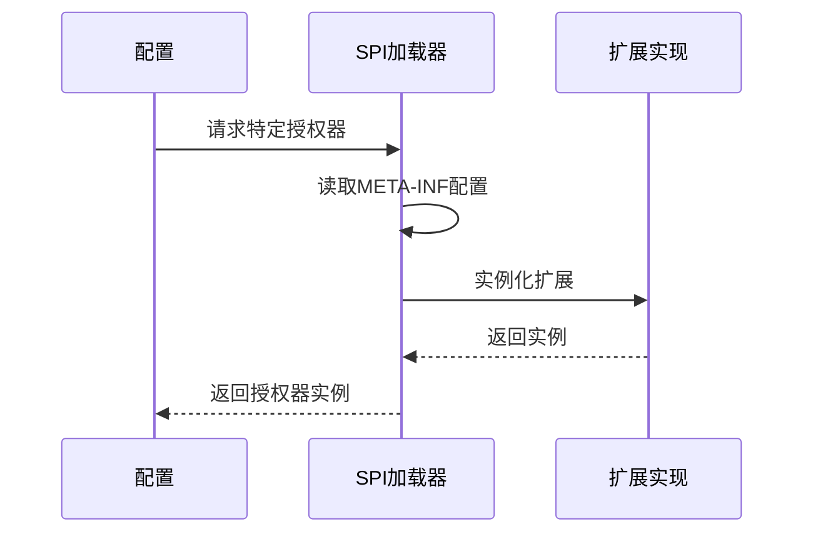
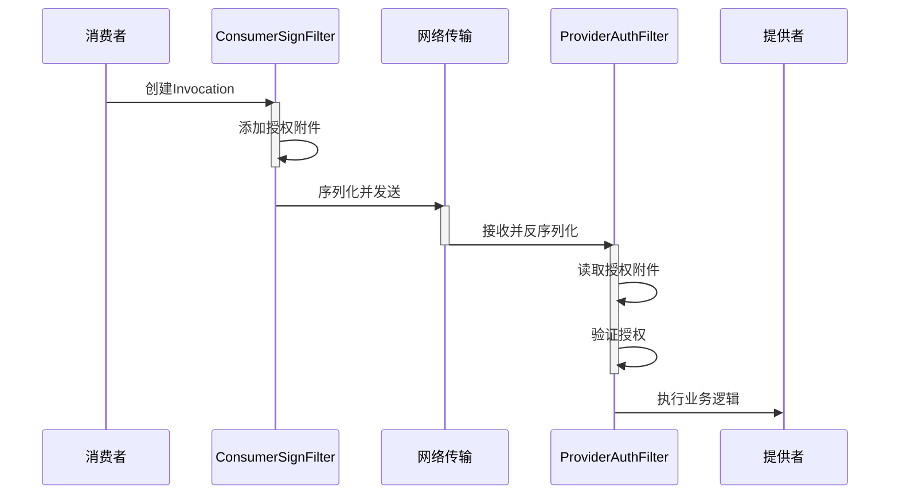
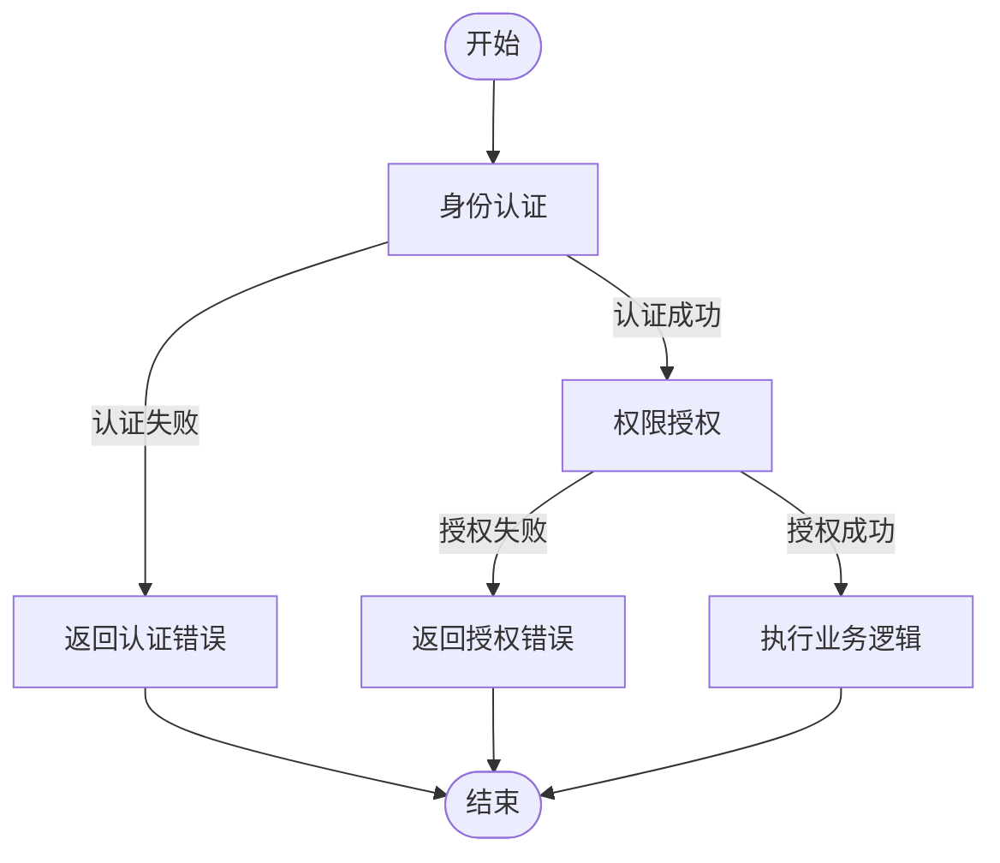
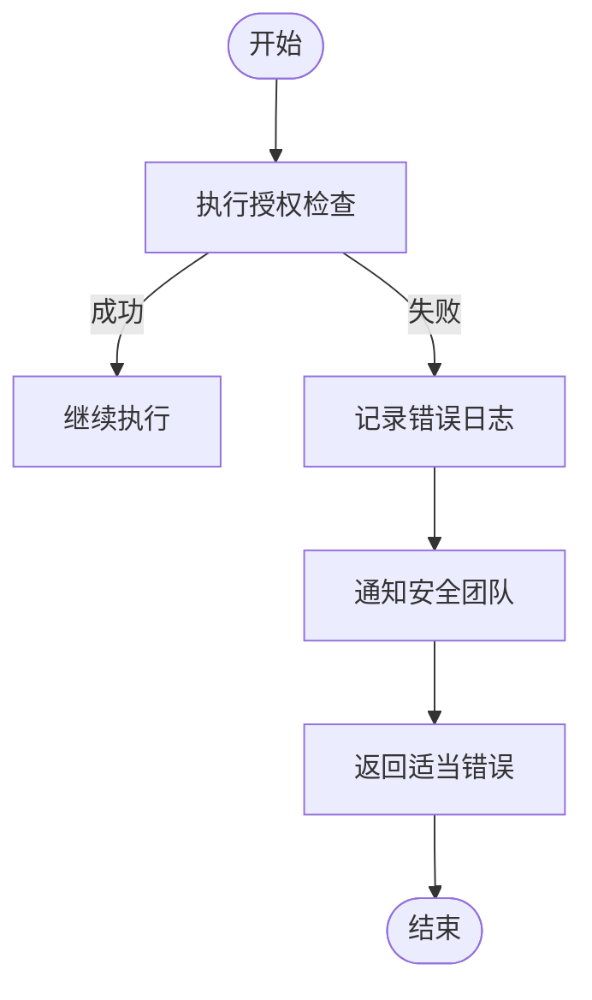

# 授权

<cite>
**本文档中引用的文件**   
- [Authenticator.java](file://dubbo-plugin\dubbo-auth\src\main\java\org\apache\dubbo\auth\spi\Authenticator.java)
- [BasicAuthenticator.java](file://dubbo-plugin\dubbo-auth\src\main\java\org\apache\dubbo\auth\BasicAuthenticator.java)
- [AccessKeyAuthenticator.java](file://dubbo-plugin\dubbo-auth\src\main\java\org\apache\dubbo\auth\AccessKeyAuthenticator.java)
- [ConsumerSignFilter.java](file://dubbo-plugin\dubbo-auth\src\main\java\org\apache\dubbo\auth\filter\ConsumerSignFilter.java)
- [ProviderAuthFilter.java](file://dubbo-plugin\dubbo-auth\src\main\java\org\apache\dubbo\auth\filter\ProviderAuthFilter.java)
- [Constants.java](file://dubbo-plugin\dubbo-auth\src\main\java\org\apache\dubbo\auth\Constants.java)
- [AccessKeyStorage.java](file://dubbo-plugin\dubbo-auth\src\main\java\org\apache\dubbo\auth\spi\AccessKeyStorage.java)
- [SignatureUtils.java](file://dubbo-plugin\dubbo-auth\src\main\java\org\apache\dubbo\auth\utils\SignatureUtils.java)
- [AbstractInterfaceConfig.java](file://dubbo-common\src\main\java\org\apache\dubbo\config\AbstractInterfaceConfig.java)
</cite>

## 目录
1. [引言](#引言)
2. [授权机制概述](#授权机制概述)
3. [核心组件分析](#核心组件分析)
4. [授权流程详解](#授权流程详解)
5. [配置方式](#配置方式)
6. [SPI扩展机制](#spi扩展机制)
7. [安全策略实现](#安全策略实现)
8. [调用上下文中的授权信息传递](#调用上下文中的授权信息传递)
9. [与认证机制的协同工作](#与认证机制的协同工作)
10. [配置示例](#配置示例)
11. [初学者指南](#初学者指南)
12. [高级用户策略](#高级用户策略)
13. [授权失败处理](#授权失败处理)
14. [性能优化](#性能优化)
15. [结论](#结论)

## 引言
Dubbo作为一个高性能的Java RPC框架，提供了完善的授权机制来保护服务的安全性。本文档全面解释Dubbo的授权机制，包括服务级别和方法级别的访问控制实现。我们将详细描述Authorizer接口的设计原理和实现方式，以及如何通过SPI机制扩展自定义授权策略。同时，本文档将说明授权规则的配置方式，包括基于角色的访问控制（RBAC）和基于属性的访问控制（ABAC）的实现。通过本文档，初学者可以获得基本的授权配置指南，而高级用户则可以学习复杂的授权策略实现方法。

## 授权机制概述
Dubbo的授权机制主要通过过滤器（Filter）模式实现，采用SPI（Service Provider Interface）扩展机制，允许用户自定义授权策略。授权机制的核心是Authenticator接口，它定义了签名和认证两个基本操作。Dubbo提供了两种内置的授权实现：BasicAuthenticator和AccessKeyAuthenticator，分别基于基本认证和访问密钥认证。

授权机制在服务调用的两个关键点发挥作用：消费者端的请求签名和提供者端的请求认证。消费者在发起调用时，通过ConsumerSignFilter对请求进行签名；提供者在接收请求时，通过ProviderAuthFilter对请求进行认证。这种双向验证机制确保了服务调用的安全性。



**图示来源**
- [ConsumerSignFilter.java](file://dubbo-plugin\dubbo-auth\src\main\java\org\apache\dubbo\auth\filter\ConsumerSignFilter.java)
- [ProviderAuthFilter.java](file://dubbo-plugin\dubbo-auth\src\main\java\org\apache\dubbo\auth\filter\ProviderAuthFilter.java)

## 核心组件分析

### Authenticator接口
Authenticator接口是Dubbo授权机制的核心，定义了授权器的基本行为。该接口通过SPI机制扩展，允许用户实现自定义的授权策略。



**图示来源**
- [Authenticator.java](file://dubbo-plugin\dubbo-auth\src\main\java\org\apache\dubbo\auth\spi\Authenticator.java)
- [BasicAuthenticator.java](file://dubbo-plugin\dubbo-auth\src\main\java\org\apache\dubbo\auth\BasicAuthenticator.java)
- [AccessKeyAuthenticator.java](file://dubbo-plugin\dubbo-auth\src\main\java\org\apache\dubbo\auth\AccessKeyAuthenticator.java)

**本节来源**
- [Authenticator.java](file://dubbo-plugin\dubbo-auth\src\main\java\org\apache\dubbo\auth\spi\Authenticator.java)

### 过滤器组件
Dubbo授权机制通过两个关键过滤器实现：ConsumerSignFilter和ProviderAuthFilter。ConsumerSignFilter在消费者端运行，负责对请求进行签名；ProviderAuthFilter在提供者端运行，负责验证请求的签名。



**图示来源**
- [ConsumerSignFilter.java](file://dubbo-plugin\dubbo-auth\src\main\java\org\apache\dubbo\auth\filter\ConsumerSignFilter.java)
- [ProviderAuthFilter.java](file://dubbo-plugin\dubbo-auth\src\main\java\org\apache\dubbo\auth\filter\ProviderAuthFilter.java)

**本节来源**
- [ConsumerSignFilter.java](file://dubbo-plugin\dubbo-auth\src\main\java\org\apache\dubbo\auth\filter\ConsumerSignFilter.java)
- [ProviderAuthFilter.java](file://dubbo-plugin\dubbo-auth\src\main\java\org\apache\dubbo\auth\filter\ProviderAuthFilter.java)

## 授权流程详解
Dubbo的授权流程分为两个阶段：请求签名阶段和请求认证阶段。在请求签名阶段，消费者端的ConsumerSignFilter会根据配置的授权器对请求进行签名；在请求认证阶段，提供者端的ProviderAuthFilter会验证请求的签名是否有效。

### 请求签名流程
1. 消费者发起服务调用
2. ConsumerSignFilter拦截请求
3. 根据URL参数获取配置的授权器
4. 调用授权器的sign方法对请求进行签名
5. 将签名信息添加到调用附件中
6. 继续执行调用链

### 请求认证流程
1. 提供者接收到服务调用
2. ProviderAuthFilter拦截请求
3. 检查是否已通过认证（避免重复认证）
4. 根据URL参数获取配置的授权器
5. 调用授权器的authenticate方法验证签名
6. 如果验证失败，返回授权错误；如果验证成功，继续执行调用链



**图示来源**
- [ConsumerSignFilter.java](file://dubbo-plugin\dubbo-auth\src\main\java\org\apache\dubbo\auth\filter\ConsumerSignFilter.java)
- [ProviderAuthFilter.java](file://dubbo-plugin\dubbo-auth\src\main\java\org\apache\dubbo\auth\filter\ProviderAuthFilter.java)

**本节来源**
- [ConsumerSignFilter.java](file://dubbo-plugin\dubbo-auth\src\main\java\org\apache\dubbo\auth\filter\ConsumerSignFilter.java)
- [ProviderAuthFilter.java](file://dubbo-plugin\dubbo-auth\src\main\java\org\apache\dubbo\auth\filter\ProviderAuthFilter.java)

## 配置方式
Dubbo提供了灵活的配置方式来启用和配置授权机制。授权配置主要通过服务接口配置类中的参数实现。

### 服务级别配置
在服务提供者或消费者的配置中，可以通过设置auth参数来启用授权：

```java
@Service(auth = true, authenticator = "accesskey")
public class DemoServiceImpl implements DemoService {
    // 服务实现
}
```

### 方法级别配置
对于更细粒度的控制，可以在方法级别配置授权：

```java
@Service
public class DemoServiceImpl implements DemoService {
    
    @MethodConfig(auth = true, authenticator = "basic")
    public String sensitiveMethod() {
        // 敏感方法，需要基本认证
        return "sensitive data";
    }
    
    public String publicMethod() {
        // 公共方法，无需认证
        return "public data";
    }
}
```

### 配置参数说明
| 参数名称 | 说明 | 默认值 |
|--------|------|-------|
| auth | 是否启用授权 | false |
| authenticator | 使用的授权器类型 | basic |
| username | 基本认证用户名 | 无 |
| password | 基本认证密码 | 无 |
| accessKey.storage | 访问密钥存储方式 | urlstorage |

**本节来源**
- [AbstractInterfaceConfig.java](file://dubbo-common\src\main\java\org\apache\dubbo\config\AbstractInterfaceConfig.java)

## SPI扩展机制
Dubbo的授权机制基于SPI（Service Provider Interface）设计，允许用户扩展自定义的授权策略。SPI机制使得Dubbo的授权功能具有良好的可扩展性。

### 扩展点说明
Dubbo提供了两个主要的授权扩展点：

1. **Authenticator接口**：用于实现自定义的授权逻辑
2. **AccessKeyStorage接口**：用于实现自定义的访问密钥存储

### 自定义授权器实现
要实现自定义授权器，需要创建一个实现Authenticator接口的类，并在META-INF/dubbo/internal/org.apache.dubbo.auth.spi.Authenticator文件中注册：

```java
@SPI("custom")
public class CustomAuthenticator implements Authenticator {
    
    @Override
    public void sign(Invocation invocation, URL url) {
        // 自定义签名逻辑
        String customToken = generateCustomToken(url);
        invocation.setAttachment("custom-token", customToken);
    }
    
    @Override
    public void authenticate(Invocation invocation, URL url) throws RpcAuthenticationException {
        // 自定义认证逻辑
        String token = invocation.getAttachment("custom-token");
        if (!validateToken(token, url)) {
            throw new RpcAuthenticationException("Custom authentication failed");
        }
    }
    
    private String generateCustomToken(URL url) {
        // 生成自定义令牌
        return "custom-token-" + System.currentTimeMillis();
    }
    
    private boolean validateToken(String token, URL url) {
        // 验证令牌有效性
        return token != null && token.startsWith("custom-token-");
    }
}
```

在META-INF/dubbo/internal/org.apache.dubbo.auth.spi.Authenticator文件中添加：
```
custom=com.example.CustomAuthenticator
```

### 扩展机制流程


**图示来源**
- [Authenticator.java](file://dubbo-plugin\dubbo-auth\src\main\java\org\apache\dubbo\auth\spi\Authenticator.java)
- [AccessKeyStorage.java](file://dubbo-plugin\dubbo-auth\src\main\java\org\apache\dubbo\auth\spi\AccessKeyStorage.java)

**本节来源**
- [Authenticator.java](file://dubbo-plugin\dubbo-auth\src\main\java\org\apache\dubbo\auth\spi\Authenticator.java)
- [AccessKeyStorage.java](file://dubbo-plugin\dubbo-auth\src\main\java\org\apache\dubbo\auth\spi\AccessKeyStorage.java)

## 安全策略实现
Dubbo支持多种安全策略实现，包括基于角色的访问控制（RBAC）和基于属性的访问控制（ABAC）。

### 基于角色的访问控制（RBAC）
RBAC通过用户角色来控制访问权限。在Dubbo中，可以通过自定义Authenticator实现RBAC：

```java
public class RoleBasedAuthenticator implements Authenticator {
    
    private final Map<String, Set<String>> rolePermissions = new HashMap<>();
    
    public RoleBasedAuthenticator() {
        // 初始化角色权限
        rolePermissions.put("admin", Set.of("read", "write", "delete"));
        rolePermissions.put("user", Set.of("read", "write"));
        rolePermissions.put("guest", Set.of("read"));
    }
    
    @Override
    public void sign(Invocation invocation, URL url) {
        // 获取用户角色
        String role = getUserRole(invocation);
        invocation.setAttachment("user-role", role);
        
        // 签名请求
        String signature = generateSignature(invocation, url);
        invocation.setAttachment("signature", signature);
    }
    
    @Override
    public void authenticate(Invocation invocation, URL url) throws RpcAuthenticationException {
        // 验证签名
        if (!verifySignature(invocation, url)) {
            throw new RpcAuthenticationException("Signature verification failed");
        }
        
        // 检查权限
        String role = invocation.getAttachment("user-role");
        String methodName = RpcUtils.getMethodName(invocation);
        
        if (!hasPermission(role, methodName)) {
            throw new RpcAuthenticationException("Insufficient permissions for role: " + role);
        }
    }
    
    private boolean hasPermission(String role, String method) {
        Set<String> permissions = rolePermissions.get(role);
        if (permissions == null) {
            return false;
        }
        
        // 根据方法名确定所需权限
        String requiredPermission = getRequiredPermission(method);
        return permissions.contains(requiredPermission);
    }
    
    private String getRequiredPermission(String method) {
        // 根据方法名确定所需权限
        if (method.startsWith("get") || method.startsWith("query")) {
            return "read";
        } else if (method.startsWith("update") || method.startsWith("create")) {
            return "write";
        } else if (method.startsWith("delete")) {
            return "delete";
        }
        return "read";
    }
}
```

### 基于属性的访问控制（ABAC）
ABAC通过评估用户、资源和环境的属性来决定访问权限。在Dubbo中，可以通过自定义Authenticator实现ABAC：

```java
public class AttributeBasedAuthenticator implements Authenticator {
    
    @Override
    public void sign(Invocation invocation, URL url) {
        // 收集用户属性
        Map<String, Object> userAttributes = collectUserAttributes(invocation);
        invocation.setAttachment("user-attributes", JSON.toJSONString(userAttributes));
        
        // 收集资源属性
        Map<String, Object> resourceAttributes = collectResourceAttributes(url);
        invocation.setAttachment("resource-attributes", JSON.toJSONString(resourceAttributes));
        
        // 收集环境属性
        Map<String, Object> environmentAttributes = collectEnvironmentAttributes();
        invocation.setAttachment("environment-attributes", JSON.toJSONString(environmentAttributes));
        
        // 生成签名
        String signature = generateSignature(invocation, url);
        invocation.setAttachment("signature", signature);
    }
    
    @Override
    public void authenticate(Invocation invocation, URL url) throws RpcAuthenticationException {
        // 验证签名
        if (!verifySignature(invocation, url)) {
            throw new RpcAuthenticationException("Signature verification failed");
        }
        
        // 获取所有属性
        Map<String, Object> userAttributes = parseAttributes(invocation.getAttachment("user-attributes"));
        Map<String, Object> resourceAttributes = parseAttributes(invocation.getAttachment("resource-attributes"));
        Map<String, Object> environmentAttributes = parseAttributes(invocation.getAttachment("environment-attributes"));
        
        // 评估访问策略
        if (!evaluatePolicy(userAttributes, resourceAttributes, environmentAttributes)) {
            throw new RpcAuthenticationException("Access denied by ABAC policy");
        }
    }
    
    private boolean evaluatePolicy(Map<String, Object> userAttrs, 
                                 Map<String, Object> resourceAttrs, 
                                 Map<String, Object> envAttrs) {
        // 实现策略评估逻辑
        // 例如：只有在工作时间（9-18点）才能访问敏感数据
        Integer hour = (Integer) envAttrs.get("hour");
        String sensitivity = (String) resourceAttrs.get("sensitivity");
        
        if ("high".equals(sensitivity) && (hour == null || hour < 9 || hour > 18)) {
            return false;
        }
        
        // 例如：只有部门经理才能访问财务数据
        String department = (String) userAttrs.get("department");
        String role = (String) userAttrs.get("role");
        String dataCategory = (String) resourceAttrs.get("category");
        
        if ("finance".equals(dataCategory) && (!"manager".equals(role) || !"finance".equals(department))) {
            return false;
        }
        
        return true;
    }
}
```

**本节来源**
- [Authenticator.java](file://dubbo-plugin\dubbo-auth\src\main\java\org\apache\dubbo\auth\spi\Authenticator.java)

## 调用上下文中的授权信息传递
在Dubbo的RPC调用过程中，授权信息通过调用上下文（Invocation）的附件（Attachment）进行传递。这种设计确保了授权信息能够在整个调用链中保持一致。

### 信息传递流程
1. 消费者端在ConsumerSignFilter中将授权信息添加到Invocation的附件中
2. RPC框架将附件信息序列化并随请求一起发送
3. 提供者端在ProviderAuthFilter中从反序列化的Invocation中读取附件信息
4. 根据附件中的授权信息进行认证

### 附件信息结构
```json
{
  "timestamp": "1640995200000",
  "signature": "base64-encoded-signature",
  "ak": "access-key-id",
  "consumer": "consumer-application-name",
  "authorization": "Basic base64-credentials"
}
```

### 信息传递示意图


**图示来源**
- [ConsumerSignFilter.java](file://dubbo-plugin\dubbo-auth\src\main\java\org\apache\dubbo\auth\filter\ConsumerSignFilter.java)
- [ProviderAuthFilter.java](file://dubbo-plugin\dubbo-auth\src\main\java\org\apache\dubbo\auth\filter\ProviderAuthFilter.java)

**本节来源**
- [ConsumerSignFilter.java](file://dubbo-plugin\dubbo-auth\src\main\java\org\apache\dubbo\auth\filter\ConsumerSignFilter.java)
- [ProviderAuthFilter.java](file://dubbo-plugin\dubbo-auth\src\main\java\org\apache\dubbo\auth\filter\ProviderAuthFilter.java)

## 与认证机制的协同工作
Dubbo的授权机制与认证机制紧密协作，共同保障服务的安全性。认证机制负责验证调用方的身份，而授权机制则负责控制调用方的访问权限。

### 协同工作流程
1. 认证阶段：验证调用方的身份（如用户名/密码、访问密钥等）
2. 授权阶段：在身份验证通过后，检查调用方是否有权访问特定资源或执行特定操作

### 协同工作示意图


### 实际协同示例
在AccessKeyAuthenticator的实现中，我们可以看到认证和授权的协同工作：

1. **认证部分**：验证访问密钥的有效性
   - 检查accessKeyId和secretAccessKey是否存在
   - 验证签名是否正确
   - 检查时间戳是否在有效范围内

2. **授权部分**：基于认证结果进行权限控制
   - 根据accessKeyId查找用户信息
   - 检查用户是否有权访问请求的服务和方法
   - 根据用户角色或属性应用相应的访问控制策略

这种分层的安全机制确保了只有经过身份验证且具有适当权限的调用方才能访问服务。

**本节来源**
- [AccessKeyAuthenticator.java](file://dubbo-plugin\dubbo-auth\src\main\java\org\apache\dubbo\auth\AccessKeyAuthenticator.java)

## 配置示例
本节提供具体的配置示例，展示如何为不同的服务和方法设置不同的访问权限。

### 基本认证配置
```xml
<!-- 服务提供者配置 -->
<dubbo:service interface="com.example.DemoService" ref="demoServiceImpl">
    <dubbo:method name="sensitiveMethod" auth="true" authenticator="basic" 
                  username="admin" password="secret"/>
    <dubbo:method name="publicMethod" auth="false"/>
</dubbo:service>

<!-- 服务消费者配置 -->
<dubbo:reference interface="com.example.DemoService" id="demoService">
    <dubbo:method name="sensitiveMethod" auth="true" authenticator="basic" 
                  username="admin" password="secret"/>
</dubbo:reference>
```

### 访问密钥认证配置
```xml
<!-- 服务提供者配置 -->
<dubbo:service interface="com.example.DemoService" ref="demoServiceImpl" 
               auth="true" authenticator="accesskey"/>

<!-- 服务消费者配置 -->
<dubbo:reference interface="com.example.DemoService" id="demoService" 
                 auth="true" authenticator="accesskey">
    <!-- 访问密钥通过系统属性或环境变量设置 -->
    <dubbo:parameter key="accessKeyId" value="${ACCESS_KEY_ID}"/>
    <dubbo:parameter key="secretAccessKey" value="${SECRET_ACCESS_KEY}"/>
</dubbo:reference>
```

### 基于SPI的自定义授权配置
```xml
<!-- 使用自定义授权器 -->
<dubbo:service interface="com.example.DemoService" ref="demoServiceImpl" 
               auth="true" authenticator="custom"/>

<dubbo:reference interface="com.example.DemoService" id="demoService" 
                 auth="true" authenticator="custom"/>
```

在META-INF/dubbo/internal/org.apache.dubbo.auth.spi.Authenticator文件中：
```
custom=com.example.CustomAuthenticator
```

### 基于角色的访问控制配置
```xml
<!-- 配置RBAC授权器 -->
<dubbo:service interface="com.example.DemoService" ref="demoServiceImpl" 
               auth="true" authenticator="rolebased">
    <dubbo:parameter key="roleMapping" value="admin:read,write,delete;user:read,write;guest:read"/>
</dubbo:service>

<dubbo:reference interface="com.example.DemoService" id="demoService" 
                 auth="true" authenticator="rolebased">
    <dubbo:parameter key="userRole" value="admin"/>
</dubbo:reference>
```

**本节来源**
- [Constants.java](file://dubbo-plugin\dubbo-auth\src\main\java\org\apache\dubbo\auth\Constants.java)

## 初学者指南
本节为初学者提供基本的授权配置指南，帮助快速上手Dubbo的授权功能。

### 快速开始
1. **启用基本认证**
   在服务提供者和消费者的配置中启用基本认证：
   ```java
   @Service(auth = true, authenticator = "basic", 
            username = "admin", password = "password123")
   public class DemoServiceImpl implements DemoService {
       // 服务实现
   }
   ```

2. **配置消费者**
   ```java
   @Reference(auth = true, authenticator = "basic", 
              username = "admin", password = "password123")
   private DemoService demoService;
   ```

3. **测试配置**
   启动服务并调用，验证授权是否正常工作。

### 常见问题及解决方案
| 问题 | 可能原因 | 解决方案 |
|------|---------|---------|
| 授权失败 | 用户名或密码不匹配 | 检查用户名和密码配置是否一致 |
| 服务无法调用 | 未启用授权 | 确保auth参数设置为true |
| 性能下降 | 频繁的授权检查 | 考虑缓存授权结果 |
| 配置不生效 | 配置位置错误 | 确保在正确的配置层级设置参数 |

### 最佳实践
1. **使用环境变量存储敏感信息**
   ```java
   @Service(auth = true, authenticator = "basic", 
            username = "${AUTH_USERNAME}", 
            password = "${AUTH_PASSWORD}")
   ```

2. **为不同环境配置不同的授权策略**
   - 开发环境：可以禁用授权或使用简单的认证
   - 生产环境：必须启用强认证和授权

3. **定期轮换凭证**
   定期更换用户名/密码或访问密钥，提高安全性。

**本节来源**
- [BasicAuthenticator.java](file://dubbo-plugin\dubbo-auth\src\main\java\org\apache\dubbo\auth\BasicAuthenticator.java)
- [Constants.java](file://dubbo-plugin\dubbo-auth\src\main\java\org\apache\dubbo\auth\Constants.java)

## 高级用户策略
本节为高级用户提供复杂的授权策略实现方法。

### 动态授权策略
实现基于运行时条件的动态授权：

```java
public class DynamicAuthenticator implements Authenticator {
    
    private final Map<String, Policy> methodPolicies = new ConcurrentHashMap<>();
    
    public DynamicAuthenticator() {
        // 初始化方法策略
        methodPolicies.put("sensitiveMethod", new TimeBasedPolicy());
        methodPolicies.put("criticalMethod", new RateLimitingPolicy());
    }
    
    @Override
    public void sign(Invocation invocation, URL url) {
        String methodName = RpcUtils.getMethodName(invocation);
        Policy policy = methodPolicies.get(methodName);
        
        if (policy != null) {
            // 应用策略特定的签名逻辑
            policy.applySignLogic(invocation, url);
        }
        
        // 通用签名
        String signature = generateSignature(invocation, url);
        invocation.setAttachment("signature", signature);
    }
    
    @Override
    public void authenticate(Invocation invocation, URL url) throws RpcAuthenticationException {
        // 通用认证
        if (!verifySignature(invocation, url)) {
            throw new RpcAuthenticationException("Signature verification failed");
        }
        
        String methodName = RpcUtils.getMethodName(invocation);
        Policy policy = methodPolicies.get(methodName);
        
        if (policy != null) {
            // 应用策略特定的认证逻辑
            policy.applyAuthLogic(invocation, url);
        }
    }
    
    // 策略接口
    private interface Policy {
        void applySignLogic(Invocation invocation, URL url);
        void applyAuthLogic(Invocation invocation, URL url) throws RpcAuthenticationException;
    }
    
    // 基于时间的策略
    private class TimeBasedPolicy implements Policy {
        @Override
        public void applySignLogic(Invocation invocation, URL url) {
            invocation.setAttachment("request-time", String.valueOf(System.currentTimeMillis()));
        }
        
        @Override
        public void applyAuthLogic(Invocation invocation, URL url) throws RpcAuthenticationException {
            String requestTimeStr = invocation.getAttachment("request-time");
            long requestTime = Long.parseLong(requestTimeStr);
            long currentTime = System.currentTimeMillis();
            
            // 请求必须在5分钟内
            if (currentTime - requestTime > 5 * 60 * 1000) {
                throw new RpcAuthenticationException("Request expired");
            }
        }
    }
    
    // 限流策略
    private class RateLimitingPolicy implements Policy {
        private final Map<String, AtomicInteger> requestCounts = new ConcurrentHashMap<>();
        private static final int MAX_REQUESTS_PER_MINUTE = 100;
        
        @Override
        public void applySignLogic(Invocation invocation, URL url) {
            // 无需特殊签名逻辑
        }
        
        @Override
        public void applyAuthLogic(Invocation invocation, URL url) throws RpcAuthenticationException {
            String clientIp = invocation.getAttachment("client-ip");
            AtomicInteger count = requestCounts.computeIfAbsent(clientIp, k -> new AtomicInteger(0));
            
            // 重置计数器（每分钟）
            scheduleResetCounter(clientIp);
            
            if (count.incrementAndGet() > MAX_REQUESTS_PER_MINUTE) {
                throw new RpcAuthenticationException("Rate limit exceeded");
            }
        }
        
        private void scheduleResetCounter(String clientIp) {
            // 实现计数器重置逻辑
        }
    }
}
```

### 多因素认证
实现多因素认证机制：

```java
public class MultiFactorAuthenticator implements Authenticator {
    
    private final List<Authenticator> factors = new ArrayList<>();
    
    public MultiFactorAuthenticator() {
        // 添加多种认证因素
        factors.add(new BasicAuthenticator());
        factors.add(new OtpAuthenticator());
        factors.add(new DeviceAuthenticator());
    }
    
    @Override
    public void sign(Invocation invocation, URL url) {
        // 所有因素都参与签名
        for (Authenticator factor : factors) {
            factor.sign(invocation, url);
        }
    }
    
    @Override
    public void authenticate(Invocation invocation, URL url) throws RpcAuthenticationException {
        List<String> failedFactors = new ArrayList<>();
        
        // 所有因素都必须通过认证
        for (Authenticator factor : factors) {
            try {
                factor.authenticate(invocation, url);
            } catch (RpcAuthenticationException e) {
                failedFactors.add(factor.getClass().getSimpleName());
            }
        }
        
        if (!failedFactors.isEmpty()) {
            throw new RpcAuthenticationException("Multi-factor authentication failed for: " + 
                                               String.join(", ", failedFactors));
        }
    }
}
```

**本节来源**
- [Authenticator.java](file://dubbo-plugin\dubbo-auth\src\main\java\org\apache\dubbo\auth\spi\Authenticator.java)

## 授权失败处理
合理的授权失败处理机制对于系统的稳定性和用户体验至关重要。

### 失败类型及处理
| 失败类型 | 处理策略 | 响应码 |
|--------|--------|-------|
| 签名无效 | 拒绝请求，返回401 | 401 Unauthorized |
| 时间戳过期 | 拒绝请求，提示重新同步时间 | 401 Unauthorized |
| 权限不足 | 拒绝请求，返回403 | 403 Forbidden |
| 访问密钥不存在 | 拒绝请求，返回401 | 401 Unauthorized |
| 请求频率过高 | 拒绝请求，返回429 | 429 Too Many Requests |

### 异常处理流程


### 错误响应示例
```json
{
  "error": "Unauthorized",
  "message": "Failed to authenticate, signature is not correct",
  "timestamp": "2023-01-01T12:00:00Z",
  "traceId": "abc123-def456-ghi789"
}
```

### 安全审计
记录所有授权失败事件，用于安全审计：

```java
public class AuditAuthenticator implements Authenticator {
    
    private final Logger auditLogger = LoggerFactory.getLogger("AUDIT");
    
    @Override
    public void sign(Invocation invocation, URL url) {
        // 正常签名逻辑
        delegate.sign(invocation, url);
    }
    
    @Override
    public void authenticate(Invocation invocation, URL url) throws RpcAuthenticationException {
        try {
            delegate.authenticate(invocation, url);
            // 记录成功认证
            auditLogger.info("Authentication success: {}", getAuditInfo(invocation, url));
        } catch (RpcAuthenticationException e) {
            // 记录失败认证
            auditLogger.warn("Authentication failed: {} - {}", 
                           getAuditInfo(invocation, url), e.getMessage());
            throw e;
        }
    }
    
    private String getAuditInfo(Invocation invocation, URL url) {
        return String.format("service=%s, method=%s, client=%s", 
                           url.getServiceInterface(), 
                           RpcUtils.getMethodName(invocation),
                           invocation.getAttachment("client-ip"));
    }
}
```

**本节来源**
- [ProviderAuthFilter.java](file://dubbo-plugin\dubbo-auth\src\main\java\org\apache\dubbo\auth\filter\ProviderAuthFilter.java)
- [RpcAuthenticationException.java](file://dubbo-plugin\dubbo-auth\src\main\java\org\apache\dubbo\auth\exception\RpcAuthenticationException.java)

## 性能优化
授权机制可能对系统性能产生影响，本节提供性能优化建议。

### 缓存授权结果
对于频繁调用的服务，可以缓存授权结果：

```java
public class CachedAuthenticator implements Authenticator {
    
    private final LoadingCache<String, Boolean> authCache = 
        CacheBuilder.newBuilder()
            .maximumSize(1000)
            .expireAfterWrite(5, TimeUnit.MINUTES)
            .build(this::validateSignature);
    
    @Override
    public void sign(Invocation invocation, URL url) {
        // 正常签名逻辑
        delegate.sign(invocation, url);
    }
    
    @Override
    public void authenticate(Invocation invocation, URL url) throws RpcAuthenticationException {
        // 生成缓存键
        String cacheKey = generateCacheKey(invocation, url);
        
        try {
            Boolean isValid = authCache.get(cacheKey);
            if (!isValid) {
                throw new RpcAuthenticationException("Cached authentication failed");
            }
        } catch (ExecutionException e) {
            throw new RpcAuthenticationException("Authentication failed", e.getCause());
        }
    }
    
    private Boolean validateSignature(String cacheKey) {
        // 解析缓存键获取原始数据
        // 执行实际的签名验证
        return delegate.validateSignature(parsedInvocation, parsedUrl);
    }
    
    private String generateCacheKey(Invocation invocation, URL url) {
        return String.format("%s:%s:%s", 
                           url.getServiceKey(),
                           RpcUtils.getMethodName(invocation),
                           invocation.getAttachment("ak"));
    }
}
```

### 异步授权检查
对于非关键路径的授权检查，可以采用异步方式：

```java
public class AsyncAuthenticator implements Authenticator {
    
    private final ExecutorService executor = Executors.newFixedThreadPool(10);
    
    @Override
    public void sign(Invocation invocation, URL url) {
        // 同步签名
        delegate.sign(invocation, url);
    }
    
    @Override
    public void authenticate(Invocation invocation, URL url) throws RpcAuthenticationException {
        // 异步执行详细的授权检查
        executor.submit(() -> {
            try {
                performDetailedAuthorization(invocation, url);
            } catch (Exception e) {
                // 记录异步授权失败
                logger.warn("Async authorization failed", e);
            }
        });
        
        // 同步执行基本的签名验证
        delegate.authenticate(invocation, url);
    }
    
    private void performDetailedAuthorization(Invocation invocation, URL url) {
        // 执行详细的授权检查，如RBAC、ABAC等
    }
}
```

### 批量授权
对于批量操作，可以优化授权检查：

```java
public class BatchAuthenticator implements Authenticator {
    
    @Override
    public void sign(Invocation invocation, URL url) {
        Object[] arguments = invocation.getArguments();
        if (arguments != null && arguments.length > 0 && arguments[0] instanceof Collection) {
            // 对批量操作进行特殊处理
            signBatchOperation(invocation, url);
        } else {
            // 正常签名
            delegate.sign(invocation, url);
        }
    }
    
    @Override
    public void authenticate(Invocation invocation, URL url) throws RpcAuthenticationException {
        Object[] arguments = invocation.getArguments();
        if (arguments != null && arguments.length > 0 && arguments[0] instanceof Collection) {
            // 对批量操作进行特殊处理
            authenticateBatchOperation(invocation, url);
        } else {
            // 正常认证
            delegate.authenticate(invocation, url);
        }
    }
    
    private void signBatchOperation(Invocation invocation, URL url) {
        // 为批量操作生成统一的签名
        Collection<?> items = (Collection<?>) invocation.getArguments()[0];
        String batchSignature = generateBatchSignature(items, url);
        invocation.setAttachment("batch-signature", batchSignature);
    }
    
    private void authenticateBatchOperation(Invocation invocation, URL url) throws RpcAuthenticationException {
        // 验证批量操作的签名
        String batchSignature = invocation.getAttachment("batch-signature");
        Collection<?> items = (Collection<?>) invocation.getArguments()[0];
        
        if (!verifyBatchSignature(batchSignature, items, url)) {
            throw new RpcAuthenticationException("Batch signature verification failed");
        }
    }
}
```

**本节来源**
- [AccessKeyAuthenticator.java](file://dubbo-plugin\dubbo-auth\src\main\java\org\apache\dubbo\auth\AccessKeyAuthenticator.java)

## 结论
Dubbo的授权机制提供了一套完整且灵活的安全解决方案，能够满足从简单到复杂的各种授权需求。通过Authenticator接口和SPI扩展机制，开发者可以轻松实现自定义的授权策略，包括基于角色的访问控制（RBAC）和基于属性的访问控制（ABAC）。

核心的授权流程通过ConsumerSignFilter和ProviderAuthFilter两个过滤器实现，确保了请求在消费者端被正确签名，在提供者端被严格验证。授权信息通过调用上下文的附件进行传递，保证了信息在分布式调用链中的一致性。

对于初学者，Dubbo提供了简单易用的基本认证和访问密钥认证，通过简单的配置即可启用。对于高级用户，可以通过SPI扩展实现复杂的授权策略，如多因素认证、动态授权和基于策略的访问控制。

在实际应用中，建议根据业务需求选择合适的授权策略，并注意性能优化，如使用缓存、异步检查等技术减少授权机制对系统性能的影响。同时，建立完善的授权失败处理机制和安全审计日志，确保系统的安全性和可维护性。

通过合理配置和使用Dubbo的授权机制，可以有效保护微服务架构中的服务安全，防止未授权访问和数据泄露，为业务系统提供坚实的安全保障。