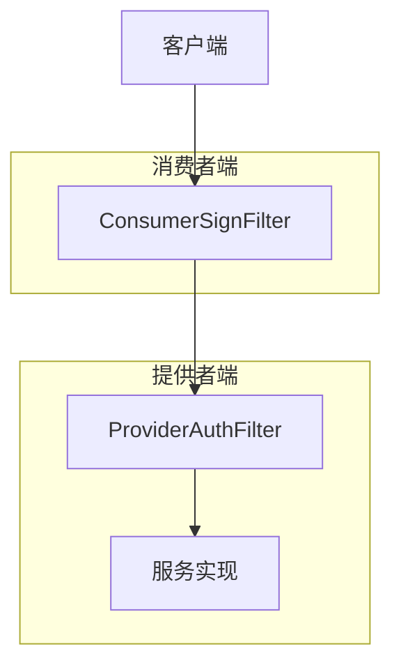
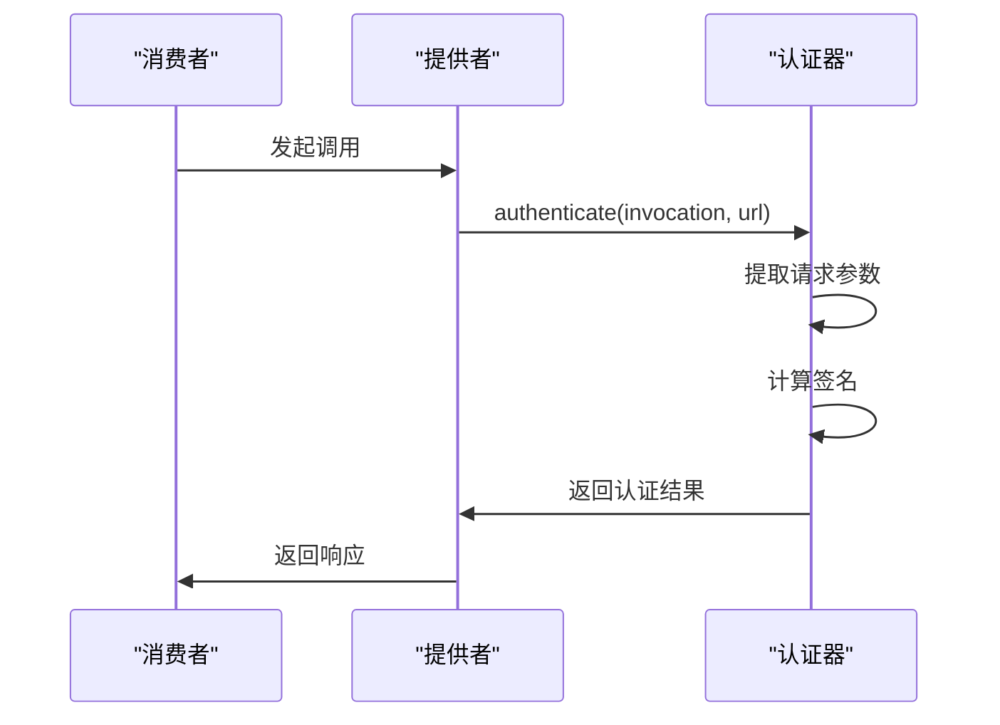
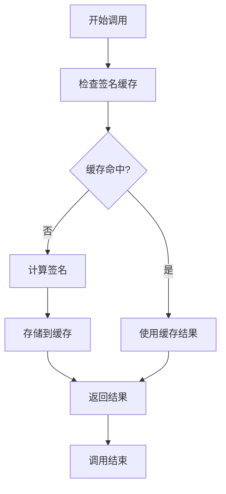

# 方法级别授权

<cite>
**本文档中引用的文件**  
- [ProviderAuthFilter.java](file://dubbo-plugin\dubbo-auth\src\main\java\org\apache\dubbo\auth\filter\ProviderAuthFilter.java)
- [ConsumerSignFilter.java](file://dubbo-plugin\dubbo-auth\src\main\java\org\apache\dubbo\auth\filter\ConsumerSignFilter.java)
- [AccessKeyAuthenticator.java](file://dubbo-plugin\dubbo-auth\src\main\java\org\apache\dubbo\auth\AccessKeyAuthenticator.java)
- [BasicAuthenticator.java](file://dubbo-plugin\dubbo-auth\src\main\java\org\apache\dubbo\auth\BasicAuthenticator.java)
- [SignatureUtils.java](file://dubbo-plugin\dubbo-auth\src\main\java\org\apache\dubbo\auth\utils\SignatureUtils.java)
- [Constants.java](file://dubbo-plugin\dubbo-auth\src\main\java\org\apache\dubbo\auth\Constants.java)
- [Authenticator.java](file://dubbo-plugin\dubbo-auth\src\main\java\org\apache\dubbo\auth\spi\Authenticator.java)
- [org.apache.dubbo.rpc.Filter](file://dubbo-plugin\dubbo-auth\src\main\resources\META-INF\dubbo\internal\org.apache.dubbo.rpc.Filter)
- [org.apache.dubbo.auth.spi.Authenticator](file://dubbo-plugin\dubbo-auth\src\main\resources\META-INF\dubbo\internal\org.apache.dubbo.auth.spi.Authenticator)
</cite>

## 目录
1. [简介](#简介)
2. [方法级别授权机制](#方法级别授权机制)
3. [实现原理](#实现原理)
4. [配置示例](#配置示例)
5. [性能优化](#性能优化)
6. [高级应用](#高级应用)
7. [总结](#总结)

## 简介
Dubbo框架提供了细粒度的方法级别授权机制，允许为服务中的特定方法设置不同的访问权限。该机制通过过滤器链和认证器实现，支持基于参数值的条件授权和基于属性的访问控制（ABAC）。方法级别授权与服务级别授权相结合，提供了灵活的安全控制策略。

## 方法级别授权机制
Dubbo的方法级别授权机制基于过滤器模式实现，通过在服务提供者和消费者端分别部署认证过滤器来实现安全控制。该机制支持多种认证方式，包括基于访问密钥的认证和基于用户名密码的基本认证。



**图源**  
- [ProviderAuthFilter.java](file://dubbo-plugin\dubbo-auth\src\main\java\org\apache\dubbo\auth\filter\ProviderAuthFilter.java)
- [ConsumerSignFilter.java](file://dubbo-plugin\dubbo-auth\src\main\java\org\apache\dubbo\auth\filter\ConsumerSignFilter.java)

**本节来源**  
- [ProviderAuthFilter.java](file://dubbo-plugin\dubbo-auth\src\main\java\org\apache\dubbo\auth\filter\ProviderAuthFilter.java)
- [ConsumerSignFilter.java](file://dubbo-plugin\dubbo-auth\src\main\java\org\apache\dubbo\auth\filter\ConsumerSignFilter.java)

## 实现原理
方法级别授权的实现基于Dubbo的扩展机制，通过SPI（Service Provider Interface）加载认证器和过滤器。核心组件包括认证过滤器、认证器接口和签名工具类。

### 方法签名识别
方法签名通过`RpcUtils.getMethodName(invocation)`获取，结合服务URL的标识符构成唯一的请求标识。该标识用于生成和验证请求签名。

### 参数级别权限检查
参数级别的权限检查通过序列化参数数组并将其包含在签名计算中实现。当启用参数签名时，所有方法参数都会被序列化并参与签名计算。

### 返回值访问控制
返回值的访问控制通过在调用链中传递认证状态实现。一旦请求通过认证，认证状态会被标记在调用上下文中，确保后续处理可以识别已认证的请求。



**图源**  
- [AccessKeyAuthenticator.java](file://dubbo-plugin\dubbo-auth\src\main\java\org\apache\dubbo\auth\AccessKeyAuthenticator.java)
- [SignatureUtils.java](file://dubbo-plugin\dubbo-auth\src\main\java\org\apache\dubbo\auth\utils\SignatureUtils.java)

**本节来源**  
- [AccessKeyAuthenticator.java](file://dubbo-plugin\dubbo-auth\src\main\java\org\apache\dubbo\auth\AccessKeyAuthenticator.java)
- [SignatureUtils.java](file://dubbo-plugin\dubbo-auth\src\main\java\org\apache\dubbo\auth\utils\SignatureUtils.java)

## 配置示例
### 基本配置
通过在服务配置中启用认证功能，可以为服务启用方法级别授权：

```java
// 服务提供者配置
ServiceConfig<DemoService> service = new ServiceConfig<>();
service.setInterface(DemoService.class);
service.setRef(new DemoServiceImpl());
service.setParameters(Collections.singletonMap("auth", "true"));
```

### 基于注解的配置
使用注解方式配置方法级别授权：

```java
@DubboService(parameters = {"auth", "true", "authenticator", "accesskey"})
public class DemoServiceImpl implements DemoService {
    @Override
    public String sayHello(String name) {
        return "Hello " + name;
    }
}
```

### 基于参数的条件授权
通过配置参数签名启用基于参数值的条件授权：

```properties
# 启用参数签名
param.sign=true
# 访问密钥ID
.accessKeyId=your-access-key-id
# 密钥
.secretAccessKey=your-secret-key
```

**本节来源**  
- [Constants.java](file://dubbo-plugin\dubbo-auth\src\main\java\org\apache\dubbo\auth\Constants.java)
- [org.apache.dubbo.rpc.Filter](file://dubbo-plugin\dubbo-auth\src\main\resources\META-INF\dubbo\internal\org.apache.dubbo.rpc.Filter)

## 性能优化
### 方法签名缓存
Dubbo通过缓存方法签名来减少重复计算的开销。签名计算结果会被存储在本地缓存中，避免每次调用都重新计算。

### 权限检查的懒加载
权限检查采用懒加载策略，只有在首次访问需要认证的方法时才会初始化认证器。这减少了服务启动时的初始化开销。

### 缓存策略


**图源**  
- [SignatureUtils.java](file://dubbo-plugin\dubbo-auth\src\main\java\org\apache\dubbo\auth\utils\SignatureUtils.java)

**本节来源**  
- [SignatureUtils.java](file://dubbo-plugin\dubbo-auth\src\main\java\org\apache\dubbo\auth\utils\SignatureUtils.java)

## 高级应用
### 基于属性的访问控制（ABAC）
Dubbo支持基于属性的访问控制，通过自定义认证器实现复杂的授权逻辑。开发者可以基于用户属性、环境属性和资源属性实现细粒度的访问控制。

### 自定义认证器
实现自定义认证器接口以支持特定的认证需求：

```java
@SPI("custom")
public class CustomAuthenticator implements Authenticator {
    @Override
    public void sign(Invocation invocation, URL url) {
        // 自定义签名逻辑
    }
    
    @Override
    public void authenticate(Invocation invocation, URL url) throws RpcAuthenticationException {
        // 自定义认证逻辑
    }
}
```

### 组合策略
方法级别授权与服务级别授权的优先级关系遵循"最细粒度优先"原则。当同时配置了服务级别和方法级别的授权规则时，方法级别的规则具有更高的优先级。

**本节来源**  
- [Authenticator.java](file://dubbo-plugin\dubbo-auth\src\main\java\org\apache\dubbo\auth\spi\Authenticator.java)
- [org.apache.dubbo.auth.spi.Authenticator](file://dubbo-plugin\dubbo-auth\src\main\resources\META-INF\dubbo\internal\org.apache.dubbo.auth.spi.Authenticator)

## 总结
Dubbo的方法级别授权机制提供了灵活而强大的安全控制能力。通过过滤器链、认证器接口和签名工具的组合，实现了细粒度的访问控制。该机制支持多种认证方式和配置模式，既适合初学者快速上手，也为高级用户提供了扩展空间。性能优化策略确保了安全控制不会成为系统瓶颈。

**本节来源**  
- [ProviderAuthFilter.java](file://dubbo-plugin\dubbo-auth\src\main\java\org\apache\dubbo\auth\filter\ProviderAuthFilter.java)
- [AccessKeyAuthenticator.java](file://dubbo-plugin\dubbo-auth\src\main\java\org\apache\dubbo\auth\AccessKeyAuthenticator.java)
- [SignatureUtils.java](file://dubbo-plugin\dubbo-auth\src\main\java\org\apache\dubbo\auth\utils\SignatureUtils.java)