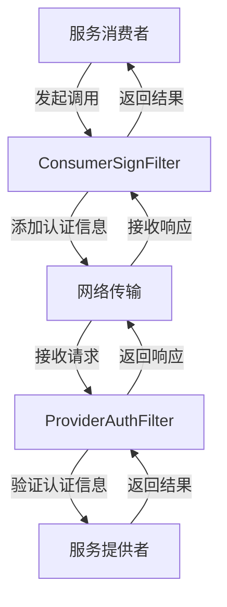
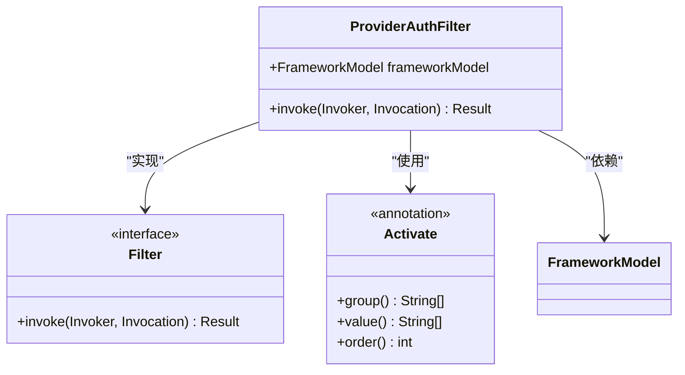
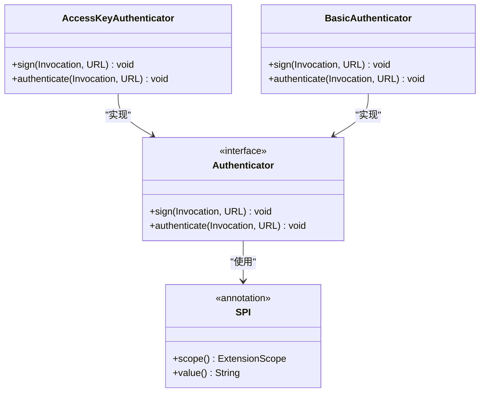
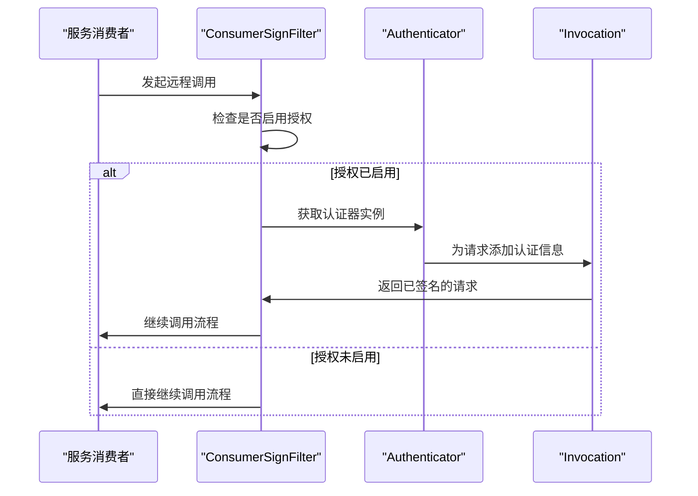
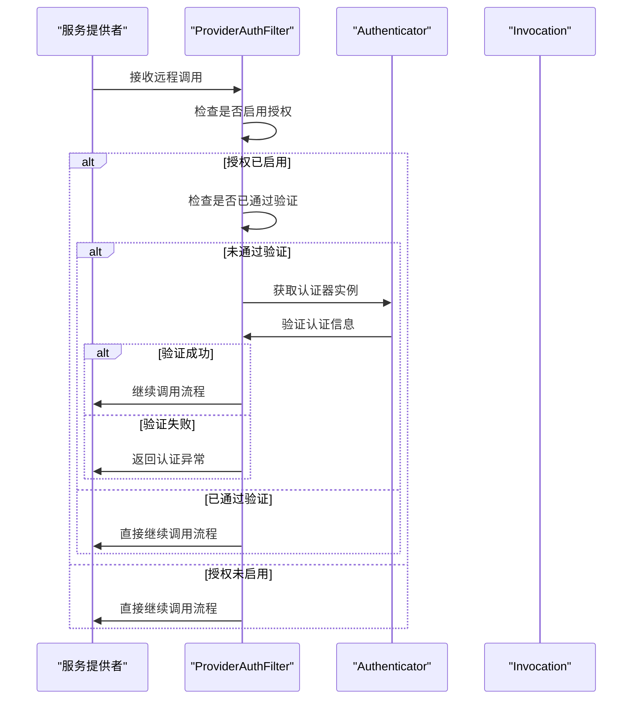
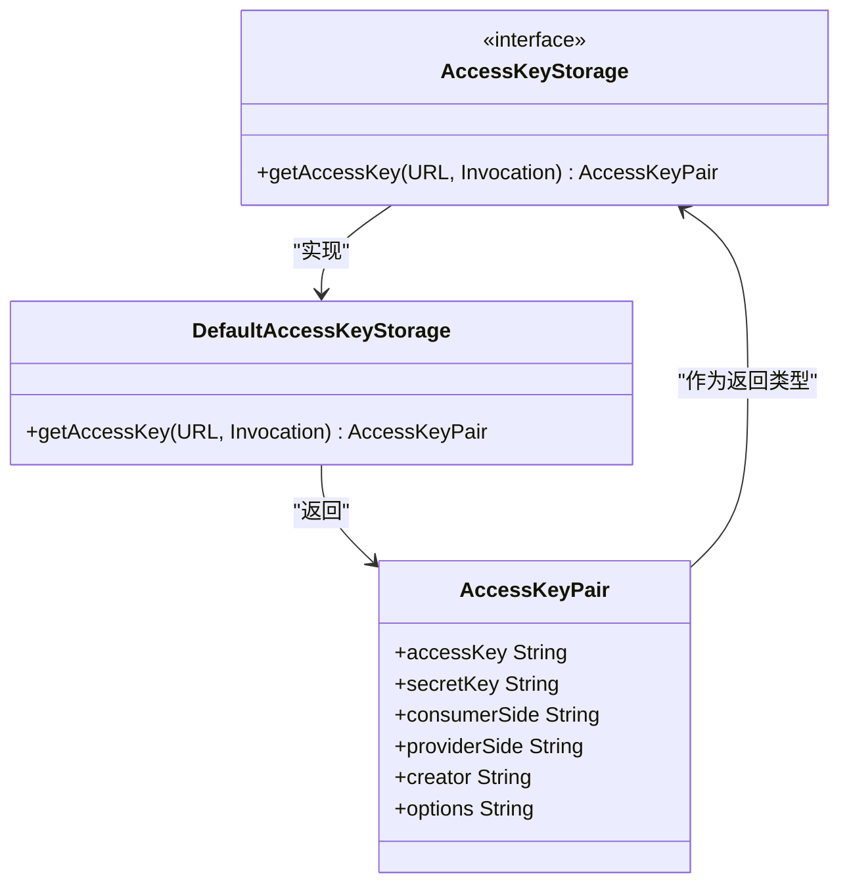
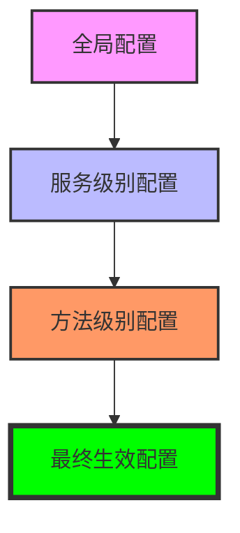
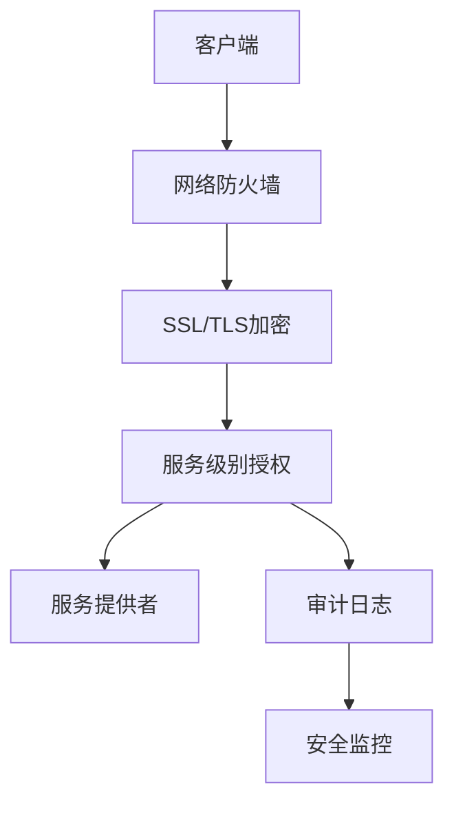

# 服务级别授权

<cite>
**本文档中引用的文件**   
- [ProviderAuthFilter.java](file://dubbo-plugin\dubbo-auth\src\main\java\org\apache\dubbo\auth\filter\ProviderAuthFilter.java)
- [ConsumerSignFilter.java](file://dubbo-plugin\dubbo-auth\src\main\java\org\apache\dubbo\auth\filter\ConsumerSignFilter.java)
- [Authenticator.java](file://dubbo-plugin\dubbo-auth\src\main\java\org\apache\dubbo\auth\spi\Authenticator.java)
- [Constants.java](file://dubbo-plugin\dubbo-auth\src\main\java\org\apache\dubbo\auth\Constants.java)
- [AccessKeyAuthenticator.java](file://dubbo-plugin\dubbo-auth\src\main\java\org\apache\dubbo\auth\AccessKeyAuthenticator.java)
- [BasicAuthenticator.java](file://dubbo-plugin\dubbo-auth\src\main\java\org\apache\dubbo\auth\BasicAuthenticator.java)
- [AccessKeyStorage.java](file://dubbo-plugin\dubbo-auth\src\main\java\org\apache\dubbo\auth\spi\AccessKeyStorage.java)
- [DefaultAccessKeyStorage.java](file://dubbo-plugin\dubbo-auth\src\main\java\org\apache\dubbo\auth\DefaultAccessKeyStorage.java)
- [AccessKeyPair.java](file://dubbo-plugin\dubbo-auth\src\main\java\org\apache\dubbo\auth\model\AccessKeyPair.java)
</cite>

## 目录
1. [简介](#简介)
2. [服务级别授权机制](#服务级别授权机制)
3. [核心组件分析](#核心组件分析)
4. [授权流程详解](#授权流程详解)
5. [配置方式](#配置方式)
6. [授权规则优先级](#授权规则优先级)
7. [安全机制协同工作](#安全机制协同工作)
8. [配置示例](#配置示例)
9. [性能影响与优化](#性能影响与优化)
10. [初学者指南](#初学者指南)
11. [高级多租户场景](#高级多租户场景)

## 简介
Dubbo框架提供了完善的服务级别授权机制，用于控制对远程服务的访问权限。该机制通过配置文件或注解方式为整个服务设置访问控制策略，确保只有经过授权的客户端才能调用特定服务。本文档详细解释了Dubbo中服务级别授权的实现原理、配置方法和最佳实践。

## 服务级别授权机制
Dubbo的服务级别授权机制基于过滤器模式实现，通过在服务提供者和消费者端插入授权过滤器来控制访问权限。该机制支持多种授权方式，包括基本认证和访问密钥认证，能够满足不同安全需求的场景。

**服务级别授权的核心特点：**
- 基于SPI扩展机制，支持自定义授权实现
- 支持服务级别的细粒度访问控制
- 提供灵活的配置选项，可通过配置文件或注解设置
- 支持多种认证方式，包括基本认证和访问密钥认证
- 可与其他安全机制（如SSL/TLS）协同工作



**图示来源**
- [ConsumerSignFilter.java](file://dubbo-plugin\dubbo-auth\src\main\java\org\apache\dubbo\auth\filter\ConsumerSignFilter.java)
- [ProviderAuthFilter.java](file://dubbo-plugin\dubbo-auth\src\main\java\org\apache\dubbo\auth\filter\ProviderAuthFilter.java)

## 核心组件分析

### 授权过滤器
Dubbo的授权机制主要由两个核心过滤器实现：`ConsumerSignFilter`和`ProviderAuthFilter`。这两个过滤器分别在消费者端和提供者端执行，共同完成服务级别的访问控制。

#### ConsumerSignFilter
`ConsumerSignFilter`是消费者端的授权过滤器，负责在发起远程调用前为请求添加认证信息。该过滤器通过`@Activate`注解注册到Dubbo的过滤器链中，当服务消费者启用授权功能时，该过滤器会被激活。


**图示来源**
- [ConsumerSignFilter.java](file://dubbo-plugin\dubbo-auth\src\main\java\org\apache\dubbo\auth\filter\ConsumerSignFilter.java)

#### ProviderAuthFilter
`ProviderAuthFilter`是提供者端的授权过滤器，负责验证来自消费者的请求是否具有合法的访问权限。该过滤器同样通过`@Activate`注解注册，当服务提供者启用授权功能时，该过滤器会被激活。



**图示来源**
- [ProviderAuthFilter.java](file://dubbo-plugin\dubbo-auth\src\main\java\org\apache\dubbo\auth\filter\ProviderAuthFilter.java)

### 认证器接口
`Authenticator`接口是Dubbo授权机制的核心，定义了认证器的基本行为。该接口通过SPI机制扩展，支持多种认证方式的实现。



**图示来源**
- [Authenticator.java](file://dubbo-plugin\dubbo-auth\src\main\java\org\apache\dubbo\auth\spi\Authenticator.java)
- [AccessKeyAuthenticator.java](file://dubbo-plugin\dubbo-auth\src\main\java\org\apache\dubbo\auth\AccessKeyAuthenticator.java)
- [BasicAuthenticator.java](file://dubbo-plugin\dubbo-auth\src\main\java\org\apache\dubbo\auth\BasicAuthenticator.java)

**本节来源**
- [Authenticator.java](file://dubbo-plugin\dubbo-auth\src\main\java\org\apache\dubbo\auth\spi\Authenticator.java)
- [AccessKeyAuthenticator.java](file://dubbo-plugin\dubbo-auth\src\main\java\org\apache\dubbo\auth\AccessKeyAuthenticator.java)
- [BasicAuthenticator.java](file://dubbo-plugin\dubbo-auth\src\main\java\org\apache\dubbo\auth\BasicAuthenticator.java)

## 授权流程详解
Dubbo的服务级别授权流程分为两个阶段：消费者端的签名阶段和提供者端的验证阶段。整个流程通过过滤器链实现，确保每个远程调用都经过完整的授权检查。

### 消费者端签名流程
当服务消费者发起远程调用时，`ConsumerSignFilter`会拦截调用请求，并根据配置的认证器为请求添加认证信息。具体流程如下：



**图示来源**
- [ConsumerSignFilter.java](file://dubbo-plugin\dubbo-auth\src\main\java\org\apache\dubbo\auth\filter\ConsumerSignFilter.java)

### 提供者端验证流程
当服务提供者接收到远程调用请求时，`ProviderAuthFilter`会拦截请求，并验证其中的认证信息是否合法。具体流程如下：



**图示来源**
- [ProviderAuthFilter.java](file://dubbo-plugin\dubbo-auth\src\main\java\org\apache\dubbo\auth\filter\ProviderAuthFilter.java)

### 访问密钥存储机制
Dubbo提供了灵活的访问密钥存储机制，通过`AccessKeyStorage`接口实现。该接口支持从不同来源获取访问密钥对，包括URL参数、文件系统等。



**图示来源**
- [AccessKeyStorage.java](file://dubbo-plugin\dubbo-auth\src\main\java\org\apache\dubbo\auth\spi\AccessKeyStorage.java)
- [DefaultAccessKeyStorage.java](file://dubbo-plugin\dubbo-auth\src\main\java\org\apache\dubbo\auth\DefaultAccessKeyStorage.java)
- [AccessKeyPair.java](file://dubbo-plugin\dubbo-auth\src\main\java\org\apache\dubbo\auth\model\AccessKeyPair.java)

**本节来源**
- [AccessKeyStorage.java](file://dubbo-plugin\dubbo-auth\src\main\java\org\apache\dubbo\auth\spi\AccessKeyStorage.java)
- [DefaultAccessKeyStorage.java](file://dubbo-plugin\dubbo-auth\src\main\java\org\apache\dubbo\auth\DefaultAccessKeyStorage.java)
- [AccessKeyPair.java](file://dubbo-plugin\dubbo-auth\src\main\java\org\apache\dubbo\auth\model\AccessKeyPair.java)

## 配置方式
Dubbo提供了多种方式来配置服务级别的授权功能，包括XML配置、注解配置和API配置。这些配置方式可以灵活组合，满足不同场景的需求。

### XML配置
通过Spring XML配置文件可以方便地为服务启用授权功能。以下是一个典型的XML配置示例：

```xml
<dubbo:service interface="com.example.DemoService" ref="demoService" auth="true" authenticator="accesskey"/>
<dubbo:reference interface="com.example.DemoService" auth="true" authenticator="accesskey"/>
```

### 注解配置
Dubbo也支持通过注解方式配置授权功能。服务提供者和消费者可以通过`@Service`和`@Reference`注解的参数来启用授权：

```java
@Service(auth = "true", authenticator = "accesskey")
public class DemoServiceImpl implements DemoService {
    // 服务实现
}

@Reference(auth = "true", authenticator = "accesskey")
private DemoService demoService;
```

### API配置
对于需要动态配置的场景，可以通过API方式设置授权参数：

```java
ServiceConfig<DemoService> serviceConfig = new ServiceConfig<>();
serviceConfig.setInterface(DemoService.class);
serviceConfig.setRef(demoService);
serviceConfig.setParameters(Collections.singletonMap("auth", "true"));
serviceConfig.setParameters(Collections.singletonMap("authenticator", "accesskey"));
```

**本节来源**
- [Constants.java](file://dubbo-plugin\dubbo-auth\src\main\java\org\apache\dubbo\auth\Constants.java)

## 授权规则优先级
Dubbo的授权规则遵循一定的优先级顺序，确保配置的一致性和可预测性。当多个配置源同时存在时，优先级较高的配置会覆盖优先级较低的配置。

### 优先级规则
1. **方法级别配置**：优先级最高，可以覆盖服务级别的配置
2. **服务级别配置**：优先级次之，可以覆盖全局配置
3. **全局配置**：优先级最低，作为默认配置

### 配置继承
Dubbo支持配置的继承机制，子配置可以继承父配置的属性，并根据需要进行覆盖。这种机制使得配置管理更加灵活和高效。



**图示来源**
- [Constants.java](file://dubbo-plugin\dubbo-auth\src\main\java\org\apache\dubbo\auth\Constants.java)

## 安全机制协同工作
Dubbo的服务级别授权机制可以与其他安全机制协同工作，形成多层次的安全防护体系。这种协同工作模式能够提供更全面的安全保障。

### 与SSL/TLS协同
服务级别授权可以与SSL/TLS加密传输协同工作，既保证了通信的机密性，又确保了访问的合法性。SSL/TLS负责传输层的安全，而服务级别授权负责应用层的访问控制。

### 与防火墙协同
服务级别授权可以与网络防火墙协同工作，形成内外两层的访问控制。防火墙负责网络层面的访问控制，而服务级别授权负责应用层面的细粒度访问控制。

### 与审计日志协同
授权机制可以与审计日志系统集成，记录所有授权相关的操作。这有助于安全审计和问题排查，提高系统的可追溯性。



**图示来源**
- [ProviderAuthFilter.java](file://dubbo-plugin\dubbo-auth\src\main\java\org\apache\dubbo\auth\filter\ProviderAuthFilter.java)

## 配置示例
以下提供几个典型的配置示例，展示如何为不同的服务设置不同的访问控制策略。

### 白名单配置
通过配置白名单，只允许特定的客户端访问服务：

```xml
<dubbo:service interface="com.example.PublicService" ref="publicService" auth="true" authenticator="basic">
    <dubbo:parameter key="username" value="public"/>
    <dubbo:parameter key="password" value="public123"/>
</dubbo:service>
```

### 黑名单配置
通过配置黑名单，禁止特定的客户端访问服务。这通常通过自定义认证器实现：

```java
public class BlacklistAuthenticator implements Authenticator {
    private Set<String> blacklist = new HashSet<>();
    
    @Override
    public void sign(Invocation invocation, URL url) {
        // 添加客户端标识到请求
        invocation.setAttachment("client.id", getClientId());
    }
    
    @Override
    public void authenticate(Invocation invocation, URL url) throws RpcAuthenticationException {
        String clientId = (String) invocation.getAttachment("client.id");
        if (blacklist.contains(clientId)) {
            throw new RpcAuthenticationException("Client in blacklist: " + clientId);
        }
    }
}
```

### 基于角色的访问控制
通过配置基于角色的访问控制，实现更细粒度的权限管理：

```java
public class RoleBasedAuthenticator implements Authenticator {
    private Map<String, Set<String>> rolePermissions = new HashMap<>();
    
    @Override
    public void sign(Invocation invocation, URL url) {
        // 获取用户角色并添加到请求
        String role = getUserRole();
        invocation.setAttachment("user.role", role);
    }
    
    @Override
    public void authenticate(Invocation invocation, URL url) throws RpcAuthenticationException {
        String methodName = RpcUtils.getMethodName(invocation);
        String role = (String) invocation.getAttachment("user.role");
        
        Set<String> permissions = rolePermissions.get(role);
        if (permissions == null || !permissions.contains(methodName)) {
            throw new RpcAuthenticationException("No permission for role: " + role);
        }
    }
}
```

**本节来源**
- [BasicAuthenticator.java](file://dubbo-plugin\dubbo-auth\src\main\java\org\apache\dubbo\auth\BasicAuthenticator.java)
- [Authenticator.java](file://dubbo-plugin\dubbo-auth\src\main\java\org\apache\dubbo\auth\spi\Authenticator.java)

## 性能影响与优化
服务级别授权机制虽然提高了系统的安全性，但也会带来一定的性能开销。了解这些性能影响并采取相应的优化措施，可以在安全性和性能之间取得平衡。

### 性能影响分析
1. **CPU开销**：认证过程中的加密计算会消耗CPU资源
2. **内存开销**：认证信息的存储和处理需要额外的内存
3. **网络开销**：认证信息会增加请求的大小
4. **延迟增加**：认证过程会增加请求的处理时间

### 优化建议
#### 缓存机制
通过缓存已验证的请求，避免重复的认证计算：

```java
public class CachedAuthenticator implements Authenticator {
    private LoadingCache<String, Boolean> authCache = CacheBuilder.newBuilder()
        .maximumSize(1000)
        .expireAfterWrite(5, TimeUnit.MINUTES)
        .build(this::doAuthenticate);
    
    @Override
    public void authenticate(Invocation invocation, URL url) throws RpcAuthenticationException {
        String cacheKey = generateCacheKey(invocation, url);
        Boolean result = authCache.getUnchecked(cacheKey);
        if (!result) {
            throw new RpcAuthenticationException("Authentication failed");
        }
    }
    
    private boolean doAuthenticate(String cacheKey) {
        // 执行实际的认证逻辑
        return true;
    }
}
```

#### 快速失败策略
在认证失败时立即返回，避免不必要的处理：

```java
public class FastFailAuthenticator implements Authenticator {
    @Override
    public void authenticate(Invocation invocation, URL url) throws RpcAuthenticationException {
        // 快速检查基本条件
        if (!hasRequiredAttachments(invocation)) {
            throw new RpcAuthenticationException("Missing required authentication information");
        }
        
        // 执行完整的认证逻辑
        doAuthenticate(invocation, url);
    }
}
```

#### 异步认证
对于非关键服务，可以考虑使用异步认证，减少对主调用流程的影响：

```java
public class AsyncAuthenticator implements Authenticator {
    private ExecutorService executor = Executors.newFixedThreadPool(10);
    
    @Override
    public void authenticate(Invocation invocation, URL url) throws RpcAuthenticationException {
        Future<?> future = executor.submit(() -> {
            try {
                doAuthenticate(invocation, url);
            } catch (Exception e) {
                // 记录异步认证失败，但不阻塞主流程
                logger.warn("Async authentication failed", e);
            }
        });
        
        // 不等待认证结果，立即返回
    }
}
```

**本节来源**
- [ProviderAuthFilter.java](file://dubbo-plugin\dubbo-auth\src\main\java\org\apache\dubbo\auth\filter\ProviderAuthFilter.java)
- [Authenticator.java](file://dubbo-plugin\dubbo-auth\src\main\java\org\apache\dubbo\auth\spi\Authenticator.java)

## 初学者指南
对于初学者来说，理解Dubbo的服务级别授权机制可能需要一些时间。本节提供一个简单的入门指南，帮助初学者快速上手。

### 基本配置步骤
1. **启用授权功能**：在服务提供者和消费者端的配置中设置`auth=true`
2. **选择认证方式**：通过`authenticator`参数选择合适的认证方式
3. **配置认证参数**：根据选择的认证方式，配置相应的参数
4. **测试授权功能**：通过调用服务验证授权功能是否正常工作

### 简单示例
以下是一个简单的示例，展示如何为服务启用基本认证：

```java
// 服务提供者配置
@Service(auth = "true", authenticator = "basic")
public class SimpleServiceImpl implements SimpleService {
    @Override
    public String hello(String name) {
        return "Hello, " + name;
    }
}

// 服务消费者配置
@Reference(auth = "true", authenticator = "basic")
private SimpleService simpleService;
```

### 常见问题
1. **认证失败**：检查用户名和密码是否正确配置
2. **性能下降**：考虑使用缓存机制优化性能
3. **配置不生效**：检查配置的优先级和继承关系

**本节来源**
- [Constants.java](file://dubbo-plugin\dubbo-auth\src\main\java\org\apache\dubbo\auth\Constants.java)
- [BasicAuthenticator.java](file://dubbo-plugin\dubbo-auth\src\main\java\org\apache\dubbo\auth\BasicAuthenticator.java)

## 高级多租户场景
在多租户场景下，服务级别授权机制可以发挥更大的作用，实现租户间的隔离和访问控制。

### 多租户隔离方案
通过自定义认证器，实现基于租户的访问控制：

```java
public class TenantIsolationAuthenticator implements Authenticator {
    private Map<String, Set<String>> tenantServices = new HashMap<>();
    
    @Override
    public void sign(Invocation invocation, URL url) {
        // 获取当前租户信息
        String tenantId = getCurrentTenantId();
        invocation.setAttachment("tenant.id", tenantId);
    }
    
    @Override
    public void authenticate(Invocation invocation, URL url) throws RpcAuthenticationException {
        String serviceName = url.getServiceInterface();
        String tenantId = (String) invocation.getAttachment("tenant.id");
        
        Set<String> allowedServices = tenantServices.get(tenantId);
        if (allowedServices == null || !allowedServices.contains(serviceName)) {
            throw new RpcAuthenticationException("Tenant " + tenantId + " not allowed to access " + serviceName);
        }
    }
}
```

### 动态权限管理
在多租户场景下，权限可能需要动态调整。通过实现动态权限管理，可以实时更新租户的访问权限：

```java
public class DynamicPermissionAuthenticator implements Authenticator {
    private PermissionService permissionService;
    
    @Override
    public void authenticate(Invocation invocation, URL url) throws RpcAuthenticationException {
        String serviceName = url.getServiceInterface();
        String methodName = RpcUtils.getMethodName(invocation);
        String userId = getUserId(invocation);
        
        // 从权限服务获取实时权限
        boolean hasPermission = permissionService.hasPermission(userId, serviceName, methodName);
        if (!hasPermission) {
            throw new RpcAuthenticationException("User " + userId + " has no permission to call " + serviceName + "." + methodName);
        }
    }
}
```

### 租户配额控制
除了访问控制，还可以实现租户的配额控制，限制每个租户的调用频率：

```java
public class QuotaControlAuthenticator implements Authenticator {
    private RateLimiterService rateLimiterService;
    
    @Override
    public void authenticate(Invocation invocation, URL url) throws RpcAuthenticationException {
        String tenantId = getTenantId(invocation);
        
        // 检查调用配额
        boolean allowed = rateLimiterService.tryAcquire(tenantId, 1);
        if (!allowed) {
            throw new RpcAuthenticationException("Tenant " + tenantId + " has exceeded call quota");
        }
    }
}
```

**本节来源**
- [Authenticator.java](file://dubbo-plugin\dubbo-auth\src\main\java\org\apache\dubbo\auth\spi\Authenticator.java)