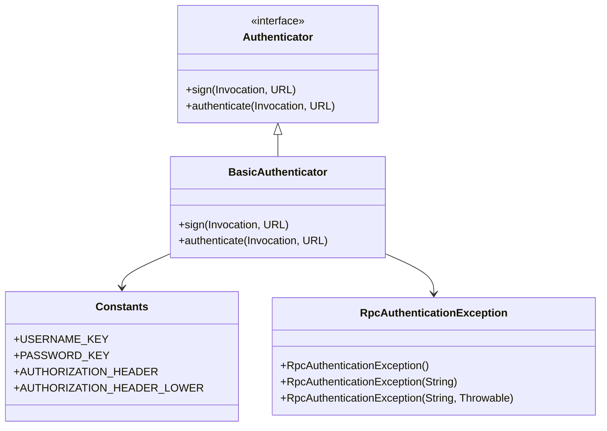
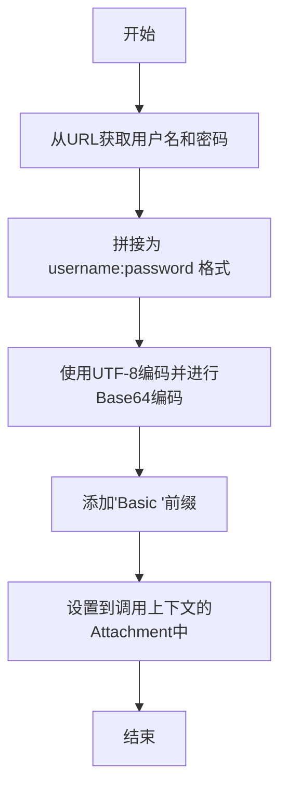
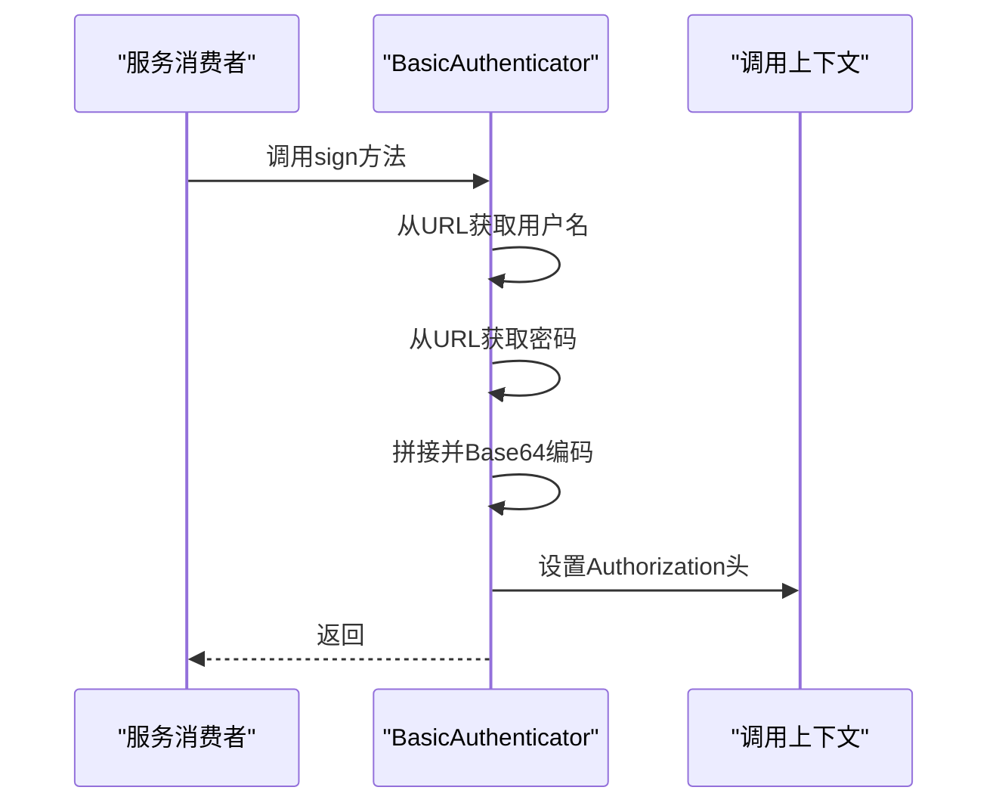
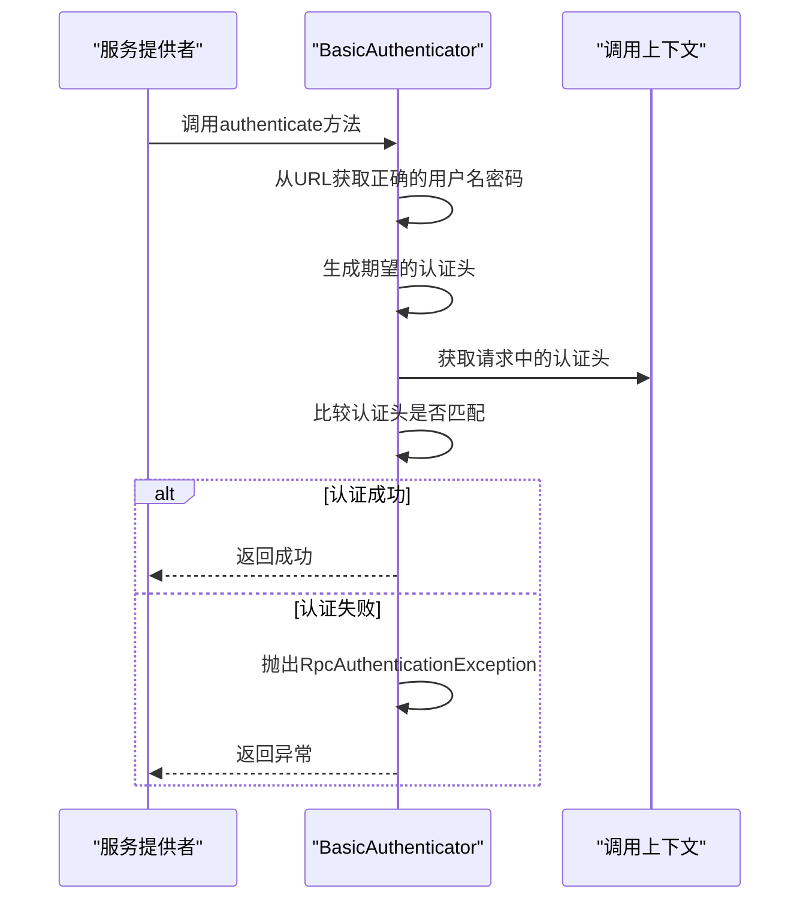
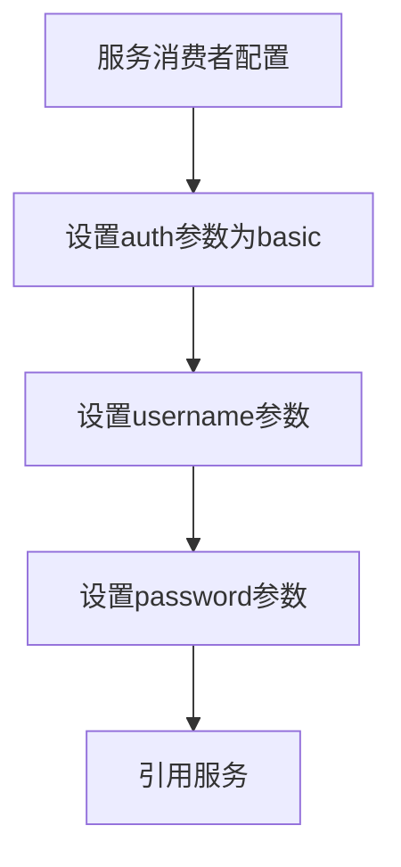
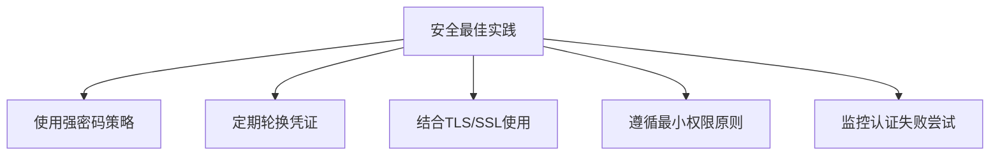
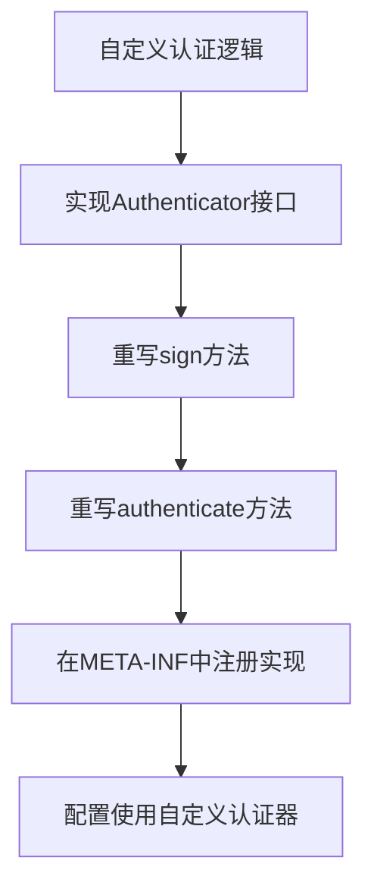
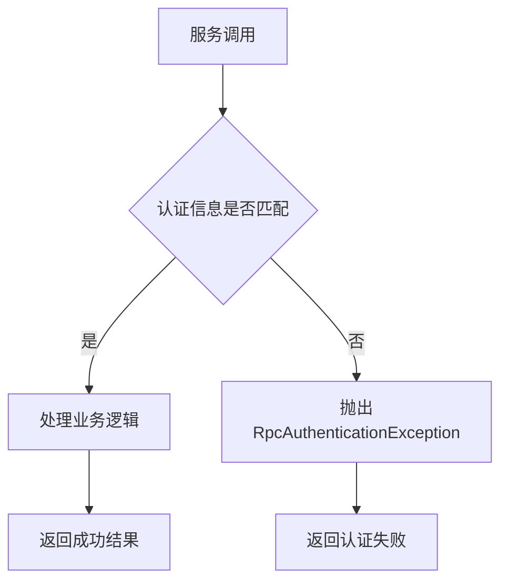

# 基本认证

<cite>
**本文档中引用的文件**  
- [BasicAuthenticator.java](file://dubbo-plugin\dubbo-auth\src\main\java\org\apache\dubbo\auth\BasicAuthenticator.java)
- [Authenticator.java](file://dubbo-plugin\dubbo-auth\src\main\java\org\apache\dubbo\auth\spi\Authenticator.java)
- [Constants.java](file://dubbo-plugin\dubbo-auth\src\main\java\org\apache\dubbo\auth\Constants.java)
- [RpcAuthenticationException.java](file://dubbo-plugin\dubbo-auth\src\main\java\org\apache\dubbo\auth\exception\RpcAuthenticationException.java)
- [org.apache.dubbo.auth.spi.Authenticator](file://dubbo-plugin\dubbo-auth\src\main\resources\META-INF\dubbo\internal\org.apache.dubbo.auth.spi.Authenticator)
</cite>

## 目录
1. [简介](#简介)
2. [核心组件](#核心组件)
3. [基本认证实现原理](#基本认证实现原理)
4. [认证流程分析](#认证流程分析)
5. [配置方法](#配置方法)
6. [安全考虑](#安全考虑)
7. [使用示例](#使用示例)

## 简介
Dubbo框架提供了基本认证机制，用于在服务调用过程中验证消费者和提供者之间的身份。该机制基于HTTP基本认证原理，通过在调用上下文中添加认证信息来实现服务级别的安全控制。本文档详细解释了BasicAuthenticator的实现原理、工作流程以及配置方法。

## 核心组件

Dubbo基本认证系统由多个核心组件构成，包括认证器接口、具体实现类、常量定义和异常类。这些组件协同工作，实现了完整的认证功能。

**核心组件关系图**


**图示来源**
- [Authenticator.java](file://dubbo-plugin\dubbo-auth\src\main\java\org\apache\dubbo\auth\spi\Authenticator.java#L25-L43)
- [BasicAuthenticator.java](file://dubbo-plugin\dubbo-auth\src\main\java\org\apache\dubbo\auth\BasicAuthenticator.java#L28-L54)
- [Constants.java](file://dubbo-plugin\dubbo-auth\src\main\java\org\apache\dubbo\auth\Constants.java#L19-L55)
- [RpcAuthenticationException.java](file://dubbo-plugin\dubbo-auth\src\main\java\org\apache\dubbo\auth\exception\RpcAuthenticationException.java#L19-L29)

**本节来源**
- [Authenticator.java](file://dubbo-plugin\dubbo-auth\src\main\java\org\apache\dubbo\auth\spi\Authenticator.java)
- [BasicAuthenticator.java](file://dubbo-plugin\dubbo-auth\src\main\java\org\apache\dubbo\auth\BasicAuthenticator.java)
- [Constants.java](file://dubbo-plugin\dubbo-auth\src\main\java\org\apache\dubbo\auth\Constants.java)

## 基本认证实现原理

### 认证器接口设计
Dubbo的基本认证基于SPI（Service Provider Interface）扩展机制实现。`Authenticator`接口定义了两个核心方法：`sign`用于生成认证签名，`authenticate`用于验证认证信息。

```java
@SPI(scope = ExtensionScope.FRAMEWORK, value = "basic")
public interface Authenticator {
    void sign(Invocation invocation, URL url);
    void authenticate(Invocation invocation, URL url) throws RpcAuthenticationException;
}
```

该接口使用`@SPI`注解标记，指定默认实现为"basic"，即`BasicAuthenticator`。

### 认证信息编码
基本认证采用Base64编码方式对用户名和密码进行加密传输。认证头的格式遵循HTTP基本认证标准："Basic " + Base64编码的"username:password"。

**认证信息编码流程**


**图示来源**
- [BasicAuthenticator.java](file://dubbo-plugin\dubbo-auth\src\main\java\org\apache\dubbo\auth\BasicAuthenticator.java#L31-L38)

**本节来源**
- [BasicAuthenticator.java](file://dubbo-plugin\dubbo-auth\src\main\java\org\apache\dubbo\auth\BasicAuthenticator.java#L30-L39)

## 认证流程分析

### 服务消费者认证流程
当服务消费者发起调用时，`sign`方法会被调用，负责在请求中添加认证信息。



**图示来源**
- [BasicAuthenticator.java](file://dubbo-plugin\dubbo-auth\src\main\java\org\apache\dubbo\auth\BasicAuthenticator.java#L31-L38)

### 服务提供者认证验证流程
当服务提供者接收到请求时，`authenticate`方法会被调用，负责验证请求中的认证信息。



**图示来源**
- [BasicAuthenticator.java](file://dubbo-plugin\dubbo-auth\src\main\java\org\apache\dubbo\auth\BasicAuthenticator.java#L42-L53)

**本节来源**
- [BasicAuthenticator.java](file://dubbo-plugin\dubbo-auth\src\main\java\org\apache\dubbo\auth\BasicAuthenticator.java#L30-L54)

## 配置方法

### 服务提供者端配置
在服务提供者端启用基本认证需要在服务配置中添加认证相关参数。


### 服务消费者端配置
服务消费者需要提供与提供者匹配的认证信息。



### 配置参数说明
| 参数名称 | 说明 | 示例值 |
|--------|------|-------|
| auth | 认证类型 | basic |
| username | 用户名 | admin |
| password | 密码 | secret |
| authenticator | 认证器实现类 | basic |

**本节来源**
- [Constants.java](file://dubbo-plugin\dubbo-auth\src\main\java\org\apache\dubbo\auth\Constants.java#L21-L27)
- [org.apache.dubbo.auth.spi.Authenticator](file://dubbo-plugin\dubbo-auth\src\main\resources\META-INF\dubbo\internal\org.apache.dubbo.auth.spi.Authenticator#L1-L2)

## 安全考虑

### 密码传输安全
虽然基本认证使用Base64编码，但Base64不是加密算法，只能防止密码被明文显示。在生产环境中，建议结合TLS/SSL等传输层安全机制使用。

### 最佳实践
1. **使用强密码**：确保密码具有足够的复杂度和长度
2. **定期更换密码**：定期更新认证凭证
3. **结合传输加密**：在生产环境中必须使用HTTPS等安全传输协议
4. **最小权限原则**：为不同服务分配不同的认证凭证



**本节来源**
- [BasicAuthenticator.java](file://dubbo-plugin\dubbo-auth\src\main\java\org\apache\dubbo\auth\BasicAuthenticator.java)
- [Constants.java](file://dubbo-plugin\dubbo-auth\src\main\java\org\apache\dubbo\auth\Constants.java)

## 使用示例

### 简单配置步骤
对于初学者，可以按照以下步骤快速配置基本认证：

1. 在服务提供者和消费者的配置中添加`auth=basic`
2. 设置相同的`username`和`password`
3. 启动服务并进行调用

### 高级自定义
高级用户可以通过实现`Authenticator`接口来自定义认证逻辑，例如集成到现有的用户管理系统中。



### 认证成功与失败处理


**本节来源**
- [BasicAuthenticator.java](file://dubbo-plugin\dubbo-auth\src\main\java\org\apache\dubbo\auth\BasicAuthenticator.java#L42-L53)
- [RpcAuthenticationException.java](file://dubbo-plugin\dubbo-auth\src\main\java\org\apache\dubbo\auth\exception\RpcAuthenticationException.java#L19-L29)