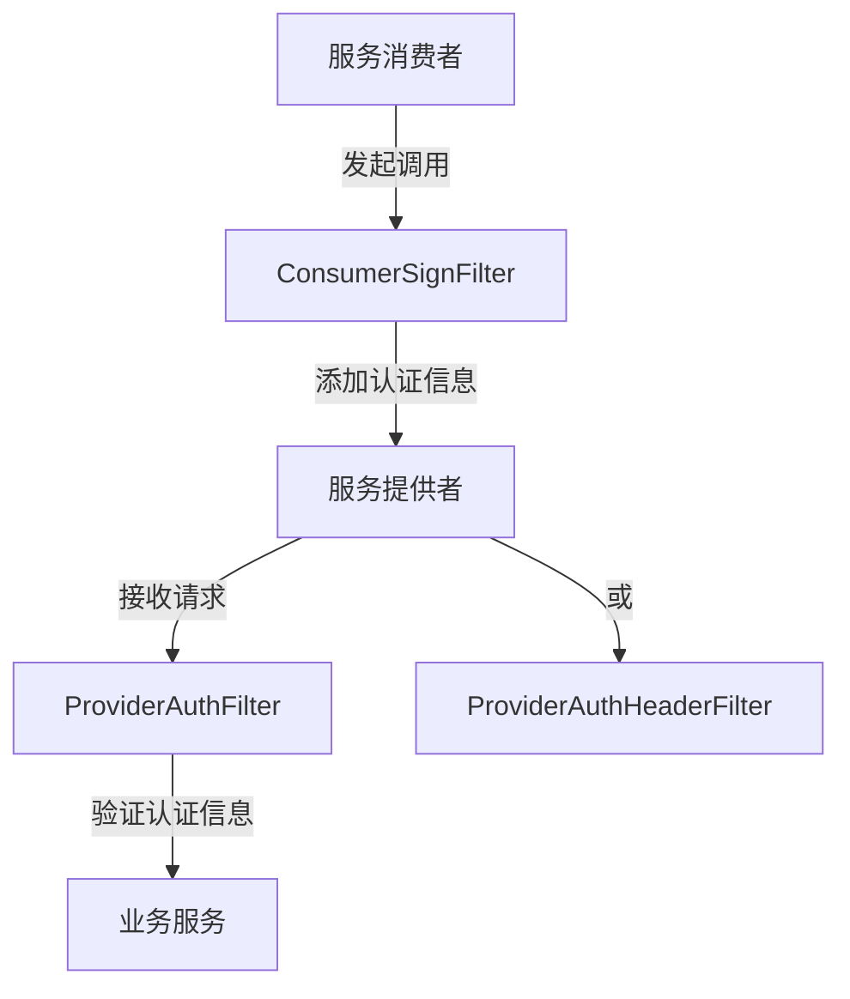
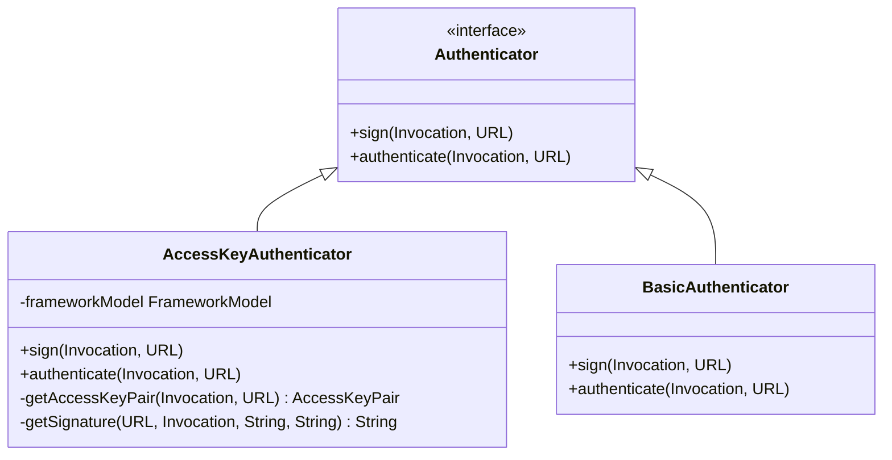
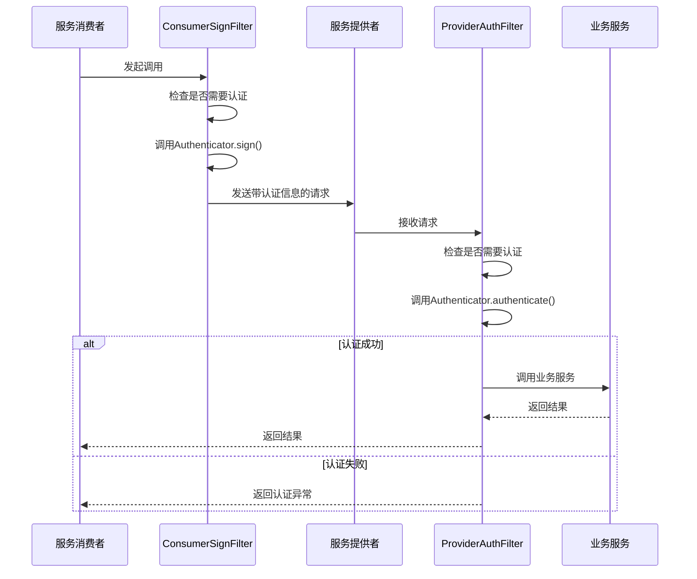
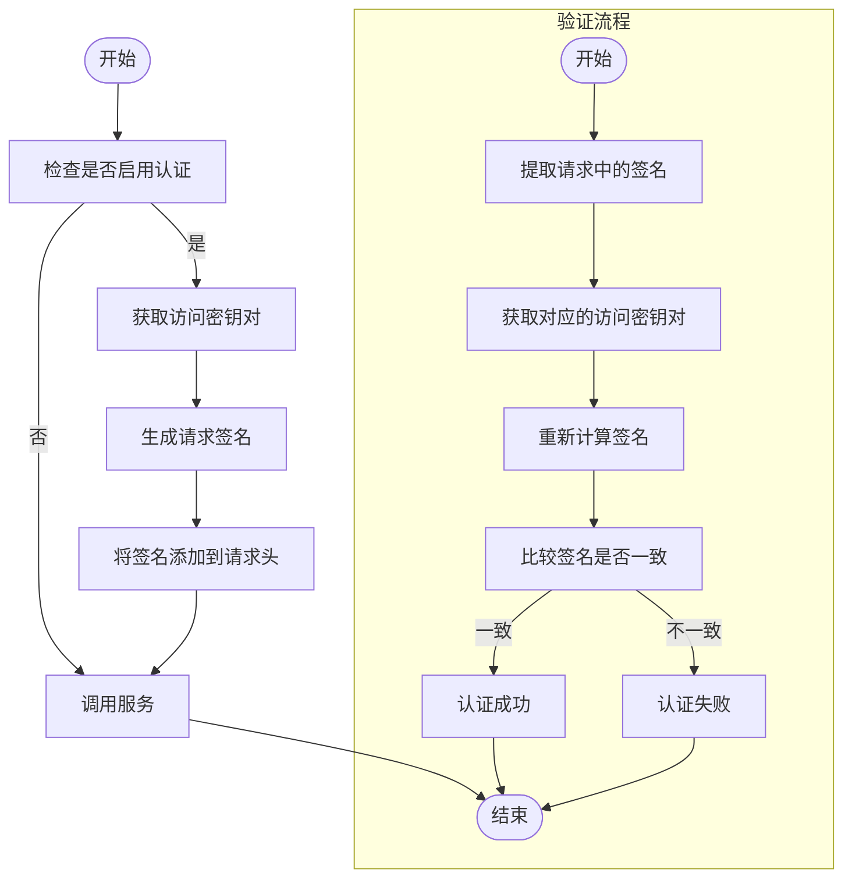
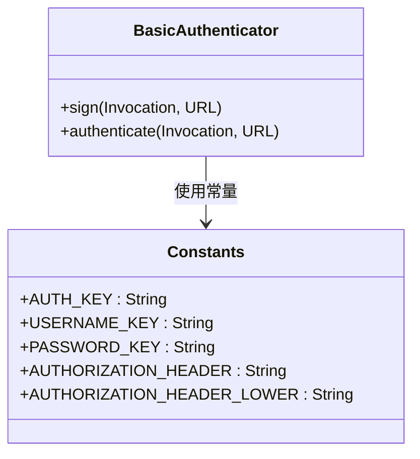
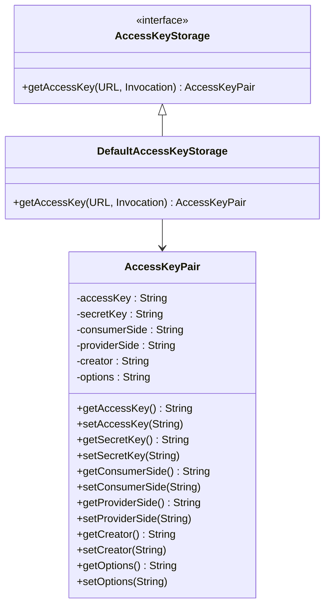
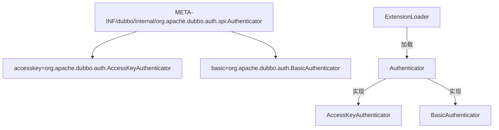
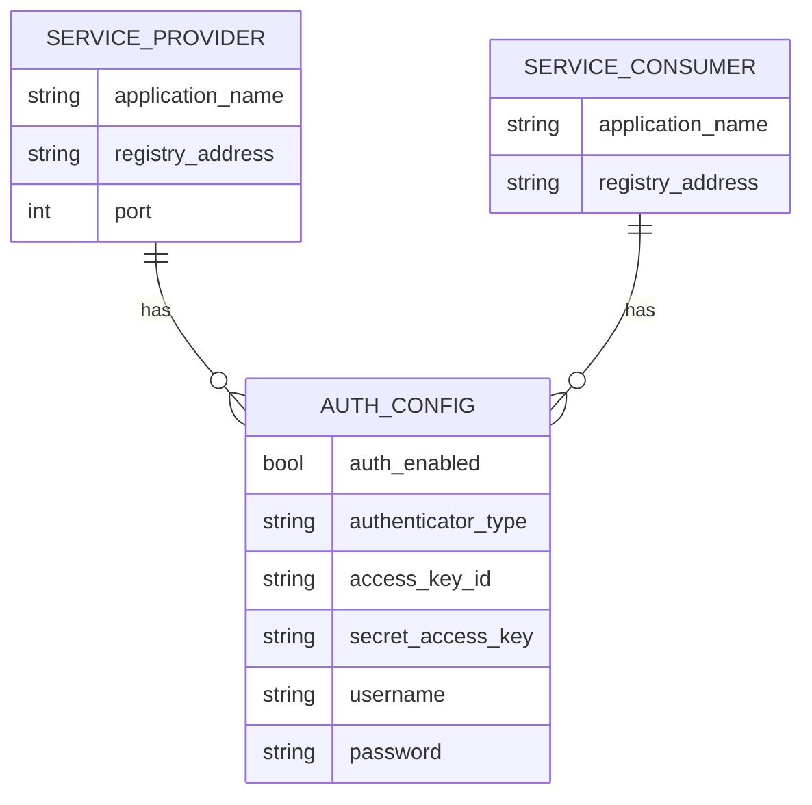
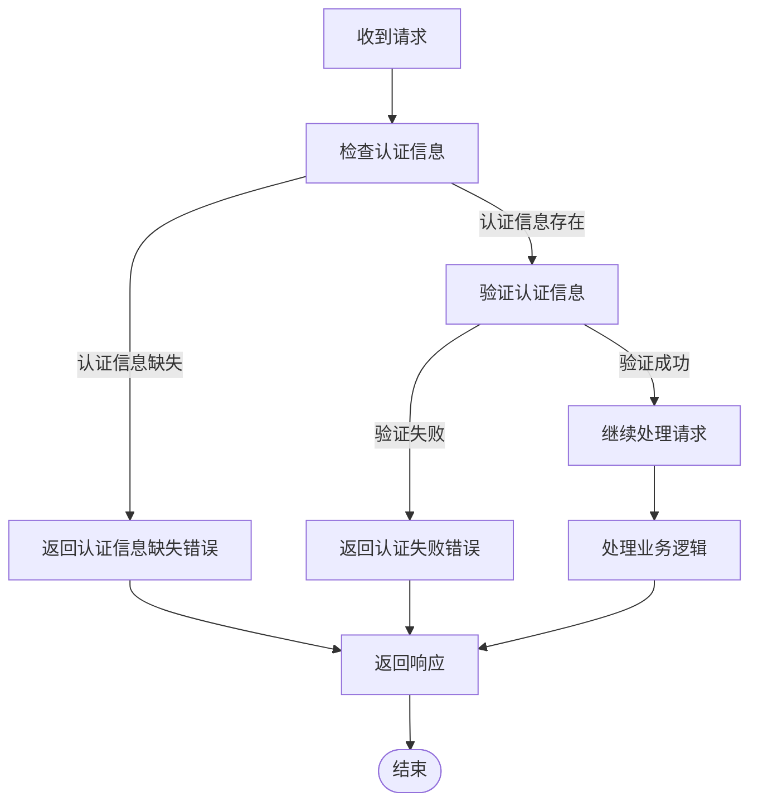

# 认证

<cite>
**本文档中引用的文件**  
- [Authenticator.java](file://dubbo-plugin/dubbo-auth/src/main/java/org/apache/dubbo/auth/spi/Authenticator.java)
- [AccessKeyAuthenticator.java](file://dubbo-plugin/dubbo-auth/src/main/java/org/apache/dubbo/auth/AccessKeyAuthenticator.java)
- [BasicAuthenticator.java](file://dubbo-plugin/dubbo-auth/src/main/java/org/apache/dubbo/auth/BasicAuthenticator.java)
- [ConsumerSignFilter.java](file://dubbo-plugin/dubbo-auth/src/main/java/org/apache/dubbo/auth/filter/ConsumerSignFilter.java)
- [ProviderAuthFilter.java](file://dubbo-plugin/dubbo-auth/src/main/java/org/apache/dubbo/auth/filter/ProviderAuthFilter.java)
- [ProviderAuthHeaderFilter.java](file://dubbo-plugin/dubbo-auth/src/main/java/org/apache/dubbo/auth/filter/ProviderAuthHeaderFilter.java)
- [Constants.java](file://dubbo-plugin/dubbo-auth/src/main/java/org/apache/dubbo/auth/Constants.java)
- [AccessKeyStorage.java](file://dubbo-plugin/dubbo-auth/src/main/java/org/apache/dubbo/auth/spi/AccessKeyStorage.java)
- [DefaultAccessKeyStorage.java](file://dubbo-plugin/dubbo-auth/src/main/java/org/apache/dubbo/auth/DefaultAccessKeyStorage.java)
- [AccessKeyPair.java](file://dubbo-plugin/dubbo-auth/src/main/java/org/apache/dubbo/auth/model/AccessKeyPair.java)
- [RpcAuthenticationException.java](file://dubbo-plugin/dubbo-auth/src/main/java/org/apache/dubbo/auth/exception/RpcAuthenticationException.java)
- [AccessKeyNotFoundException.java](file://dubbo-plugin/dubbo-auth/src/main/java/org/apache/dubbo/auth/exception/AccessKeyNotFoundException.java)
</cite>

## 目录
1. [介绍](#介绍)
2. [认证机制概述](#认证机制概述)
3. [Authenticator接口设计](#authenticator接口设计)
4. [认证过滤器工作流程](#认证过滤器工作流程)
5. [访问密钥认证实现](#访问密钥认证实现)
6. [基本认证实现](#基本认证实现)
7. [访问密钥存储与管理](#访问密钥存储与管理)
8. [SPI扩展机制](#spi扩展机制)
9. [配置示例](#配置示例)
10. [认证失败处理](#认证失败处理)
11. [初学者配置指南](#初学者配置指南)
12. [高级定制与扩展](#高级定制与扩展)

## 介绍
Dubbo提供了强大的身份认证机制，确保服务调用的安全性。本文档深入解析Dubbo支持的多种认证方式，包括基于访问密钥的认证和基本认证。文档详细介绍了Authenticator接口的设计原理、认证过滤器在调用链中的位置和工作流程，以及如何通过SPI机制扩展自定义认证方式。同时，文档还提供了具体的配置示例，帮助开发者在服务提供者和消费者端配置不同的认证方式。

**本节不分析具体源文件**

## 认证机制概述
Dubbo支持多种认证机制，主要包括基于访问密钥的认证和基本认证。这些认证机制通过SPI（Service Provider Interface）扩展点实现，允许开发者根据需要选择或自定义认证方式。认证功能主要通过过滤器模式在服务调用链中实现，确保在请求到达服务提供者之前完成身份验证。

**图示来源**  
- [ConsumerSignFilter.java](file://dubbo-plugin/dubbo-auth/src/main/java/org/apache/dubbo/auth/filter/ConsumerSignFilter.java)
- [ProviderAuthFilter.java](file://dubbo-plugin/dubbo-auth/src/main/java/org/apache/dubbo/auth/filter/ProviderAuthFilter.java)
- [ProviderAuthHeaderFilter.java](file://dubbo-plugin/dubbo-auth/src/main/java/org/apache/dubbo/auth/filter/ProviderAuthHeaderFilter.java)

**本节来源**  
- [Authenticator.java](file://dubbo-plugin/dubbo-auth/src/main/java/org/apache/dubbo/auth/spi/Authenticator.java)
- [Constants.java](file://dubbo-plugin/dubbo-auth/src/main/java/org/apache/dubbo/auth/Constants.java)

## Authenticator接口设计
Authenticator接口是Dubbo认证机制的核心，定义了认证器的基本行为。该接口通过SPI机制实现扩展，允许开发者提供自定义的认证实现。接口包含两个主要方法：sign用于在消费者端为请求添加认证信息，authenticate用于在提供者端验证请求的认证信息。

**图示来源**  
- [Authenticator.java](file://dubbo-plugin/dubbo-auth/src/main/java/org/apache/dubbo/auth/spi/Authenticator.java)
- [AccessKeyAuthenticator.java](file://dubbo-plugin/dubbo-auth/src/main/java/org/apache/dubbo/auth/AccessKeyAuthenticator.java)
- [BasicAuthenticator.java](file://dubbo-plugin/dubbo-auth/src/main/java/org/apache/dubbo/auth/BasicAuthenticator.java)

**本节来源**  
- [Authenticator.java](file://dubbo-plugin/dubbo-auth/src/main/java/org/apache/dubbo/auth/spi/Authenticator.java)
- [AccessKeyAuthenticator.java](file://dubbo-plugin/dubbo-auth/src/main/java/org/apache/dubbo/auth/AccessKeyAuthenticator.java)
- [BasicAuthenticator.java](file://dubbo-plugin/dubbo-auth/src/main/java/org/apache/dubbo/auth/BasicAuthenticator.java)

## 认证过滤器工作流程
Dubbo的认证过滤器在服务调用链中扮演着关键角色。消费者端的ConsumerSignFilter负责在请求发出前添加认证信息，而提供者端的ProviderAuthFilter和ProviderAuthHeaderFilter负责验证请求的认证信息。这些过滤器通过Dubbo的过滤器链机制集成到调用流程中。

**图示来源**  
- [ConsumerSignFilter.java](file://dubbo-plugin/dubbo-auth/src/main/java/org/apache/dubbo/auth/filter/ConsumerSignFilter.java)
- [ProviderAuthFilter.java](file://dubbo-plugin/dubbo-auth/src/main/java/org/apache/dubbo/auth/filter/ProviderAuthFilter.java)

**本节来源**  
- [ConsumerSignFilter.java](file://dubbo-plugin/dubbo-auth/src/main/java/org/apache/dubbo/auth/filter/ConsumerSignFilter.java)
- [ProviderAuthFilter.java](file://dubbo-plugin/dubbo-auth/src/main/java/org/apache/dubbo/auth/filter/ProviderAuthFilter.java)
- [ProviderAuthHeaderFilter.java](file://dubbo-plugin/dubbo-auth/src/main/java/org/apache/dubbo/auth/filter/ProviderAuthHeaderFilter.java)

## 访问密钥认证实现
访问密钥认证是Dubbo提供的一种安全认证机制，通过访问密钥（Access Key）和秘密密钥（Secret Key）对请求进行签名和验证。这种认证方式基于时间戳和签名算法，有效防止重放攻击。认证过程包括在消费者端生成签名，在提供者端验证签名的有效性。

**图示来源**  
- [AccessKeyAuthenticator.java](file://dubbo-plugin/dubbo-auth/src/main/java/org/apache/dubbo/auth/AccessKeyAuthenticator.java)
- [AccessKeyPair.java](file://dubbo-plugin/dubbo-auth/src/main/java/org/apache/dubbo/auth/model/AccessKeyPair.java)

**本节来源**  
- [AccessKeyAuthenticator.java](file://dubbo-plugin/dubbo-auth/src/main/java/org/apache/dubbo/auth/AccessKeyAuthenticator.java)
- [AccessKeyPair.java](file://dubbo-plugin/dubbo-auth/src/main/java/org/apache/dubbo/auth/model/AccessKeyPair.java)
- [Constants.java](file://dubbo-plugin/dubbo-auth/src/main/java/org/apache/dubbo/auth/Constants.java)

## 基本认证实现
基本认证是Dubbo提供的另一种认证机制，基于HTTP基本认证原理实现。该机制通过用户名和密码对请求进行认证，将认证信息编码后添加到请求头中。虽然安全性相对较低，但在某些场景下仍然有其应用价值。

**图示来源**  
- [BasicAuthenticator.java](file://dubbo-plugin/dubbo-auth/src/main/java/org/apache/dubbo/auth/BasicAuthenticator.java)
- [Constants.java](file://dubbo-plugin/dubbo-auth/src/main/java/org/apache/dubbo/auth/Constants.java)

**本节来源**  
- [BasicAuthenticator.java](file://dubbo-plugin/dubbo-auth/src/main/java/org/apache/dubbo/auth/BasicAuthenticator.java)
- [Constants.java](file://dubbo-plugin/dubbo-auth/src/main/java/org/apache/dubbo/auth/Constants.java)

## 访问密钥存储与管理
Dubbo提供了灵活的访问密钥存储和管理机制。默认情况下，访问密钥通过URL参数进行配置，存储在内存中。同时，通过AccessKeyStorage SPI接口，开发者可以实现自定义的持久化存储方案，如数据库存储、文件存储或分布式存储系统。

**图示来源**  
- [AccessKeyStorage.java](file://dubbo-plugin/dubbo-auth/src/main/java/org/apache/dubbo/auth/spi/AccessKeyStorage.java)
- [DefaultAccessKeyStorage.java](file://dubbo-plugin/dubbo-auth/src/main/java/org/apache/dubbo/auth/DefaultAccessKeyStorage.java)
- [AccessKeyPair.java](file://dubbo-plugin/dubbo-auth/src/main/java/org/apache/dubbo/auth/model/AccessKeyPair.java)

**本节来源**  
- [AccessKeyStorage.java](file://dubbo-plugin/dubbo-auth/src/main/java/org/apache/dubbo/auth/spi/AccessKeyStorage.java)
- [DefaultAccessKeyStorage.java](file://dubbo-plugin/dubbo-auth/src/main/java/org/apache/dubbo/auth/DefaultAccessKeyStorage.java)
- [AccessKeyPair.java](file://dubbo-plugin/dubbo-auth/src/main/java/org/apache/dubbo/auth/model/AccessKeyPair.java)

## SPI扩展机制
Dubbo的认证机制基于SPI（Service Provider Interface）设计，提供了强大的扩展能力。通过在META-INF/dubbo/internal目录下配置实现类，开发者可以轻松地添加自定义的认证器、访问密钥存储等组件。这种设计模式使得Dubbo的认证功能既灵活又可扩展。

**图示来源**  
- [Authenticator.java](file://dubbo-plugin/dubbo-auth/src/main/java/org/apache/dubbo/auth/spi/Authenticator.java)
- [META-INF/dubbo/internal/org.apache.dubbo.auth.spi.Authenticator](file://dubbo-plugin/dubbo-auth/src/main/resources/META-INF/dubbo/internal/org.apache.dubbo.auth.spi.Authenticator)

**本节来源**  
- [Authenticator.java](file://dubbo-plugin/dubbo-auth/src/main/java/org/apache/dubbo/auth/spi/Authenticator.java)
- [META-INF/dubbo/internal/org.apache.dubbo.auth.spi.Authenticator](file://dubbo-plugin/dubbo-auth/src/main/resources/META-INF/dubbo/internal/org.apache.dubbo.auth.spi.Authenticator)

## 配置示例
以下是在服务提供者和消费者端配置不同认证方式的示例。配置可以通过XML、注解或属性文件等方式进行。示例展示了如何启用访问密钥认证和基本认证，以及如何配置相关的认证参数。

**图示来源**  
- [Constants.java](file://dubbo-plugin/dubbo-auth/src/main/java/org/apache/dubbo/auth/Constants.java)
- [ConsumerSignFilter.java](file://dubbo-plugin/dubbo-auth/src/main/java/org/apache/dubbo/auth/filter/ConsumerSignFilter.java)
- [ProviderAuthFilter.java](file://dubbo-plugin/dubbo-auth/src/main/java/org/apache/dubbo/auth/filter/ProviderAuthFilter.java)

**本节来源**  
- [Constants.java](file://dubbo-plugin/dubbo-auth/src/main/java/org/apache/dubbo/auth/Constants.java)
- [ConsumerSignFilter.java](file://dubbo-plugin/dubbo-auth/src/main/java/org/apache/dubbo/auth/filter/ConsumerSignFilter.java)
- [ProviderAuthFilter.java](file://dubbo-plugin/dubbo-auth/src/main/java/org/apache/dubbo/auth/filter/ProviderAuthFilter.java)

## 认证失败处理
当认证失败时，Dubbo会抛出相应的异常并返回错误信息。系统提供了详细的错误处理机制，包括认证异常的捕获、错误信息的返回以及日志记录。开发者可以根据这些信息进行问题排查和系统优化。

**图示来源**  
- [RpcAuthenticationException.java](file://dubbo-plugin/dubbo-auth/src/main/java/org/apache/dubbo/auth/exception/RpcAuthenticationException.java)
- [AccessKeyNotFoundException.java](file://dubbo-plugin/dubbo-auth/src/main/java/org/apache/dubbo/auth/exception/AccessKeyNotFoundException.java)
- [ProviderAuthFilter.java](file://dubbo-plugin/dubbo-auth/src/main/java/org/apache/dubbo/auth/filter/ProviderAuthFilter.java)

**本节来源**  
- [RpcAuthenticationException.java](file://dubbo-plugin/dubbo-auth/src/main/java/org/apache/dubbo/auth/exception/RpcAuthenticationException.java)
- [AccessKeyNotFoundException.java](file://dubbo-plugin/dubbo-auth/src/main/java/org/apache/dubbo/auth/exception/AccessKeyNotFoundException.java)
- [ProviderAuthFilter.java](file://dubbo-plugin/dubbo-auth/src/main/java/org/apache/dubbo/auth/filter/ProviderAuthFilter.java)

## 初学者配置指南
对于初学者，Dubbo提供了简单易用的认证配置方式。通过在服务配置中添加简单的参数，即可快速启用基本的认证功能。建议初学者从基本认证开始，逐步了解认证机制的工作原理，然后再尝试更复杂的访问密钥认证。

**本节不分析具体源文件**

## 高级定制与扩展
对于高级用户，Dubbo提供了丰富的定制和扩展选项。开发者可以实现自定义的Authenticator接口，创建新的认证算法；可以扩展AccessKeyStorage接口，实现持久化的密钥存储方案；还可以通过过滤器机制，添加自定义的认证逻辑。这些扩展能力使得Dubbo能够适应各种复杂的安全需求。

**本节不分析具体源文件**