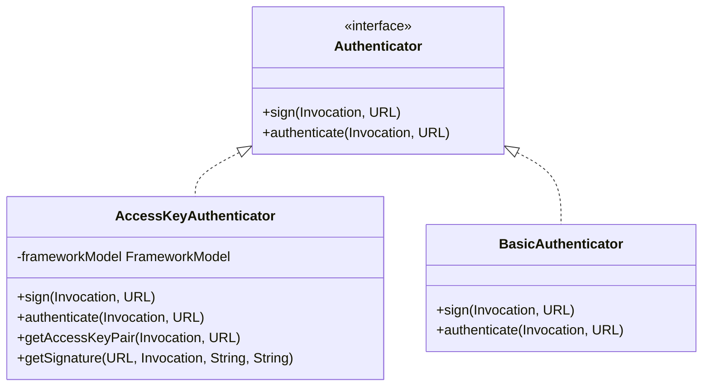
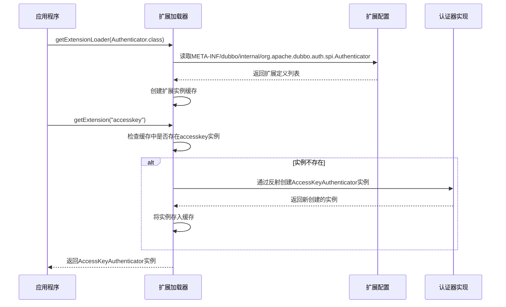
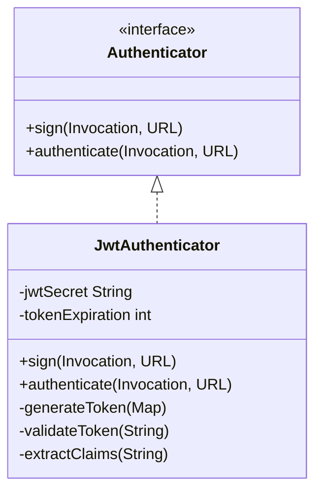
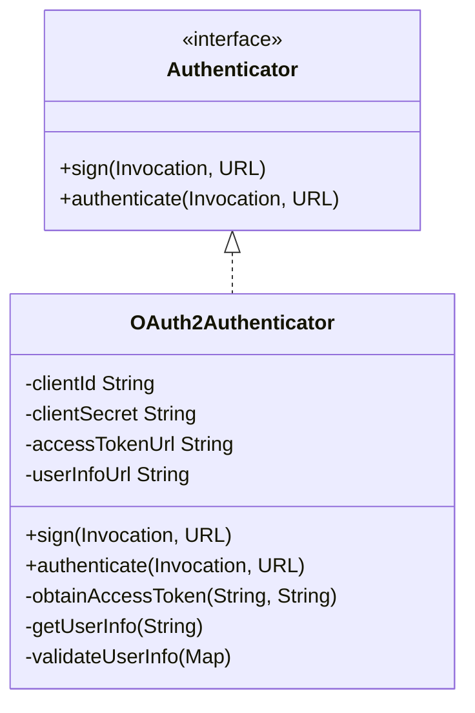
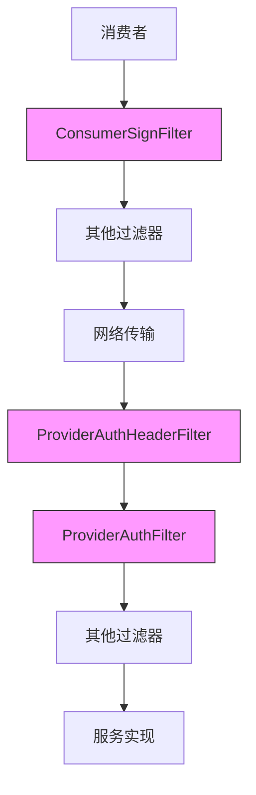
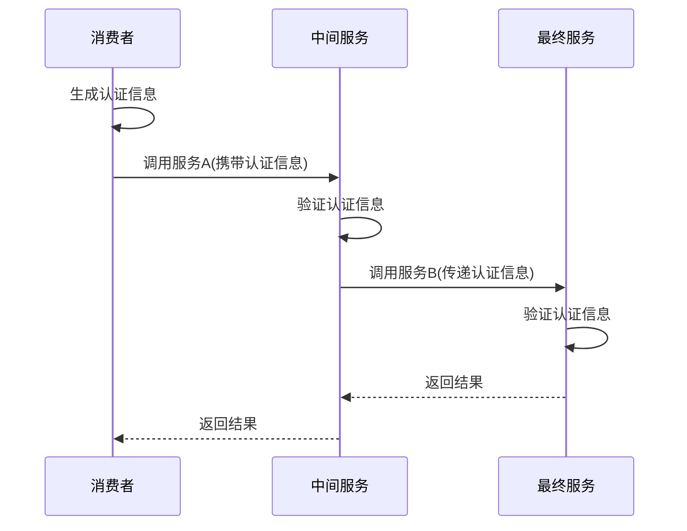

# 认证扩展机制

<cite>
**本文档引用的文件**
- [Authenticator.java](file://dubbo-plugin\dubbo-auth\src\main\java\org\apache\dubbo\auth\spi\Authenticator.java)
- [ProviderAuthFilter.java](file://dubbo-plugin\dubbo-auth\src\main\java\org\apache\dubbo\auth\filter\ProviderAuthFilter.java)
- [ConsumerSignFilter.java](file://dubbo-plugin\dubbo-auth\src\main\java\org\apache\dubbo\auth\filter\ConsumerSignFilter.java)
- [ProviderAuthHeaderFilter.java](file://dubbo-plugin\dubbo-auth\src\main\java\org\apache\dubbo\auth\filter\ProviderAuthHeaderFilter.java)
- [AccessKeyAuthenticator.java](file://dubbo-plugin\dubbo-auth\src\main\java\org\apache\dubbo\auth\AccessKeyAuthenticator.java)
- [BasicAuthenticator.java](file://dubbo-plugin\dubbo-auth\src\main\java\org\apache\dubbo\auth\BasicAuthenticator.java)
- [Constants.java](file://dubbo-plugin\dubbo-auth\src\main\java\org\apache\dubbo\auth\Constants.java)
- [org.apache.dubbo.auth.spi.Authenticator](file://dubbo-plugin\dubbo-auth\src\main\resources\META-INF\dubbo\internal\org.apache.dubbo.auth.spi.Authenticator)
</cite>

## 目录
1. [引言](#引言)
2. [认证扩展机制概述](#认证扩展机制概述)
3. [Authenticator接口设计原则](#authenticator接口设计原则)
4. [SPI扩展机制实现方式](#spi扩展机制实现方式)
5. [自定义认证器实现](#自定义认证器实现)
6. [认证器配置与注册](#认证器配置与注册)
7. [过滤器链集成](#过滤器链集成)
8. [认证上下文传递](#认证上下文传递)
9. [扩展最佳实践](#扩展最佳实践)
10. [实际部署示例](#实际部署示例)

## 引言
本文档详细介绍了Dubbo框架中的认证扩展机制，重点阐述了Authenticator接口的设计原则和SPI扩展机制的实现方式。文档深入分析了如何实现自定义认证器，包括接口方法的实现细节和扩展点的使用方法。同时，文档还说明了扩展认证器的配置和注册过程，以及与现有过滤器链的集成方式。为开发者提供了扩展的最佳实践，包括性能考虑、线程安全和错误处理，并通过实际部署示例展示了自定义认证器在生产环境中的使用。

## 认证扩展机制概述
Dubbo的认证扩展机制基于SPI（Service Provider Interface）设计模式，提供了一套灵活的认证框架。该机制允许开发者通过实现Authenticator接口来创建自定义的认证器，从而支持不同的认证协议和安全策略。认证扩展机制主要由以下几个核心组件构成：

1. **Authenticator接口**：定义了认证器的基本行为，包括签名和认证两个核心方法。
2. **SPI扩展机制**：通过Java SPI机制实现认证器的动态加载和扩展。
3. **过滤器链**：在服务提供者和消费者端通过过滤器实现认证逻辑的拦截和处理。
4. **配置系统**：通过URL参数和配置文件实现认证器的配置和注册。

该机制的设计目标是提供一个可扩展、可插拔的认证框架，使开发者能够根据具体的安全需求实现自定义的认证逻辑，而无需修改框架的核心代码。

**本节来源**
- [Authenticator.java](file://dubbo-plugin\dubbo-auth\src\main\java\org\apache\dubbo\auth\spi\Authenticator.java)
- [ProviderAuthFilter.java](file://dubbo-plugin\dubbo-auth\src\main\java\org\apache\dubbo\auth\filter\ProviderAuthFilter.java)

## Authenticator接口设计原则
Authenticator接口是Dubbo认证扩展机制的核心，其设计遵循了以下原则：

### 接口定义


**图示来源**
- [Authenticator.java](file://dubbo-plugin\dubbo-auth\src\main\java\org\apache\dubbo\auth\spi\Authenticator.java)
- [AccessKeyAuthenticator.java](file://dubbo-plugin\dubbo-auth\src\main\java\org\apache\dubbo\auth\AccessKeyAuthenticator.java)
- [BasicAuthenticator.java](file://dubbo-plugin\dubbo-auth\src\main\java\org\apache\dubbo\auth\BasicAuthenticator.java)

### 设计原则
1. **单一职责原则**：Authenticator接口只定义认证相关的两个核心方法，职责明确。
2. **开闭原则**：通过SPI机制实现扩展，对扩展开放，对修改关闭。
3. **依赖倒置原则**：高层模块（过滤器）依赖于抽象（Authenticator接口），而不是具体实现。
4. **可配置性**：通过URL参数实现认证器的动态选择和配置。

### 接口方法
Authenticator接口定义了两个核心方法：

1. **sign方法**：用于在客户端为请求生成签名
   - 参数：Invocation（调用上下文）、URL（服务地址）
   - 功能：在调用上下文中添加认证相关的附件，如签名、时间戳等

2. **authenticate方法**：用于在服务端验证请求的合法性
   - 参数：Invocation（调用上下文）、URL（服务地址）
   - 功能：验证请求中的认证信息是否有效，如果验证失败则抛出RpcAuthenticationException异常

### 扩展点设计
Authenticator接口通过@SPI注解标记，表明其是一个SPI扩展点。注解中的value属性指定了默认的认证器实现（basic），scope属性指定了扩展的作用范围（FRAMEWORK）。

**本节来源**
- [Authenticator.java](file://dubbo-plugin\dubbo-auth\src\main\java\org\apache\dubbo\auth\spi\Authenticator.java)
- [Constants.java](file://dubbo-plugin\dubbo-auth\src\main\java\org\apache\dubbo\auth\Constants.java)

## SPI扩展机制实现方式
Dubbo的SPI扩展机制是认证扩展的基础，其实现方式如下：

### SPI机制概述
Dubbo的SPI机制基于Java的ServiceLoader机制进行了增强，提供了更强大的功能，包括：
- 自动发现和加载扩展实现
- 扩展实例的缓存和复用
- 扩展的优先级和排序
- 扩展的依赖注入

### 扩展配置文件
认证器的扩展配置文件位于`META-INF/dubbo/internal/org.apache.dubbo.auth.spi.Authenticator`，其内容格式如下：
```
accesskey=org.apache.dubbo.auth.AccessKeyAuthenticator
basic=org.apache.dubbo.auth.BasicAuthenticator
```

每行定义一个扩展实现，格式为`名称=全限定类名`。名称用于在配置中引用特定的认证器实现。

### 扩展加载过程


**图示来源**
- [org.apache.dubbo.auth.spi.Authenticator](file://dubbo-plugin\dubbo-auth\src\main\resources\META-INF\dubbo\internal\org.apache.dubbo.auth.spi.Authenticator)
- [Authenticator.java](file://dubbo-plugin\dubbo-auth\src\main\java\org\apache\dubbo\auth\spi\Authenticator.java)

### 扩展作用域
Authenticator接口的SPI注解中指定了scope为FRAMEWORK，这意味着：
- 扩展实例在FrameworkModel级别共享
- 不同的应用实例可以共享同一个认证器实例
- 提高了资源利用率，减少了内存开销

### 扩展加载器
扩展加载器（ExtensionLoader）是SPI机制的核心组件，负责：
- 解析扩展配置文件
- 创建和管理扩展实例
- 提供扩展实例的获取接口
- 处理扩展的依赖关系

**本节来源**
- [org.apache.dubbo.auth.spi.Authenticator](file://dubbo-plugin\dubbo-auth\src\main\resources\META-INF\dubbo\internal\org.apache.dubbo.auth.spi.Authenticator)
- [Authenticator.java](file://dubbo-plugin\dubbo-auth\src\main\java\org\apache\dubbo\auth\spi\Authenticator.java)

## 自定义认证器实现
本节详细说明如何实现自定义认证器，包括接口方法的实现细节和扩展点的使用方法。

### 基本实现步骤
1. 创建实现Authenticator接口的类
2. 实现sign和authenticate方法
3. 在META-INF/dubbo/internal/org.apache.dubbo.auth.spi.Authenticator中注册实现
4. 通过配置启用自定义认证器

### JWT认证器实现示例


**图示来源**
- [Authenticator.java](file://dubbo-plugin\dubbo-auth\src\main\java\org\apache\dubbo\auth\spi\Authenticator.java)

### OAuth2认证器实现示例


**图示来源**
- [Authenticator.java](file://dubbo-plugin\dubbo-auth\src\main\java\org\apache\dubbo\auth\spi\Authenticator.java)

### 实现细节
#### sign方法实现
sign方法负责在客户端为请求生成认证信息，通常包括：
- 生成时间戳
- 计算签名
- 添加认证令牌
- 设置相关附件

```java
@Override
public void sign(Invocation invocation, URL url) {
    // 生成时间戳
    String currentTime = String.valueOf(System.currentTimeMillis());
    
    // 获取密钥信息
    AccessKeyPair accessKeyPair = getAccessKeyPair(invocation, url);
    
    // 计算签名
    String signature = getSignature(url, invocation, accessKeyPair.getSecretKey(), currentTime);
    
    // 设置认证附件
    invocation.setAttachment(Constants.REQUEST_SIGNATURE_KEY, signature);
    invocation.setAttachment(Constants.REQUEST_TIMESTAMP_KEY, currentTime);
    invocation.setAttachment(Constants.AK_KEY, accessKeyPair.getAccessKey());
    invocation.setAttachment(CommonConstants.CONSUMER, url.getApplication());
}
```

#### authenticate方法实现
authenticate方法负责在服务端验证请求的合法性，通常包括：
- 验证时间戳有效性
- 验证签名正确性
- 验证访问密钥有效性
- 抛出适当的异常

```java
@Override
public void authenticate(Invocation invocation, URL url) throws RpcAuthenticationException {
    // 获取认证信息
    String accessKeyId = String.valueOf(invocation.getAttachment(Constants.AK_KEY));
    String requestTimestamp = String.valueOf(invocation.getAttachment(Constants.REQUEST_TIMESTAMP_KEY));
    String originSignature = String.valueOf(invocation.getAttachment(Constants.REQUEST_SIGNATURE_KEY));
    String consumer = String.valueOf(invocation.getAttachment(CommonConstants.CONSUMER));
    
    // 验证必要信息是否存在
    if (StringUtils.isAnyEmpty(accessKeyId, consumer, requestTimestamp, originSignature)) {
        throw new RpcAuthenticationException("Failed to authenticate, maybe consumer side did not enable the auth");
    }
    
    // 获取访问密钥对
    AccessKeyPair accessKeyPair;
    try {
        accessKeyPair = getAccessKeyPair(invocation, url);
    } catch (Exception e) {
        throw new RpcAuthenticationException("Failed to authenticate , can't load the accessKeyPair");
    }
    
    // 计算签名并验证
    String computeSignature = getSignature(url, invocation, accessKeyPair.getSecretKey(), requestTimestamp);
    boolean success = computeSignature.equals(originSignature);
    if (!success) {
        throw new RpcAuthenticationException("Failed to authenticate, signature is not correct");
    }
}
```

**本节来源**
- [AccessKeyAuthenticator.java](file://dubbo-plugin\dubbo-auth\src\main\java\org\apache\dubbo\auth\AccessKeyAuthenticator.java)
- [BasicAuthenticator.java](file://dubbo-plugin\dubbo-auth\src\main\java\org\apache\dubbo\auth\BasicAuthenticator.java)

## 认证器配置与注册
本节说明扩展认证器的配置和注册过程，包括META-INF/dubbo/internal配置文件的格式和位置。

### 配置文件位置
认证器的配置文件必须位于`META-INF/dubbo/internal/`目录下，文件名为接口的全限定名：
```
META-INF/dubbo/internal/org.apache.dubbo.auth.spi.Authenticator
```

### 配置文件格式
配置文件采用properties格式，每行定义一个扩展实现：
```
名称=全限定类名
```

其中：
- **名称**：用于在配置中引用该实现的标识符
- **全限定类名**：实现类的完整包名和类名

### 示例配置
```
accesskey=org.apache.dubbo.auth.AccessKeyAuthenticator
basic=org.apache.dubbo.auth.BasicAuthenticator
jwt=org.apache.dubbo.auth.JwtAuthenticator
oauth2=org.apache.dubbo.auth.OAuth2Authenticator
```

### 注册过程
1. 将自定义认证器实现类编译到JAR包中
2. 在JAR包的`META-INF/dubbo/internal/`目录下创建配置文件
3. 在配置文件中添加自定义认证器的注册条目
4. 将JAR包添加到应用的classpath中

### 配置启用
通过URL参数或配置文件启用认证器：
```java
// 通过URL参数启用
URL url = URL.valueOf("dubbo://10.10.10.10:2181")
    .addParameter(Constants.AUTH_KEY, true)
    .addParameter(Constants.AUTHENTICATOR_KEY, "accesskey");

// 通过服务配置启用
ServiceConfig<DemoService> service = new ServiceConfig<>();
service.setInterface(DemoService.class);
service.setRef(new DemoServiceImpl());
service.setAuth(true);
service.setAuthenticator("accesskey");
```

**本节来源**
- [org.apache.dubbo.auth.spi.Authenticator](file://dubbo-plugin\dubbo-auth\src\main\resources\META-INF\dubbo\internal\org.apache.dubbo.auth.spi.Authenticator)
- [Constants.java](file://dubbo-plugin\dubbo-auth\src\main\java\org\apache\dubbo\auth\Constants.java)

## 过滤器链集成
本节解释扩展认证器与现有过滤器链的集成方式，包括服务提供者和消费者端的过滤器实现。

### 过滤器链架构


**图示来源**
- [ConsumerSignFilter.java](file://dubbo-plugin\dubbo-auth\src\main\java\org\apache\dubbo\auth\filter\ConsumerSignFilter.java)
- [ProviderAuthHeaderFilter.java](file://dubbo-plugin\dubbo-auth\src\main\java\org\apache\dubbo\auth\filter\ProviderAuthHeaderFilter.java)
- [ProviderAuthFilter.java](file://dubbo-plugin\dubbo-auth\src\main\java\org\apache\dubbo\auth\filter\ProviderAuthFilter.java)

### 消费者端过滤器
ConsumerSignFilter负责在消费者端为请求添加认证信息：

```java
@Activate(group = CommonConstants.CONSUMER, value = Constants.AUTH_KEY, order = -10000)
public class ConsumerSignFilter implements Filter {
    private final FrameworkModel frameworkModel;

    public ConsumerSignFilter(FrameworkModel frameworkModel) {
        this.frameworkModel = frameworkModel;
    }

    @Override
    public Result invoke(Invoker<?> invoker, Invocation invocation) throws RpcException {
        URL url = invoker.getUrl();
        boolean shouldAuth = url.getParameter(Constants.AUTH_KEY, false);
        if (shouldAuth) {
            Authenticator authenticator = frameworkModel
                    .getExtensionLoader(Authenticator.class)
                    .getExtension(url.getParameter(Constants.AUTHENTICATOR_KEY, Constants.DEFAULT_AUTHENTICATOR));
            authenticator.sign(invocation, url);
        }
        return invoker.invoke(invocation);
    }
}
```

### 服务提供者端过滤器
服务提供者端有两个认证相关的过滤器：

1. **ProviderAuthHeaderFilter**：优先级较高，用于处理Header相关的认证
2. **ProviderAuthFilter**：优先级较低，用于处理核心认证逻辑

```java
@Activate(value = Constants.AUTH_KEY, order = -20000)
public class ProviderAuthHeaderFilter implements HeaderFilter {
    private final FrameworkModel frameworkModel;

    public ProviderAuthHeaderFilter(FrameworkModel frameworkModel) {
        this.frameworkModel = frameworkModel;
    }

    @Override
    public RpcInvocation invoke(Invoker<?> invoker, RpcInvocation invocation) throws RpcException {
        URL url = invoker.getUrl();
        boolean shouldAuth = url.getParameter(Constants.AUTH_KEY, false);
        if (shouldAuth) {
            Authenticator authenticator = frameworkModel
                    .getExtensionLoader(Authenticator.class)
                    .getExtension(url.getParameter(Constants.AUTHENTICATOR_KEY, Constants.DEFAULT_AUTHENTICATOR));
            try {
                authenticator.authenticate(invocation, url);
            } catch (Exception e) {
                throw new RpcException(AUTHORIZATION_EXCEPTION, "No Auth.");
            }
            invocation.getAttributes().put(Constants.AUTH_SUCCESS, Boolean.TRUE);
        }
        return invocation;
    }
}
```

### 过滤器优先级
过滤器的执行顺序由@Activate注解中的order属性决定：
- order值越小，优先级越高
- ConsumerSignFilter的order为-10000，确保在其他过滤器之前执行
- ProviderAuthHeaderFilter的order为-20000，确保在ProviderAuthFilter之前执行

**本节来源**
- [ConsumerSignFilter.java](file://dubbo-plugin\dubbo-auth\src\main\java\org\apache\dubbo\auth\filter\ConsumerSignFilter.java)
- [ProviderAuthHeaderFilter.java](file://dubbo-plugin\dubbo-auth\src\main\java\org\apache\dubbo\auth\filter\ProviderAuthHeaderFilter.java)
- [ProviderAuthFilter.java](file://dubbo-plugin\dubbo-auth\src\main\java\org\apache\dubbo\auth\filter\ProviderAuthFilter.java)

## 认证上下文传递
本节解释如何处理认证上下文的传递，包括认证信息在调用链中的传播和管理。

### 上下文传递机制


**图示来源**
- [ConsumerSignFilter.java](file://dubbo-plugin\dubbo-auth\src\main\java\org\apache\dubbo\auth\filter\ConsumerSignFilter.java)
- [ProviderAuthFilter.java](file://dubbo-plugin\dubbo-auth\src\main\java\org\apache\dubbo\auth\filter\ProviderAuthFilter.java)

### 认证信息存储
认证信息通过Invocation的attachment机制进行传递：

```java
// 设置认证信息
invocation.setAttachment(Constants.REQUEST_SIGNATURE_KEY, signature);
invocation.setAttachment(Constants.REQUEST_TIMESTAMP_KEY, currentTime);
invocation.setAttachment(Constants.AK_KEY, accessKeyId);
invocation.setAttachment(CommonConstants.CONSUMER, applicationName);

// 获取认证信息
String signature = invocation.getAttachment(Constants.REQUEST_SIGNATURE_KEY);
String timestamp = invocation.getAttachment(Constants.REQUEST_TIMESTAMP_KEY);
String accessKeyId = invocation.getAttachment(Constants.AK_KEY);
String consumer = invocation.getAttachment(CommonConstants.CONSUMER);
```

### 上下文管理
1. **消费者端**：在ConsumerSignFilter中生成认证信息并添加到attachment
2. **服务提供者端**：在ProviderAuthFilter中验证认证信息
3. **中间服务**：验证通过后，将认证信息继续传递给下游服务
4. **成功标记**：验证成功后，在attributes中设置AUTH_SUCCESS标记

### 安全考虑
1. **敏感信息保护**：避免在日志中输出敏感的认证信息
2. **信息时效性**：设置合理的时间戳有效期，防止重放攻击
3. **信息完整性**：确保认证信息在传输过程中不被篡改
4. **最小权限原则**：只传递必要的认证信息

**本节来源**
- [ConsumerSignFilter.java](file://dubbo-plugin\dubbo-auth\src\main\java\org\apache\dubbo\auth\filter\ConsumerSignFilter.java)
- [ProviderAuthFilter.java](file://dubbo-plugin\dubbo-auth\src\main\java\org\apache\dubbo\auth\filter\ProviderAuthFilter.java)
- [Constants.java](file://dubbo-plugin\dubbo-auth\src\main\java\org\apache\dubbo\auth\Constants.java)

## 扩展最佳实践
本节为开发者提供扩展的最佳实践，包括性能考虑、线程安全和错误处理。

### 性能优化
1. **缓存扩展实例**：利用SPI机制的实例缓存功能，避免重复创建
2. **减少反射调用**：尽量使用直接调用而非反射
3. **异步处理**：对于耗时的认证操作，考虑使用异步处理
4. **批量验证**：对于频繁的验证操作，考虑批量处理

### 线程安全
1. **无状态设计**：尽量设计为无状态的认证器，避免共享可变状态
2. **线程安全的数据结构**：如果必须使用共享状态，使用线程安全的数据结构
3. **同步控制**：在必要时使用适当的同步机制

```java
public class ThreadSafeAuthenticator implements Authenticator {
    private final Map<String, AccessKeyPair> cache = new ConcurrentHashMap<>();
    private final Object lock = new Object();
    
    @Override
    public void sign(Invocation invocation, URL url) {
        // 无状态操作，天然线程安全
        String currentTime = String.valueOf(System.currentTimeMillis());
        AccessKeyPair accessKeyPair = getAccessKeyPair(invocation, url);
        // ...
    }
    
    @Override
    public void authenticate(Invocation invocation, URL url) throws RpcAuthenticationException {
        // 使用ConcurrentHashMap保证线程安全
        String accessKeyId = invocation.getAttachment(Constants.AK_KEY);
        AccessKeyPair accessKeyPair = cache.get(accessKeyId);
        if (accessKeyPair == null) {
            synchronized (lock) {
                accessKeyPair = cache.get(accessKeyId);
                if (accessKeyPair == null) {
                    accessKeyPair = loadFromStorage(accessKeyId);
                    cache.put(accessKeyId, accessKeyPair);
                }
            }
        }
        // ...
    }
}
```

### 错误处理
1. **明确的异常类型**：使用特定的异常类型，便于调用方处理
2. **详细的错误信息**：提供足够的错误信息，便于问题排查
3. **异常分类**：区分可恢复和不可恢复的异常
4. **日志记录**：适当记录错误日志，但避免泄露敏感信息

```java
public void authenticate(Invocation invocation, URL url) throws RpcAuthenticationException {
    try {
        // 认证逻辑
        validateTimestamp(invocation);
        validateSignature(invocation, url);
        validateAccessKey(invocation);
    } catch (TimestampValidationException e) {
        throw new RpcAuthenticationException("Timestamp validation failed: " + e.getMessage(), e);
    } catch (SignatureValidationException e) {
        throw new RpcAuthenticationException("Signature validation failed: " + e.getMessage(), e);
    } catch (AccessKeyValidationException e) {
        throw new RpcAuthenticationException("Access key validation failed: " + e.getMessage(), e);
    } catch (Exception e) {
        // 未知异常，记录日志但不暴露详细信息
        logger.warn("Unexpected error during authentication", e);
        throw new RpcAuthenticationException("Authentication failed");
    }
}
```

### 可维护性
1. **清晰的文档**：为自定义认证器提供详细的文档
2. **配置灵活性**：通过配置参数支持不同的使用场景
3. **监控支持**：提供监控指标，便于性能分析和问题排查
4. **测试覆盖**：提供完整的单元测试和集成测试

**本节来源**
- [AccessKeyAuthenticator.java](file://dubbo-plugin\dubbo-auth\src\main\java\org\apache\dubbo\auth\AccessKeyAuthenticator.java)
- [BasicAuthenticator.java](file://dubbo-plugin\dubbo-auth\src\main\java\org\apache\dubbo\auth\BasicAuthenticator.java)

## 实际部署示例
本节通过实际部署示例展示自定义认证器在生产环境中的使用。

### 基于JWT的认证器部署
```mermaid
graph TD
A[客户端] --> |1. 获取JWT令牌| B[认证服务器]
B --> |2. 返回JWT令牌| A
A --> |3. 调用服务(携带JWT)| C[服务网关]
C --> |4. 验证JWT| D[JWT认证器]
D --> |5. 验证通过| E[业务服务]
E --> |6. 返回结果| C
C --> |7. 返回结果| A
style D fill:#f9f,stroke:#333
```

**图示来源**
- [Authenticator.java](file://dubbo-plugin\dubbo-auth\src\main\java\org\apache\dubbo\auth\spi\Authenticator.java)

### OAuth2认证器部署
```mermaid
graph TD
A[客户端] --> |1. 重定向到OAuth2授权服务器| B[OAuth2授权服务器]
B --> |2. 用户登录和授权| C[用户]
C --> |3. 授权确认| B
B --> |4. 重定向回客户端(携带授权码)| A
A --> |5. 用授权码换取访问令牌| B
B --> |6. 返回访问令牌| A
A --> |7. 调用服务(携带访问令牌)| D[服务提供者]
D --> |8. 验证访问令牌| E[OAuth2认证器]
E --> |9. 验证通过| F[业务服务]
F --> |10. 返回结果| D
D --> |11. 返回结果| A
style E fill:#f9f,stroke:#333
```

**图示来源**
- [Authenticator.java](file://dubbo-plugin\dubbo-auth\src\main\java\org\apache\dubbo\auth\spi\Authenticator.java)

### 生产环境配置
```properties
# dubbo.properties
dubbo.service.auth=true
dubbo.service.authenticator=jwt
dubbo.service.jwt.secret=your-secret-key
dubbo.service.jwt.expiration=3600

# 或者在代码中配置
ServiceConfig<DemoService> service = new ServiceConfig<>();
service.setInterface(DemoService.class);
service.setRef(new DemoServiceImpl());
service.setAuth(true);
service.setAuthenticator("jwt");
service.setParameter("jwt.secret", "your-secret-key");
service.setParameter("jwt.expiration", "3600");
```

### 监控和日志
```java
public class MonitoredJwtAuthenticator implements Authenticator {
    private static final Logger logger = LoggerFactory.getLogger(MonitoredJwtAuthenticator.class);
    private final MeterRegistry meterRegistry;
    
    public MonitoredJwtAuthenticator(MeterRegistry meterRegistry) {
        this.meterRegistry = meterRegistry;
    }
    
    @Override
    public void sign(Invocation invocation, URL url) {
        long startTime = System.currentTimeMillis();
        try {
            // 认证逻辑
            generateJwtToken(invocation, url);
            
            // 记录成功指标
            meterRegistry.counter("auth.sign.success", "type", "jwt").increment();
        } catch (Exception e) {
            // 记录失败指标
            meterRegistry.counter("auth.sign.failure", "type", "jwt", "reason", e.getClass().getSimpleName()).increment();
            throw e;
        } finally {
            // 记录处理时间
            meterRegistry.timer("auth.sign.duration", "type", "jwt").record(System.currentTimeMillis() - startTime, TimeUnit.MILLISECONDS);
        }
    }
    
    @Override
    public void authenticate(Invocation invocation, URL url) throws RpcAuthenticationException {
        long startTime = System.currentTimeMillis();
        try {
            // 认证逻辑
            validateJwtToken(invocation, url);
            
            // 记录成功指标
            meterRegistry.counter("auth.authenticate.success", "type", "jwt").increment();
        } catch (RpcAuthenticationException e) {
            // 记录失败指标
            meterRegistry.counter("auth.authenticate.failure", "type", "jwt", "reason", e.getClass().getSimpleName()).increment();
            throw e;
        } finally {
            // 记录处理时间
            meterRegistry.timer("auth.authenticate.duration", "type", "jwt").record(System.currentTimeMillis() - startTime, TimeUnit.MILLISECONDS);
        }
    }
}
```

### 故障排查
1. **启用调试日志**：
```properties
logging.level.org.apache.dubbo.auth=DEBUG
```

2. **检查认证配置**：
- 确认auth参数已设置为true
- 确认authenticator参数指向正确的实现
- 检查必要的认证参数是否已配置

3. **验证网络连通性**：
- 确认客户端和服务端之间的网络连接正常
- 确认认证服务器（如OAuth2服务器）可访问

4. **检查时间同步**：
- 确认客户端和服务端的时间同步
- 时间偏差可能导致基于时间戳的认证失败

**本节来源**
- [Authenticator.java](file://dubbo-plugin\dubbo-auth\src\main\java\org\apache\dubbo\auth\spi\Authenticator.java)
- [Constants.java](file://dubbo-plugin\dubbo-auth\src\main\java\org\apache\dubbo\auth\Constants.java)