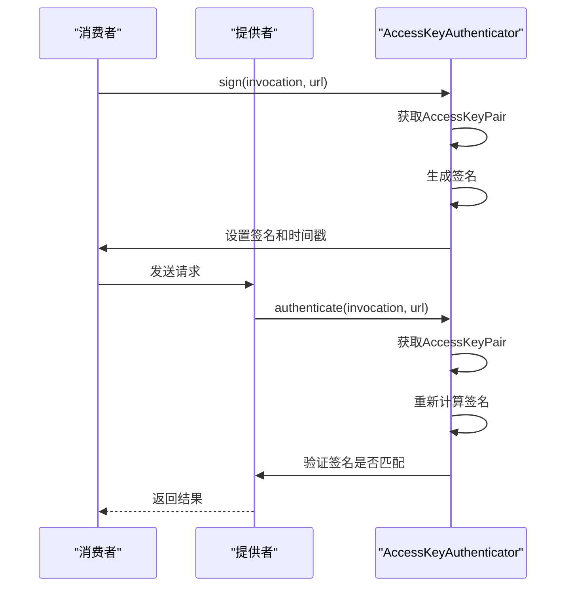
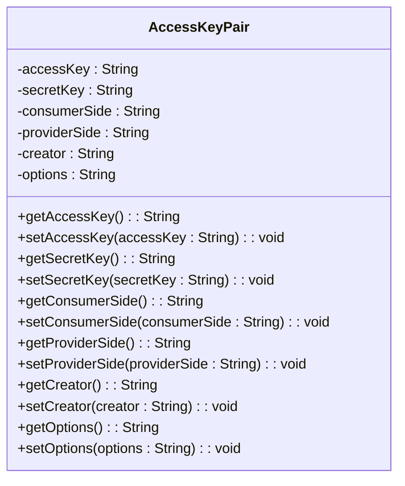
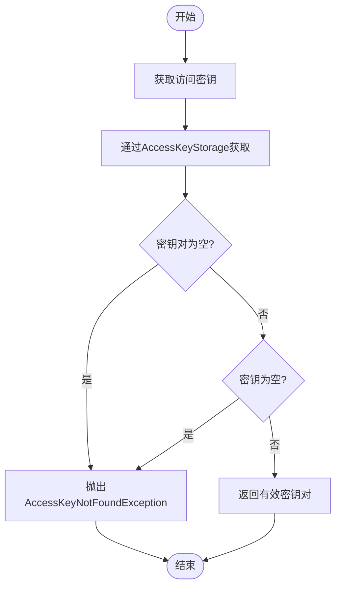
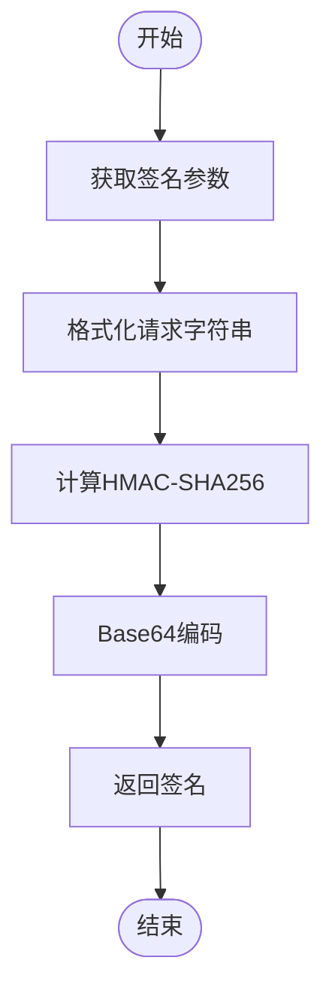
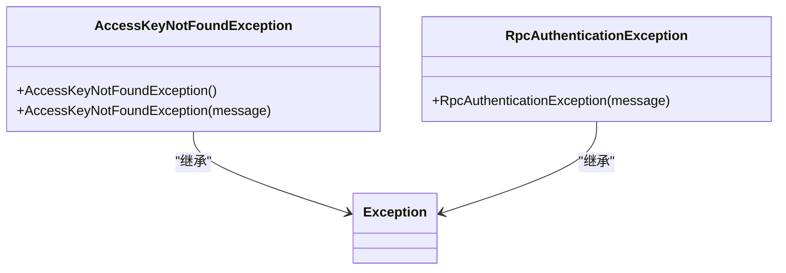
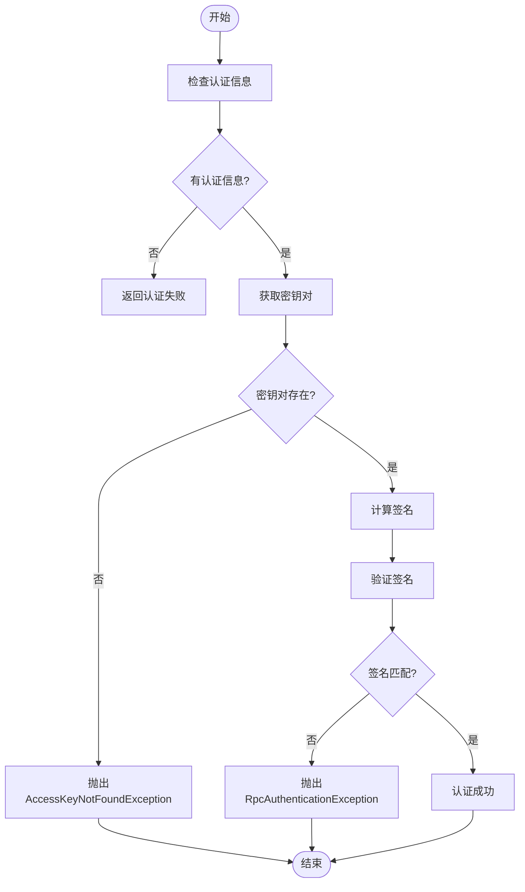

# 访问密钥认证

<cite>
**本文档引用的文件**
- [AccessKeyAuthenticator.java](file://dubbo-plugin\dubbo-auth\src\main\java\org\apache\dubbo\auth\AccessKeyAuthenticator.java)
- [DefaultAccessKeyStorage.java](file://dubbo-plugin\dubbo-auth\src\main\java\org\apache\dubbo\auth\DefaultAccessKeyStorage.java)
- [AccessKeyStorage.java](file://dubbo-plugin\dubbo-auth\src\main\java\org\apache\dubbo\auth\spi\AccessKeyStorage.java)
- [Constants.java](file://dubbo-plugin\dubbo-auth\src\main\java\org\apache\dubbo\auth\Constants.java)
- [SignatureUtils.java](file://dubbo-plugin\dubbo-auth\src\main\java\org\apache\dubbo\auth\utils\SignatureUtils.java)
- [ProviderAuthFilter.java](file://dubbo-plugin\dubbo-auth\src\main\java\org\apache\dubbo\auth\filter\ProviderAuthFilter.java)
- [AccessKeyPair.java](file://dubbo-plugin\dubbo-auth\src\main\java\org\apache\dubbo\auth\model\AccessKeyPair.java)
</cite>

## 目录
1. [简介](#简介)
2. [核心组件](#核心组件)
3. [访问密钥验证机制](#访问密钥验证机制)
4. [密钥对生成与管理](#密钥对生成与管理)
5. [DefaultAccessKeyStorage内存存储实现](#defaultaccesskeystorage内存存储实现)
6. [SPI扩展持久化存储](#spi扩展持久化存储)
7. [签名机制与防重放攻击](#签名机制与防重放攻击)
8. [配置示例](#配置示例)
9. [密钥轮换策略与安全管理](#密钥轮换策略与安全管理)
10. [密钥配置指南](#密钥配置指南)
11. [错误处理](#错误处理)

## 简介
访问密钥认证是Dubbo框架中用于保护服务调用安全的重要机制。该机制通过访问密钥（Access Key）和秘密密钥（Secret Key）的配对使用，确保只有经过授权的客户端才能访问服务提供者。本文档深入解析AccessKeyAuthenticator的实现机制，包括密钥验证、存储、签名等核心功能，为开发者提供完整的访问密钥认证解决方案。

## 核心组件

访问密钥认证系统由多个核心组件构成，包括AccessKeyAuthenticator、DefaultAccessKeyStorage、AccessKeyStorage SPI接口等。这些组件协同工作，实现了完整的认证流程。

**组件关系图**
```mermaid
classDiagram
class AccessKeyAuthenticator {
+sign(invocation, url)
+authenticate(invocation, url)
+getAccessKeyPair(invocation, url)
+getSignature(url, invocation, secretKey, time)
}
class DefaultAccessKeyStorage {
+getAccessKey(url, invocation)
}
class AccessKeyPair {
+accessKey
+secretKey
+consumerSide
+providerSide
+creator
+options
}
class SignatureUtils {
+sign(metadata, key)
+sign(parameters, metadata, key)
+sign(data, key)
+toByteArray(parameters)
}
class ProviderAuthFilter {
+invoke(invoker, invocation)
}
<<interface>> AccessKeyStorage
AccessKeyStorage : +getAccessKey(url, invocation)
AccessKeyAuthenticator --> AccessKeyStorage : "使用"
AccessKeyAuthenticator --> SignatureUtils : "使用"
AccessKeyAuthenticator --> AccessKeyPair : "创建"
ProviderAuthFilter --> AccessKeyAuthenticator : "调用"
DefaultAccessKeyStorage --> AccessKeyStorage : "实现"
DefaultAccessKeyStorage --> AccessKeyPair : "创建"
```

**组件来源**
- [AccessKeyAuthenticator.java](file://dubbo-plugin\dubbo-auth\src\main\java\org\apache\dubbo\auth\AccessKeyAuthenticator.java)
- [DefaultAccessKeyStorage.java](file://dubbo-plugin\dubbo-auth\src\main\java\org\apache\dubbo\auth\DefaultAccessKeyStorage.java)
- [AccessKeyStorage.java](file://dubbo-plugin\dubbo-auth\src\main\java\org\apache\dubbo\auth\spi\AccessKeyStorage.java)
- [SignatureUtils.java](file://dubbo-plugin\dubbo-auth\src\main\java\org\apache\dubbo\auth\utils\SignatureUtils.java)
- [ProviderAuthFilter.java](file://dubbo-plugin\dubbo-auth\src\main\java\org\apache\dubbo\auth\filter\ProviderAuthFilter.java)

## 访问密钥验证机制

访问密钥验证机制是整个认证系统的核心，通过AccessKeyAuthenticator类实现。该机制在服务调用过程中对请求进行签名和验证，确保请求的完整性和真实性。

### 认证流程


### 验证实现
AccessKeyAuthenticator的authenticate方法实现了完整的验证逻辑：

1. 从调用上下文中获取访问密钥ID、时间戳、原始签名和消费者信息
2. 验证这些关键信息是否为空
3. 通过AccessKeyStorage获取对应的密钥对
4. 使用相同的算法重新计算签名
5. 比较计算出的签名与原始签名是否一致

**验证来源**
- [AccessKeyAuthenticator.java](file://dubbo-plugin\dubbo-auth\src\main\java\org\apache\dubbo\auth\AccessKeyAuthenticator.java#L51-L73)

## 密钥对生成与管理

密钥对由AccessKeyPair类表示，包含访问密钥和秘密密钥等信息。系统通过AccessKeyStorage接口获取密钥对，并在需要时进行管理。

### 密钥对结构


### 密钥管理流程


**密钥对来源**
- [AccessKeyPair.java](file://dubbo-plugin\dubbo-auth\src\main\java\org\apache\dubbo\auth\model\AccessKeyPair.java)
- [AccessKeyAuthenticator.java](file://dubbo-plugin\dubbo-auth\src\main\java\org\apache\dubbo\auth\AccessKeyAuthenticator.java#L75-L91)

## DefaultAccessKeyStorage内存存储实现

DefaultAccessKeyStorage是AccessKeyStorage接口的默认实现，采用内存存储方式管理访问密钥。

### 实现原理
DefaultAccessKeyStorage从URL参数中读取访问密钥和秘密密钥，创建AccessKeyPair对象返回。这种实现方式简单高效，适用于开发和测试环境。

```java
public AccessKeyPair getAccessKey(URL url, Invocation invocation) {
    AccessKeyPair accessKeyPair = new AccessKeyPair();
    String accessKeyId = url.getParameter(Constants.ACCESS_KEY_ID_KEY);
    String secretAccessKey = url.getParameter(Constants.SECRET_ACCESS_KEY_KEY);
    accessKeyPair.setAccessKey(accessKeyId);
    accessKeyPair.setSecretKey(secretAccessKey);
    return accessKeyPair;
}
```

### 存储特性
- **存储位置**: URL参数
- **访问方式**: 直接读取
- **生命周期**: 与URL绑定
- **安全性**: 适合开发环境，生产环境建议使用更安全的存储方式

**存储实现来源**
- [DefaultAccessKeyStorage.java](file://dubbo-plugin\dubbo-auth\src\main\java\org\apache\dubbo\auth\DefaultAccessKeyStorage.java)
- [Constants.java](file://dubbo-plugin\dubbo-auth\src\main\java\org\apache\dubbo\auth\Constants.java#L35-L37)

## SPI扩展持久化存储

通过SPI（Service Provider Interface）机制，系统支持扩展AccessKeyStorage接口，实现数据库或其他持久化存储。

### SPI扩展机制
```mermaid
classDiagram
<<interface>> AccessKeyStorage
AccessKeyStorage : +getAccessKey(url, invocation)
class DefaultAccessKeyStorage {
+getAccessKey(url, invocation)
}
class DatabaseAccessKeyStorage {
+getAccessKey(url, invocation)
}
class FileAccessKeyStorage {
+getAccessKey(url, invocation)
}
DefaultAccessKeyStorage --> AccessKeyStorage : "实现"
DatabaseAccessKeyStorage --> AccessKeyStorage : "实现"
FileAccessKeyStorage --> AccessKeyStorage : "实现"
AccessKeyAuthenticator --> AccessKeyStorage : "使用"
```

### 扩展示例
要实现数据库存储，可以创建自定义的AccessKeyStorage实现：

```java
@SPI
public class DatabaseAccessKeyStorage implements AccessKeyStorage {
    @Override
    public AccessKeyPair getAccessKey(URL url, Invocation invocation) {
        // 从数据库查询密钥对
        String accessKeyId = url.getParameter(Constants.ACCESS_KEY_ID_KEY);
        return databaseService.findAccessKeyPair(accessKeyId);
    }
}
```

然后在META-INF/dubbo/internal/org.apache.dubbo.auth.spi.AccessKeyStorage文件中注册：

```
database=org.apache.dubbo.auth.DatabaseAccessKeyStorage
```

**SPI扩展来源**
- [AccessKeyStorage.java](file://dubbo-plugin\dubbo-auth\src\main\java\org\apache\dubbo\auth\spi\AccessKeyStorage.java)
- [AccessKeyAuthenticator.java](file://dubbo-plugin\dubbo-auth\src\main\java\org\apache\dubbo\auth\AccessKeyAuthenticator.java#L76-L78)
- [org.apache.dubbo.auth.spi.AccessKeyStorage](file://dubbo-plugin\dubbo-auth\src\main\resources\META-INF\dubbo\internal\org.apache.dubbo.auth.spi.AccessKeyStorage)

## 签名机制与防重放攻击

签名机制是访问密钥认证的核心安全特性，通过HMAC-SHA256算法确保请求的完整性和真实性。

### 签名生成流程


### 签名算法
SignatureUtils类实现了签名算法：

```java
private static String sign(byte[] data, String key) throws RuntimeException {
    Mac mac;
    try {
        mac = Mac.getInstance(HMAC_SHA256_ALGORITHM);
    } catch (NoSuchAlgorithmException e) {
        throw new RuntimeException("Failed to generate HMAC: no such algorithm exception " + HMAC_SHA256_ALGORITHM);
    }
    SecretKeySpec signingKey = new SecretKeySpec(key.getBytes(StandardCharsets.UTF_8), HMAC_SHA256_ALGORITHM);
    try {
        mac.init(signingKey);
    } catch (InvalidKeyException e) {
        throw new RuntimeException("Failed to generate HMAC: invalid key exception");
    }
    byte[] rawHmac;
    try {
        rawHmac = mac.doFinal(data);
    } catch (IllegalStateException e) {
        throw new RuntimeException("Failed to generate HMAC: " + e.getMessage());
    }
    return Base64.getEncoder().encodeToString(rawHmac);
}
```

### 防重放攻击
系统通过时间戳机制防止重放攻击：

1. 请求方在签名时包含当前时间戳
2. 服务提供方验证时间戳是否在允许的时间窗口内
3. 拒绝过期的请求

**签名机制来源**
- [SignatureUtils.java](file://dubbo-plugin\dubbo-auth\src\main\java\org\apache\dubbo\auth\utils\SignatureUtils.java)
- [AccessKeyAuthenticator.java](file://dubbo-plugin\dubbo-auth\src\main\java\org\apache\dubbo\auth\AccessKeyAuthenticator.java#L93-L101)
- [Constants.java](file://dubbo-plugin\dubbo-auth\src\main\java\org\apache\dubbo\auth\Constants.java#L39-L40)

## 配置示例

### 服务提供者端配置
在服务提供者端启用访问密钥认证：

```xml
<dubbo:service interface="com.example.DemoService" ref="demoService" protocol="dubbo">
    <dubbo:parameter key="auth" value="true"/>
    <dubbo:parameter key="authenticator" value="accesskey"/>
    <dubbo:parameter key="accessKey.storage" value="urlstorage"/>
    <dubbo:parameter key=".accessKeyId" value="your-access-key-id"/>
    <dubbo:parameter key=".secretAccessKey" value="your-secret-access-key"/>
</dubbo:service>
```

或使用Java配置：

```java
ServiceConfig<DemoService> service = new ServiceConfig<>();
service.setInterface(DemoService.class);
service.setRef(demoService);
service.setProtocol(new ProtocolConfig("dubbo"));
Map<String, String> parameters = new HashMap<>();
parameters.put("auth", "true");
parameters.put("authenticator", "accesskey");
parameters.put("accessKey.storage", "urlstorage");
parameters.put(".accessKeyId", "your-access-key-id");
parameters.put(".secretAccessKey", "your-secret-access-key");
service.setParameters(parameters);
```

### 消费者端配置
在消费者端配置访问密钥并生成签名请求：

```xml
<dubbo:reference id="demoService" interface="com.example.DemoService" url="dubbo://127.0.0.1:20880">
    <dubbo:parameter key=".accessKeyId" value="your-access-key-id"/>
    <dubbo:parameter key=".secretAccessKey" value="your-secret-access-key"/>
</dubbo:reference>
```

或使用Java配置：

```java
ReferenceConfig<DemoService> reference = new ReferenceConfig<>();
reference.setInterface(DemoService.class);
reference.setUrl("dubbo://127.0.0.1:20880");
Map<String, String> parameters = new HashMap<>();
parameters.put(".accessKeyId", "your-access-key-id");
parameters.put(".secretAccessKey", "your-secret-access-key");
reference.setParameters(parameters);
```

**配置来源**
- [Constants.java](file://dubbo-plugin\dubbo-auth\src\main\java\org\apache\dubbo\auth\Constants.java)
- [AccessKeyAuthenticator.java](file://dubbo-plugin\dubbo-auth\src\main\java\org\apache\dubbo\auth\AccessKeyAuthenticator.java)

## 密钥轮换策略与安全管理

### 密钥轮换策略
为确保系统安全，建议实施密钥轮换策略：

1. **定期轮换**: 每3-6个月轮换一次密钥
2. **灰度发布**: 先在部分服务上更新密钥，验证无误后再全面推广
3. **双密钥机制**: 同时维护新旧两套密钥，确保平滑过渡

### 安全管理最佳实践
1. **密钥保护**: 秘密密钥不应硬编码在代码中，应使用环境变量或配置中心管理
2. **权限控制**: 不同服务使用不同的密钥对，遵循最小权限原则
3. **监控审计**: 记录密钥使用情况，及时发现异常访问
4. **失效处理**: 密钥泄露后立即失效并重新生成

**安全管理来源**
- [AccessKeyAuthenticator.java](file://dubbo-plugin\dubbo-auth\src\main\java\org\apache\dubbo\auth\AccessKeyAuthenticator.java)
- [ProviderAuthFilter.java](file://dubbo-plugin\dubbo-auth\src\main\java\org\apache\dubbo\auth\filter\ProviderAuthFilter.java)

## 密钥配置指南

### 初学者指南
对于初学者，可以按照以下步骤快速配置访问密钥：

1. **生成密钥对**: 创建访问密钥ID和秘密密钥
2. **配置提供者**: 在服务提供者端启用认证并配置密钥
3. **配置消费者**: 在消费者端配置相同的密钥
4. **测试验证**: 调用服务验证认证是否正常工作

### 高级用户指南
高级用户可以自定义存储和验证逻辑：

1. **实现自定义存储**: 创建AccessKeyStorage接口的实现类
2. **注册SPI扩展**: 在META-INF/dubbo/internal目录下注册实现
3. **配置使用**: 在服务配置中指定自定义存储实现

**配置指南来源**
- [AccessKeyAuthenticator.java](file://dubbo-plugin\dubbo-auth\src\main\java\org\apache\dubbo\auth\AccessKeyAuthenticator.java)
- [AccessKeyStorage.java](file://dubbo-plugin\dubbo-auth\src\main\java\org\apache\dubbo\auth\spi\AccessKeyStorage.java)

## 错误处理

系统提供了完善的错误处理机制，处理各种异常情况。

### 常见错误类型


### 错误处理流程


**错误处理来源**
- [AccessKeyAuthenticator.java](file://dubbo-plugin\dubbo-auth\src\main\java\org\apache\dubbo\auth\AccessKeyAuthenticator.java)
- [AccessKeyNotFoundException.java](file://dubbo-plugin\dubbo-auth\src\main\java\org\apache\dubbo\auth\exception\AccessKeyNotFoundException.java)
- [ProviderAuthFilter.java](file://dubbo-plugin\dubbo-auth\src\main\java\org\apache\dubbo\auth\filter\ProviderAuthFilter.java#L51-L55)