# SPI扩展

<cite>
**本文档引用的文件**   
- [ExtensionLoader.java](file://dubbo-common\src\main\java\org\apache\dubbo\common\extension\ExtensionLoader.java)
- [SPI.java](file://dubbo-common\src\main\java\org\apache\dubbo\common\extension\SPI.java)
- [Adaptive.java](file://dubbo-common\src\main\java\org\apache\dubbo\common\extension\Adaptive.java)
- [Activate.java](file://dubbo-common\src\main\java\org\apache\dubbo\common\extension\Activate.java)
- [LoadingStrategy.java](file://dubbo-common\src\main\java\org\apache\dubbo\common\extension\LoadingStrategy.java)
- [ClassLoaderResourceLoader.java](file://dubbo-common\src\main\java\org\apache\dubbo\common\utils\ClassLoaderResourceLoader.java)
- [ScopeModelUtil.java](file://dubbo-common\src\main\java\org\apache\dubbo\rpc\model\ScopeModelUtil.java)
- [ExtensionDirector.java](file://dubbo-common\src\main\java\org\apache\dubbo\common\extension\ExtensionDirector.java)
</cite>

## 目录
1. [引言](#引言)
2. [SPI扩展机制概述](#spi扩展机制概述)
3. [核心组件分析](#核心组件分析)
4. [扩展加载流程](#扩展加载流程)
5. [高级特性](#高级特性)
6. [性能优化与线程安全](#性能优化与线程安全)
7. [最佳实践](#最佳实践)
8. [结论](#结论)

## 引言

Dubbo的SPI（Service Provider Interface）扩展机制是其架构的核心特性之一，为框架提供了强大的可扩展性。该机制允许开发者在不修改框架源码的情况下，通过配置文件定义和加载自定义的扩展实现。本文将深入分析Dubbo SPI扩展机制的实现原理，重点讲解ExtensionLoader类如何通过META-INF/dubbo、META-INF/dubbo/internal等目录下的配置文件发现和加载扩展实现，以及@SPI和@Adaptive注解的作用机制。

**本文档引用的文件**
- [ExtensionLoader.java](file://dubbo-common\src\main\java\org\apache\dubbo\common\extension\ExtensionLoader.java#L1-L1818)
- [SPI.java](file://dubbo-common\src\main\java\org\apache\dubbo\common\extension\SPI.java#L1-L154)

## SPI扩展机制概述

Dubbo的SPI扩展机制是对Java原生SPI机制的增强和改进。与Java原生SPI不同，Dubbo的SPI机制提供了更灵活的扩展点管理、更强大的依赖注入能力以及更完善的扩展生命周期管理。

### 扩展点定义

在Dubbo中，扩展点通过@SPI注解进行标记。被@SPI注解标记的接口即为一个扩展点，可以通过ExtensionLoader加载其实现类。@SPI注解支持指定默认扩展名称和扩展作用域：

```java
@SPI("dubbo")
public interface Protocol {
    // 扩展点接口定义
}
```

### 扩展配置文件

Dubbo的扩展配置文件位于META-INF/dubbo、META-INF/dubbo/internal或META-INF/services目录下，文件名通常为扩展接口的全限定名。配置文件采用键值对格式：

```
dubbo=org.apache.dubbo.rpc.protocol.dubbo.DubboProtocol
http=org.apache.dubbo.rpc.protocol.http.HttpProtocol
```

这种键值对格式相比Java原生SPI的纯类名列表有明显优势：当扩展实现因依赖第三方库缺失而无法初始化时，可以将异常信息与具体的扩展ID（键名）关联起来，便于问题定位。

### 加载策略

Dubbo定义了多种加载策略，通过LoadingStrategy接口实现，加载优先级从高到低依次为：

1. **DubboInternalLoadingStrategy**: 加载META-INF/dubbo/internal/目录下的扩展
2. **DubboLoadingStrategy**: 加载META-INF/dubbo/目录下的扩展  
3. **ServicesLoadingStrategy**: 加载META-INF/services/目录下的扩展

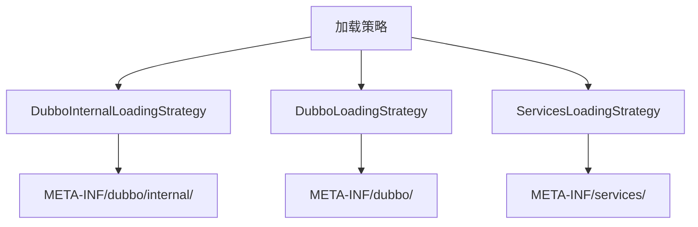

**图源**
- [LoadingStrategy.java](file://dubbo-common\src\main\java\org\apache\dubbo\common\extension\LoadingStrategy.java#L25-L143)

**本节源**
- [LoadingStrategy.java](file://dubbo-common\src\main\java\org\apache\dubbo\common\extension\LoadingStrategy.java#L25-L143)
- [ExtensionLoader.java](file://dubbo-common\src\main\java\org\apache\dubbo\common\extension\ExtensionLoader.java#L233-L344)

## 核心组件分析

### ExtensionLoader类

ExtensionLoader是Dubbo SPI机制的核心实现类，负责扩展的加载、缓存和管理。它提供了以下主要功能：

- 扩展加载：从配置文件中发现和加载扩展实现
- 依赖注入：自动注入扩展实例的依赖
- 扩展包装：支持AOP式的扩展包装
- 自适应扩展：生成自适应扩展实例
- 扩展激活：支持基于条件的扩展激活

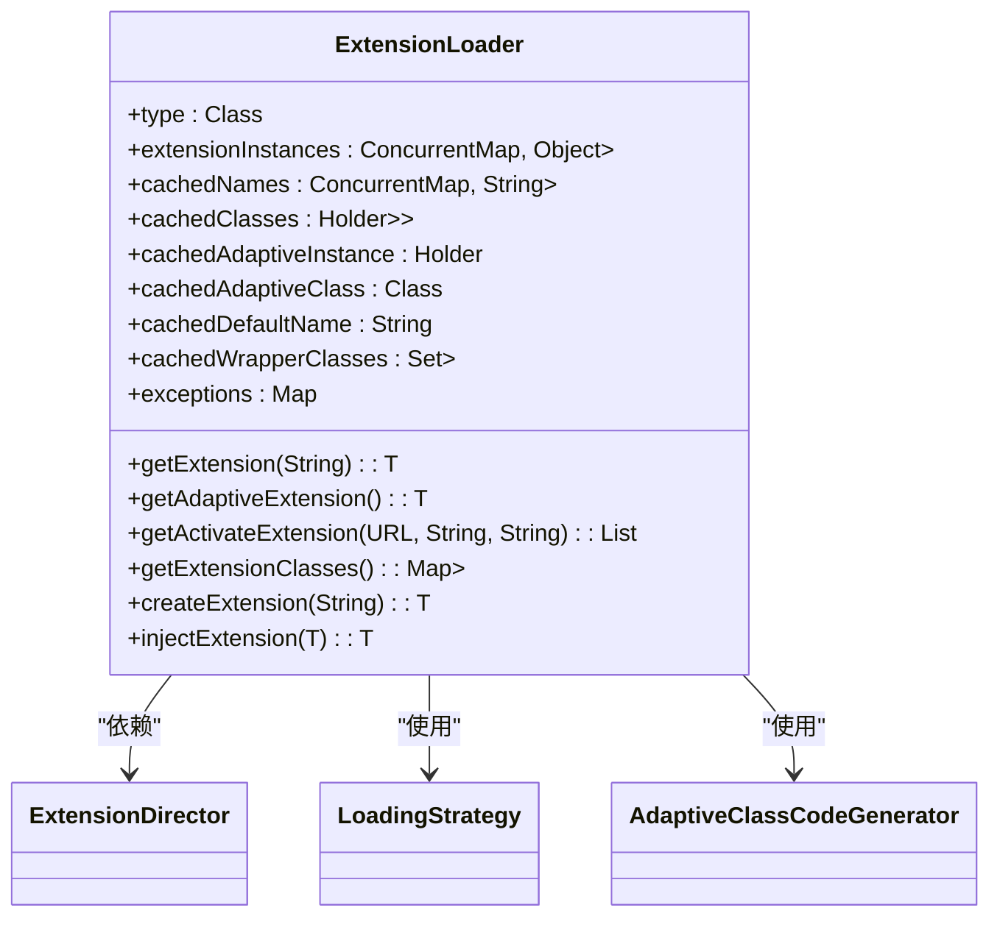

**图源**
- [ExtensionLoader.java](file://dubbo-common\src\main\java\org\apache\dubbo\common\extension\ExtensionLoader.java#L142-L1818)

**本节源**
- [ExtensionLoader.java](file://dubbo-common\src\main\java\org\apache\dubbo\common\extension\ExtensionLoader.java#L142-L1818)

### @SPI注解

@SPI注解用于标记一个接口为Dubbo的扩展点。它有两个重要属性：

- **value**: 指定默认扩展名称，当未指定具体扩展时使用
- **scope**: 定义扩展的作用域，包括FRAMEWORK（框架级）、APPLICATION（应用级）、MODULE（模块级）和SELF（自身作用域）

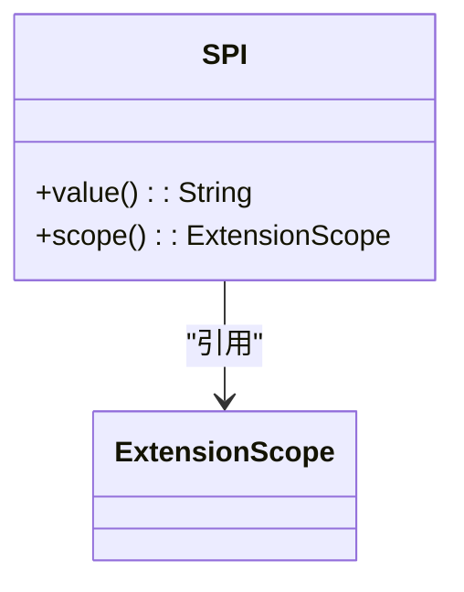

**图源**
- [SPI.java](file://dubbo-common\src\main\java\org\apache\dubbo\common\extension\SPI.java#L134-L153)

**本节源**
- [SPI.java](file://dubbo-common\src\main\java\org\apache\dubbo\common\extension\SPI.java#L134-L153)

### @Adaptive注解

@Adaptive注解用于标识自适应扩展，可以应用于类或方法。当应用于类时，表示该类为自适应扩展的实现；当应用于方法时，表示该方法需要生成自适应代码。

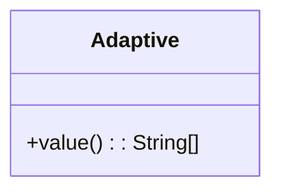

**图源**
- [Adaptive.java](file://dubbo-common\src\main\java\org\apache\dubbo\common\extension\Adaptive.java#L40-L79)

**本节源**
- [Adaptive.java](file://dubbo-common\src\main\java\org\apache\dubbo\common\extension\Adaptive.java#L40-L79)

### @Activate注解

@Activate注解用于标识一个扩展在特定条件下自动激活。它支持基于组和参数的激活条件：

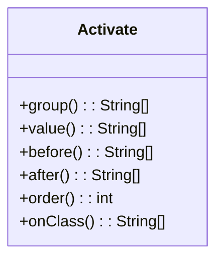

**图源**
- [Activate.java](file://dubbo-common\src\main\java\org\apache\dubbo\common\extension\Activate.java#L56-L139)

**本节源**
- [Activate.java](file://dubbo-common\src\main\java\org\apache\dubbo\common\extension\Activate.java#L56-L139)

## 扩展加载流程

### 扩展加载过程

ExtensionLoader的扩展加载过程是一个典型的懒加载模式，主要流程如下：

1. **获取ExtensionLoader实例**：通过getExtensionLoader方法获取指定扩展接口的加载器
2. **加载扩展类**：调用getExtensionClasses方法加载所有扩展实现类
3. **创建扩展实例**：调用getExtension方法创建指定名称的扩展实例
4. **依赖注入**：自动注入扩展实例的依赖
5. **包装扩展**：应用包装类对扩展实例进行增强

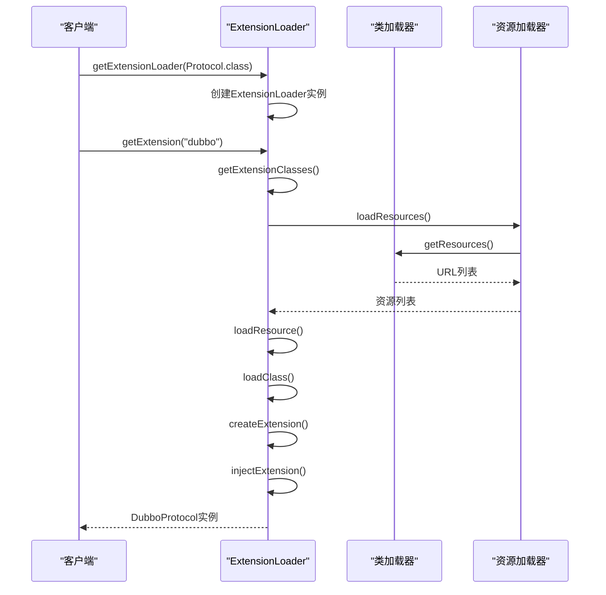

**图源**
- [ExtensionLoader.java](file://dubbo-common\src\main\java\org\apache\dubbo\common\extension\ExtensionLoader.java#L785-L800)
- [ClassLoaderResourceLoader.java](file://dubbo-common\src\main\java\org\apache\dubbo\common\utils\ClassLoaderResourceLoader.java#L38-L99)

**本节源**
- [ExtensionLoader.java](file://dubbo-common\src\main\java\org\apache\dubbo\common\extension\ExtensionLoader.java#L785-L800)
- [ClassLoaderResourceLoader.java](file://dubbo-common\src\main\java\org\apache\dubbo\common\utils\ClassLoaderResourceLoader.java#L38-L99)

### 自适应扩展生成

自适应扩展是Dubbo SPI机制的重要特性，它允许在运行时根据URL参数动态选择具体的扩展实现。自适应扩展的生成过程如下：

1. **查找自适应类**：检查扩展实现类是否有@Adaptive注解
2. **生成自适应代码**：如果没有现成的自适应类，则动态生成
3. **编译自适应类**：使用编译器将生成的代码编译为字节码
4. **加载自适应实例**：创建并返回自适应扩展实例

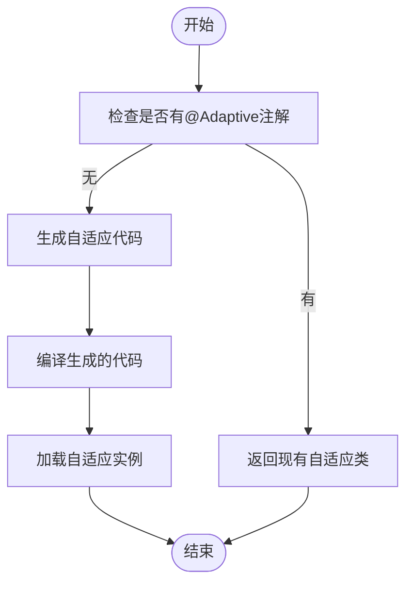

**图源**
- [ExtensionLoader.java](file://dubbo-common\src\main\java\org\apache\dubbo\common\extension\ExtensionLoader.java#L1744-L1767)

**本节源**
- [ExtensionLoader.java](file://dubbo-common\src\main\java\org\apache\dubbo\common\extension\ExtensionLoader.java#L1744-L1767)

## 高级特性

### 扩展包装（Wrapper）

Dubbo支持扩展的自动包装，类似于AOP的环绕通知。包装类通过构造函数注入被包装的扩展实例，从而在调用前后添加额外逻辑。

```java
public class ProtocolFilterWrapper implements Protocol {
    private final Protocol protocol;
    
    public ProtocolFilterWrapper(Protocol protocol) {
        this.protocol = protocol;
    }
    
    // 在调用实际协议前后的增强逻辑
}
```

判断一个类是否为包装类的关键是检查其构造函数：

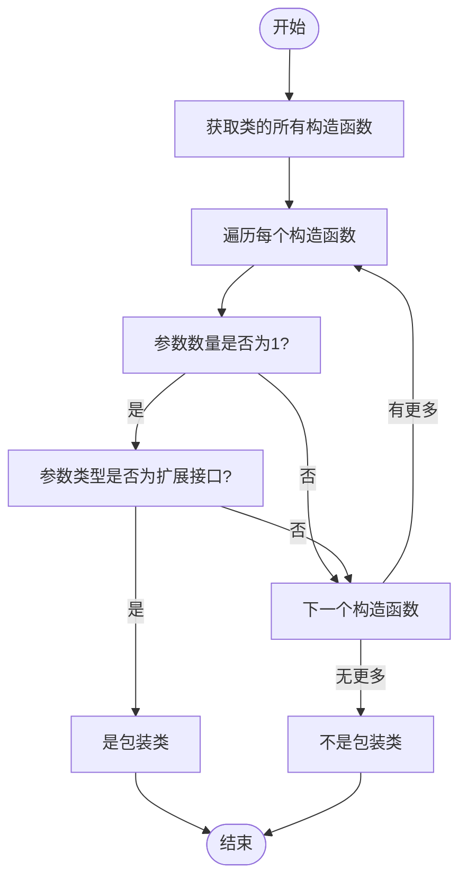

**图源**
- [ExtensionLoader.java](file://dubbo-common\src\main\java\org\apache\dubbo\common\extension\ExtensionLoader.java#L1705-L1713)

**本节源**
- [ExtensionLoader.java](file://dubbo-common\src\main\java\org\apache\dubbo\common\extension\ExtensionLoader.java#L1705-L1713)

### 扩展激活（Activate）

@Activate注解支持基于条件的扩展激活，主要通过以下条件判断：

- **组条件**：通过group属性指定，匹配特定的组
- **参数条件**：通过value属性指定，匹配URL中的参数
- **类条件**：通过onClass属性指定，要求特定类存在

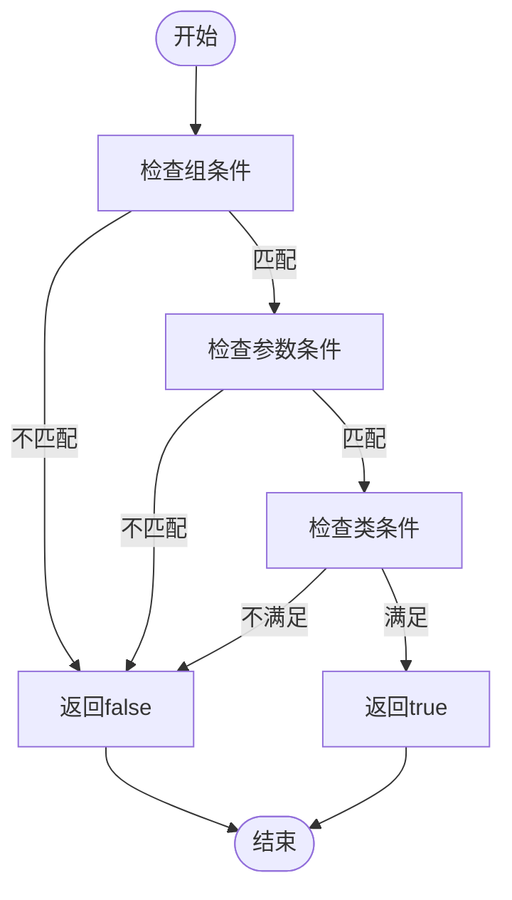

**图源**
- [ExtensionLoader.java](file://dubbo-common\src\main\java\org\apache\dubbo\common\extension\ExtensionLoader.java#L689-L725)

**本节源**
- [ExtensionLoader.java](file://dubbo-common\src\main\java\org\apache\dubbo\common\extension\ExtensionLoader.java#L689-L725)

### 作用域模型

Dubbo引入了作用域模型（Scope Model）来管理扩展的生命周期，支持多种作用域：

- **FRAMEWORK**：框架级，全局共享
- **APPLICATION**：应用级，同一应用共享
- **MODULE**：模块级，同一模块共享
- **SELF**：自身作用域，不共享

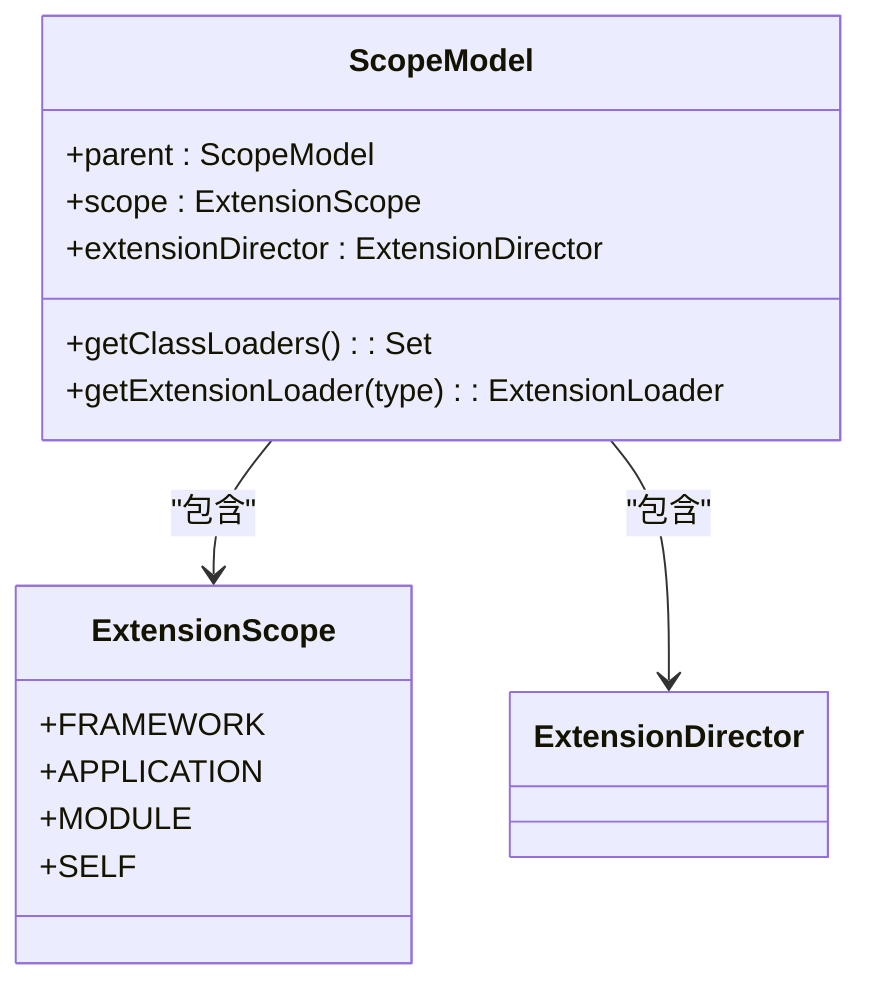

**图源**
- [ScopeModelUtil.java](file://dubbo-common\src\main\java\org\apache\dubbo\rpc\model\ScopeModelUtil.java#L100-L119)
- [ExtensionDirector.java](file://dubbo-common\src\main\java\org\apache\dubbo\common\extension\ExtensionDirector.java#L209-L308)

**本节源**
- [ScopeModelUtil.java](file://dubbo-common\src\main\java\org\apache\dubbo\rpc\model\ScopeModelUtil.java#L100-L119)
- [ExtensionDirector.java](file://dubbo-common\src\main\java\org\apache\dubbo\common\extension\ExtensionDirector.java#L209-L308)

## 性能优化与线程安全

### 缓存机制

ExtensionLoader采用了多层缓存机制来提高性能：

- **扩展类缓存**：cachedClasses缓存已加载的扩展类
- **扩展实例缓存**：cachedInstances缓存已创建的扩展实例
- **自适应实例缓存**：cachedAdaptiveInstance缓存自适应扩展实例
- **包装类缓存**：cachedWrapperClasses缓存包装类

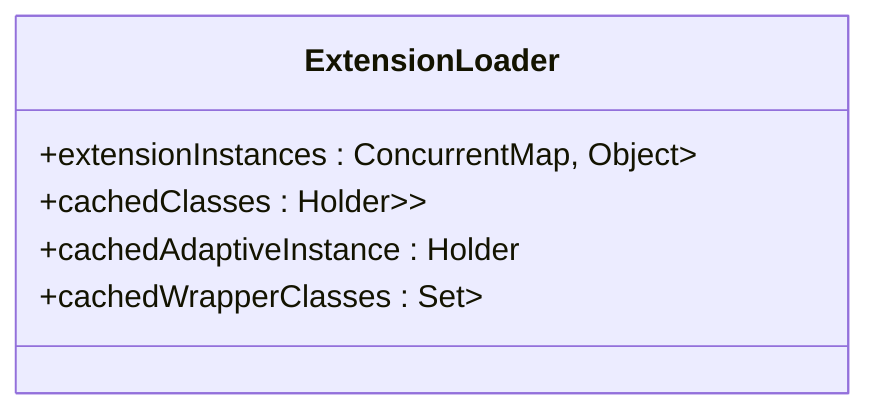

**图源**
- [ExtensionLoader.java](file://dubbo-common\src\main\java\org\apache\dubbo\common\extension\ExtensionLoader.java#L161-L224)

**本节源**
- [ExtensionLoader.java](file://dubbo-common\src\main\java\org\apache\dubbo\common\extension\ExtensionLoader.java#L161-L224)

### 线程安全设计

ExtensionLoader在设计上充分考虑了线程安全：

1. **并发集合**：使用ConcurrentHashMap、ConcurrentHashSet等线程安全的集合类
2. **双重检查锁**：在加载扩展类时使用双重检查锁模式
3. **不可变对象**：缓存的扩展实例一旦创建就不会被修改
4. **原子操作**：使用AtomicBoolean等原子类进行状态管理

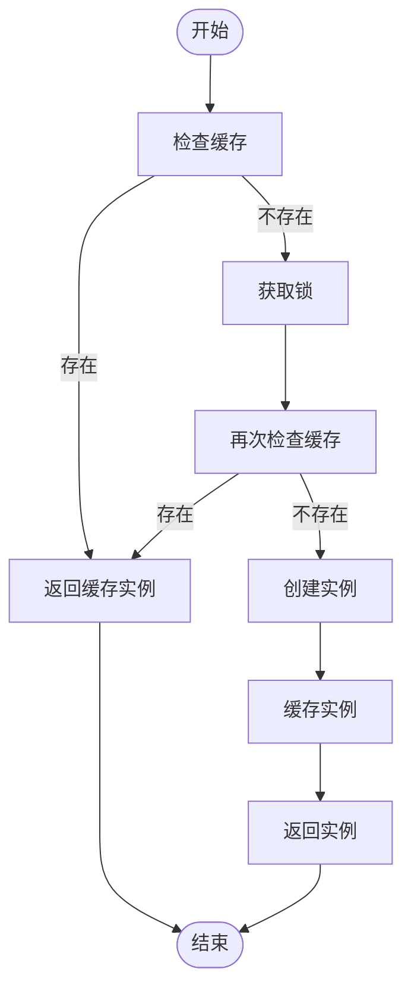

**图源**
- [ExtensionLoader.java](file://dubbo-common\src\main\java\org\apache\dubbo\common\extension\ExtensionLoader.java#L181-L182)

**本节源**
- [ExtensionLoader.java](file://dubbo-common\src\main\java\org\apache\dubbo\common\extension\ExtensionLoader.java#L181-L182)

### 资源加载优化

为了提高资源加载性能，Dubbo实现了ClassLoaderResourceLoader，具有以下优化特性：

- **资源缓存**：使用软引用缓存已加载的资源
- **异步加载**：支持并发加载多个类加载器的资源
- **全局管理**：通过GlobalResourcesRepository统一管理资源生命周期

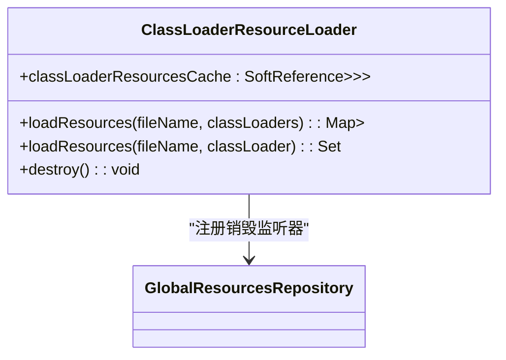

**图源**
- [ClassLoaderResourceLoader.java](file://dubbo-common\src\main\java\org\apache\dubbo\common\utils\ClassLoaderResourceLoader.java#L38-L99)

**本节源**
- [ClassLoaderResourceLoader.java](file://dubbo-common\src\main\java\org\apache\dubbo\common\utils\ClassLoaderResourceLoader.java#L38-L99)

## 最佳实践

### 扩展点定义规范

1. **命名规范**：扩展接口名称应具有描述性，避免使用过于通用的名称
2. **版本兼容性**：保持接口的向后兼容性，避免频繁修改方法签名
3. **文档说明**：为扩展接口提供详细的JavaDoc说明
4. **默认实现**：为重要扩展点提供合理的默认实现

### 扩展实现建议

1. **单一职责**：每个扩展实现应专注于单一功能
2. **异常处理**：妥善处理可能的异常情况，避免影响整体系统
3. **资源管理**：实现Disposable接口以正确管理资源
4. **线程安全**：确保扩展实现是线程安全的

### 配置管理

1. **配置分离**：将内部扩展和外部扩展分别配置在internal和普通目录下
2. **命名空间**：使用有意义的键名，便于识别和管理
3. **版本控制**：对扩展配置进行版本控制，便于回滚和追踪

## 结论

Dubbo的SPI扩展机制通过ExtensionLoader类实现了强大而灵活的扩展点管理功能。该机制不仅支持基本的扩展加载，还提供了自适应扩展、扩展包装、条件激活等高级特性，为框架的可扩展性奠定了坚实基础。

通过@SPI、@Adaptive和@Activate等注解，Dubbo实现了声明式的扩展配置，使开发者能够以简洁的方式定义和使用扩展。同时，精心设计的缓存机制和线程安全策略确保了扩展加载的高性能和可靠性。

理解Dubbo SPI机制的实现原理，不仅有助于更好地使用Dubbo框架，也为设计类似的可扩展系统提供了有价值的参考。