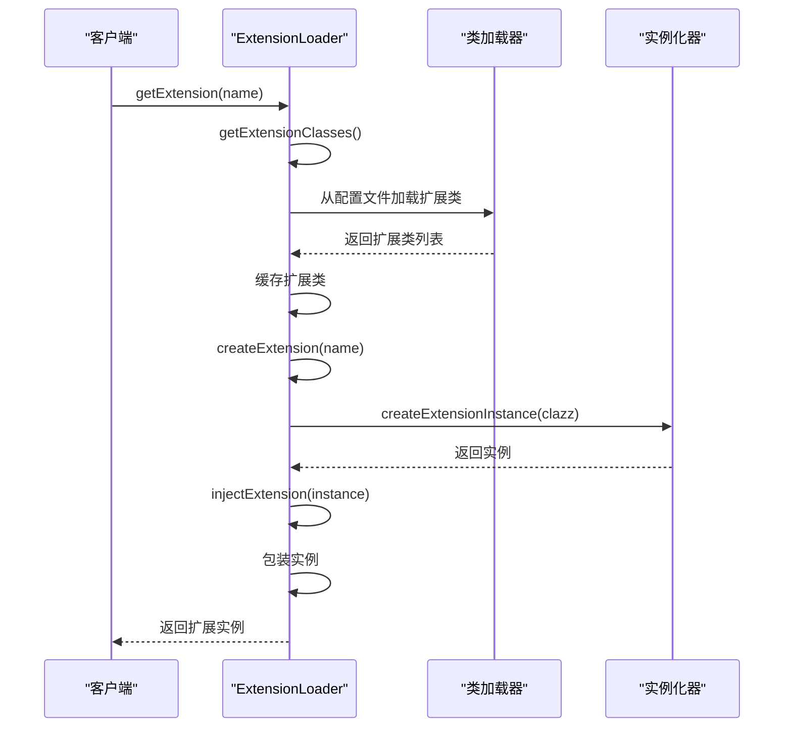
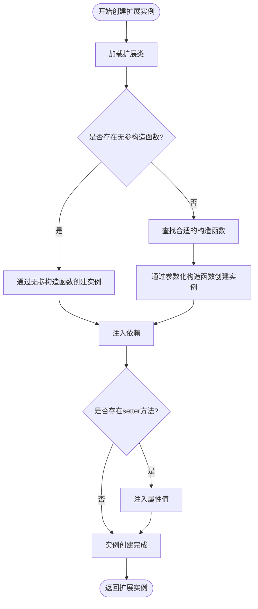
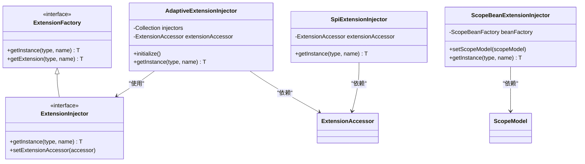
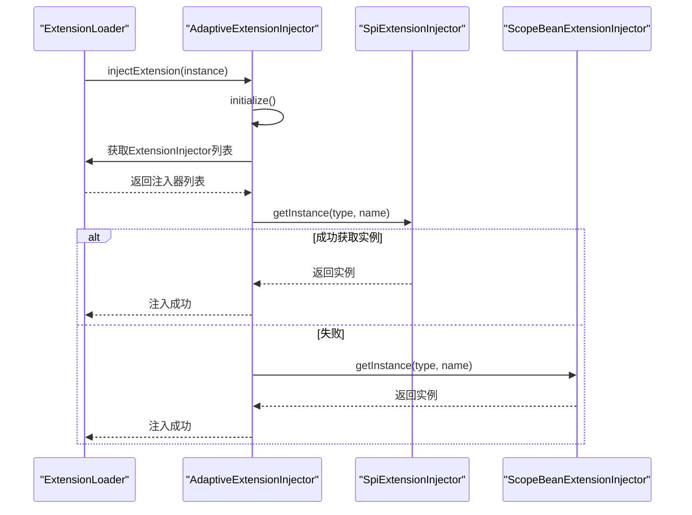
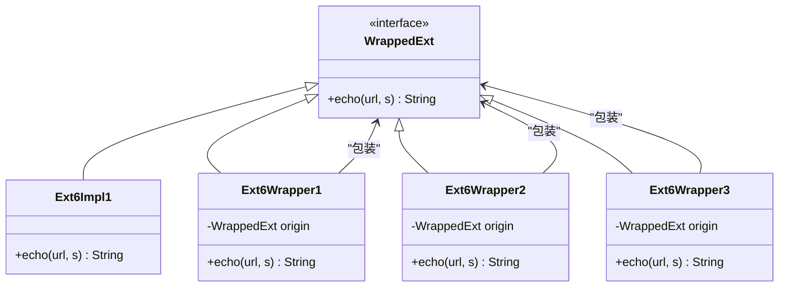
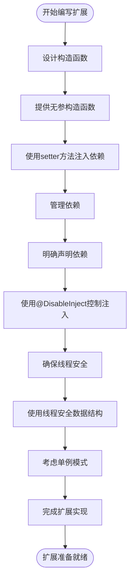

# 实例创建机制

<cite>
**本文档引用的文件**   
- [ExtensionLoader.java](file://dubbo-common\src\main\java\org\apache\dubbo\common\extension\ExtensionLoader.java)
- [ExtensionFactory.java](file://dubbo-common\src\main\java\org\apache\dubbo\common\extension\ExtensionFactory.java)
- [AdaptiveExtensionInjector.java](file://dubbo-common\src\main\java\org\apache\dubbo\common\extension\inject\AdaptiveExtensionInjector.java)
- [SpiExtensionInjector.java](file://dubbo-common\src\main\java\org\apache\dubbo\common\extension\inject\SpiExtensionInjector.java)
- [ScopeBeanExtensionInjector.java](file://dubbo-common\src\main\java\org\apache\dubbo\common\beans\ScopeBeanExtensionInjector.java)
</cite>

## 目录
1. [引言](#引言)
2. [扩展实例创建流程](#扩展实例创建流程)
3. [构造函数选择与参数注入](#构造函数选择与参数注入)
4. [ExtensionFactory与实例创建策略](#extensionfactory与实例创建策略)
5. [依赖注入机制](#依赖注入机制)
6. [AOP代理与装饰器模式](#aop代理与装饰器模式)
7. [扩展实现类编写最佳实践](#扩展实现类编写最佳实践)
8. [结论](#结论)

## 引言

Dubbo的扩展机制是其核心特性之一，通过SPI（Service Provider Interface）模式实现了高度可扩展的架构。本文档深入解析Dubbo扩展实例的创建过程，重点分析ExtensionLoader如何根据配置信息通过反射创建扩展实例，包括构造函数选择、参数注入和异常处理等关键环节。同时，文档将详细解释ExtensionFactory接口如何支持多种实例创建策略，以及扩展实例的依赖注入机制和上下文传递方式。

**实例创建机制**是Dubbo框架灵活性和可扩展性的基础，理解这一机制对于开发者正确使用和扩展Dubbo功能至关重要。通过本文档，开发者将能够掌握扩展实现类的编写最佳实践，包括构造函数设计、依赖管理和线程安全考虑等方面。

## 扩展实例创建流程

Dubbo扩展实例的创建主要由ExtensionLoader类负责，其核心流程包括扩展类的加载、实例化、依赖注入和包装等步骤。ExtensionLoader通过getExtension方法根据名称获取扩展实例，该方法首先检查扩展是否已加载，若未加载则触发扩展加载过程。

扩展加载过程首先通过getExtensionClasses方法加载所有扩展类，这些类信息从META-INF/dubbo/internal、META-INF/dubbo和META-INF/services等目录下的配置文件中读取。加载完成后，ExtensionLoader会缓存这些类信息，以便后续快速访问。当需要创建具体实例时，ExtensionLoader会根据扩展名称从缓存中获取对应的类，然后通过反射机制创建实例。

在实例创建过程中，ExtensionLoader会处理自适应扩展的特殊情况。对于标记为@Adaptive的扩展，框架会动态生成适配器类，该类根据运行时参数选择具体的实现。这种机制使得扩展能够在运行时根据配置动态选择实现，提高了框架的灵活性。

**图示来源**
- [ExtensionLoader.java](file://dubbo-common\src\main\java\org\apache\dubbo\common\extension\ExtensionLoader.java#L785-L800)

**本节来源**
- [ExtensionLoader.java](file://dubbo-common\src\main\java\org\apache\dubbo\common\extension\ExtensionLoader.java#L785-L1166)

## 构造函数选择与参数注入

在扩展实例创建过程中，构造函数的选择和参数注入是关键环节。Dubbo通过ExtensionLoader的createExtensionInstance方法处理实例化过程，该方法利用InstantiationStrategy策略来创建实例。对于普通扩展，框架会尝试调用无参构造函数创建实例；对于需要依赖注入的扩展，则通过setter方法注入依赖。

参数注入主要通过injectExtension方法实现，该方法遍历实例的所有setter方法，对于每个setter方法，框架会尝试从依赖注入器（ExtensionInjector）获取相应的依赖实例。Dubbo支持多种注入方式，包括基于SPI的注入、基于Spring的注入等。注入过程会跳过被@DisableInject注解标记的方法，允许开发者控制哪些属性需要自动注入。

异常处理在实例创建过程中也非常重要。如果在实例化或注入过程中发生异常，ExtensionLoader会捕获异常并包装为IllegalStateException抛出，同时提供详细的错误信息，包括扩展名称、类名和原始异常信息，便于问题排查。

**图示来源**
- [ExtensionLoader.java](file://dubbo-common\src\main\java\org\apache\dubbo\common\extension\ExtensionLoader.java#L1151-L1166)

**本节来源**
- [ExtensionLoader.java](file://dubbo-common\src\main\java\org\apache\dubbo\common\extension\ExtensionLoader.java#L1120-L1166)

## ExtensionFactory与实例创建策略

ExtensionFactory接口是Dubbo扩展实例创建策略的核心，它定义了获取扩展实例的统一接口。尽管该接口已被标记为@Deprecated，建议使用ExtensionInjector替代，但其设计理念仍然影响着当前的扩展机制。ExtensionFactory支持多种实例创建策略，包括自适应扩展、Spring集成等。

不同的Factory实现具有不同的优先级和选择机制。框架通过AdaptiveExtensionInjector作为自适应注入器，它内部维护了一个ExtensionInjector列表，按照优先级顺序尝试每个注入器，直到成功获取实例。这种设计使得框架能够灵活支持多种依赖注入机制，同时保持了扩展点的统一访问接口。

Factory的选择机制基于扩展的类型和名称。对于SPI扩展，框架优先使用SpiExtensionInjector；对于Spring Bean，则使用ScopeBeanExtensionInjector。这种基于类型的策略选择确保了不同场景下的最优实例化方式。Factory的优先级可以通过实现Prioritized接口来定义，允许开发者自定义扩展注入器的执行顺序。

**图示来源**
- [ExtensionFactory.java](file://dubbo-common\src\main\java\org\apache\dubbo\common\extension\ExtensionFactory.java#L27-L47)
- [AdaptiveExtensionInjector.java](file://dubbo-common\src\main\java\org\apache\dubbo\common\extension\inject\AdaptiveExtensionInjector.java#L34-L85)
- [SpiExtensionInjector.java](file://dubbo-common\src\main\java\org\apache\dubbo\common\extension\inject\SpiExtensionInjector.java#L24-L48)
- [ScopeBeanExtensionInjector.java](file://dubbo-common\src\main\java\org\apache\dubbo\common\beans\ScopeBeanExtensionInjector.java#L27-L41)

**本节来源**
- [ExtensionFactory.java](file://dubbo-common\src\main\java\org\apache\dubbo\common\extension\ExtensionFactory.java#L27-L47)
- [AdaptiveExtensionInjector.java](file://dubbo-common\src\main\java\org\apache\dubbo\common\extension\inject\AdaptiveExtensionInjector.java#L62-L85)

## 依赖注入机制

Dubbo的依赖注入机制通过ExtensionInjector接口实现，该机制支持多种依赖来源，包括SPI扩展、Spring Bean等。依赖注入的核心是AdaptiveExtensionInjector，它作为自适应注入器，协调多个具体的注入器实现。当需要注入依赖时，框架会按顺序尝试每个注入器，直到成功获取实例。

依赖注入的上下文传递通过ExtensionAccessor实现，该接口提供了访问扩展加载器和其他上下文信息的能力。在初始化AdaptiveExtensionInjector时，框架会将其ExtensionAccessor设置为当前的ExtensionDirector，从而建立完整的上下文链。这种设计使得注入器能够访问到所需的扩展加载器和其他资源。

注入过程遵循特定的优先级规则。首先尝试通过SPI机制获取扩展，如果失败则尝试从Spring容器获取Bean。这种分层的注入策略确保了框架的灵活性和兼容性。开发者可以通过实现自定义的ExtensionInjector来扩展注入机制，满足特定的业务需求。

**图示来源**
- [AdaptiveExtensionInjector.java](file://dubbo-common\src\main\java\org\apache\dubbo\common\extension\inject\AdaptiveExtensionInjector.java#L62-L85)
- [SpiExtensionInjector.java](file://dubbo-common\src\main\java\org\apache\dubbo\common\extension\inject\SpiExtensionInjector.java#L34-L46)
- [ScopeBeanExtensionInjector.java](file://dubbo-common\src\main\java\org\apache\dubbo\common\beans\ScopeBeanExtensionInjector.java#L37-L39)

**本节来源**
- [AdaptiveExtensionInjector.java](file://dubbo-common\src\main\java\org\apache\dubbo\common\extension\inject\AdaptiveExtensionInjector.java#L62-L85)
- [ExtensionLoader.java](file://dubbo-common\src\main\java\org\apache\dubbo\common\extension\ExtensionLoader.java#L1151-L1166)

## AOP代理与装饰器模式

Dubbo通过装饰器模式实现了AOP代理功能，这种设计允许在不修改原始代码的情况下为扩展添加额外的行为。装饰器模式的核心是Wrapper注解，该注解标记的类作为装饰器，包装目标扩展实例。当创建扩展实例时，框架会自动应用匹配的装饰器，形成装饰器链。

装饰器的应用遵循特定的规则。首先，框架会检查装饰器类的构造函数，确保其接受目标类型的参数。然后，根据Wrapper注解的matches和mismatches属性确定装饰器的适用范围。多个装饰器会按照优先级顺序依次应用，形成嵌套的包装结构。这种设计使得不同的横切关注点可以独立实现，并通过配置灵活组合。

装饰器模式与AOP代理的结合提供了强大的扩展能力。例如，可以创建日志装饰器记录方法调用，创建性能监控装饰器测量执行时间，或者创建安全装饰器验证访问权限。这些功能都可以通过实现简单的装饰器类来完成，而无需修改核心业务逻辑。

**图示来源**
- [Ext6Wrapper1.java](file://dubbo-common\src\test\java\org\apache\dubbo\common\extension\ext6_wrap\impl\Ext6Wrapper1.java#L26-L44)
- [Ext6Wrapper2.java](file://dubbo-common\src\test\java\org\apache\dubbo\common\extension\ext6_wrap\impl\Ext6Wrapper2.java#L26-L43)
- [Ext6Wrapper3.java](file://dubbo-common\src\test\java\org\apache\dubbo\common\extension\ext6_wrap\impl\Ext6Wrapper3.java#L26-L45)

**本节来源**
- [ExtensionLoader.java](file://dubbo-common\src\main\java\org\apache\dubbo\common\extension\ExtensionLoader.java#L1091-L1105)
- [Ext6Wrapper1.java](file://dubbo-common\src\test\java\org\apache\dubbo\common\extension\ext6_wrap\impl\Ext6Wrapper1.java#L26-L44)

## 扩展实现类编写最佳实践

编写Dubbo扩展实现类时，需要遵循一系列最佳实践以确保代码的质量和可维护性。首先，在构造函数设计方面，建议提供无参构造函数，以便框架能够顺利实例化扩展。如果需要依赖注入，可以通过setter方法实现，避免在构造函数中进行复杂的初始化操作。

依赖管理是扩展实现的关键。开发者应该明确声明扩展的依赖关系，使用@DisableInject注解控制不需要自动注入的属性。对于复杂的依赖关系，建议使用ExtensionInjector接口的自定义实现，提供更精细的控制。同时，需要注意避免循环依赖，这可能导致实例化失败。

线程安全是另一个重要考虑因素。由于扩展实例可能被多个线程共享，实现类应该保证线程安全。对于状态变量，可以使用线程安全的数据结构，或者通过同步机制保护共享资源。对于无状态的扩展，可以考虑使用单例模式，提高性能和资源利用率。

**图示来源**
- [ExtensionLoader.java](file://dubbo-common\src\main\java\org\apache\dubbo\common\extension\ExtensionLoader.java#L1151-L1166)
- [AdaptiveExtensionInjector.java](file://dubbo-common\src\main\java\org\apache\dubbo\common\extension\inject\AdaptiveExtensionInjector.java#L78-L84)

**本节来源**
- [ExtensionLoader.java](file://dubbo-common\src\main\java\org\apache\dubbo\common\extension\ExtensionLoader.java#L1151-L1166)
- [AdaptiveExtensionInjector.java](file://dubbo-common\src\main\java\org\apache\dubbo\common\extension\inject\AdaptiveExtensionInjector.java#L78-L84)

## 结论

通过对Dubbo扩展实例创建机制的深入分析，我们可以看到其设计的精巧和灵活性。ExtensionLoader作为核心组件，通过反射机制实现了扩展的动态加载和实例化，结合ExtensionFactory和ExtensionInjector提供了丰富的实例创建策略。装饰器模式的应用使得AOP功能得以优雅实现，为框架的可扩展性提供了坚实基础。

开发者在使用和扩展Dubbo时，应该充分理解这些机制的工作原理，遵循最佳实践编写扩展实现类。合理的构造函数设计、清晰的依赖管理、严格的线程安全考虑，这些都是确保扩展稳定运行的关键因素。通过掌握这些知识，开发者可以更好地利用Dubbo的扩展能力，构建高性能、高可用的分布式应用。