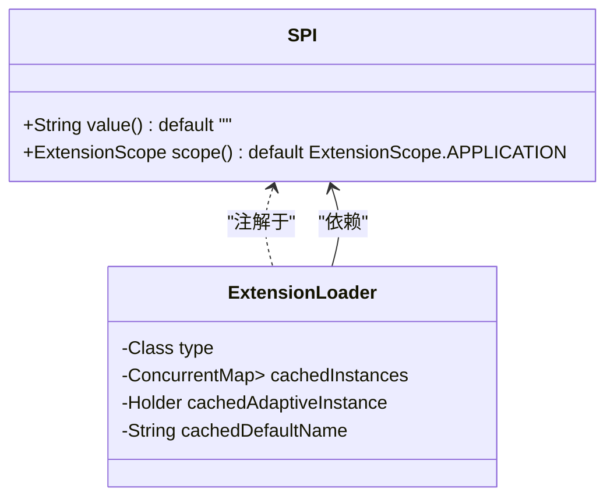
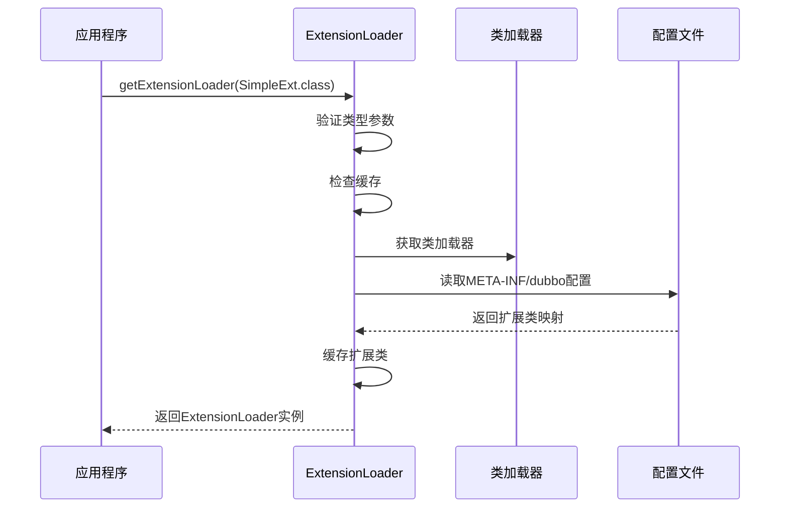
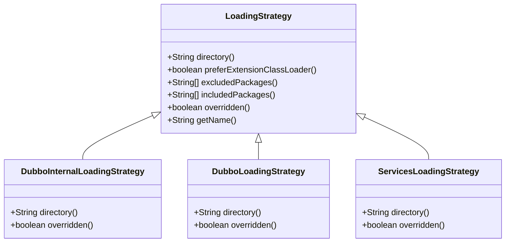
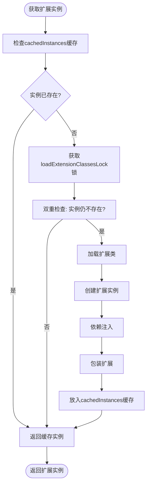
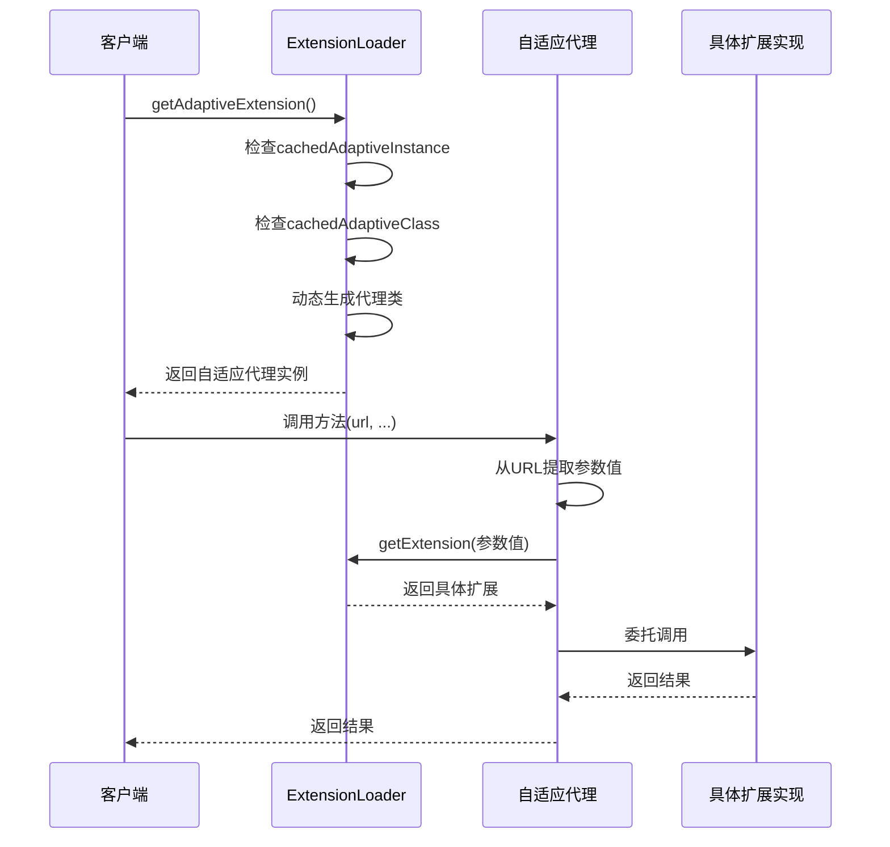
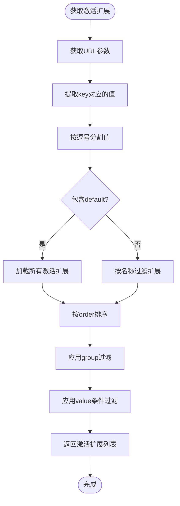
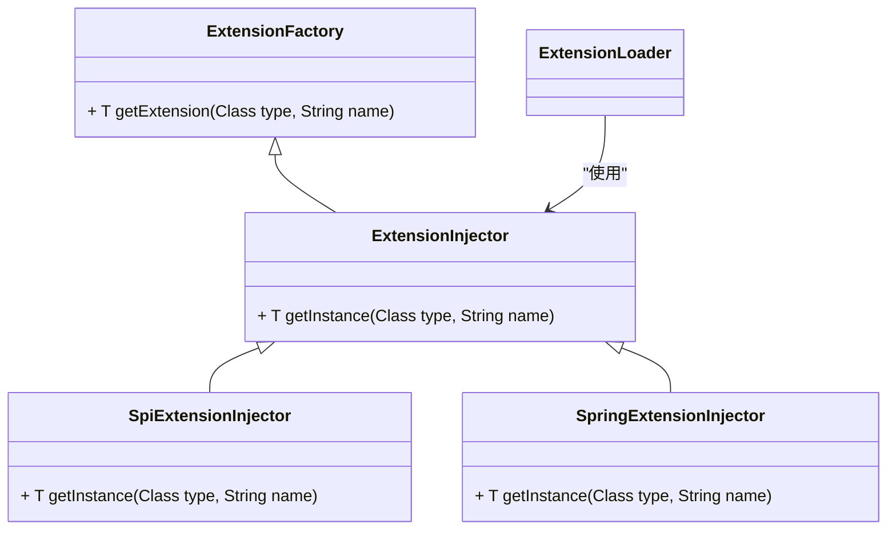
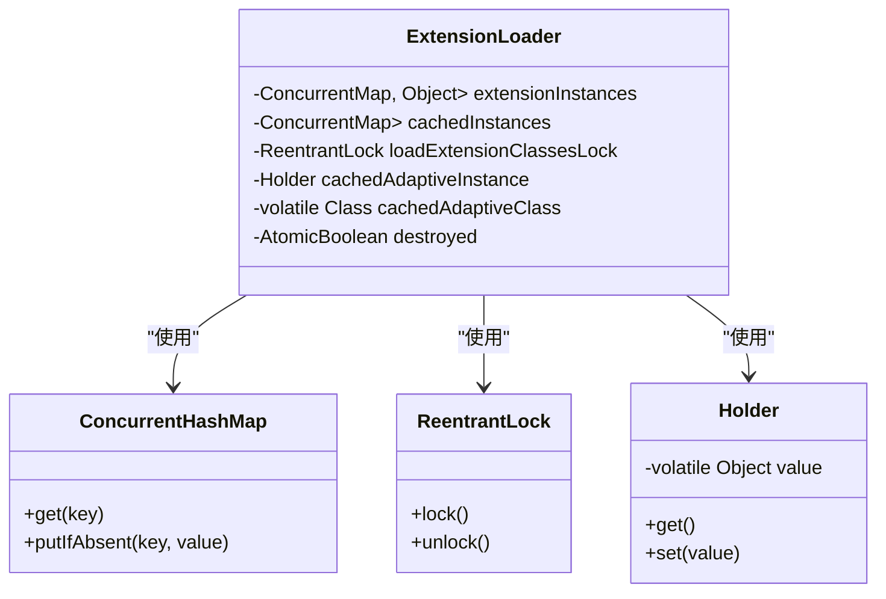

# 扩展加载机制

<cite>
**本文档中引用的文件**   
- [ExtensionLoader.java](file://dubbo-common\src\main\java\org\apache\dubbo\common\extension\ExtensionLoader.java)
- [SPI.java](file://dubbo-common\src\main\java\org\apache\dubbo\common\extension\SPI.java)
- [Adaptive.java](file://dubbo-common\src\main\java\org\apache\dubbo\common\extension\Adaptive.java)
- [Activate.java](file://dubbo-common\src\main\java\org\apache\dubbo\common\extension\Activate.java)
- [ExtensionFactory.java](file://dubbo-common\src\main\java\org\apache\dubbo\common\extension\ExtensionFactory.java)
- [LoadingStrategy.java](file://dubbo-common\src\main\java\org\apache\dubbo\common\extension\LoadingStrategy.java)
- [DubboInternalLoadingStrategy.java](file://dubbo-common\src\main\java\org\apache\dubbo\common\extension\DubboInternalLoadingStrategy.java)
- [DubboLoadingStrategy.java](file://dubbo-common\src\main\java\org\apache\dubbo\common\extension\DubboLoadingStrategy.java)
</cite>

## 目录
1. [引言](#引言)
2. [扩展加载机制概述](#扩展加载机制概述)
3. [SPI注解与扩展点接口](#spi注解与扩展点接口)
4. [ExtensionLoader核心实现](#extensionloader核心实现)
5. [扩展加载策略](#扩展加载策略)
6. [扩展实例的创建与缓存](#扩展实例的创建与缓存)
7. [自适应扩展机制](#自适应扩展机制)
8. [激活扩展机制](#激活扩展机制)
9. [扩展工厂与依赖注入](#扩展工厂与依赖注入)
10. [线程安全与性能优化](#线程安全与性能优化)
11. [最佳实践与配置规范](#最佳实践与配置规范)

## 引言
Dubbo的扩展加载机制是其核心设计之一，基于SPI（Service Provider Interface）思想实现了高度可扩展的架构。该机制允许开发者通过简单的配置文件定义和接口约定，动态地发现、加载和管理各种扩展实现。本文将深入剖析ExtensionLoader类的实现原理，详细解释扩展加载的全过程，包括配置文件读取、实例创建、缓存管理、生命周期控制以及线程安全设计等关键环节。

## 扩展加载机制概述
Dubbo的扩展加载机制是一种基于Java SPI思想的增强实现，它通过ExtensionLoader类为核心，实现了对扩展点的动态发现和加载。与传统的Java SPI不同，Dubbo的SPI机制支持更丰富的功能，包括基于名称的扩展查找、默认扩展指定、自适应扩展生成、扩展激活条件控制等。

该机制的主要特点包括：
- 支持从多个目录（META-INF/dubbo、META-INF/dubbo/internal、META-INF/services）加载扩展配置
- 提供扩展实例的缓存机制，避免重复创建
- 支持扩展的包装（Wrapper）和依赖注入（IOC）
- 实现了自适应扩展（Adaptive Extension）的动态生成
- 提供了基于条件的扩展激活机制（Activate）

**扩展加载机制概述**
- [ExtensionLoader.java](file://dubbo-common\src\main\java\org\apache\dubbo\common\extension\ExtensionLoader.java#L92-L141)

## SPI注解与扩展点接口
`@SPI`注解是Dubbo扩展机制的基石，用于标记一个接口为扩展点接口。该注解定义了扩展点的基本行为和属性，包括默认实现和作用域。

`@SPI`注解包含两个重要属性：
- `value()`：指定默认扩展名称。当未明确指定扩展时，将使用此名称对应的实现。
- `scope()`：定义扩展的作用域，包括FRAMEWORK、APPLICATION和MODULE三个级别，决定了扩展实例的生命周期和可见性范围。

只有被`@SPI`注解标记的接口才能被ExtensionLoader加载和管理。如果尝试获取未标记`@SPI`的接口的扩展加载器，将会抛出IllegalArgumentException异常。

**图源**
- [SPI.java](file://dubbo-common\src\main\java\org\apache\dubbo\common\extension\SPI.java#L134-L153)
- [ExtensionLoader.java](file://dubbo-common\src\main\java\org\apache\dubbo\common\extension\ExtensionLoader.java#L142-L800)

## ExtensionLoader核心实现
ExtensionLoader是Dubbo扩展加载机制的核心类，负责管理所有扩展点的加载、创建和缓存。每个扩展点接口都有一个对应的ExtensionLoader实例，通过静态方法`getExtensionLoader(Class<T> type)`获取。

ExtensionLoader的主要功能包括：
- 加载扩展实现类（getExtensionClasses）
- 创建和缓存扩展实例（cachedInstances）
- 管理自适应扩展实例（cachedAdaptiveInstance）
- 处理扩展的包装类（cachedWrapperClasses）
- 管理激活扩展的元数据（cachedActivates）

ExtensionLoader的构造是私有的，只能通过`getExtensionLoader`方法获取实例。该方法首先验证传入的类型参数：必须是非空的接口类型，并且必须被`@SPI`注解标记。

**图源**
- [ExtensionLoader.java](file://dubbo-common\src\main\java\org\apache\dubbo\common\extension\ExtensionLoader.java#L411-L413)

## 扩展加载策略
Dubbo通过LoadingStrategy接口定义了扩展加载的策略，支持从不同的目录加载扩展配置文件。系统内置了三种主要的加载策略：

1. **DubboInternalLoadingStrategy**：加载`META-INF/dubbo/internal/`目录下的配置文件，通常用于Dubbo内部核心扩展。
2. **DubboLoadingStrategy**：加载`META-INF/dubbo/`目录下的配置文件，用于用户自定义扩展。
3. **ServicesLoadingStrategy**：加载`META-INF/services/`目录下的配置文件，兼容Java标准SPI机制。

这些策略通过ServiceLoader机制加载，并按照优先级排序。加载策略的`directory()`方法返回对应的目录路径，`overridden()`方法指示是否允许覆盖其他策略加载的扩展。

**图源**
- [LoadingStrategy.java](file://dubbo-common\src\main\java\org\apache\dubbo\common\extension\LoadingStrategy.java#L25-L144)
- [DubboInternalLoadingStrategy.java](file://dubbo-common\src\main\java\org\apache\dubbo\common\extension\DubboInternalLoadingStrategy.java)
- [DubboLoadingStrategy.java](file://dubbo-common\src\main\java\org\apache\dubbo\common\extension\DubboLoadingStrategy.java)

## 扩展实例的创建与缓存
ExtensionLoader通过双重检查锁定模式（Double-Checked Locking）确保扩展类和实例的线程安全加载。扩展实例的创建和缓存是其性能优化的关键。

主要缓存结构包括：
- `cachedInstances`：ConcurrentMap<String, Holder<Object>>，缓存已创建的扩展实例
- `cachedClasses`：Holder<Map<String, Class<?>>>，缓存已加载的扩展类
- `cachedAdaptiveInstance`：Holder<Object>，缓存自适应扩展实例

当调用`getExtension(String name)`方法时，ExtensionLoader会先检查`cachedInstances`中是否已存在对应名称的实例。如果不存在，则通过双重检查锁定模式加载扩展类，创建实例，并放入缓存中。这种设计既保证了线程安全，又避免了不必要的同步开销。

**图源**
- [ExtensionLoader.java](file://dubbo-common\src\main\java\org\apache\dubbo\common\extension\ExtensionLoader.java#L745-L752)

## 自适应扩展机制
自适应扩展（Adaptive Extension）是Dubbo扩展机制的高级特性，允许在运行时根据URL参数动态选择具体的扩展实现。`@Adaptive`注解用于标记类或方法为自适应扩展。

当调用`getAdaptiveExtension()`方法时，ExtensionLoader会：
1. 如果已存在缓存的自适应类（cachedAdaptiveClass），则直接使用
2. 否则，动态生成一个代理类，该类根据URL中的参数值选择具体的扩展实现
3. 生成的代理类会被编译并加载，然后缓存起来供后续使用

对于方法级别的`@Adaptive`注解，只有被标记的方法会被代理，其他方法调用默认实现。`@Adaptive`注解的value属性指定了用于确定具体扩展的URL参数名称。

**图源**
- [Adaptive.java](file://dubbo-common\src\main\java\org\apache\dubbo\common\extension\Adaptive.java#L40-L79)
- [ExtensionLoader.java](file://dubbo-common\src\main\java\org\apache\dubbo\common\extension\ExtensionLoader.java#L1087-L1135)

## 激活扩展机制
激活扩展机制允许根据特定条件自动激活一组扩展实现。`@Activate`注解用于标记扩展类或方法为可激活的，支持基于组（group）和参数值（value）的激活条件。

`@Activate`注解的主要属性包括：
- `group()`：指定在哪些组条件下激活该扩展
- `value()`：指定URL中哪些参数存在时激活该扩展
- `order()`：指定激活顺序，数值越小优先级越高

通过`getActivateExtension(URL url, String key, String group)`方法，可以根据URL参数和组条件获取所有匹配的激活扩展。该机制常用于过滤器链、拦截器等需要根据配置动态选择组件的场景。

**图源**
- [Activate.java](file://dubbo-common\src\main\java\org\apache\dubbo\common\extension\Activate.java#L56-L139)
- [ExtensionLoader.java](file://dubbo-common\src\main\java\org\apache\dubbo\common\extension\ExtensionLoader.java#L574-L668)

## 扩展工厂与依赖注入
ExtensionFactory（现为ExtensionInjector）负责扩展实例的创建和依赖注入。它是Dubbo实现IOC（控制反转）的核心组件。

ExtensionFactory接口继承自ExtensionInjector，提供了`getExtension(Class<T> type, String name)`方法用于获取扩展实例。系统内置了多种ExtensionFactory实现，包括：
- SpiExtensionInjector：基于SPI机制的注入器
- SpringExtensionInjector：集成Spring容器的注入器

当创建扩展实例时，ExtensionLoader会通过ExtensionFactory获取实例，并自动注入其依赖的其他扩展。这种设计实现了组件间的松耦合，使得扩展可以方便地依赖其他扩展而无需关心其具体实现。

**图源**
- [ExtensionFactory.java](file://dubbo-common\src\main\java\org\apache\dubbo\common\extension\ExtensionFactory.java#L27-L47)
- [ExtensionLoader.java](file://dubbo-common\src\main\java\org\apache\dubbo\common\extension\ExtensionLoader.java#L171-L172)

## 线程安全与性能优化
ExtensionLoader在设计上充分考虑了线程安全和性能优化，采用了多种策略来确保在高并发环境下的高效运行。

主要的线程安全设计包括：
- 使用ConcurrentHashMap作为主要的缓存结构，保证并发访问的安全性
- 采用双重检查锁定模式加载扩展类，减少同步开销
- 使用ReentrantLock保护关键的加载操作，避免竞态条件

性能优化策略包括：
- 扩展类和实例的缓存，避免重复加载和创建
- SoftReference缓存URL列表，平衡内存使用和性能
- 预加载策略，提前加载常用的扩展
- 懒加载机制，只有在需要时才创建扩展实例

这些设计使得ExtensionLoader能够在保证线程安全的同时，提供高效的扩展加载性能，满足大规模分布式系统的需求。

**图源**
- [ExtensionLoader.java](file://dubbo-common\src\main\java\org\apache\dubbo\common\extension\ExtensionLoader.java#L161-L283)

## 最佳实践与配置规范
为了有效使用Dubbo的扩展加载机制，开发者应遵循以下最佳实践和配置规范：

**文件命名规范**：
- 配置文件应放置在`META-INF/dubbo/`或`META-INF/dubbo/internal/`目录下
- 文件名应为扩展点接口的全限定名，如`org.apache.dubbo.rpc.Protocol`
- 内部扩展应使用`META-INF/dubbo/internal/`目录

**配置格式**：
- 使用键值对格式：`name=implementation.class.name`
- 支持多行配置，每行一个扩展实现
- 键名应为小写字母和数字组成，使用点分隔，如`dubbo.protocol`

**错误处理**：
- 确保扩展实现类有公共无参构造函数
- 避免在静态块中引用可能不存在的第三方库
- 合理设置扩展的默认实现，避免运行时异常

**性能建议**：
- 尽量使用单例模式的扩展实现
- 避免在扩展的构造函数中执行耗时操作
- 合理使用自适应扩展，避免过度动态代理

遵循这些规范可以确保扩展机制的稳定运行，提高系统的可维护性和性能。

**最佳实践与配置规范**
- [ExtensionLoader.java](file://dubbo-common\src\main\java\org\apache\dubbo\common\extension\ExtensionLoader.java#L104-L145)
- [SPI.java](file://dubbo-common\src\main\java\org\apache\dubbo\common\extension\SPI.java#L104-L126)