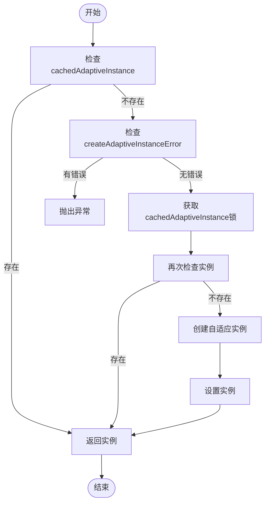
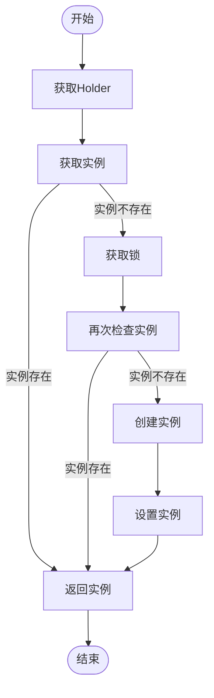

# 缓存管理机制

<cite>
**本文档引用文件**   
- [ExtensionLoader.java](file://dubbo-common\src\main\java\org\apache\dubbo\common\extension\ExtensionLoader.java)
- [ExtensionLoaderTest.java](file://dubbo-common\src\test\java\org\apache\dubbo\common\extension\ExtensionLoaderTest.java)
- [ExtensionLoader_Adaptive_Test.java](file://dubbo-common\src\test\java\org\apache\dubbo\common\extension\ExtensionLoader_Adaptive_Test.java)
- [SimpleExt.java](file://dubbo-common\src\test\java\org\apache\dubbo\common\extension\ext1\SimpleExt.java)
- [WrappedExt.java](file://dubbo-common\src\test\java\org\apache\dubbo\common\extension\ext6_wrap\WrappedExt.java)
- [Wrapper.java](file://dubbo-common\src\main\java\org\apache\dubbo\common\extension\Wrapper.java)
</cite>

## 目录
1. [引言](#引言)
2. [缓存存储结构](#缓存存储结构)
3. [线程安全设计](#线程安全设计)
4. [缓存生命周期管理](#缓存生命周期管理)
5. [性能优化与监控](#性能优化与监控)
6. [总结](#总结)

## 引言

Dubbo扩展机制中的缓存管理是其高性能的核心组成部分。`ExtensionLoader`作为Dubbo SPI（Service Provider Interface）扩展点加载机制的核心实现类，通过精心设计的缓存策略来管理已加载的扩展类和实例。该机制不仅提高了扩展加载的效率，还确保了在高并发环境下的线程安全性。

`ExtensionLoader`主要通过三种缓存来管理扩展：类缓存、实例缓存和自适应扩展缓存。这些缓存共同构成了一个高效的扩展加载体系，使得Dubbo能够在运行时快速获取所需的扩展实现，而无需重复解析和实例化。

**Section sources**
- [ExtensionLoader.java](file://dubbo-common\src\main\java\org\apache\dubbo\common\extension\ExtensionLoader.java#L92-L141)

## 缓存存储结构

### 类缓存

类缓存用于存储已加载的扩展类，避免重复的类加载和解析操作。`ExtensionLoader`使用`ConcurrentHashMap`来存储扩展类，其中键为扩展名称，值为对应的类对象。

```java
private final ConcurrentMap<Class<?>, String> cachedNames = new ConcurrentHashMap<>();
private final Holder<Map<String, Class<?>>> cachedClasses = new Holder<>();
```

类缓存的主要特点包括：
- **线程安全**：使用`ConcurrentHashMap`保证并发访问的安全性
- **延迟加载**：通过`Holder`模式实现类的延迟加载
- **双重检查**：在加载扩展类时使用双重检查锁定模式

类缓存的访问流程如下：
1. 首先检查`cachedClasses`是否已存在
2. 如果不存在，则获取`loadExtensionClassesLock`锁
3. 再次检查`cachedClasses`是否存在（双重检查）
4. 如果仍不存在，则加载扩展类并存入缓存

**Section sources**
- [ExtensionLoader.java](file://dubbo-common\src\main\java\org\apache\dubbo\common\extension\ExtensionLoader.java#L176-L185)

### 实例缓存

实例缓存用于存储已创建的扩展实例，避免重复的实例化操作。`ExtensionLoader`使用多个缓存结构来管理不同类型的实例。

```java
private final ConcurrentMap<Class<?>, Object> extensionInstances = new ConcurrentHashMap<>(64);
private final ConcurrentMap<String, Holder<Object>> cachedInstances = new ConcurrentHashMap<>();
```

实例缓存分为两种类型：
1. **类实例缓存**：以类对象为键，存储单例实例
2. **名称实例缓存**：以扩展名称为键，存储命名实例

实例缓存的访问流程如下：
1. 通过`getOrCreateHolder(name)`获取或创建`Holder`
2. 检查`Holder`中是否已有实例
3. 如果没有，则在同步块中创建实例并存入`Holder`

**Section sources**
- [ExtensionLoader.java](file://dubbo-common\src\main\java\org\apache\dubbo\common\extension\ExtensionLoader.java#L161-L162)

### 自适应扩展缓存

自适应扩展缓存用于存储自适应扩展实例，这是Dubbo SPI机制中的一个重要特性。自适应扩展可以根据运行时参数动态选择具体的实现。

```java
private final Holder<Object> cachedAdaptiveInstance = new Holder<>();
private volatile Class<?> cachedAdaptiveClass = null;
private volatile Throwable createAdaptiveInstanceError;
```

自适应扩展缓存的特点包括：
- **单例模式**：每个扩展类型只有一个自适应实例
- **错误缓存**：缓存创建自适应实例时的错误，避免重复尝试
- **双重检查**：在创建自适应实例时使用双重检查锁定模式

自适应扩展的创建流程如下：
1. 检查`cachedAdaptiveInstance`是否已有实例
2. 如果没有，则检查`createAdaptiveInstanceError`是否有错误
3. 获取`cachedAdaptiveInstance`锁
4. 再次检查实例是否存在（双重检查）
5. 创建自适应实例并存入缓存



**Diagram sources **
- [ExtensionLoader.java](file://dubbo-common\src\main\java\org\apache\dubbo\common\extension\ExtensionLoader.java#L206-L218)

## 线程安全设计

### ConcurrentHashMap的应用

`ExtensionLoader`广泛使用`ConcurrentHashMap`来保证缓存的线程安全性。`ConcurrentHashMap`是一种线程安全的哈希表实现，它通过分段锁机制来提高并发性能。

```java
private final ConcurrentMap<Class<?>, Object> extensionInstances = new ConcurrentHashMap<>(64);
private final ConcurrentMap<Class<?>, String> cachedNames = new ConcurrentHashMap<>();
private final ConcurrentMap<String, Holder<Object>> cachedInstances = new ConcurrentHashMap<>();
```

`ConcurrentHashMap`的优势包括：
- **高并发性能**：相比`synchronized`关键字，`ConcurrentHashMap`提供了更好的并发性能
- **无锁读取**：读操作不需要加锁，提高了读取性能
- **分段锁**：写操作只锁定部分数据，减少了锁竞争

**Section sources**
- [ExtensionLoader.java](file://dubbo-common\src\main\java\org\apache\dubbo\common\extension\ExtensionLoader.java#L161-L162)

### 双重检查锁定模式

双重检查锁定模式（Double-Checked Locking Pattern）是`ExtensionLoader`中保证线程安全的重要设计。该模式通过两次检查来减少同步块的执行频率，从而提高性能。

```java
public T getExtension(String name, boolean wrap) {
    final Holder<Object> holder = getOrCreateHolder(cacheKey);
    Object instance = holder.get();
    if (instance == null) {
        synchronized (holder) {
            instance = holder.get();
            if (instance == null) {
                instance = createExtension(name, wrap);
                holder.set(instance);
            }
        }
    }
    return (T) instance;
}
```

双重检查锁定模式的工作流程：
1. 第一次检查：在同步块外检查实例是否存在
2. 获取锁：如果实例不存在，则获取同步锁
3. 第二次检查：在同步块内再次检查实例是否存在
4. 创建实例：如果实例仍不存在，则创建实例并存入缓存

这种模式的优势在于：
- **减少锁竞争**：大多数情况下，实例已存在，无需进入同步块
- **保证线程安全**：在创建实例时使用同步块，确保只有一个线程能创建实例
- **提高性能**：避免了不必要的同步操作



**Diagram sources **
- [ExtensionLoader.java](file://dubbo-common\src\main\java\org\apache\dubbo\common\extension\ExtensionLoader.java#L813-L822)

## 缓存生命周期管理

### 缓存初始化

缓存的初始化主要在`getExtensionClasses()`方法中完成。该方法使用懒加载模式，在首次需要扩展类时才进行加载。

```java
private Map<String, Class<?>> getExtensionClasses() {
    Map<String, Class<?>> classes = cachedClasses.get();
    if (classes == null) {
        loadExtensionClassesLock.lock();
        try {
            classes = cachedClasses.get();
            if (classes == null) {
                classes = loadExtensionClasses();
                cachedClasses.set(classes);
            }
        } finally {
            loadExtensionClassesLock.unlock();
        }
    }
    return classes;
}
```

缓存初始化的特点：
- **懒加载**：只有在首次使用时才加载扩展类
- **线程安全**：使用`ReentrantLock`保证初始化过程的线程安全
- **一次性加载**：扩展类只加载一次，后续直接从缓存获取

**Section sources**
- [ExtensionLoader.java](file://dubbo-common\src\main\java\org\apache\dubbo\common\extension\ExtensionLoader.java#L1250-L1275)

### 缓存更新

缓存更新主要通过`addExtension`和`replaceExtension`方法实现。这些方法允许在运行时动态添加或替换扩展。

```java
public void addExtension(String name, Class<?> clazz) {
    getExtensionClasses(); // load classes
    if (!type.isAssignableFrom(clazz)) {
        throw new IllegalStateException("Input type " + clazz + " doesn't implement the Extension " + type);
    }
    if (clazz.isInterface()) {
        throw new IllegalStateException("Input type " + clazz + " can't be interface!");
    }
    if (!clazz.isAnnotationPresent(Adaptive.class)) {
        cachedNames.put(clazz, name);
        cachedClasses.get().put(name, clazz);
    } else {
        cachedAdaptiveClass = clazz;
    }
}
```

缓存更新的注意事项：
- **类型检查**：确保添加的类实现了扩展接口
- **接口检查**：不允许添加接口作为扩展实现
- **自适应类特殊处理**：自适应类有专门的缓存字段

**Section sources**
- [ExtensionLoader.java](file://dubbo-common\src\main\java\org\apache\dubbo\common\extension\ExtensionLoader.java#L931-L958)

### 缓存销毁

缓存销毁在`destroy()`方法中完成。该方法会清理所有缓存的实例，并调用`Disposable`接口的`destroy()`方法进行资源释放。

```java
public void destroy() {
    if (!destroyed.compareAndSet(false, true)) {
        return;
    }
    // 销毁原始扩展实例
    extensionInstances.forEach((type, instance) -> {
        if (instance instanceof Disposable) {
            Disposable disposable = (Disposable) instance;
            try {
                disposable.destroy();
            } catch (Exception e) {
                logger.error(COMMON_ERROR_LOAD_EXTENSION, "", "", "Error destroying extension " + disposable, e);
            }
        }
    });
    extensionInstances.clear();
    // 销毁包装的扩展实例
    for (Holder<Object> holder : cachedInstances.values()) {
        Object wrappedInstance = holder.get();
        if (wrappedInstance instanceof Disposable) {
            Disposable disposable = (Disposable) wrappedInstance;
            try {
                disposable.destroy();
            } catch (Exception e) {
                logger.error(COMMON_ERROR_LOAD_EXTENSION, "", "", "Error destroying extension " + disposable, e);
            }
        }
    }
    cachedInstances.clear();
}
```

缓存销毁的特点：
- **幂等性**：使用`AtomicBoolean`确保销毁操作只执行一次
- **资源释放**：调用`Disposable`接口释放资源
- **全面清理**：清理所有类型的缓存实例

**Section sources**
- [ExtensionLoader.java](file://dubbo-common\src\main\java\org\apache\dubbo\common\extension\ExtensionLoader.java#L427-L457)

## 性能优化与监控

### 性能优化建议

1. **合理使用缓存**：充分利用`ExtensionLoader`的缓存机制，避免重复创建实例
2. **减少锁竞争**：通过双重检查锁定模式减少同步块的执行频率
3. **懒加载策略**：只有在需要时才加载扩展类，减少启动时间
4. **避免频繁更新**：尽量减少运行时的扩展更新操作

### 内存使用监控

可以通过以下方式监控缓存的内存使用情况：

1. **监控缓存大小**：
```java
int classCacheSize = cachedClasses.get().size();
int instanceCacheSize = cachedInstances.size();
```

2. **监控缓存命中率**：
```java
// 可以通过统计创建实例的次数来估算缓存命中率
```

3. **内存泄漏检测**：
- 定期检查`extensionInstances`和`cachedInstances`的大小
- 确保在应用关闭时正确调用`destroy()`方法
- 监控`ConcurrentHashMap`的内存占用

**Section sources**
- [ExtensionLoader.java](file://dubbo-common\src\main\java\org\apache\dubbo\common\extension\ExtensionLoader.java#L161-L206)

## 总结

Dubbo扩展机制中的缓存管理策略通过精心设计的多层缓存结构，实现了高性能和线程安全的扩展加载。`ExtensionLoader`使用`ConcurrentHashMap`和双重检查锁定模式，确保了在高并发环境下的稳定运行。

缓存机制的核心优势包括：
- **高性能**：通过缓存避免重复的类加载和实例化操作
- **线程安全**：使用`ConcurrentHashMap`和双重检查锁定模式保证并发安全
- **灵活管理**：支持运行时的扩展添加、替换和销毁
- **资源释放**：提供完整的生命周期管理，确保资源正确释放

开发者在使用Dubbo扩展机制时，应充分理解这些缓存策略，合理利用缓存优势，同时注意内存使用和性能监控，以构建高效稳定的分布式应用。

[无来源，此部分为总结性内容]