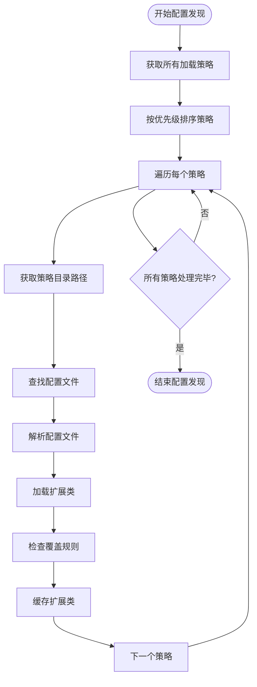
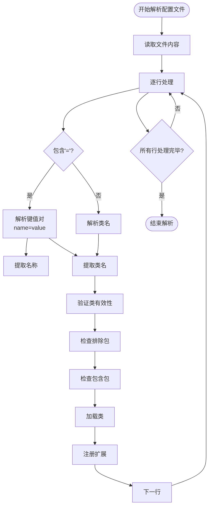
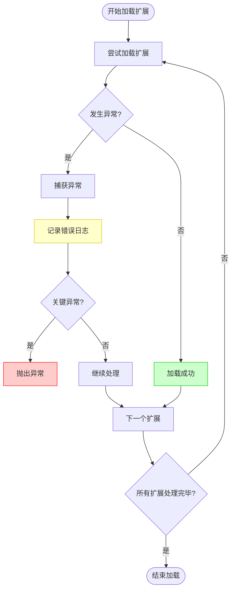
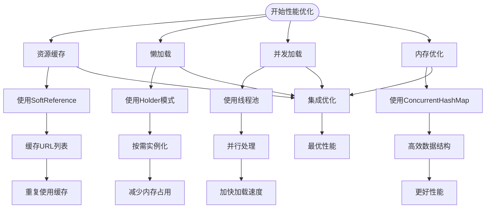
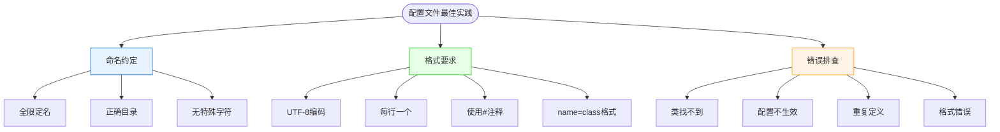

# 配置发现机制

<cite>
**本文档引用的文件**   
- [ExtensionLoader.java](file://dubbo-common\src\main\java\org\apache\dubbo\common\extension\ExtensionLoader.java)
- [DubboInternalLoadingStrategy.java](file://dubbo-common\src\main\java\org\apache\dubbo\common\extension\DubboInternalLoadingStrategy.java)
- [DubboLoadingStrategy.java](file://dubbo-common\src\main\java\org\apache\dubbo\common\extension\DubboLoadingStrategy.java)
- [ServicesLoadingStrategy.java](file://dubbo-common\src\main\java\org\apache\dubbo\common\extension\ServicesLoadingStrategy.java)
- [LoadingStrategy.java](file://dubbo-common\src\main\java\org\apache\dubbo\common\extension\LoadingStrategy.java)
- [ClassLoaderResourceLoader.java](file://dubbo-common\src\main\java\org\apache\dubbo\common\utils\ClassLoaderResourceLoader.java)
</cite>

## 目录
1. [引言](#引言)
2. [配置发现过程](#配置发现过程)
3. [加载策略与优先级](#加载策略与优先级)
4. [配置文件解析机制](#配置文件解析机制)
5. [异常处理机制](#异常处理机制)
6. [性能优化策略](#性能优化策略)
7. [配置文件编写最佳实践](#配置文件编写最佳实践)
8. [总结](#总结)

## 引言
Dubbo扩展机制中的配置发现过程是其SPI（Service Provider Interface）体系的核心组成部分。该机制通过ExtensionLoader类实现，负责扫描和加载META-INF/dubbo、META-INF/dubbo/internal等目录下的配置文件，从而实现扩展点的动态发现和加载。本文将详细阐述这一过程，包括配置文件的扫描、解析、加载顺序、优先级规则以及异常处理和性能优化策略。

## 配置发现过程

Dubbo的配置发现过程主要由ExtensionLoader类负责，通过多种加载策略实现扩展点的发现和加载。ExtensionLoader首先获取所有注册的LoadingStrategy实例，然后按照优先级顺序依次执行这些策略来发现扩展实现。

配置发现的核心流程如下：
1. ExtensionLoader获取所有注册的LoadingStrategy实例
2. 按照优先级从高到低的顺序遍历每个策略
3. 每个策略定义了特定的目录路径（如META-INF/dubbo/internal/、META-INF/dubbo/等）
4. 在指定目录下查找与扩展接口同名的配置文件
5. 解析配置文件中的键值对，加载对应的扩展实现类



**图源**
- [ExtensionLoader.java](file://dubbo-common\src\main\java\org\apache\dubbo\common\extension\ExtensionLoader.java#L1288-L1295)
- [LoadingStrategy.java](file://dubbo-common\src\main\java\org\apache\dubbo\common\extension\LoadingStrategy.java#L25-L35)

**本节源**
- [ExtensionLoader.java](file://dubbo-common\src\main\java\org\apache\dubbo\common\extension\ExtensionLoader.java#L1282-L1297)
- [LoadingStrategy.java](file://dubbo-common\src\main\java\org\apache\dubbo\common\extension\LoadingStrategy.java#L25-L35)

## 加载策略与优先级

Dubbo定义了多种加载策略，每种策略都有不同的优先级和目录路径。这些策略通过实现LoadingStrategy接口来定义，主要策略包括：

1. **DubboInternalLoadingStrategy**：优先级最高，负责加载META-INF/dubbo/internal/目录下的内部扩展
2. **DubboExternalLoadingStrategy**：优先级次高，负责加载外部扩展
3. **DubboLoadingStrategy**：优先级中等，负责加载META-INF/dubbo/目录下的标准扩展
4. **ServicesLoadingStrategy**：优先级最低，负责加载标准的META-INF/services/目录下的扩展

加载策略的优先级决定了配置文件的加载顺序，高优先级策略的配置可以覆盖低优先级策略的配置。这种设计使得Dubbo能够灵活地管理不同来源的扩展配置。

```mermaid
classDiagram
class LoadingStrategy {
<<interface>>
+String directory()
+boolean preferExtensionClassLoader()
+String[] excludedPackages()
+String[] includedPackages()
+boolean overridden()
+int getPriority()
+String getName()
}
class DubboInternalLoadingStrategy {
+String directory()
+int getPriority()
+String getName()
}
class DubboLoadingStrategy {
+String directory()
+int getPriority()
}
class ServicesLoadingStrategy {
+String directory()
+int getPriority()
}
class DubboExternalLoadingStrategy {
+String directory()
+boolean overridden()
+int getPriority()
}
LoadingStrategy <|-- DubboInternalLoadingStrategy
LoadingStrategy <|-- DubboLoadingStrategy
LoadingStrategy <|-- ServicesLoadingStrategy
LoadingStrategy <|-- DubboExternalLoadingStrategy
note right of DubboInternalLoadingStrategy
优先级 : MAX_PRIORITY
目录 : META-INF/dubbo/internal/
end note
note right of DubboLoadingStrategy
优先级 : NORMAL_PRIORITY
目录 : META-INF/dubbo/
end note
note right of ServicesLoadingStrategy
优先级 : MIN_PRIORITY
目录 : META-INF/services/
end note
```

**图源**
- [DubboInternalLoadingStrategy.java](file://dubbo-common\src\main\java\org\apache\dubbo\common\extension\DubboInternalLoadingStrategy.java#L25-L65)
- [DubboLoadingStrategy.java](file://dubbo-common\src\main\java\org\apache\dubbo\common\extension\DubboLoadingStrategy.java#L25-L38)
- [ServicesLoadingStrategy.java](file://dubbo-common\src\main\java\org\apache\dubbo\common\extension\ServicesLoadingStrategy.java#L25-L38)
- [LoadingStrategy.java](file://dubbo-common\src\main\java\org\apache\dubbo\common\extension\LoadingStrategy.java#L25-L143)

**本节源**
- [DubboInternalLoadingStrategy.java](file://dubbo-common\src\main\java\org\apache\dubbo\common\extension\DubboInternalLoadingStrategy.java#L25-L65)
- [DubboLoadingStrategy.java](file://dubbo-common\src\main\java\org\apache\dubbo\common\extension\DubboLoadingStrategy.java#L25-L38)
- [ServicesLoadingStrategy.java](file://dubbo-common\src\main\java\org\apache\dubbo\common\extension\ServicesLoadingStrategy.java#L25-L38)

## 配置文件解析机制

Dubbo的配置文件采用标准的Java属性文件格式，即键值对形式。配置文件的命名规范为扩展接口的全限定名，如org.apache.dubbo.rpc.Filter。文件内容由多行组成，每行可以是简单的类名，也可以是name=class形式的键值对。

配置文件解析过程包括以下步骤：
1. 读取配置文件内容，去除注释和空白行
2. 按行解析每一行内容
3. 判断是否包含等号分隔符，以确定是简单类名还是键值对
4. 对于键值对，提取名称和类名
5. 验证类名的有效性，确保其为扩展接口的实现类
6. 根据覆盖规则决定是否加载该扩展



**图源**
- [ExtensionLoader.java](file://dubbo-common\src\main\java\org\apache\dubbo\common\extension\ExtensionLoader.java#L1442-L1475)
- [ClassLoaderResourceLoader.java](file://dubbo-common\src\main\java\org\apache\dubbo\common\utils\ClassLoaderResourceLoader.java#L62-L98)

**本节源**
- [ExtensionLoader.java](file://dubbo-common\src\main\java\org\apache\dubbo\common\extension\ExtensionLoader.java#L1442-L1475)
- [ClassLoaderResourceLoader.java](file://dubbo-common\src\main\java\org\apache\dubbo\common\utils\ClassLoaderResourceLoader.java#L62-L98)

## 异常处理机制

Dubbo在配置发现过程中实现了完善的异常处理机制，确保在配置文件存在问题时系统仍能正常运行。异常处理主要体现在以下几个方面：

1. **文件读取异常**：当无法读取配置文件时，系统会记录错误日志但不会中断整个加载过程
2. **类加载异常**：当指定的类无法加载时，会捕获ClassNotFoundException等异常，记录详细信息并继续处理其他配置
3. **配置冲突处理**：当同一名称的扩展被多次定义时，根据覆盖规则决定是否抛出异常
4. **无效配置处理**：对于格式错误或无效的配置行，系统会记录警告并跳过该行

异常处理的核心原则是"失败静默"（fail-silently），即单个配置项的错误不应影响整个系统的启动和运行。同时，系统会通过日志记录详细的错误信息，便于问题排查。



**图源**
- [ExtensionLoader.java](file://dubbo-common\src\main\java\org\apache\dubbo\common\extension\ExtensionLoader.java#L1468-L1474)
- [ExtensionLoader.java](file://dubbo-common\src\main\java\org\apache\dubbo\common\extension\ExtensionLoader.java#L1402-L1408)

**本节源**
- [ExtensionLoader.java](file://dubbo-common\src\main\java\org\apache\dubbo\common\extension\ExtensionLoader.java#L1402-L1484)

## 性能优化策略

Dubbo在配置发现过程中采用了多种性能优化策略，以提高系统启动速度和运行效率：

1. **资源缓存**：使用SoftReference缓存URL列表和配置内容，减少重复的文件读取操作
2. **懒加载**：扩展实例的创建采用懒加载模式，只有在首次使用时才进行实例化
3. **并发加载**：利用线程池并发加载不同类加载器下的资源，提高加载效率
4. **内存优化**：使用ConcurrentHashMap等高效数据结构存储扩展类和实例

资源缓存机制特别重要，它通过ClassLoaderResourceLoader类实现，为每个类加载器和文件名组合缓存已加载的URL集合，避免了重复的类路径扫描。



**图源**
- [ClassLoaderResourceLoader.java](file://dubbo-common\src\main\java\org\apache\dubbo\common\utils\ClassLoaderResourceLoader.java#L41-L42)
- [ExtensionLoader.java](file://dubbo-common\src\main\java\org\apache\dubbo\common\extension\ExtensionLoader.java#L242-L243)
- [ExtensionLoader.java](file://dubbo-common\src\main\java\org\apache\dubbo\common\extension\ExtensionLoader.java#L201-L205)

**本节源**
- [ClassLoaderResourceLoader.java](file://dubbo-common\src\main\java\org\apache\dubbo\common\utils\ClassLoaderResourceLoader.java#L41-L104)
- [ExtensionLoader.java](file://dubbo-common\src\main\java\org\apache\dubbo\common\extension\ExtensionLoader.java#L242-L243)

## 配置文件编写最佳实践

为了确保Dubbo扩展配置的正确性和可维护性，建议遵循以下最佳实践：

### 命名约定
- 配置文件名应为扩展接口的全限定名
- 文件应放置在正确的目录下（internal、dubbo或services）
- 避免使用特殊字符和空格

### 格式要求
- 使用UTF-8编码
- 每行一个扩展定义
- 使用#号添加注释
- 键值对使用name=class格式

### 常见错误排查
- **类找不到**：检查类路径和包名是否正确
- **配置不生效**：检查加载策略优先级和覆盖规则
- **重复定义**：避免同一名称的扩展在多个配置文件中定义
- **格式错误**：确保等号两侧没有多余空格



**图源**
- [ExtensionLoader.java](file://dubbo-common\src\main\java\org\apache\dubbo\common\extension\ExtensionLoader.java#L1343-L1344)
- [ExtensionLoader.java](file://dubbo-common\src\main\java\org\apache\dubbo\common\extension\ExtensionLoader.java#L1448-L1454)

**本节源**
- [ExtensionLoader.java](file://dubbo-common\src\main\java\org\apache\dubbo\common\extension\ExtensionLoader.java#L1343-L1344)
- [ExtensionLoader.java](file://dubbo-common\src\main\java\org\apache\dubbo\common\extension\ExtensionLoader.java#L1448-L1454)

## 总结
Dubbo的配置发现机制通过ExtensionLoader和多种LoadingStrategy的协同工作，实现了灵活、高效和可靠的扩展点管理。该机制支持多级目录扫描、优先级排序、覆盖规则和异常处理，确保了系统的稳定性和可扩展性。通过资源缓存和懒加载等性能优化策略，有效提升了系统启动速度和运行效率。理解这一机制对于正确使用和扩展Dubbo功能至关重要。