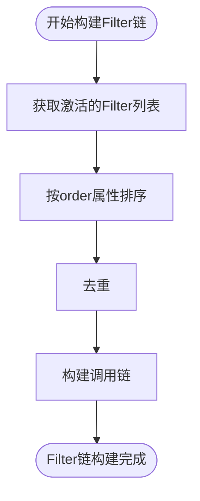
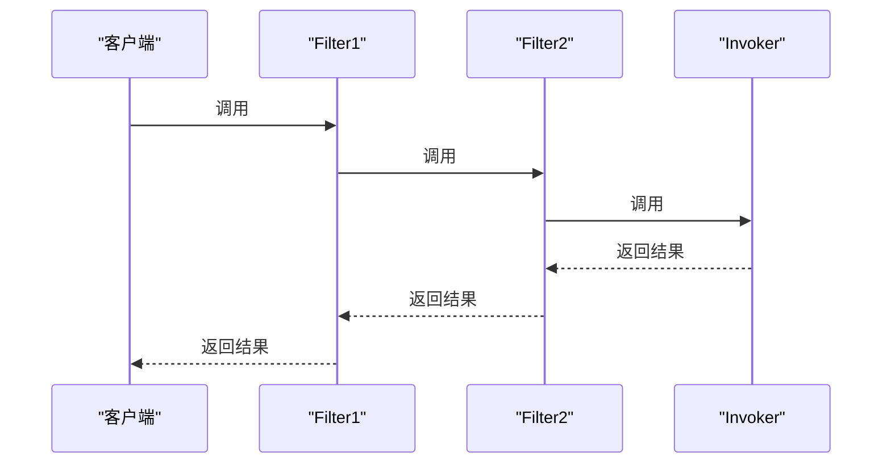
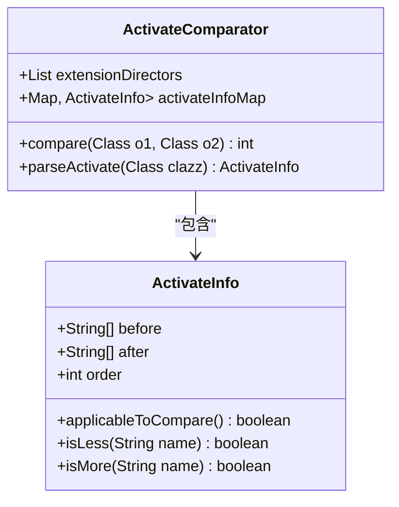
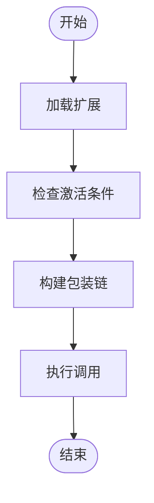

# 包装与激活的集成应用

<cite>
**本文档引用的文件**   
- [DefaultFilterChainBuilder.java](file://dubbo-cluster\src\main\java\org\apache\dubbo\rpc\cluster\filter\DefaultFilterChainBuilder.java)
- [ExtensionLoader.java](file://dubbo-common\src\main\java\org\apache\dubbo\common\extension\ExtensionLoader.java)
- [Activate.java](file://dubbo-common\src\main\java\org\apache\dubbo\common\extension\Activate.java)
- [ActivateComparator.java](file://dubbo-common\src\main\java\org\apache\dubbo\common\extension\support\ActivateComparator.java)
- [Filter.java](file://dubbo-rpc\dubbo-rpc-api\src\main\java\org\apache\dubbo\rpc\Filter.java)
- [EchoFilter.java](file://dubbo-rpc\dubbo-rpc-api\src\main\java\org\apache\dubbo\rpc\filter\EchoFilter.java)
</cite>

## 目录
1. [引言](#引言)
2. [扩展包装与激活机制概述](#扩展包装与激活机制概述)
3. [Filter链的构建与执行过程](#filter链的构建与执行过程)
4. [包装链的构建顺序分析](#包装链的构建顺序分析)
5. [Activate注解的order属性与激活条件](#activate注解的order属性与激活条件)
6. [包装类在调用链中的作用](#包装类在调用链中的作用)
7. [集成应用代码示例](#集成应用代码示例)
8. [最佳实践与设计建议](#最佳实践与设计建议)
9. [结论](#结论)

## 引言
Dubbo作为一款高性能的Java RPC框架，其扩展机制是其灵活性和可定制性的核心。其中，扩展包装（Wrapper）与自动激活（Activate）机制的集成应用，为开发者提供了强大的功能扩展能力。本文将深入讲解这两种机制的集成应用，详细说明在实际场景中如何结合使用包装和激活机制，如Filter链的构建和执行过程。

## 扩展包装与激活机制概述
Dubbo的扩展机制基于SPI（Service Provider Interface）实现，允许开发者通过配置文件或注解的方式，动态加载和激活扩展组件。扩展包装机制允许一个扩展类包装另一个扩展类，从而在不修改原有代码的情况下，增加新的功能。自动激活机制则通过`@Activate`注解，根据特定条件自动激活相应的扩展。

**扩展包装机制**的核心在于，一个扩展类可以通过构造函数接收另一个扩展类的实例，从而在其基础上添加新的逻辑。这种机制类似于装饰器模式，允许功能的层层叠加。

**自动激活机制**则通过`@Activate`注解，指定扩展的激活条件。当满足这些条件时，Dubbo框架会自动加载并激活相应的扩展。激活条件可以是URL参数、组别等，这使得扩展的激活更加灵活和可控。

## Filter链的构建与执行过程
在Dubbo中，Filter链是扩展机制的一个典型应用。Filter链的构建和执行过程充分体现了包装与激活机制的集成。

### Filter链的构建
Filter链的构建主要通过`DefaultFilterChainBuilder`类的`buildInvokerChain`方法实现。该方法首先根据URL中的参数，获取需要激活的Filter列表。然后，按照一定的顺序，将这些Filter包装成一个调用链。



**图源**
- [DefaultFilterChainBuilder.java](file://dubbo-cluster\src\main\java\org\apache\dubbo\rpc\cluster\filter\DefaultFilterChainBuilder.java#L44-L77)

### Filter链的执行
Filter链的执行过程是一个典型的递归调用。每个Filter在执行自己的逻辑后，会调用下一个Filter，直到最后一个Filter执行完毕，再逐层返回结果。



**图源**
- [Filter.java](file://dubbo-rpc\dubbo-rpc-api\src\main\java\org\apache\dubbo\rpc\Filter.java#L33-L34)

## 包装链的构建顺序分析
包装链的构建顺序是确保功能正确执行的关键。Dubbo通过`ActivateComparator`类来确定扩展的激活顺序。

### 激活顺序的确定
`ActivateComparator`类实现了`Comparator`接口，用于比较两个扩展类的激活顺序。比较的依据主要是`@Activate`注解中的`order`属性。`order`值越小，优先级越高，越先被激活。



**图源**
- [ActivateComparator.java](file://dubbo-common\src\main\java\org\apache\dubbo\common\extension\support\ActivateComparator.java#L38-L187)

### 包装链的构建
在确定了激活顺序后，Dubbo会按照这个顺序，将Filter逐个包装到调用链中。包装的过程是逆序的，即先包装order值较大的Filter，再包装order值较小的Filter。这样可以确保order值较小的Filter最先执行。

## Activate注解的order属性与激活条件
`@Activate`注解是Dubbo自动激活机制的核心。它通过`order`属性和激活条件，精确控制扩展的激活行为。

### order属性
`order`属性用于指定扩展的激活顺序。`order`值越小，优先级越高。例如，`EchoFilter`的`order`值为-110000，这意味着它会在大多数Filter之前执行。

```java
@Activate(group = CommonConstants.PROVIDER, order = -110000)
public class EchoFilter implements Filter {
    // ...
}
```

**节源**
- [EchoFilter.java](file://dubbo-rpc\dubbo-rpc-api\src\main\java\org\apache\dubbo\rpc\filter\EchoFilter.java#L33-L43)

### 激活条件
激活条件通过`group`和`value`属性指定。`group`属性指定扩展所属的组别，`value`属性指定URL参数中的键。只有当URL参数中包含指定的键时，扩展才会被激活。

```java
@Activate(group = {CONSUMER, PROVIDER}, value = "token")
public class TokenFilter implements Filter {
    // ...
}
```

**节源**
- [Activate.java](file://dubbo-common\src\main\java\org\apache\dubbo\common\extension\Activate.java#L52-L138)

## 包装类在调用链中的作用
包装类在调用链中扮演着至关重要的角色。它们不仅能够添加新的功能，还能够修改或增强原有功能的行为。

### 功能增强
包装类可以在不修改原有代码的情况下，为调用链添加新的功能。例如，`CacheFilter`可以在调用实际服务之前，检查缓存中是否存在结果，从而提高性能。

### 行为修改
包装类还可以修改原有功能的行为。例如，`ValidationFilter`可以在调用服务之前，对参数进行验证，确保输入的合法性。

## 集成应用代码示例
以下是一个集成应用的代码示例，展示了从扩展加载、激活判断到包装链构建的完整流程。



**图源**
- [DefaultFilterChainBuilder.java](file://dubbo-cluster\src\main\java\org\apache\dubbo\rpc\cluster\filter\DefaultFilterChainBuilder.java#L44-L77)

## 最佳实践与设计建议
在设计和使用扩展包装与激活机制时，应遵循以下最佳实践：

### 避免包装链过长
过长的包装链会导致性能下降和调试困难。应尽量减少不必要的包装，确保每个包装都有明确的目的。

### 避免激活冲突
多个扩展可能具有相同的激活条件，导致冲突。应合理设计激活条件，确保每个扩展的激活是唯一的。

### 合理设计扩展体系
扩展体系应具有良好的层次结构，避免功能重叠。每个扩展应专注于单一职责，确保系统的可维护性。

## 结论
Dubbo的扩展包装与自动激活机制为开发者提供了强大的功能扩展能力。通过深入理解这两种机制的集成应用，开发者可以更加灵活地定制和优化Dubbo应用。本文详细讲解了Filter链的构建和执行过程，分析了包装链的构建顺序和激活条件，并提供了实际的代码示例和最佳实践建议。希望这些内容能帮助开发者更好地利用Dubbo的扩展机制，构建高效、可维护的分布式系统。