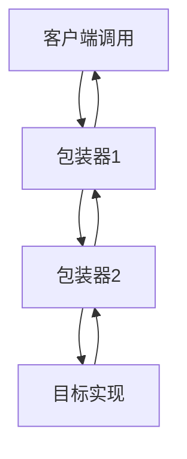
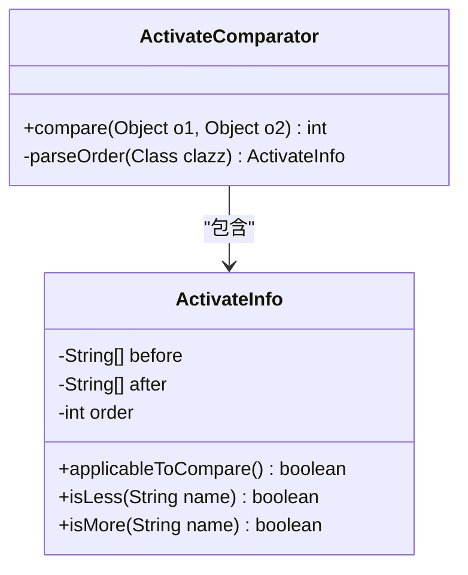
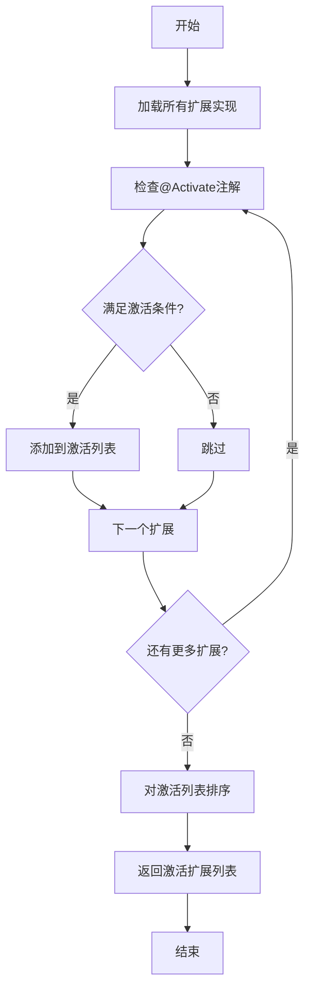

# 扩展包装与激活

<cite>
**本文档引用的文件**
- [Activate.java](file://dubbo-common\src\main\java\org\apache\dubbo\common\extension\Activate.java)
- [Wrapper.java](file://dubbo-common\src\main\java\org\apache\dubbo\common\extension\Wrapper.java)
- [ExtensionLoader.java](file://dubbo-common\src\main\java\org\apache\dubbo\common\extension\ExtensionLoader.java)
- [Filter.java](file://dubbo-rpc\dubbo-rpc-api\src\main\java\org\apache\dubbo\rpc\Filter.java)
- [ProtocolFilterWrapper.java](file://dubbo-cluster\src\main\java\org\apache\dubbo\rpc\cluster\filter\ProtocolFilterWrapper.java)
- [DefaultFilterChainBuilder.java](file://dubbo-cluster\src\main\java\org\apache\dubbo\rpc\cluster\filter\DefaultFilterChainBuilder.java)
</cite>

## 目录
1. [引言](#引言)
2. [扩展包装机制](#扩展包装机制)
3. [自动激活机制](#自动激活机制)
4. [包装链与激活链的构建过程](#包装链与激活链的构建过程)
5. [实际应用示例](#实际应用示例)
6. [最佳实践与注意事项](#最佳实践与注意事项)
7. [结论](#结论)

## 引言

Dubbo作为一款高性能的Java RPC框架，其核心设计理念之一是通过SPI（Service Provider Interface）机制实现高度可扩展的架构。在Dubbo的扩展体系中，扩展包装（Wrapper）和自动激活（Activate）机制是两个关键特性，它们共同构成了Dubbo功能增强和条件化扩展加载的基础。

扩展包装机制允许开发者通过AOP（面向切面编程）风格的方式对核心功能进行增强，如日志记录、性能监控、安全认证等。而自动激活机制则提供了基于条件的扩展加载能力，使得特定的扩展可以根据运行时环境、配置参数或分组策略被自动激活。

本文将深入剖析Dubbo的扩展包装和自动激活机制，详细解释`Wrapper`注解和`Activate`注解的工作原理，分析包装链和激活链的构建过程，并通过实际示例展示这些机制在Filter链构建中的应用。

**本文档引用的文件**
- [Activate.java](file://dubbo-common\src\main\java\org\apache\dubbo\common\extension\Activate.java)
- [Wrapper.java](file://dubbo-common\src\main\java\org\apache\dubbo\common\extension\Wrapper.java)

## 扩展包装机制

扩展包装机制是Dubbo实现AOP风格功能增强的核心。通过`@Wrapper`注解，开发者可以创建包装类，这些包装类能够拦截对目标扩展的调用，并在调用前后执行额外的逻辑，从而实现功能增强。

### Wrapper注解详解

`@Wrapper`注解是标识扩展包装类的关键。该注解定义在`org.apache.dubbo.common.extension.Wrapper`中，其主要属性包括：

- **matches**: 指定需要被包装的扩展名称。当此数组为空时，默认匹配所有扩展。
- **mismatches**: 指定需要被排除的扩展名称。
- **order**: 指定包装器的绝对排序值，升序排列，较小的值将排在前面。

```java
@Retention(RetentionPolicy.RUNTIME)
public @interface Wrapper {
    String[] matches() default {};
    String[] mismatches() default {};
    int order() default 0;
}
```

### 包装类的识别与创建

在Dubbo的`ExtensionLoader`中，包装类的识别和创建是通过`isWrapperClass`方法实现的。该方法检查一个类是否为包装类，判断标准是该类是否具有以目标扩展类型为唯一参数的构造函数。

```java
protected boolean isWrapperClass(Class<?> clazz) {
    Constructor<?>[] constructors = clazz.getConstructors();
    for (Constructor<?> constructor : constructors) {
        if (constructor.getParameterTypes().length == 1 && constructor.getParameterTypes()[0] == type) {
            return true;
        }
    }
    return false;
}
```

当`ExtensionLoader`加载扩展时，会首先检查所有实现类，将符合包装类条件的类缓存到`cachedWrapperClasses`集合中。在创建目标扩展实例时，`ExtensionLoader`会将所有匹配的包装类按照`order`值排序，并逐层包装目标实例，形成包装链。

### 包装链的调用顺序

包装链的调用遵循"外层包装先执行，内层包装后执行"的原则。当一个方法被调用时，最外层的包装器首先拦截调用，执行前置逻辑，然后将调用传递给内层包装器，直到到达目标实现。在目标实现执行完毕后，调用按相反顺序返回，各层包装器执行后置逻辑。



**图示来源**
- [ExtensionLoader.java](file://dubbo-common\src\main\java\org\apache\dubbo\common\extension\ExtensionLoader.java#L1700-L1713)
- [Wrapper.java](file://dubbo-common\src\main\java\org\apache\dubbo\common\extension\Wrapper.java)

**本节来源**
- [Wrapper.java](file://dubbo-common\src\main\java\org\apache\dubbo\common\extension\Wrapper.java)
- [ExtensionLoader.java](file://dubbo-common\src\main\java\org\apache\dubbo\common\extension\ExtensionLoader.java#L1688-L1727)

## 自动激活机制

自动激活机制是Dubbo实现条件化扩展加载的核心。通过`@Activate`注解，开发者可以定义扩展的激活条件，使得特定的扩展仅在满足条件时才被加载和使用。

### Activate注解详解

`@Activate`注解是标识自动激活扩展的关键。该注解定义在`org.apache.dubbo.common.extension.Activate`中，其主要属性包括：

- **group**: 指定组条件。框架SPI定义了有效的组值，如"provider"、"consumer"等。
- **value**: 指定URL参数中的键。当这些键出现在URL参数中时，扩展将被激活。
- **order**: 指定扩展的绝对排序值，升序排列。
- **onClass**: 指定类名条件。当指定的类在类路径上存在时，扩展将被激活。

```java
@Documented
@Retention(RetentionPolicy.RUNTIME)
@Target({ElementType.TYPE, ElementType.METHOD})
public @interface Activate {
    String[] group() default {};
    String[] value() default {};
    int order() default 0;
    String[] onClass() default {};
}
```

### 激活条件的解析与匹配

在`ExtensionLoader`中，激活条件的解析和匹配是通过`getActivateExtension`方法实现的。该方法接收一个URL对象和分组信息，然后遍历所有实现类，检查其`@Activate`注解是否满足激活条件。

激活条件的匹配逻辑如下：
1. 如果`group`属性不为空，检查当前分组是否在`group`数组中。
2. 如果`value`属性不为空，检查URL参数中是否包含这些键。
3. 如果`onClass`属性不为空，检查指定的类是否在类路径上存在。

只有当所有条件都满足时，扩展才会被激活。

### 激活扩展的排序

被激活的扩展需要按照一定的顺序执行。Dubbo使用`ActivateComparator`来对激活的扩展进行排序。排序规则如下：
1. 首先按照`order`值进行升序排序。
2. 对于`order`值相同的扩展，根据`before`和`after`属性进行相对排序（尽管这两个属性在2.7.0版本后已废弃）。



**图示来源**
- [Activate.java](file://dubbo-common\src\main\java\org\apache\dubbo\common\extension\Activate.java)
- [ActivateComparator.java](file://dubbo-common\src\main\java\org\apache\dubbo\common\extension\support\ActivateComparator.java)

**本节来源**
- [Activate.java](file://dubbo-common\src\main\java\org\apache\dubbo\common\extension\Activate.java)
- [ExtensionLoader.java](file://dubbo-common\src\main\java\org\apache\dubbo\common\extension\ExtensionLoader.java)

## 包装链与激活链的构建过程

包装链和激活链的构建是Dubbo扩展机制的核心过程。这两个过程在`ExtensionLoader`中协同工作，共同构建出最终的功能链。

### 包装链的构建

包装链的构建发生在`ExtensionLoader`的`createExtension`方法中。其主要步骤如下：

1. 通过SPI机制加载所有实现类。
2. 识别并缓存所有包装类到`cachedWrapperClasses`集合中。
3. 创建目标扩展的实例。
4. 遍历`cachedWrapperClasses`集合，将所有匹配的包装类按照`order`值排序。
5. 逐层包装目标实例，形成包装链。

```java
private T createExtension(String name, boolean wrap) {
    // 创建目标实例
    T instance = createExtensionInternal(name);
    
    if (wrap) {
        // 获取所有包装类并排序
        Set<Class<?>> wrapperClasses = cachedWrapperClasses;
        if (CollectionUtils.isNotEmpty(wrapperClasses)) {
            for (Class<?> wrapperClass : wrapperClasses) {
                // 检查包装条件
                Wrapper wrapper = wrapperClass.getAnnotation(Wrapper.class);
                if (ArrayUtils.isEmpty(wrapper.matches()) || ArrayUtils.contains(wrapper.matches(), name)) {
                    if (!ArrayUtils.contains(wrapper.mismatches(), name)) {
                        // 创建包装实例并包装目标
                        instance = injectExtension((T) wrapperClass.getConstructor(type).newInstance(instance));
                    }
                }
            }
        }
    }
    return instance;
}
```

### 激活链的构建

激活链的构建发生在`ExtensionLoader`的`getActivateExtension`方法中。其主要步骤如下：

1. 遍历所有实现类。
2. 检查每个实现类的`@Activate`注解是否满足激活条件。
3. 将满足条件的扩展添加到结果列表中。
4. 使用`ActivateComparator`对结果列表进行排序。
5. 返回排序后的激活扩展列表。



**图示来源**
- [ExtensionLoader.java](file://dubbo-common\src\main\java\org\apache\dubbo\common\extension\ExtensionLoader.java)
- [ActivateComparator.java](file://dubbo-common\src\main\java\org\apache\dubbo\common\extension\support\ActivateComparator.java)

**本节来源**
- [ExtensionLoader.java](file://dubbo-common\src\main\java\org\apache\dubbo\common\extension\ExtensionLoader.java)

## 实际应用示例

为了更好地理解扩展包装和激活机制，我们以Dubbo中的Filter链构建为例进行说明。

### Filter接口与实现

在Dubbo中，`Filter`接口是实现各种功能增强的核心扩展点。它被`@SPI`注解标记，表示这是一个可扩展的接口。

```java
@SPI(scope = ExtensionScope.MODULE)
public interface Filter extends BaseFilter {}
```

具体的Filter实现通过`@Activate`注解定义激活条件。例如，`ExceptionFilter`在provider端自动激活：

```java
@Activate(group = CommonConstants.PROVIDER)
public class ExceptionFilter implements Filter {
    // 异常处理逻辑
}
```

### Filter链的构建

Filter链的构建是通过`ProtocolFilterWrapper`和`DefaultFilterChainBuilder`协同完成的。

1. **ProtocolFilterWrapper**: 作为Protocol的包装器，在`export`和`refer`方法中构建Filter链。

```java
@Activate(order = 100)
public class ProtocolFilterWrapper implements Protocol {
    private final Protocol protocol;

    public ProtocolFilterWrapper(Protocol protocol) {
        this.protocol = protocol;
    }

    @Override
    public <T> Exporter<T> export(Invoker<T> invoker) throws RpcException {
        if (UrlUtils.isRegistry(invoker.getUrl())) {
            return protocol.export(invoker);
        }
        FilterChainBuilder builder = getFilterChainBuilder(invoker.getUrl());
        return protocol.export(builder.buildInvokerChain(invoker, SERVICE_FILTER_KEY, CommonConstants.PROVIDER));
    }
}
```

2. **DefaultFilterChainBuilder**: 负责实际的Filter链构建。

```java
public class DefaultFilterChainBuilder implements FilterChainBuilder {
    @Override
    public <T> Invoker<T> buildInvokerChain(final Invoker<T> original, String key, String group) {
        Invoker<T> last = original;
        List<Filter> filters = ExtensionLoader.getExtensionLoader(Filter.class)
            .getActivateExtension(original.getUrl(), key, group);
        
        if (!filters.isEmpty()) {
            for (int i = filters.size() - 1; i >= 0; i--) {
                final Filter filter = filters.get(i);
                final Invoker<T> next = last;
                last = new FilterChainNode<>(original, next, filter);
            }
        }
        return last;
    }
}
```

### 调用流程分析

当一个RPC调用发生时，Filter链的调用流程如下：

```mermaid
sequenceDiagram
participant Client as "客户端"
participant Proxy as "代理"
participant FilterChain as "Filter链"
participant Invoker as "Invoker"
Client->>Proxy : 发起调用
Proxy->>FilterChain : 调用invoke方法
loop 每个Filter
FilterChain->>Filter : 执行前置逻辑
alt 是否继续
Filter-->>FilterChain : 继续调用
else 中断
Filter-->>Proxy : 返回结果
Proxy-->>Client : 返回结果
deactivate Client
end
end
FilterChain->>Invoker : 调用目标方法
Invoker-->>FilterChain : 返回结果
loop 每个Filter(反向)
FilterChain->>Filter : 执行后置逻辑
end
FilterChain-->>Proxy : 返回结果
Proxy-->>Client : 返回结果
```

**图示来源**
- [ProtocolFilterWrapper.java](file://dubbo-cluster\src\main\java\org\apache\dubbo\rpc\cluster\filter\ProtocolFilterWrapper.java)
- [DefaultFilterChainBuilder.java](file://dubbo-cluster\src\main\java\org\apache\dubbo\rpc\cluster\filter\DefaultFilterChainBuilder.java)
- [Filter.java](file://dubbo-rpc\dubbo-rpc-api\src\main\java\org\apache\dubbo\rpc\Filter.java)

**本节来源**
- [ProtocolFilterWrapper.java](file://dubbo-cluster\src\main\java\org\apache\dubbo\rpc\cluster\filter\ProtocolFilterWrapper.java)
- [DefaultFilterChainBuilder.java](file://dubbo-cluster\src\main\java\org\apache\dubbo\rpc\cluster\filter\DefaultFilterChainBuilder.java)
- [Filter.java](file://dubbo-rpc\dubbo-rpc-api\src\main\java\org\apache\dubbo\rpc\Filter.java)

## 最佳实践与注意事项

在使用Dubbo的扩展包装和激活机制时，需要注意以下最佳实践和潜在问题。

### 避免循环包装

循环包装是指包装链中出现了循环引用，导致无限递归。为了避免这种情况，应该：

1. 确保包装类的`matches`和`mismatches`属性设置正确。
2. 避免创建相互包装的包装类。
3. 在包装类的构造函数中进行必要的空值检查。

### 合理设置激活条件

激活条件的设置直接影响扩展的加载行为。建议：

1. 使用明确的`group`值来区分provider和consumer端的扩展。
2. 使用有意义的`value`键来控制扩展的启用。
3. 合理设置`order`值，确保扩展按预期顺序执行。

### 性能考虑

由于每个扩展都会增加方法调用的开销，因此：

1. 避免创建过多的Filter扩展。
2. 在Filter中尽量减少复杂的逻辑处理。
3. 对于性能敏感的场景，考虑使用缓存或其他优化手段。

### 调试与诊断

当遇到扩展加载问题时，可以：

1. 检查SPI配置文件是否正确。
2. 使用调试工具查看`ExtensionLoader`的加载过程。
3. 检查`@Activate`注解的条件是否满足。

**本节来源**
- [ExtensionLoader.java](file://dubbo-common\src\main\java\org\apache\dubbo\common\extension\ExtensionLoader.java)
- [Wrapper.java](file://dubbo-common\src\main\java\org\apache\dubbo\common\extension\Wrapper.java)
- [Activate.java](file://dubbo-common\src\main\java\org\apache\dubbo\common\extension\Activate.java)

## 结论

Dubbo的扩展包装和自动激活机制是其高度可扩展架构的核心。通过`@Wrapper`注解，开发者可以实现AOP风格的功能增强，如日志记录、性能监控等。通过`@Activate`注解，开发者可以实现基于条件的扩展加载，使得特定功能仅在满足条件时才被激活。

这两个机制的协同工作，使得Dubbo能够灵活地适应各种应用场景，同时保持核心代码的简洁性。理解这些机制的工作原理，对于深入掌握Dubbo框架和开发高质量的扩展插件至关重要。

在实际应用中，合理使用这些机制可以极大地提升系统的可维护性和可扩展性。然而，也需要注意避免循环包装、合理设置激活条件，并考虑性能影响，以确保系统的稳定性和高效性。