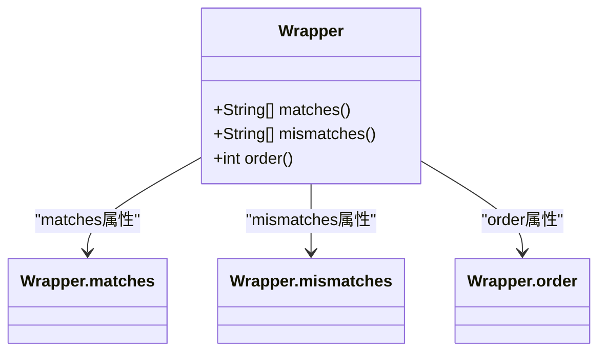
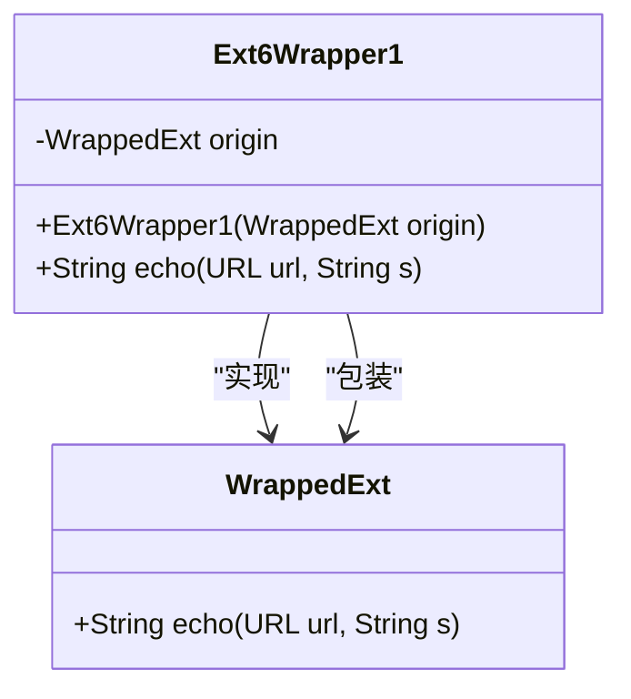
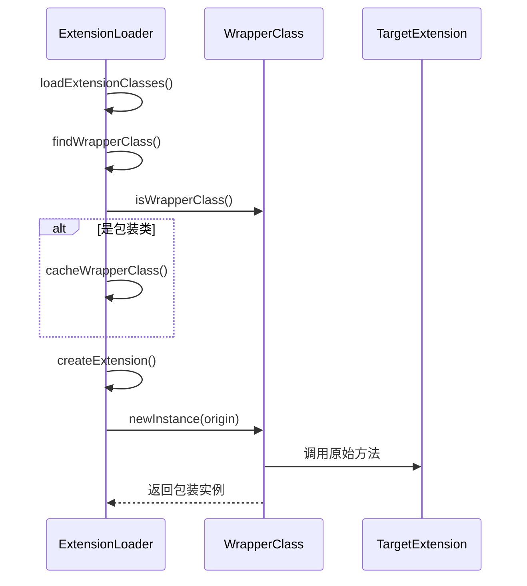
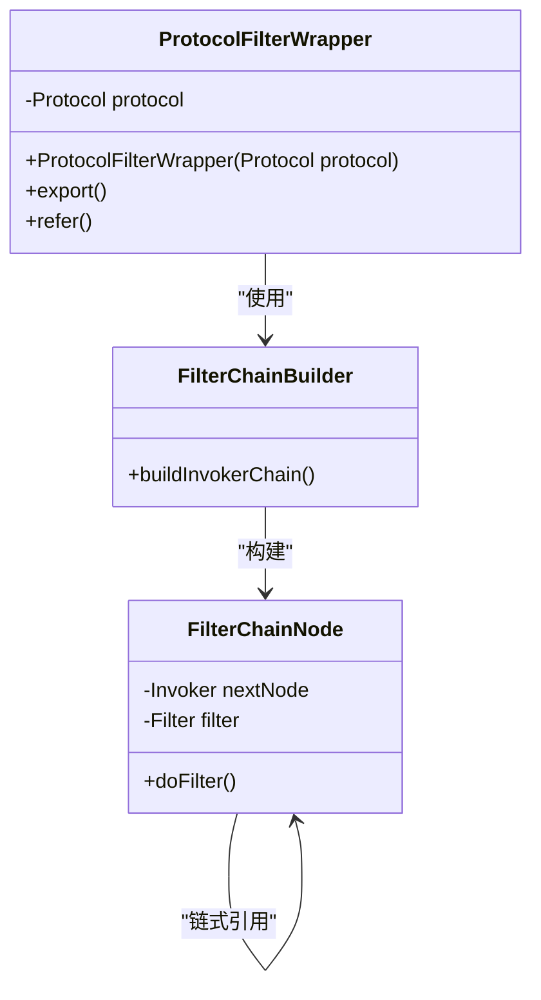

# 扩展包装机制

<cite>
**本文档引用的文件**  
- [Wrapper.java](file://dubbo-common\src\main\java\org\apache\dubbo\common\extension\Wrapper.java)
- [ExtensionLoader.java](file://dubbo-common\src\main\java\org\apache\dubbo\common\extension\ExtensionLoader.java)
- [Ext6Wrapper1.java](file://dubbo-common\src\test\java\org\apache\dubbo\common\extension\ext6_wrap\impl\Ext6Wrapper1.java)
- [Ext6Wrapper2.java](file://dubbo-common\src\test\java\org\apache\dubbo\common\extension\ext6_wrap\impl\Ext6Wrapper2.java)
- [Ext6Wrapper3.java](file://dubbo-common\src\test\java\org\apache\dubbo\common\extension\ext6_wrap\impl\Ext6Wrapper3.java)
- [Ext6Wrapper4.java](file://dubbo-common\src\test\java\org\apache\dubbo\common\extension\ext6_wrap\impl\Ext6Wrapper4.java)
- [DemoWrapper.java](file://dubbo-common\src\test\java\org\apache\dubbo\common\extension\wrapper\impl\DemoWrapper.java)
- [DemoWrapper2.java](file://dubbo-common\src\test\java\org\apache\dubbo\common\extension\wrapper\impl\DemoWrapper2.java)
- [WrapperComparator.java](file://dubbo-common\src\main\java\org\apache\dubbo\common\extension\support\WrapperComparator.java)
- [ProtocolFilterWrapper.java](file://dubbo-cluster\src\main\java\org\apache\dubbo\rpc\cluster\filter\ProtocolFilterWrapper.java)
- [FilterChainBuilder.java](file://dubbo-cluster\src\main\java\org\apache\dubbo\rpc\cluster\filter\FilterChainBuilder.java)
</cite>

## 目录
1. [扩展包装机制概述](#扩展包装机制概述)
2. [Wrapper注解详解](#wrapper注解详解)
3. [包装类的特征与实现](#包装类的特征与实现)
4. [包装链的构建过程](#包装链的构建过程)
5. [Filter链的实际应用](#filter链的实际应用)
6. [包装机制的最佳实践](#包装机制的最佳实践)

## 扩展包装机制概述

Dubbo的扩展包装机制是一种基于AOP（面向切面编程）思想的功能增强机制，通过Wrapper注解标识扩展包装类，实现对核心功能的透明增强。该机制允许开发者在不修改原有代码的情况下，通过包装类来添加日志记录、性能监控等横切关注点。包装机制的核心在于通过构造函数注入被包装的扩展实例，从而构建包装链，实现功能的层层增强。

**本节来源**
- [Wrapper.java](file://dubbo-common\src\main\java\org\apache\dubbo\common\extension\Wrapper.java#L22-L25)

## Wrapper注解详解

`@Wrapper`注解是Dubbo扩展包装机制的核心，用于标识一个类作为包装器工作。该注解包含三个关键属性：

- **matches**: 指定需要被包装的扩展名称数组。当此数组为空时，默认匹配所有扩展。
- **mismatches**: 指定需要被排除的扩展名称数组。
- **order**: 指定包装器的绝对排序值，用于控制包装链中包装器的执行顺序，较小的值会排在前面。

通过这些属性，开发者可以精确控制包装器的应用范围和执行顺序，实现灵活的功能增强。

**图示来源**
- [Wrapper.java](file://dubbo-common\src\main\java\org\apache\dubbo\common\extension\Wrapper.java#L27-L52)

**本节来源**
- [Wrapper.java](file://dubbo-common\src\main\java\org\apache\dubbo\common\extension\Wrapper.java#L27-L52)

## 包装类的特征与实现

包装类在Dubbo中有明确的特征和实现要求：

1. **必须实现被包装的扩展接口**：包装类需要实现与被包装扩展相同的接口，以保证接口一致性。
2. **必须包含特定构造函数**：包装类必须包含一个以被包装扩展接口为唯一参数的构造函数，这是包装机制识别包装类的关键。
3. **必须持有被包装实例的引用**：包装类需要保存被包装扩展实例的引用，以便在增强功能后调用原始方法。

以`Ext6Wrapper1`为例，它实现了`WrappedExt`接口，并通过构造函数接收`WrappedExt`实例，实现了对`echo`方法的增强。

**图示来源**
- [Ext6Wrapper1.java](file://dubbo-common\src\test\java\org\apache\dubbo\common\extension\ext6_wrap\impl\Ext6Wrapper1.java#L27-L45)

**本节来源**
- [Ext6Wrapper1.java](file://dubbo-common\src\test\java\org\apache\dubbo\common\extension\ext6_wrap\impl\Ext6Wrapper1.java#L27-L45)
- [Ext6Wrapper2.java](file://dubbo-common\src\test\java\org\apache\dubbo\common\extension\ext6_wrap\impl\Ext6Wrapper2.java#L27-L44)
- [Ext6Wrapper3.java](file://dubbo-common\src\test\java\org\apache\dubbo\common\extension\ext6_wrap\impl\Ext6Wrapper3.java#L26-L46)
- [Ext6Wrapper4.java](file://dubbo-common\src\test\java\org\apache\dubbo\common\extension\ext6_wrap\impl\Ext6Wrapper4.java#L26-L46)

## 包装链的构建过程

包装链的构建是Dubbo扩展加载器的核心功能之一。`ExtensionLoader`类负责识别和缓存包装类，并在创建扩展实例时自动构建包装链。

构建过程如下：
1. **识别包装类**：通过`isWrapperClass`方法检查类是否具有以被包装类型为唯一参数的构造函数。
2. **缓存包装类**：将识别出的包装类添加到`cachedWrapperClasses`集合中。
3. **创建包装链**：在创建扩展实例时，按顺序应用所有匹配的包装类，形成包装链。

**图示来源**
- [ExtensionLoader.java](file://dubbo-common\src\main\java\org\apache\dubbo\common\extension\ExtensionLoader.java#L1688-L1713)

**本节来源**
- [ExtensionLoader.java](file://dubbo-common\src\main\java\org\apache\dubbo\common\extension\ExtensionLoader.java#L1688-L1713)
- [WrapperComparator.java](file://dubbo-common\src\main\java\org\apache\dubbo\common\extension\support\WrapperComparator.java#L31-L33)

## Filter链的实际应用

包装机制在Dubbo中最典型的应用是Filter链的构建。`ProtocolFilterWrapper`作为协议层的包装器，负责构建和管理Filter链，实现调用前后的处理逻辑。

Filter链的工作原理：
1. **构建过滤器链**：在`export`和`refer`方法中，通过`FilterChainBuilder`构建过滤器链。
2. **链式调用**：每个Filter包装下一个Invoker，形成调用链。
3. **前后处理**：在调用前后执行特定逻辑，如日志记录、性能监控等。

**图示来源**
- [ProtocolFilterWrapper.java](file://dubbo-cluster\src\main\java\org\apache\dubbo\rpc\cluster\filter\ProtocolFilterWrapper.java#L36-L84)
- [FilterChainBuilder.java](file://dubbo-cluster\src\main\java\org\apache\dubbo\rpc\cluster\filter\FilterChainBuilder.java#L61-L89)

**本节来源**
- [ProtocolFilterWrapper.java](file://dubbo-cluster\src\main\java\org\apache\dubbo\rpc\cluster\filter\ProtocolFilterWrapper.java#L36-L84)
- [FilterChainBuilder.java](file://dubbo-cluster\src\main\java\org\apache\dubbo\rpc\cluster\filter\FilterChainBuilder.java#L61-L89)

## 包装机制的最佳实践

在使用Dubbo的包装机制时，需要注意以下最佳实践：

1. **避免循环包装**：确保包装链不会形成循环引用，否则会导致栈溢出。
2. **正确设置order值**：合理设置包装器的order值，确保执行顺序符合预期。
3. **精确控制匹配范围**：通过matches和mismatches属性精确控制包装器的应用范围。
4. **保持接口一致性**：包装类必须完整实现被包装接口的所有方法。
5. **注意性能影响**：过多的包装层会增加调用开销，需权衡功能增强与性能影响。

通过遵循这些最佳实践，可以有效利用Dubbo的包装机制，实现功能的灵活增强，同时保证系统的稳定性和性能。

**本节来源**
- [Ext6Wrapper1.java](file://dubbo-common\src\test\java\org\apache\dubbo\common\extension\ext6_wrap\impl\Ext6Wrapper1.java#L26-L45)
- [Ext6Wrapper2.java](file://dubbo-common\src\test\java\org\apache\dubbo\common\extension\ext6_wrap\impl\Ext6Wrapper2.java#L26-L44)
- [DemoWrapper.java](file://dubbo-common\src\test\java\org\apache\dubbo\common\extension\wrapper\impl\DemoWrapper.java#L22-L36)
- [DemoWrapper2.java](file://dubbo-common\src\test\java\org\apache\dubbo\common\extension\wrapper\impl\DemoWrapper2.java#L22-L36)