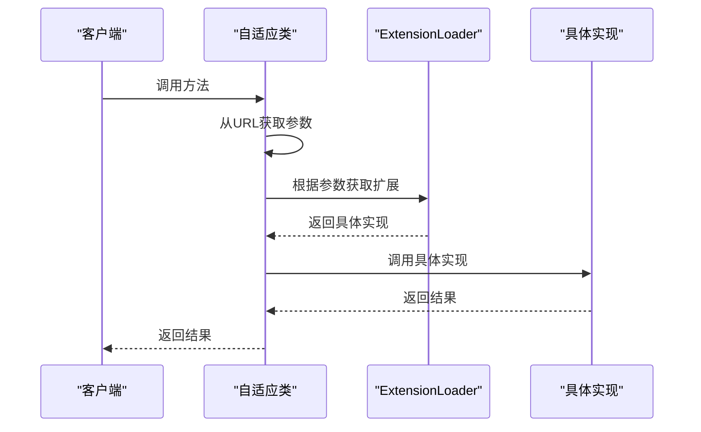

# @Adaptive注解

<cite>
**本文档中引用的文件**  
- [Adaptive.java](file://dubbo-common\src\main\java\org\apache\dubbo\common\extension\Adaptive.java)
- [AdaptiveClassCodeGenerator.java](file://dubbo-common\src\main\java\org\apache\dubbo\common\extension\AdaptiveClassCodeGenerator.java)
- [HasAdaptiveExt.java](file://dubbo-common\src\test\java\org\apache\dubbo\common\extension\adaptive\HasAdaptiveExt.java)
- [SimpleExt.java](file://dubbo-common\src\test\java\org\apache\dubbo\common\extension\ext1\SimpleExt.java)
- [UseProtocolKeyExt.java](file://dubbo-common\src\test\java\org\apache\dubbo\common\extension\ext3\UseProtocolKeyExt.java)
- [Cluster.java](file://dubbo-cluster\src\main\java\org\apache\dubbo\rpc\cluster\Cluster.java)
- [LoadBalance.java](file://dubbo-cluster\src\main\java\org\apache\dubbo\rpc\cluster\LoadBalance.java)
- [AdaptiveCompiler.java](file://dubbo-common\src\main\java\org\apache\dubbo\common\compiler\support\AdaptiveCompiler.java)
</cite>

## 目录
1. [简介](#简介)
2. [@Adaptive注解的作用和使用方式](#adaptive注解的作用和使用方式)
3. [value属性与URL参数键名](#value属性与url参数键名)
4. [类级别与方法级别的@Adaptive注解](#类级别与方法级别的adaptive注解)
5. [实际扩展点接口中的使用示例](#实际扩展点接口中的使用示例)
6. [自适应类的生成与动态选择机制](#自适应类的生成与动态选择机制)
7. [边界情况与最佳实践](#边界情况与最佳实践)

## 简介
@Adaptive注解是Apache Dubbo框架中的一个核心注解，用于标记扩展点接口中的方法，使其成为自适应方法。该注解允许Dubbo在运行时根据URL参数动态选择具体的实现类，从而实现灵活的扩展机制。本文将详细解释@Adaptive注解的作用、使用方式及其在Dubbo框架中的具体应用。

## @Adaptive注解的作用和使用方式

@Adaptive注解的主要作用是为`ExtensionLoader`提供有用信息以注入依赖扩展实例。该注解可以应用于类或方法上，当应用于方法时，它指示Dubbo框架在运行时生成一个自适应的实现类，该类会根据URL中的参数动态选择具体的扩展实现。

在扩展点接口中，通过在方法上添加@Adaptive注解，可以将该方法标记为自适应方法。当调用该方法时，Dubbo会根据URL中传递的参数来决定使用哪个具体的扩展实现。如果在URL中找不到指定的参数，则会使用默认的扩展实现。

**节来源**
- [Adaptive.java](file://dubbo-common\src\main\java\org\apache\dubbo\common\extension\Adaptive.java#L27-L80)

## value属性与URL参数键名

@Adaptive注解的`value`属性用于指定用于查找具体实现的URL参数键名。该属性接受一个字符串数组，数组中的每个元素都是一个参数名。当调用被@Adaptive注解的方法时，Dubbo会按照数组中参数名的顺序在URL中查找对应的值，并使用该值作为扩展的名称。

例如，给定`String[] {"key1", "key2"}`：
1. 在URL中查找参数'key1'，使用其值作为扩展的名称
2. 如果在URL中找不到'key1'（或其值为空），则尝试'key2'作为扩展名称
3. 如果'key2'也不存在，则使用默认扩展
4. 否则，抛出`IllegalStateException`

如果`value`属性为空，则从接口的类名生成默认参数名称，规则是：将类名从大写字母分割成几个部分，并用点'.'分隔这些部分。例如，对于`org.apache.dubbo.xxx.YyyInvokerWrapper`，生成的名称是`String[] {"yyy.invoker.wrapper"}`。

**节来源**
- [Adaptive.java](file://dubbo-common\src\main\java\org\apache\dubbo\common\extension\Adaptive.java#L41-L77)

## 类级别与方法级别的@Adaptive注解

@Adaptive注解可以应用于类级别和方法级别，两者有不同的应用场景。

### 类级别@Adaptive注解
当@Adaptive注解应用于类时，表示该类是一个自适应扩展。这种情况下，开发者需要手动实现该类，并在其中编写逻辑来根据URL参数选择具体的扩展实现。例如，`AdaptiveCompiler`类就是一个自适应扩展，它根据URL参数选择具体的编译器实现。

```java
@Adaptive
public class AdaptiveCompiler implements Compiler {
    // 实现逻辑
}
```

### 方法级别@Adaptive注解
当@Adaptive注解应用于方法时，Dubbo会在运行时自动生成一个自适应的实现类。这个生成的类会根据URL参数动态选择具体的扩展实现。这是最常见的使用方式，适用于大多数扩展点接口。

```java
@SPI("impl1")
public interface SimpleExt {
    @Adaptive
    String echo(URL url, String s);
}
```

**节来源**
- [AdaptiveCompiler.java](file://dubbo-common\src\main\java\org\apache\dubbo\common\compiler\support\AdaptiveCompiler.java#L28-L56)
- [SimpleExt.java](file://dubbo-common\src\test\java\org\apache\dubbo\common\extension\ext1\SimpleExt.java#L27-L37)

## 实际扩展点接口中的使用示例

以下是一些在实际扩展点接口中使用@Adaptive注解的代码示例：

### 示例1：SimpleExt接口
```java
@SPI("impl1")
public interface SimpleExt {
    @Adaptive
    String echo(URL url, String s);

    @Adaptive({"key1", "key2"})
    String yell(URL url, String s);

    String bang(URL url, int i);
}
```

在这个例子中，`echo`方法使用默认的参数名称生成规则，而`yell`方法明确指定了两个参数名`key1`和`key2`。

### 示例2：UseProtocolKeyExt接口
```java
@SPI("impl1")
public interface UseProtocolKeyExt {
    @Adaptive({"key1", "protocol"})
    String echo(URL url, String s);

    @Adaptive({"protocol", "key2"})
    String yell(URL url, String s);
}
```

在这个例子中，`echo`方法首先查找`key1`参数，如果不存在则查找`protocol`参数；而`yell`方法则首先查找`protocol`参数。

**节来源**
- [SimpleExt.java](file://dubbo-common\src\test\java\org\apache\dubbo\common\extension\ext1\SimpleExt.java#L27-L37)
- [UseProtocolKeyExt.java](file://dubbo-common\src\test\java\org\apache\dubbo\common\extension\ext3\UseProtocolKeyExt.java#L25-L32)

## 自适应类的生成与动态选择机制

当一个接口中的方法被@Adaptive注解标记时，Dubbo会在运行时生成一个自适应的实现类。这个生成的类会根据URL参数动态选择具体的扩展实现。

生成的自适应类的逻辑大致如下：
1. 检查URL参数中是否存在指定的键名
2. 如果存在，则使用该键名对应的值作为扩展的名称
3. 如果不存在，则使用默认的扩展实现
4. 根据扩展名称获取具体的扩展实例并调用相应的方法

例如，对于`Cluster`接口中的`join`方法：
```java
@Adaptive
<T> Invoker<T> join(Directory<T> directory, boolean buildFilterChain) throws RpcException;
```

Dubbo会生成一个自适应的实现类，该类会根据URL中的参数选择具体的集群策略实现。



**图来源**
- [Cluster.java](file://dubbo-cluster\src\main\java\org\apache\dubbo\rpc\cluster\Cluster.java#L49-L50)
- [AdaptiveClassCodeGenerator.java](file://dubbo-common\src\main\java\org\apache\dubbo\common\extension\AdaptiveClassCodeGenerator.java#L297-L330)

**节来源**
- [Cluster.java](file://dubbo-cluster\src\main\java\org\apache\dubbo\rpc\cluster\Cluster.java#L49-L50)
- [AdaptiveClassCodeGenerator.java](file://dubbo-common\src\main\java\org\apache\dubbo\common\extension\AdaptiveClassCodeGenerator.java#L297-L330)

## 边界情况与最佳实践

在使用@Adaptive注解时，需要注意一些边界情况和最佳实践：

1. **URL参数检查**：确保在调用被@Adaptive注解的方法时，URL参数不为空。如果URL为空，会抛出`IllegalArgumentException`。

2. **默认扩展**：在SPI注解中指定默认扩展，以防止在URL中找不到指定参数时出现异常。

3. **参数顺序**：在`value`属性中指定多个参数名时，注意参数的查找顺序，优先级高的参数应放在前面。

4. **避免循环依赖**：在自定义的自适应类中，避免出现循环依赖的情况。

5. **性能考虑**：由于自适应类是在运行时生成的，因此可能会有一定的性能开销。在性能敏感的场景下，可以考虑使用预生成的自适应类。

6. **测试覆盖**：确保对自适应类的生成逻辑进行充分的测试，包括各种边界情况。

**节来源**
- [AdaptiveClassCodeGenerator.java](file://dubbo-common\src\main\java\org\apache\dubbo\common\extension\AdaptiveClassCodeGenerator.java#L303-L312)
- [HasAdaptiveExt.java](file://dubbo-common\src\test\java\org\apache\dubbo\common\extension\adaptive\HasAdaptiveExt.java#L25-L26)