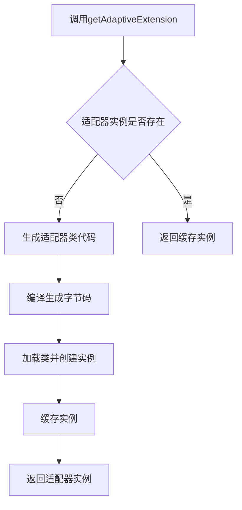
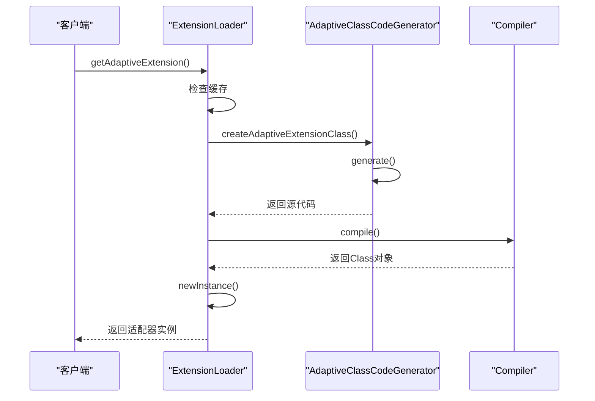
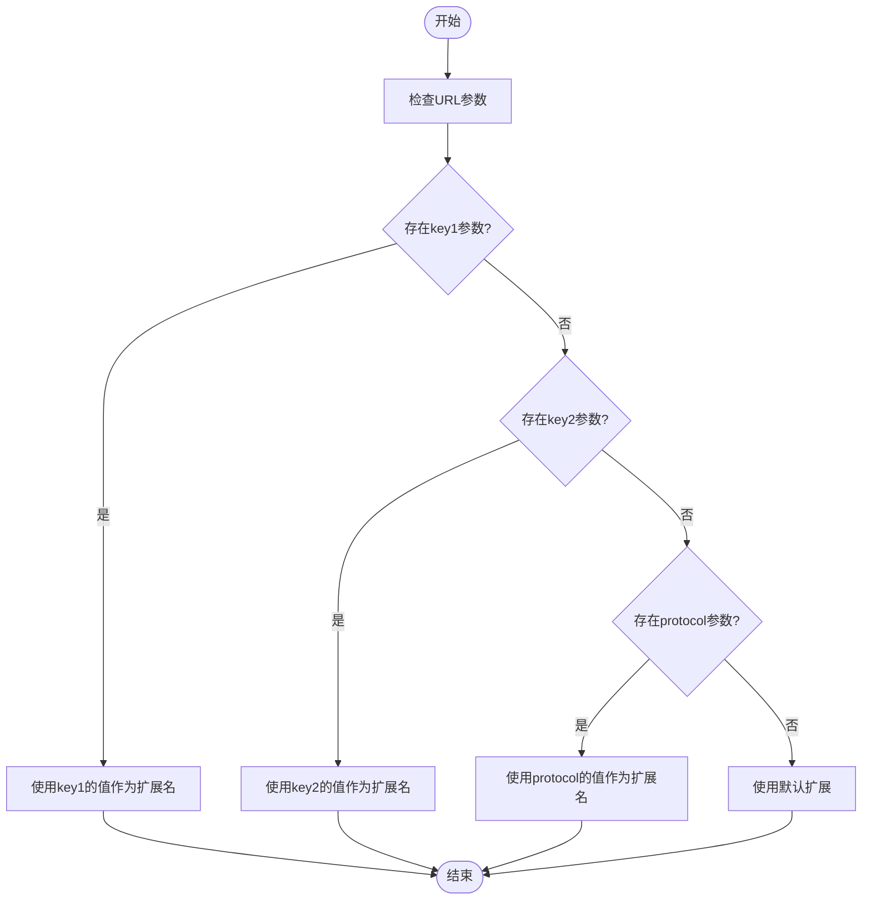
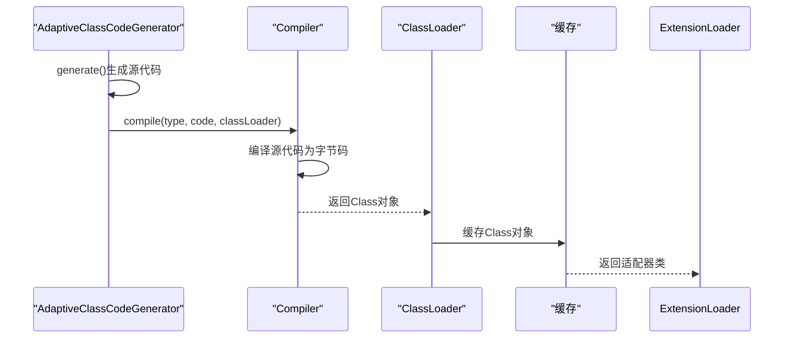

# 自适应扩展

<cite>
**本文档引用的文件**   
- [Adaptive.java](file://dubbo-common\src\main\java\org\apache\dubbo\common\extension\Adaptive.java)
- [ExtensionLoader.java](file://dubbo-common\src\main\java\org\apache\dubbo\common\extension\ExtensionLoader.java)
- [AdaptiveClassCodeGenerator.java](file://dubbo-common\src\main\java\org\apache\dubbo\common\extension\AdaptiveClassCodeGenerator.java)
- [HasAdaptiveExt.java](file://dubbo-common\src\test\java\org\apache\dubbo\common\extension\adaptive\HasAdaptiveExt.java)
- [HasAdaptiveExt_ManualAdaptive.java](file://dubbo-common\src\test\java\org\apache\dubbo\common\extension\adaptive\impl\HasAdaptiveExt_ManualAdaptive.java)
- [ExtensionLoader_Adaptive_Test.java](file://dubbo-common\src\test\java\org\apache\dubbo\common\extension\ExtensionLoader_Adaptive_Test.java)
</cite>

## 目录
1. [引言](#引言)
2. [自适应扩展原理](#自适应扩展原理)
3. [@Adaptive注解详解](#adaptive注解详解)
4. [自适应扩展类生成机制](#自适应扩展类生成机制)
5. [URL参数驱动的扩展选择](#url参数驱动的扩展选择)
6. [代码模板与占位符替换](#代码模板与占位符替换)
7. [编译与加载机制](#编译与加载机制)
8. [自定义自适应扩展开发](#自定义自适应扩展开发)
9. [性能考虑与调试技巧](#性能考虑与调试技巧)
10. [总结](#总结)

## 引言

自适应扩展是Dubbo框架中一个核心的高级特性，它通过动态生成适配器类的方式，实现了基于运行时参数的灵活扩展选择机制。这种机制允许Dubbo在运行时根据URL中的参数动态决定使用哪个具体的扩展实现，从而实现了高度灵活的服务治理能力。自适应扩展机制主要由`@Adaptive`注解、`ExtensionLoader`和`AdaptiveClassCodeGenerator`三个核心组件协同工作完成。

**Section sources**
- [ExtensionLoader.java](file://dubbo-common\src\main\java\org\apache\dubbo\common\extension\ExtensionLoader.java#L92-141)
- [Adaptive.java](file://dubbo-common\src\main\java\org\apache\dubbo\common\extension\Adaptive.java#L36-78)

## 自适应扩展原理

自适应扩展的核心原理是通过动态代码生成技术，在运行时为标记了`@Adaptive`注解的接口生成一个适配器实现类。这个适配器类会根据传入的URL参数来决定具体调用哪个扩展实现。整个过程由`ExtensionLoader`负责协调，当调用`getAdaptiveExtension()`方法时，如果尚未生成适配器类，`ExtensionLoader`会通过`AdaptiveClassCodeGenerator`生成适配器类的源代码，然后使用编译器将其编译成字节码并加载到JVM中。

自适应扩展的实现依赖于Java的反射机制和动态代理技术。生成的适配器类本质上是一个代理类，它封装了扩展选择的逻辑，将具体的业务调用委派给根据URL参数选择的真正实现类。这种设计模式实现了控制反转，使得扩展的选择逻辑与业务逻辑完全解耦。



**Diagram sources**
- [ExtensionLoader.java](file://dubbo-common\src\main\java\org\apache\dubbo\common\extension\ExtensionLoader.java#L1016-1041)
- [AdaptiveClassCodeGenerator.java](file://dubbo-common\src\main\java\org\apache\dubbo\common\extension\AdaptiveClassCodeGenerator.java#L129-166)

## @Adaptive注解详解

`@Adaptive`注解是自适应扩展机制的入口，它可以标记在类或方法上，用于指示Dubbo框架哪些扩展需要生成适配器类。当标记在方法上时，表示该方法是自适应的，需要根据URL参数动态选择实现；当标记在类上时，表示该类本身就是适配器实现，不需要动态生成。

`@Adaptive`注解的核心属性是`value()`，它定义了用于查找扩展实现的URL参数名称。如果未指定value值，框架会根据接口名称自动生成默认的参数名称。例如，对于`org.apache.dubbo.rpc.cluster.LoadBalance`接口，生成的默认参数名称为"loadbalance"。

```mermaid
classDiagram
class Adaptive {
+String[] value() default {}
}
note right of Adaptive
value属性定义了用于查找扩展实现的URL参数名称
如果未指定，则根据接口名称生成默认参数名称
end note
```

**Diagram sources**
- [Adaptive.java](file://dubbo-common\src\main\java\org\apache\dubbo\common\extension\Adaptive.java#L36-78)
- [ExtensionLoader.java](file://dubbo-common\src\main\java\org\apache\dubbo\common\extension\ExtensionLoader.java#L1580-1581)

## 自适应扩展类生成机制

自适应扩展类的生成是一个动态过程，由`AdaptiveClassCodeGenerator`负责完成。当`ExtensionLoader`检测到需要生成适配器类时，会创建`AdaptiveClassCodeGenerator`实例，并调用其`generate()`方法生成适配器类的源代码。

生成过程首先检查接口中是否存在被`@Adaptive`注解标记的方法，如果不存在则抛出异常。然后按照固定的模板生成类的结构，包括包声明、导入语句、类声明等。对于每个方法，生成相应的适配器代码，这些代码包含了URL参数检查、扩展名称解析、扩展实例获取和方法调用转发等逻辑。



**Diagram sources**
- [ExtensionLoader.java](file://dubbo-common\src\main\java\org\apache\dubbo\common\extension\ExtensionLoader.java#L1744-1766)
- [AdaptiveClassCodeGenerator.java](file://dubbo-common\src\main\java\org\apache\dubbo\common\extension\AdaptiveClassCodeGenerator.java#L129-166)

## URL参数驱动的扩展选择

自适应扩展的核心优势在于能够根据URL参数动态选择扩展实现。这一机制通过解析URL中的特定参数来确定使用哪个扩展。选择过程遵循优先级规则：首先检查`@Adaptive`注解中指定的参数名称，按顺序查找，找到第一个存在的参数值作为扩展名称；如果所有指定参数都不存在，则使用接口上`@SPI`注解定义的默认扩展。

URL参数的查找顺序也考虑了方法级别的参数。如果方法参数中包含`Invocation`类型，框架会优先从方法参数中获取参数值，这允许在方法调用级别覆盖URL级别的配置。这种设计提供了极大的灵活性，使得扩展选择可以在多个层次上进行控制。



**Diagram sources**
- [AdaptiveClassCodeGenerator.java](file://dubbo-common\src\main\java\org\apache\dubbo\common\extension\AdaptiveClassCodeGenerator.java#L352-395)
- [ExtensionLoader_Adaptive_Test.java](file://dubbo-common\src\test\java\org\apache\dubbo\common\extension\ExtensionLoader_Adaptive_Test.java#L116-129)

## 代码模板与占位符替换

自适应扩展类的生成依赖于一套精心设计的代码模板系统。`AdaptiveClassCodeGenerator`使用多个常量字符串作为代码模板，通过字符串格式化的方式将具体的值填充到模板中。这些模板涵盖了类的各个部分，包括包声明、导入语句、类声明、方法声明、参数检查、扩展名称解析等。

模板中的占位符使用标准的`String.format()`语法，如`%s`、`%d`等。在生成代码时，`AdaptiveClassCodeGenerator`会根据当前处理的接口和方法的具体信息，计算出需要填充的值，然后调用`String.format()`方法完成占位符替换。这种模板化的方法使得代码生成过程既灵活又可靠。

```mermaid
classDiagram
class AdaptiveClassCodeGenerator {
+String CODE_PACKAGE
+String CODE_IMPORTS
+String CODE_CLASS_DECLARATION
+String CODE_METHOD_DECLARATION
+String CODE_URL_NULL_CHECK
+String CODE_EXT_NAME_ASSIGNMENT
+String CODE_EXT_NAME_NULL_CHECK
+String generate() String
+generatePackageInfo() String
+generateImports() String
+generateClassDeclaration() String
+generateMethod(Method) String
}
note right of AdaptiveClassCodeGenerator
使用常量字符串作为代码模板
通过String.format()进行占位符替换
生成完整的适配器类源代码
end note
```

**Diagram sources**
- [AdaptiveClassCodeGenerator.java](file://dubbo-common\src\main\java\org\apache\dubbo\common\extension\AdaptiveClassCodeGenerator.java#L48-95)
- [AdaptiveClassCodeGenerator.java](file://dubbo-common\src\main\java\org\apache\dubbo\common\extension\AdaptiveClassCodeGenerator.java#L148-160)

## 编译与加载机制

生成的适配器类源代码需要经过编译才能在JVM中使用。Dubbo使用`Compiler`扩展点来完成这一过程，允许用户选择不同的编译器实现，如JDK编译器或Javassist。编译过程将源代码转换为字节码，然后通过类加载器加载到JVM中。

为了提高性能，Dubbo对生成的适配器类进行了缓存。一旦某个接口的适配器类被生成和加载，它就会被缓存在`ExtensionLoader`的`cachedAdaptiveClass`字段中，后续的请求将直接使用缓存的类，避免重复的代码生成和编译过程。这种缓存机制显著提升了自适应扩展的性能表现。



**Diagram sources**
- [ExtensionLoader.java](file://dubbo-common\src\main\java\org\apache\dubbo\common\extension\ExtensionLoader.java#L1762-1766)
- [AdaptiveClassCodeGenerator.java](file://dubbo-common\src\main\java\org\apache\dubbo\common\extension\AdaptiveClassCodeGenerator.java#L129-166)

## 自定义自适应扩展开发

开发自定义自适应扩展需要遵循特定的规范。首先，定义一个接口并使用`@SPI`注解标记，指定默认扩展实现。然后，在需要自适应的方法上使用`@Adaptive`注解。框架会自动为该接口生成适配器类。

在某些特殊场景下，开发者也可以手动实现适配器类。这时需要创建一个实现了目标接口的类，并使用`@Adaptive`注解标记该类。手动实现的适配器类会优先于动态生成的适配器类被使用，这为复杂的适配逻辑提供了灵活性。

```mermaid
classDiagram
class HasAdaptiveExt {
+String echo(URL url, String s)
}
class HasAdaptiveExtImpl1 {
+String echo(URL url, String s)
}
class HasAdaptiveExt_ManualAdaptive {
+String echo(URL url, String s)
}
HasAdaptiveExt <|-- HasAdaptiveExtImpl1
HasAdaptiveExt <|-- HasAdaptiveExt_ManualAdaptive
HasAdaptiveExt <-- HasAdaptiveExt_ManualAdaptive : @Adaptive
note right of HasAdaptiveExt_ManualAdaptive
手动实现的适配器类
使用@Adaptive注解标记
优先于动态生成的适配器
end note
```

**Diagram sources**
- [HasAdaptiveExt.java](file://dubbo-common\src\test\java\org\apache\dubbo\common\extension\adaptive\HasAdaptiveExt.java#L23-27)
- [HasAdaptiveExt_ManualAdaptive.java](file://dubbo-common\src\test\java\org\apache\dubbo\common\extension\adaptive\impl\HasAdaptiveExt_ManualAdaptive.java#L24-31)

## 性能考虑与调试技巧

自适应扩展机制虽然强大，但也带来了一定的性能开销。主要开销来自于首次使用时的代码生成和编译过程。为了优化性能，应尽量减少不必要的自适应扩展使用，并确保在应用启动时预热关键的适配器类。

调试自适应扩展时，可以启用Dubbo的日志功能，查看生成的适配器类源代码。通过分析生成的代码，可以理解扩展选择的具体逻辑。此外，可以使用调试工具在`AdaptiveClassCodeGenerator.generate()`方法处设置断点，观察代码生成的全过程。

**Section sources**
- [AdaptiveClassCodeGenerator.java](file://dubbo-common\src\main\java\org\apache\dubbo\common\extension\AdaptiveClassCodeGenerator.java#L162-164)
- [ExtensionLoader.java](file://dubbo-common\src\main\java\org\apache\dubbo\common\extension\ExtensionLoader.java#L1730-1737)

## 总结

自适应扩展是Dubbo框架中一个精巧的设计，它通过动态代码生成技术实现了运行时的灵活扩展选择。这一机制的核心在于`@Adaptive`注解、`ExtensionLoader`和`AdaptiveClassCodeGenerator`的协同工作。理解自适应扩展的实现原理对于深入掌握Dubbo框架至关重要，它不仅展示了Dubbo的扩展能力，也为开发者提供了强大的自定义扩展手段。

通过本文的分析，我们深入了解了自适应扩展从注解标记到代码生成、编译加载的完整过程，以及如何在实际开发中使用这一高级特性。掌握这些知识，开发者可以更好地利用Dubbo的扩展机制，构建更加灵活和可维护的分布式系统。