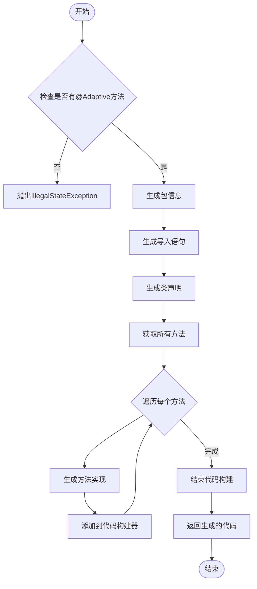
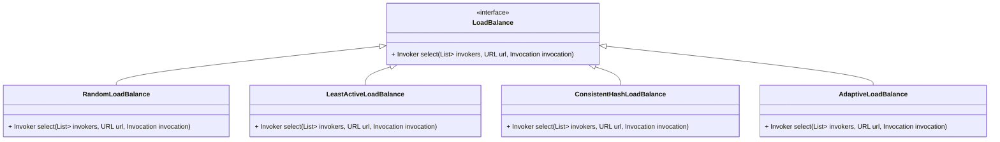

# 自适应扩展使用

<cite>
**本文档中引用的文件**   
- [Adaptive.java](file://dubbo-common\src\main\java\org\apache\dubbo\common\extension\Adaptive.java)
- [SPI.java](file://dubbo-common\src\main\java\org\apache\dubbo\common\extension\SPI.java)
- [ExtensionLoader.java](file://dubbo-common\src\main\java\org\apache\dubbo\common\extension\ExtensionLoader.java)
- [LoadBalance.java](file://dubbo-cluster\src\main\java\org\apache\dubbo\rpc\cluster\LoadBalance.java)
- [AdaptiveLoadBalance.java](file://dubbo-cluster\src\main\java\org\apache\dubbo\rpc\cluster\loadbalance\AdaptiveLoadBalance.java)
- [AdaptiveClassCodeGenerator.java](file://dubbo-common\src\main\java\org\apache\dubbo\common\extension\AdaptiveClassCodeGenerator.java)
- [CommonConstants.java](file://dubbo-common\src\main\java\org\apache\dubbo\common\constants\CommonConstants.java)
- [LoadbalanceRules.java](file://dubbo-common\src\main\java\org\apache\dubbo\common\constants\LoadbalanceRules.java)
</cite>

## 目录
1. [简介](#简介)
2. [自适应扩展核心机制](#自适应扩展核心机制)
3. [开发自定义自适应扩展](#开发自定义自适应扩展)
4. [核心功能中的自适应扩展应用](#核心功能中的自适应扩展应用)
5. [性能优化与常见陷阱](#性能优化与常见陷阱)
6. [结论](#结论)

## 简介
自适应扩展是Dubbo框架中一种强大的动态扩展机制，它允许在运行时根据配置参数动态选择和注入不同的扩展实现。这种机制通过`@Adaptive`注解实现，为Dubbo的SPI（Service Provider Interface）扩展点提供了灵活的行为定制能力。自适应扩展在负载均衡、集群容错、协议选择等核心功能中发挥着关键作用，使得系统能够根据不同的业务场景和运行环境动态调整行为。

**自适应扩展的核心优势在于其动态性和灵活性**。通过在URL配置中设置特定参数，可以触发不同的扩展实现，从而实现服务提供者和消费者行为的灵活定制。这种机制不仅简化了配置管理，还提高了系统的可扩展性和可维护性。

## 自适应扩展核心机制

### 自适应扩展工作原理
自适应扩展机制的核心是`@Adaptive`注解和`ExtensionLoader`类。当一个接口被标记为`@SPI`时，Dubbo会通过`ExtensionLoader`来加载其实现类。如果接口中的某个方法被标记为`@Adaptive`，则Dubbo会为该接口生成一个自适应的代理类，这个代理类在运行时根据URL中的参数动态选择具体的实现。

```mermaid
classDiagram
class Adaptive {
+String[] value() default {}
}
class SPI {
+String value() default ""
+ExtensionScope scope() default ExtensionScope.APPLICATION
}
class ExtensionLoader {
+ConcurrentMap<Class<?>, Object> extensionInstances
+Class<?> type
+ExtensionInjector injector
+ConcurrentMap<Class<?>, String> cachedNames
+ReentrantLock loadExtensionClassesLock
+Holder<Map<String, Class<?>>> cachedClasses
}
class URL {
+String getParameter(String key)
+String getProtocol()
}
Adaptive --> ExtensionLoader : "驱动"
SPI --> ExtensionLoader : "标记"
URL --> ExtensionLoader : "提供参数"
ExtensionLoader --> Adaptive : "生成代理"
```

**图解说明**：
- `Adaptive`注解用于标记需要自适应的方法或类，其`value`属性指定了用于选择扩展实现的参数名称。
- `SPI`注解标记一个接口为Dubbo的扩展点，并指定默认的扩展实现名称。
- `ExtensionLoader`是扩展加载器，负责加载、缓存和管理所有的扩展实现。
- `URL`对象包含了选择扩展实现所需的所有参数信息。

**Diagram sources**
- [Adaptive.java](file://dubbo-common\src\main\java\org\apache\dubbo\common\extension\Adaptive.java)
- [SPI.java](file://dubbo-common\src\main\java\org\apache\dubbo\common\extension\SPI.java)
- [ExtensionLoader.java](file://dubbo-common\src\main\java\org\apache\dubbo\common\extension\ExtensionLoader.java)

### 自适应类生成过程
当`ExtensionLoader`检测到一个接口有`@Adaptive`方法时，它会使用`AdaptiveClassCodeGenerator`生成一个自适应的代理类。这个过程包括以下几个步骤：
1. **检查自适应方法**：`AdaptiveClassCodeGenerator`首先检查接口中是否有被`@Adaptive`注解的方法。
2. **生成包信息**：生成代理类的包声明。
3. **生成导入语句**：生成必要的导入语句。
4. **生成类声明**：生成代理类的声明。
5. **生成方法实现**：为每个方法生成实现代码，这些代码会根据URL参数选择具体的扩展实现。



**Diagram sources**
- [AdaptiveClassCodeGenerator.java](file://dubbo-common\src\main\java\org\apache\dubbo\common\extension\AdaptiveClassCodeGenerator.java)

## 开发自定义自适应扩展

### 编写带有@Adaptive注解的接口
要开发自定义的自适应扩展，首先需要定义一个接口并使用`@SPI`注解标记。然后，在需要自适应的方法上使用`@Adaptive`注解。以下是一个示例：

```java
@SPI("defaultImpl")
public interface MyService {
    @Adaptive("my.service.type")
    String execute(URL url, String request);
}
```

在这个例子中，`MyService`接口被标记为SPI扩展点，默认实现为`defaultImpl`。`execute`方法被标记为`@Adaptive`，并且指定了参数名称`my.service.type`。这意味着在运行时，Dubbo会从URL中查找`my.service.type`参数的值，并根据该值选择相应的实现。

**Section sources**
- [SPI.java](file://dubbo-common\src\main\java\org\apache\dubbo\common\extension\SPI.java)
- [Adaptive.java](file://dubbo-common\src\main\java\org\apache\dubbo\common\extension\Adaptive.java)

### 实现类的编写与配置
接下来，需要编写具体的实现类。每个实现类都应该实现上述接口，并在`META-INF/dubbo`目录下创建一个配置文件，将实现类与一个唯一的名称关联起来。例如：

```java
public class MyServiceImplA implements MyService {
    public String execute(URL url, String request) {
        return "Executed by ImplA";
    }
}

public class MyServiceImplB implements MyService {
    public String execute(URL url, String request) {
        return "Executed by ImplB";
    }
}
```

在`META-INF/dubbo/org.apache.dubbo.MyService`文件中添加如下内容：
```
implA=com.example.MyServiceImplA
implB=com.example.MyServiceImplB
```

这样，当URL中包含`my.service.type=implA`时，Dubbo会选择`MyServiceImplA`作为实现；当包含`my.service.type=implB`时，会选择`MyServiceImplB`。

**Section sources**
- [MyService.java](file://dubbo-common\src\test\java\org\apache\dubbo\common\extension\adaptive\HasAdaptiveExt.java)
- [MyServiceImplA.java](file://dubbo-common\src\test\java\org\apache\dubbo\common\extension\adaptive\impl\HasAdaptiveExtImpl1.java)

### 在URL配置中设置参数
为了触发不同的扩展实现，需要在服务提供者和消费者的URL配置中设置相应的参数。例如，在服务提供者的配置中：

```xml
<dubbo:service interface="com.example.MyService" ref="myServiceImpl" protocol="dubbo">
    <dubbo:parameter key="my.service.type" value="implA"/>
</dubbo:service>
```

在服务消费者的配置中：

```xml
<dubbo:reference id="myService" interface="com.example.MyService">
    <dubbo:parameter key="my.service.type" value="implB"/>
</dubbo:reference>
```

通过这种方式，可以在不修改代码的情况下，灵活地切换不同的实现。

**Section sources**
- [CommonConstants.java](file://dubbo-common\src\main\java\org\apache\dubbo\common\constants\CommonConstants.java)

## 核心功能中的自适应扩展应用

### 负载均衡中的应用
在Dubbo的负载均衡机制中，`LoadBalance`接口被广泛使用。该接口定义了选择服务提供者的策略，不同的实现对应不同的负载均衡算法。例如，`RandomLoadBalance`实现了随机选择，`LeastActiveLoadBalance`实现了最少活跃调用数选择。



**图解说明**：
- `LoadBalance`是负载均衡的接口，定义了选择服务提供者的方法。
- `RandomLoadBalance`、`LeastActiveLoadBalance`、`ConsistentHashLoadBalance`和`AdaptiveLoadBalance`是具体的实现类，分别对应随机、最少活跃调用数、一致性哈希和自适应负载均衡算法。

**Diagram sources**
- [LoadBalance.java](file://dubbo-cluster\src\main\java\org\apache\dubbo\rpc\cluster\LoadBalance.java)
- [AdaptiveLoadBalance.java](file://dubbo-cluster\src\main\java\org\apache\dubbo\rpc\cluster\loadbalance\AdaptiveLoadBalance.java)

### 集群容错中的应用
在集群容错方面，Dubbo提供了多种容错策略，如`FailoverCluster`、`FailfastCluster`等。这些策略通过`Cluster`接口实现，允许在服务调用失败时采取不同的恢复措施。例如，`FailoverCluster`会在调用失败时自动重试其他服务提供者。

### 协议选择中的应用
Dubbo支持多种通信协议，如`dubbo`、`http`、`hessian`等。通过`Protocol`接口和`@Adaptive`注解，可以根据URL中的`protocol`参数动态选择合适的协议实现。这使得系统能够灵活地适应不同的网络环境和性能需求。

## 性能优化与常见陷阱

### 性能优化建议
1. **合理选择负载均衡算法**：根据业务特点选择合适的负载均衡算法。例如，对于高并发场景，可以考虑使用`LeastActiveLoadBalance`以减少服务提供者的负载。
2. **避免过度使用自适应扩展**：虽然自适应扩展提供了极大的灵活性，但过度使用可能会增加系统的复杂性和性能开销。应仅在必要时使用。
3. **优化URL参数解析**：确保URL参数的解析高效，避免不必要的字符串操作和正则表达式匹配。

### 常见陷阱与解决方案
1. **参数名称错误**：确保`@Adaptive`注解中的参数名称与URL中的参数名称完全一致，否则可能导致无法正确选择扩展实现。
2. **默认实现缺失**：如果未指定默认实现或默认实现不存在，可能会导致运行时异常。应在`@SPI`注解中明确指定默认实现。
3. **循环依赖**：在复杂的扩展依赖关系中，可能会出现循环依赖问题。应通过合理的模块划分和依赖管理来避免。

## 结论
自适应扩展是Dubbo框架中一项重要的特性，它通过`@Adaptive`注解和`ExtensionLoader`机制实现了高度的灵活性和可扩展性。通过本文的介绍，我们了解了如何开发自定义的自适应扩展，以及如何在实际应用中利用这一机制实现灵活的行为定制。同时，我们也探讨了在负载均衡、集群容错和协议选择等核心功能中的应用模式，并分享了性能优化和避免常见陷阱的建议。掌握自适应扩展的使用，将有助于构建更加健壮和灵活的分布式系统。