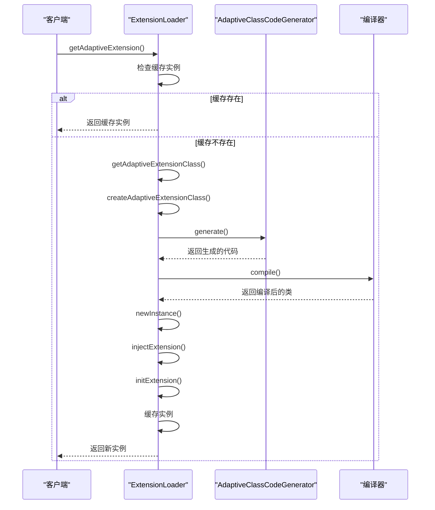
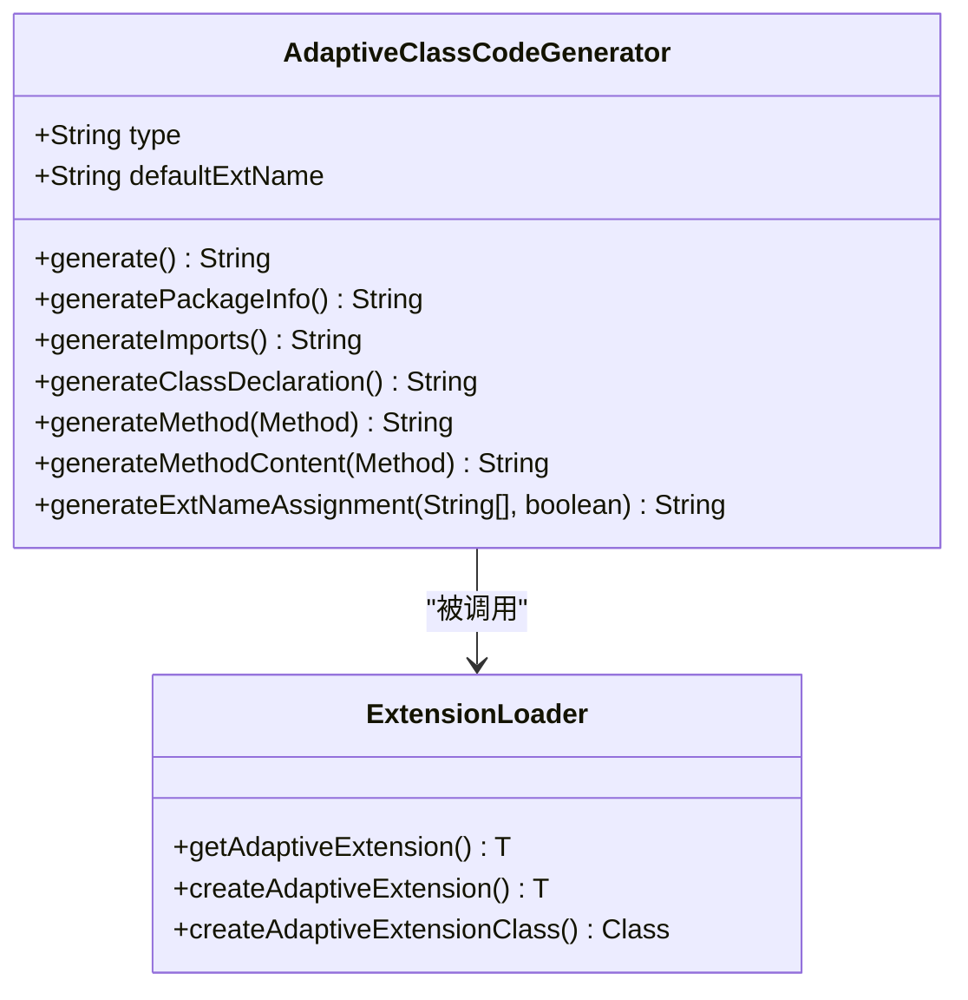
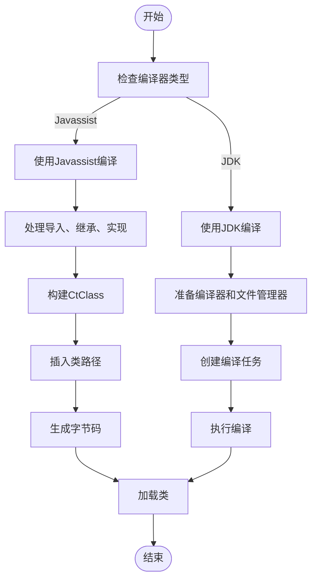
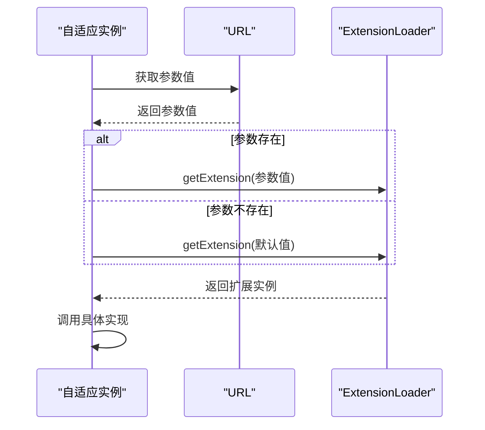
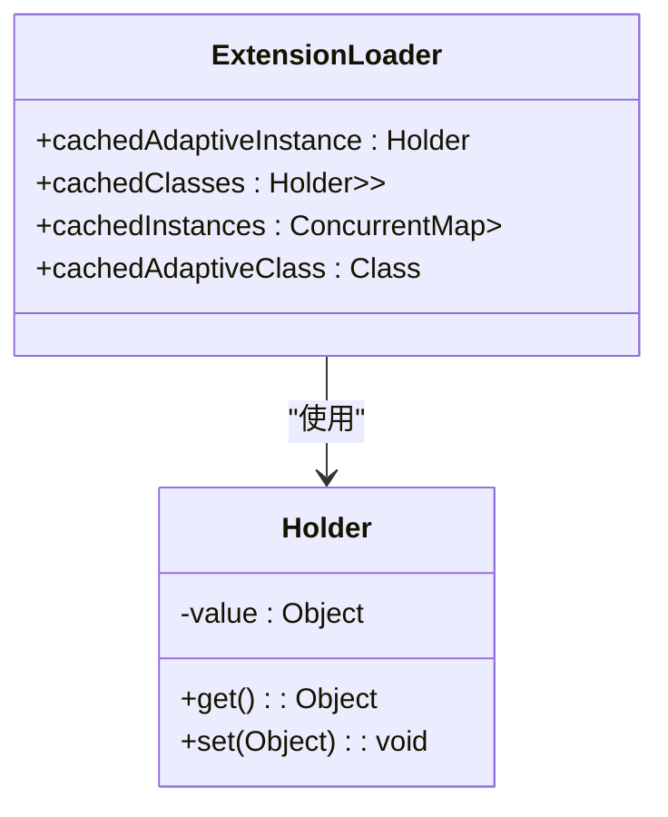
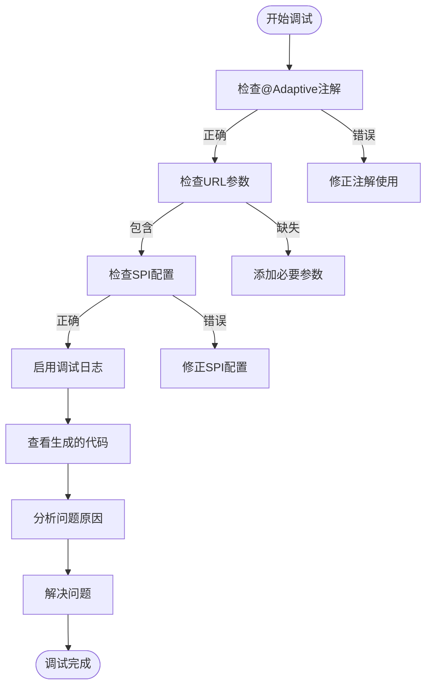

# 自适应类生成

<cite>
**本文档引用的文件**   
- [ExtensionLoader.java](file://dubbo-common\src\main\java\org\apache\dubbo\common\extension\ExtensionLoader.java)
- [AdaptiveClassCodeGenerator.java](file://dubbo-common\src\main\java\org\apache\dubbo\common\extension\AdaptiveClassCodeGenerator.java)
- [JavassistCompiler.java](file://dubbo-common\src\main\java\org\apache\dubbo\common\compiler\support\JavassistCompiler.java)
- [JdkCompiler.java](file://dubbo-common\src\main\java\org\apache\dubbo\common\compiler\support\JdkCompiler.java)
- [ExtensionLoader_Adaptive_Test.java](file://dubbo-common\src\test\java\org\apache\dubbo\common\extension\ExtensionLoader_Adaptive_Test.java)
</cite>

## 目录
1. [引言](#引言)
2. [自适应扩展生成流程](#自适应扩展生成流程)
3. [代码模板构建与占位符替换](#代码模板构建与占位符替换)
4. [动态编译技术实现](#动态编译技术实现)
5. [URL参数解析与扩展选择](#url参数解析与扩展选择)
6. [缓存机制分析](#缓存机制分析)
7. [调试技巧](#调试技巧)
8. [总结](#总结)

## 引言
Dubbo框架中的ExtensionLoader是SPI（Service Provider Interface）扩展机制的核心实现，负责加载、缓存和管理所有的扩展实现。其中，自适应扩展（Adaptive Extension）是Dubbo实现动态扩展的关键技术。自适应扩展类在运行时动态生成，能够根据URL参数动态选择合适的扩展实现，从而实现灵活的扩展机制。本文将深入剖析ExtensionLoader如何在运行时动态生成自适应扩展类的完整过程。

## 自适应扩展生成流程

ExtensionLoader通过`getAdaptiveExtension()`方法获取自适应扩展实例。该方法首先检查缓存中是否存在已创建的自适应实例，如果不存在，则调用`createAdaptiveExtension()`方法创建新的实例。创建过程包括获取自适应扩展类、实例化、依赖注入和初始化等步骤。

**图源**
- [ExtensionLoader.java](file://dubbo-common\src\main\java\org\apache\dubbo\common\extension\ExtensionLoader.java#L1016-L1041)
- [AdaptiveClassCodeGenerator.java](file://dubbo-common\src\main\java\org\apache\dubbo\common\extension\AdaptiveClassCodeGenerator.java#L129-L166)
- [JavassistCompiler.java](file://dubbo-common\src\main\java\org\apache\dubbo\common\compiler\support\JavassistCompiler.java#L45-L101)

**节源**
- [ExtensionLoader.java](file://dubbo-common\src\main\java\org\apache\dubbo\common\extension\ExtensionLoader.java#L1016-L1041)

## 代码模板构建与占位符替换

AdaptiveClassCodeGenerator是自适应类代码生成器，负责生成自适应扩展类的Java代码。它使用预定义的代码模板来构建类结构，包括包声明、导入语句、类声明和方法声明等。生成过程中，会根据扩展接口的元数据替换模板中的占位符。

**图源**
- [AdaptiveClassCodeGenerator.java](file://dubbo-common\src\main\java\org\apache\dubbo\common\extension\AdaptiveClassCodeGenerator.java#L40-L551)

**节源**
- [AdaptiveClassCodeGenerator.java](file://dubbo-common\src\main\java\org\apache\dubbo\common\extension\AdaptiveClassCodeGenerator.java#L40-L551)

## 动态编译技术实现

Dubbo支持多种编译器实现动态编译，主要包括JavassistCompiler和JdkCompiler。JavassistCompiler使用Javassist库在内存中直接操作字节码，而JdkCompiler则使用Java编译器API（JSR-199）进行编译。

**图源**
- [JavassistCompiler.java](file://dubbo-common\src\main\java\org\apache\dubbo\common\compiler\support\JavassistCompiler.java#L32-L102)
- [JdkCompiler.java](file://dubbo-common\src\main\java\org\apache\dubbo\common\compiler\support\JdkCompiler.java#L54-L311)

**节源**
- [JavassistCompiler.java](file://dubbo-common\src\main\java\org\apache\dubbo\common\compiler\support\JavassistCompiler.java#L32-L102)
- [JdkCompiler.java](file://dubbo-common\src\main\java\org\apache\dubbo\common\compiler\support\JdkCompiler.java#L54-L311)

## URL参数解析与扩展选择

自适应扩展类通过解析URL参数来决定使用哪个具体的扩展实现。生成的自适应类代码会根据@Adaptive注解中指定的键值从URL中获取扩展名称，然后通过ExtensionLoader获取对应的扩展实例。

**图源**
- [AdaptiveClassCodeGenerator.java](file://dubbo-common\src\main\java\org\apache\dubbo\common\extension\AdaptiveClassCodeGenerator.java#L352-L395)
- [ExtensionLoader_Adaptive_Test.java](file://dubbo-common\src\test\java\org\apache\dubbo\common\extension\ExtensionLoader_Adaptive_Test.java#L57-L94)

**节源**
- [AdaptiveClassCodeGenerator.java](file://dubbo-common\src\main\java\org\apache\dubbo\common\extension\AdaptiveClassCodeGenerator.java#L352-L395)

## 缓存机制分析

ExtensionLoader使用多种缓存机制来提高性能，包括自适应实例缓存、扩展类缓存和扩展实例缓存。这些缓存确保了自适应扩展类只需生成一次，后续调用直接使用缓存实例。

**图源**
- [ExtensionLoader.java](file://dubbo-common\src\main\java\org\apache\dubbo\common\extension\ExtensionLoader.java#L206-L210)
- [ExtensionLoader.java](file://dubbo-common\src\main\java\org\apache\dubbo\common\extension\ExtensionLoader.java#L185-L186)

**节源**
- [ExtensionLoader.java](file://dubbo-common\src\main\java\org\apache\dubbo\common\extension\ExtensionLoader.java#L206-L210)

## 调试技巧

调试自适应类生成过程时，可以通过以下技巧来诊断问题：
1. 启用调试日志，查看生成的代码
2. 检查@Adaptive注解的使用是否正确
3. 验证URL参数是否包含所需的扩展名称
4. 确认扩展实现类是否正确配置在SPI配置文件中

**图源**
- [ExtensionLoader_Adaptive_Test.java](file://dubbo-common\src\test\java\org\apache\dubbo\common\extension\ExtensionLoader_Adaptive_Test.java#L144-L171)
- [AdaptiveClassCodeGenerator.java](file://dubbo-common\src\main\java\org\apache\dubbo\common\extension\AdaptiveClassCodeGenerator.java#L162-L164)

**节源**
- [ExtensionLoader_Adaptive_Test.java](file://dubbo-common\src\test\java\org\apache\dubbo\common\extension\ExtensionLoader_Adaptive_Test.java#L144-L171)

## 总结
ExtensionLoader通过AdaptiveClassCodeGenerator生成自适应扩展类的代码模板，利用Javassist或JDK Compiler进行动态编译，并通过URL参数解析实现扩展的动态选择。整个过程通过多层缓存机制保证了性能，为Dubbo框架提供了灵活强大的扩展能力。理解这一机制对于深入掌握Dubbo的扩展原理和进行高级定制开发具有重要意义。

**节源**
- [ExtensionLoader.java](file://dubbo-common\src\main\java\org\apache\dubbo\common\extension\ExtensionLoader.java#L1730-L1767)
- [AdaptiveClassCodeGenerator.java](file://dubbo-common\src\main\java\org\apache\dubbo\common\extension\AdaptiveClassCodeGenerator.java#L129-L166)