# 序列化

<cite>
**本文档中引用的文件**  
- [Serialization.java](file://dubbo-serialization/dubbo-serialization-api/src/main/java/org/apache/dubbo/common/serialize/Serialization.java)
- [ObjectInput.java](file://dubbo-serialization/dubbo-serialization-api/src/main/java/org/apache/dubbo/common/serialize/ObjectInput.java)
- [ObjectOutput.java](file://dubbo-serialization/dubbo-serialization-api/src/main/java/org/apache/dubbo/common/serialize/ObjectOutput.java)
- [DataInput.java](file://dubbo-serialization/dubbo-serialization-api/src/main/java/org/apache/dubbo/common/serialize/DataInput.java)
- [DataOutput.java](file://dubbo-serialization/dubbo-serialization-api/src/main/java/org/apache/dubbo/common/serialize/DataOutput.java)
- [Hessian2Serialization.java](file://dubbo-serialization/dubbo-serialization-hessian2/src/main/java/org/apache/dubbo/common/serialize/hessian2/Hessian2Serialization.java)
- [FastJson2Serialization.java](file://dubbo-serialization/dubbo-serialization-fastjson2/src/main/java/org/apache/dubbo/common/serialize/fastjson2/FastJson2Serialization.java)
- [DefaultMultipleSerialization.java](file://dubbo-serialization/dubbo-serialization-api/src/main/java/org/apache/dubbo/common/serialize/DefaultMultipleSerialization.java)
- [Constants.java](file://dubbo-serialization/dubbo-serialization-api/src/main/java/org/apache/dubbo/common/serialize/Constants.java)
- [ProtocolConfig.java](file://dubbo-common/src/main/java/org/apache/dubbo/config/ProtocolConfig.java)
</cite>

## 目录
1. [引言](#引言)
2. [序列化接口设计](#序列化接口设计)
3. [核心序列化组件](#核心序列化组件)
4. [序列化实现机制](#序列化实现机制)
5. [数据类型处理](#数据类型处理)
6. [序列化协议支持](#序列化协议支持)
7. [性能优化策略](#性能优化策略)
8. [扩展实践](#扩展实践)
9. [结论](#结论)

## 引言

Dubbo作为一个高性能的Java RPC框架，其序列化机制是实现远程通信的核心组件之一。序列化扩展机制允许开发者根据业务需求选择或自定义序列化协议，以优化性能、兼容性或安全性。本文档全面介绍Dubbo的序列化扩展机制，涵盖接口设计、实现原理、数据类型处理、协议支持、性能优化和最佳实践。

## 序列化接口设计

Dubbo的序列化机制基于SPI（Service Provider Interface）设计模式，提供了灵活的扩展能力。核心接口包括`Serialization`、`ObjectInput`、`ObjectOutput`、`DataInput`和`DataOutput`，这些接口共同构成了序列化框架的基础。

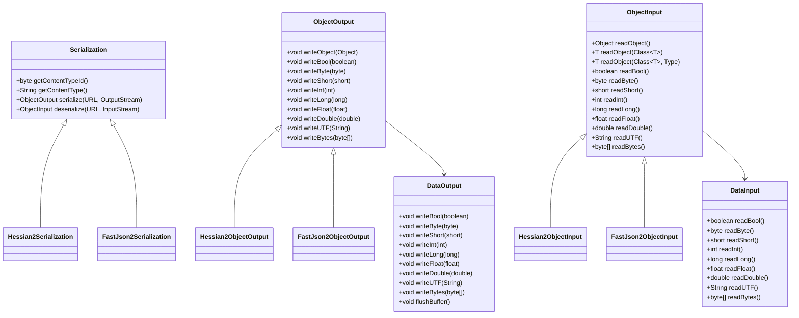

**图源**  
- [Serialization.java](file://dubbo-serialization/dubbo-serialization-api/src/main/java/org/apache/dubbo/common/serialize/Serialization.java)
- [ObjectOutput.java](file://dubbo-serialization/dubbo-serialization-api/src/main/java/org/apache/dubbo/common/serialize/ObjectOutput.java)
- [ObjectInput.java](file://dubbo-serialization/dubbo-serialization-api/src/main/java/org/apache/dubbo/common/serialize/ObjectInput.java)
- [DataOutput.java](file://dubbo-serialization/dubbo-serialization-api/src/main/java/org/apache/dubbo/common/serialize/DataOutput.java)
- [DataInput.java](file://dubbo-serialization/dubbo-serialization-api/src/main/java/org/apache/dubbo/common/serialize/DataInput.java)

**本节来源**  
- [Serialization.java](file://dubbo-serialization/dubbo-serialization-api/src/main/java/org/apache/dubbo/common/serialize/Serialization.java#L36-L76)
- [ObjectOutput.java](file://dubbo-serialization/dubbo-serialization-api/src/main/java/org/apache/dubbo/common/serialize/ObjectOutput.java#L25-L60)
- [ObjectInput.java](file://dubbo-serialization/dubbo-serialization-api/src/main/java/org/apache/dubbo/common/serialize/ObjectInput.java#L26-L88)

## 核心序列化组件

Dubbo的序列化组件分为核心接口和具体实现两部分。核心接口定义了序列化的基本契约，而具体实现则提供了不同的序列化协议。

### Serialization接口

`Serialization`接口是序列化扩展的核心，定义了序列化器的基本行为。该接口通过`@SPI`注解标记为扩展点，允许通过配置选择不同的实现。

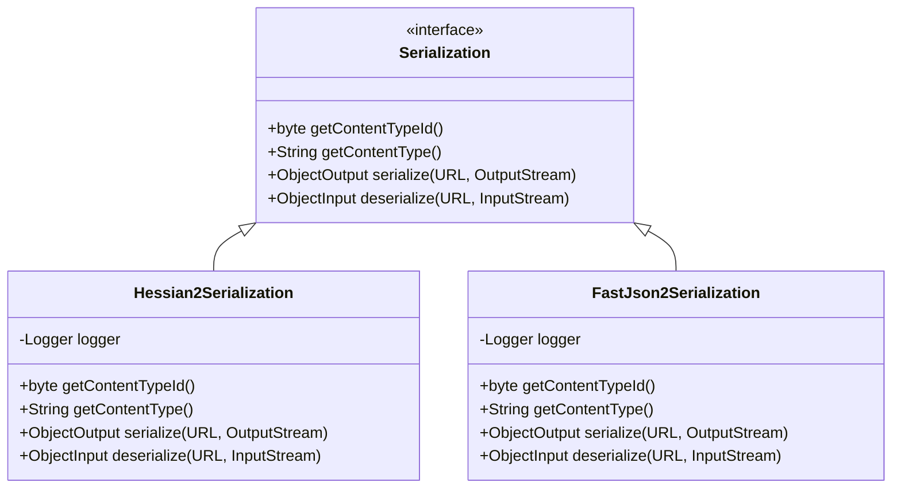

**图源**  
- [Serialization.java](file://dubbo-serialization/dubbo-serialization-api/src/main/java/org/apache/dubbo/common/serialize/Serialization.java)
- [Hessian2Serialization.java](file://dubbo-serialization/dubbo-serialization-hessian2/src/main/java/org/apache/dubbo/common/serialize/hessian2/Hessian2Serialization.java)
- [FastJson2Serialization.java](file://dubbo-serialization/dubbo-serialization-fastjson2/src/main/java/org/apache/dubbo/common/serialize/fastjson2/FastJson2Serialization.java)

**本节来源**  
- [Serialization.java](file://dubbo-serialization/dubbo-serialization-api/src/main/java/org/apache/dubbo/common/serialize/Serialization.java#L36-L76)
- [Hessian2Serialization.java](file://dubbo-serialization/dubbo-serialization-hessian2/src/main/java/org/apache/dubbo/common/serialize/hessian2/Hessian2Serialization.java#L41-L86)
- [FastJson2Serialization.java](file://dubbo-serialization/dubbo-serialization-fastjson2/src/main/java/org/apache/dubbo/common/serialize/fastjson2/FastJson2Serialization.java#L41-L97)

### ObjectOutput和ObjectInput接口

`ObjectOutput`和`ObjectInput`接口分别定义了序列化输出和反序列化输入的操作。它们继承自`DataOutput`和`DataInput`，提供了对基本数据类型和复杂对象的读写支持。

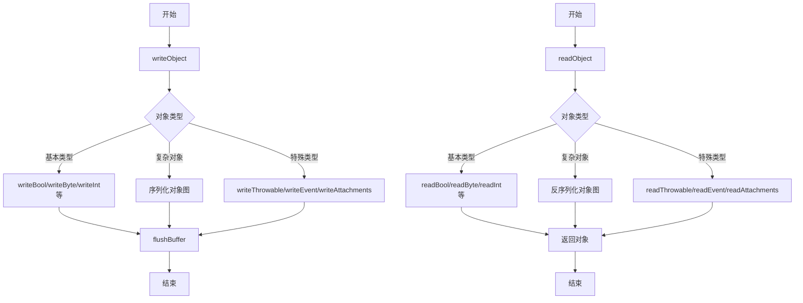

**图源**  
- [ObjectOutput.java](file://dubbo-serialization/dubbo-serialization-api/src/main/java/org/apache/dubbo/common/serialize/ObjectOutput.java)
- [ObjectInput.java](file://dubbo-serialization/dubbo-serialization-api/src/main/java/org/apache/dubbo/common/serialize/ObjectInput.java)

**本节来源**  
- [ObjectOutput.java](file://dubbo-serialization/dubbo-serialization-api/src/main/java/org/apache/dubbo/common/serialize/ObjectOutput.java#L25-L60)
- [ObjectInput.java](file://dubbo-serialization/dubbo-serialization-api/src/main/java/org/apache/dubbo/common/serialize/ObjectInput.java#L26-L88)

## 序列化实现机制

Dubbo的序列化实现机制基于SPI扩展，允许通过配置选择不同的序列化协议。系统在启动时会自动加载所有可用的序列化实现，并根据配置进行选择。

### 序列化注册与查找

Dubbo通过`CodecSupport`类管理所有序列化实现的注册和查找。每个序列化实现都有一个唯一的ID和内容类型，用于在通信过程中标识和选择。

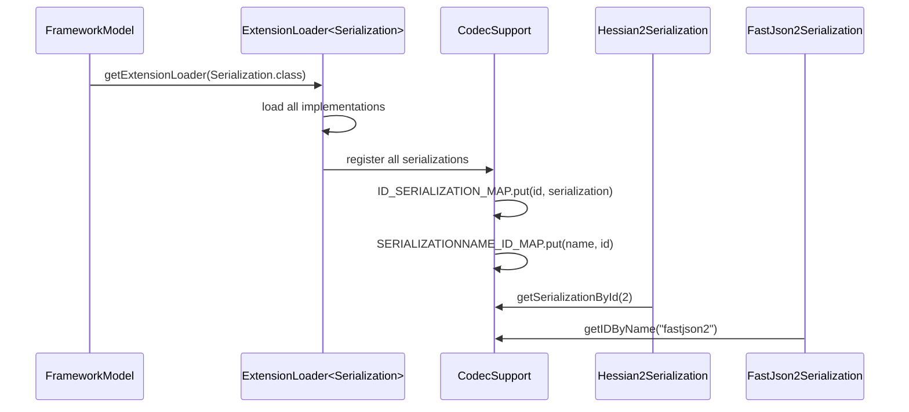

**图源**  
- [CodecSupport.java](file://dubbo-remoting/dubbo-remoting-api/src/main/java/org/apache/dubbo/remoting/transport/CodecSupport.java)
- [Hessian2Serialization.java](file://dubbo-serialization/dubbo-serialization-hessian2/src/main/java/org/apache/dubbo/common/serialize/hessian2/Hessian2Serialization.java)
- [FastJson2Serialization.java](file://dubbo-serialization/dubbo-serialization-fastjson2/src/main/java/org/apache/dubbo/common/serialize/fastjson2/FastJson2Serialization.java)

**本节来源**  
- [CodecSupport.java](file://dubbo-remoting/dubbo-remoting-api/src/main/java/org/apache/dubbo/remoting/transport/CodecSupport.java#L53-L85)
- [Constants.java](file://dubbo-serialization/dubbo-serialization-api/src/main/java/org/apache/dubbo/common/serialize/Constants.java#L19-L40)

### 多序列化支持

Dubbo支持多种序列化协议的混合使用，通过`DefaultMultipleSerialization`类实现。这允许在同一个系统中根据需要选择不同的序列化方式。

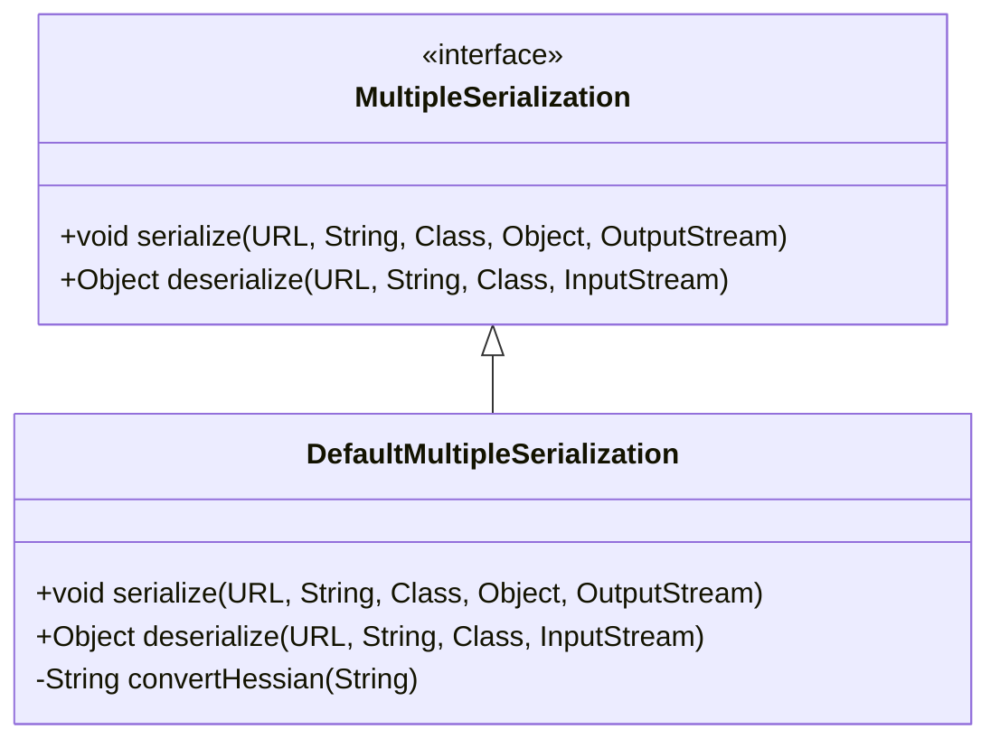

**图源**  
- [DefaultMultipleSerialization.java](file://dubbo-serialization/dubbo-serialization-api/src/main/java/org/apache/dubbo/common/serialize/DefaultMultipleSerialization.java)

**本节来源**  
- [DefaultMultipleSerialization.java](file://dubbo-serialization/dubbo-serialization-api/src/main/java/org/apache/dubbo/common/serialize/DefaultMultipleSerialization.java#L25-L55)

## 数据类型处理

Dubbo的序列化机制需要处理各种数据类型，包括基本类型、复杂对象和特殊类型。不同的序列化实现可能对这些类型的处理方式有所不同。

### 基本类型处理

基本数据类型的序列化通过`DataOutput`和`DataInput`接口实现，提供了统一的读写方法。

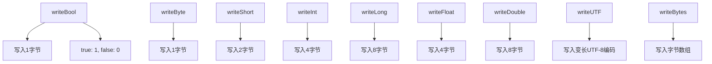

**本节来源**  
- [DataOutput.java](file://dubbo-serialization/dubbo-serialization-api/src/main/java/org/apache/dubbo/common/serialize/DataOutput.java#L24-L114)
- [DataInput.java](file://dubbo-serialization/dubbo-serialization-api/src/main/java/org/apache/dubbo/common/serialize/DataInput.java#L24-L97)

### 复杂对象处理

复杂对象的序列化需要处理对象图、循环引用和类型信息。Hessian2等序列化协议通过对象引用机制来处理循环引用。

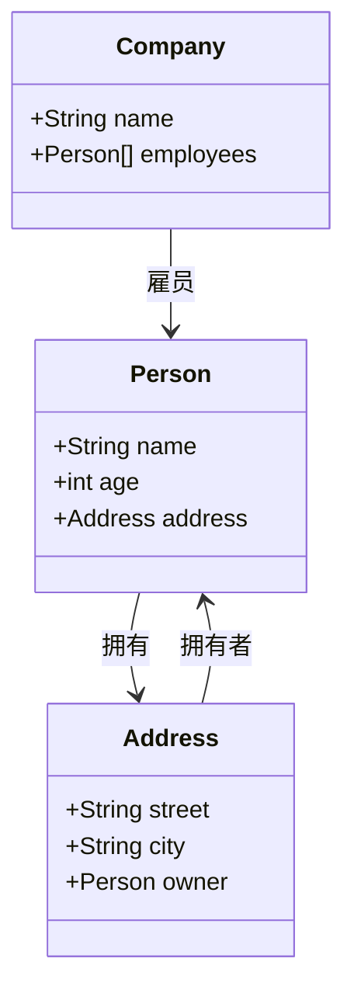

**本节来源**  
- [Hessian2ObjectOutput.java](file://dubbo-serialization/dubbo-serialization-hessian2/src/main/java/org/apache/dubbo/common/serialize/hessian2/Hessian2ObjectOutput.java)
- [Hessian2ObjectInput.java](file://dubbo-serialization/dubbo-serialization-hessian2/src/main/java/org/apache/dubbo/common/serialize/hessian2/Hessian2ObjectInput.java)

### 特殊类型处理

Dubbo对异常、事件和附件等特殊类型提供了专门的处理方法，以确保RPC调用的正确性。

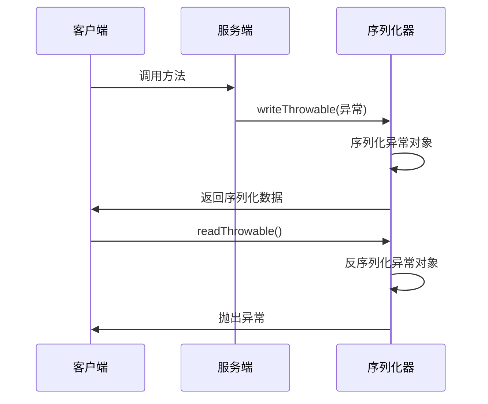

**本节来源**  
- [ObjectOutput.java](file://dubbo-serialization/dubbo-serialization-api/src/main/java/org/apache/dubbo/common/serialize/ObjectOutput.java#L48-L58)
- [ObjectInput.java](file://dubbo-serialization/dubbo-serialization-api/src/main/java/org/apache/dubbo/common/serialize/ObjectInput.java#L72-L78)

## 序列化协议支持

Dubbo支持多种序列化协议，每种协议都有其特点和适用场景。开发者可以根据性能、兼容性和功能需求选择合适的协议。

### Hessian2协议

Hessian2是Dubbo的默认序列化协议，具有良好的性能和兼容性。

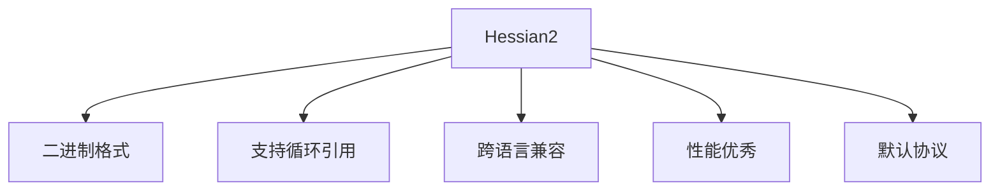

**本节来源**  
- [Hessian2Serialization.java](file://dubbo-serialization/dubbo-serialization-hessian2/src/main/java/org/apache/dubbo/common/serialize/hessian2/Hessian2Serialization.java)
- [Constants.java](file://dubbo-serialization/dubbo-serialization-api/src/main/java/org/apache/dubbo/common/serialize/Constants.java#L20)

### JSON协议

JSON协议适用于需要可读性和跨平台兼容性的场景。

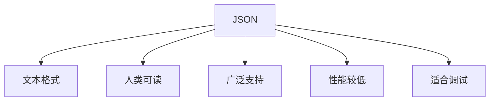

**本节来源**  
- [FastJson2Serialization.java](file://dubbo-serialization/dubbo-serialization-fastjson2/src/main/java/org/apache/dubbo/common/serialize/fastjson2/FastJson2Serialization.java)
- [Constants.java](file://dubbo-serialization/dubbo-serialization-api/src/main/java/org/apache/dubbo/common/serialize/Constants.java#L35)

### 其他协议

Dubbo还支持Protobuf、Kryo等多种序列化协议，满足不同场景的需求。

```mermaid
erDiagram
PROTOCOL ||--o{ HESSIAN2 : 实现
PROTOCOL ||--o{ JSON : 实现
PROTOCOL ||--o{ PROTOBUF : 实现
PROTOCOL ||--o{ KRYO : 实现
PROTOCOL ||--o{ FST : 实现
HESSIAN2 {
string name "hessian2"
byte id 2
string contentType "x-application/hessian2"
}
JSON {
string name "fastjson2"
byte id 23
string contentType "text/jsonb"
}
PROTOBUF {
string name "protobuf"
byte id 22
string contentType "application/x-protobuf"
}
KRYO {
string name "kryo"
byte id 8
string contentType "application/x-kryo"
}
FST {
string name "fst"
byte id 9
string contentType "application/x-fst"
}
```

**本节来源**  
- [Constants.java](file://dubbo-serialization/dubbo-serialization-api/src/main/java/org/apache/dubbo/common/serialize/Constants.java)
- [ProtocolConfig.java](file://dubbo-common/src/main/java/org/apache/dubbo/config/ProtocolConfig.java)

## 性能优化策略

Dubbo的序列化机制包含多种性能优化策略，以提高RPC调用的效率。

### 缓冲区管理

有效的缓冲区管理可以减少内存分配和垃圾回收的开销。

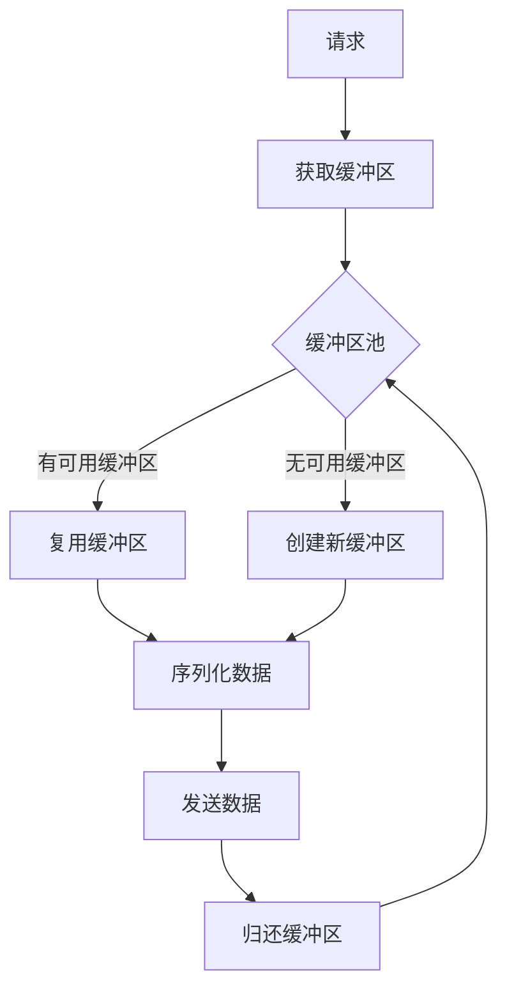

**本节来源**  
- [DataOutput.java](file://dubbo-serialization/dubbo-serialization-api/src/main/java/org/apache/dubbo/common/serialize/DataOutput.java#L113-L114)
- [TransportCodec.java](file://dubbo-remoting/dubbo-remoting-api/src/main/java/org/apache/dubbo/remoting/transport/codec/TransportCodec.java#L70-L81)

### 对象复用

对象复用可以减少对象创建和销毁的开销。

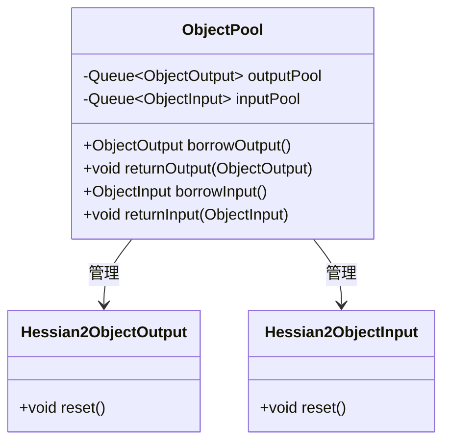

**本节来源**  
- [Hessian2ObjectOutput.java](file://dubbo-serialization/dubbo-serialization-hessian2/src/main/java/org/apache/dubbo/common/serialize/hessian2/Hessian2ObjectOutput.java)
- [Hessian2ObjectInput.java](file://dubbo-serialization/dubbo-serialization-hessian2/src/main/java/org/apache/dubbo/common/serialize/hessian2/Hessian2ObjectInput.java)

### 压缩技术

对于大数据量的传输，压缩技术可以显著减少网络带宽的使用。

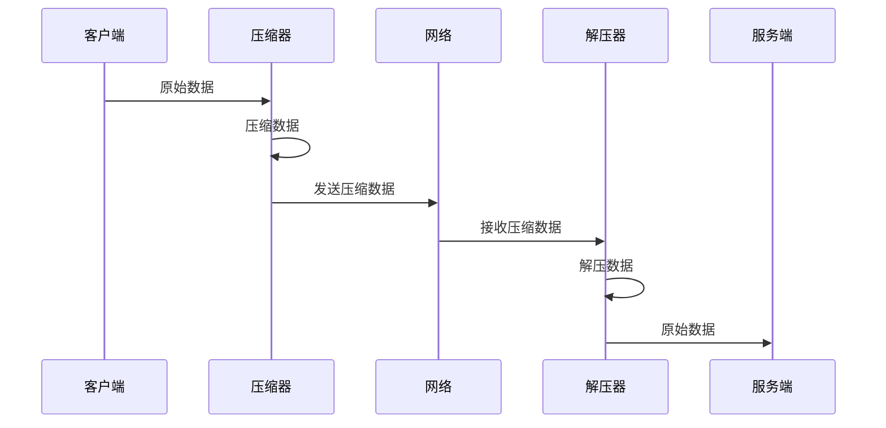

**本节来源**  
- [CodecSupport.java](file://dubbo-remoting/dubbo-remoting-api/src/main/java/org/apache/dubbo/remoting/transport/CodecSupport.java)
- [TransportCodec.java](file://dubbo-remoting/dubbo-remoting-api/src/main/java/org/apache/dubbo/remoting/transport/codec/TransportCodec.java)

## 扩展实践

开发者可以基于Dubbo的序列化扩展机制实现自定义的序列化协议。

### 自定义序列化实现

实现自定义序列化协议需要实现`Serialization`接口，并提供相应的`ObjectOutput`和`ObjectInput`实现。

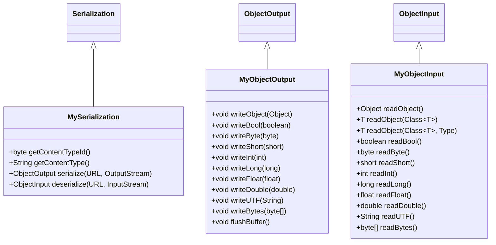

**本节来源**  
- [Serialization.java](file://dubbo-serialization/dubbo-serialization-api/src/main/java/org/apache/dubbo/common/serialize/Serialization.java)
- [ObjectOutput.java](file://dubbo-serialization/dubbo-serialization-api/src/main/java/org/apache/dubbo/common/serialize/ObjectOutput.java)
- [ObjectInput.java](file://dubbo-serialization/dubbo-serialization-api/src/main/java/org/apache/dubbo/common/serialize/ObjectInput.java)

### 配置与使用

自定义序列化协议需要在配置文件中注册，并在协议配置中指定使用。

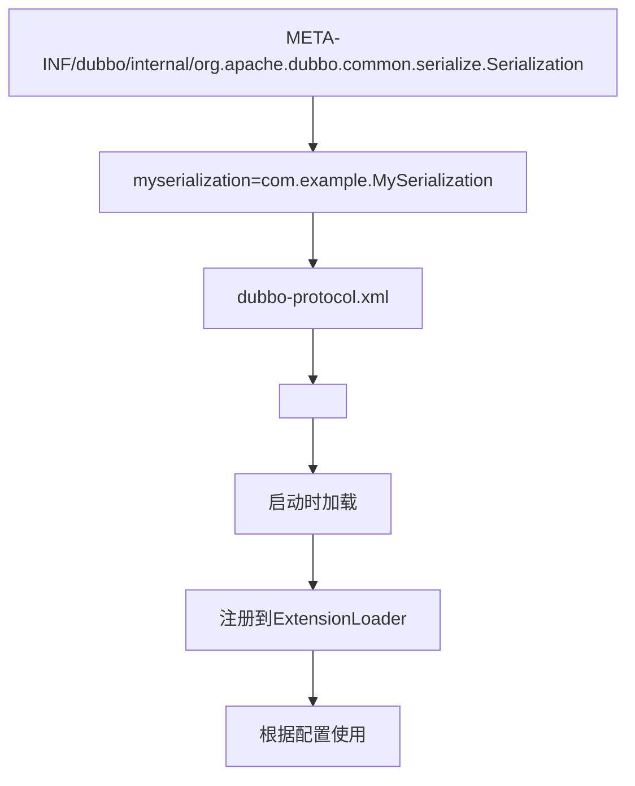

**本节来源**  
- [ProtocolConfig.java](file://dubbo-common/src/main/java/org/apache/dubbo/config/ProtocolConfig.java)
- [Serialization.java](file://dubbo-serialization/dubbo-serialization-api/src/main/java/org/apache/dubbo/common/serialize/Serialization.java)

## 结论

Dubbo的序列化扩展机制提供了灵活、高效和可扩展的序列化解决方案。通过`Serialization`、`ObjectInput`和`ObjectOutput`等核心接口，开发者可以实现自定义的序列化协议。系统支持Hessian2、JSON、Protobuf等多种序列化方式，每种方式都有其适用场景。性能优化策略如缓冲区管理、对象复用和压缩技术进一步提升了系统的效率。开发者在扩展序列化功能时，应考虑版本兼容性、安全性和性能等因素，遵循最佳实践以确保系统的稳定性和可靠性。