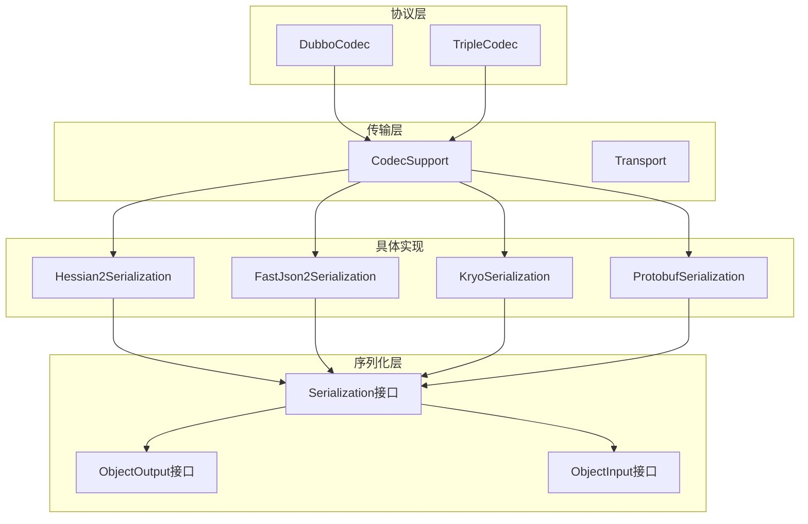
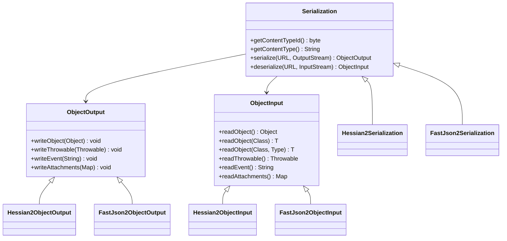
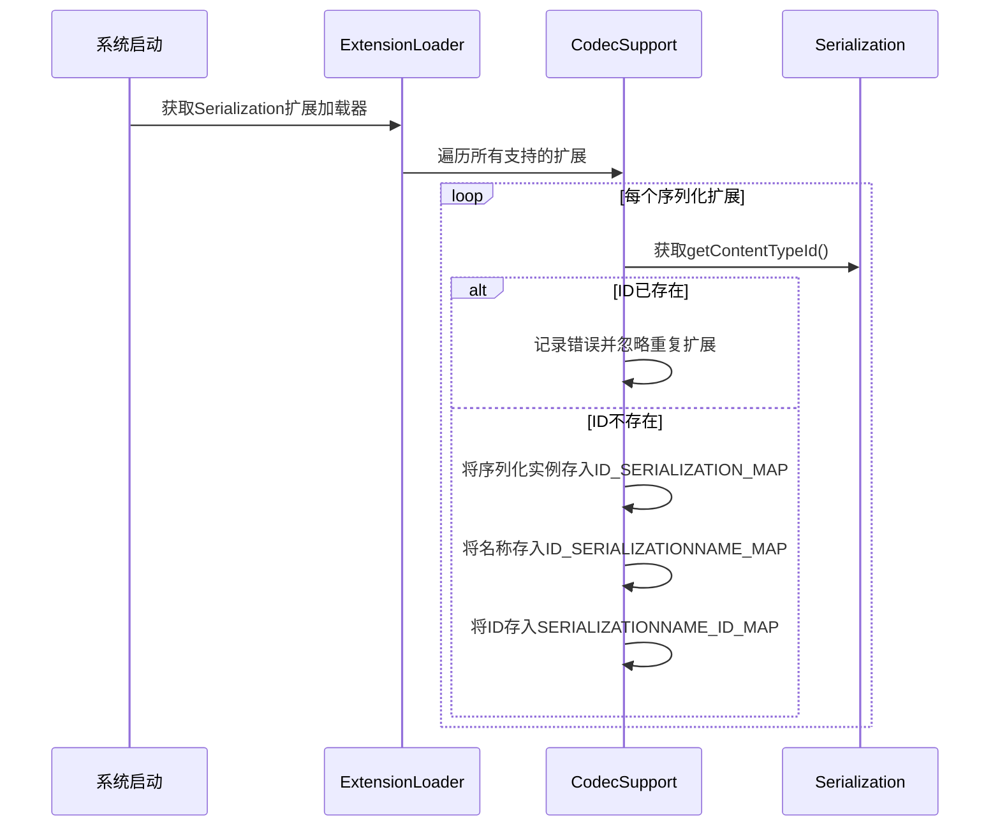
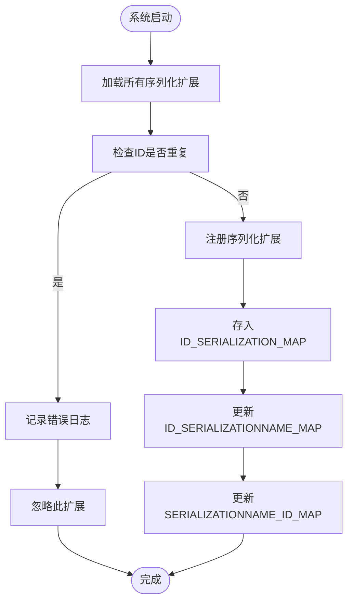
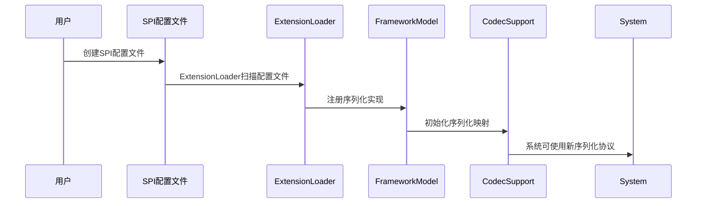
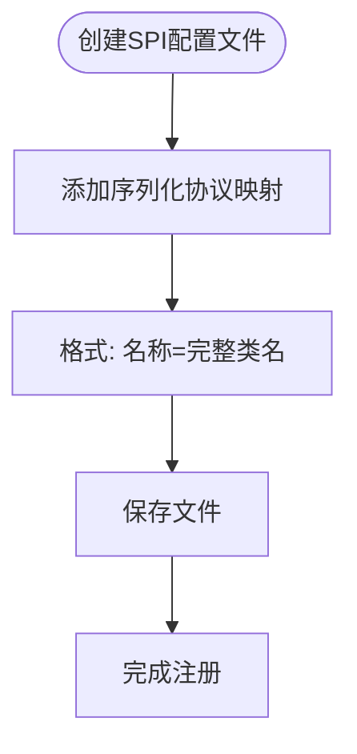
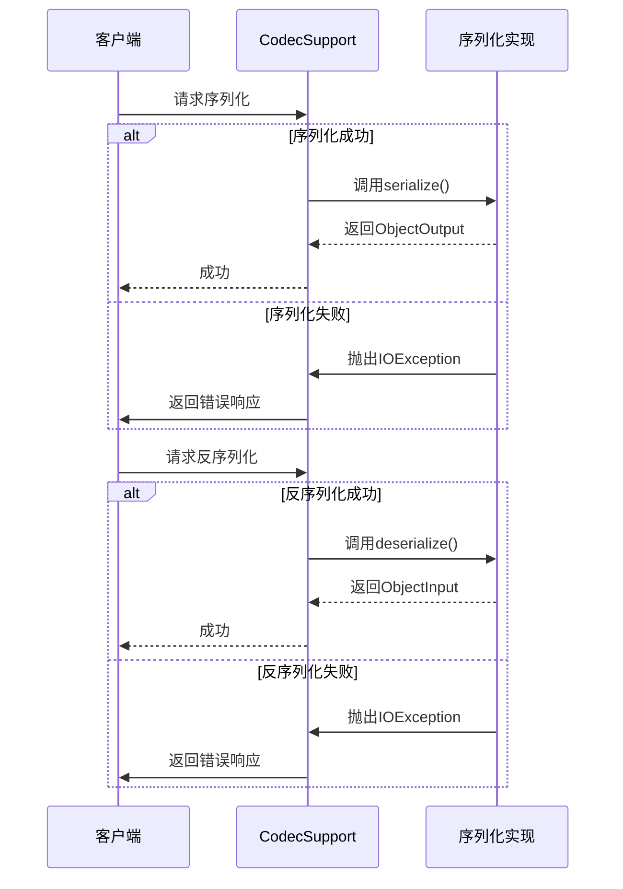
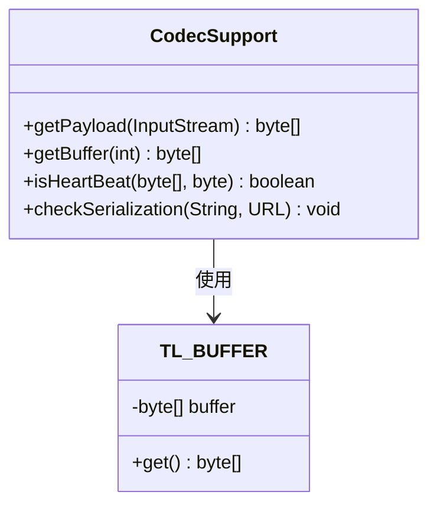
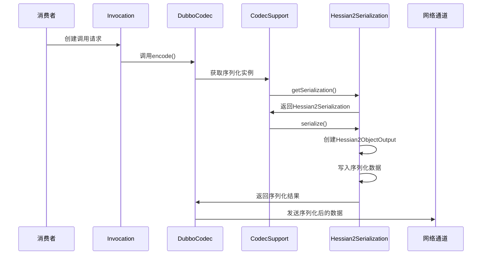
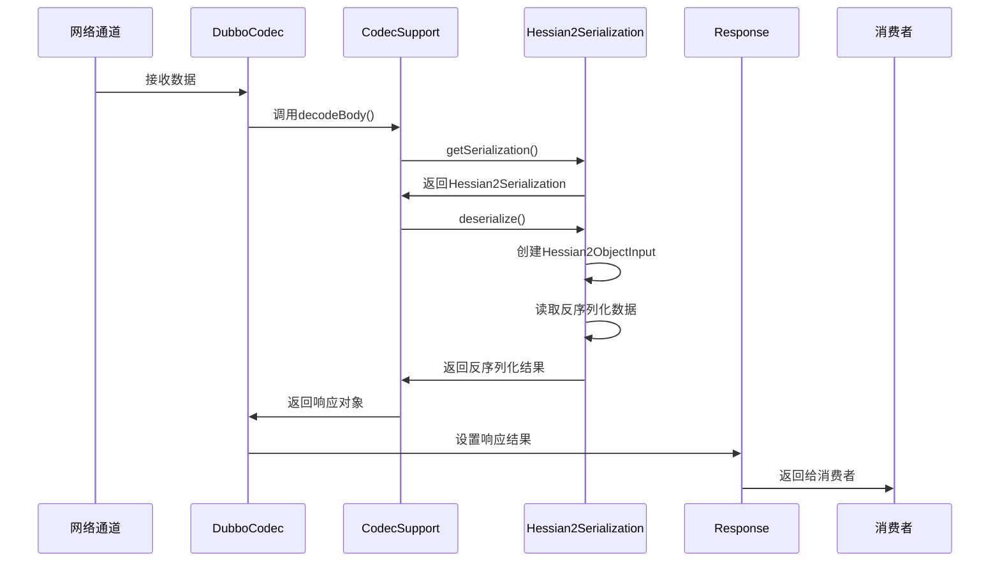

# 序列化协议

<cite>
**本文档中引用的文件**   
- [Serialization.java](file://dubbo-serialization\dubbo-serialization-api\src\main\java\org\apache\dubbo\common\serialize\Serialization.java)
- [ObjectOutput.java](file://dubbo-serialization\dubbo-serialization-api\src\main\java\org\apache\dubbo\common\serialize\ObjectOutput.java)
- [ObjectInput.java](file://dubbo-serialization\dubbo-serialization-api\src\main\java\org\apache\dubbo\common\serialize\ObjectInput.java)
- [Hessian2Serialization.java](file://dubbo-serialization\dubbo-serialization-hessian2\src\main\java\org\apache\dubbo\common\serialize\hessian2\Hessian2Serialization.java)
- [FastJson2Serialization.java](file://dubbo-serialization\dubbo-serialization-fastjson2\src\main\java\org\apache\dubbo\common\serialize\fastjson2\FastJson2Serialization.java)
- [CodecSupport.java](file://dubbo-remoting\dubbo-remoting-api\src\main\java\org\apache\dubbo\remoting\transport\CodecSupport.java)
- [DubboCodec.java](file://dubbo-rpc\dubbo-rpc-dubbo\src\main\java\org\apache\dubbo\rpc\protocol\dubbo\DubboCodec.java)
- [org.apache.dubbo.common.serialize.Serialization](file://dubbo-serialization\dubbo-serialization-api\src\main\resources\META-INF\dubbo\internal\org.apache.dubbo.common.serialize.Serialization)
- [org.apache.dubbo.common.serialize.Serialization](file://dubbo-serialization\dubbo-serialization-hessian2\src\main\resources\META-INF\dubbo\internal\org.apache.dubbo.common.serialize.Serialization)
- [org.apache.dubbo.common.serialize.Serialization](file://dubbo-serialization\dubbo-serialization-fastjson2\src\main\resources\META-INF\dubbo\internal\org.apache.dubbo.common.serialize.Serialization)
</cite>

## 目录
1. [引言](#引言)
2. [序列化协议架构](#序列化协议架构)
3. [核心接口设计](#核心接口设计)
4. [协议版本管理机制](#协议版本管理机制)
5. [扩展点设计与SPI机制](#扩展点设计与spi机制)
6. [自定义序列化协议实现步骤](#自定义序列化协议实现步骤)
7. [错误处理与边界情况](#错误处理与边界情况)
8. [性能考量](#性能考量)
9. [RPC调用中的序列化流程](#rpc调用中的序列化流程)
10. [结论](#结论)

## 引言
Dubbo序列化协议是分布式RPC调用中的核心组件，负责在客户端和服务端之间高效、可靠地传输数据。本文档深入解析Dubbo序列化协议的设计与实现，涵盖核心接口、版本管理、扩展机制以及完整的实现流程。

## 序列化协议架构



**图示来源**
- [Serialization.java](file://dubbo-serialization\dubbo-serialization-api\src\main\java\org\apache\dubbo\common\serialize\Serialization.java)
- [Hessian2Serialization.java](file://dubbo-serialization\dubbo-serialization-hessian2\src\main\java\org\apache\dubbo\common\serialize\hessian2\Hessian2Serialization.java)
- [FastJson2Serialization.java](file://dubbo-serialization\dubbo-serialization-fastjson2\src\main\java\org\apache\dubbo\common\serialize\fastjson2\FastJson2Serialization.java)
- [CodecSupport.java](file://dubbo-remoting\dubbo-remoting-api\src\main\java\org\apache\dubbo\remoting\transport\CodecSupport.java)
- [DubboCodec.java](file://dubbo-rpc\dubbo-rpc-dubbo\src\main\java\org\apache\dubbo\rpc\protocol\dubbo\DubboCodec.java)

## 核心接口设计

Dubbo序列化协议的核心是`Serialization`接口，它定义了序列化和反序列化的契约。该接口包含两个核心方法：`serialize`和`deserialize`。



**图示来源**
- [Serialization.java](file://dubbo-serialization\dubbo-serialization-api\src\main\java\org\apache\dubbo\common\serialize\Serialization.java)
- [ObjectOutput.java](file://dubbo-serialization\dubbo-serialization-api\src\main\java\org\apache\dubbo\common\serialize\ObjectOutput.java)
- [ObjectInput.java](file://dubbo-serialization\dubbo-serialization-api\src\main\java\org\apache\dubbo\common\serialize\ObjectInput.java)

### Serialization接口契约

`Serialization`接口是Dubbo序列化协议的核心，它定义了序列化器的基本行为规范。该接口通过SPI机制实现可扩展性，允许用户自定义序列化实现。

**核心方法契约：**

- `getContentTypeId()`: 获取内容类型唯一标识符，推荐自定义实现使用与`Constants`中任何值不同的值，且不超过ExchangeCodec.SERIALIZATION_MASK(31)，因为Dubbo协议在头部使用5位记录序列化ID。
- `getContentType()`: 获取内容类型，用于标识序列化格式。
- `serialize(URL, OutputStream)`: 获取序列化实现实例，返回`ObjectOutput`对象用于写入数据。
- `deserialize(URL, InputStream)`: 获取反序列化实现实例，返回`ObjectInput`对象用于读取数据。

**Section sources**
- [Serialization.java](file://dubbo-serialization\dubbo-serialization-api\src\main\java\org\apache\dubbo\common\serialize\Serialization.java)

## 协议版本管理机制

Dubbo序列化协议的版本管理机制通过`CodecSupport`类实现，确保不同版本间的兼容性。该机制使用静态代码块在类加载时初始化所有支持的序列化扩展。



**图示来源**
- [CodecSupport.java](file://dubbo-remoting\dubbo-remoting-api\src\main\java\org\apache\dubbo\remoting\transport\CodecSupport.java)

### 兼容性处理

当检测到相同ID的序列化扩展时，系统会记录错误日志并忽略重复的扩展，确保系统稳定运行。这种机制防止了因配置错误导致的序列化冲突。



**图示来源**
- [CodecSupport.java](file://dubbo-remoting\dubbo-remoting-api\src\main\java\org\apache\dubbo\remoting\transport\CodecSupport.java)

**Section sources**
- [CodecSupport.java](file://dubbo-remoting\dubbo-remoting-api\src\main\java\org\apache\dubbo\remoting\transport\CodecSupport.java)

## 扩展点设计与SPI机制

Dubbo序列化协议的扩展点设计基于SPI（Service Provider Interface）机制，允许用户通过配置文件注册自定义序列化协议。

### SPI配置文件结构

在`META-INF/dubbo/internal/`目录下，存在`org.apache.dubbo.common.serialize.Serialization`文件，该文件定义了序列化协议的映射关系。

```properties
wrapper=org.apache.dubbo.common.serialize.DefaultSerializationExceptionWrapper
```

在具体实现模块中，如Hessian2序列化：

```properties
hessian2=org.apache.dubbo.common.serialize.hessian2.Hessian2Serialization
```

对于FastJson2序列化：

```properties
fastjson2=org.apache.dubbo.common.serialize.fastjson2.FastJson2Serialization
```

**Section sources**
- [org.apache.dubbo.common.serialize.Serialization](file://dubbo-serialization\dubbo-serialization-api\src\main\resources\META-INF\dubbo\internal\org.apache.dubbo.common.serialize.Serialization)
- [org.apache.dubbo.common.serialize.Serialization](file://dubbo-serialization\dubbo-serialization-hessian2\src\main\resources\META-INF\dubbo\internal\org.apache.dubbo.common.serialize.Serialization)
- [org.apache.dubbo.common.serialize.Serialization](file://dubbo-serialization\dubbo-serialization-fastjson2\src\main\resources\META-INF\dubbo\internal\org.apache.dubbo.common.serialize.Serialization)

### 扩展点注册流程



**图示来源**
- [CodecSupport.java](file://dubbo-remoting\dubbo-remoting-api\src\main\java\org\apache\dubbo\remoting\transport\CodecSupport.java)

## 自定义序列化协议实现步骤

实现一个完整的序列化协议需要遵循以下步骤：

### 步骤1：创建序列化类

创建一个实现`Serialization`接口的类，实现所有必需的方法。

```mermaid
flowchart TD
A([创建序列化类]) --> B[实现getContentTypeId()]
B --> C[实现getContentType()]
C --> D[实现serialize()]
D --> E[实现deserialize()]
E --> F[添加SPI注解@SPI]
F --> G[完成基础实现]
```

### 步骤2：实现ObjectOutput和ObjectInput

为自定义序列化协议创建对应的`ObjectOutput`和`ObjectInput`实现类。

```mermaid
flowchart TD
A([实现ObjectOutput]) --> B[实现writeObject()]
B --> C[实现writeThrowable()]
C --> D[实现writeEvent()]
D --> E[实现writeAttachments()]
E --> F[完成ObjectOutput实现]
G([实现ObjectInput]) --> H[实现readObject()]
H --> I[实现readThrowable()]
I --> J[实现readEvent()]
J --> K[实现readAttachments()]
K --> L[完成ObjectInput实现]
```

### 步骤3：注册SPI扩展

在`META-INF/dubbo/internal/`目录下创建`org.apache.dubbo.common.serialize.Serialization`文件，注册自定义序列化协议。



**Section sources**
- [Serialization.java](file://dubbo-serialization\dubbo-serialization-api\src\main\java\org\apache\dubbo\common\serialize\Serialization.java)
- [ObjectOutput.java](file://dubbo-serialization\dubbo-serialization-api\src\main\java\org\apache\dubbo\common\serialize\ObjectOutput.java)
- [ObjectInput.java](file://dubbo-serialization\dubbo-serialization-api\src\main\java\org\apache\dubbo\common\serialize\ObjectInput.java)

## 错误处理与边界情况

Dubbo序列化协议在设计时充分考虑了错误处理和边界情况，确保系统的健壮性。

### 错误处理机制



**图示来源**
- [CodecSupport.java](file://dubbo-remoting\dubbo-remoting-api\src\main\java\org\apache\dubbo\remoting\transport\CodecSupport.java)

### 边界情况处理

```mermaid
flowchart TD
A([处理边界情况]) --> B[空对象序列化]
B --> C[心跳包检测]
C --> D[序列化类型检查]
D --> E[缓冲区管理]
E --> F[异常传播]
B --> |实现| G[getNullBytesOf()]
C --> |实现| H[isHeartBeat()]
D --> |实现| I[checkSerialization()]
E --> |实现| J[getBuffer()]
F --> |实现| K[异常包装]
```

**Section sources**
- [CodecSupport.java](file://dubbo-remoting\dubbo-remoting-api\src\main\java\org\apache\dubbo\remoting\transport\CodecSupport.java)

## 性能考量

Dubbo序列化协议在性能方面进行了多项优化，确保高效的数据传输。

### 缓冲区优化



**图示来源**
- [CodecSupport.java](file://dubbo-remoting\dubbo-remoting-api\src\main\java\org\apache\dubbo\remoting\transport\CodecSupport.java)

### 性能优化策略

1. **线程本地缓冲区**：使用`TL_BUFFER`实现线程本地缓冲区，减少内存分配开销。
2. **批量读取**：通过`getPayload()`方法批量读取数据，减少I/O操作次数。
3. **ID映射优化**：使用静态Map存储序列化ID与实现的映射关系，实现O(1)查找性能。
4. **协议头优化**：在协议头部使用5位记录序列化ID，减少传输开销。

**Section sources**
- [CodecSupport.java](file://dubbo-remoting\dubbo-remoting-api\src\main\java\org\apache\dubbo\remoting\transport\CodecSupport.java)

## RPC调用中的序列化流程

### 请求序列化流程



**图示来源**
- [DubboCodec.java](file://dubbo-rpc\dubbo-rpc-dubbo\src\main\java\org\apache\dubbo\rpc\protocol\dubbo\DubboCodec.java)
- [CodecSupport.java](file://dubbo-remoting\dubbo-remoting-api\src\main\java\org\apache\dubbo\remoting\transport\CodecSupport.java)

### 响应反序列化流程



**图示来源**
- [DubboCodec.java](file://dubbo-rpc\dubbo-rpc-dubbo\src\main\java\org\apache\dubbo\rpc\protocol\dubbo\DubboCodec.java)
- [CodecSupport.java](file://dubbo-remoting\dubbo-remoting-api\src\main\java\org\apache\dubbo\remoting\transport\CodecSupport.java)

**Section sources**
- [DubboCodec.java](file://dubbo-rpc\dubbo-rpc-dubbo\src\main\java\org\apache\dubbo\rpc\protocol\dubbo\DubboCodec.java)
- [CodecSupport.java](file://dubbo-remoting\dubbo-remoting-api\src\main\java\org\apache\dubbo\remoting\transport\CodecSupport.java)

## 结论

Dubbo序列化协议通过精心设计的接口契约、灵活的SPI扩展机制和高效的实现，为分布式RPC调用提供了可靠的数据传输基础。其核心设计特点包括：

1. **清晰的接口契约**：`Serialization`接口定义了明确的序列化和反序列化行为规范。
2. **灵活的扩展机制**：基于SPI的扩展点设计，允许用户轻松集成自定义序列化协议。
3. **健壮的兼容性管理**：通过ID映射和重复检测机制，确保不同版本间的兼容性。
4. **高效的性能优化**：采用线程本地缓冲区、批量读取等技术，最大化序列化性能。
5. **完整的错误处理**：全面考虑各种边界情况和异常场景，确保系统的稳定性。

通过理解这些设计原理和实现细节，开发者可以更好地利用Dubbo序列化协议，或基于其架构设计自己的序列化解决方案。