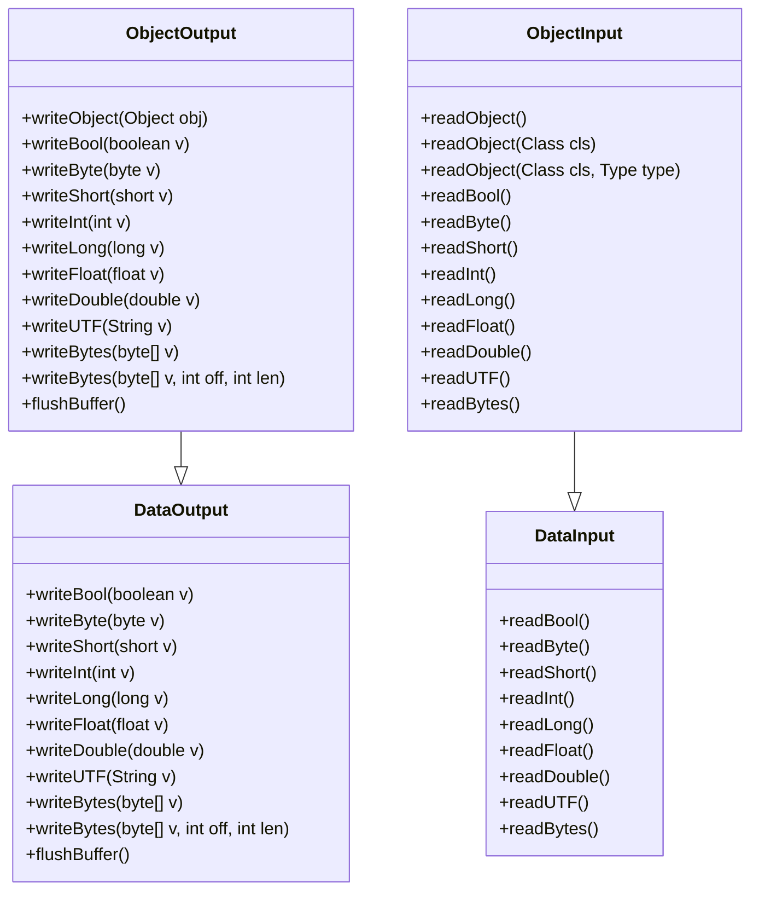
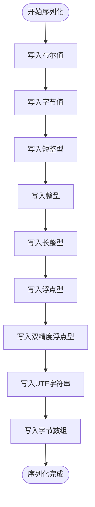
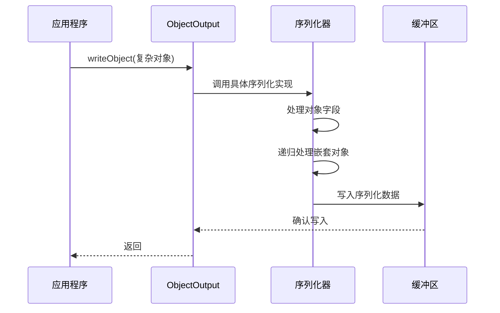
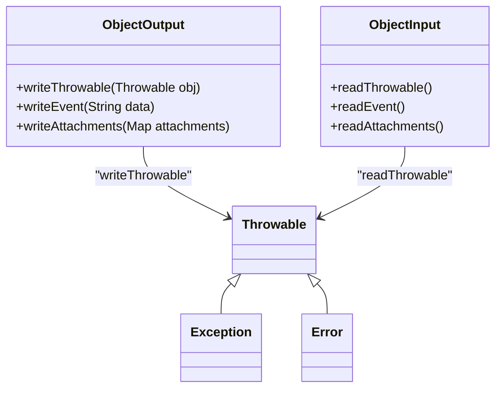
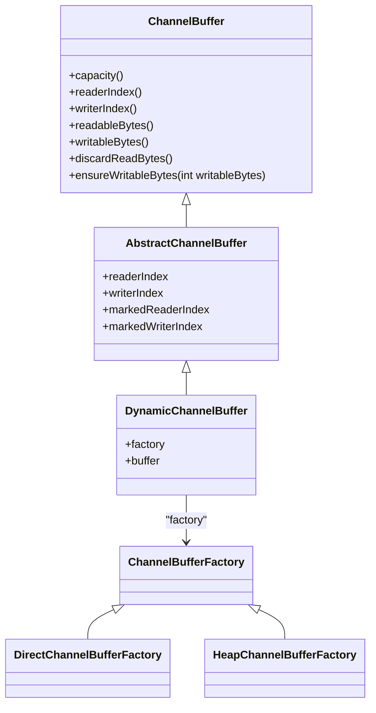
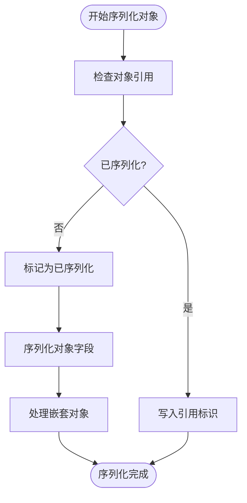
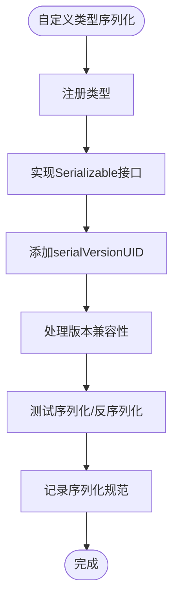
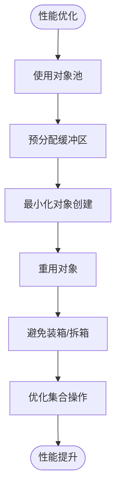

# 序列化实现

<cite>
**本文档引用的文件**   
- [ObjectOutput.java](file://dubbo-serialization\dubbo-serialization-api\src\main\java\org\apache\dubbo\common\serialize\ObjectOutput.java)
- [ObjectInput.java](file://dubbo-serialization\dubbo-serialization-api\src\main\java\org\apache\dubbo\common\serialize\ObjectInput.java)
- [DataOutput.java](file://dubbo-serialization\dubbo-serialization-api\src\main\java\org\apache\dubbo\common\serialize\DataOutput.java)
- [DataInput.java](file://dubbo-serialization\dubbo-serialization-api\src\main\java\org\apache\dubbo\common\serialize\DataInput.java)
- [Hessian2ObjectOutput.java](file://dubbo-serialization\dubbo-serialization-hessian2\src\main\java\org\apache\dubbo\common\serialize\hessian2\Hessian2ObjectOutput.java)
- [Hessian2ObjectInput.java](file://dubbo-serialization\dubbo-serialization-hessian2\src\main\java\org\apache\dubbo\common\serialize\hessian2\Hessian2ObjectInput.java)
- [FastJson2ObjectOutput.java](file://dubbo-serialization\dubbo-serialization-fastjson2\src\main\java\org\apache\dubbo\common\serialize\fastjson2\FastJson2ObjectOutput.java)
- [FastJson2ObjectInput.java](file://dubbo-serialization\dubbo-serialization-fastjson2\src\main\java\org\apache\dubbo\common\serialize\fastjson2\FastJson2ObjectInput.java)
- [ChannelBuffer.java](file://dubbo-remoting\dubbo-remoting-api\src\main\java\org\apache\dubbo\remoting\buffer\ChannelBuffer.java)
- [AbstractChannelBuffer.java](file://dubbo-remoting\dubbo-remoting-api\src\main\java\org\apache\dubbo\remoting\buffer\AbstractChannelBuffer.java)
- [DynamicChannelBuffer.java](file://dubbo-remoting\dubbo-remoting-api\src\main\java\org\apache\dubbo\remoting\buffer\DynamicChannelBuffer.java)
</cite>

## 目录
1. [引言](#引言)
2. [核心接口设计](#核心接口设计)
3. [基本类型序列化](#基本类型序列化)
4. [复杂对象与集合类型处理](#复杂对象与集合类型处理)
5. [特殊类型序列化](#特殊类型序列化)
6. [缓冲区管理策略](#缓冲区管理策略)
7. [对象引用处理机制](#对象引用处理机制)
8. [自定义类型序列化最佳实践](#自定义类型序列化最佳实践)
9. [性能优化策略](#性能优化策略)
10. [总结](#总结)

## 引言
Dubbo框架中的序列化机制是其高性能RPC通信的核心组件之一。序列化实现不仅负责将Java对象转换为字节流以便在网络中传输，还承担着反序列化、缓冲区管理、对象引用处理等关键任务。本文档深入分析Dubbo序列化实现的内部机制，重点阐述ObjectOutput和ObjectInput接口的设计原理，探讨缓冲区管理策略、对象引用处理机制以及性能优化方法。

## 核心接口设计
Dubbo序列化机制的核心是ObjectOutput和ObjectInput接口，它们定义了序列化和反序列化的标准操作。这些接口继承自DataOutput和DataInput，提供了对基本数据类型和复杂对象的统一处理方式。

**图源**
- [ObjectOutput.java](file://dubbo-serialization\dubbo-serialization-api\src\main\java\org\apache\dubbo\common\serialize\ObjectOutput.java)
- [ObjectInput.java](file://dubbo-serialization\dubbo-serialization-api\src\main\java\org\apache\dubbo\common\serialize\ObjectInput.java)
- [DataOutput.java](file://dubbo-serialization\dubbo-serialization-api\src\main\java\org\apache\dubbo\common\serialize\DataOutput.java)
- [DataInput.java](file://dubbo-serialization\dubbo-serialization-api\src\main\java\org\apache\dubbo\common\serialize\DataInput.java)

**节源**
- [ObjectOutput.java](file://dubbo-serialization\dubbo-serialization-api\src\main\java\org\apache\dubbo\common\serialize\ObjectOutput.java)
- [ObjectInput.java](file://dubbo-serialization\dubbo-serialization-api\src\main\java\org\apache\dubbo\common\serialize\ObjectInput.java)

## 基本类型序列化
对于基本数据类型，Dubbo序列化机制提供了直接的写入和读取方法。这些方法通过DataOutput和DataInput接口定义，确保了不同类型的数据能够被正确地序列化和反序列化。

**图源**
- [DataOutput.java](file://dubbo-serialization\dubbo-serialization-api\src\main\java\org\apache\dubbo\common\serialize\DataOutput.java)
- [DataInput.java](file://dubbo-serialization\dubbo-serialization-api\src\main\java\org\apache\dubbo\common\serialize\DataInput.java)

**节源**
- [DataOutput.java](file://dubbo-serialization\dubbo-serialization-api\src\main\java\org\apache\dubbo\common\serialize\DataOutput.java)
- [DataInput.java](file://dubbo-serialization\dubbo-serialization-api\src\main\java\org\apache\dubbo\common\serialize\DataInput.java)

## 复杂对象与集合类型处理
对于复杂对象和集合类型，Dubbo使用writeObject和readObject方法进行序列化和反序列化。这些方法能够处理各种Java对象，包括自定义类、集合、数组等。

**图源**
- [ObjectOutput.java](file://dubbo-serialization\dubbo-serialization-api\src\main\java\org\apache\dubbo\common\serialize\ObjectOutput.java)
- [ObjectInput.java](file://dubbo-serialization\dubbo-serialization-api\src\main\java\org\apache\dubbo\common\serialize\ObjectInput.java)

**节源**
- [ObjectOutput.java](file://dubbo-serialization\dubbo-serialization-api\src\main\java\org\apache\dubbo\common\serialize\ObjectOutput.java)
- [ObjectInput.java](file://dubbo-serialization\dubbo-serialization-api\src\main\java\org\apache\dubbo\common\serialize\ObjectInput.java)

## 特殊类型序列化
Dubbo序列化机制特别处理了异常、枚举等特殊类型。通过writeThrowable、readThrowable等方法，确保这些特殊类型能够被正确地序列化和反序列化。

**图源**
- [ObjectOutput.java](file://dubbo-serialization\dubbo-serialization-api\src\main\java\org\apache\dubbo\common\serialize\ObjectOutput.java)
- [ObjectInput.java](file://dubbo-serialization\dubbo-serialization-api\src\main\java\org\apache\dubbo\common\serialize\ObjectInput.java)

**节源**
- [ObjectOutput.java](file://dubbo-serialization\dubbo-serialization-api\src\main\java\org\apache\dubbo\common\serialize\ObjectOutput.java)
- [ObjectInput.java](file://dubbo-serialization\dubbo-serialization-api\src\main\java\org\apache\dubbo\common\serialize\ObjectInput.java)

## 缓冲区管理策略
Dubbo使用ChannelBuffer来管理序列化过程中的缓冲区。这种设计支持动态扩容、内存复用和零拷贝技术，有效提高了序列化性能。

**图源**
- [ChannelBuffer.java](file://dubbo-remoting\dubbo-remoting-api\src\main\java\org\apache\dubbo\remoting\buffer\ChannelBuffer.java)
- [AbstractChannelBuffer.java](file://dubbo-remoting\dubbo-remoting-api\src\main\java\org\apache\dubbo\remoting\buffer\AbstractChannelBuffer.java)
- [DynamicChannelBuffer.java](file://dubbo-remoting\dubbo-remoting-api\src\main\java\org\apache\dubbo\remoting\buffer\DynamicChannelBuffer.java)

**节源**
- [ChannelBuffer.java](file://dubbo-remoting\dubbo-remoting-api\src\main\java\org\apache\dubbo\remoting\buffer\ChannelBuffer.java)
- [AbstractChannelBuffer.java](file://dubbo-remoting\dubbo-remoting-api\src\main\java\org\apache\dubbo\remoting\buffer\AbstractChannelBuffer.java)
- [DynamicChannelBuffer.java](file://dubbo-remoting\dubbo-remoting-api\src\main\java\org\apache\dubbo\remoting\buffer\DynamicChannelBuffer.java)

## 对象引用处理机制
为了防止循环引用导致的序列化问题，Dubbo序列化机制实现了对象引用处理。通过维护已序列化对象的引用，避免重复序列化同一对象。

**图源**
- [Hessian2ObjectOutput.java](file://dubbo-serialization\dubbo-serialization-hessian2\src\main\java\org\apache\dubbo\common\serialize\hessian2\Hessian2ObjectOutput.java)
- [Hessian2ObjectInput.java](file://dubbo-serialization\dubbo-serialization-hessian2\src\main\java\org\apache\dubbo\common\serialize\hessian2\Hessian2ObjectInput.java)

**节源**
- [Hessian2ObjectOutput.java](file://dubbo-serialization\dubbo-serialization-hessian2\src\main\java\org\apache\dubbo\common\serialize\hessian2\Hessian2ObjectOutput.java)
- [Hessian2ObjectInput.java](file://dubbo-serialization\dubbo-serialization-hessian2\src\main\java\org\apache\dubbo\common\serialize\hessian2\Hessian2ObjectInput.java)

## 自定义类型序列化最佳实践
对于自定义类型序列化，建议遵循以下最佳实践：正确注册类型、实现版本控制、确保兼容性处理。

**图源**
- [FastJson2ObjectOutput.java](file://dubbo-serialization\dubbo-serialization-fastjson2\src\main\java\org\apache\dubbo\common\serialize\fastjson2\FastJson2ObjectOutput.java)
- [FastJson2ObjectInput.java](file://dubbo-serialization\dubbo-serialization-fastjson2\src\main\java\org\apache\dubbo\common\serialize\fastjson2\FastJson2ObjectInput.java)

**节源**
- [FastJson2ObjectOutput.java](file://dubbo-serialization\dubbo-serialization-fastjson2\src\main\java\org\apache\dubbo\common\serialize\fastjson2\FastJson2ObjectOutput.java)
- [FastJson2ObjectInput.java](file://dubbo-serialization\dubbo-serialization-fastjson2\src\main\java\org\apache\dubbo\common\serialize\fastjson2\FastJson2ObjectInput.java)

## 性能优化策略
为了优化序列化性能，减少内存分配和GC压力，可以采用以下策略：使用对象池、预分配缓冲区、避免不必要的对象创建。

**图源**
- [FastJson2ObjectOutput.java](file://dubbo-serialization\dubbo-serialization-fastjson2\src\main\java\org\apache\dubbo\common\serialize\fastjson2\FastJson2ObjectOutput.java)
- [FastJson2ObjectInput.java](file://dubbo-serialization\dubbo-serialization-fastjson2\src\main\java\org\apache\dubbo\common\serialize\fastjson2\FastJson2ObjectInput.java)

**节源**
- [FastJson2ObjectOutput.java](file://dubbo-serialization\dubbo-serialization-fastjson2\src\main\java\org\apache\dubbo\common\serialize\fastjson2\FastJson2ObjectOutput.java)
- [FastJson2ObjectInput.java](file://dubbo-serialization\dubbo-serialization-fastjson2\src\main\java\org\apache\dubbo\common\serialize\fastjson2\FastJson2ObjectInput.java)

## 总结
Dubbo的序列化实现通过精心设计的ObjectOutput和ObjectInput接口，提供了高效、灵活的序列化机制。通过合理的缓冲区管理策略、对象引用处理机制和性能优化方法，确保了在高并发场景下的稳定性和高性能。开发者在使用自定义类型序列化时，应遵循最佳实践，确保类型注册、版本控制和兼容性处理的正确性。