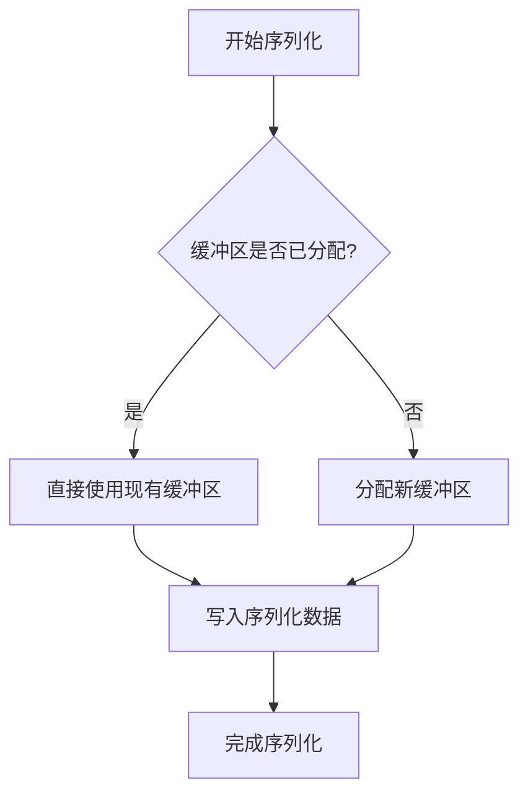
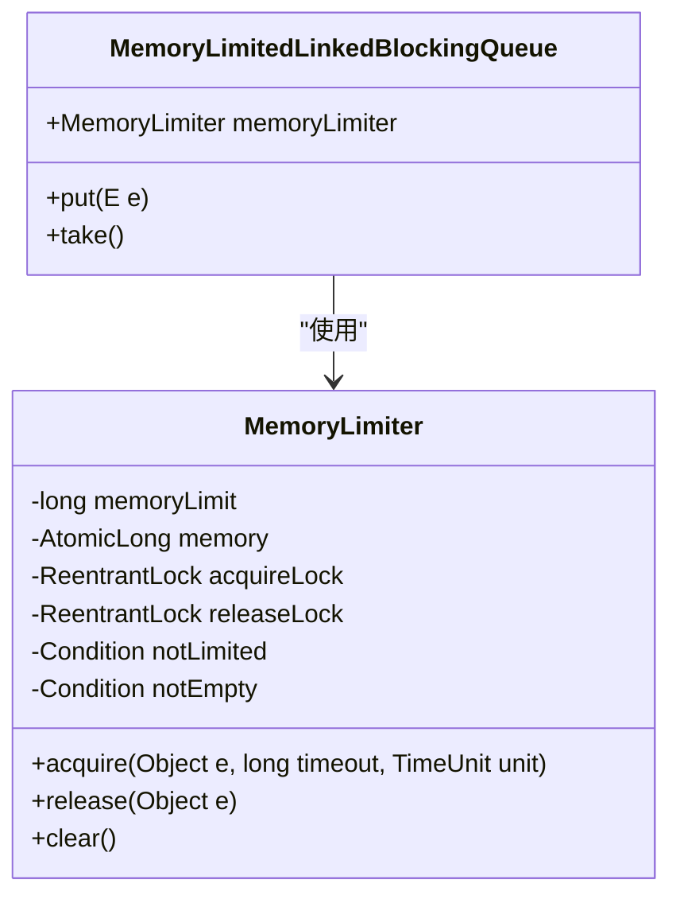
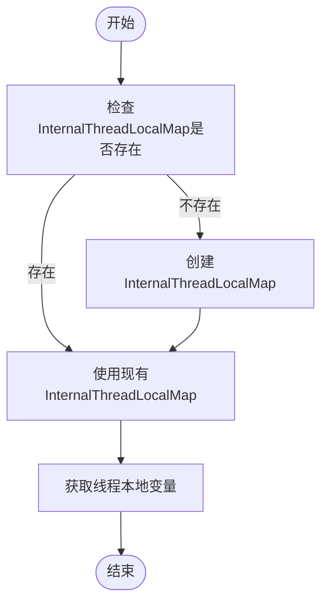
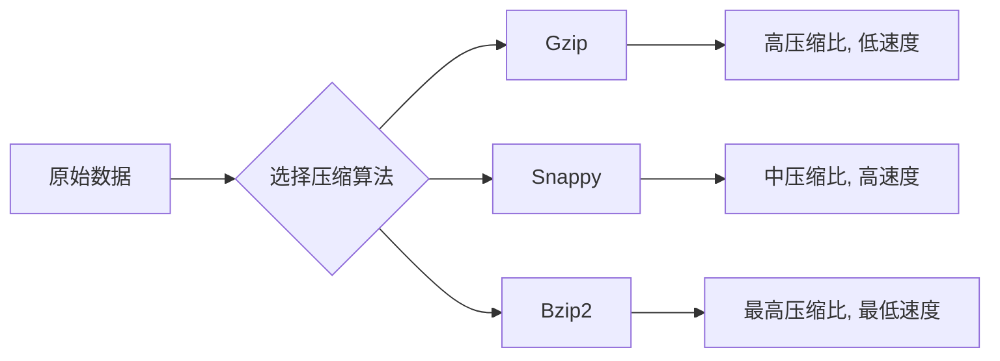
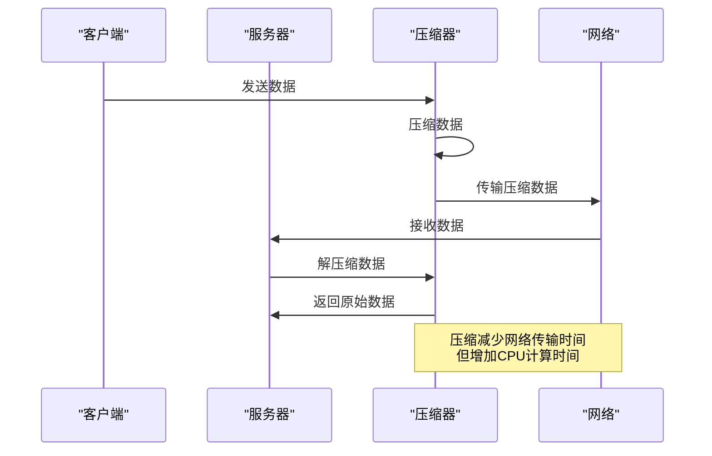
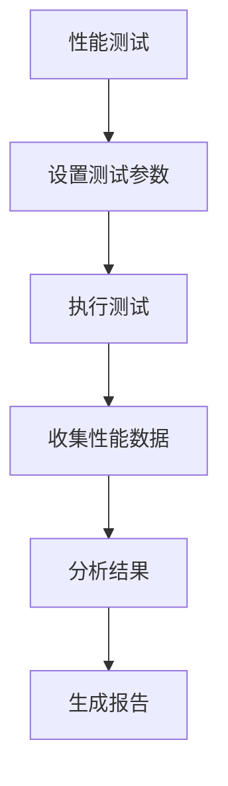

# 性能优化

<cite>
**本文档引用的文件**  
- [Serialization.java](file://dubbo-serialization\dubbo-serialization-api\src\main\java\org\apache\dubbo\common\serialize\Serialization.java)
- [ObjectOutput.java](file://dubbo-serialization\dubbo-serialization-api\src\main\java\org\apache\dubbo\common\serialize\ObjectOutput.java)
- [ObjectInput.java](file://dubbo-serialization\dubbo-serialization-api\src\main\java\org\apache\dubbo\common\serialize\ObjectInput.java)
- [ChannelBuffer.java](file://dubbo-remoting\dubbo-remoting-api\src\main\java\org\apache\dubbo\remoting\buffer\ChannelBuffer.java)
- [Compressor.java](file://dubbo-rpc\dubbo-rpc-triple\src\main\java\org\apache\dubbo\rpc\protocol\tri\compressor\Compressor.java)
- [DeCompressor.java](file://dubbo-rpc\dubbo-rpc-triple\src\main\java\org\apache\dubbo\rpc\protocol\tri\compressor\DeCompressor.java)
- [Bzip2.java](file://dubbo-rpc\dubbo-rpc-triple\src\main\java\org\apache\dubbo\rpc\protocol\tri\compressor\Bzip2.java)
- [Snappy.java](file://dubbo-rpc\dubbo-rpc-triple\src\main\java\org\apache\dubbo\rpc\protocol\tri\compressor\Snappy.java)
- [GzipTest.java](file://dubbo-rpc\dubbo-rpc-triple\src\test\java\org\apache\dubbo\rpc\protocol\tri\compressor\GzipTest.java)
- [Bzip2Test.java](file://dubbo-rpc\dubbo-rpc-triple\src\test\java\org\apache\dubbo\rpc\protocol\tri\compressor\Bzip2Test.java)
- [SnappyTest.java](file://dubbo-rpc\dubbo-rpc-triple\src\test\java\org\apache\dubbo\rpc\protocol\tri\compressor\SnappyTest.java)
- [DubboMergingDigest.java](file://dubbo-metrics\dubbo-metrics-api\src\main\java\org\apache\dubbo\metrics\aggregate\DubboMergingDigest.java)
- [MemoryLimiter.java](file://dubbo-common\src\main\java\org\apache\dubbo\common\threadpool\MemoryLimiter.java)
- [InternalThreadLocalMap.java](file://dubbo-common\src\main\java\org\apache\dubbo\common\threadlocal\InternalThreadLocalMap.java)
</cite>

## 目录
1. [引言](#引言)
2. [序列化性能影响因素](#序列化性能影响因素)
3. [缓冲区优化技术](#缓冲区优化技术)
4. [对象复用机制](#对象复用机制)
5. [压缩技术应用](#压缩技术应用)
6. [性能测试方法与基准](#性能测试方法与基准)
7. [高并发场景调优建议](#高并发场景调优建议)
8. [最佳实践总结](#最佳实践总结)

## 引言

Dubbo作为高性能的RPC框架，其序列化性能对整体系统性能有着至关重要的影响。序列化是将对象转换为字节流以便在网络中传输或持久化存储的过程，而反序列化则是将字节流还原为对象的过程。在分布式系统中，这两个过程频繁发生，因此其性能直接关系到系统的吞吐量、延迟和资源消耗。

本文档系统性地介绍Dubbo序列化性能优化策略，分析影响序列化性能的关键因素，包括序列化格式选择、对象复杂度、网络传输开销等。详细说明缓冲区优化技术，如预分配缓冲区、缓冲区池化和零拷贝传输。探讨对象复用机制，减少对象创建和垃圾回收开销。介绍压缩技术的应用，包括何时使用压缩、选择合适的压缩算法以及压缩与解压缩的性能权衡。提供性能测试方法和基准，帮助开发者评估不同序列化方案的性能表现。最后给出在高并发场景下的调优建议和最佳实践。

**本节来源**
- [Serialization.java](file://dubbo-serialization\dubbo-serialization-api\src\main\java\org\apache\dubbo\common\serialize\Serialization.java)

## 序列化性能影响因素

### 序列化格式选择

序列化格式的选择是影响性能的首要因素。Dubbo支持多种序列化方式，其中默认使用Hessian2。不同的序列化格式在性能、兼容性、可读性等方面各有优劣。

- **Hessian2**: Dubbo默认的序列化方式，性能较好，兼容性高，支持跨语言。
- **JSON**: 可读性强，易于调试，但性能较差，序列化后的数据体积较大。
- **Protobuf**: 性能优秀，数据体积小，但需要预定义schema，灵活性较差。
- **Kryo**: 性能极佳，但兼容性较差，不支持跨语言。

选择合适的序列化格式需要在性能、兼容性和开发效率之间进行权衡。

### 对象复杂度

对象的复杂度直接影响序列化性能。复杂对象包含更多的字段、嵌套结构和引用关系，序列化时需要处理更多的数据，导致性能下降。

- **字段数量**: 对象包含的字段越多，序列化时间越长。
- **嵌套深度**: 对象的嵌套层次越深，序列化过程越复杂。
- **引用关系**: 对象之间的引用关系可能导致循环引用，增加序列化难度。

### 网络传输开销

序列化后的数据需要通过网络传输，因此网络传输开销也是影响性能的重要因素。

- **数据体积**: 序列化后的数据体积越大，网络传输时间越长。
- **带宽**: 网络带宽限制了数据传输速度。
- **延迟**: 网络延迟影响了请求的响应时间。

**本节来源**
- [Serialization.java](file://dubbo-serialization\dubbo-serialization-api\src\main\java\org\apache\dubbo\common\serialize\Serialization.java)
- [ObjectOutput.java](file://dubbo-serialization\dubbo-serialization-api\src\main\java\org\apache\dubbo\common\serialize\ObjectOutput.java)
- [ObjectInput.java](file://dubbo-serialization\dubbo-serialization-api\src\main\java\org\apache\dubbo\common\serialize\ObjectInput.java)

## 缓冲区优化技术

### 预分配缓冲区

预分配缓冲区可以避免在序列化过程中频繁分配内存，减少垃圾回收压力。Dubbo中的`ChannelBuffer`接口提供了对缓冲区的抽象，支持预分配和动态扩展。

**图示来源**
- [ChannelBuffer.java](file://dubbo-remoting\dubbo-remoting-api\src\main\java\org\apache\dubbo\remoting\buffer\ChannelBuffer.java)

### 缓冲区池化

缓冲区池化技术通过复用已分配的缓冲区，进一步减少内存分配和垃圾回收开销。Dubbo中的`ChannelBuffers`类提供了缓冲区池的实现。

- **减少内存分配**: 通过复用缓冲区，避免了频繁的内存分配和释放。
- **降低GC压力**: 减少了短生命周期对象的创建，降低了垃圾回收的频率和开销。

### 零拷贝传输

零拷贝技术通过避免数据在用户空间和内核空间之间的多次拷贝，提高数据传输效率。Dubbo利用NIO的`ByteBuffer`和`FileChannel`等特性，实现了零拷贝传输。

- **Direct Buffer**: 使用直接内存缓冲区，避免了JVM堆内存和操作系统内存之间的数据拷贝。
- **FileChannel.transferTo()**: 利用操作系统的零拷贝特性，直接将文件数据传输到网络通道。

**本节来源**
- [ChannelBuffer.java](file://dubbo-remoting\dubbo-remoting-api\src\main\java\org\apache\dubbo\remoting\buffer\ChannelBuffer.java)
- [AbstractChannelBuffer.java](file://dubbo-remoting\dubbo-remoting-api\src\main\java\org\apache\dubbo\remoting\buffer\AbstractChannelBuffer.java)

## 对象复用机制

### 内存限制队列

Dubbo中的`MemoryLimitedLinkedBlockingQueue`通过`MemoryLimiter`对队列中的对象进行内存使用监控和限制，防止内存溢出。

**图示来源**
- [MemoryLimiter.java](file://dubbo-common\src\main\java\org\apache\dubbo\common\threadpool\MemoryLimiter.java)
- [MemoryLimitedLinkedBlockingQueue.java](file://dubbo-common\src\main\java\org\apache\dubbo\common\threadpool\MemoryLimitedLinkedBlockingQueue.java)

### 线程本地存储

Dubbo利用`InternalThreadLocalMap`实现线程本地存储，减少对象创建和垃圾回收开销。

- **InternalThreadLocal**: 自定义的线程本地变量，性能优于JDK的`ThreadLocal`。
- **Fast Thread Local**: 通过数组索引访问，避免了哈希查找的开销。

**图示来源**
- [InternalThreadLocalMap.java](file://dubbo-common\src\main\java\org\apache\dubbo\common\threadlocal\InternalThreadLocalMap.java)
- [InternalThreadLocalTest.java](file://dubbo-common\src\test\java\org\apache\dubbo\common\threadlocal\InternalThreadLocalTest.java)

**本节来源**
- [InternalThreadLocalMap.java](file://dubbo-common\src\main\java\org\apache\dubbo\common\threadlocal\InternalThreadLocalMap.java)
- [MemoryLimiter.java](file://dubbo-common\src\main\java\org\apache\dubbo\common\threadpool\MemoryLimiter.java)

## 压缩技术应用

### 压缩算法选择

Dubbo支持多种压缩算法，包括Gzip、Snappy和Bzip2。不同的压缩算法在压缩比和压缩速度上各有特点。

- **Gzip**: 压缩比较高，但压缩和解压缩速度较慢。
- **Snappy**: 压缩速度非常快，压缩比适中，适合对性能要求较高的场景。
- **Bzip2**: 压缩比最高，但压缩和解压缩速度最慢。

**图示来源**
- [Compressor.java](file://dubbo-rpc\dubbo-rpc-triple\src\main\java\org\apache\dubbo\rpc\protocol\tri\compressor\Compressor.java)
- [DeCompressor.java](file://dubbo-rpc\dubbo-rpc-triple\src\main\java\org\apache\dubbo\rpc\protocol\tri\compressor\DeCompressor.java)

### 压缩与解压缩性能权衡

压缩可以减少网络传输的数据量，但会增加CPU的计算开销。因此，需要在压缩比和性能之间进行权衡。

- **小数据量**: 对于小数据量，压缩的收益可能不足以抵消压缩开销，建议不压缩。
- **大数据量**: 对于大数据量，压缩可以显著减少网络传输时间，建议使用压缩。
- **CPU资源**: 在CPU资源紧张的场景下，应谨慎使用压缩，避免增加CPU负载。

**图示来源**
- [Bzip2.java](file://dubbo-rpc\dubbo-rpc-triple\src\main\java\org\apache\dubbo\rpc\protocol\tri\compressor\Bzip2.java)
- [Snappy.java](file://dubbo-rpc\dubbo-rpc-triple\src\main\java\org\apache\dubbo\rpc\protocol\tri\compressor\Snappy.java)
- [GzipTest.java](file://dubbo-rpc\dubbo-rpc-triple\src\test\java\org\apache\dubbo\rpc\protocol\tri\compressor\GzipTest.java)

**本节来源**
- [Compressor.java](file://dubbo-rpc\dubbo-rpc-triple\src\main\java\org\apache\dubbo\rpc\protocol\tri\compressor\Compressor.java)
- [DeCompressor.java](file://dubbo-rpc\dubbo-rpc-triple\src\main\java\org\apache\dubbo\rpc\protocol\tri\compressor\DeCompressor.java)
- [Bzip2.java](file://dubbo-rpc\dubbo-rpc-triple\src\main\java\org\apache\dubbo\rpc\protocol\tri\compressor\Bzip2.java)
- [Snappy.java](file://dubbo-rpc\dubbo-rpc-triple\src\main\java\org\apache\dubbo\rpc\protocol\tri\compressor\Snappy.java)

## 性能测试方法与基准

### 性能测试框架

Dubbo提供了完善的性能测试框架，包括单元测试和集成测试。通过性能测试，可以评估不同序列化方案的性能表现。

- **单元测试**: 针对单个组件进行性能测试，如序列化、反序列化、压缩等。
- **集成测试**: 针对整个系统进行性能测试，评估端到端的性能。

### 性能基准

通过性能基准测试，可以量化不同优化策略的效果。例如，在`DubboMergingDigest`类中，通过实验数据展示了不同缓冲区大小对性能的影响。

**图示来源**
- [DubboMergingDigest.java](file://dubbo-metrics\dubbo-metrics-api\src\main\java\org\apache\dubbo\metrics\aggregate\DubboMergingDigest.java)

**本节来源**
- [DubboMergingDigest.java](file://dubbo-metrics\dubbo-metrics-api\src\main\java\org\apache\dubbo\metrics\aggregate\DubboMergingDigest.java)
- [Bzip2Test.java](file://dubbo-rpc\dubbo-rpc-triple\src\test\java\org\apache\dubbo\rpc\protocol\tri\compressor\Bzip2Test.java)
- [SnappyTest.java](file://dubbo-rpc\dubbo-rpc-triple\src\test\java\org\apache\dubbo\rpc\protocol\tri\compressor\SnappyTest.java)

## 高并发场景调优建议

### 线程池配置

在高并发场景下，合理的线程池配置至关重要。应根据系统的CPU核心数和业务特点，调整线程池的大小。

- **核心线程数**: 设置为核心数的1-2倍。
- **最大线程数**: 根据系统资源和业务需求设置。
- **队列大小**: 避免队列过大导致内存溢出。

### 连接池管理

连接池管理可以减少连接创建和销毁的开销，提高系统性能。

- **连接复用**: 复用已建立的连接，避免频繁创建新连接。
- **连接超时**: 设置合理的连接超时时间，避免连接长时间占用。

### 资源监控

在高并发场景下，应加强对系统资源的监控，及时发现和解决性能瓶颈。

- **CPU使用率**: 监控CPU使用率，避免CPU过载。
- **内存使用**: 监控内存使用情况，防止内存泄漏。
- **网络带宽**: 监控网络带宽使用，确保网络通畅。

**本节来源**
- [MemoryLimiter.java](file://dubbo-common\src\main\java\org\apache\dubbo\common\threadpool\MemoryLimiter.java)
- [ChannelBuffer.java](file://dubbo-remoting\dubbo-remoting-api\src\main\java\org\apache\dubbo\remoting\buffer\ChannelBuffer.java)

## 最佳实践总结

1. **选择合适的序列化格式**: 根据业务需求选择性能和兼容性最佳的序列化格式。
2. **优化对象结构**: 简化对象结构，减少字段数量和嵌套深度。
3. **使用缓冲区池化**: 复用缓冲区，减少内存分配和垃圾回收开销。
4. **合理使用压缩**: 在大数据量传输时使用压缩，小数据量时避免压缩。
5. **预分配资源**: 预分配缓冲区和连接，减少运行时开销。
6. **监控系统性能**: 实时监控系统资源使用情况，及时发现和解决性能问题。

通过以上优化策略，可以显著提升Dubbo系统的序列化性能，满足高并发、低延迟的业务需求。

**本节来源**
- [Serialization.java](file://dubbo-serialization\dubbo-serialization-api\src\main\java\org\apache\dubbo\common\serialize\Serialization.java)
- [ChannelBuffer.java](file://dubbo-remoting\dubbo-remoting-api\src\main\java\org\apache\dubbo\remoting\buffer\ChannelBuffer.java)
- [Compressor.java](file://dubbo-rpc\dubbo-rpc-triple\src\main\java\org\apache\dubbo\rpc\protocol\tri\compressor\Compressor.java)