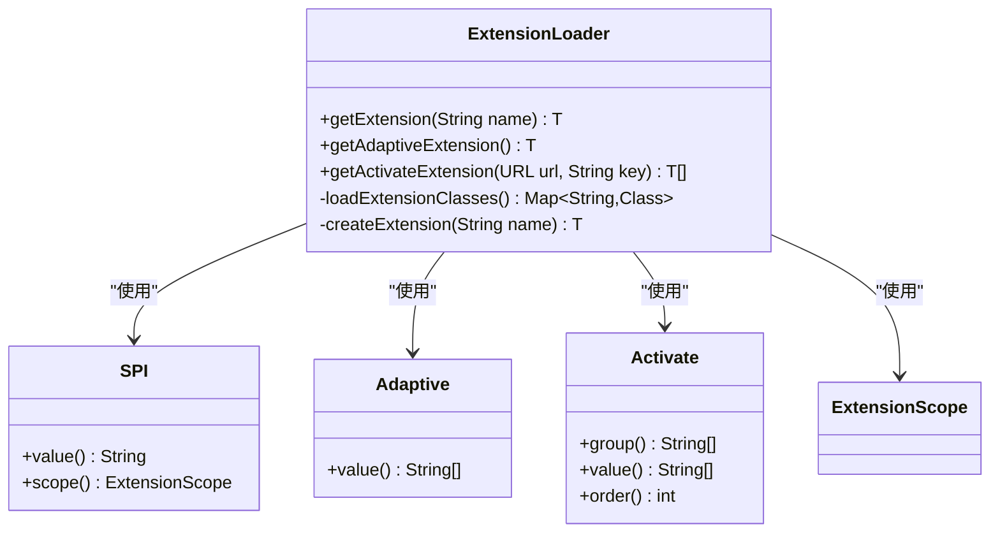
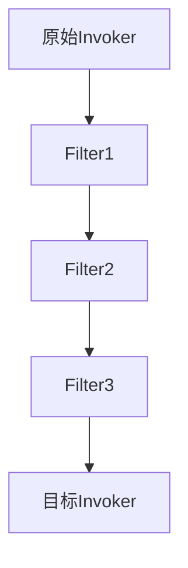
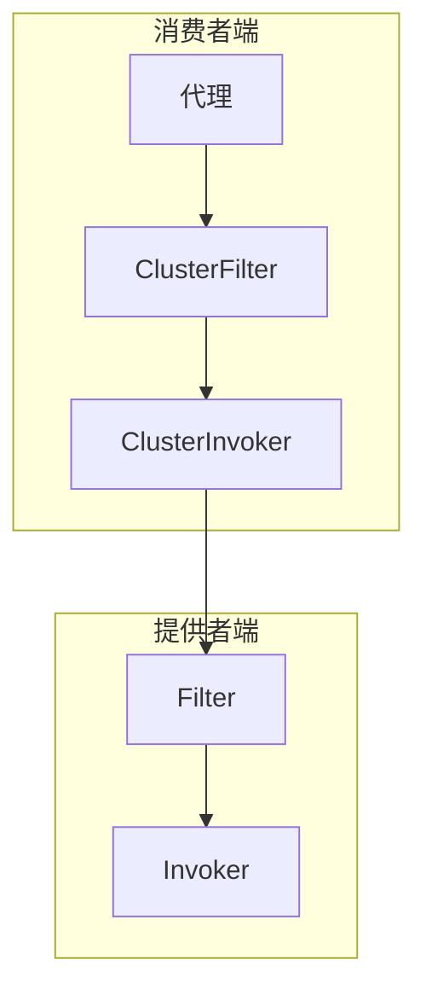
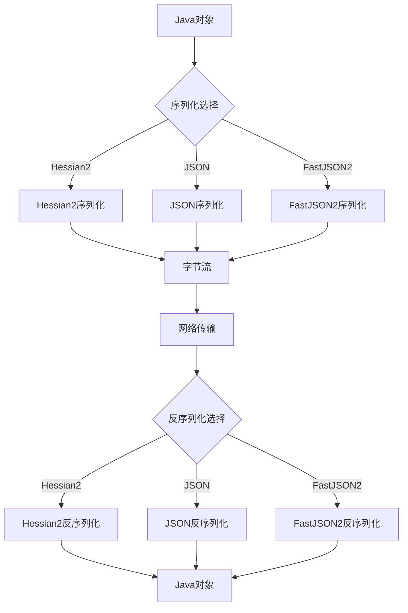
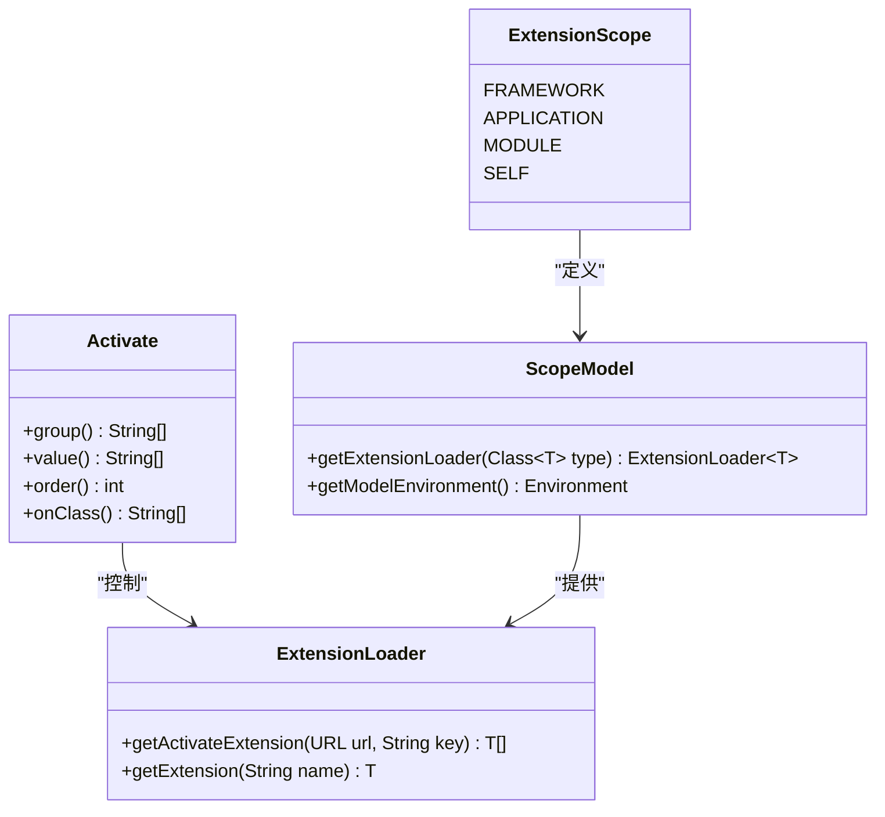

# 扩展机制

<cite>
**本文档中引用的文件**   
- [SPI.java](file://dubbo-common\src\main\java\org\apache\dubbo\common\extension\SPI.java)
- [Adaptive.java](file://dubbo-common\src\main\java\org\apache\dubbo\common\extension\Adaptive.java)
- [ExtensionLoader.java](file://dubbo-common\src\main\java\org\apache\dubbo\common\extension\ExtensionLoader.java)
- [Activate.java](file://dubbo-common\src\main\java\org\apache\dubbo\common\extension\Activate.java)
- [Filter.java](file://dubbo-rpc\dubbo-rpc-api\src\main\java\org\apache\dubbo\rpc\Filter.java)
- [Serialization.java](file://dubbo-serialization\dubbo-serialization-api\src\main\java\org\apache\dubbo\common\serialize\Serialization.java)
- [FilterChainBuilder.java](file://dubbo-cluster\src\main\java\org\apache\dubbo\rpc\cluster\filter\FilterChainBuilder.java)
- [CodecSupport.java](file://dubbo-remoting\dubbo-remoting-api\src\main\java\org\apache\dubbo\remoting\transport\CodecSupport.java)
</cite>

## 目录
1. [引言](#引言)
2. [SPI扩展机制](#spi扩展机制)
3. [过滤器链工作原理](#过滤器链工作原理)
4. [序列化扩展机制](#序列化扩展机制)
5. [扩展点高级特性](#扩展点高级特性)
6. [扩展示例](#扩展示例)
7. [最佳实践](#最佳实践)
8. [结论](#结论)

## 引言

Dubbo作为一个高性能的Java RPC框架，其核心优势之一是其强大的扩展机制。Dubbo采用自定义的SPI（Service Provider Interface）机制，实现了高度可扩展的插件化架构。这种设计允许开发者在不修改框架源码的情况下，通过简单的配置和实现接口来扩展框架功能。

Dubbo的扩展机制基于Java的SPI思想，但进行了深度优化和增强，解决了Java原生SPI的诸多局限性，如无法按需加载、无法控制加载顺序、无法实现依赖注入等问题。通过Dubbo的扩展机制，开发者可以轻松地定制协议、序列化方式、负载均衡策略、集群容错、过滤器等多种核心组件。

本文档将深入剖析Dubbo的扩展机制，从SPI的基本原理到高级特性，从过滤器链的工作方式到序列化协议的扩展，为开发者提供全面的技术指导和实践参考。

## SPI扩展机制

Dubbo的SPI（Service Provider Interface）机制是其插件化架构的核心，它提供了一套完整的扩展点发现、加载和管理机制。与Java原生SPI不同，Dubbo的SPI机制具有按需加载、自适应实例、扩展优先级控制等高级特性。

### 扩展点定义

在Dubbo中，一个接口要成为扩展点，必须使用`@SPI`注解进行标记。该注解定义了扩展点的基本属性，包括默认扩展实现和作用域。

```java
@SPI("dubbo")
public interface Protocol {
    // 协议接口定义
}
```

`@SPI`注解的`value`属性指定了默认的扩展实现名称。当没有明确指定使用哪个扩展时，Dubbo将加载默认的扩展实现。此外，`@SPI`注解还支持`scope`属性，用于定义扩展的作用域，包括FRAMEWORK（框架级）、APPLICATION（应用级）、MODULE（模块级）等。

### 扩展实现发现与加载

Dubbo的扩展实现通过配置文件进行声明，配置文件位于`META-INF/dubbo/`或`META-INF/dubbo/internal/`目录下，文件名是扩展接口的全限定名。配置文件采用键值对格式：

```
dubbo=org.apache.dubbo.rpc.protocol.dubbo.DubboProtocol
http=org.apache.dubbo.rpc.protocol.http.HttpProtocol
```

这种键值对格式相比传统的单行类名格式具有明显优势：当扩展实现因依赖缺失而无法加载时，Dubbo可以准确地报告是哪个扩展ID（如"dubbo"）加载失败，便于问题定位。

扩展的加载由`ExtensionLoader`类负责，它是Dubbo SPI机制的核心。`ExtensionLoader`采用懒加载策略，只有在首次请求某个扩展时才会加载其实现类。加载过程包括：

1. **扩展类加载**：从配置文件中读取所有扩展实现类，缓存到内存中
2. **实例化**：通过反射创建扩展实例
3. **依赖注入**：自动注入扩展实例依赖的其他扩展
4. **包装**：应用AOP包装器，实现功能增强

### 自适应扩展

Dubbo的SPI机制支持自适应扩展（Adaptive Extension），这是其最强大的特性之一。通过`@Adaptive`注解，Dubbo可以动态生成代理类，在运行时根据URL参数决定使用哪个具体的扩展实现。

```java
@Adaptive("protocol")
public Protocol getProtocol(URL url);
```

当调用自适应方法时，Dubbo会检查URL中的"protocol"参数，根据参数值选择对应的Protocol扩展。如果参数不存在，则使用默认扩展。这种机制使得扩展的选择完全动态化，无需硬编码。

**扩展机制核心组件**



**图源**
- [SPI.java](file://dubbo-common\src\main\java\org\apache\dubbo\common\extension\SPI.java)
- [Adaptive.java](file://dubbo-common\src\main\java\org\apache\dubbo\common\extension\Adaptive.java)
- [ExtensionLoader.java](file://dubbo-common\src\main\java\org\apache\dubbo\common\extension\ExtensionLoader.java)
- [Activate.java](file://dubbo-common\src\main\java\org\apache\dubbo\common\extension\Activate.java)

**本节源码**
- [SPI.java](file://dubbo-common\src\main\java\org\apache\dubbo\common\extension\SPI.java#L25-L154)
- [ExtensionLoader.java](file://dubbo-common\src\main\java\org\apache\dubbo\common\extension\ExtensionLoader.java#L92-L800)

## 过滤器链工作原理

过滤器链（Filter Chain）是Dubbo实现AOP（面向切面编程）的核心机制，它允许在RPC调用的前后插入自定义逻辑，如日志记录、性能监控、权限验证、缓存处理等。过滤器链采用责任链模式，将多个过滤器串联起来，形成一个处理管道。

### 过滤器接口

Dubbo的过滤器通过`Filter`接口定义，该接口继承自`BaseFilter`，并使用`@SPI`注解标记为扩展点：

```java
@SPI(scope = ExtensionScope.MODULE)
public interface Filter extends BaseFilter {}
```

每个过滤器需要实现`invoke`方法，在该方法中可以执行前置处理、调用下一个过滤器或直接调用目标方法、执行后置处理。

### 过滤器链构建

过滤器链的构建由`FilterChainBuilder`类负责。在服务提供者端，当创建Invoker时，`FilterChainBuilder`会根据配置加载所有激活的过滤器，并将它们包装成一个责任链。



构建过程如下：
1. 获取所有激活的过滤器扩展
2. 按照优先级排序
3. 从内到外逐层包装Invoker
4. 返回包装后的Invoker

### 过滤器执行流程

当客户端发起调用时，请求会依次经过过滤器链中的每个过滤器。每个过滤器可以选择：
- 直接处理请求并返回结果
- 修改请求参数后继续传递
- 记录日志或监控信息后继续传递
- 抛出异常中断调用

```java
public Result invoke(Invoker<?> invoker, Invocation invocation) throws RpcException {
    // 前置处理
    log.info("Before invocation: " + invocation.getMethodName());
    
    try {
        // 调用下一个节点
        Result result = invoker.invoke(invocation);
        
        // 后置处理
        log.info("After invocation: " + invocation.getMethodName());
        return result;
    } catch (Exception e) {
        // 异常处理
        log.error("Invocation failed: " + e.getMessage());
        throw e;
    }
}
```

Dubbo 3.0对过滤器链进行了重构，引入了`ClusterFilter`概念，实现了消费者端过滤器的分层处理，使得过滤器可以在负载均衡之前和之后分别执行。

**过滤器链示意图**



**图源**
- [Filter.java](file://dubbo-rpc\dubbo-rpc-api\src\main\java\org\apache\dubbo\rpc\Filter.java#L22-L70)
- [FilterChainBuilder.java](file://dubbo-cluster\src\main\java\org\apache\dubbo\rpc\cluster\filter\FilterChainBuilder.java#L55-L341)

**本节源码**
- [Filter.java](file://dubbo-rpc\dubbo-rpc-api\src\main\java\org\apache\dubbo\rpc\Filter.java#L68-L70)
- [FilterChainBuilder.java](file://dubbo-cluster\src\main\java\org\apache\dubbo\rpc\cluster\filter\FilterChainBuilder.java#L55-L341)

## 序列化扩展机制

序列化是RPC框架的核心组件之一，负责将Java对象转换为字节流进行网络传输，并在接收端反序列化还原。Dubbo提供了灵活的序列化扩展机制，支持多种序列化协议，并允许开发者自定义序列化方式。

### 序列化接口

Dubbo的序列化机制通过`Serialization`接口定义，该接口标记为SPI扩展点：

```java
@SPI(scope = ExtensionScope.FRAMEWORK)
public interface Serialization {
    byte getContentTypeId();
    String getContentType();
    ObjectOutput serialize(URL url, OutputStream output) throws IOException;
    ObjectInput deserialize(URL url, InputStream input) throws IOException;
}
```

`@SPI`注解的`scope`属性设置为`FRAMEWORK`，表示序列化扩展是框架级的，所有应用共享。

### 序列化实现

Dubbo内置了多种序列化实现，如Hessian2、JSON、FastJSON2等，这些实现通过配置文件注册：

```
hessian2=org.apache.dubbo.common.serialize.hessian2.Hessian2Serialization
json=org.apache.dubbo.common.serialize.json.JsonSerialization
fastjson2=org.apache.dubbo.common.serialize.fastjson2.FastJson2Serialization
```

每种序列化实现必须提供唯一的`contentTypeId`，该ID用于在协议头中标识序列化类型。由于Dubbo协议头只使用5位来记录序列化ID，因此ID值不能超过31。

### 序列化选择与使用

序列化方式的选择可以通过多种方式配置：
- 全局配置：在`dubbo.properties`中设置`dubbo.protocol.serialization`
- 协议级别：在`<dubbo:protocol>`标签中设置`serialization`属性
- 服务级别：在`<dubbo:service>`标签中设置`serialization`属性

在运行时，`CodecSupport`类负责根据URL参数选择合适的序列化实现：

```java
public static Serialization getSerialization(URL url) {
    return url.getOrDefaultFrameworkModel()
            .getExtensionLoader(Serialization.class)
            .getExtension(UrlUtils.serializationOrDefault(url));
}
```

**序列化机制流程图**



**图源**
- [Serialization.java](file://dubbo-serialization\dubbo-serialization-api\src\main\java\org\apache\dubbo\common\serialize\Serialization.java#L36-L77)
- [CodecSupport.java](file://dubbo-remoting\dubbo-remoting-api\src\main\java\org\apache\dubbo\remoting\transport\CodecSupport.java#L53-L104)

**本节源码**
- [Serialization.java](file://dubbo-serialization\dubbo-serialization-api\src\main\java\org\apache\dubbo\common\serialize\Serialization.java#L36-L77)
- [CodecSupport.java](file://dubbo-remoting\dubbo-remoting-api\src\main\java\org\apache\dubbo\remoting\transport\CodecSupport.java#L53-L104)

## 扩展点高级特性

Dubbo的扩展机制不仅提供了基本的扩展功能，还包含了一系列高级特性，使得扩展更加灵活和强大。这些特性包括扩展优先级控制、条件加载、依赖注入等。

### 扩展优先级控制

Dubbo支持通过`@Activate`注解的`order`属性来控制扩展的执行顺序。数值越小，优先级越高，越早执行。

```java
@Activate(order = 10)
public class CacheFilter implements Filter {
    // 缓存过滤器，优先级较高
}

@Activate(order = 100)
public class MetricsFilter implements Filter {
    // 监控过滤器，优先级较低
}
```

此外，`@Activate`注解还支持`before`和`after`属性（已废弃），用于指定扩展相对于其他扩展的执行顺序。

### 条件加载

`@Activate`注解的核心功能是条件激活，可以根据组别、URL参数等条件决定是否激活某个扩展。

```java
@Activate(group = "provider", value = "cache")
public class CacheFilter implements Filter {
    // 只有在提供者端且启用缓存时才激活
}
```

- `group`属性：指定扩展激活的组别，如"provider"（提供者端）、"consumer"（消费者端）
- `value`属性：指定URL参数键，当这些参数存在时激活扩展
- `onClass`属性：当指定的类在classpath中存在时激活扩展

### 依赖注入

Dubbo的扩展机制支持自动依赖注入，扩展实例中声明的其他扩展类型字段会被自动注入。

```java
public class MyFilter implements Filter {
    private Protocol protocol; // 会被自动注入
    
    private Model model; // 会被自动注入
    
    // 过滤器逻辑
}
```

这种依赖注入机制基于ExtensionLoader的IOC容器实现，确保了扩展之间的松耦合。

### 作用域管理

Dubbo引入了作用域（Scope）概念，将扩展实例的生命周期与不同的作用域绑定：

- **FRAMEWORK**：框架级作用域，所有应用共享
- **APPLICATION**：应用级作用域，同一应用内共享
- **MODULE**：模块级作用域，同一模块内共享
- **SELF**：自身作用域，不共享

作用域管理通过`ExtensionScope`枚举和`ScopeModel`类实现，确保了扩展实例的正确生命周期管理。

**扩展点高级特性类图**



**图源**
- [Activate.java](file://dubbo-common\src\main\java\org\apache\dubbo\common\extension\Activate.java#L53-L140)
- [ExtensionScope.java](file://dubbo-common\src\main\java\org\apache\dubbo\common\extension\ExtensionScope.java#L29-L58)
- [ExtensionLoader.java](file://dubbo-common\src\main\java\org\apache\dubbo\common\extension\ExtensionLoader.java#L142-L800)

**本节源码**
- [Activate.java](file://dubbo-common\src\main\java\org\apache\dubbo\common\extension\Activate.java#L53-L140)
- [ExtensionScope.java](file://dubbo-common\src\main\java\org\apache\dubbo\common\extension\ExtensionScope.java#L29-L58)

## 扩展示例

本节提供几个典型的扩展示例，展示如何在实际项目中使用Dubbo的扩展机制。

### 自定义序列化协议

创建一个自定义的序列化协议，用于处理特定的数据格式：

```java
@SPI("myjson")
public interface MyJsonSerialization extends Serialization {
}

public class MyJsonSerializationImpl implements MyJsonSerialization {
    @Override
    public byte getContentTypeId() {
        return 20; // 自定义ID
    }

    @Override
    public String getContentType() {
        return "text/myjson";
    }

    @Override
    public ObjectOutput serialize(URL url, OutputStream output) throws IOException {
        return new MyJsonObjectOutput(output);
    }

    @Override
    public ObjectInput deserialize(URL url, InputStream input) throws IOException {
        return new MyJsonObjectInput(input);
    }
}
```

在`META-INF/dubbo/org.apache.dubbo.common.serialize.Serialization`文件中注册：

```
myjson=com.example.MyJsonSerializationImpl
```

### 自定义过滤器

创建一个性能监控过滤器，记录每次调用的耗时：

```java
@Activate(group = {"provider", "consumer"}, order = 1000)
public class PerformanceFilter implements Filter {
    private static final Logger logger = LoggerFactory.getLogger(PerformanceFilter.class);

    @Override
    public Result invoke(Invoker<?> invoker, Invocation invocation) throws RpcException {
        long start = System.currentTimeMillis();
        try {
            Result result = invoker.invoke(invocation);
            long cost = System.currentTimeMillis() - start;
            logger.info("Method {} executed in {}ms", invocation.getMethodName(), cost);
            return result;
        } catch (Exception e) {
            long cost = System.currentTimeMillis() - start;
            logger.error("Method {} failed after {}ms", invocation.getMethodName(), cost);
            throw e;
        }
    }
}
```

在`META-INF/dubbo/org.apache.dubbo.rpc.Filter`文件中注册：

```
performance=com.example.PerformanceFilter
```

### 自适应扩展

创建一个自适应的负载均衡策略，根据服务名选择不同的算法：

```java
@SPI("roundrobin")
public interface LoadBalance {
    @Adaptive("loadbalance")
    <T> Invoker<T> select(List<Invoker<T>> invokers, URL url, Invocation invocation);
}

public class AdaptiveLoadBalance implements LoadBalance {
    @Override
    public <T> Invoker<T> select(List<Invoker<T>> invokers, URL url, Invocation invocation) {
        String name = url.getMethodParameter(invocation.getMethodName(), "loadbalance", "roundrobin");
        return ExtensionLoader.getExtensionLoader(LoadBalance.class).getExtension(name)
                .select(invokers, url, invocation);
    }
}
```

**扩展注册配置**

```properties
# 序列化扩展注册
META-INF/dubbo/org.apache.dubbo.common.serialize.Serialization
myjson=com.example.MyJsonSerializationImpl

# 过滤器扩展注册
META-INF/dubbo/org.apache.dubbo.rpc.Filter
performance=com.example.PerformanceFilter
```

**本节源码**
- [SPI.java](file://dubbo-common\src\main\java\org\apache\dubbo\common\extension\SPI.java#L25-L154)
- [Activate.java](file://dubbo-common\src\main\java\org\apache\dubbo\common\extension\Activate.java#L53-L140)
- [Filter.java](file://dubbo-rpc\dubbo-rpc-api\src\main\java\org\apache\dubbo\rpc\Filter.java#L68-L70)

## 最佳实践

在使用Dubbo扩展机制时，遵循以下最佳实践可以获得更好的性能和可维护性。

### 扩展命名规范

为扩展实现类和配置项使用清晰、一致的命名规范：

- 扩展实现类名应包含扩展类型和功能描述，如`CacheFilter`、`MetricsProtocol`
- 配置键名应使用小写字母和连字符，如`cache-filter`、`metrics-protocol`
- 避免使用缩写和模糊的名称

### 性能考虑

过滤器等拦截器会对每次RPC调用产生性能开销，因此需要注意：

- 将开销较大的处理逻辑放在调用链的外层
- 使用条件激活避免不必要的过滤器执行
- 对频繁执行的代码进行缓存和优化
- 避免在过滤器中进行阻塞IO操作

### 错误处理

扩展实现应具有良好的错误处理机制：

- 捕获并处理可能的异常，避免影响主调用流程
- 提供有意义的错误日志，便于问题排查
- 实现`Lifecycle`接口，在销毁时释放资源
- 考虑扩展的幂等性和可重试性

### 测试策略

为扩展实现编写充分的测试：

- 单元测试：验证扩展的核心逻辑
- 集成测试：验证扩展在真实环境中的行为
- 性能测试：评估扩展对系统性能的影响
- 兼容性测试：验证扩展在不同版本间的兼容性

## 结论

Dubbo的扩展机制是其作为高性能RPC框架的核心优势之一。通过自定义的SPI机制，Dubbo实现了高度可扩展的插件化架构，使得开发者可以轻松地定制和增强框架功能。

本文详细介绍了Dubbo扩展机制的各个方面，包括SPI扩展点的定义与加载、过滤器链的工作原理、序列化协议的扩展方式，以及扩展优先级控制、条件加载等高级特性。通过实际的代码示例，展示了如何创建和注册自定义扩展。

掌握Dubbo的扩展机制，不仅可以帮助开发者解决特定的业务需求，还能深入理解Dubbo的内部工作原理，为框架的二次开发和性能优化奠定基础。在实际应用中，应遵循最佳实践，确保扩展的性能、可靠性和可维护性。