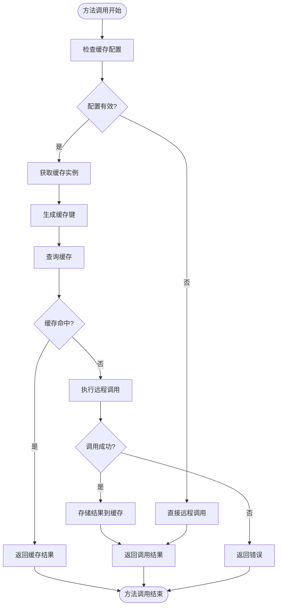
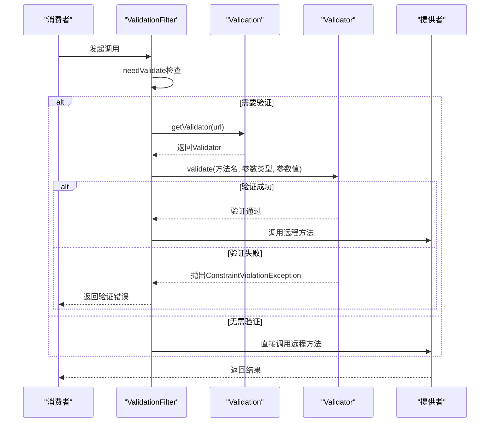
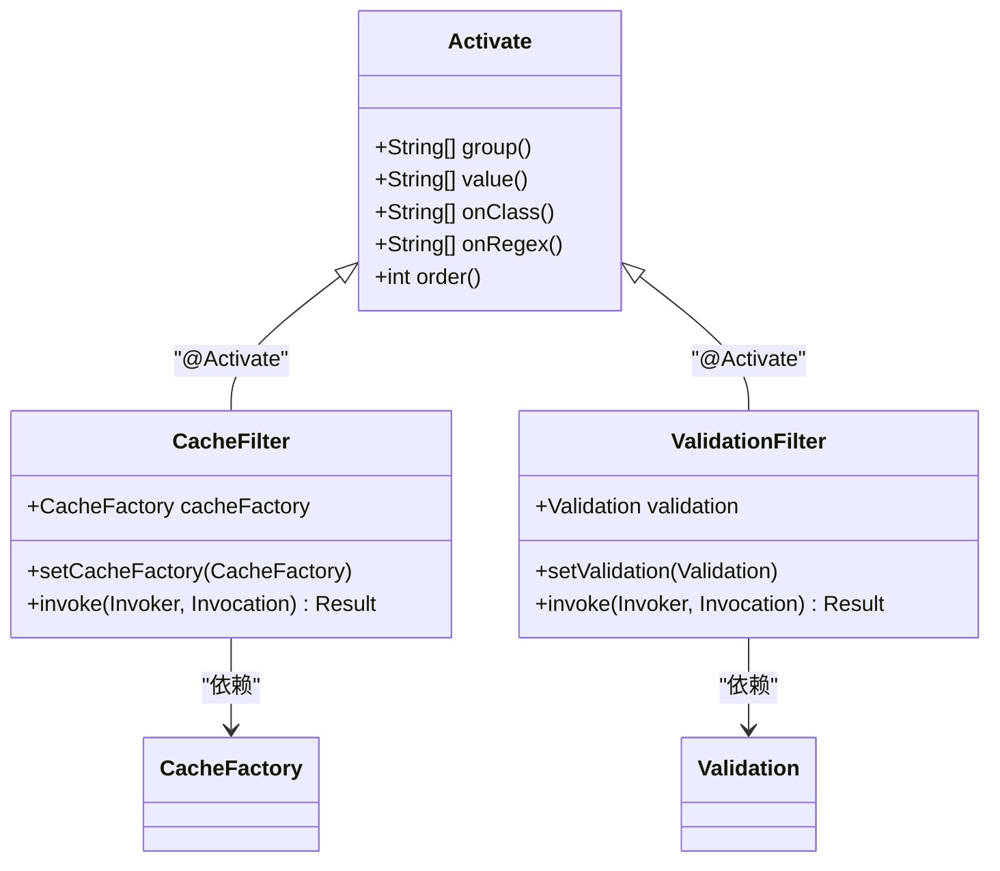

# 内置过滤器

<cite>
**本文档中引用的文件**   
- [CacheFilter.java](file://dubbo-plugin\dubbo-filter-cache\src\main\java\org\apache\dubbo\cache\filter\CacheFilter.java)
- [ValidationFilter.java](file://dubbo-plugin\dubbo-filter-validation\src\main\java\org\apache\dubbo\validation\filter\ValidationFilter.java)
- [CacheFactory.java](file://dubbo-plugin\dubbo-filter-cache\src\main\java\org\apache\dubbo\cache\CacheFactory.java)
- [Validation.java](file://dubbo-plugin\dubbo-filter-validation\src\main\java\org\apache\dubbo\validation\Validation.java)
- [AbstractCacheFactory.java](file://dubbo-plugin\dubbo-filter-cache\src\main\java\org\apache\dubbo\cache\support\AbstractCacheFactory.java)
- [AbstractValidation.java](file://dubbo-plugin\dubbo-filter-validation\src\main\java\org\apache\dubbo\validation\support\AbstractValidation.java)
- [org.apache.dubbo.cache.CacheFactory](file://dubbo-plugin\dubbo-filter-cache\src\main\resources\META-INF\dubbo\internal\org.apache.dubbo.cache.CacheFactory)
- [org.apache.dubbo.validation.Validation](file://dubbo-plugin\dubbo-filter-validation\src\main\resources\META-INF\dubbo\internal\org.apache.dubbo.validation.Validation)
</cite>

## 目录
1. [引言](#引言)
2. [缓存过滤器(CacheFilter)实现分析](#缓存过滤器cachefilter实现分析)
3. [参数校验过滤器(ValidationFilter)实现分析](#参数校验过滤器validationfilter实现分析)
4. [激活机制(@Activate注解)分析](#激活机制activate注解分析)
5. [配置示例与使用方法](#配置示例与使用方法)
6. [性能与可靠性影响分析](#性能与可靠性影响分析)
7. [结论](#结论)

## 引言
Dubbo框架提供了多种内置过滤器来增强服务调用的功能性和可靠性。本文档深入分析两个关键的内置过滤器：CacheFilter和ValidationFilter。CacheFilter通过集成CacheFactory实现方法调用结果的缓存，减少重复的远程调用开销；ValidationFilter则集成JSR-303等验证框架实现参数校验，确保服务调用的安全性。这些过滤器通过@Activate注解配置激活条件和执行顺序，可以在服务级别或方法级别灵活启用，对系统性能和可靠性产生重要影响。

## 缓存过滤器(CacheFilter)实现分析

CacheFilter是Dubbo中用于实现方法调用结果缓存的核心组件。当在服务、方法、消费者或提供者配置中启用cache键时，Dubbo将缓存方法的返回值。CacheFilter的实现基于责任链模式，在远程调用前检查缓存，如果缓存命中则直接返回缓存结果，否则执行远程调用并将结果存入缓存。

CacheFilter的核心逻辑在invoke方法中实现。首先检查cacheFactory是否为空以及当前方法是否配置了缓存，如果没有配置则直接调用远程方法。如果配置了缓存，则通过cacheFactory.getCache方法获取缓存实例，然后生成缓存键并查询缓存。缓存键的生成通过StringUtils.toArgumentString方法将方法参数转换为字符串。如果缓存命中，则包装缓存值为AsyncRpcResult返回；如果未命中，则执行远程调用，将成功的结果包装在ValueWrapper中存入缓存。



**图示来源**
- [CacheFilter.java](file://dubbo-plugin\dubbo-filter-cache\src\main\java\org\apache\dubbo\cache\filter\CacheFilter.java#L94-L124)

**本节来源**
- [CacheFilter.java](file://dubbo-plugin\dubbo-filter-cache\src\main\java\org\apache\dubbo\cache\filter\CacheFilter.java#L67-L144)

## 参数校验过滤器(ValidationFilter)实现分析

ValidationFilter是Dubbo中用于实现参数校验的过滤器，它在实际方法调用之前根据配置的validation属性值查找合适的Validator实例并执行验证。该过滤器支持多种验证框架，包括JSR-303（javax.validation）和Jakarta EE（jakarta.validation）。

ValidationFilter的实现基于策略模式，通过Validation接口的SPI机制动态加载不同的验证实现。在invoke方法中，首先通过needValidate方法检查是否需要验证，包括验证配置是否存在、方法名是否以$开头、方法级别或全局是否配置了验证等条件。如果需要验证，则通过validation.getValidator获取Validator实例，并调用其validate方法对方法名、参数类型和参数值进行校验。

ValidationFilter的灵活性体现在其扩展机制上。开发者可以通过实现Validation接口或继承AbstractValidation类来添加新的验证类型，并在META-INF/dubbo/internal/org.apache.dubbo.validation.Validation文件中注册。例如，可以实现一个专门验证特殊字符的验证器，并通过配置validation="special"来启用。



**图示来源**
- [ValidationFilter.java](file://dubbo-plugin\dubbo-filter-validation\src\main\java\org\apache\dubbo\validation\filter\ValidationFilter.java#L87-L111)
- [Validation.java](file://dubbo-plugin\dubbo-filter-validation\src\main\java\org\apache\dubbo\validation\Validation.java#L36-L38)

**本节来源**
- [ValidationFilter.java](file://dubbo-plugin\dubbo-filter-validation\src\main\java\org\apache\dubbo\validation\filter\ValidationFilter.java#L62-L112)
- [Validator.java](file://dubbo-plugin\dubbo-filter-validation\src\main\java\org\apache\dubbo\validation\Validator.java#L23-L29)

## 激活机制(@Activate注解)分析

@Activate注解是Dubbo扩展点自动激活的核心机制，它允许在满足特定条件时自动加载和执行扩展实现。对于内置过滤器，@Activate注解控制着过滤器的激活条件和执行顺序。

在CacheFilter中，@Activate注解配置了group = {CONSUMER, PROVIDER}和value = CACHE_KEY，表示该过滤器在消费者和提供者端都会被激活，且激活条件是URL中包含cache参数。在ValidationFilter中，除了相同的group和value配置外，还设置了order = 10000，这确保了验证过滤器在过滤器链中的执行顺序。

@Activate注解的group属性指定了激活的组条件，框架SPI定义了有效的组值，如CONSUMER和PROVIDER。value属性指定了URL条件中的参数键，只有当URL中包含这些参数时，对应的扩展才会被激活。order属性控制着多个激活扩展的执行顺序，数值越小优先级越高。



**图示来源**
- [CacheFilter.java](file://dubbo-plugin\dubbo-filter-cache\src\main\java\org\apache\dubbo\cache\filter\CacheFilter.java#L67-L70)
- [ValidationFilter.java](file://dubbo-plugin\dubbo-filter-validation\src\main\java\org\apache\dubbo\validation\filter\ValidationFilter.java#L62-L65)
- [Activate.java](file://dubbo-common\src\main\java\org\apache\dubbo\common\extension\Activate.java#L53-L57)

**本节来源**
- [CacheFilter.java](file://dubbo-plugin\dubbo-filter-cache\src\main\java\org\apache\dubbo\cache\filter\CacheFilter.java#L67-L70)
- [ValidationFilter.java](file://dubbo-plugin\dubbo-filter-validation\src\main\java\org\apache\dubbo\validation\filter\ValidationFilter.java#L62-L66)
- [Activate.java](file://dubbo-common\src\main\java\org\apache\dubbo\common\extension\Activate.java#L27-L57)

## 配置示例与使用方法

在Dubbo中启用内置过滤器可以通过XML配置、注解或属性文件等多种方式实现。以下是一些常见的配置示例：

对于CacheFilter，可以在服务级别或方法级别配置缓存类型：
```xml
<!-- 服务级别启用LRU缓存 -->
<dubbo:service cache="lru" />

<!-- 方法级别配置不同缓存类型 -->
<dubbo:service>
    <dubbo:method name="method1" cache="lru" />
    <dubbo:method name="method2" cache="threadlocal" />
</dubbo:service>

<!-- 提供者级别启用过期缓存 -->
<dubbo:provider cache="expiring" />

<!-- 消费者级别启用JCache -->
<dubbo:consumer cache="jcache" />
```

对于ValidationFilter，可以通过validation属性配置验证类型：
```xml
<!-- 方法级别启用JSR-303验证 -->
<dubbo:method name="saveUser" validation="jvalidation" />

<!-- 服务级别启用验证 -->
<dubbo:service validation="jvalidation" />

<!-- 使用Jakarta EE验证 -->
<dubbo:service validation="jvalidation-jakarta" />
```

在Java代码中，也可以通过注解方式配置：
```java
@Service(validation = "jvalidation")
public class UserServiceImpl implements UserService {
    
    @Method(cache = "lru")
    public User getUser(String id) {
        // 业务逻辑
    }
    
    @Method(validation = "jvalidation")
    public void saveUser(@Valid User user) {
        // 保存用户
    }
}
```

**本节来源**
- [CacheFilter.java](file://dubbo-plugin\dubbo-filter-cache\src\main\java\org\apache\dubbo\cache\filter\CacheFilter.java#L46-L54)
- [ValidationFilter.java](file://dubbo-plugin\dubbo-filter-validation\src\main\java\org\apache\dubbo\validation\filter\ValidationFilter.java#L40-L43)
- [org.apache.dubbo.cache.CacheFactory](file://dubbo-plugin\dubbo-filter-cache\src\main\resources\META-INF\dubbo\internal\org.apache.dubbo.cache.CacheFactory)
- [org.apache.dubbo.validation.Validation](file://dubbo-plugin\dubbo-filter-validation\src\main\resources\META-INF\dubbo\internal\org.apache.dubbo.validation.Validation)

## 性能与可靠性影响分析

内置过滤器对系统性能和可靠性有着显著影响。CacheFilter通过缓存机制显著提升了系统性能，减少了重复的远程调用开销，特别是在高并发场景下效果尤为明显。然而，缓存也带来了数据一致性问题，需要根据业务场景选择合适的缓存策略和过期时间。

ValidationFilter通过参数校验增强了系统的可靠性，防止了无效或恶意数据进入业务逻辑层，减少了系统异常和安全漏洞。然而，验证过程本身会增加一定的性能开销，特别是在复杂对象验证时。因此，需要在安全性和性能之间找到平衡点。

从架构角度看，这些过滤器通过AOP方式实现了横切关注点的分离，使业务代码更加简洁和专注。通过@Activate注解的灵活配置，可以在不同环境和场景下动态启用或禁用这些功能，提高了系统的可维护性和可扩展性。

在实际应用中，建议根据具体业务需求合理配置这些过滤器。对于读多写少的场景，可以积极使用CacheFilter；对于涉及用户输入的接口，应启用ValidationFilter确保数据安全。同时，需要监控过滤器的性能影响，及时调整配置以优化系统表现。

**本节来源**
- [CacheFilter.java](file://dubbo-plugin\dubbo-filter-cache\src\main\java\org\apache\dubbo\cache\filter\CacheFilter.java)
- [ValidationFilter.java](file://dubbo-plugin\dubbo-filter-validation\src\main\java\org\apache\dubbo\validation\filter\ValidationFilter.java)

## 结论
Dubbo的内置过滤器机制为分布式服务提供了强大的功能扩展能力。CacheFilter通过灵活的缓存策略有效提升了系统性能，而ValidationFilter通过集成标准验证框架确保了服务调用的安全性。这些过滤器通过@Activate注解实现了智能化的激活控制，支持在服务级别、方法级别进行精细化配置。合理使用这些内置过滤器，可以在不修改业务代码的情况下显著提升系统的性能和可靠性，是构建高质量分布式应用的重要工具。