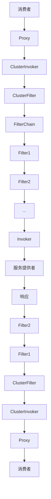
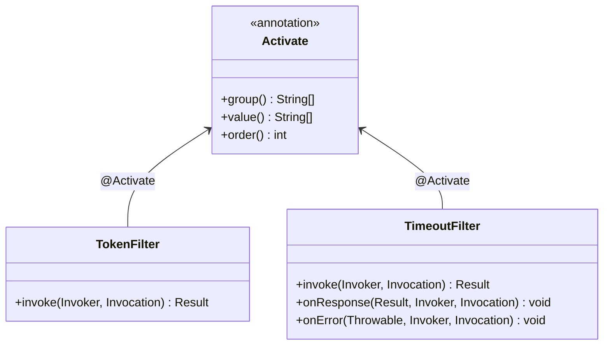
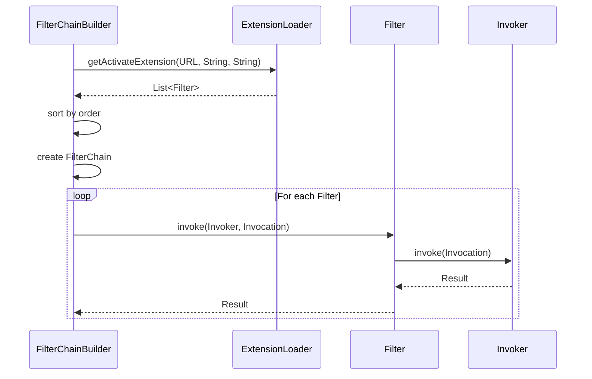
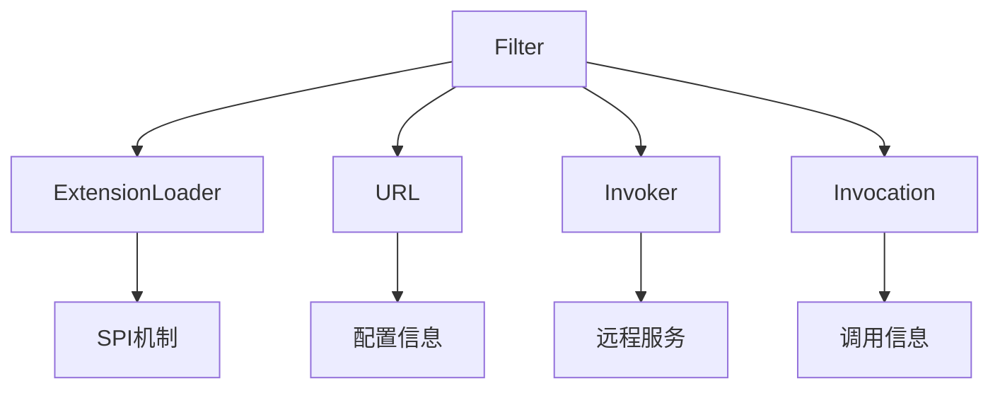

# 自定义过滤器

<cite>
**本文档中引用的文件**   
- [Activate.java](file://dubbo-common\src\main\java\org\apache\dubbo\common\extension\Activate.java)
- [Filter.java](file://dubbo-rpc\dubbo-rpc-api\src\main\java\org\apache\dubbo\rpc\Filter.java)
- [BaseFilter.java](file://dubbo-rpc\dubbo-rpc-api\src\main\java\org\apache\dubbo\rpc\BaseFilter.java)
- [TokenFilter.java](file://dubbo-rpc\dubbo-rpc-api\src\main\java\org\apache\dubbo\rpc\filter\TokenFilter.java)
- [TimeoutFilter.java](file://dubbo-rpc\dubbo-rpc-api\src\main\java\org\apache\dubbo\rpc\filter\TimeoutFilter.java)
- [GenericFilter.java](file://dubbo-rpc\dubbo-rpc-api\src\main\java\org\apache\dubbo\rpc\filter\GenericFilter.java)
- [EchoFilter.java](file://dubbo-rpc\dubbo-rpc-api\src\main\java\org\apache\dubbo\rpc\filter\EchoFilter.java)
- [LogFilter.java](file://dubbo-cluster\src\test\java\org\apache\dubbo\rpc\cluster\filter\LogFilter.java)
- [SingleRegistryCenterInjvmFilter.java](file://dubbo-config\dubbo-config-api\src\test\java\org\apache\dubbo\config\integration\single\injvm\SingleRegistryCenterInjvmFilter.java)
- [MultipleRegistryCenterInjvmFilter.java](file://dubbo-config\dubbo-config-api\src\test\java\org\apache\dubbo\config\integration\multiple\injvm\MultipleRegistryCenterInjvmFilter.java)
- [FilterChainBuilder.java](file://dubbo-cluster\src\main\java\org\apache\dubbo\rpc\cluster\filter\FilterChainBuilder.java)
- [RestExtensionExecutionFilter.java](file://dubbo-rpc\dubbo-rpc-triple\src\main\java\org\apache\dubbo\rpc\protocol\tri\rest\filter\RestExtensionExecutionFilter.java)
</cite>

## 目录
1. [引言](#引言)
2. [核心组件](#核心组件)
3. [架构概述](#架构概述)
4. [详细组件分析](#详细组件分析)
5. [依赖分析](#依赖分析)
6. [性能考虑](#性能考虑)
7. [故障排除指南](#故障排除指南)
8. [结论](#结论)

## 引言
本文档提供创建自定义Dubbo过滤器的完整指南。文档将演示如何实现Filter接口并重写invoke方法来拦截RPC调用，以及如何实现Listener接口来处理调用成功或异常的回调。同时，文档将展示如何使用@Activate注解配置过滤器的激活条件，包括通过group指定作用端（CONSUMER/PROVIDER）、通过value指定条件表达式、通过order控制执行顺序。文档还将提供日志记录、性能监控、认证授权等典型场景的代码示例，并说明如何通过META-INF/dubbo/org.apache.dubbo.rpc.Filter文件注册自定义过滤器，以及讨论自定义过滤器与内置过滤器的协作关系。

## 核心组件
在Dubbo框架中，过滤器（Filter）是实现AOP（面向切面编程）的核心机制，用于在服务提供者和消费者之间拦截RPC调用。Filter接口继承自BaseFilter，其中定义了invoke方法用于拦截调用，以及Listener内部接口用于处理调用结果的回调。通过实现Filter接口，开发者可以在RPC调用的前后插入自定义逻辑，如日志记录、性能监控、认证授权等。

**核心组件来源**
- [Filter.java](file://dubbo-rpc\dubbo-rpc-api\src\main\java\org\apache\dubbo\rpc\Filter.java#L1-L70)
- [BaseFilter.java](file://dubbo-rpc\dubbo-rpc-api\src\main\java\org\apache\dubbo\rpc\BaseFilter.java#L1-L55)

## 架构概述
Dubbo的过滤器架构基于SPI（Service Provider Interface）机制，通过责任链模式组织多个过滤器。当RPC调用发生时，请求会依次经过过滤器链中的每个过滤器，每个过滤器可以执行预处理逻辑，然后将请求传递给下一个过滤器，直到到达服务提供者。响应则按相反的顺序返回，每个过滤器可以执行后处理逻辑。



**图表来源**
- [FilterChainBuilder.java](file://dubbo-cluster\src\main\java\org\apache\dubbo\rpc\cluster\filter\FilterChainBuilder.java#L55-L301)

## 详细组件分析

### 过滤器接口分析
Filter接口是Dubbo中所有过滤器的基接口，它继承自BaseFilter接口。BaseFilter接口定义了两个核心部分：invoke方法和Listener内部接口。invoke方法是过滤器的主要执行逻辑，它接收Invoker和Invocation对象作为参数，并返回Result对象。开发者需要在invoke方法中实现自定义逻辑，并通过调用invoker.invoke(invocation)将请求传递给下一个过滤器或服务提供者。

Listener内部接口提供了两个回调方法：onResponse和onError。onResponse方法在RPC调用成功返回时被调用，onError方法在RPC调用发生异常时被调用。通过实现Listener接口，开发者可以处理调用结果，如记录日志、更新监控指标等。

```mermaid
classDiagram
class Filter {
<<interface>>
+invoke(Invoker, Invocation) Result
}
class BaseFilter {
<<interface>>
+invoke(Invoker, Invocation) Result
}
class BaseFilter$Listener {
<<interface>>
+onResponse(Result, Invoker, Invocation) void
+onError(Throwable, Invoker, Invocation) void
}
Filter <|-- BaseFilter
BaseFilter <-- BaseFilter$Listener : 内部接口
```

**图表来源**
- [BaseFilter.java](file://dubbo-rpc\dubbo-rpc-api\src\main\java\org\apache\dubbo\rpc\BaseFilter.java#L19-L54)
- [Filter.java](file://dubbo-rpc\dubbo-rpc-api\src\main\java\org\apache\dubbo\rpc\Filter.java#L68-L69)

### 激活注解分析
@Activate注解用于配置过滤器的激活条件，控制过滤器在何时被加载和执行。该注解有三个主要属性：group、value和order。group属性指定过滤器的作用端，可以是CONSUMER或PROVIDER，表示过滤器在消费者端或提供者端生效。value属性指定URL参数中的键，只有当这些键存在于URL参数中时，过滤器才会被激活。order属性指定过滤器的执行顺序，数值越小优先级越高。



**图表来源**
- [Activate.java](file://dubbo-common\src\main\java\org\apache\dubbo\common\extension\Activate.java#L56-L139)
- [TokenFilter.java](file://dubbo-rpc\dubbo-rpc-api\src\main\java\org\apache\dubbo\rpc\filter\TokenFilter.java#L38-L58)
- [TimeoutFilter.java](file://dubbo-rpc\dubbo-rpc-api\src\main\java\org\apache\dubbo\rpc\filter\TimeoutFilter.java#L38-L69)

### 过滤器链构建分析
FilterChainBuilder类负责构建过滤器链，它根据URL参数和@Activate注解的配置，确定哪些过滤器应该被激活，并按照order属性的值对过滤器进行排序。过滤器链的构建过程发生在服务引用或暴露时，FilterChainBuilder会从ExtensionLoader中获取所有激活的过滤器扩展，并将它们组织成一个责任链。



**图表来源**
- [FilterChainBuilder.java](file://dubbo-cluster\src\main\java\org\apache\dubbo\rpc\cluster\filter\FilterChainBuilder.java#L55-L301)

## 依赖分析
Dubbo过滤器系统依赖于多个核心组件，包括ExtensionLoader、URL、Invoker和Invocation。ExtensionLoader负责加载和管理SPI扩展，包括过滤器。URL对象包含了服务配置信息，用于决定哪些过滤器应该被激活。Invoker代表了远程服务的调用者，是过滤器链的终点。Invocation对象封装了RPC调用的具体信息，如方法名、参数等。



**图表来源**
- [FilterChainBuilder.java](file://dubbo-cluster\src\main\java\org\apache\dubbo\rpc\cluster\filter\FilterChainBuilder.java#L55-L301)
- [Activate.java](file://dubbo-common\src\main\java\org\apache\dubbo\common\extension\Activate.java#L27-L57)

## 性能考虑
在实现自定义过滤器时，需要考虑性能影响。由于每个RPC调用都会经过过滤器链，因此过滤器中的任何性能瓶颈都会被放大。建议在过滤器中避免执行耗时操作，如数据库查询、网络请求等。对于需要异步处理的逻辑，可以考虑使用线程池或消息队列。此外，合理配置过滤器的激活条件和执行顺序，可以减少不必要的过滤器执行，提高整体性能。

## 故障排除指南
在使用自定义过滤器时，可能会遇到一些常见问题。例如，过滤器未被激活，可能是由于@Activate注解的配置不正确，或者URL参数中缺少必要的键。过滤器执行顺序不符合预期，可能是由于order属性的值设置不当。在调试过滤器时，可以启用Dubbo的日志功能，查看过滤器的加载和执行情况。此外，可以通过单元测试验证过滤器的逻辑正确性。

**故障排除来源**
- [LogFilter.java](file://dubbo-cluster\src\test\java\org\apache\dubbo\rpc\cluster\filter\LogFilter.java#L28-L41)
- [SingleRegistryCenterInjvmFilter.java](file://dubbo-config\dubbo-config-api\src\test\java\org\apache\dubbo\config\integration\single\injvm\SingleRegistryCenterInjvmFilter.java#L27-L38)
- [MultipleRegistryCenterInjvmFilter.java](file://dubbo-config\dubbo-config-api\src\test\java\org\apache\dubbo\config\integration\multiple\injvm\MultipleRegistryCenterInjvmFilter.java#L27-L38)

## 结论
本文档详细介绍了Dubbo自定义过滤器的实现和使用方法。通过实现Filter接口和使用@Activate注解，开发者可以轻松地在RPC调用中插入自定义逻辑。过滤器链的构建和执行由Dubbo框架自动管理，开发者只需关注业务逻辑的实现。合理使用过滤器可以极大地增强Dubbo应用的功能和可维护性，但同时也需要注意性能影响和正确配置激活条件。