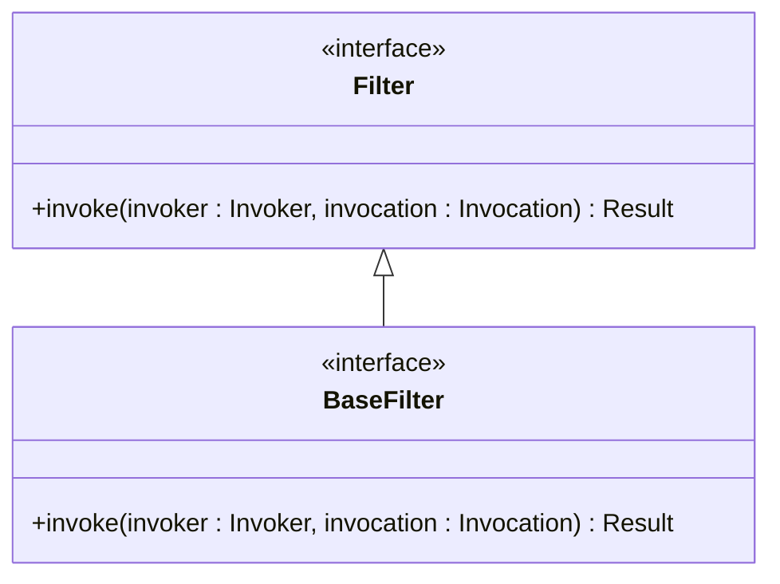
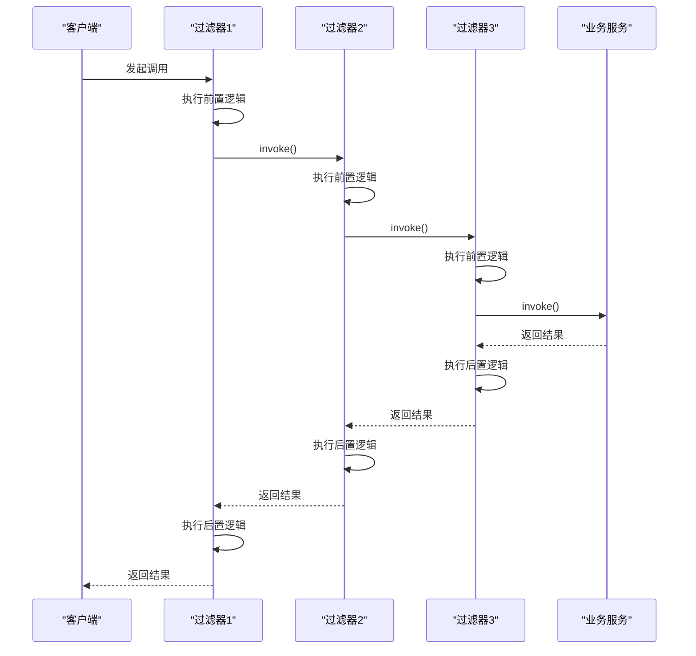
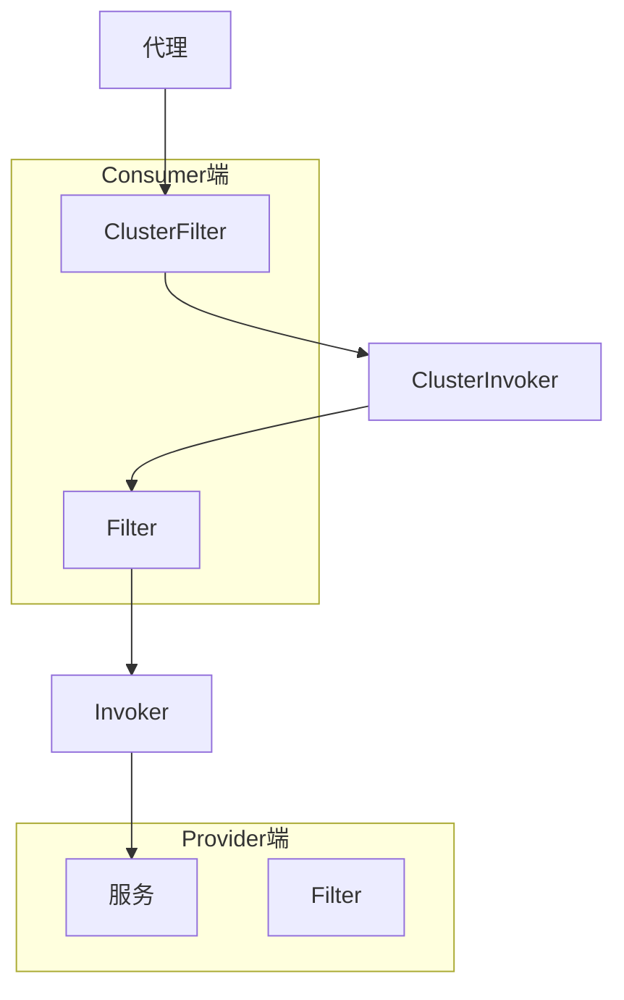
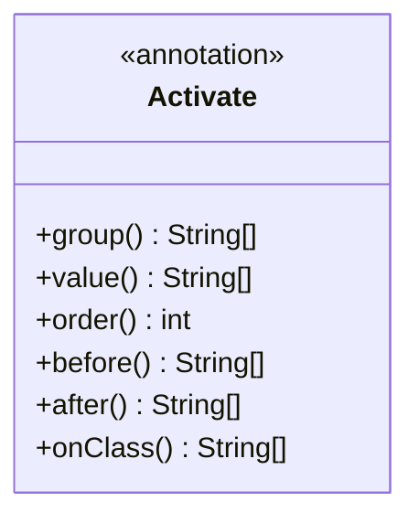
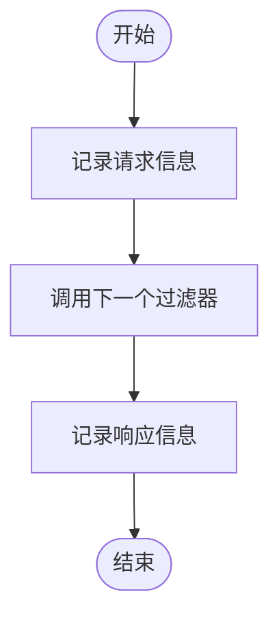
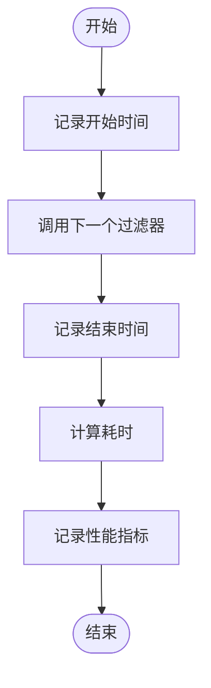
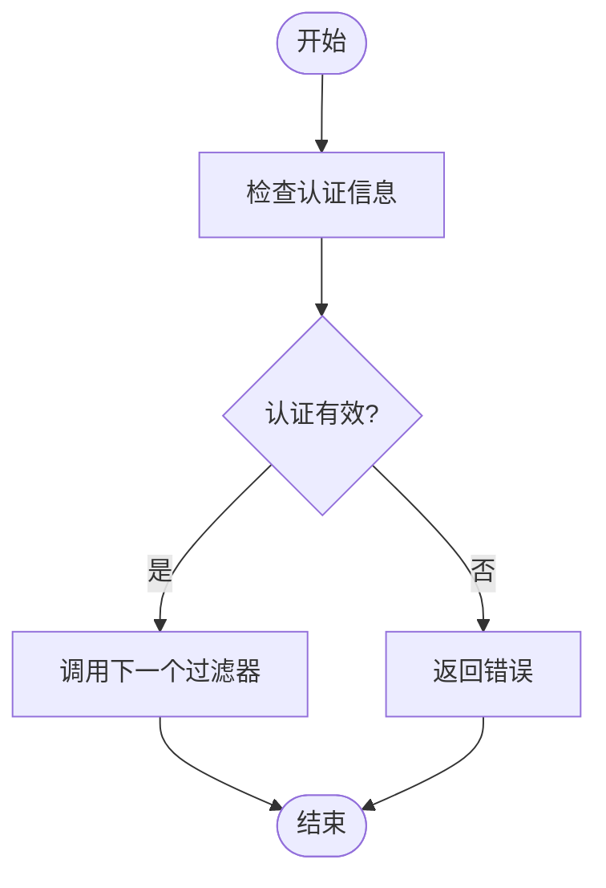
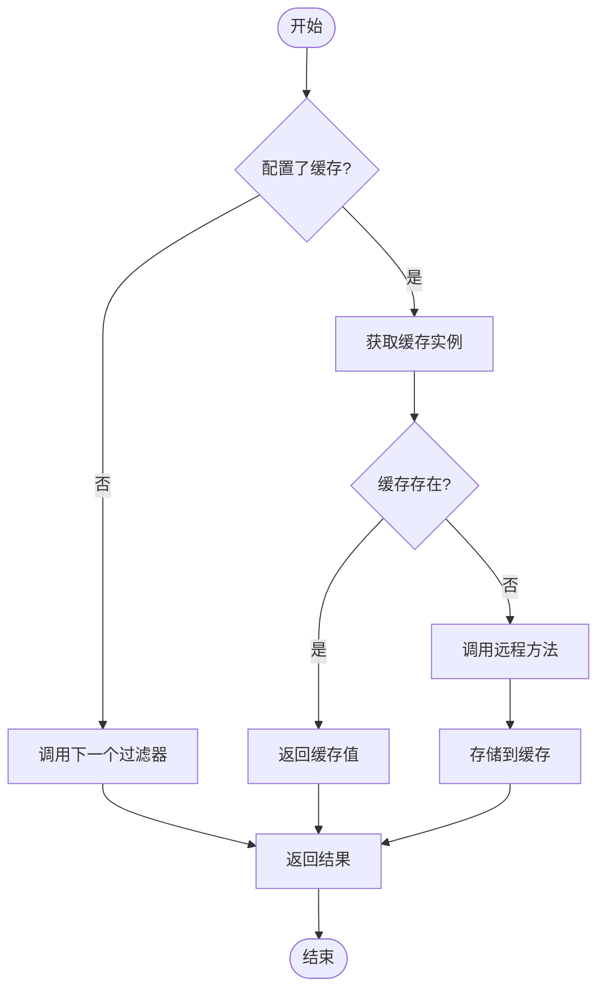
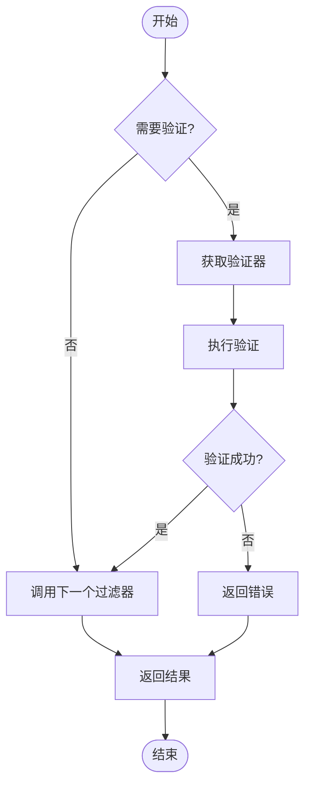
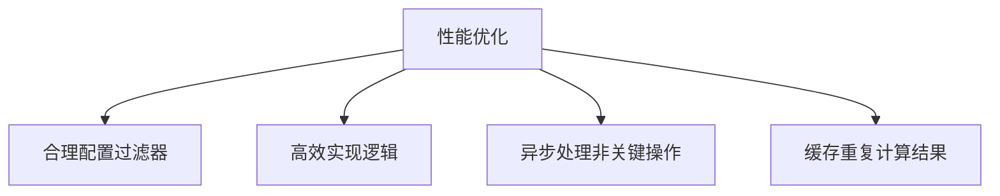

# 过滤器

<cite>
**本文档引用的文件**
- [Filter.java](file://dubbo-rpc\dubbo-rpc-api\src\main\java\org\apache\dubbo\rpc\Filter.java)
- [BaseFilter.java](file://dubbo-rpc\dubbo-rpc-api\src\main\java\org\apache\dubbo\rpc\BaseFilter.java)
- [Activate.java](file://dubbo-common\src\main\java\org\apache\dubbo\common\extension\Activate.java)
- [DefaultFilterChainBuilder.java](file://dubbo-cluster\src\main\java\org\apache\dubbo\rpc\cluster\filter\DefaultFilterChainBuilder.java)
- [FilterChainBuilder.java](file://dubbo-cluster\src\main\java\org\apache\dubbo\rpc\cluster\filter\FilterChainBuilder.java)
- [CacheFilter.java](file://dubbo-plugin\dubbo-filter-cache\src\main\java\org\apache\dubbo\cache\filter\CacheFilter.java)
- [ValidationFilter.java](file://dubbo-plugin\dubbo-filter-validation\src\main\java\org\apache\dubbo\validation\filter\ValidationFilter.java)
- [GenericFilter.java](file://dubbo-rpc\dubbo-rpc-api\src\main\java\org\apache\dubbo\rpc\filter\GenericFilter.java)
- [ContextFilter.java](file://dubbo-rpc\dubbo-rpc-api\src\main\java\org\apache\dubbo\rpc\filter\ContextFilter.java)
</cite>

## 目录
1. [引言](#引言)
2. [过滤器接口设计原理](#过滤器接口设计原理)
3. [责任链模式实现机制](#责任链模式实现机制)
4. [Provider端和Consumer端过滤器执行顺序](#provider端和consumer端过滤器执行顺序)
5. [@Activate注解的激活条件和顺序控制](#activate注解的激活条件和顺序控制)
6. [自定义过滤器实现示例](#自定义过滤器实现示例)
7. [内置过滤器实现细节分析](#内置过滤器实现细节分析)
8. [过滤器链性能影响和优化策略](#过滤器链性能影响和优化策略)
9. [结论](#结论)

## 引言

Dubbo框架中的过滤器机制是其核心扩展点之一，通过责任链模式实现了请求的拦截和处理。过滤器可以在服务提供者(Provider)和消费者(Consumer)两端对RPC调用进行拦截，实现诸如日志记录、性能监控、认证授权、缓存、参数验证等功能。本文将详细阐述Dubbo过滤器链的工作机制，包括Filter接口的设计原理、责任链模式的实现、执行顺序控制以及自定义过滤器的创建方法。

**本文档引用的文件**
- [Filter.java](file://dubbo-rpc\dubbo-rpc-api\src\main\java\org\apache\dubbo\rpc\Filter.java)
- [BaseFilter.java](file://dubbo-rpc\dubbo-rpc-api\src\main\java\org\apache\dubbo\rpc\BaseFilter.java)

## 过滤器接口设计原理

Dubbo的过滤器机制基于SPI（Service Provider Interface）扩展机制实现，核心接口是`org.apache.dubbo.rpc.Filter`。该接口继承自`BaseFilter`，定义了`invoke`方法作为过滤器的核心处理逻辑。

**过滤器来源**
- [Filter.java](file://dubbo-rpc\dubbo-rpc-api\src\main\java\org\apache\dubbo\rpc\Filter.java)
- [BaseFilter.java](file://dubbo-rpc\dubbo-rpc-api\src\main\java\org\apache\dubbo\rpc\BaseFilter.java)

**过滤器来源**
- [Filter.java](file://dubbo-rpc\dubbo-rpc-api\src\main\java\org\apache\dubbo\rpc\Filter.java)
- [BaseFilter.java](file://dubbo-rpc\dubbo-rpc-api\src\main\java\org\apache\dubbo\rpc\BaseFilter.java)

## 责任链模式实现机制

Dubbo通过`DefaultFilterChainBuilder`类构建过滤器链，采用责任链模式将多个过滤器串联起来。每个过滤器在处理完自己的逻辑后，通过调用`invoker.invoke(invocation)`将请求传递给下一个过滤器，直到最终的业务方法被调用。

**过滤器来源**
- [DefaultFilterChainBuilder.java](file://dubbo-cluster\src\main\java\org\apache\dubbo\rpc\cluster\filter\DefaultFilterChainBuilder.java)
- [FilterChainBuilder.java](file://dubbo-cluster\src\main\java\org\apache\dubbo\rpc\cluster\filter\FilterChainBuilder.java)

## Provider端和Consumer端过滤器执行顺序

在Dubbo 3.x版本中，过滤器链的执行顺序有所变化。Consumer端有两种类型的过滤器：`Filter`和`ClusterFilter`，分别在不同的阶段执行。

Provider端的过滤器执行顺序相对简单，从外到内依次执行各个过滤器，最后到达业务服务。Consumer端的过滤器执行顺序则更为复杂，`ClusterFilter`在负载均衡选择具体提供者之前执行，而`Filter`在选择之后执行。

**过滤器来源**
- [DefaultFilterChainBuilder.java](file://dubbo-cluster\src\main\java\org\apache\dubbo\rpc\cluster\filter\DefaultFilterChainBuilder.java)
- [FilterChainBuilder.java](file://dubbo-cluster\src\main\java\org\apache\dubbo\rpc\cluster\filter\FilterChainBuilder.java)

## @Activate注解的激活条件和顺序控制

`@Activate`注解是控制过滤器激活的关键，它定义了过滤器在何种条件下被激活以及激活的顺序。该注解包含多个属性：

- `group()`：指定激活的组别，如"provider"或"consumer"
- `value()`：指定URL参数中的键，当这些键存在时激活过滤器
- `order()`：指定绝对排序信息，值越小越先执行

过滤器的排序首先根据`order`值进行升序排列，`order`值相同的则根据类名进行排序。这种设计使得开发者可以精确控制过滤器的执行顺序。

**过滤器来源**
- [Activate.java](file://dubbo-common\src\main\java\org\apache\dubbo\common\extension\Activate.java)

## 自定义过滤器实现示例

创建自定义过滤器需要实现`Filter`接口，并使用`@Activate`注解进行配置。以下是几种常见场景的实现示例：

### 日志记录过滤器

### 性能监控过滤器

### 认证授权过滤器

**过滤器来源**
- [CacheFilter.java](file://dubbo-plugin\dubbo-filter-cache\src\main\java\org\apache\dubbo\cache\filter\CacheFilter.java)
- [ValidationFilter.java](file://dubbo-plugin\dubbo-filter-validation\src\main\java\org\apache\dubbo\validation\filter\ValidationFilter.java)

## 内置过滤器实现细节分析

Dubbo提供了多个内置过滤器，涵盖了常见的业务需求。

### CacheFilter缓存过滤器

`CacheFilter`实现了方法返回值的缓存功能，支持多种缓存类型如LRU、ThreadLocal、JCache等。当配置了缓存时，过滤器会先尝试从缓存中获取结果，如果存在则直接返回，否则调用远程方法并将结果存入缓存。

### ValidationFilter验证过滤器

`ValidationFilter`在方法调用前进行参数验证，确保传入的参数符合预定义的规则。它通过`Validation`扩展点获取具体的验证器实例，并调用其`validate`方法进行验证。

**过滤器来源**
- [CacheFilter.java](file://dubbo-plugin\dubbo-filter-cache\src\main\java\org\apache\dubbo\cache\filter\CacheFilter.java)
- [ValidationFilter.java](file://dubbo-plugin\dubbo-filter-validation\src\main\java\org\apache\dubbo\validation\filter\ValidationFilter.java)

## 过滤器链性能影响和优化策略

过滤器链的性能影响主要体现在以下几个方面：

1. **调用开销**：每个过滤器都会增加一定的方法调用开销
2. **内存占用**：过滤器实例和相关数据结构会占用内存
3. **执行时间**：复杂的过滤器逻辑会增加整体调用时间

优化策略包括：

- **合理配置**：只启用必要的过滤器，避免过度配置
- **高效实现**：确保过滤器内部逻辑高效，避免不必要的计算
- **异步处理**：对于非关键路径的处理（如日志记录），可以采用异步方式
- **缓存复用**：对于重复计算的结果进行缓存，避免重复计算

**过滤器来源**
- [GenericFilter.java](file://dubbo-rpc\dubbo-rpc-api\src\main\java\org\apache\dubbo\rpc\filter\GenericFilter.java)
- [ContextFilter.java](file://dubbo-rpc\dubbo-rpc-api\src\main\java\org\apache\dubbo\rpc\filter\ContextFilter.java)

## 结论

Dubbo的过滤器机制通过责任链模式实现了灵活的请求拦截和处理功能。`Filter`接口的设计简洁而强大，配合`@Activate`注解提供了精确的激活控制。Provider端和Consumer端的过滤器执行顺序设计合理，满足了不同场景的需求。通过分析内置过滤器的实现，我们可以学习到如何创建高效的自定义过滤器。在实际应用中，需要权衡功能需求和性能影响，合理配置和优化过滤器链，以达到最佳的系统性能。