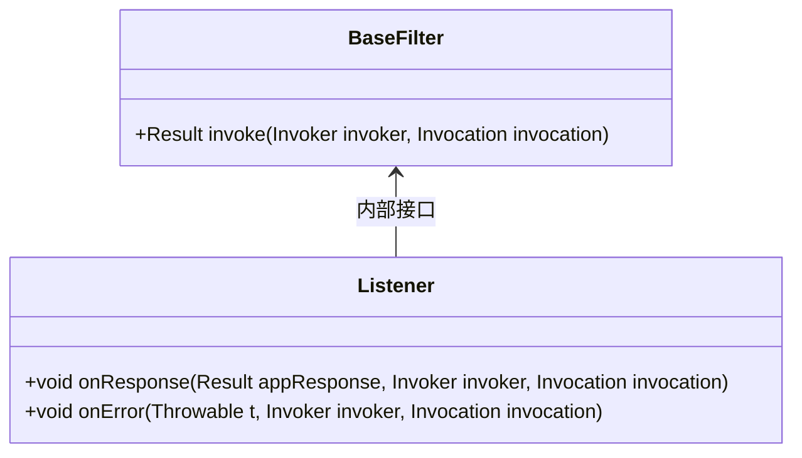
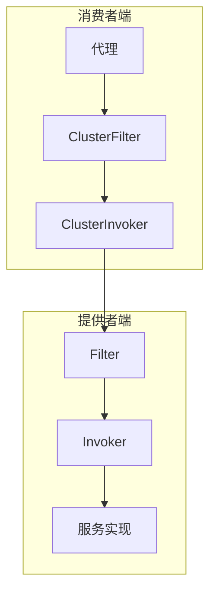
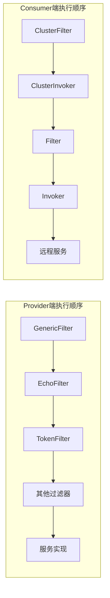
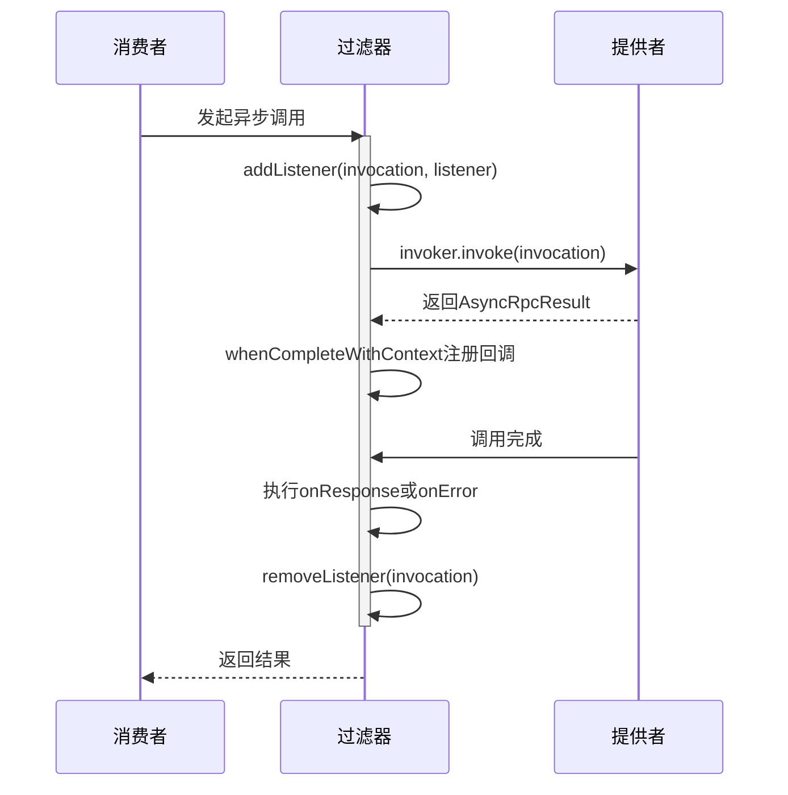

# 过滤器机制

<cite>
**本文档中引用的文件**  
- [Filter.java](file://dubbo-rpc\dubbo-rpc-api\src\main\java\org\apache\dubbo\rpc\Filter.java)
- [BaseFilter.java](file://dubbo-rpc\dubbo-rpc-api\src\main\java\org\apache\dubbo\rpc\BaseFilter.java)
- [FilterChainBuilder.java](file://dubbo-cluster\src\main\java\org\apache\dubbo\rpc\cluster\filter\FilterChainBuilder.java)
- [ListenableFilter.java](file://dubbo-rpc\dubbo-rpc-api\src\main\java\org\apache\dubbo\rpc\ListenableFilter.java)
- [GenericFilter.java](file://dubbo-rpc\dubbo-rpc-api\src\main\java\org\apache\dubbo\rpc\filter\GenericFilter.java)
- [EchoFilter.java](file://dubbo-rpc\dubbo-rpc-api\src\main\java\org\apache\dubbo\rpc\filter\EchoFilter.java)
- [TokenFilter.java](file://dubbo-rpc\dubbo-rpc-api\src\main\java\org\apache\dubbo\rpc\filter\TokenFilter.java)
- [ExceptionFilter.java](file://dubbo-rpc\dubbo-rpc-api\src\main\java\org\apache\dubbo\rpc\filter\ExceptionFilter.java)
</cite>

## 目录
1. [引言](#引言)
2. [过滤器接口与SPI扩展机制](#过滤器接口与spi扩展机制)
3. [BaseFilter设计原理](#basefilter设计原理)
4. [责任链模式在RPC调用中的应用](#责任链模式在rpc调用中的应用)
5. [@SPI注解作用域配置](#spi注解作用域配置)
6. [Provider端和Consumer端执行顺序](#provider端和consumer端执行顺序)
7. [异步调用场景下的回调处理](#异步调用场景下的回调处理)
8. [过滤器链性能开销与异常传播](#过滤器链性能开销与异常传播)
9. [结论](#结论)

## 引言
Dubbo框架中的过滤器机制是其核心扩展点之一，通过责任链模式实现了对RPC调用过程的灵活拦截和处理。过滤器链允许开发者在不修改核心逻辑的情况下，为服务提供者和消费者添加横切关注点功能，如日志记录、性能监控、安全验证等。本文档将深入剖析Dubbo过滤器链的核心机制，包括SPI扩展实现、BaseFilter设计原理、责任链模式的应用以及异步调用场景下的回调处理机制。

**本节不涉及具体源码分析，因此无需标注来源**

## 过滤器接口与SPI扩展机制

Dubbo的过滤器机制基于SPI（Service Provider Interface）扩展实现，`Filter`接口继承自`BaseFilter`并被`@SPI`注解标记，使其成为一个可扩展的接口。通过在`META-INF/dubbo/internal/org.apache.dubbo.rpc.Filter`文件中配置具体的实现类，Dubbo能够在运行时动态加载这些过滤器。

过滤器分为两种类型：普通`Filter`和`ClusterFilter`。普通Filter工作在实例级别，绑定到特定的服务提供者实例（Invoker）；而`ClusterFilter`是在3.0版本中引入的新特性，它在负载均衡选择具体Invoker之前拦截请求。这种分层设计使得可以在不同阶段进行不同的拦截处理。

过滤器的执行顺序由`@Activate`注解控制，该注解中的`order`属性决定了过滤器在链中的位置，数值越小优先级越高。同时，`group`属性指定了过滤器所属的组别，可以是`PROVIDER`或`CONSUMER`，从而实现针对服务提供方和消费方的不同处理逻辑。

**过滤器接口与spi扩展机制**
- [Filter.java](file://dubbo-rpc\dubbo-rpc-api\src\main\java\org\apache\dubbo\rpc\Filter.java#L67)

## BaseFilter设计原理

`BaseFilter`接口定义了过滤器的核心方法`invoke`和内部接口`Listener`。`invoke`方法是过滤器的主要执行入口，接收`Invoker`和`Invocation`两个参数，必须调用`invoker.invoke()`将请求传递给下一个节点，形成责任链模式。

`Listener`接口提供了回调机制，包含`onResponse`和`onError`两个方法。`onResponse`在RPC调用成功返回时触发，可用于处理正常响应结果；`onError`则在发生框架异常（如超时、网络错误等）时调用，用于处理异常情况。这种设计允许过滤器在请求完成后执行清理或记录操作。

特别需要注意的是，在重构旧式的同步过滤器时，应将原本放在`finally`块中的逻辑分别移到`onResponse`和`onError`方法中，以确保无论正常返回还是异常返回都能正确执行。

**图示来源**
- [BaseFilter.java](file://dubbo-rpc\dubbo-rpc-api\src\main\java\org\apache\dubbo\rpc\BaseFilter.java#L19)

**本节来源**
- [BaseFilter.java](file://dubbo-rpc\dubbo-rpc-api\src\main\java\org\apache\dubbo\rpc\BaseFilter.java#L19)

## 责任链模式在RPC调用中的应用

Dubbo使用责任链模式构建过滤器链，通过`FilterChainBuilder`接口的`buildInvokerChain`方法将多个过滤器串联起来。每个过滤器都持有对下一个过滤器的引用，形成一个链式结构。当请求到达时，会依次经过每个过滤器的处理，直到最终到达服务提供者。

在Provider端，过滤器链的执行流程为：Proxy → Filter → Invoker；而在Consumer端，3.x版本的执行流程为：Proxy → ClusterFilter → ClusterInvoker → Filter → Invoker。这种设计确保了在调用目标服务之前和之后都可以进行拦截处理。

过滤器链的构建过程发生在服务引用或暴露时，通过SPI机制加载所有激活的过滤器，并按照`@Activate`注解指定的顺序进行排序，然后逐层包装形成完整的调用链。

**图示来源**
- [FilterChainBuilder.java](file://dubbo-cluster\src\main\java\org\apache\dubbo\rpc\cluster\filter\FilterChainBuilder.java#L43)

**本节来源**
- [FilterChainBuilder.java](file://dubbo-cluster\src\main\java\org\apache\dubbo\rpc\cluster\filter\FilterChainBuilder.java#L43)

## @SPI注解作用域配置

`@SPI`注解的`scope`属性配置为`ExtensionScope.MODULE`，这决定了过滤器的生命周期与模块级别绑定。`ExtensionScope.MODULE`表示该扩展点的作用范围限定在当前模块内，每个模块都有独立的扩展实例，避免了跨模块的共享问题。

这种配置方式确保了过滤器实例的隔离性，使得不同模块可以拥有各自独立的过滤器配置和状态。相比于`APPLICATION`级别的共享实例，`MODULE`级别的实例化提供了更好的灵活性和安全性，特别是在多租户或微服务架构中。

通过`@SPI(scope = ExtensionScope.MODULE)`的配置，Dubbo保证了过滤器在模块初始化时被创建，并在整个模块生命周期内保持有效，直到模块销毁时才被回收。

**本节来源**
- [Filter.java](file://dubbo-rpc\dubbo-rpc-api\src\main\java\org\apache\dubbo\rpc\Filter.java#L67)

## Provider端和Consumer端执行顺序

在Provider端，过滤器的执行顺序遵循`@Activate`注解中定义的`order`值，从小到大依次执行。典型的执行顺序包括：`GenericFilter`（通用调用处理）→ `EchoFilter`（回声测试）→ `TokenFilter`（令牌验证）等。

在Consumer端，除了普通的`Filter`外，还引入了`ClusterFilter`。`ClusterFilter`在负载均衡之前执行，可以用于集群级别的策略控制，如路由、熔断等。其执行顺序为：先执行所有`ClusterFilter`，然后进入`ClusterInvoker`，再执行`Filter`链。

例如，`GenericFilter`的`order`为-20000，具有很高的优先级，通常作为第一个处理的过滤器；而`EchoFilter`的`order`为-110000，优先级更高，会在更早的阶段处理回声请求。

**图示来源**
- [GenericFilter.java](file://dubbo-rpc\dubbo-rpc-api\src\main\java\org\apache\dubbo\rpc\filter\GenericFilter.java#L74)
- [EchoFilter.java](file://dubbo-rpc\dubbo-rpc-api\src\main\java\org\apache\dubbo\rpc\filter\EchoFilter.java#L33)
- [TokenFilter.java](file://dubbo-rpc\dubbo-rpc-api\src\main\java\org\apache\dubbo\rpc\filter\TokenFilter.java#L38)

**本节来源**
- [GenericFilter.java](file://dubbo-rpc\dubbo-rpc-api\src\main\java\org\apache\dubbo\rpc\filter\GenericFilter.java#L74)
- [EchoFilter.java](file://dubbo-rpc\dubbo-rpc-api\src\main\java\org\apache\dubbo\rpc\filter\EchoFilter.java#L33)
- [TokenFilter.java](file://dubbo-rpc\dubbo-rpc-api\src\main\java\org\apache\dubbo\rpc\filter\TokenFilter.java#L38)

## 异步调用场景下的回调处理

在异步调用场景下，过滤器的回调处理机制通过`ListenableFilter`抽象类实现。`ListenableFilter`维护了一个`ConcurrentHashMap<Invocation, Listener>`来存储每个调用对应的监听器实例，确保了"一次调用一个监听器"的模型。

当过滤器需要注册回调时，可以通过`addListener`方法将`Listener`与特定的`Invocation`关联起来。在调用完成后，框架会自动调用相应的`onResponse`或`onError`方法，并在处理完毕后通过`removeListener`方法清除关联，防止内存泄漏。

对于异步结果的处理，过滤器链使用`whenCompleteWithContext`方法注册完成回调，这样可以确保无论调用成功还是失败，都能正确执行对应的监听器逻辑。这种设计既支持同步调用的简单模式，也满足了异步调用的复杂需求。

**图示来源**
- [ListenableFilter.java](file://dubbo-rpc\dubbo-rpc-api\src\main\java\org\apache\dubbo\rpc\ListenableFilter.java#L29)
- [FilterChainBuilder.java](file://dubbo-cluster\src\main\java\org\apache\dubbo\rpc\cluster\filter\FilterChainBuilder.java#L92)

**本节来源**
- [ListenableFilter.java](file://dubbo-rpc\dubbo-rpc-api\src\main\java\org\apache\dubbo\rpc\ListenableFilter.java#L29)
- [FilterChainBuilder.java](file://dubbo-cluster\src\main\java\org\apache\dubbo\rpc\cluster\filter\FilterChainBuilder.java#L92)

## 过滤器链性能开销与异常传播

过滤器链的性能开销主要体现在每次RPC调用都需要遍历整个过滤器链，因此过滤器的数量和每个过滤器的处理时间直接影响整体性能。建议仅添加必要的过滤器，并优化过滤器内部逻辑以减少延迟。

异常传播策略方面，过滤器链采用"洋葱模型"的异常处理机制。如果某个过滤器抛出异常，后续的过滤器将不会被执行，控制流会直接返回到前一个过滤器的`catch`块中。同时，`Listener`的`onError`方法会被调用，允许过滤器进行异常处理和日志记录。

在`FilterChainBuilder.FilterChainNode.invoke`方法中，通过try-catch结构捕获异常，并在异常发生时调用相应的`onError`回调。对于实现了`ListenableFilter`的过滤器，还会确保在`finally`块中移除监听器，防止资源泄漏。

**本节来源**
- [FilterChainBuilder.java](file://dubbo-cluster\src\main\java\org\apache\dubbo\rpc\cluster\filter\FilterChainBuilder.java#L92)
- [ExceptionFilter.java](file://dubbo-rpc\dubbo-rpc-api\src\main\java\org\apache\dubbo\rpc\filter\ExceptionFilter.java)

## 结论

Dubbo的过滤器机制通过SPI扩展和责任链模式实现了高度灵活的RPC调用拦截能力。`Filter`接口与`BaseFilter`的设计分离了核心逻辑与回调处理，`@SPI(scope = ExtensionScope.MODULE)`的配置确保了过滤器实例的模块级隔离。Provider端和Consumer端的执行顺序设计合理，支持从集群级别到实例级别的多层次拦截。异步调用场景下的回调处理机制完善，通过`ListenableFilter`实现了安全的监听器管理。尽管过滤器链会带来一定的性能开销，但其提供的扩展能力对于构建健壮的分布式系统至关重要。

**本节不涉及具体源码分析，因此无需标注来源**