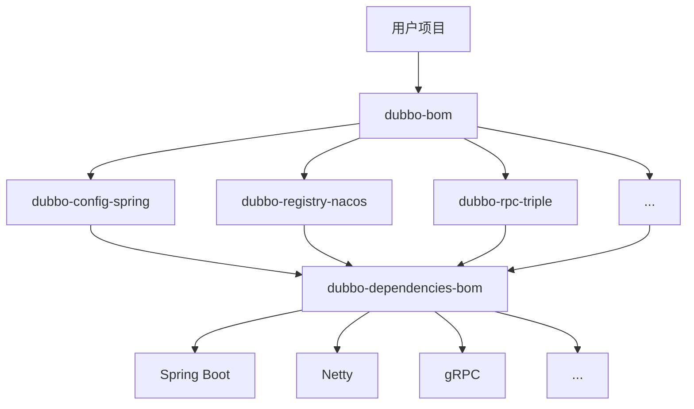
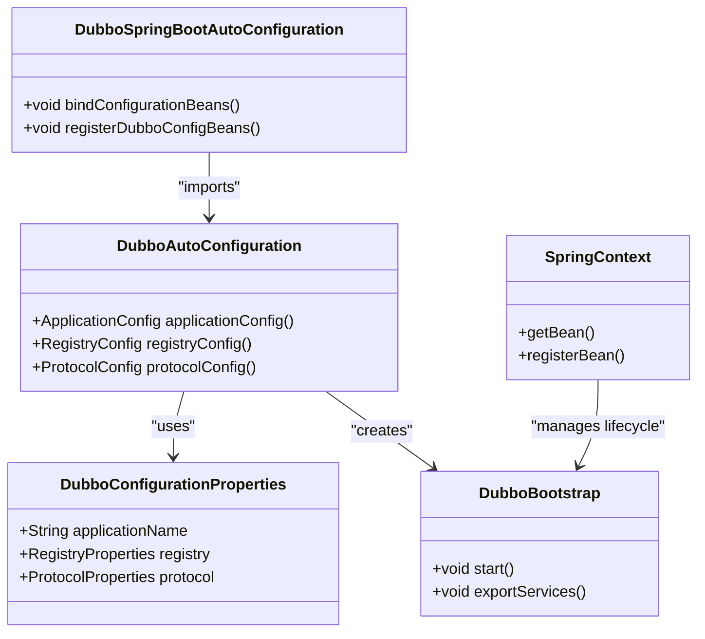

# 技术栈与依赖

<cite>
**本文档引用的文件**   
- [pom.xml](file://pom.xml)
- [dubbo-dependencies-bom/pom.xml](file://dubbo-dependencies-bom/pom.xml)
- [dubbo-distribution/dubbo-bom/pom.xml](file://dubbo-distribution/dubbo-bom/pom.xml)
- [dubbo-spring-boot-project/dubbo-spring-boot-autoconfigure/pom.xml](file://dubbo-spring-boot-project/dubbo-spring-boot-autoconfigure/pom.xml)
- [dubbo-spring-boot-project/dubbo-spring-boot-3-autoconfigure/pom.xml](file://dubbo-spring-boot-project/dubbo-spring-boot-3-autoconfigure/pom.xml)
- [dubbo-spring-boot-project/dubbo-spring-boot-starters/dubbo-spring-boot-starter/pom.xml](file://dubbo-spring-boot-project/dubbo-spring-boot-starters/dubbo-spring-boot-starter/pom.xml)
- [dubbo-spring-boot-project/dubbo-spring-boot-starters/dubbo-nacos-spring-boot-starter/pom.xml](file://dubbo-spring-boot-project/dubbo-spring-boot-starters/dubbo-nacos-spring-boot-starter/pom.xml)
- [dubbo-spring-boot-project/dubbo-spring-boot-starters/dubbo-zookeeper-curator5-spring-boot-starter/pom.xml](file://dubbo-spring-boot-project/dubbo-spring-boot-starters/dubbo-zookeeper-curator5-spring-boot-starter/pom.xml)
- [dubbo-demo/dubbo-demo-spring-boot/dubbo-demo-spring-boot-provider/pom.xml](file://dubbo-demo/dubbo-demo-spring-boot/dubbo-demo-spring-boot-provider/pom.xml)
- [dubbo-demo/dubbo-demo-spring-boot/dubbo-demo-spring-boot-consumer/pom.xml](file://dubbo-demo/dubbo-demo-spring-boot/dubbo-demo-spring-boot-consumer/pom.xml)
- [dubbo-demo/dubbo-demo-spring-boot/dubbo-demo-spring-boot-provider/src/main/resources/application.yml](file://dubbo-demo/dubbo-demo-spring-boot/dubbo-demo-spring-boot-provider/src/main/resources/application.yml)
- [dubbo-demo/dubbo-demo-spring-boot/dubbo-demo-spring-boot-consumer/src/main/resources/application.yml](file://dubbo-demo/dubbo-demo-spring-boot/dubbo-demo-spring-boot-consumer/src/main/resources/application.yml)
</cite>

## 目录
1. [简介](#简介)
2. [核心技术栈](#核心技术栈)
3. [关键框架依赖](#关键框架依赖)
4. [Maven依赖管理与BOM](#maven依赖管理与bom)
5. [Java版本支持](#java版本支持)
6. [Spring Boot集成](#spring-boot集成)
7. [依赖冲突解决策略](#依赖冲突解决策略)
8. [pom.xml配置示例](#pomxml配置示例)
9. [总结](#总结)

## 简介
Apache Dubbo是一个功能强大且用户友好的Web和RPC框架，支持多种语言实现。本技术栈与依赖文档旨在全面介绍Dubbo的技术生态系统，重点阐述其主要编程语言（Java）和关键框架依赖（如Spring Boot、Nacos、Zookeeper、Apollo、Netty、gRPC等）。文档将详细解释每个依赖库的用途及其在Dubbo架构中的角色，描述Maven依赖管理策略，特别是BOM（Bill of Materials）文件的使用方式。此外，还将涵盖Dubbo对不同Java版本的支持情况以及与Spring Boot的集成方式，为初学者提供依赖关系的概览，同时为经验丰富的开发者提供详细的版本兼容性信息和依赖冲突解决策略。

## 核心技术栈
Dubbo的核心技术栈建立在Java语言之上，利用了现代Java生态系统中的多种成熟框架和技术。其核心组件被设计为模块化，允许开发者根据需要选择和集成不同的功能模块。

### Java语言
Dubbo主要使用Java作为其开发语言，充分利用了Java的面向对象特性、丰富的标准库以及强大的生态系统。项目代码库的结构清晰地反映了其模块化设计，核心模块包括：
- **dubbo-common**: 提供Dubbo的基础公共类和工具。
- **dubbo-remoting**: 负责网络通信，支持多种协议。
- **dubbo-rpc**: 核心的远程过程调用实现。
- **dubbo-cluster**: 提供集群容错和负载均衡功能。
- **dubbo-registry**: 服务注册与发现模块。
- **dubbo-config**: 配置管理模块。
- **dubbo-serialization**: 序列化模块。

**Section sources**
- [pom.xml](file://pom.xml#L77-L85)

## 关键框架依赖
Dubbo的生态系统依赖于一系列关键的第三方框架和库，这些依赖在Dubbo的功能实现中扮演着至关重要的角色。

### Spring Boot
Spring Boot是Dubbo最重要的集成框架之一，它极大地简化了Dubbo应用的开发和部署。Dubbo提供了`dubbo-spring-boot-starter`，使得开发者可以通过简单的依赖引入和YAML配置即可启动一个功能完整的Dubbo服务。

### Nacos
Nacos是一个动态服务发现、配置管理和服务管理平台。Dubbo通过`dubbo-configcenter-nacos`和`dubbo-registry-nacos`模块与Nacos集成，实现服务的动态注册、发现和配置中心功能。

### Zookeeper
Zookeeper是一个分布式协调服务，常用于服务注册与发现。Dubbo通过`dubbo-registry-zookeeper`和`dubbo-configcenter-zookeeper`模块与Zookeeper集成，提供稳定的服务治理能力。

### Apollo
Apollo是携程开源的分布式配置中心。Dubbo通过`dubbo-configcenter-apollo`模块与Apollo集成，为应用提供统一的配置管理服务。

### Netty
Netty是一个异步事件驱动的网络应用框架，用于快速开发高性能、高可靠性的网络服务器和客户端。Dubbo的网络通信层（`dubbo-remoting-netty4`）基于Netty构建，提供了高效的TCP通信能力。

### gRPC
gRPC是一个高性能、开源的通用RPC框架，由Google开发。Dubbo通过Triple协议（`dubbo-rpc-triple`）实现了对gRPC的兼容，允许Dubbo服务与gRPC服务无缝互通。

**Section sources**
- [dubbo-dependencies-bom/pom.xml](file://dubbo-dependencies-bom/pom.xml#L90-L144)
- [dubbo-distribution/dubbo-bom/pom.xml](file://dubbo-distribution/dubbo-bom/pom.xml#L89-L114)

## Maven依赖管理与BOM
Dubbo项目采用了一套精细的Maven依赖管理策略，以确保依赖版本的一致性和项目的稳定性。

### BOM（Bill of Materials）文件
Dubbo使用BOM文件来集中管理其所有模块的依赖版本。项目中存在两个关键的BOM文件：
1.  **dubbo-dependencies-bom**: 这是Dubbo项目内部的依赖BOM，定义了Dubbo所依赖的所有第三方库的版本，如Spring、Netty、gRPC等。在根`pom.xml`中通过`<dependencyManagement>`导入此BOM，确保了整个项目依赖版本的统一。
2.  **dubbo-bom**: 这是为Dubbo用户提供的BOM，位于`dubbo-distribution/dubbo-bom`模块中。它将Dubbo自身的所有模块（如`dubbo-config-spring`、`dubbo-registry-nacos`等）的版本进行统一管理。用户在自己的项目中只需导入`dubbo-bom`，即可方便地引入任意Dubbo模块，而无需关心其具体版本号。



**Diagram sources **
- [pom.xml](file://pom.xml#L180-L188)
- [dubbo-dependencies-bom/pom.xml](file://dubbo-dependencies-bom/pom.xml)
- [dubbo-distribution/dubbo-bom/pom.xml](file://dubbo-distribution/dubbo-bom/pom.xml)

## Java版本支持
Dubbo对Java版本的支持非常广泛，旨在兼容从旧版本到最新版本的JDK。

### 支持的Java版本
根据项目根`pom.xml`中的配置，Dubbo默认的编译目标是Java 8（`<maven.compiler.target>1.8</maven.compiler.target>`）。然而，代码库中通过`JRE`枚举类（`org.apache.dubbo.common.utils.JRE`）明确支持从Java 8到Java 25的多个版本。这表明Dubbo不仅能在Java 8环境下稳定运行，也积极适配了后续的Java版本。

### 版本兼容性
Dubbo通过条件编译和运行时检查来处理不同Java版本间的API差异。例如，在`JdkCompiler`类中，会根据指定的Java版本（默认为1.8）来设置编译器选项（`-source`和`-target`），确保生成的字节码与目标JDK版本兼容。

**Section sources**
- [pom.xml](file://pom.xml#L131-L132)
- [dubbo-common/src/main/java/org/apache/dubbo/common/utils/JRE.java](file://dubbo-common/src/main/java/org/apache/dubbo/common/utils/JRE.java#L27-L64)
- [dubbo-common/src/main/java/org/apache/dubbo/common/compiler/support/JdkCompiler.java](file://dubbo-common/src/main/java/org/apache/dubbo/common/compiler/support/JdkCompiler.java#L66-L70)

## Spring Boot集成
Dubbo与Spring Boot的集成是其最便捷的使用方式之一，通过Starter机制实现了“开箱即用”。

### 集成原理
Dubbo的Spring Boot集成主要通过`dubbo-spring-boot-autoconfigure`模块实现。该模块利用了Spring Boot的自动配置机制（`@EnableAutoConfiguration`），当检测到Dubbo相关类在类路径上时，会自动配置Dubbo的`ApplicationConfig`、`RegistryConfig`等核心配置类，并将它们注册为Spring Bean。

### Starter模块
- **dubbo-spring-boot-starter**: 这是最基础的Starter，它依赖于`dubbo-spring-boot-autoconfigure`，为项目引入Dubbo的核心功能。
- **dubbo-nacos-spring-boot-starter**: 专门用于集成Nacos的Starter，简化了Nacos作为注册中心和配置中心的配置。
- **dubbo-zookeeper-curator5-spring-boot-starter**: 专门用于集成Zookeeper的Starter，简化了Zookeeper作为注册中心和配置中心的配置。



**Diagram sources **
- [dubbo-spring-boot-project/dubbo-spring-boot-autoconfigure/pom.xml](file://dubbo-spring-boot-project/dubbo-spring-boot-autoconfigure/pom.xml)
- [dubbo-spring-boot-project/dubbo-spring-boot-starters/dubbo-spring-boot-starter/pom.xml](file://dubbo-spring-boot-project/dubbo-spring-boot-starters/dubbo-spring-boot-starter/pom.xml)
- [dubbo-spring-boot-project/dubbo-spring-boot-starters/dubbo-nacos-spring-boot-starter/pom.xml](file://dubbo-spring-boot-project/dubbo-spring-boot-starters/dubbo-nacos-spring-boot-starter/pom.xml)
- [dubbo-spring-boot-project/dubbo-spring-boot-starters/dubbo-zookeeper-curator5-spring-boot-starter/pom.xml](file://dubbo-spring-boot-project/dubbo-spring-boot-starters/dubbo-zookeeper-curator5-spring-boot-starter/pom.xml)

## 依赖冲突解决策略
在复杂的微服务项目中，依赖冲突是常见问题。Dubbo通过其BOM机制和合理的依赖管理来有效避免和解决冲突。

### 使用BOM
最推荐的策略是在项目的`dependencyManagement`部分导入`dubbo-bom`。这可以确保所有Dubbo相关模块的版本都由BOM统一管理，从根本上避免了版本不一致的问题。

### 排除传递性依赖
当与其他框架集成时，可能会遇到传递性依赖冲突。例如，在`dubbo-zookeeper-curator5-spring-boot-starter`中，明确排除了Zookeeper对`logback`和`io.netty`的依赖，以防止与项目中其他组件的依赖发生冲突。

### 版本覆盖
如果项目中需要使用与Dubbo BOM中不同的第三方库版本，可以在项目的`dependencyManagement`中显式声明该依赖的版本，从而覆盖BOM中的版本。

**Section sources**
- [dubbo-dependencies-bom/pom.xml](file://dubbo-dependencies-bom/pom.xml#L348-L377)
- [dubbo-zookeeper-curator5-spring-boot-starter/pom.xml](file://dubbo-spring-boot-project/dubbo-spring-boot-starters/dubbo-zookeeper-curator5-spring-boot-starter/pom.xml#L40-L61)

## pom.xml配置示例
以下是一个典型的Dubbo Spring Boot应用的`pom.xml`配置示例，展示了如何正确引入Dubbo依赖。

### 基础配置
```xml
<dependencies>
    <!-- 引入Dubbo Spring Boot Starter -->
    <dependency>
        <groupId>org.apache.dubbo</groupId>
        <artifactId>dubbo-spring-boot-starter</artifactId>
        <version>${dubbo.version}</version>
    </dependency>
    
    <!-- 使用Zookeeper作为注册中心 -->
    <dependency>
        <groupId>org.apache.dubbo</groupId>
        <artifactId>dubbo-registry-zookeeper</artifactId>
        <version>${dubbo.version}</version>
    </dependency>
    
    <!-- 使用Zookeeper作为配置中心 -->
    <dependency>
        <groupId>org.apache.dubbo</groupId>
        <artifactId>dubbo-configcenter-zookeeper</artifactId>
        <version>${dubbo.version}</version>
    </dependency>
    
    <!-- Spring Boot Web Starter -->
    <dependency>
        <groupId>org.springframework.boot</groupId>
        <artifactId>spring-boot-starter-web</artifactId>
    </dependency>
</dependencies>
```

### 使用BOM的最佳实践
```xml
<dependencyManagement>
    <dependencies>
        <!-- 导入Dubbo BOM，统一管理版本 -->
        <dependency>
            <groupId>org.apache.dubbo</groupId>
            <artifactId>dubbo-bom</artifactId>
            <version>${dubbo.version}</version>
            <type>pom</type>
            <scope>import</scope>
        </dependency>
    </dependencies>
</dependencyManagement>

<dependencies>
    <!-- 引入Dubbo Starter，无需指定版本 -->
    <dependency>
        <groupId>org.apache.dubbo</groupId>
        <artifactId>dubbo-spring-boot-starter</artifactId>
    </dependency>
    
    <!-- 引入Nacos Starter，无需指定版本 -->
    <dependency>
        <groupId>org.apache.dubbo</groupId>
        <artifactId>dubbo-nacos-spring-boot-starter</artifactId>
    </dependency>
    
    <dependency>
        <groupId>org.springframework.boot</groupId>
        <artifactId>spring-boot-starter-web</artifactId>
    </dependency>
</dependencies>
```

**Section sources**
- [dubbo-demo/dubbo-demo-spring-boot/dubbo-demo-spring-boot-provider/pom.xml](file://dubbo-demo/dubbo-demo-spring-boot/dubbo-demo-spring-boot-provider/pom.xml)
- [dubbo-demo/dubbo-demo-spring-boot/dubbo-demo-spring-boot-consumer/pom.xml](file://dubbo-demo/dubbo-demo-spring-boot/dubbo-demo-spring-boot-consumer/pom.xml)

## 总结
本文档全面介绍了Apache Dubbo的技术栈与依赖体系。Dubbo以Java为核心，通过模块化的设计和对Spring Boot的深度集成，构建了一个强大且灵活的微服务生态。其关键依赖如Nacos、Zookeeper、Netty和gRPC等，分别在服务治理、配置管理和网络通信等方面提供了坚实的基础。通过`dubbo-bom`和`dubbo-dependencies-bom`两个BOM文件，Dubbo实现了对自身模块和第三方依赖的精细化管理，有效解决了版本冲突问题。对于开发者而言，遵循使用BOM的最佳实践，可以极大地简化项目配置，确保依赖的稳定性和一致性，从而更专注于业务逻辑的开发。