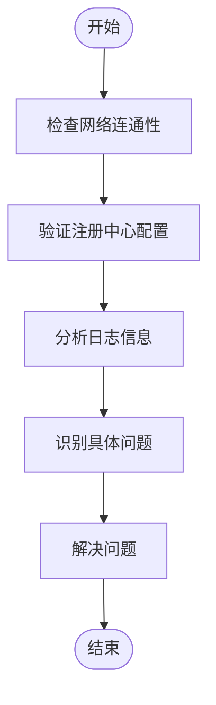
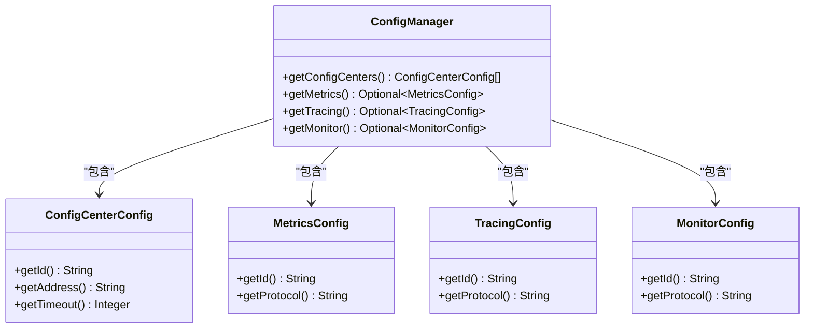
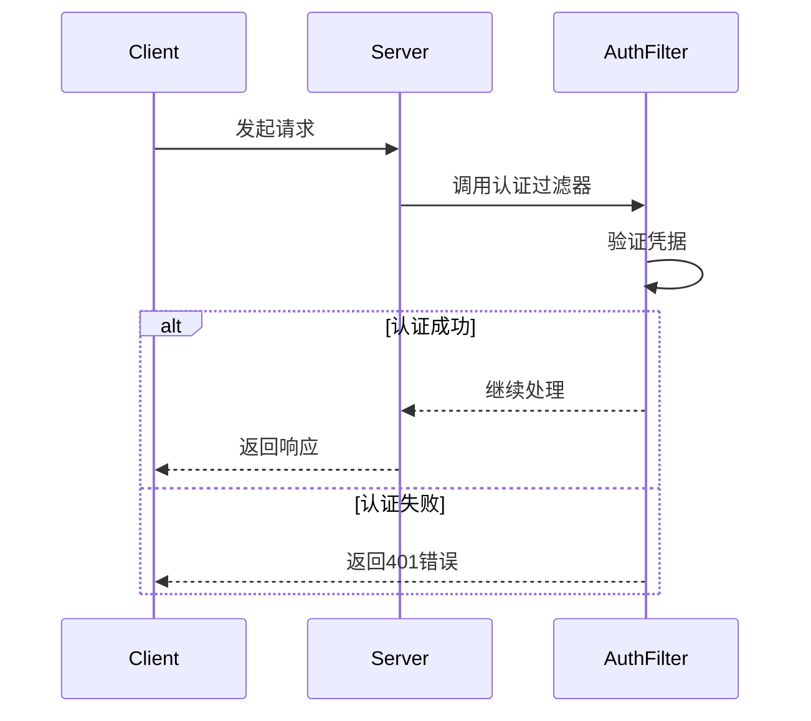
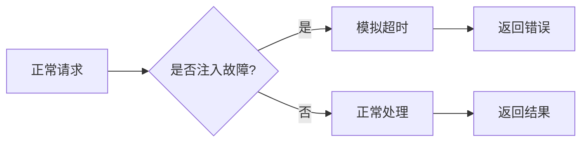

# 故障排除

<cite>
**本文档中引用的文件**  
- [ServiceDiscoveryRegistry.java](file://dubbo-registry/dubbo-registry-api/src/main/java/org/apache/dubbo/registry/client/ServiceDiscoveryRegistry.java)
- [ServiceDiscovery.java](file://dubbo-registry/dubbo-registry-api/src/main/java/org/apache/dubbo/registry/client/ServiceDiscovery.java)
- [AbstractInterfaceConfig.java](file://dubbo-common/src/main/java/org/apache/dubbo/config/AbstractInterfaceConfig.java)
- [FailsafeErrorTypeAwareLogger.java](file://dubbo-common/src/main/java/org/apache/dubbo/common/logger/support/FailsafeErrorTypeAwareLogger.java)
- [LoggerCodeConstants.java](file://dubbo-common/src/main/java/org/apache/dubbo/common/constants/LoggerCodeConstants.java)
- [Profiler.java](file://dubbo-common/src/main/java/org/apache/dubbo/common/profiler/Profiler.java)
- [ProfilerSwitch.java](file://dubbo-common/src/main/java/org/apache/dubbo/common/profiler/ProfilerSwitch.java)
- [RpcException.java](file://dubbo-rpc/dubbo-rpc-api/src/main/java/org/apache/dubbo/rpc/RpcException.java)
- [TimeoutException.java](file://dubbo-remoting/dubbo-remoting-api/src/main/java/org/apache/dubbo/remoting/TimeoutException.java)
- [ReferenceConfig.java](file://dubbo-config/dubbo-config-api/src/main/java/org/apache/dubbo/config/ReferenceConfig.java)
- [GetConfig.java](file://dubbo-plugin/dubbo-qos/src/main/java/org/apache/dubbo/qos/command/impl/GetConfig.java)
- [ConfiguratorConfig.java](file://dubbo-cluster/src/main/java/org/apache/dubbo/rpc/cluster/configurator/parser/model/ConfiguratorConfig.java)
- [FailbackClusterInvoker.java](file://dubbo-cluster/src/main/java/org/apache/dubbo/rpc/cluster/support/FailbackClusterInvoker.java)
- [AbstractRetryTask.java](file://dubbo-registry/dubbo-registry-api/src/main/java/org/apache/dubbo/registry/retry/AbstractRetryTask.java)
- [ServiceInstancesChangedListener.java](file://dubbo-registry/dubbo-registry-api/src/main/java/org/apache/dubbo/registry/client/event/listener/ServiceInstancesChangedListener.java)
- [AccessKeyNotFoundException.java](file://dubbo-plugin/dubbo-auth/src/main/java/org/apache/dubbo/auth/exception/AccessKeyNotFoundException.java)
- [RpcAuthenticationException.java](file://dubbo-plugin/dubbo-auth/src/main/java/org/apache/dubbo/auth/exception/RpcAuthenticationException.java)
- [AuthenticationExceptionTranslatorFilter.java](file://dubbo-plugin/dubbo-spring-security/src/main/java/org/apache/dubbo/spring/security/filter/AuthenticationExceptionTranslatorFilter.java)
- [DefaultAnonymousAccessPermissionCheckerTest.java](file://dubbo-plugin/dubbo-qos/src/test/java/org/apache/dubbo/qos/permission/DefaultAnonymousAccessPermissionCheckerTest.java)
- [ForeignHostPermitHandlerTest.java](file://dubbo-plugin/dubbo-qos/src/test/java/org/apache/dubbo/qos/server/handler/ForeignHostPermitHandlerTest.java)
</cite>

## 目录
1. [简介](#简介)
2. [服务注册与发现问题排查](#服务注册与发现问题排查)
3. [性能问题诊断](#性能问题诊断)
4. [配置问题解决策略](#配置问题解决策略)
5. [安全相关问题处理](#安全相关问题处理)
6. [常见错误代码解释与解决方案](#常见错误代码解释与解决方案)
7. [高级调试工具与技巧](#高级调试工具与技巧)
8. [实际故障案例分析](#实际故障案例分析)
9. [预防措施与最佳实践](#预防措施与最佳实践)

## 简介

Apache Dubbo 是一个功能强大的微服务框架，提供了服务发现、流量管理、可观测性、安全等完整的解决方案。在实际使用过程中，可能会遇到各种问题，包括服务注册与发现失败、性能瓶颈、配置错误以及安全认证问题等。本文档旨在为开发者提供全面的故障排除指南，帮助快速定位和解决常见问题。

**本文档中引用的文件**
- [README.md](file://README.md#L1-L141)
- [SECURITY.md](file://SECURITY.md#L1-L35)

## 服务注册与发现问题排查

服务注册与发现是 Dubbo 的核心功能之一。当服务提供者无法被消费者发现时，通常需要检查网络连通性、配置正确性和日志信息。

### 网络连通性检查

首先确认注册中心（如 Zookeeper、Nacos）是否正常运行，并且服务提供者和消费者能够访问注册中心。可以通过 ping 命令或 telnet 测试网络连通性。

### 配置验证

检查 `RegistryConfig` 配置是否正确，包括地址、协议、超时时间等参数。例如：

```java
RegistryConfig registry = new RegistryConfig();
registry.setAddress("zookeeper://127.0.0.1:2181");
registry.setTimeout(5000);
```

### 日志分析

Dubbo 使用 `FailsafeErrorTypeAwareLogger` 进行日志记录，该日志器具有容错能力，即使底层日志框架出现问题也不会影响业务。日志中包含错误代码，可以用于快速定位问题。



**图源**
- [FailsafeErrorTypeAwareLogger.java](file://dubbo-common/src/main/java/org/apache/dubbo/common/logger/support/FailsafeErrorTypeAwareLogger.java#L37-L163)
- [LoggerCodeConstants.java](file://dubbo-common/src/main/java/org/apache/dubbo/common/constants/LoggerCodeConstants.java#L58-L113)

**本节来源**
- [ServiceDiscoveryRegistry.java](file://dubbo-registry/dubbo-registry-api/src/main/java/org/apache/dubbo/registry/client/ServiceDiscoveryRegistry.java#L108-L145)
- [ServiceDiscovery.java](file://dubbo-registry/dubbo-registry-api/src/main/java/org/apache/dubbo/registry/client/ServiceDiscovery.java#L88-L110)

## 性能问题诊断

性能问题是微服务系统中常见的挑战，主要包括慢调用、线程阻塞和资源使用过高。

### 慢调用分析

使用 Dubbo 内置的 Profiler 工具来分析调用链路的耗时情况。Profiler 可以记录每个方法的执行时间和调用次数，帮助识别性能瓶颈。

```java
ProfilerEntry entry = Profiler.start("method-name");
try {
    // 执行业务逻辑
} finally {
    Profiler.release(entry);
}
```

### 线程阻塞检测

通过 JVM 自带的工具（如 jstack）或第三方监控工具（如 Prometheus + Grafana）来检测线程阻塞情况。重点关注等待锁的线程和长时间运行的线程。

### 资源使用监控

监控 CPU、内存、网络 I/O 等资源使用情况。Dubbo 提供了 Metrics 模块，可以收集和上报各种指标数据。


**图源**
- [Profiler.java](file://dubbo-common/src/main/java/org/apache/dubbo/common/profiler/Profiler.java#L34-L115)
- [ProfilerSwitch.java](file://dubbo-common/src/main/java/org/apache/dubbo/common/profiler/ProfilerSwitch.java#L1-L63)

**本节来源**
- [Profiler.java](file://dubbo-common/src/main/java/org/apache/dubbo/common/profiler/Profiler.java#L34-L115)
- [ProfilerSwitch.java](file://dubbo-common/src/main/java/org/apache/dubbo/common/profiler/ProfilerSwitch.java#L1-L63)

## 配置问题解决策略

配置问题是导致 Dubbo 应用异常的常见原因。理解配置优先级和动态配置机制对于解决问题至关重要。

### 配置优先级

Dubbo 支持多种配置方式，包括 XML、注解、API 和外部化配置。不同配置方式之间存在优先级关系，通常外部化配置优先级最高。

### 动态配置调试

使用 QoS（Quality of Service）命令行工具可以实时查看和修改运行时配置。例如，使用 `getConfig` 命令获取当前配置：

```java
GetConfig.getConfig(configManager, plainOutput, applicationMap, args);
```



**图源**
- [GetConfig.java](file://dubbo-plugin/dubbo-qos/src/main/java/org/apache/dubbo/qos/command/impl/GetConfig.java#L114-L139)
- [ConfiguratorConfig.java](file://dubbo-cluster/src/main/java/org/apache/dubbo/rpc/cluster/configurator/parser/model/ConfiguratorConfig.java#L23-L98)

**本节来源**
- [GetConfig.java](file://dubbo-plugin/dubbo-qos/src/main/java/org/apache/dubbo/qos/command/impl/GetConfig.java#L114-L139)
- [ConfiguratorConfig.java](file://dubbo-cluster/src/main/java/org/apache/dubbo/rpc/cluster/configurator/parser/model/ConfiguratorConfig.java#L23-L98)

## 安全相关问题处理

安全问题是微服务架构中不可忽视的部分，包括认证失败和权限不足等问题。

### 认证失败排查

检查认证配置是否正确，包括用户名、密码、访问密钥等。如果使用自定义认证机制，确保 `Authenticator` 实现正确。

```java
public class RpcAuthenticationException extends Exception {
    public RpcAuthenticationException(String message) {
        super(message);
    }
}
```

### 权限不足排查

检查权限配置和访问控制列表（ACL）。使用 QoS 工具测试不同权限级别的访问。



**图源**
- [RpcAuthenticationException.java](file://dubbo-plugin/dubbo-auth/src/main/java/org/apache/dubbo/auth/exception/RpcAuthenticationException.java#L1-L29)
- [AuthenticationExceptionTranslatorFilter.java](file://dubbo-plugin/dubbo-spring-security/src/main/java/org/apache/dubbo/spring/security/filter/AuthenticationExceptionTranslatorFilter.java#L65-L75)

**本节来源**
- [RpcAuthenticationException.java](file://dubbo-plugin/dubbo-auth/src/main/java/org/apache/dubbo/auth/exception/RpcAuthenticationException.java#L1-L29)
- [AuthenticationExceptionTranslatorFilter.java](file://dubbo-plugin/dubbo-spring-security/src/main/java/org/apache/dubbo/spring/security/filter/AuthenticationExceptionTranslatorFilter.java#L65-L75)

## 常见错误代码解释与解决方案

Dubbo 定义了一系列错误代码，用于标识不同类型的问题。了解这些错误代码有助于快速定位和解决问题。

### 错误代码分类

- **0-xx**: 通用错误
- **1-xx**: 注册中心模块错误
- **2-xx**: 集群模块错误
- **3-xx**: 代理模块错误
- **4-xx**: 协议模块错误
- **5-xx**: 序列化模块错误
- **6-xx**: 传输模块错误
- **7-xx**: QoS 模块错误

### 常见错误代码示例

| 错误代码 | 含义 | 解决方案 |
|---------|------|---------|
| 1-1 | 注册中心地址无效 | 检查注册中心地址配置 |
| 1-4 | 无可用服务地址 | 检查服务提供者是否正常注册 |
| 2-10 | 调用服务失败 | 检查网络连通性和服务状态 |
| 3-8 | 代理失败 | 检查代理配置和目标服务 |
| 7-7 | 权限拒绝异常 | 检查用户权限和访问控制 |

**本节来源**
- [LoggerCodeConstants.java](file://dubbo-common/src/main/java/org/apache/dubbo/common/constants/LoggerCodeConstants.java#L212-L462)
- [RpcException.java](file://dubbo-rpc/dubbo-rpc-api/src/main/java/org/apache/dubbo/rpc/RpcException.java#L30-L74)

## 高级调试工具与技巧

除了基本的日志和监控工具外，Dubbo 还提供了一些高级调试工具和技巧。

### QoS 工具

QoS（Quality of Service）工具提供了一个命令行界面，可以实时查看和修改运行时配置。支持多种命令，如 `ls`、`ps`、`trace` 等。

### 故障注入

通过配置故障注入规则，可以模拟各种异常情况，如超时、异常抛出等，用于测试系统的容错能力。



**本节来源**
- [DefaultAnonymousAccessPermissionCheckerTest.java](file://dubbo-plugin/dubbo-qos/src/test/java/org/apache/dubbo/qos/permission/DefaultAnonymousAccessPermissionCheckerTest.java#L59-L91)
- [ForeignHostPermitHandlerTest.java](file://dubbo-plugin/dubbo-qos/src/test/java/org/apache/dubbo/qos/server/handler/ForeignHostPermitHandlerTest.java#L42-L150)

## 实际故障案例分析

### 案例一：服务无法注册

**问题描述**：服务提供者启动后，消费者无法发现该服务。

**排查步骤**：
1. 检查注册中心是否正常运行
2. 检查服务提供者的注册配置
3. 查看日志中是否有相关错误信息

**解决方案**：发现是网络防火墙阻止了注册中心端口的通信，开放相应端口后问题解决。

### 案例二：调用超时

**问题描述**：消费者调用服务提供者时经常出现超时。

**排查步骤**：
1. 使用 Profiler 分析调用链路耗时
2. 检查服务提供者的处理逻辑
3. 监控系统资源使用情况

**解决方案**：发现是数据库查询性能瓶颈，优化 SQL 查询后问题解决。

**本节来源**
- [ReferenceConfig.java](file://dubbo-config/dubbo-config-api/src/main/java/org/apache/dubbo/config/ReferenceConfig.java#L725-L745)
- [FailbackClusterInvoker.java](file://dubbo-cluster/src/main/java/org/apache/dubbo/rpc/cluster/support/FailbackClusterInvoker.java#L85-L187)

## 预防措施与最佳实践

### 配置管理

- 使用外部化配置管理工具（如 Nacos、Apollo）
- 定期审查和更新配置
- 使用配置版本控制

### 监控与告警

- 建立全面的监控体系
- 设置合理的告警阈值
- 定期进行故障演练

### 安全加固

- 启用服务认证和授权
- 定期更新依赖库
- 遵循最小权限原则

**本节来源**
- [AbstractRetryTask.java](file://dubbo-registry/dubbo-registry-api/src/main/java/org/apache/dubbo/registry/retry/AbstractRetryTask.java#L71-L113)
- [ServiceInstancesChangedListener.java](file://dubbo-registry/dubbo-registry-api/src/main/java/org/apache/dubbo/registry/client/event/listener/ServiceInstancesChangedListener.java#L233-L342)