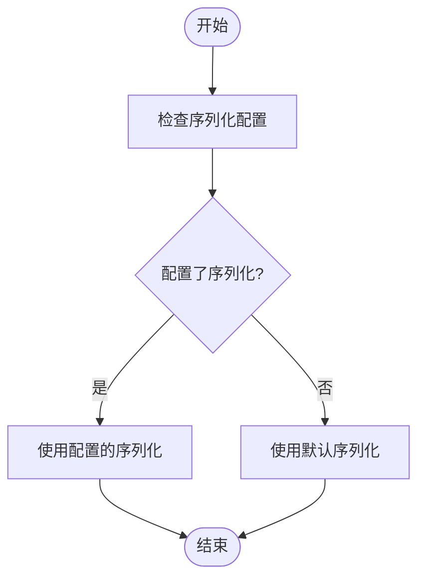
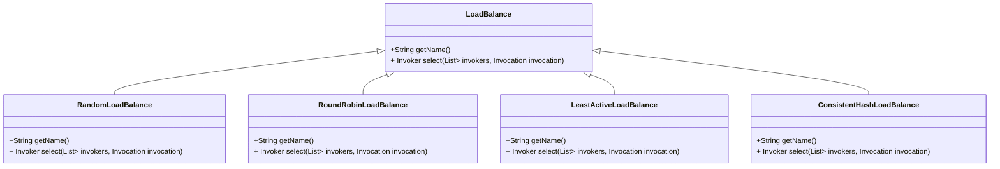
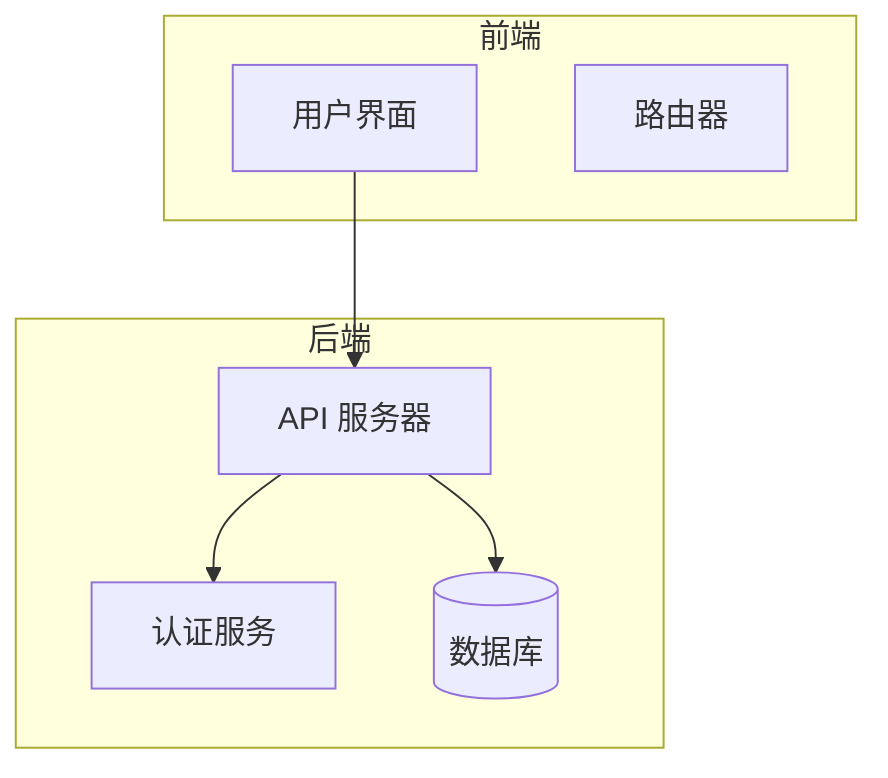
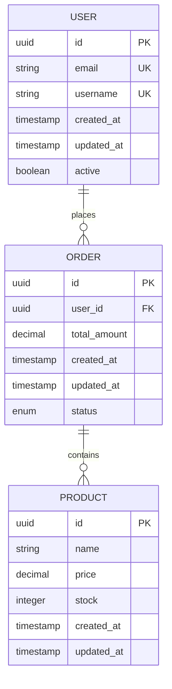
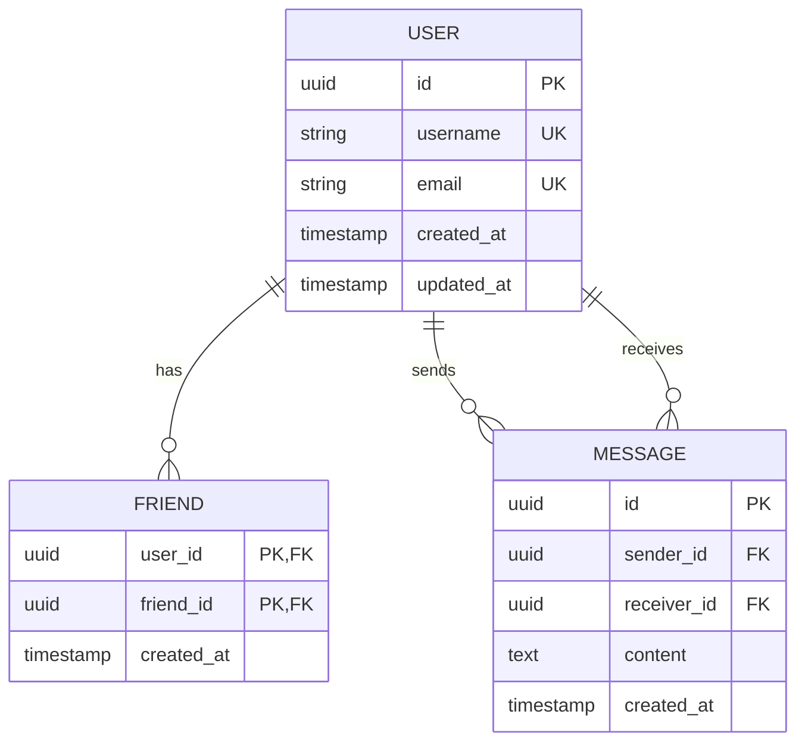

# 最佳实践

<cite>
**本文档引用的文件**   
- [pom.xml](file://pom.xml)
- [README.md](file://README.md)
- [ApplicationConfig.java](file://dubbo-common/src/main/java/org/apache/dubbo/config/ApplicationConfig.java)
- [ReferenceConfig.java](file://dubbo-config/dubbo-config-api/src/main/java/org/apache/dubbo/config/ReferenceConfig.java)
- [ServiceConfig.java](file://dubbo-config/dubbo-config-api/src/main/java/org/apache/dubbo/config/ServiceConfig.java)
- [ProtocolConfig.java](file://dubbo-common/src/main/java/org/apache/dubbo/config/ProtocolConfig.java)
- [MetricsConfig.java](file://dubbo-common/src/main/java/org/apache/dubbo/config/MetricsConfig.java)
- [MonitorConfig.java](file://dubbo-common/src/main/java/org/apache/dubbo/config/MonitorConfig.java)
- [DefaultApplicationDeployer.java](file://dubbo-config/dubbo-config-api/src/main/java/org/apache/dubbo/config/deploy/DefaultApplicationDeployer.java)
- [FixedThreadPool.java](file://dubbo-common/src/main/java/org/apache/dubbo/common/threadpool/support/fixed/FixedThreadPool.java)
- [LimitedThreadPool.java](file://dubbo-common/src/main/java/org/apache/dubbo/common/threadpool/support/limited/LimitedThreadPool.java)
- [FastJson2Serialization.java](file://dubbo-serialization/dubbo-serialization-fastjson2/src/main/java/org/apache/dubbo/common/serialize/fastjson2/FastJson2Serialization.java)
- [RandomLoadBalance.java](file://dubbo-cluster/src/main/java/org/apache/dubbo/rpc/cluster/loadbalance/RandomLoadBalance.java)
</cite>

## 目录
1. [引言](#引言)
2. [服务设计最佳实践](#服务设计最佳实践)
3. [性能优化技巧](#性能优化技巧)
4. [高可用性配置](#高可用性配置)
5. [监控和告警配置](#监控和告警配置)
6. [初学者使用指南](#初学者使用指南)
7. [生产环境部署架构](#生产环境部署架构)
8. [案例分析](#案例分析)
9. [常见问题预防与解决方案](#常见问题预防与解决方案)
10. [结论](#结论)

## 引言

Apache Dubbo 是一个功能强大且用户友好的 Web 和 RPC 框架，支持多种语言实现，包括 Java、Go、Python、PHP、Erlang、Rust 和 Node.js/Web。Dubbo 提供了通信、服务发现、流量管理、可观测性、安全、工具和构建企业级微服务的最佳实践解决方案。

Dubbo 的架构设计旨在提供高性能、高可用性和可扩展性的分布式服务治理能力。它通过 RPC 协议（如 Triple、TCP、REST 等）实现消费者和提供者之间的通信，消费者动态地从注册中心（如 Zookeeper、Nacos）发现提供者实例，并使用定义的策略管理流量。Dubbo 内置支持动态配置、指标、追踪、安全和可视化控制台。

本最佳实践文档旨在为 Dubbo 的生产环境使用提供全面的指导，涵盖服务设计、性能优化、高可用性配置、监控告警、部署架构和运维经验等方面，帮助开发者和运维人员更好地使用 Dubbo 构建稳定可靠的分布式系统。

**本文档引用的文件**   
- [pom.xml](file://pom.xml)
- [README.md](file://README.md)

## 服务设计最佳实践

### 接口设计

在 Dubbo 中，服务接口设计是构建分布式系统的基础。服务接口应该遵循单一职责原则，每个接口只负责一个明确的业务功能。接口方法的参数和返回值应该尽量使用简单的数据结构，避免使用复杂的嵌套对象。

服务接口应该定义在独立的模块中，以便于服务提供者和消费者共享。接口类应该使用 `@Service` 注解标记，以便 Dubbo 能够自动扫描和注册服务。

```java
public interface DemoService {
    String sayHello(String name);
}
```

**本文档引用的文件**   
- [ApplicationConfig.java](file://dubbo-common/src/main/java/org/apache/dubbo/config/ApplicationConfig.java)

### 版本控制

Dubbo 支持服务的版本控制，通过在服务配置中设置 `version` 属性来实现。版本控制可以帮助实现服务的灰度发布和 A/B 测试。

```java
@Service(version = "1.0.0")
public class DemoServiceImpl implements DemoService {
    // ...
}
```

消费者在引用服务时，也需要指定相应的版本号。

```java
@Reference(version = "1.0.0")
private DemoService demoService;
```

**本文档引用的文件**   
- [ReferenceConfig.java](file://dubbo-config/dubbo-config-api/src/main/java/org/apache/dubbo/config/ReferenceConfig.java)

### 服务拆分策略

合理的服务拆分是微服务架构成功的关键。服务拆分应该基于业务领域进行，每个服务应该围绕一个明确的业务能力构建。服务之间的依赖关系应该尽量简单，避免形成复杂的依赖网络。

在 Dubbo 中，可以通过 `group` 属性将服务分组，以便于管理和路由。

```java
@Service(group = "order")
public class OrderServiceImpl implements OrderService {
    // ...
}
```

**本文档引用的文件**   
- [ServiceConfig.java](file://dubbo-config/dubbo-config-api/src/main/java/org/apache/dubbo/config/ServiceConfig.java)

## 性能优化技巧

### 线程池配置

Dubbo 的线程池配置对性能有重要影响。Dubbo 提供了多种线程池类型，包括 `fixed`、`cached`、`limited` 等。

`fixed` 类型的线程池创建一个固定大小的线程池，适用于负载稳定的服务。

```java
<bean id="fixedThreadPool" class="org.apache.dubbo.common.threadpool.support.fixed.FixedThreadPool"/>
```

`limited` 类型的线程池创建一个有界线程池，当线程数达到上限时，新的任务将被拒绝。

```java
<bean id="limitedThreadPool" class="org.apache.dubbo.common.threadpool.support.limited.LimitedThreadPool"/>
```

**本文档引用的文件**   
- [FixedThreadPool.java](file://dubbo-common/src/main/java/org/apache/dubbo/common/threadpool/support/fixed/FixedThreadPool.java)
- [LimitedThreadPool.java](file://dubbo-common/src/main/java/org/apache/dubbo/common/threadpool/support/limited/LimitedThreadPool.java)

### 连接池管理

Dubbo 的连接池管理主要通过 `connections` 参数控制。`connections` 参数指定了每个服务提供者实例的最大连接数。

```java
@Reference(connections = 10)
private DemoService demoService;
```

合理的连接池配置可以提高服务的并发处理能力，但过大的连接数可能会导致资源浪费和性能下降。

**本文档引用的文件**   
- [ProtocolConfig.java](file://dubbo-common/src/main/java/org/apache/dubbo/config/ProtocolConfig.java)

### 序列化选择

Dubbo 支持多种序列化方式，包括 Hessian2、JSON、FastJson2 等。选择合适的序列化方式可以显著提高性能。

FastJson2 是一种高性能的 JSON 序列化库，适用于需要高吞吐量的场景。

```java
<bean id="fastJson2Serialization" class="org.apache.dubbo.common.serialize.fastjson2.FastJson2Serialization"/>
```



**本文档引用的文件**   
- [FastJson2Serialization.java](file://dubbo-serialization/dubbo-serialization-fastjson2/src/main/java/org/apache/dubbo/common/serialize/fastjson2/FastJson2Serialization.java)

## 高可用性配置

### 容错策略

Dubbo 提供了多种容错策略，包括 `failover`、`failfast`、`failsafe`、`failback` 和 `forking`。

`failover` 策略在调用失败时会自动重试其他服务器，通常用于读操作。

```java
@Reference(cluster = "failover")
private DemoService demoService;
```

`failfast` 策略在调用失败时立即报错，适用于非幂等操作。

```java
@Reference(cluster = "failfast")
private DemoService demoService;
```

**本文档引用的文件**   
- [ServiceConfig.java](file://dubbo-config/dubbo-config-api/src/main/java/org/apache/dubbo/config/ServiceConfig.java)

### 负载均衡

Dubbo 支持多种负载均衡策略，包括随机、轮询、最少活跃调用数和一致性哈希。

随机负载均衡策略通过随机选择一个提供者来分发请求。

```java
@Reference(loadbalance = "random")
private DemoService demoService;
```



**本文档引用的文件**   
- [RandomLoadBalance.java](file://dubbo-cluster/src/main/java/org/apache/dubbo/rpc/cluster/loadbalance/RandomLoadBalance.java)

### 故障转移

Dubbo 的故障转移机制通过 `retries` 参数控制。`retries` 参数指定了在调用失败时的重试次数。

```java
@Reference(retries = 3)
private DemoService demoService;
```

合理的故障转移配置可以提高服务的可用性，但过高的重试次数可能会导致雪崩效应。

**本文档引用的文件**   
- [ReferenceConfig.java](file://dubbo-config/dubbo-config-api/src/main/java/org/apache/dubbo/config/ReferenceConfig.java)

## 监控和告警配置

### 关键指标选择

Dubbo 提供了丰富的监控指标，包括调用次数、调用耗时、失败次数等。这些指标可以通过 Prometheus、Micrometer 等监控系统收集和展示。

```java
@DubboService
public class MetricsConfig {
    private String protocol;
    private String host;
    private Integer port;
    // ...
}
```

**本文档引用的文件**   
- [MetricsConfig.java](file://dubbo-common/src/main/java/org/apache/dubbo/config/MetricsConfig.java)

### 告警阈值设置

合理的告警阈值设置可以帮助及时发现和解决问题。常见的告警阈值包括：

- 调用失败率超过 1%
- 平均响应时间超过 100ms
- 系统负载超过 80%

```java
@DubboService
public class MonitorConfig {
    private String protocol;
    private String address;
    // ...
}
```

**本文档引用的文件**   
- [MonitorConfig.java](file://dubbo-common/src/main/java/org/apache/dubbo/config/MonitorConfig.java)

## 初学者使用指南

### 快速入门

Dubbo 提供了 5 分钟快速入门指南，帮助开发者快速上手。

1. 添加 Dubbo 依赖
2. 定义服务接口
3. 实现服务
4. 配置服务提供者
5. 配置服务消费者
6. 启动服务

```xml
<dependency>
    <groupId>org.apache.dubbo</groupId>
    <artifactId>dubbo-spring-boot-starter</artifactId>
    <version>3.3.6</version>
</dependency>
```

**本文档引用的文件**   
- [pom.xml](file://pom.xml)

### 常见配置

Dubbo 的常见配置包括应用配置、协议配置、注册中心配置等。

```yaml
dubbo:
  application:
    name: demo-provider
  protocol:
    name: dubbo
    port: 20880
  registry:
    address: nacos://127.0.0.1:8848
```

**本文档引用的文件**   
- [ApplicationConfig.java](file://dubbo-common/src/main/java/org/apache/dubbo/config/ApplicationConfig.java)

## 生产环境部署架构

### 部署模式

Dubbo 支持多种部署模式，包括单机部署、集群部署、容器化部署等。

在生产环境中，推荐使用容器化部署，结合 Kubernetes 进行服务编排和管理。



**本文档引用的文件**   
- [DefaultApplicationDeployer.java](file://dubbo-config/dubbo-config-api/src/main/java/org/apache/dubbo/config/deploy/DefaultApplicationDeployer.java)

### 运维经验

在生产环境中，需要关注服务的健康状况、性能指标和日志信息。建议使用 Prometheus、Grafana、ELK 等工具进行监控和日志分析。

定期进行压力测试和故障演练，确保系统的稳定性和可靠性。

**本文档引用的文件**   
- [DefaultApplicationDeployer.java](file://dubbo-config/dubbo-config-api/src/main/java/org/apache/dubbo/config/deploy/DefaultApplicationDeployer.java)

## 案例分析

### 电商系统

在电商系统中，可以将订单、库存、支付等业务拆分为独立的服务。通过 Dubbo 实现服务之间的通信和协调。



### 社交网络

在社交网络中，可以将用户、好友、消息等业务拆分为独立的服务。通过 Dubbo 实现服务之间的通信和协调。



## 常见问题预防与解决方案

### 服务注册失败

服务注册失败可能是由于网络问题、注册中心故障或配置错误导致的。可以通过检查网络连接、注册中心状态和配置文件来解决。

```java
if (!registry.isConnected()) {
    throw new IllegalStateException("Registry not connected");
}
```

**本文档引用的文件**   
- [DefaultApplicationDeployer.java](file://dubbo-config/dubbo-config-api/src/main/java/org/apache/dubbo/config/deploy/DefaultApplicationDeployer.java)

### 调用超时

调用超时可能是由于网络延迟、服务负载过高或代码性能问题导致的。可以通过优化网络、增加服务实例或优化代码来解决。

```java
@Reference(timeout = 5000)
private DemoService demoService;
```

**本文档引用的文件**   
- [ReferenceConfig.java](file://dubbo-config/dubbo-config-api/src/main/java/org/apache/dubbo/config/ReferenceConfig.java)

### 序列化错误

序列化错误可能是由于数据类型不匹配或序列化库版本不兼容导致的。可以通过检查数据类型和升级序列化库来解决。

```java
try {
    byte[] data = serialization.serialize(obj);
} catch (IOException e) {
    logger.error("Serialization failed", e);
}
```

**本文档引用的文件**   
- [FastJson2Serialization.java](file://dubbo-serialization/dubbo-serialization-fastjson2/src/main/java/org/apache/dubbo/common/serialize/fastjson2/FastJson2Serialization.java)

## 结论

Dubbo 是一个功能强大且灵活的 RPC 框架，适用于构建大规模分布式系统。通过遵循本文档中的最佳实践，可以有效地提高系统的性能、可用性和可维护性。

在实际应用中，需要根据具体的业务场景和技术栈选择合适的配置和策略。持续的监控和优化是确保系统稳定运行的关键。

**本文档引用的文件**   
- [README.md](file://README.md)