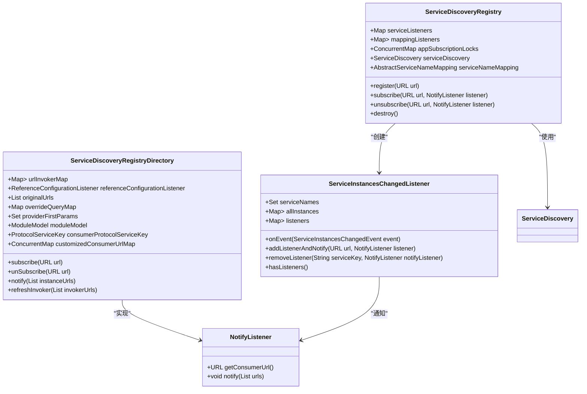
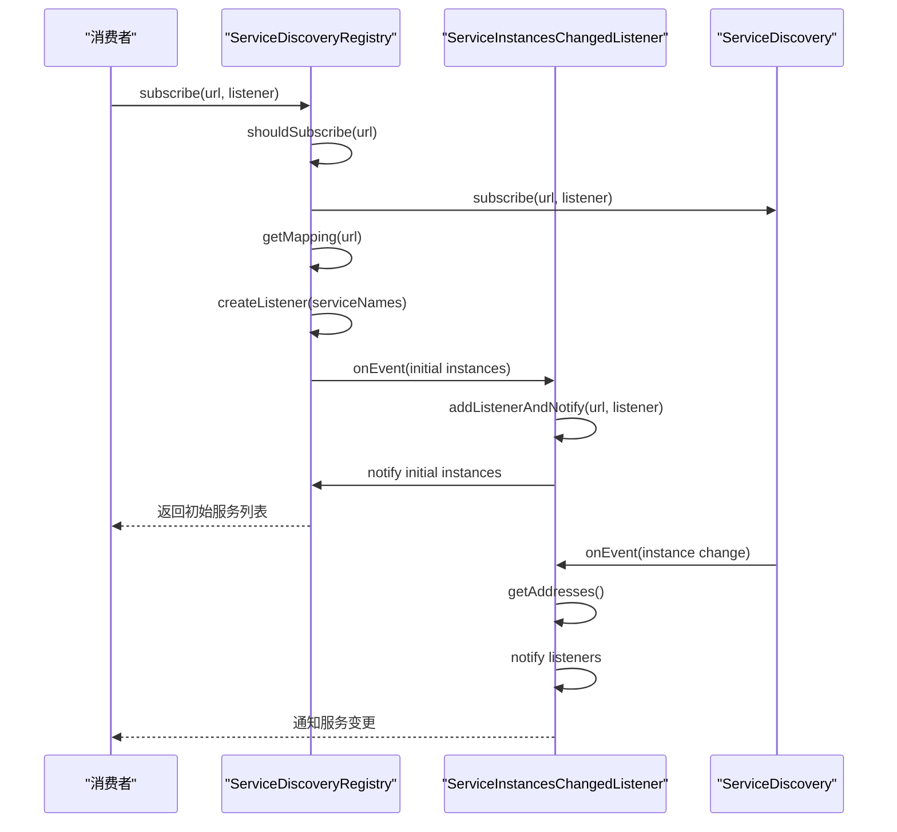
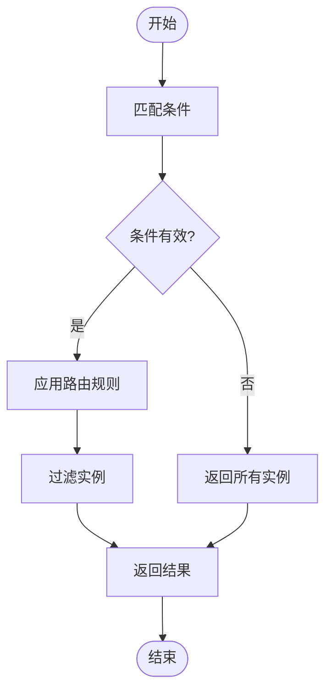
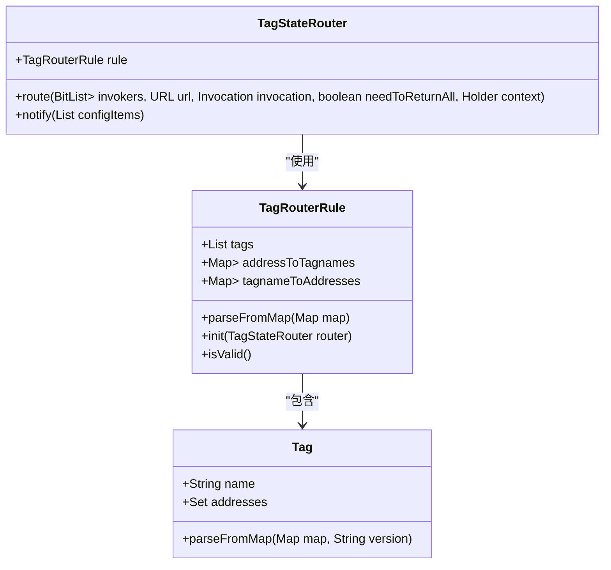
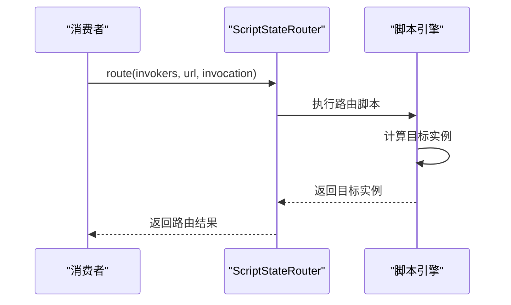
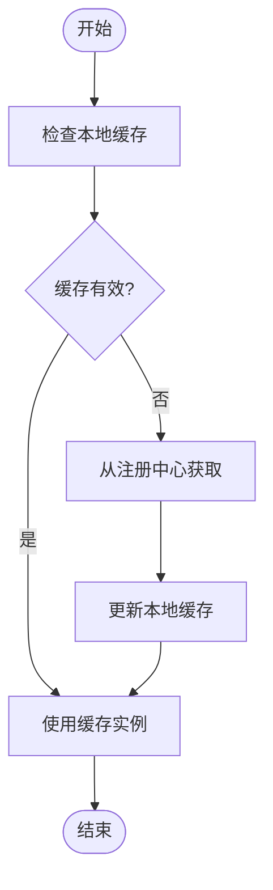
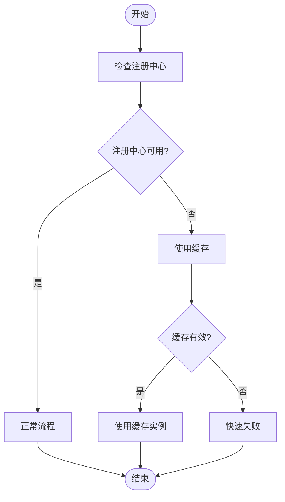

# 服务发现

<cite>
**本文档引用文件**  
- [ServiceDiscoveryRegistryDirectory.java](file://dubbo-registry\dubbo-registry-api\src\main\java\org\apache\dubbo\registry\client\ServiceDiscoveryRegistryDirectory.java)
- [ServiceDiscoveryRegistry.java](file://dubbo-registry\dubbo-registry-api\src\main\java\org\apache\dubbo\registry\client\ServiceDiscoveryRegistry.java)
- [ServiceDiscovery.java](file://dubbo-registry\dubbo-registry-api\src\main\java\org\apache\dubbo\registry\client\ServiceDiscovery.java)
- [ServiceInstancesChangedListener.java](file://dubbo-registry\dubbo-registry-api\src\main\java\org\apache\dubbo\registry\client\event\listener\ServiceInstancesChangedListener.java)
- [ConditionStateRouter.java](file://dubbo-cluster\src\main\java\org\apache\dubbo\rpc\cluster\router\condition\ConditionStateRouter.java)
- [TagStateRouter.java](file://dubbo-cluster\src\main\java\org\apache\dubbo\rpc\cluster\router\tag\TagStateRouter.java)
- [ScriptStateRouter.java](file://dubbo-cluster\src\main\java\org\apache\dubbo\rpc\cluster\router\script\ScriptStateRouter.java)
- [AbstractRegistry.java](file://dubbo-registry\dubbo-registry-api\src\main\java\org\apache\dubbo\registry\support\AbstractRegistry.java)
- [NotifyListener.java](file://dubbo-registry\dubbo-registry-api\src\main\java\org\apache\dubbo\registry\NotifyListener.java)
</cite>

## 目录
1. [服务发现机制概述](#服务发现机制概述)
2. [核心组件分析](#核心组件分析)
3. [服务订阅与变更通知](#服务订阅与变更通知)
4. [服务路由规则](#服务路由规则)
5. [服务实例缓存与一致性](#服务实例缓存与一致性)
6. [配置示例](#配置示例)
7. [扩展指南](#扩展指南)
8. [性能优化与故障处理](#性能优化与故障处理)

## 服务发现机制概述

服务发现是分布式系统中的核心机制，它允许消费者从注册中心获取服务提供者列表。Dubbo的服务发现机制基于服务注册与发现模型，通过Directory和RegistryDirectory组件实现服务的动态发现和管理。消费者通过subscribe()方法订阅服务变更，当服务实例发生增删改时，NotifyListener会处理这些事件并更新本地服务列表。

服务发现机制的核心是服务注册中心，它维护了所有服务提供者的实例信息。消费者在启动时会向注册中心订阅所需的服务，注册中心会将服务实例列表推送给消费者。当服务实例发生变化时，注册中心会通知所有订阅了该服务的消费者，确保消费者能够及时获取最新的服务列表。

**Section sources**
- [ServiceDiscoveryRegistry.java](file://dubbo-registry\dubbo-registry-api\src\main\java\org\apache\dubbo\registry\client\ServiceDiscoveryRegistry.java#L60-L74)
- [ServiceDiscovery.java](file://dubbo-registry\dubbo-registry-api\src\main\java\org\apache\dubbo\registry\client\ServiceDiscovery.java#L31-L110)

## 核心组件分析

服务发现机制的核心组件包括ServiceDiscoveryRegistry、ServiceDiscoveryRegistryDirectory、ServiceInstancesChangedListener和NotifyListener。这些组件协同工作，实现了服务的注册、发现和管理。

ServiceDiscoveryRegistry是服务发现注册中心的实现，它桥接了旧的接口级服务发现模型和新的服务发现模型。它负责处理服务的注册和订阅请求，并将这些请求转发给底层的服务发现组件。

ServiceDiscoveryRegistryDirectory是服务发现目录的实现，它管理着服务提供者的Invoker列表。当服务实例发生变化时，它会更新本地的Invoker列表，并通知上层组件。



**Diagram sources**
- [ServiceDiscoveryRegistry.java](file://dubbo-registry\dubbo-registry-api\src\main\java\org\apache\dubbo\registry\client\ServiceDiscoveryRegistry.java#L75-L514)
- [ServiceDiscoveryRegistryDirectory.java](file://dubbo-registry\dubbo-registry-api\src\main\java\org\apache\dubbo\registry\client\ServiceDiscoveryRegistryDirectory.java#L91-L860)
- [ServiceInstancesChangedListener.java](file://dubbo-registry\dubbo-registry-api\src\main\java\org\apache\dubbo\registry\client\event\listener\ServiceInstancesChangedListener.java#L258-L609)
- [NotifyListener.java](file://dubbo-registry\dubbo-registry-api\src\main\java\org\apache\dubbo\registry\NotifyListener.java#L1-L50)

**Section sources**
- [ServiceDiscoveryRegistry.java](file://dubbo-registry\dubbo-registry-api\src\main\java\org\apache\dubbo\registry\client\ServiceDiscoveryRegistry.java#L75-L514)
- [ServiceDiscoveryRegistryDirectory.java](file://dubbo-registry\dubbo-registry-api\src\main\java\org\apache\dubbo\registry\client\ServiceDiscoveryRegistryDirectory.java#L91-L860)
- [ServiceInstancesChangedListener.java](file://dubbo-registry\dubbo-registry-api\src\main\java\org\apache\dubbo\registry\client\event\listener\ServiceInstancesChangedListener.java#L258-L609)

## 服务订阅与变更通知

服务订阅与变更通知是服务发现机制的核心流程。消费者通过subscribe()方法订阅服务，注册中心会返回当前的服务实例列表，并在服务实例发生变化时通知消费者。

当消费者调用subscribe()方法时，ServiceDiscoveryRegistry会创建一个ServiceInstancesChangedListener实例，用于监听服务实例的变化。这个监听器会注册到服务发现组件中，当服务实例发生变化时，服务发现组件会通知所有注册的监听器。



**Diagram sources**
- [ServiceDiscoveryRegistry.java](file://dubbo-registry\dubbo-registry-api\src\main\java\org\apache\dubbo\registry\client\ServiceDiscoveryRegistry.java#L190-L387)
- [ServiceInstancesChangedListener.java](file://dubbo-registry\dubbo-registry-api\src\main\java\org\apache\dubbo\registry\client\event\listener\ServiceInstancesChangedListener.java#L258-L609)

**Section sources**
- [ServiceDiscoveryRegistry.java](file://dubbo-registry\dubbo-registry-api\src\main\java\org\apache\dubbo\registry\client\ServiceDiscoveryRegistry.java#L190-L387)
- [ServiceInstancesChangedListener.java](file://dubbo-registry\dubbo-registry-api\src\main\java\org\apache\dubbo\registry\client\event\listener\ServiceInstancesChangedListener.java#L258-L609)

## 服务路由规则

服务路由规则用于控制服务调用的流量分配。Dubbo支持多种路由规则，包括条件路由、标签路由和脚本路由。

### 条件路由

条件路由基于条件表达式来决定服务调用的目标实例。条件路由规则由两个部分组成：匹配条件和路由规则。匹配条件用于判断当前调用是否满足路由条件，路由规则用于指定目标实例。



**Diagram sources**
- [ConditionStateRouter.java](file://dubbo-cluster\src\main\java\org\apache\dubbo\rpc\cluster\router\condition\ConditionStateRouter.java#L1-L100)

### 标签路由

标签路由基于实例的标签来决定服务调用的目标实例。每个服务实例可以有多个标签，消费者可以根据标签来选择特定的实例进行调用。



**Diagram sources**
- [TagRouterRule.java](file://dubbo-cluster\src\main\java\org\apache\dubbo\rpc\cluster\router\tag\model\TagRouterRule.java#L35-L77)
- [TagStateRouter.java](file://dubbo-cluster\src\main\java\org\apache\dubbo\rpc\cluster\router\tag\TagStateRouter.java#L1-L100)

### 脚本路由

脚本路由允许使用脚本语言来定义复杂的路由逻辑。脚本路由支持多种脚本语言，如JavaScript、Groovy等。



**Diagram sources**
- [ScriptStateRouter.java](file://dubbo-cluster\src\main\java\org\apache\dubbo\rpc\cluster\router\script\ScriptStateRouter.java#L1-L100)

**Section sources**
- [ConditionStateRouter.java](file://dubbo-cluster\src\main\java\org\apache\dubbo\rpc\cluster\router\condition\ConditionStateRouter.java#L1-L100)
- [TagRouterRule.java](file://dubbo-cluster\src\main\java\org\apache\dubbo\rpc\cluster\router\tag\model\TagRouterRule.java#L35-L77)
- [ScriptStateRouter.java](file://dubbo-cluster\src\main\java\org\apache\dubbo\rpc\cluster\router\script\ScriptStateRouter.java#L1-L100)

## 服务实例缓存与一致性

服务实例缓存机制用于提高服务发现的性能和可靠性。当消费者从注册中心获取服务实例列表后，会将其缓存在本地。这样即使注册中心出现故障，消费者仍然可以使用缓存的服务列表进行调用。



**Diagram sources**
- [AbstractRegistry.java](file://dubbo-registry\dubbo-registry-api\src\main\java\org\apache\dubbo\registry\support\AbstractRegistry.java#L578-L618)

**Section sources**
- [AbstractRegistry.java](file://dubbo-registry\dubbo-registry-api\src\main\java\org\apache\dubbo\registry\support\AbstractRegistry.java#L578-L618)

## 配置示例

以下是一些常见的服务发现配置示例：

```yaml
# 服务发现配置
dubbo:
  registry:
    # 注册中心地址
    address: nacos://127.0.0.1:8848
    # 超时时间（毫秒）
    timeout: 5000
    # 重试次数
    retries: 3
    # 负载均衡策略
    loadbalance: roundrobin
    # 启用空保护
    enable-empty-protection: true
    # 缓存过期时间（毫秒）
    cache-expire: 60000
```

```properties
# 服务发现配置
dubbo.registry.address=nacos://127.0.0.1:8848
dubbo.registry.timeout=5000
dubbo.registry.retries=3
dubbo.registry.loadbalance=roundrobin
dubbo.registry.enable-empty-protection=true
dubbo.registry.cache-expire=60000
```

**Section sources**
- [ServiceDiscoveryRegistry.java](file://dubbo-registry\dubbo-registry-api\src\main\java\org\apache\dubbo\registry\client\ServiceDiscoveryRegistry.java#L92-L106)
- [ServiceDiscovery.java](file://dubbo-registry\dubbo-registry-api\src\main\java\org\apache\dubbo\registry\client\ServiceDiscovery.java#L92-L94)

## 扩展指南

开发者可以通过实现自定义的ServiceDiscovery和NotifyListener来扩展服务发现功能。

### 自定义ServiceDiscovery

要实现自定义的服务发现，需要实现ServiceDiscovery接口：

```java
public class CustomServiceDiscovery implements ServiceDiscovery {
    @Override
    public void register(URL url) {
        // 实现注册逻辑
    }
    
    @Override
    public void unregister(URL url) {
        // 实现注销逻辑
    }
    
    @Override
    public void subscribe(URL url, NotifyListener listener) {
        // 实现订阅逻辑
    }
    
    @Override
    public void unsubscribe(URL url, NotifyListener listener) {
        // 实现取消订阅逻辑
    }
    
    @Override
    public Set<String> getServices() {
        // 返回服务列表
        return new HashSet<>();
    }
    
    @Override
    public List<ServiceInstance> getInstances(String serviceName) {
        // 返回服务实例列表
        return new ArrayList<>();
    }
    
    @Override
    public void destroy() {
        // 实现销毁逻辑
    }
}
```

### 自定义NotifyListener

要实现自定义的通知监听器，需要实现NotifyListener接口：

```java
public class CustomNotifyListener implements NotifyListener {
    @Override
    public void notify(List<URL> urls) {
        // 处理服务实例变更通知
        for (URL url : urls) {
            // 处理每个服务实例
            System.out.println("服务实例变更: " + url);
        }
    }
    
    @Override
    public URL getConsumerUrl() {
        // 返回消费者URL
        return null;
    }
}
```

**Section sources**
- [ServiceDiscovery.java](file://dubbo-registry\dubbo-registry-api\src\main\java\org\apache\dubbo\registry\client\ServiceDiscovery.java#L34-L110)
- [NotifyListener.java](file://dubbo-registry\dubbo-registry-api\src\main\java\org\apache\dubbo\registry\NotifyListener.java#L1-L50)

## 性能优化与故障处理

### 性能优化

1. **缓存优化**：合理设置缓存过期时间，避免频繁从注册中心获取数据。
2. **批量操作**：尽量使用批量操作来减少网络开销。
3. **异步处理**：对于非关键操作，使用异步处理来提高性能。
4. **连接池**：使用连接池来管理与注册中心的连接。

### 故障处理

1. **重试机制**：当与注册中心通信失败时，自动重试。
2. **降级策略**：当注册中心不可用时，使用本地缓存的服务列表。
3. **监控告警**：监控服务发现的健康状态，及时发现和处理问题。
4. **日志记录**：详细记录服务发现的操作日志，便于问题排查。



**Diagram sources**
- [AbstractRegistry.java](file://dubbo-registry\dubbo-registry-api\src\main\java\org\apache\dubbo\registry\support\AbstractRegistry.java#L578-L618)

**Section sources**
- [AbstractRegistry.java](file://dubbo-registry\dubbo-registry-api\src\main\java\org\apache\dubbo\registry\support\AbstractRegistry.java#L578-L618)