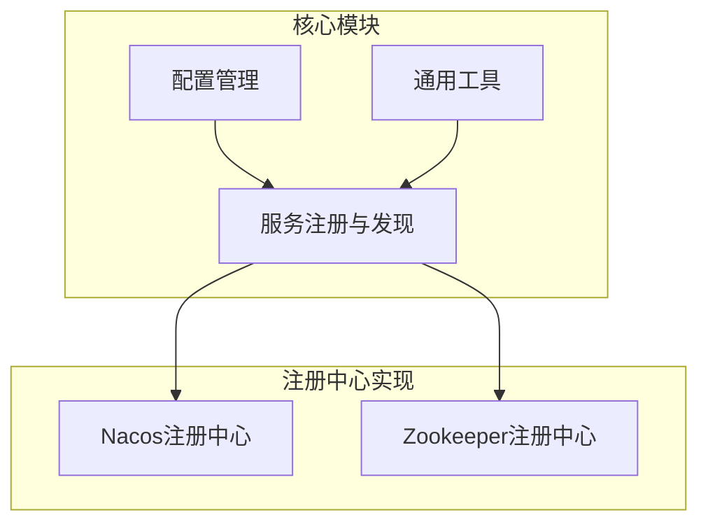
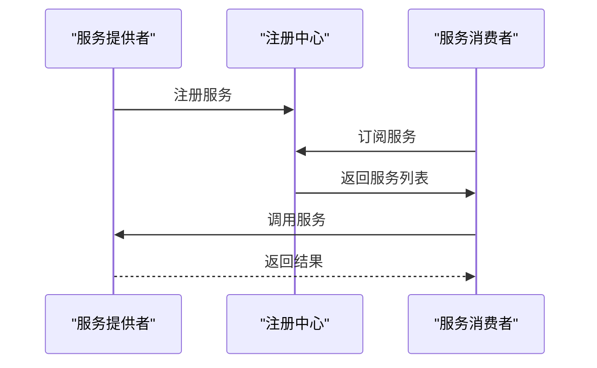
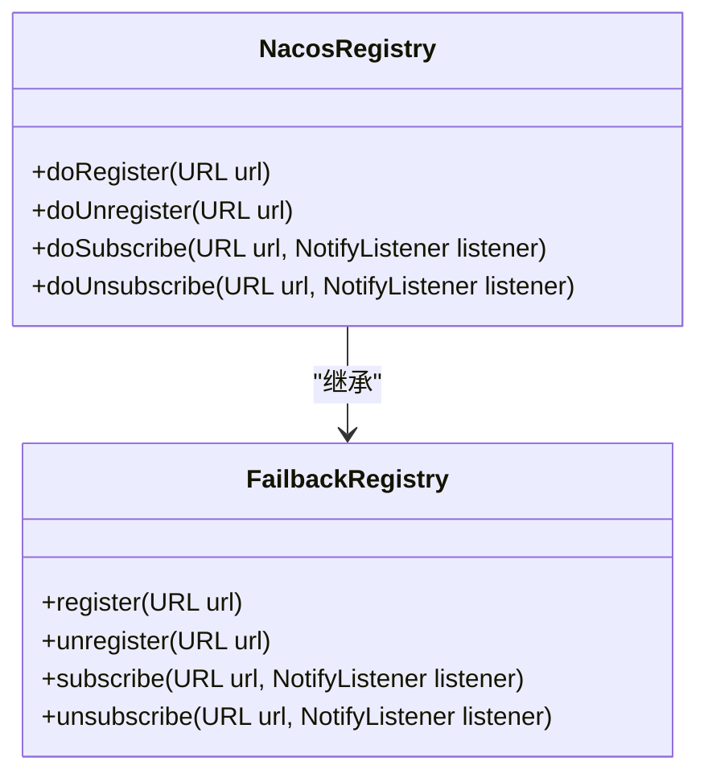
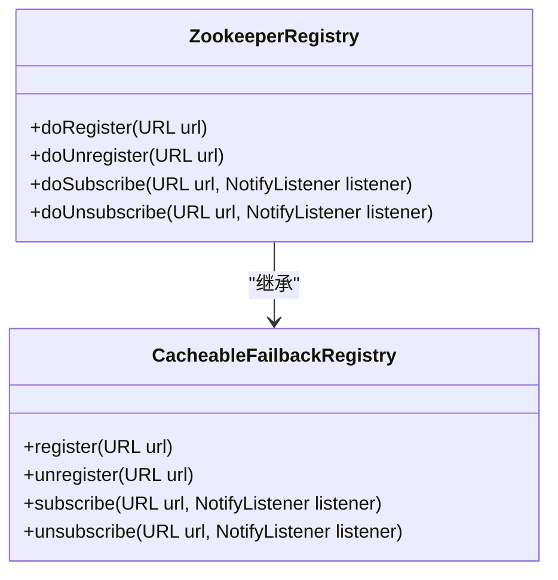
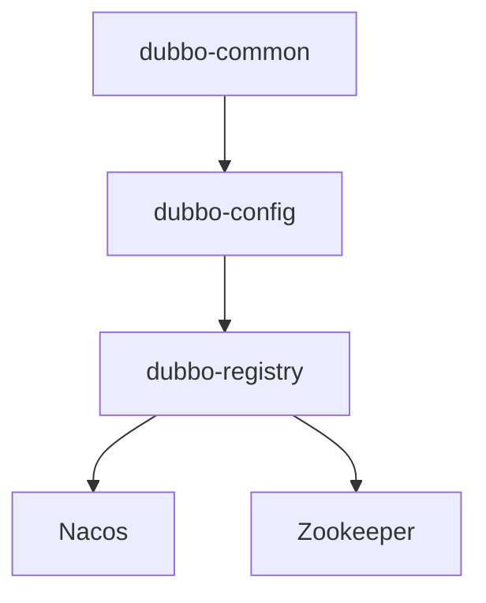

# 服务发现与注册

<cite>
**本文档引用的文件**
- [RegistryConfig.java](file://dubbo-common\src\main\java\org\apache\dubbo\config\RegistryConfig.java)
- [Registry.java](file://dubbo-registry\dubbo-registry-api\src\main\java\org\apache\dubbo\registry\Registry.java)
- [NacosRegistry.java](file://dubbo-registry\dubbo-registry-nacos\src\main\java\org\apache\dubbo\registry\nacos\NacosRegistry.java)
- [ZookeeperRegistry.java](file://dubbo-registry\dubbo-registry-zookeeper\src\main\java\org\apache\dubbo\registry\zookeeper\ZookeeperRegistry.java)
- [ServiceDiscoveryRegistry.java](file://dubbo-registry\dubbo-registry-api\src\main\java\org\apache\dubbo\registry\client\ServiceDiscoveryRegistry.java)
</cite>

## 目录
1. [简介](#简介)
2. [项目结构](#项目结构)
3. [核心组件](#核心组件)
4. [架构概述](#架构概述)
5. [详细组件分析](#详细组件分析)
6. [依赖分析](#依赖分析)
7. [性能考虑](#性能考虑)
8. [故障排除指南](#故障排除指南)
9. [结论](#结论)

## 简介
Apache Dubbo 是一个功能强大且用户友好的 Web 和 RPC 框架，支持多种语言实现，如 Java、Go、Python、PHP、Erlang、Rust 和 Node.js/Web。Dubbo 提供了通信、服务发现、流量管理、可观测性、安全、工具和构建企业级微服务的最佳实践解决方案。消费者通过注册中心（如 Zookeeper、Nacos）动态发现提供者实例，并使用定义的策略管理流量。内置支持动态配置、指标、追踪、安全和可视化控制台。

## 项目结构
Dubbo 项目具有模块化的结构，每个模块负责特定的功能。服务发现与注册的核心功能主要分布在 `dubbo-registry` 模块中，该模块包含对 Nacos、Zookeeper 等多种注册中心的支持。`dubbo-common` 模块提供了通用的配置和工具类，而 `dubbo-config` 模块则负责配置管理。

**图表来源**
- [RegistryConfig.java](file://dubbo-common\src\main\java\org\apache\dubbo\config\RegistryConfig.java)
- [Registry.java](file://dubbo-registry\dubbo-registry-api\src\main\java\org\apache\dubbo\registry\Registry.java)

**章节来源**
- [RegistryConfig.java](file://dubbo-common\src\main\java\org\apache\dubbo\config\RegistryConfig.java)
- [Registry.java](file://dubbo-registry\dubbo-registry-api\src\main\java\org\apache\dubbo\registry\Registry.java)

## 核心组件
Dubbo 的服务发现与注册功能由几个核心组件构成，包括 `RegistryConfig` 用于配置注册中心，`Registry` 接口定义了注册中心的基本操作，以及具体的注册中心实现类如 `NacosRegistry` 和 `ZookeeperRegistry`。这些组件共同协作，实现了服务的注册、发现和管理。

**章节来源**
- [RegistryConfig.java](file://dubbo-common\src\main\java\org\apache\dubbo\config\RegistryConfig.java)
- [Registry.java](file://dubbo-registry\dubbo-registry-api\src\main\java\org\apache\dubbo\registry\Registry.java)

## 架构概述
Dubbo 的服务发现与注册架构基于注册中心模式，服务提供者在启动时向注册中心注册自己的服务，服务消费者从注册中心获取服务提供者的列表，并根据负载均衡策略选择一个提供者进行调用。注册中心还负责健康检查和故障转移，确保服务的高可用性。

**图表来源**
- [NacosRegistry.java](file://dubbo-registry\dubbo-registry-nacos\src\main\java\org\apache\dubbo\registry\nacos\NacosRegistry.java)
- [ZookeeperRegistry.java](file://dubbo-registry\dubbo-registry-zookeeper\src\main\java\org\apache\dubbo\registry\zookeeper\ZookeeperRegistry.java)

## 详细组件分析
### Nacos 注册中心分析
Nacos 注册中心通过 `NacosRegistry` 类实现，该类继承自 `FailbackRegistry`，提供了服务注册、发现和订阅的功能。`NacosRegistry` 使用 Nacos 的命名服务来管理服务实例，支持服务的动态注册和发现。

#### 类图

**图表来源**
- [NacosRegistry.java](file://dubbo-registry\dubbo-registry-nacos\src\main\java\org\apache\dubbo\registry\nacos\NacosRegistry.java)

**章节来源**
- [NacosRegistry.java](file://dubbo-registry\dubbo-registry-nacos\src\main\java\org\apache\dubbo\registry\nacos\NacosRegistry.java)

### Zookeeper 注册中心分析
Zookeeper 注册中心通过 `ZookeeperRegistry` 类实现，该类同样继承自 `CacheableFailbackRegistry`，提供了服务注册、发现和订阅的功能。`ZookeeperRegistry` 使用 Zookeeper 的节点来管理服务实例，支持服务的动态注册和发现。

#### 类图

**图表来源**
- [ZookeeperRegistry.java](file://dubbo-registry\dubbo-registry-zookeeper\src\main\java\org\apache\dubbo\registry\zookeeper\ZookeeperRegistry.java)

**章节来源**
- [ZookeeperRegistry.java](file://dubbo-registry\dubbo-registry-zookeeper\src\main\java\org\apache\dubbo\registry\zookeeper\ZookeeperRegistry.java)

## 依赖分析
Dubbo 的服务发现与注册功能依赖于多个模块，包括 `dubbo-common`、`dubbo-config` 和 `dubbo-registry`。`dubbo-common` 提供了通用的工具和配置类，`dubbo-config` 负责配置管理，而 `dubbo-registry` 则实现了具体的注册中心功能。

**图表来源**
- [RegistryConfig.java](file://dubbo-common\src\main\java\org\apache\dubbo\config\RegistryConfig.java)
- [Registry.java](file://dubbo-registry\dubbo-registry-api\src\main\java\org\apache\dubbo\registry\Registry.java)

**章节来源**
- [RegistryConfig.java](file://dubbo-common\src\main\java\org\apache\dubbo\config\RegistryConfig.java)
- [Registry.java](file://dubbo-registry\dubbo-registry-api\src\main\java\org\apache\dubbo\registry\Registry.java)

## 性能考虑
Dubbo 的服务发现与注册功能在设计时考虑了性能因素，通过缓存机制减少对注册中心的频繁访问，提高服务调用的效率。此外，Dubbo 还支持多种负载均衡策略，如轮询、随机、最少活跃调用等，以优化服务调用的性能。

## 故障排除指南
在使用 Dubbo 的服务发现与注册功能时，可能会遇到一些常见问题，如服务注册失败、服务发现超时等。这些问题通常与网络连接、配置错误或注册中心状态有关。建议检查网络连接、配置文件和注册中心的状态，确保服务能够正常注册和发现。

**章节来源**
- [NacosRegistry.java](file://dubbo-registry\dubbo-registry-nacos\src\main\java\org\apache\dubbo\registry\nacos\NacosRegistry.java)
- [ZookeeperRegistry.java](file://dubbo-registry\dubbo-registry-zookeeper\src\main\java\org\apache\dubbo\registry\zookeeper\ZookeeperRegistry.java)

## 结论
Dubbo 的服务发现与注册功能为微服务架构提供了强大的支持，通过多种注册中心的集成，实现了服务的动态注册、发现和管理。开发者可以根据实际需求选择合适的注册中心，并利用 Dubbo 提供的丰富功能，构建高可用、高性能的微服务系统。