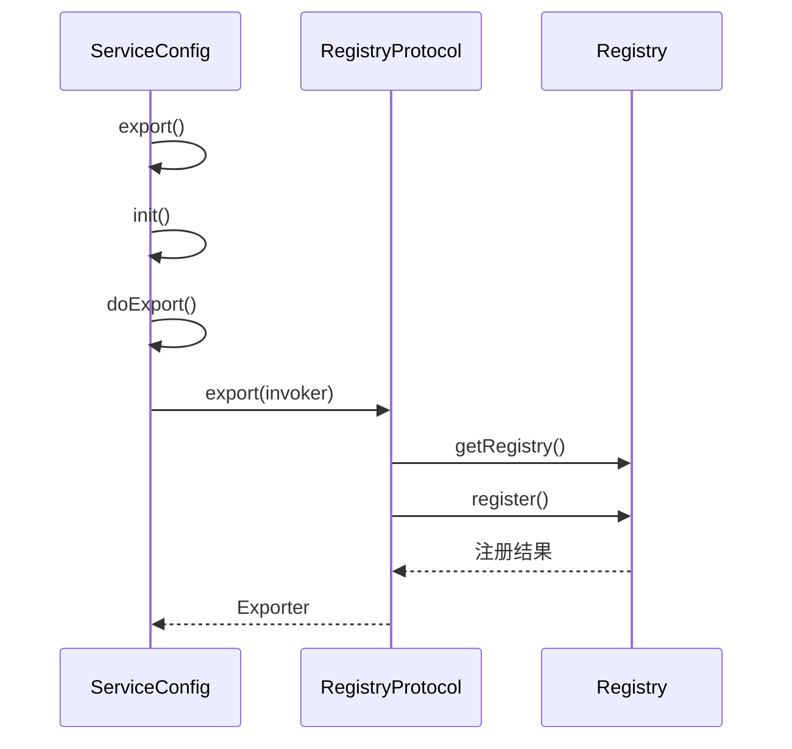
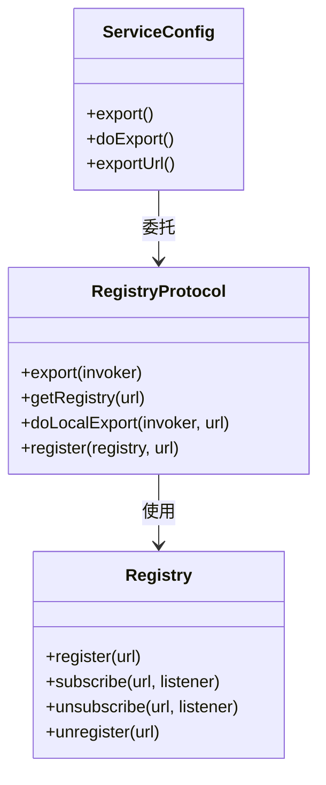
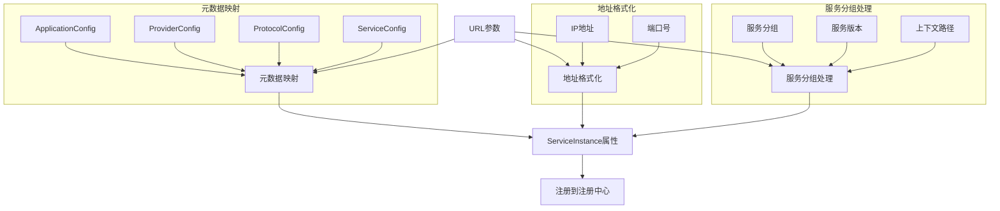
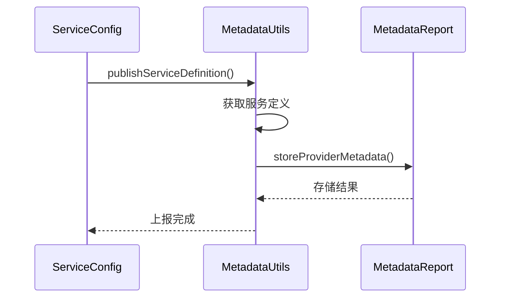
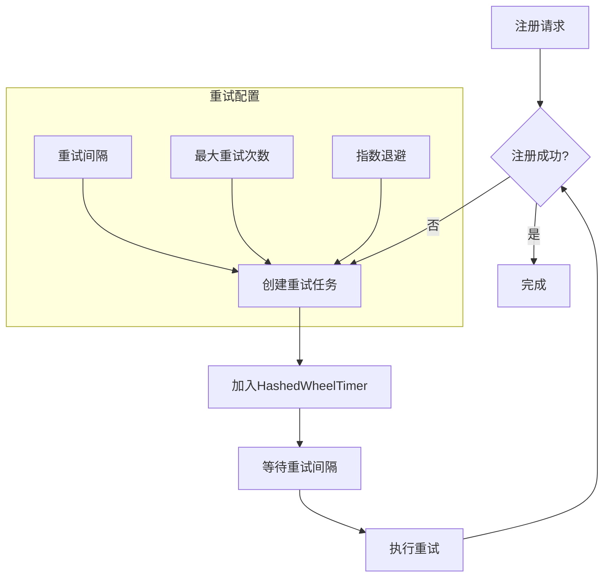
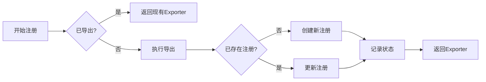
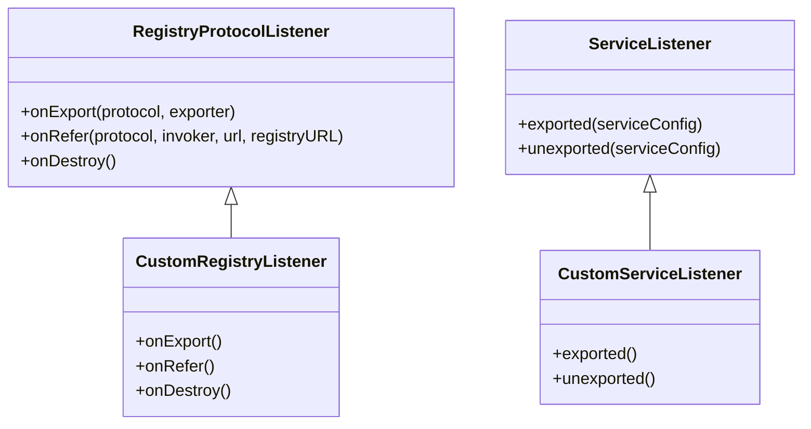
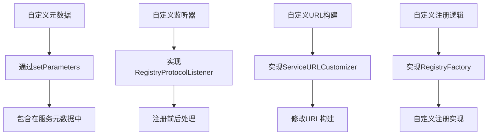

# 服务注册

<cite>
**本文档引用的文件**   
- [ServiceConfig.java](file://dubbo-config\dubbo-config-api\src\main\java\org\apache\dubbo\config\ServiceConfig.java)
- [RegistryProtocol.java](file://dubbo-registry\dubbo-registry-api\src\main\java\org\apache\dubbo\registry\integration\RegistryProtocol.java)
- [Registry.java](file://dubbo-registry\dubbo-registry-api\src\main\java\org\apache\dubbo\registry\Registry.java)
- [MetadataUtils.java](file://dubbo-registry\dubbo-registry-api\src\main\java\org\apache\dubbo\registry\client\metadata\MetadataUtils.java)
- [MetadataInfo.java](file://dubbo-metadata\dubbo-metadata-api\src\main\java\org\apache\dubbo\metadata\MetadataInfo.java)
</cite>

## 目录
1. [服务注册流程概述](#服务注册流程概述)
2. [ServiceConfig.export()方法分析](#serviceconfigexport方法分析)
3. [RegistryProtocol服务注册机制](#registryprotocol服务注册机制)
4. [URL到ServiceInstance的转换过程](#url到serviceinstance的转换过程)
5. [服务元数据生成与上报](#服务元数据生成与上报)
6. [服务实例生命周期管理](#服务实例生命周期管理)
7. [异步注册与失败重试策略](#异步注册与失败重试策略)
8. [幂等性保证机制](#幂等性保证机制)
9. [服务注册拦截器扩展点](#服务注册拦截器扩展点)
10. [自定义服务实例属性示例](#自定义服务实例属性示例)

## 服务注册流程概述

Dubbo服务注册流程从`ServiceConfig.export()`方法开始，经过一系列处理最终将服务实例注册到注册中心。整个流程涉及多个核心组件的协作，包括ServiceConfig、RegistryProtocol和Registry等。服务注册的核心目标是将服务提供者的URL信息转换为服务实例(ServiceInstance)并注册到注册中心，同时确保服务元数据的正确生成和上报。

服务注册流程的主要步骤包括：服务配置检查与初始化、协议导出、注册中心获取、服务注册以及元数据上报。在整个过程中，Dubbo提供了丰富的扩展点和拦截器机制，允许开发者自定义服务注册行为。

```mermaid
flowchart TD
A[ServiceConfig.export()] --> B[初始化服务配置]
B --> C[构建服务URL]
C --> D[导出服务]
D --> E[获取RegistryProtocol]
E --> F[获取Registry实例]
F --> G[注册服务]
G --> H[上报元数据]
H --> I[完成服务注册]
```

**图示来源**
- [ServiceConfig.java](file://dubbo-config\dubbo-config-api\src\main\java\org\apache\dubbo\config\ServiceConfig.java#L323-L363)
- [RegistryProtocol.java](file://dubbo-registry\dubbo-registry-api\src\main\java\org\apache\dubbo\registry\integration\RegistryProtocol.java#L270-L323)

## ServiceConfig.export()方法分析

`ServiceConfig.export()`方法是服务注册的入口点，负责启动整个服务导出和注册流程。该方法首先检查服务是否已经导出，然后进行必要的初始化工作，最后调用`doExport()`方法执行实际的导出操作。

在`export()`方法中，首先会检查服务配置是否已刷新，如果没有则调用`refresh()`方法进行刷新。然后调用`init()`方法初始化服务元数据，包括加载ServiceListeners扩展点。如果配置了延迟导出，则通过定时任务执行导出操作；否则直接调用`doExport()`方法。



**图示来源**
- [ServiceConfig.java](file://dubbo-config\dubbo-config-api\src\main\java\org\apache\dubbo\config\ServiceConfig.java#L323-L363)
- [RegistryProtocol.java](file://dubbo-registry\dubbo-registry-api\src\main\java\org\apache\dubbo\registry\integration\RegistryProtocol.java#L270-L323)

## RegistryProtocol服务注册机制

RegistryProtocol是Dubbo服务注册的核心协议实现，负责创建Registry实例并调用其`register()`方法进行服务注册。当`ServiceConfig.export()`方法被调用时，最终会委托给RegistryProtocol的`export()`方法。

在`export()`方法中，首先获取注册中心URL和提供者URL，然后创建本地导出器(Exporter)。接着通过`getRegistry()`方法获取Registry实例，该方法使用SPI机制根据URL协议获取相应的RegistryFactory并创建Registry实例。最后，如果配置允许注册，则调用`register()`方法将服务注册到注册中心。



**图示来源**
- [RegistryProtocol.java](file://dubbo-registry\dubbo-registry-api\src\main\java\org\apache\dubbo\registry\integration\RegistryProtocol.java#L270-L323)
- [Registry.java](file://dubbo-registry\dubbo-registry-api\src\main\java\org\apache\dubbo\registry\Registry.java#L31-L48)

## URL到ServiceInstance的转换过程

在服务注册过程中，URL到ServiceInstance的转换是一个关键步骤。这个过程涉及元数据映射、地址格式化和服务分组处理等多个方面。URL中的各种参数会被提取并转换为ServiceInstance的属性。

元数据映射主要通过`buildAttributes()`方法完成，该方法收集来自ApplicationConfig、ProviderConfig、ProtocolConfig和ServiceConfig的参数，并将它们合并到一个Map中。这些参数包括服务版本、分组、超时时间、权重等重要信息。地址格式化则通过`findConfiguredHosts()`和`findConfiguredPort()`方法完成，确保使用正确的IP地址和端口。

服务分组处理在`buildUrl()`方法中实现，通过`getContextPath()`获取上下文路径，并与服务路径组合形成完整的路径。同时，服务分组(group)和版本(version)信息也会被包含在URL中，用于服务发现时的精确匹配。



**图示来源**
- [ServiceConfig.java](file://dubbo-config\dubbo-config-api\src\main\java\org\apache\dubbo\config\ServiceConfig.java#L694-L756)
- [ServiceConfig.java](file://dubbo-config\dubbo-config-api\src\main\java\org\apache\dubbo\config\ServiceConfig.java#L1061-L1154)

## 服务元数据生成与上报

服务元数据的生成和上报是服务注册过程中的重要环节。元数据不仅包含服务的基本信息，还包括服务接口的完整定义，这对于服务治理和动态配置至关重要。

元数据生成主要在`MetadataUtils.publishServiceDefinition()`方法中完成。该方法首先检查是否存在可用的元数据上报中心，如果存在则获取服务的完整定义(FullServiceDefinition)并将其存储到各个MetadataReport中。服务定义包含接口的所有方法、参数类型、返回类型等详细信息。

元数据上报采用异步方式进行，确保不会阻塞服务注册主流程。上报的内容包括服务接口名、版本、分组、提供者信息以及服务定义。这些元数据被存储在元数据中心，供服务治理、监控和动态配置等功能使用。



**图示来源**
- [MetadataUtils.java](file://dubbo-registry\dubbo-registry-api\src\main\java\org\apache\dubbo\registry\client\metadata\MetadataUtils.java#L74-L113)
- [MetadataInfo.java](file://dubbo-metadata\dubbo-metadata-api\src\main\java\org\apache\dubbo\metadata\MetadataInfo.java#L445-L488)

## 服务实例生命周期管理

服务实例的生命周期管理贯穿于服务注册的整个过程，从创建、注册、更新到注销，每个阶段都有相应的管理机制。生命周期管理确保服务实例状态的一致性和可靠性。

在服务导出时，会创建ProviderModel来管理服务提供者模型，其中包含服务实例的各种状态信息。当服务注册成功后，会将注册状态记录在ProviderModel的RegisterStatedURL中。服务更新时，通过reExport机制实现平滑升级，先注销旧实例再注册新实例。

服务注销通过`unexport()`方法完成，该方法会遍历所有导出器并逐个取消导出。在取消导出前，会等待服务空闲一段时间，避免在处理请求时中断服务。同时，会通知所有ServiceListener，允许监听器执行清理工作。

```mermaid
stateDiagram-v2
[*] --> Created
Created --> Exported : export()
Exported --> Registered : register()
Registered --> Updated : reExport()
Updated --> Registered
Registered --> Unregistered : unexport()
Unregistered --> [*]
note right of Exported
包含本地导出
和远程导出
end
note right of Registered
记录在
RegisterStatedURL中
end
note left of Unregistered
等待空闲后
再执行注销
end
```

**图示来源**
- [ServiceConfig.java](file://dubbo-config\dubbo-config-api\src\main\java\org\apache\dubbo\config\ServiceConfig.java#L214-L257)
- [RegistryProtocol.java](file://dubbo-registry\dubbo-registry-api\src\main\java\org\apache\dubbo\registry\integration\RegistryProtocol.java#L435-L462)

## 异步注册与失败重试策略

Dubbo服务注册支持异步机制和失败重试策略，确保在网络不稳定或注册中心暂时不可用的情况下仍能成功注册服务。异步注册通过定时任务实现，而失败重试则使用HashedWheelTimer进行高效调度。

当配置了延迟导出时，`doDelayExport()`方法会创建一个定时任务，在指定延迟后执行服务导出。这允许应用在启动初期快速完成初始化，而将耗时的服务注册操作推迟到后台执行。

对于注册失败的情况，Dubbo实现了完善的重试机制。当注册操作失败时，会创建ReExportTask并加入HashedWheelTimer进行周期性重试。重试间隔默认为5秒，可通过`registry.retry.period`参数配置。重试任务会持续执行直到注册成功或被显式取消。



**图示来源**
- [ServiceConfig.java](file://dubbo-config\dubbo-config-api\src\main\java\org\apache\dubbo\config\ServiceConfig.java#L391-L409)
- [RegistryProtocol.java](file://dubbo-registry\dubbo-registry-api\src\main\java\org\apache\dubbo\registry\integration\RegistryProtocol.java#L190-L195)

## 幂等性保证机制

服务注册的幂等性保证是确保系统可靠性的关键。Dubbo通过多种机制确保服务注册操作的幂等性，避免重复注册或状态不一致的问题。

首先，在`ServiceConfig.export()`方法中使用双重检查锁机制，确保服务不会被重复导出。其次，在`RegistryProtocol.export()`方法中，使用`bounds`映射来跟踪已导出的服务，避免同一服务被多次注册。

对于注册中心层面的幂等性，不同的注册中心实现有不同的策略。例如，Zookeeper通过临时节点的特性确保幂等性，而Nacos则通过服务实例的唯一标识来避免重复注册。此外，Dubbo还提供了`register`参数控制是否注册到注册中心，允许在特定场景下禁用注册。



**图示来源**
- [ServiceConfig.java](file://dubbo-config\dubbo-config-api\src\main\java\org\apache\dubbo\config\ServiceConfig.java#L323-L363)
- [RegistryProtocol.java](file://dubbo-registry\dubbo-registry-api\src\main\java\org\apache\dubbo\registry\integration\RegistryProtocol.java#L270-L323)

## 服务注册拦截器扩展点

Dubbo提供了丰富的服务注册拦截器扩展点，允许开发者在服务注册的关键节点插入自定义逻辑。主要的扩展点包括RegistryProtocolListener和ServiceListener。

RegistryProtocolListener接口提供了`onExport`、`onRefer`和`onDestroy`三个回调方法，分别在服务导出、引用和协议销毁时触发。通过实现这个接口并使用@Activate注解，可以创建自定义的监听器，在服务注册前后执行特定逻辑。

ServiceListener则专注于服务级别的事件监听，提供了`exported`和`unexported`两个方法。开发者可以通过实现ServiceListener来监控服务的生命周期，在服务导出或注销时执行清理工作或发送通知。



**图示来源**
- [RegistryProtocol.java](file://dubbo-registry\dubbo-registry-api\src\main\java\org\apache\dubbo\registry\integration\RegistryProtocol.java#L326-L336)
- [ServiceConfig.java](file://dubbo-config\dubbo-config-api\src\main\java\org\apache\dubbo\config\ServiceConfig.java#L1040-L1050)

## 自定义服务实例属性示例

开发者可以通过多种方式自定义服务实例的属性，以满足特定的业务需求。以下是一些常见的自定义示例：

1. **自定义元数据**：通过`ServiceConfig.setParameters()`方法添加自定义参数，这些参数会被包含在服务元数据中。
2. **自定义监听器**：实现RegistryProtocolListener或ServiceListener接口，添加自定义的注册前后处理逻辑。
3. **自定义URL构建**：通过ServiceURLCustomizer扩展点修改服务URL的构建过程。
4. **自定义注册逻辑**：通过RegistryFactory扩展点创建自定义的Registry实现。

这些自定义选项为服务注册提供了极大的灵活性，允许开发者根据具体需求调整注册行为。



**图示来源**
- [ServiceConfig.java](file://dubbo-config\dubbo-config-api\src\main\java\org\apache\dubbo\config\ServiceConfig.java#L694-L756)
- [RegistryProtocol.java](file://dubbo-registry\dubbo-registry-api\src\main\java\org\apache\dubbo\registry\integration\RegistryProtocol.java#L510-L515)