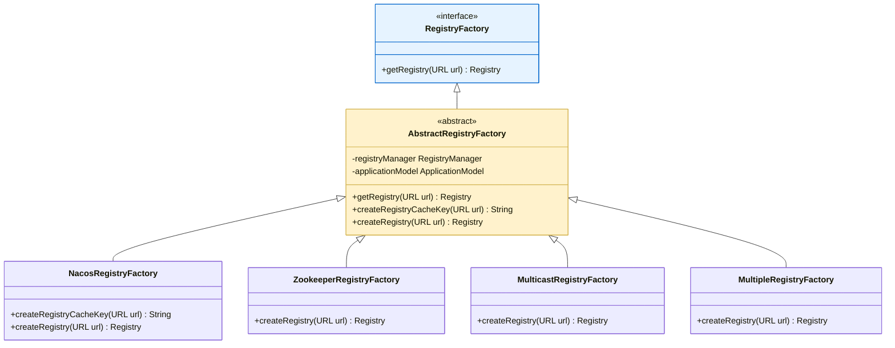
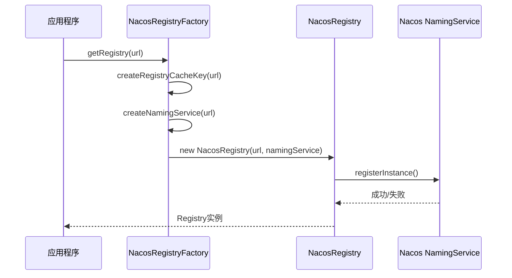
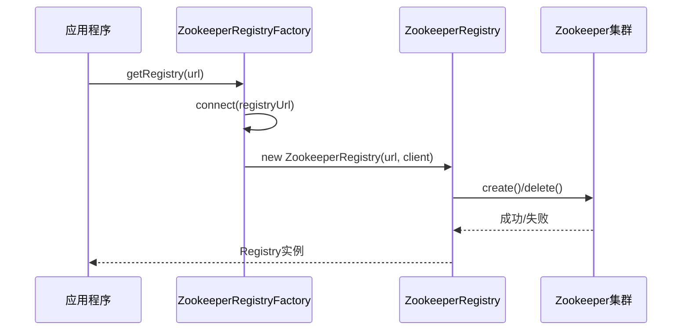
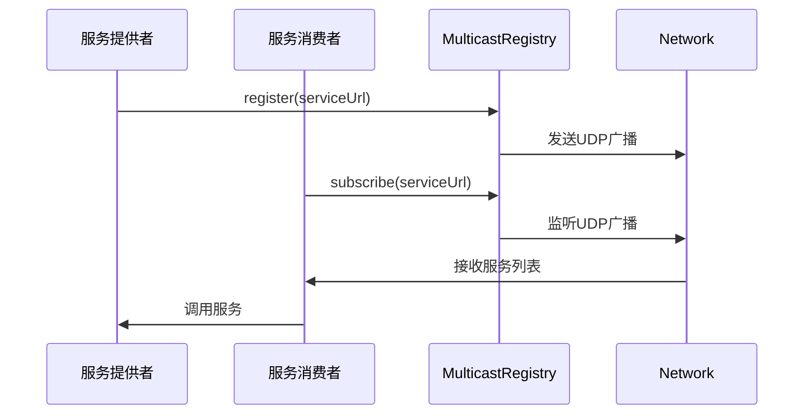
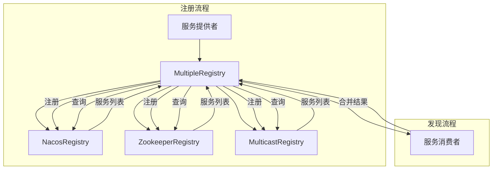
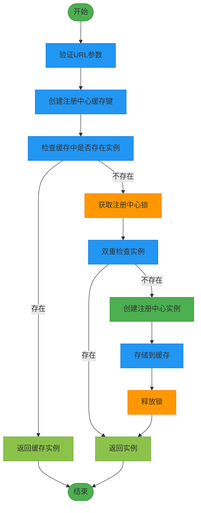
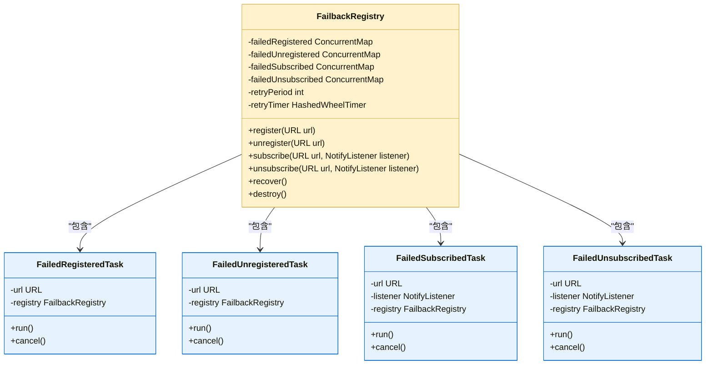
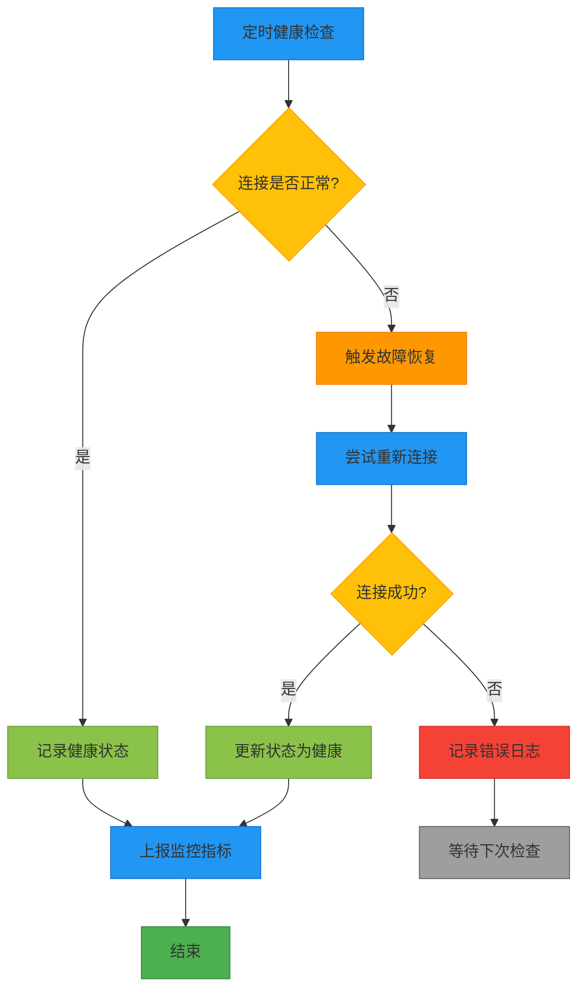

# 注册中心集成

<cite>
**本文档中引用的文件**  
- [RegistryFactory.java](file://dubbo-registry\dubbo-registry-api\src\main\java\org\apache\dubbo\registry\RegistryFactory.java)
- [Registry.java](file://dubbo-registry\dubbo-registry-api\src\main\java\org\apache\dubbo\registry\Registry.java)
- [AbstractRegistryFactory.java](file://dubbo-registry\dubbo-registry-api\src\main\java\org\apache\dubbo\registry\support\AbstractRegistryFactory.java)
- [FailbackRegistry.java](file://dubbo-registry\dubbo-registry-api\src\main\java\org\apache\dubbo\registry\support\FailbackRegistry.java)
- [NacosRegistryFactory.java](file://dubbo-registry\dubbo-registry-nacos\src\main\java\org\apache\dubbo\registry\nacos\NacosRegistryFactory.java)
- [ZookeeperRegistryFactory.java](file://dubbo-registry\dubbo-registry-zookeeper\src\main\java\org\apache\dubbo\registry\zookeeper\ZookeeperRegistryFactory.java)
- [MulticastRegistryFactory.java](file://dubbo-registry\dubbo-registry-multicast\src\main\java\org\apache\dubbo\registry\multicast\MulticastRegistryFactory.java)
- [MultipleRegistryFactory.java](file://dubbo-registry\dubbo-registry-multiple\src\main\java\org\apache\dubbo\registry\multiple\MultipleRegistryFactory.java)
- [application.yml](file://dubbo-demo\dubbo-demo-mcp-server\src\main\resources\application.yml)
</cite>

## 目录
1. [引言](#引言)
2. [SPI机制与注册中心架构](#spi机制与注册中心架构)
3. [RegistryFactory接口设计原理](#registryfactory接口设计原理)
4. [核心注册中心实现](#核心注册中心实现)
5. [配置方式与示例](#配置方式与示例)
6. [初始化流程与连接管理](#初始化流程与连接管理)
7. [重试机制与故障恢复](#重试机制与故障恢复)
8. [自定义注册中心扩展](#自定义注册中心扩展)
9. [健康检查与监控](#健康检查与监控)
10. [性能优化建议](#性能优化建议)

## 引言

Dubbo作为一个高性能的Java RPC框架，其服务治理能力依赖于灵活的注册中心机制。注册中心是Dubbo服务发现的核心组件，负责服务的注册与发现。Dubbo通过SPI（Service Provider Interface）机制实现了对多种注册中心的支持，包括Nacos、Zookeeper、Multicast和Multiple等。这种设计使得开发者可以根据实际需求选择最适合的注册中心，同时保持代码的可扩展性和灵活性。

本文档将深入探讨Dubbo注册中心的集成机制，重点分析SPI设计原理、RegistryFactory接口的实现方式，以及不同注册中心的具体实现细节。同时，文档还将提供详细的配置示例、初始化流程说明、故障恢复策略，并为开发者提供自定义注册中心的扩展指南。

## SPI机制与注册中心架构

Dubbo的SPI机制是其插件化架构的核心，允许在不修改核心代码的情况下扩展功能。注册中心的集成正是基于这一机制实现的。通过在`META-INF/dubbo/internal/`目录下定义SPI配置文件，Dubbo能够动态加载不同类型的注册中心实现。

```mermaid
graph TD
subgraph "SPI配置"
NacosConfig["nacos=org.apache.dubbo.registry.nacos.NacosRegistryFactory"]
ZookeeperConfig["zookeeper=org.apache.dubbo.registry.zookeeper.ZookeeperRegistryFactory"]
MulticastConfig["multicast=org.apache.dubbo.registry.multicast.MulticastRegistryFactory"]
MultipleConfig["multiple=org.apache.dubbo.registry.multiple.MultipleRegistryFactory"]
end
subgraph "注册中心工厂"
RegistryFactory[RegistryFactory]
NacosFactory[NacosRegistryFactory]
ZookeeperFactory[ZookeeperRegistryFactory]
MulticastFactory[MulticastRegistryFactory]
MultipleFactory[MultipleRegistryFactory]
end
subgraph "注册中心实例"
NacosRegistry[NacosRegistry]
ZookeeperRegistry[ZookeeperRegistry]
MulticastRegistry[MulticastRegistry]
MultipleRegistry[MultipleRegistry]
end
NacosConfig --> NacosFactory
ZookeeperConfig --> ZookeeperFactory
MulticastConfig --> MulticastFactory
MultipleConfig --> MultipleFactory
RegistryFactory --> NacosFactory
RegistryFactory --> ZookeeperFactory
RegistryFactory --> MulticastFactory
RegistryFactory --> MultipleFactory
NacosFactory --> NacosRegistry
ZookeeperFactory --> ZookeeperRegistry
MulticastFactory --> MulticastRegistry
MultipleFactory --> MultipleRegistry
style NacosConfig fill:#f9f,stroke:#333
style ZookeeperConfig fill:#f9f,stroke:#333
style MulticastConfig fill:#f9f,stroke:#333
style MultipleConfig fill:#f9f,stroke:#333
```



**图示来源**  
- [NacosRegistryFactory.java](file://dubbo-registry\dubbo-registry-nacos\src\main\resources\META-INF\dubbo\internal\org.apache.dubbo.registry.RegistryFactory#L1)
- [ZookeeperRegistryFactory.java](file://dubbo-registry\dubbo-registry-zookeeper\src\main\resources\META-INF\dubbo\internal\org.apache.dubbo.registry.RegistryFactory#L1)
- [MulticastRegistryFactory.java](file://dubbo-registry\dubbo-registry-multicast\src\main\resources\META-INF\dubbo\internal\org.apache.dubbo.registry.RegistryFactory#L1)
- [MultipleRegistryFactory.java](file://dubbo-registry\dubbo-registry-multiple\src\main\resources\META-INF\dubbo\internal\org.apache.dubbo.registry.RegistryFactory#L1)

**本节来源**  
- [RegistryFactory.java](file://dubbo-registry\dubbo-registry-api\src\main\java\org\apache\dubbo\registry\RegistryFactory.java#L31)
- [AbstractRegistryFactory.java](file://dubbo-registry\dubbo-registry-api\src\main\java\org\apache\dubbo\registry\support\AbstractRegistryFactory.java#L41)

## RegistryFactory接口设计原理

`RegistryFactory`接口是Dubbo注册中心集成的核心，定义了创建注册中心实例的契约。该接口通过`@SPI`注解标记，表明其是一个SPI扩展点，支持通过配置动态选择具体的实现。



`RegistryFactory`接口的核心方法是`getRegistry(URL url)`，它接收一个URL参数，返回一个`Registry`实例。URL中包含了注册中心的协议、地址、端口等信息。通过`@Adaptive`注解，Dubbo能够在运行时根据URL中的协议字段自动选择对应的注册中心工厂实现。

`AbstractRegistryFactory`作为抽象基类，提供了注册中心实例的缓存管理、线程安全控制等通用功能。所有具体的注册中心工厂都继承自该类，只需实现`createRegistry`抽象方法即可。

**图示来源**  
- [RegistryFactory.java](file://dubbo-registry\dubbo-registry-api\src\main\java\org\apache\dubbo\registry\RegistryFactory.java#L31)
- [AbstractRegistryFactory.java](file://dubbo-registry\dubbo-registry-api\src\main\java\org\apache\dubbo\registry\support\AbstractRegistryFactory.java#L41)
- [NacosRegistryFactory.java](file://dubbo-registry\dubbo-registry-nacos\src\main\java\org\apache\dubbo\registry\nacos\NacosRegistryFactory.java#L33)
- [ZookeeperRegistryFactory.java](file://dubbo-registry\dubbo-registry-zookeeper\src\main\java\org\apache\dubbo\registry\zookeeper\ZookeeperRegistryFactory.java#L29)
- [MulticastRegistryFactory.java](file://dubbo-registry\dubbo-registry-multicast\src\main\java\org\apache\dubbo\registry\multicast\MulticastRegistryFactory.java#L27)
- [MultipleRegistryFactory.java](file://dubbo-registry\dubbo-registry-multiple\src\main\java\org\apache\dubbo\registry\multiple\MultipleRegistryFactory.java#L23)

**本节来源**  
- [RegistryFactory.java](file://dubbo-registry\dubbo-registry-api\src\main\java\org\apache\dubbo\registry\RegistryFactory.java#L31)
- [AbstractRegistryFactory.java](file://dubbo-registry\dubbo-registry-api\src\main\java\org\apache\dubbo\registry\support\AbstractRegistryFactory.java#L41)

## 核心注册中心实现

### Nacos注册中心

Nacos作为阿里巴巴开源的服务发现与配置管理平台，被广泛应用于Dubbo生态中。`NacosRegistryFactory`通过`createRegistry`方法创建`NacosRegistry`实例，该实例封装了与Nacos服务器的通信逻辑。



**图示来源**  
- [NacosRegistryFactory.java](file://dubbo-registry\dubbo-registry-nacos\src\main\java\org\apache\dubbo\registry\nacos\NacosRegistryFactory.java#L47)
- [NacosRegistry.java](file://dubbo-registry\dubbo-registry-nacos\src\main\java\org\apache\dubbo\registry\nacos\NacosRegistry.java)

**本节来源**  
- [NacosRegistryFactory.java](file://dubbo-registry\dubbo-registry-nacos\src\main\java\org\apache\dubbo\registry\nacos\NacosRegistryFactory.java#L33)

### Zookeeper注册中心

Zookeeper是一个分布式协调服务，常用于Dubbo的生产环境。`ZookeeperRegistryFactory`通过`ZookeeperClientManager`管理与Zookeeper集群的连接，创建`ZookeeperRegistry`实例。



**图示来源**  
- [ZookeeperRegistryFactory.java](file://dubbo-registry\dubbo-registry-zookeeper\src\main\java\org\apache\dubbo\registry\zookeeper\ZookeeperRegistryFactory.java#L49)
- [ZookeeperRegistry.java](file://dubbo-registry\dubbo-registry-zookeeper\src\main\java\org\apache\dubbo\registry\zookeeper\ZookeeperRegistry.java)

**本节来源**  
- [ZookeeperRegistryFactory.java](file://dubbo-registry\dubbo-registry-zookeeper\src\main\java\org\apache\dubbo\registry\zookeeper\ZookeeperRegistryFactory.java#L29)

### Multicast注册中心

Multicast注册中心适用于开发和测试环境，通过UDP广播实现服务发现。`MulticastRegistryFactory`创建`MulticastRegistry`实例，该实例在本地网络中广播服务信息。



**图示来源**  
- [MulticastRegistryFactory.java](file://dubbo-registry\dubbo-registry-multicast\src\main\java\org\apache\dubbo\registry\multicast\MulticastRegistryFactory.java#L30)
- [MulticastRegistry.java](file://dubbo-registry\dubbo-registry-multicast\src\main\java\org\apache\dubbo\registry\multicast\MulticastRegistry.java)

**本节来源**  
- [MulticastRegistryFactory.java](file://dubbo-registry\dubbo-registry-multicast\src\main\java\org\apache\dubbo\registry\multicast\MulticastRegistryFactory.java#L27)

### Multiple注册中心

Multiple注册中心允许同时连接多个注册中心，实现服务注册的冗余和高可用。`MultipleRegistryFactory`创建`MultipleRegistry`实例，该实例将注册请求分发到多个后端注册中心。



**图示来源**  
- [MultipleRegistryFactory.java](file://dubbo-registry\dubbo-registry-multiple\src\main\java\org\apache\dubbo\registry\multiple\MultipleRegistryFactory.java#L26)
- [MultipleRegistry.java](file://dubbo-registry\dubbo-registry-multiple\src\main\java\org\apache\dubbo\registry\multiple\MultipleRegistry.java)

**本节来源**  
- [MultipleRegistryFactory.java](file://dubbo-registry\dubbo-registry-multiple\src\main\java\org\apache\dubbo\registry\multiple\MultipleRegistryFactory.java#L23)

## 配置方式与示例

Dubbo支持通过`application.yml`或`dubbo.properties`文件配置注册中心。以下为不同注册中心的配置示例：

### application.yml配置

```yaml
dubbo:
  registry:
    # Nacos注册中心
    nacos:
      address: 127.0.0.1:8848
      namespace: public
      group: DEFAULT_GROUP
      username: nacos
      password: nacos
      timeout: 10000
      session: 60000
    
    # Zookeeper注册中心
    zookeeper:
      address: 127.0.0.1:2181
      backup: 127.0.0.1:2182,127.0.0.1:2183
      timeout: 30000
      session: 60000
      group: dubbo
    
    # Multicast注册中心
    multicast:
      address: 239.255.255.255:1234
      ttl: 3
      loopback: false
    
    # Multiple注册中心
    multiple:
      registries:
        - protocol: nacos
          address: 127.0.0.1:8848
        - protocol: zookeeper
          address: 127.0.0.1:2181
```

**本节来源**  
- [application.yml](file://dubbo-demo\dubbo-demo-mcp-server\src\main\resources\application.yml)

### dubbo.properties配置

```properties
# Nacos注册中心
dubbo.registry.nacos.address=127.0.0.1:8848
dubbo.registry.nacos.namespace=public
dubbo.registry.nacos.group=DEFAULT_GROUP
dubbo.registry.nacos.username=nacos
dubbo.registry.nacos.password=nacos
dubbo.registry.nacos.timeout=10000
dubbo.registry.nacos.session=60000

# Zookeeper注册中心
dubbo.registry.zookeeper.address=127.0.0.1:2181
dubbo.registry.zookeeper.backup=127.0.0.1:2182,127.0.0.1:2183
dubbo.registry.zookeeper.timeout=30000
dubbo.registry.zookeeper.session=60000
dubbo.registry.zookeeper.group=dubbo

# Multicast注册中心
dubbo.registry.multicast.address=239.255.255.255:1234
dubbo.registry.multicast.ttl=3
dubbo.registry.multicast.loopback=false

# Multiple注册中心
dubbo.registry.multiple.registries[0].protocol=nacos
dubbo.registry.multiple.registries[0].address=127.0.0.1:8848
dubbo.registry.multiple.registries[1].protocol=zookeeper
dubbo.registry.multiple.registries[1].address=127.0.0.1:2181
```

**本节来源**  
- [application.yml](file://dubbo-demo\dubbo-demo-mcp-server\src\main\resources\application.yml)

## 初始化流程与连接管理

注册中心的初始化流程遵循严格的生命周期管理，确保连接的可靠性和稳定性。



**图示来源**  
- [AbstractRegistryFactory.java](file://dubbo-registry\dubbo-registry-api\src\main\java\org\apache\dubbo\registry\support\AbstractRegistryFactory.java#L56)

**本节来源**  
- [AbstractRegistryFactory.java](file://dubbo-registry\dubbo-registry-api\src\main\java\org\apache\dubbo\registry\support\AbstractRegistryFactory.java#L56)

## 重试机制与故障恢复

Dubbo通过`FailbackRegistry`基类实现了强大的重试机制和故障恢复能力。当注册、订阅等操作失败时，系统会自动记录失败任务并定期重试。



**图示来源**  
- [FailbackRegistry.java](file://dubbo-registry\dubbo-registry-api\src\main\java\org\apache\dubbo\registry\support\FailbackRegistry.java#L50)

**本节来源**  
- [FailbackRegistry.java](file://dubbo-registry\dubbo-registry-api\src\main\java\org\apache\dubbo\registry\support\FailbackRegistry.java#L50)

## 自定义注册中心扩展

开发者可以通过实现`RegistryFactory`和`Registry`接口来创建自定义的注册中心。

### 扩展步骤

1. **创建自定义RegistryFactory实现**
```java
@SPI
public class CustomRegistryFactory implements RegistryFactory {
    @Override
    public Registry getRegistry(URL url) {
        return new CustomRegistry(url);
    }
}
```

2. **创建自定义Registry实现**
```java
public class CustomRegistry extends FailbackRegistry {
    public CustomRegistry(URL url) {
        super(url);
    }
    
    @Override
    public void doRegister(URL url) {
        // 实现注册逻辑
    }
    
    @Override
    public void doUnregister(URL url) {
        // 实现注销逻辑
    }
    
    @Override
    public void doSubscribe(URL url, NotifyListener listener) {
        // 实现订阅逻辑
    }
    
    @Override
    public void doUnsubscribe(URL url, NotifyListener listener) {
        // 实现取消订阅逻辑
    }
}
```

3. **在SPI配置文件中注册**
在`META-INF/dubbo/internal/org.apache.dubbo.registry.RegistryFactory`文件中添加：
```
custom=com.example.CustomRegistryFactory
```

4. **在配置文件中使用**
```yaml
dubbo:
  registry:
    custom:
      address: 127.0.0.1:9999
      timeout: 5000
```

**本节来源**  
- [RegistryFactory.java](file://dubbo-registry\dubbo-registry-api\src\main\java\org\apache\dubbo\registry\RegistryFactory.java#L31)
- [FailbackRegistry.java](file://dubbo-registry\dubbo-registry-api\src\main\java\org\apache\dubbo\registry\support\FailbackRegistry.java#L50)

## 健康检查与监控

Dubbo提供了完善的健康检查和监控机制，确保注册中心的稳定运行。

### 健康检查流程



**本节来源**  
- [FailbackRegistry.java](file://dubbo-registry\dubbo-registry-api\src\main\java\org\apache\dubbo\registry\support\FailbackRegistry.java#L484)

## 性能优化建议

为了确保注册中心的高性能和高可用性，建议采取以下优化措施：

1. **合理设置超时时间**
   - 连接超时：建议设置为3-5秒
   - 会话超时：建议设置为60秒
   - 重试周期：建议设置为5秒

2. **启用连接池**
   - 对于Nacos和Zookeeper，建议启用连接池以减少连接开销
   - 配置合理的连接池大小，避免资源耗尽

3. **优化缓存策略**
   - 启用本地缓存，减少对注册中心的频繁查询
   - 设置合理的缓存过期时间，平衡数据一致性和性能

4. **监控与告警**
   - 监控注册中心的连接数、请求延迟等关键指标
   - 设置告警阈值，及时发现潜在问题

5. **批量操作**
   - 对于大量服务的注册和注销，建议使用批量操作接口
   - 减少网络往返次数，提高操作效率

**本节来源**  
- [FailbackRegistry.java](file://dubbo-registry\dubbo-registry-api\src\main\java\org\apache\dubbo\registry\support\FailbackRegistry.java#L72)
- [AbstractRegistryFactory.java](file://dubbo-registry\dubbo-registry-api\src\main\java\org\apache\dubbo\registry\support\AbstractRegistryFactory.java#L75)