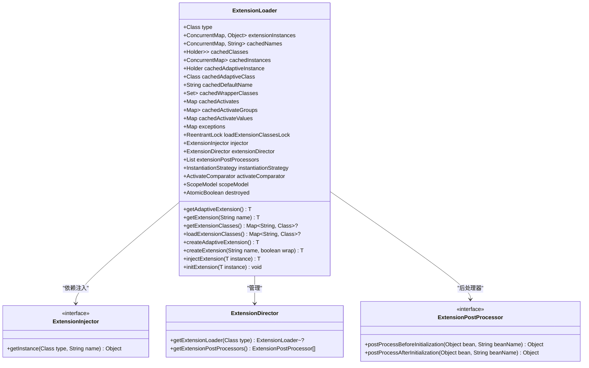
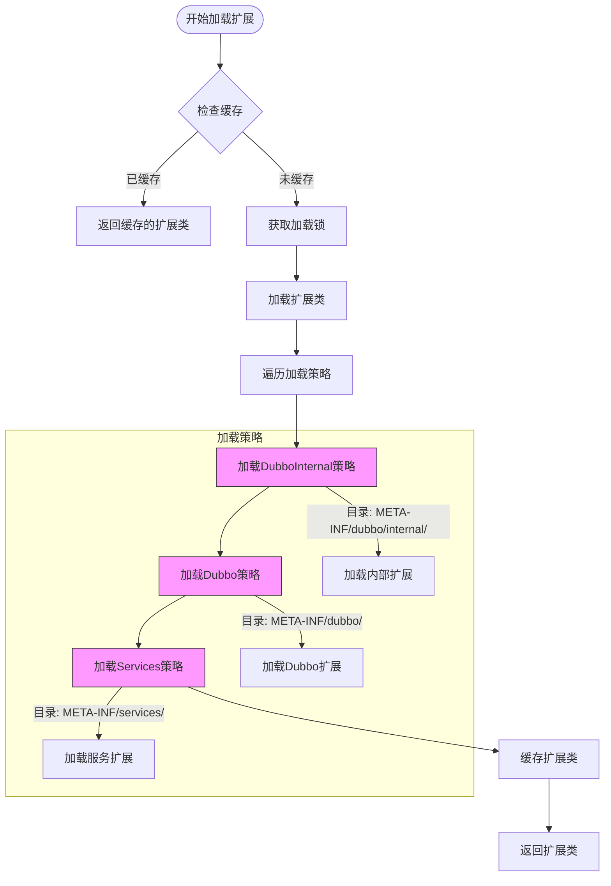
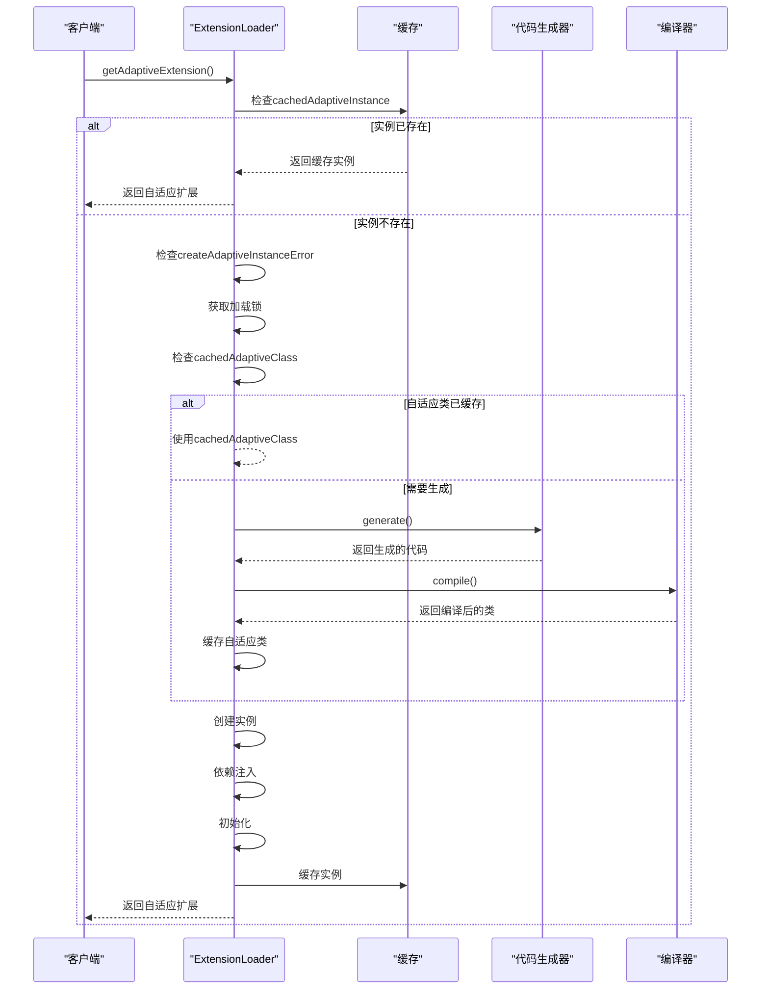
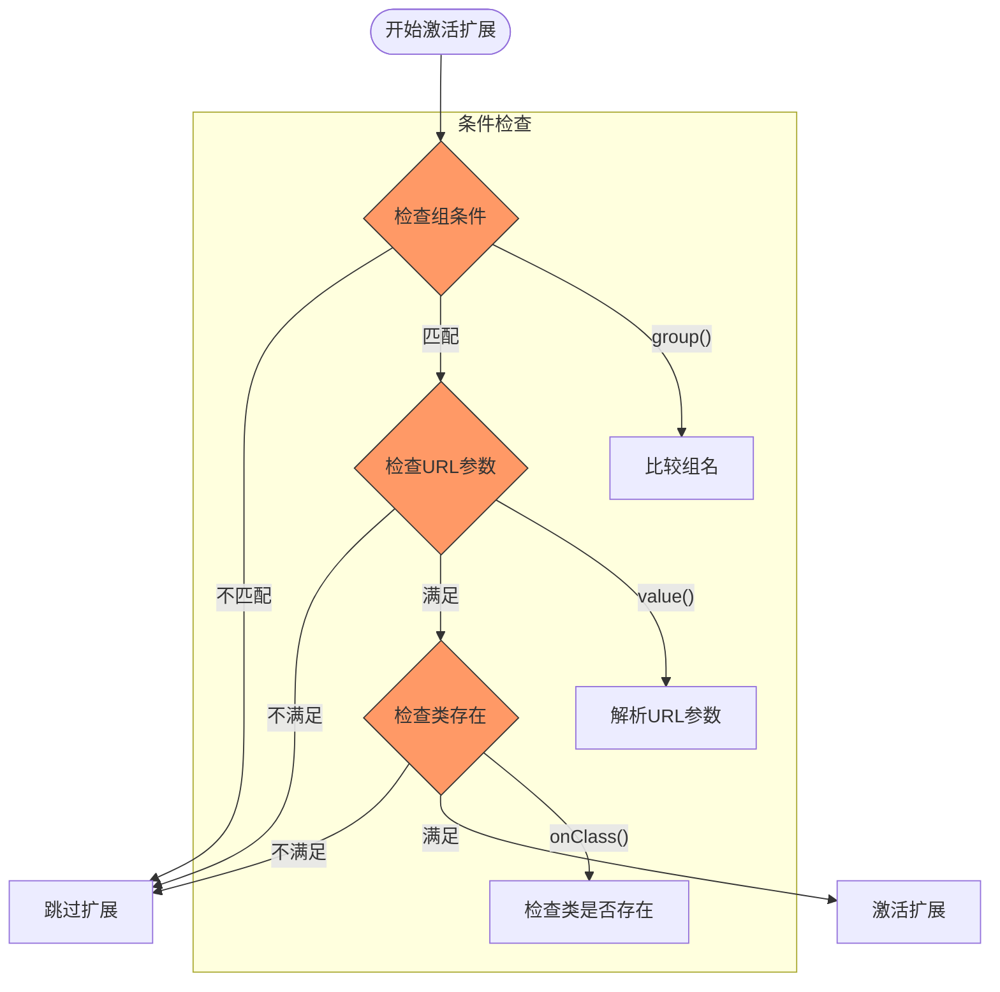
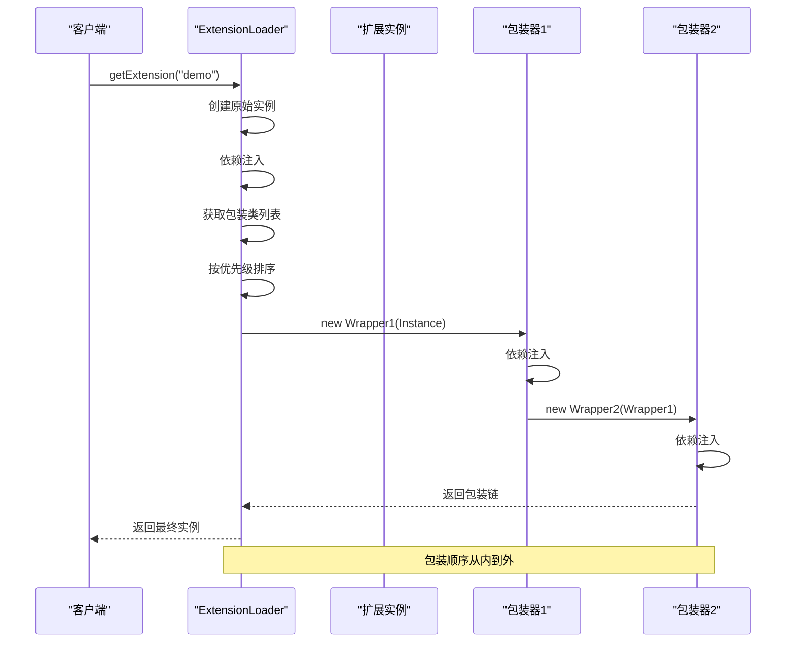

# SPI扩展机制

<cite>
**本文档中引用的文件**  
- [ExtensionLoader.java](file://dubbo-common\src\main\java\org\apache\dubbo\common\extension\ExtensionLoader.java)
- [SPI.java](file://dubbo-common\src\main\java\org\apache\dubbo\common\extension\SPI.java)
- [Adaptive.java](file://dubbo-common\src\main\java\org\apache\dubbo\common\extension\Adaptive.java)
- [Activate.java](file://dubbo-common\src\main\java\org\apache\dubbo\common\extension\Activate.java)
- [Wrapper.java](file://dubbo-common\src\main\java\org\apache\dubbo\common\extension\Wrapper.java)
- [DubboInternalLoadingStrategy.java](file://dubbo-common\src\main\java\org\apache\dubbo\common\extension\DubboInternalLoadingStrategy.java)
- [DubboLoadingStrategy.java](file://dubbo-common\src\main\java\org\apache\dubbo\common\extension\DubboLoadingStrategy.java)
- [ServicesLoadingStrategy.java](file://dubbo-common\src\main\java\org\apache\dubbo\common\extension\ServicesLoadingStrategy.java)
</cite>

## 目录
1. [SPI扩展机制概述](#spi扩展机制概述)
2. [核心注解详解](#核心注解详解)
3. [ExtensionLoader实现原理](#extensionloader实现原理)
4. [扩展加载流程](#扩展加载流程)
5. [自适应扩展机制](#自适应扩展机制)
6. [条件激活机制](#条件激活机制)
7. [Wrapper包装机制](#wrapper包装机制)
8. [性能优化与线程安全](#性能优化与线程安全)

## SPI扩展机制概述

Dubbo的SPI（Service Provider Interface）扩展机制是其插件化架构的核心，通过ExtensionLoader类实现了灵活的扩展点加载、管理和使用。该机制允许Dubbo的核心功能组件（如协议、序列化、负载均衡等）被灵活替换和扩展。

Dubbo的SPI机制在Java原生SPI的基础上进行了增强，主要解决了原生SPI的以下问题：
- 无法按需加载：Java SPI会一次性加载所有扩展实现
- 缺乏扩展名标识：无法通过名称精确获取特定扩展
- 无扩展优先级：无法控制扩展的加载顺序
- 无依赖注入：扩展之间无法自动注入依赖

Dubbo SPI通过@SPI、@Adaptive和@Activate等注解，结合ExtensionLoader类，实现了按需加载、依赖注入、AOP包装和条件激活等高级特性，为Dubbo的微内核架构提供了坚实的基础。

**中文(中文)**
**Section sources**
- [ExtensionLoader.java](file://dubbo-common\src\main\java\org\apache\dubbo\common\extension\ExtensionLoader.java#L92-L134)

## 核心注解详解

### @SPI注解

@SPI注解用于标记一个接口为Dubbo的扩展点，是SPI机制的基础。该注解定义了扩展点的默认实现和作用域。

```java
@Documented
@Retention(RetentionPolicy.RUNTIME)
@Target({ElementType.TYPE})
public @interface SPI {
    String value() default "";
    ExtensionScope scope() default ExtensionScope.APPLICATION;
}
```

@SPI注解包含两个重要属性：
- **value**：指定默认扩展实现的名称，当未指定具体扩展时使用
- **scope**：定义扩展的作用域，包括FRAMEWORK（框架级）、APPLICATION（应用级）、MODULE（模块级）和SELF（自身作用域）

扩展配置文件采用键值对格式，位于META-INF/dubbo/目录下，这种格式可以将异常信息与扩展ID映射，便于问题定位。

**中文(中文)**
**Section sources**
- [SPI.java](file://dubbo-common\src\main\java\org\apache\dubbo\common\extension\SPI.java#L25-L154)

### @Adaptive注解

@Adaptive注解用于生成自适应扩展，是Dubbo SPI机制中实现动态代理的关键。该注解可以标记在类或方法上。

```java
@Documented
@Retention(RetentionPolicy.RUNTIME)
@Target({ElementType.TYPE, ElementType.METHOD})
public @interface Adaptive {
    String[] value() default {};
}
```

@Adaptive注解的主要作用：
- 当标记在类上时，表示该类是自适应扩展的实现
- 当标记在方法上时，表示该方法需要生成自适应代码
- value属性指定从URL中获取扩展名称的参数名

自适应扩展的名称由URL中传递的参数决定，如果找不到指定参数，则使用默认扩展。

**中文(中文)**
**Section sources**
- [Adaptive.java](file://dubbo-common\src\main\java\org\apache\dubbo\common\extension\Adaptive.java#L27-L80)

### @Activate注解

@Activate注解用于在给定条件下自动激活某些扩展，常用于Filter等需要批量加载的场景。

```java
@Documented
@Retention(RetentionPolicy.RUNTIME)
@Target({ElementType.TYPE, ElementType.METHOD})
public @interface Activate {
    String[] group() default {};
    String[] value() default {};
    @Deprecated String[] before() default {};
    @Deprecated String[] after() default {};
    int order() default 0;
    String[] onClass() default {};
}
```

@Activate注解的关键属性：
- **group**：指定组条件，用于匹配扩展组
- **value**：指定URL参数键，当参数存在时激活扩展
- **order**：定义扩展的绝对排序，升序排列
- **onClass**：当指定的类名全部匹配时才激活扩展

**中文(中文)**
**Section sources**
- [Activate.java](file://dubbo-common\src\main\java\org\apache\dubbo\common\extension\Activate.java#L27-L140)

## ExtensionLoader实现原理

ExtensionLoader是Dubbo SPI机制的核心实现类，负责加载、缓存和管理所有的扩展实现。



**中文(中文)**
**Diagram sources **
- [ExtensionLoader.java](file://dubbo-common\src\main\java\org\apache\dubbo\common\extension\ExtensionLoader.java#L142-L1818)

## 扩展加载流程

Dubbo的扩展加载流程遵循特定的策略和顺序，确保扩展能够正确加载和初始化。

### 加载策略

Dubbo定义了三种加载策略，按优先级从高到低排列：
1. **DubboInternalLoadingStrategy**：加载META-INF/dubbo/internal/目录下的扩展
2. **DubboLoadingStrategy**：加载META-INF/dubbo/目录下的扩展
3. **ServicesLoadingStrategy**：加载META-INF/services/目录下的扩展



**中文(中文)**
**Diagram sources **
- [DubboInternalLoadingStrategy.java](file://dubbo-common\src\main\java\org\apache\dubbo\common\extension\DubboInternalLoadingStrategy.java#L25-L65)
- [DubboLoadingStrategy.java](file://dubbo-common\src\main\java\org\apache\dubbo\common\extension\DubboLoadingStrategy.java#L25-L38)
- [ServicesLoadingStrategy.java](file://dubbo-common\src\main\java\org\apache\dubbo\common\extension\ServicesLoadingStrategy.java#L25-L38)

### 加载过程

扩展加载的具体过程包括以下步骤：
1. 检查扩展类缓存，如果已加载则直接返回
2. 获取加载锁，确保线程安全
3. 遍历所有加载策略，加载扩展配置文件
4. 解析配置文件中的键值对，加载对应的扩展类
5. 根据注解信息缓存自适应类、包装类和激活类
6. 返回扩展类映射

加载过程中会处理多种情况：
- 兼容旧版本的扩展工厂
- 处理阿里巴巴包名的兼容性
- 过滤排除的包和类
- 处理类加载器的特殊要求

**中文(中文)**
**Section sources**
- [ExtensionLoader.java](file://dubbo-common\src\main\java\org\apache\dubbo\common\extension\ExtensionLoader.java#L1282-L1432)

## 自适应扩展机制

自适应扩展是Dubbo SPI机制中实现动态代理的核心，通过@Adaptive注解和代码生成技术实现。

### 自适应扩展创建

当调用getAdaptiveExtension()方法时，ExtensionLoader会创建自适应扩展实例：



**中文(中文)**
**Diagram sources **
- [ExtensionLoader.java](file://dubbo-common\src\main\java\org\apache\dubbo\common\extension\ExtensionLoader.java#L1016-L1041)
- [ExtensionLoader.java](file://dubbo-common\src\main\java\org\apache\dubbo\common\extension\ExtensionLoader.java#L1730-L1767)

### 代码生成原理

自适应扩展的代码是动态生成的，生成过程如下：
1. 分析扩展接口的所有方法
2. 对于标记@Adaptive的方法，生成代理代码
3. 从URL中提取扩展名称参数
4. 根据参数值选择具体的扩展实现
5. 调用具体实现的方法

生成的代码会包含完整的类型检查和异常处理，确保运行时的稳定性。编译器会将生成的Java代码编译为字节码，并加载到JVM中。

**中文(中文)**
**Section sources**
- [ExtensionLoader.java](file://dubbo-common\src\main\java\org\apache\dubbo\common\extension\ExtensionLoader.java#L1752-L1767)

## 条件激活机制

@Activate注解实现了扩展的条件激活机制，允许根据运行时条件动态激活扩展。

### 激活条件匹配

激活机制通过以下步骤判断扩展是否应该被激活：
1. 检查组条件（group）是否匹配
2. 检查URL参数条件（value）是否满足
3. 检查类存在条件（onClass）是否满足



**中文(中文)**
**Diagram sources **
- [ExtensionLoader.java](file://dubbo-common\src\main\java\org\apache\dubbo\common\extension\ExtensionLoader.java#L574-L668)
- [ExtensionLoader.java](file://dubbo-common\src\main\java\org\apache\dubbo\common\extension\ExtensionLoader.java#L689-L725)

### 激活排序

激活的扩展会根据order属性进行排序，确保执行顺序的确定性：

```java
private boolean isMatchGroup(String group, Set<String> groups) {
    if (StringUtils.isEmpty(group)) {
        return true;
    }
    if (CollectionUtils.isNotEmpty(groups)) {
        return groups.contains(group);
    }
    return false;
}

private boolean isActive(String[][] keyPairs, URL url) {
    if (keyPairs.length == 0) {
        return true;
    }
    for (String[] keyPair : keyPairs) {
        String key;
        String keyValue = null;
        if (keyPair.length > 1) {
            key = keyPair[0];
            keyValue = keyPair[1];
        } else {
            key = keyPair[0];
        }

        String realValue = url.getParameter(key);
        if (StringUtils.isEmpty(realValue)) {
            realValue = url.getAnyMethodParameter(key);
        }
        if ((keyValue != null && keyValue.equals(realValue))
                || (keyValue == null && ConfigUtils.isNotEmpty(realValue))) {
            return true;
        }
    }
    return false;
}
```

**中文(中文)**
**Section sources**
- [ExtensionLoader.java](file://dubbo-common\src\main\java\org\apache\dubbo\common\extension\ExtensionLoader.java#L689-L725)

## Wrapper包装机制

Wrapper包装机制实现了AOP（面向切面编程）功能，允许对扩展进行装饰和增强。

### 包装类识别

ExtensionLoader通过构造函数参数来识别包装类：

```java
protected boolean isWrapperClass(Class<?> clazz) {
    Constructor<?>[] constructors = clazz.getConstructors();
    for (Constructor<?> constructor : constructors) {
        if (constructor.getParameterTypes().length == 1 && 
            constructor.getParameterTypes()[0] == type) {
            return true;
        }
    }
    return false;
}
```

包装类必须满足以下条件：
- 构造函数只有一个参数
- 参数类型为被包装的扩展接口类型
- 类上标记@Wrapper注解（可选）

### 包装过程

扩展的包装过程在createExtension方法中实现：



**中文(中文)**
**Diagram sources **
- [ExtensionLoader.java](file://dubbo-common\src\main\java\org\apache\dubbo\common\extension\ExtensionLoader.java#L1068-L1107)
- [DemoWrapper.java](file://dubbo-common\src\test\java\org\apache\dubbo\common\extension\wrapper\impl\DemoWrapper.java#L22-L25)
- [DemoWrapper2.java](file://dubbo-common\src\test\java\org\apache\dubbo\common\extension\wrapper\impl\DemoWrapper2.java#L22-L25)

### 包装条件

@Wrapper注解支持条件包装，通过matches和mismatches属性控制：

```java
@Wrapper(
    matches = {"demo"},
    mismatches = {"demo2"}
)
public class DemoWrapper implements Demo {
    private Demo demo;
    
    public DemoWrapper(Demo demo) {
        this.demo = demo;
    }
    
    public String echo(String msg) {
        return demo.echo(msg);
    }
}
```

包装条件判断逻辑：
- matches：只有当扩展名称匹配时才应用包装
- mismatches：当扩展名称匹配时不应用包装
- 两者都未指定时，对所有扩展应用包装

**中文(中文)**
**Section sources**
- [ExtensionLoader.java](file://dubbo-common\src\main\java\org\apache\dubbo\common\extension\ExtensionLoader.java#L1094-L1098)
- [DemoWrapper.java](file://dubbo-common\src\test\java\org\apache\dubbo\common\extension\wrapper\impl\DemoWrapper.java#L22-L35)

## 性能优化与线程安全

Dubbo SPI机制在性能和线程安全方面进行了精心设计，确保在高并发场景下的稳定运行。

### 缓存机制

ExtensionLoader使用多级缓存来提升性能：
- **cachedClasses**：缓存扩展类映射，避免重复加载
- **cachedInstances**：缓存扩展实例，避免重复创建
- **cachedAdaptiveInstance**：缓存自适应扩展实例
- **urlListMapCache**：软引用缓存资源内容

```java
private final ConcurrentMap<Class<?>, Object> extensionInstances = new ConcurrentHashMap<>(64);
private final ConcurrentMap<Class<?>, String> cachedNames = new ConcurrentHashMap<>();
private final Holder<Map<String, Class<?>>> cachedClasses = new Holder<>();
private final ConcurrentMap<String, Holder<Object>> cachedInstances = new ConcurrentHashMap<>();
private final Holder<Object> cachedAdaptiveInstance = new Holder<>();
```

### 线程安全

关键操作使用锁机制保证线程安全：
- **loadExtensionClassesLock**：ReentrantLock保护扩展类加载
- **synchronized块**：保护实例创建和缓存操作
- **ConcurrentHashMap**：线程安全的缓存容器

```java
private final ReentrantLock loadExtensionClassesLock = new ReentrantLock();

private Map<String, Class<?>> getExtensionClasses() {
    Map<String, Class<?>> classes = cachedClasses.get();
    if (classes == null) {
        loadExtensionClassesLock.lock();
        try {
            classes = cachedClasses.get();
            if (classes == null) {
                classes = loadExtensionClasses();
                cachedClasses.set(classes);
            }
        } finally {
            loadExtensionClassesLock.unlock();
        }
    }
    return classes;
}
```

### 性能优化策略

1. **懒加载**：扩展类和实例按需加载，避免启动时的性能开销
2. **双重检查锁**：减少同步开销，提高并发性能
3. **软引用缓存**：平衡内存使用和性能
4. **批量加载**：一次性加载所有扩展配置，减少I/O操作
5. **编译缓存**：缓存编译后的自适应类，避免重复编译

**中文(中文)**
**Section sources**
- [ExtensionLoader.java](file://dubbo-common\src\main\java\org\apache\dubbo\common\extension\ExtensionLoader.java#L161-L283)
- [ExtensionLoader.java](file://dubbo-common\src\main\java\org\apache\dubbo\common\extension\ExtensionLoader.java#L1250-L1276)