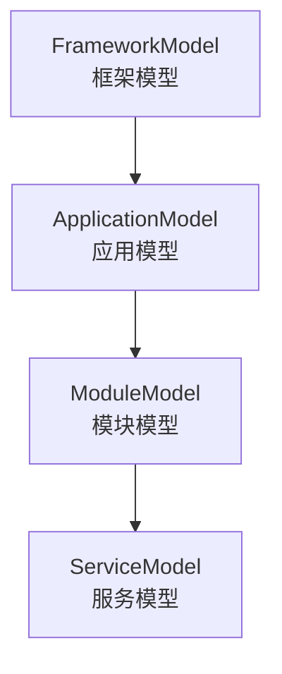
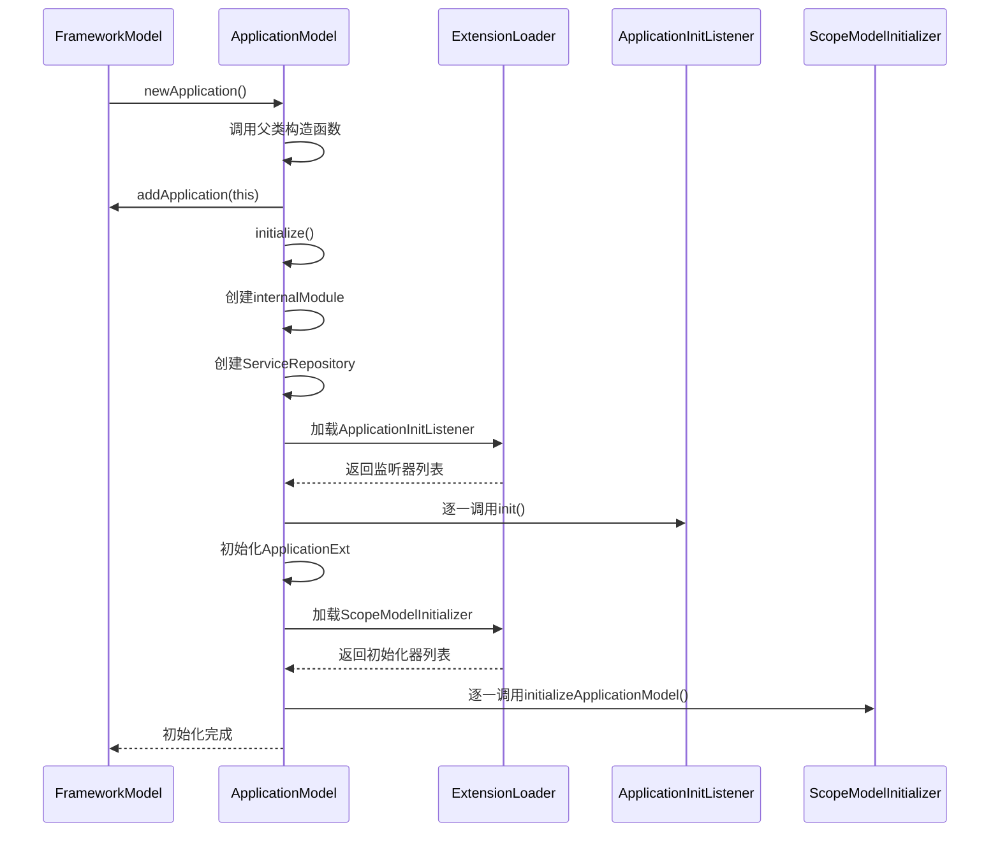
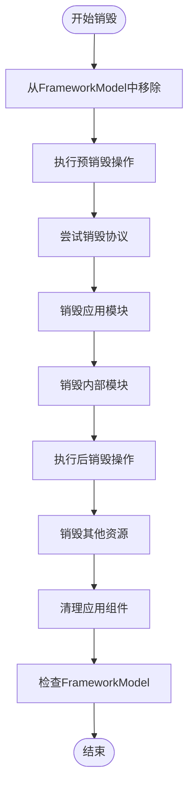

# ApplicationModel

<cite>
**本文档中引用的文件**   
- [ApplicationModel.java](file://dubbo-common\src\main\java\org\apache\dubbo\rpc\model\ApplicationModel.java)
- [FrameworkModel.java](file://dubbo-common\src\main\java\org\apache\dubbo\rpc\model\FrameworkModel.java)
- [ScopeModel.java](file://dubbo-common\src\main\java\org\apache\dubbo\rpc\model\ScopeModel.java)
- [ModuleModel.java](file://dubbo-common\src\main\java\org\apache\dubbo\rpc\model\ModuleModel.java)
- [ApplicationInitListener.java](file://dubbo-common\src\main\java\org\apache\dubbo\rpc\model\ApplicationInitListener.java)
- [ScopeModelInitializer.java](file://dubbo-common\src\main\java\org\apache\dubbo\rpc\model\ScopeModelInitializer.java)
- [ConfigManager.java](file://dubbo-common\src\main\java\org\apache\dubbo\config\context\ConfigManager.java)
- [DefaultApplicationDeployer.java](file://dubbo-config\dubbo-config-api\src\main\java\org\apache\dubbo\config\deploy\DefaultApplicationDeployer.java)
</cite>

## 目录
1. [引言](#引言)
2. [模型层次结构](#模型层次结构)
3. [核心职责与功能](#核心职责与功能)
4. [创建过程与初始化](#创建过程与初始化)
5. [应用级资源管理](#应用级资源管理)
6. [生命周期管理](#生命周期管理)
7. [扩展机制](#扩展机制)
8. [多应用隔离与资源共享](#多应用隔离与资源共享)
9. [使用示例](#使用示例)
10. [最佳实践](#最佳实践)

## 引言

ApplicationModel是Dubbo框架中应用级作用域模型的核心实现，代表一个使用Dubbo的应用程序实例。作为Dubbo模型层次结构中的关键层级，ApplicationModel负责管理应用级别的配置、服务、扩展点和生命周期。它位于FrameworkModel之下，ModuleModel之上，形成了清晰的层级结构：FrameworkModel → ApplicationModel → ModuleModel → ServiceModel。这种设计使得Dubbo能够支持多应用实例共享同一个框架实例，同时保持各应用间的配置和资源隔离。ApplicationModel不仅存储了RPC调用处理所需的基本元数据信息，还协调了模块间的通信，管理了应用级别的资源和状态，在应用的启动、运行和关闭过程中发挥着至关重要的作用。

## 模型层次结构

**图示来源**
- [FrameworkModel.java](file://dubbo-common\src\main\java\org\apache\dubbo\rpc\model\FrameworkModel.java#L47-L53)
- [ApplicationModel.java](file://dubbo-common\src\main\java\org\apache\dubbo\rpc\model\ApplicationModel.java#L51-L55)

ApplicationModel是Dubbo模型层次结构中的核心组成部分，位于FrameworkModel和ModuleModel之间。整个模型层次结构遵循树形结构，其中FrameworkModel作为根节点，代表整个Dubbo框架实例，可以被多个应用共享。每个FrameworkModel可以包含多个ApplicationModel实例，每个ApplicationModel又可以包含多个ModuleModel实例，而每个ModuleModel最终管理着具体的ServiceModel实例。这种分层设计实现了良好的隔离性和可扩展性，使得不同的应用可以在同一个Dubbo框架实例中独立运行，同时共享底层的框架资源。

**本节来源**
- [FrameworkModel.java](file://dubbo-common\src\main\java\org\apache\dubbo\rpc\model\FrameworkModel.java#L41-L83)
- [ApplicationModel.java](file://dubbo-common\src\main\java\org\apache\dubbo\rpc\model\ApplicationModel.java#L40-L67)

## 核心职责与功能

ApplicationModel作为应用级作用域模型，承担着多项核心职责。首先，它负责管理应用级别的配置信息，通过`ConfigManager`组件统一管理应用配置、协议配置、注册中心配置等各类配置。其次，ApplicationModel管理着应用级别的服务信息，通过`ServiceRepository`组件存储和管理该应用中所有已发布和已订阅的服务。此外，ApplicationModel还负责管理应用级别的资源，如线程池、网络连接等，并通过`ExecutorRepository`统一管理执行器资源。

ApplicationModel还提供了应用级别的扩展机制，支持通过SPI（Service Provider Interface）方式扩展应用功能。它通过`ExtensionLoader`加载和管理应用级别的扩展点，如`ApplicationInitListener`等。同时，ApplicationModel作为模块的容器，管理着该应用下的所有模块（ModuleModel），协调模块间的通信和资源共享。最后，ApplicationModel负责应用的生命周期管理，协调应用的启动、运行和关闭过程，确保资源的正确初始化和释放。

**本节来源**
- [ApplicationModel.java](file://dubbo-common\src\main\java\org\apache\dubbo\rpc\model\ApplicationModel.java#L68-L85)
- [ApplicationModel.java](file://dubbo-common\src\main\java\org\apache\dubbo\rpc\model\ApplicationModel.java#L299-L323)

## 创建过程与初始化

ApplicationModel的创建过程始于FrameworkModel，通过`defaultApplication()`或`newApplication()`方法创建。当调用`defaultApplication()`方法时，FrameworkModel会检查是否存在默认应用模型，如果不存在则创建一个新的ApplicationModel实例。在ApplicationModel的构造函数中，首先会调用父类ScopeModel的构造函数，设置作用域为APPLICATION，并将自身添加到所属的FrameworkModel中。

初始化过程主要包括以下几个步骤：首先，创建内部模块（internalModule）用于Dubbo框架内部服务；其次，创建服务仓库（ServiceRepository）用于管理应用级别的服务；然后，加载并初始化应用初始化监听器（ApplicationInitListener），这些监听器可以通过SPI机制扩展应用的初始化行为；接着，初始化应用扩展（ApplicationExt）；最后，加载并执行应用模型初始化器（ScopeModelInitializer），这些初始化器可以对ApplicationModel进行进一步的定制化配置。整个初始化过程在构造函数中完成，确保ApplicationModel在创建后即处于可用状态。

**图示来源**
- [FrameworkModel.java](file://dubbo-common\src\main\java\org\apache\dubbo\rpc\model\FrameworkModel.java#L340-L358)
- [ApplicationModel.java](file://dubbo-common\src\main\java\org\apache\dubbo\rpc\model\ApplicationModel.java#L136-L188)

**本节来源**
- [ApplicationModel.java](file://dubbo-common\src\main\java\org\apache\dubbo\rpc\model\ApplicationModel.java#L136-L188)
- [FrameworkModel.java](file://dubbo-common\src\main\java\org\apache\dubbo\rpc\model\FrameworkModel.java#L340-L358)

## 应用级资源管理

ApplicationModel通过多个组件来管理应用级别的资源。首先是配置管理，通过`ConfigManager`组件管理应用配置，包括应用名称、版本、监控配置等。`getApplicationConfigManager()`方法提供了对配置管理器的访问，开发者可以通过该方法获取和设置应用配置。其次是服务管理，通过`ServiceRepository`组件管理应用级别的服务，包括已发布服务（ProviderModel）和已订阅服务（ConsumerModel）。`getApplicationServiceRepository()`方法提供了对服务仓库的访问。

资源管理还包括执行器管理，通过`ExecutorRepository`组件统一管理应用级别的线程池资源。`getApplicationExecutorRepository()`方法提供了对执行器仓库的访问，确保线程池资源在应用级别得到统一管理和复用。此外，ApplicationModel还管理着环境配置（Environment），通过`modelEnvironment()`方法提供对应用环境的访问，环境配置包含了应用运行时的各种属性和配置信息。

ApplicationModel还负责管理类加载器，通过`addClassLoader()`和`removeClassLoader()`方法添加和移除类加载器，并在类加载器变化时通知相关组件进行刷新。这种设计使得ApplicationModel能够适应复杂的类加载环境，支持热部署和模块化加载等高级功能。

**本节来源**
- [ApplicationModel.java](file://dubbo-common\src\main\java\org\apache\dubbo\rpc\model\ApplicationModel.java#L299-L323)
- [ApplicationModel.java](file://dubbo-common\src\main\java\org\apache\dubbo\rpc\model\ApplicationModel.java#L492-L512)

## 生命周期管理

ApplicationModel的生命周期管理是其核心功能之一，通过`onDestroy()`方法实现。当应用需要关闭时，FrameworkModel会调用ApplicationModel的`destroy()`方法，触发一系列清理和资源释放操作。销毁过程遵循严格的顺序：首先从FrameworkModel中移除当前应用；然后执行预销毁操作，包括销毁注册中心并从注册中心注销服务，以通知消费者停止消费此实例；接着尝试销毁协议，停止此实例接收来自连接的新请求。

接下来是模块销毁阶段，ApplicationModel会依次销毁除内部模块外的所有模块，最后销毁内部模块。之后执行后销毁操作，释放注册中心资源。最后，销毁其他资源（如ZookeeperTransporter）并清理应用级别的组件，包括环境、配置管理器和服务仓库。在整个销毁过程中，ApplicationModel会通过`tryDestroy()`方法检查是否所有模块都已被销毁，当所有模块都被销毁（或只剩内部模块）时，才真正执行销毁操作。

ApplicationModel的生命周期与FrameworkModel紧密关联，当最后一个应用被销毁时，FrameworkModel也会尝试自我销毁。这种设计确保了资源的正确释放，避免了内存泄漏和资源浪费。

**图示来源**
- [ApplicationModel.java](file://dubbo-common\src\main\java\org\apache\dubbo\rpc\model\ApplicationModel.java#L207-L255)
- [ApplicationModel.java](file://dubbo-common\src\main\java\org\apache\dubbo\rpc\model\ApplicationModel.java#L402-L408)

**本节来源**
- [ApplicationModel.java](file://dubbo-common\src\main\java\org\apache\dubbo\rpc\model\ApplicationModel.java#L207-L255)

## 扩展机制

ApplicationModel提供了丰富的扩展机制，主要通过SPI（Service Provider Interface）方式实现。首先是应用初始化监听器（ApplicationInitListener），这是一个SPI接口，作用域为APPLICATION。在ApplicationModel初始化过程中，会加载所有实现ApplicationInitListener接口的扩展，并调用其`init()`方法。开发者可以通过实现此接口来扩展应用的初始化行为，如加载自定义配置、初始化第三方组件等。

其次是应用模型初始化器（ScopeModelInitializer），这也是一个SPI接口，提供了`initializeApplicationModel()`方法。在ApplicationModel初始化的最后阶段，会加载所有ScopeModelInitializer扩展，并调用其`initializeApplicationModel()`方法。这为开发者提供了在ApplicationModel创建后进行定制化配置的机会。

此外，ApplicationModel还支持应用扩展（ApplicationExt），通过`initApplicationExts()`方法初始化所有ApplicationExt扩展。这些扩展机制共同构成了ApplicationModel的可扩展性基础，使得开发者可以在不修改核心代码的情况下，通过SPI方式扩展和定制应用行为。

**本节来源**
- [ApplicationModel.java](file://dubbo-common\src\main\java\org\apache\dubbo\rpc\model\ApplicationModel.java#L164-L181)
- [ApplicationInitListener.java](file://dubbo-common\src\main\java\org\apache\dubbo\rpc\model\ApplicationInitListener.java#L22-L28)
- [ScopeModelInitializer.java](file://dubbo-common\src\main\java\org\apache\dubbo\rpc\model\ScopeModelInitializer.java)

## 多应用隔离与资源共享

ApplicationModel的设计充分考虑了多应用隔离与资源共享的需求。在隔离性方面，每个ApplicationModel实例都有独立的配置管理器（ConfigManager）、服务仓库（ServiceRepository）和执行器仓库（ExecutorRepository），确保不同应用的配置、服务和资源相互隔离，避免相互干扰。通过`internalId`字段，每个ApplicationModel都有唯一的内部标识，用于在FrameworkModel中区分不同的应用实例。

在资源共享方面，多个ApplicationModel实例可以共享同一个FrameworkModel实例，从而共享底层的框架资源，如SPI扩展、全局配置等。这种设计既保证了应用间的隔离性，又实现了资源的有效共享，提高了资源利用率。FrameworkModel通过`applicationModels`和`pubApplicationModels`两个列表管理所有应用模型，其中`pubApplicationModels`只包含非内部应用模型，便于对公共应用进行统一管理。

当需要创建新的应用实例时，可以通过FrameworkModel的`newApplication()`方法创建独立的ApplicationModel实例，实现真正的多应用隔离。而通过`defaultApplication()`方法获取的默认应用模型，则适用于单应用场景，简化了使用复杂度。这种灵活的设计使得Dubbo既能支持简单的单应用部署，也能满足复杂的多应用隔离需求。

**本节来源**
- [FrameworkModel.java](file://dubbo-common\src\main\java\org\apache\dubbo\rpc\model\FrameworkModel.java#L115-L119)
- [ApplicationModel.java](file://dubbo-common\src\main\java\org\apache\dubbo\rpc\model\ApplicationModel.java#L73-L76)
- [FrameworkModel.java](file://dubbo-common\src\main\java\org\apache\dubbo\rpc\model\FrameworkModel.java#L375-L388)

## 使用示例

获取ApplicationModel实例有多种方式。最常用的是通过FrameworkModel获取默认应用模型：`FrameworkModel.defaultModel().defaultApplication()`。也可以通过静态方法直接获取：`ApplicationModel.defaultModel()`。对于特定场景，可以通过`ApplicationModel.ofNullable()`方法安全地获取应用模型，当传入参数为null时返回默认模型。

注册应用级组件通常通过配置管理器完成。例如，设置应用配置：`applicationModel.getApplicationConfigManager().setApplication(new ApplicationConfig("myApp"))`。监听应用生命周期事件可以通过实现ApplicationInitListener接口，并在META-INF/dubbo/internal目录下声明实现类来完成。

在应用级扩展开发中，可以通过实现ScopeModelInitializer接口来扩展ApplicationModel的功能。创建一个新的类实现ScopeModelInitializer接口，并重写`initializeApplicationModel()`方法，在其中添加自定义逻辑。然后在META-INF/dubbo/internal/org.apache.dubbo.rpc.model.ScopeModelInitializer文件中声明该实现类，即可在ApplicationModel初始化时自动执行扩展逻辑。

**本节来源**
- [ApplicationModel.java](file://dubbo-common\src\main\java\org\apache\dubbo\rpc\model\ApplicationModel.java#L107-L113)
- [ConfigManager.java](file://dubbo-common\src\main\java\org\apache\dubbo\config\context\ConfigManager.java#L153-L156)
- [ScopeModelInitializer.java](file://dubbo-common\src\main\java\org\apache\dubbo\rpc\model\ScopeModelInitializer.java)

## 最佳实践

在使用ApplicationModel时，应遵循以下最佳实践：首先，尽量避免使用静态方法获取默认模型，如`ApplicationModel.defaultModel()`，因为在销毁默认FrameworkModel期间可能返回损坏的模型实例，导致不可预测的问题。建议通过依赖注入或显式传递ApplicationModel实例的方式来获取。

其次，在多应用场景下，应明确区分不同应用的ApplicationModel实例，避免配置和资源的混淆。可以通过设置不同的应用名称和配置来实现有效隔离。对于资源管理，应确保在应用关闭时正确释放所有资源，避免内存泄漏。

在扩展开发中，应遵循SPI规范，合理使用ApplicationInitListener和ScopeModelInitializer等扩展点，避免在初始化过程中执行耗时操作，影响应用启动性能。同时，应注意扩展的线程安全性，因为初始化过程可能在多线程环境下执行。

最后，在测试环境中，应使用独立的FrameworkModel实例，避免测试用例之间的相互影响。可以通过`new FrameworkModel()`创建独立的框架实例，并在测试完成后调用`destroy()`方法清理资源，确保测试的隔离性和可重复性。

**本节来源**
- [ApplicationModel.java](file://dubbo-common\src\main\java\org\apache\dubbo\rpc\model\ApplicationModel.java#L116-L123)
- [FrameworkModel.java](file://dubbo-common\src\main\java\org\apache\dubbo\rpc\model\FrameworkModel.java#L77-L81)
- [ScopeModelTest.java](file://dubbo-common\src\test\java\org\apache\dubbo\rpc\model\ScopeModelTest.java#L69-L98)