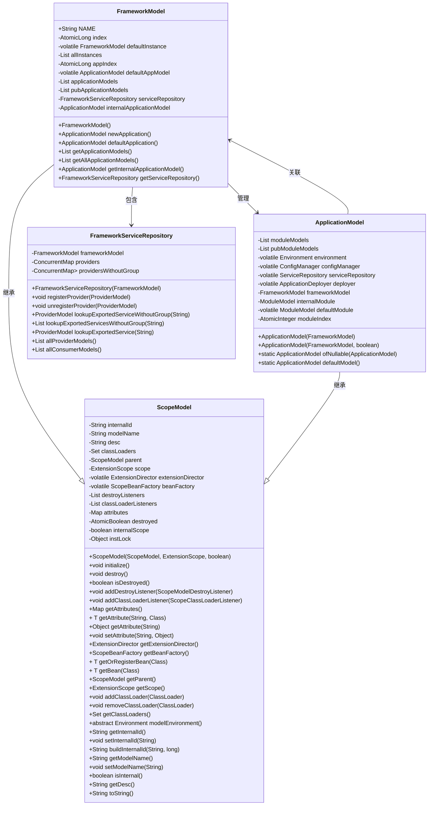
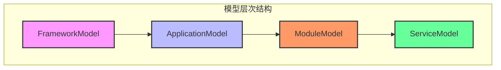
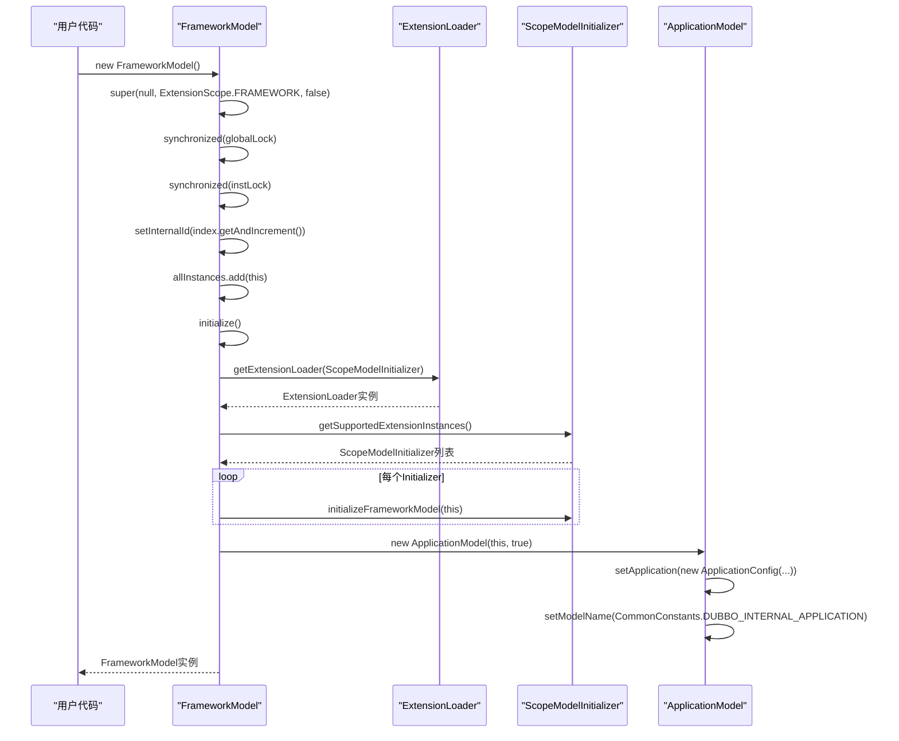
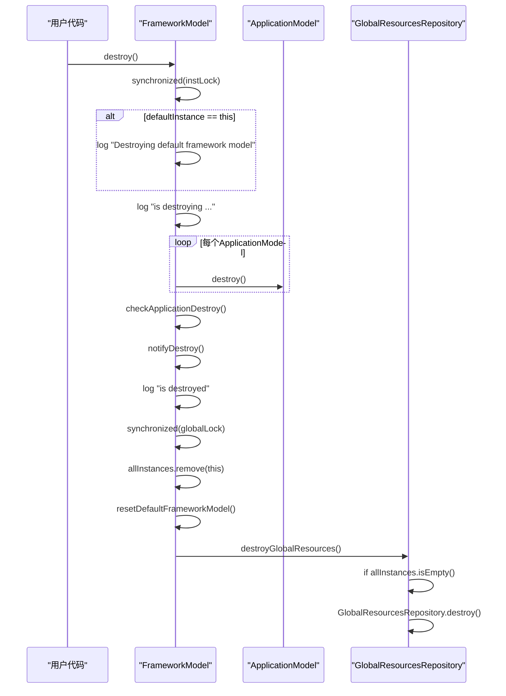
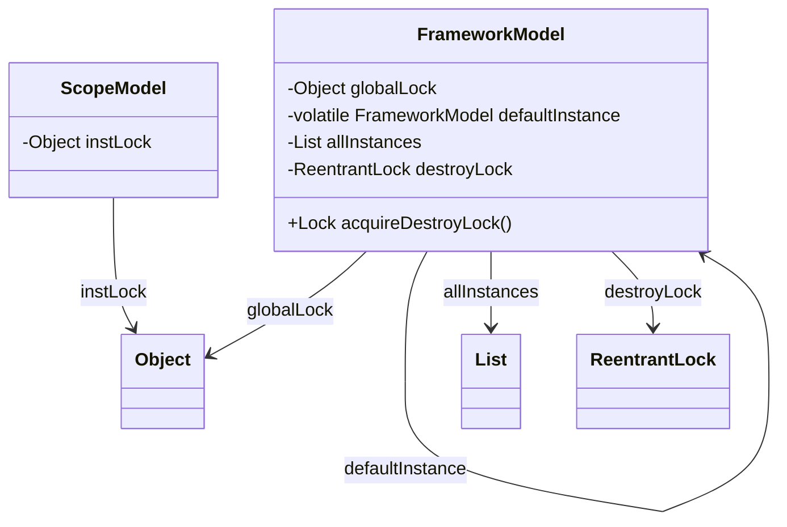
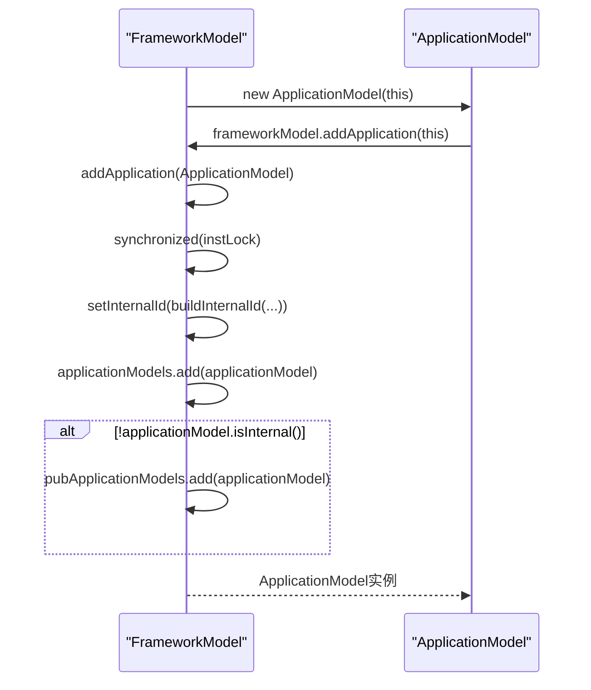
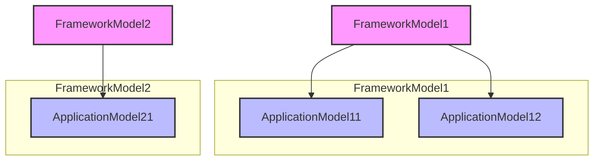
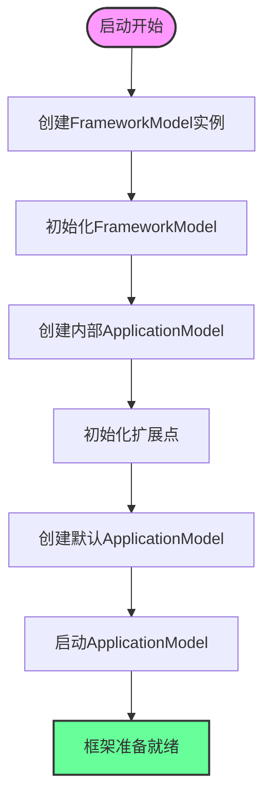

# FrameworkModel

<cite>
**本文档引用的文件**
- [FrameworkModel.java](file://dubbo-common\src\main\java\org\apache\dubbo\rpc\model\FrameworkModel.java)
- [ScopeModel.java](file://dubbo-common\src\main\java\org\apache\dubbo\rpc\model\ScopeModel.java)
- [ApplicationModel.java](file://dubbo-common\src\main\java\org\apache\dubbo\rpc\model\ApplicationModel.java)
- [FrameworkServiceRepository.java](file://dubbo-common\src\main\java\org\apache\dubbo\rpc\model\FrameworkServiceRepository.java)
- [ScopeModelUtil.java](file://dubbo-common\src\main\java\org\apache\dubbo\rpc\model\ScopeModelUtil.java)
</cite>

## 目录
1. [引言](#引言)
2. [核心职责与作用](#核心职责与作用)
3. [模型层次结构](#模型层次结构)
4. [生命周期管理](#生命周期管理)
5. [全局单例性与线程安全性](#全局单例性与线程安全性)
6. [资源管理与共享](#资源管理与共享)
7. [与ApplicationModel的关系](#与applicationmodel的关系)
8. [多应用共存场景](#多应用共存场景)
9. [实际应用示例](#实际应用示例)
10. [启动过程中的关键作用](#启动过程中的关键作用)
11. [最佳实践](#最佳实践)

## 引言

FrameworkModel是Apache Dubbo框架中最顶层的作用域模型，作为整个Dubbo框架实例的容器，它在Dubbo的架构中扮演着至关重要的角色。作为全局资源容器，FrameworkModel负责管理跨应用的共享资源、全局配置、系统级扩展点和监听器。它不仅是Dubbo模型层次结构的根节点，也是框架级服务的基础提供者。

FrameworkModel的设计体现了Dubbo对模块化、隔离性和可扩展性的深刻理解。通过FrameworkModel，Dubbo实现了在单个JVM进程中支持多个独立应用实例的能力，同时保证了资源的有效共享和隔离。本文将深入解析FrameworkModel的核心作用、生命周期管理、线程安全性保障以及在实际应用中的使用方式。

**Section sources**
- [FrameworkModel.java](file://dubbo-common\src\main\java\org\apache\dubbo\rpc\model\FrameworkModel.java#L40-L83)

## 核心职责与作用

FrameworkModel作为Dubbo框架的核心模型，承担着多项关键职责：

1. **全局资源容器**：FrameworkModel是Dubbo框架中所有共享资源的顶级容器，管理着框架级别的服务仓库、扩展加载器、Bean工厂等核心组件。

2. **应用模型管理**：作为模型层次结构的最顶层，FrameworkModel负责管理所有ApplicationModel实例，包括创建、注册和销毁等生命周期操作。

3. **全局配置管理**：维护框架级别的配置信息，为下层的ApplicationModel提供统一的配置访问接口。

4. **系统级扩展点管理**：管理框架级别的SPI（Service Provider Interface）扩展点，确保系统级功能的可插拔性和可扩展性。

5. **监听器管理**：管理框架级别的监听器，支持对框架生命周期事件的监听和响应。

6. **内部应用模型**：每个FrameworkModel都包含一个内部应用模型（internalApplicationModel），用于Dubbo内部服务的管理和隔离。



**Diagram sources**
- [FrameworkModel.java](file://dubbo-common\src\main\java\org\apache\dubbo\rpc\model\FrameworkModel.java#L85)
- [ScopeModel.java](file://dubbo-common\src\main\java\org\apache\dubbo\rpc\model\ScopeModel.java#L42)
- [ApplicationModel.java](file://dubbo-common\src\main\java\org\apache\dubbo\rpc\model\ApplicationModel.java#L69)
- [FrameworkServiceRepository.java](file://dubbo-common\src\main\java\org\apache\dubbo\rpc\model\FrameworkServiceRepository.java#L37)

## 模型层次结构

Dubbo的模型层次结构清晰地定义了不同作用域模型之间的关系，FrameworkModel位于这一层次结构的最顶层。整个模型层次遵循以下结构：



**Diagram sources**
- [FrameworkModel.java](file://dubbo-common\src\main\java\org\apache\dubbo\rpc\model\FrameworkModel.java#L47-L53)

### 层次结构详解

1. **FrameworkModel（框架模型）**：最顶层模型，代表整个Dubbo框架实例，可以被多个应用共享。它是所有其他模型的根节点。

2. **ApplicationModel（应用模型）**：代表一个使用Dubbo的应用程序，存储RPC调用处理期间使用的基本元数据信息。一个FrameworkModel可以包含多个ApplicationModel实例。

3. **ModuleModel（模块模型）**：代表应用程序中的一个模块，用于更细粒度的服务管理和配置隔离。一个ApplicationModel可以包含多个ModuleModel实例。

4. **ServiceModel（服务模型）**：代表一个具体的服务，包含服务的元数据信息，如接口、方法、参数等。

这种层次结构设计使得Dubbo能够实现资源的分层管理和隔离，同时保持了良好的扩展性和灵活性。

**Section sources**
- [FrameworkModel.java](file://dubbo-common\src\main\java\org\apache\dubbo\rpc\model\FrameworkModel.java#L47-L53)
- [ApplicationModel.java](file://dubbo-common\src\main\java\org\apache\dubbo\rpc\model\ApplicationModel.java#L51-L55)

## 生命周期管理

FrameworkModel的生命周期管理是其核心功能之一，确保了框架实例的正确初始化、运行和销毁。生命周期管理主要包括初始化、启动和销毁三个阶段。

### 初始化流程

当创建一个新的FrameworkModel实例时，会执行以下初始化操作：



**Diagram sources**
- [FrameworkModel.java](file://dubbo-common\src\main\java\org\apache\dubbo\rpc\model\FrameworkModel.java#L146-L178)

### 销毁流程

FrameworkModel的销毁是一个有序的过程，确保所有相关资源被正确清理：



**Diagram sources**
- [FrameworkModel.java](file://dubbo-common\src\main\java\org\apache\dubbo\rpc\model\FrameworkModel.java#L193-L239)

### 生命周期关键方法

FrameworkModel提供了多个与生命周期管理相关的关键方法：

- `initialize()`：初始化方法，在构造函数中被调用，负责初始化框架模型的各种组件。
- `onDestroy()`：销毁回调方法，在destroy()方法执行时被调用，负责清理资源。
- `checkApplicationDestroy()`：检查所有应用模型是否已正确销毁。
- `destroyGlobalResources()`：当所有框架模型实例都已销毁时，清理全局静态资源。
- `resetDefaultFrameworkModel()`：重置默认框架模型，当当前默认模型被销毁时调用。

这些方法共同确保了FrameworkModel生命周期的完整性和正确性。

**Section sources**
- [FrameworkModel.java](file://dubbo-common\src\main\java\org\apache\dubbo\rpc\model\FrameworkModel.java#L193-L270)

## 全局单例性与线程安全性

FrameworkModel在设计上充分考虑了全局单例性和线程安全性，确保在多线程环境下能够安全地使用。

### 全局单例性实现

FrameworkModel通过静态变量和双重检查锁模式实现了全局单例性：

```java
// 全局锁，用于同步静态操作
private static final Object globalLock = new Object();

// 全局默认的框架模型实例
private static volatile FrameworkModel defaultInstance;

/**
 * 获取全局默认的框架模型实例
 */
public static FrameworkModel defaultModel() {
    FrameworkModel instance = defaultInstance;
    if (instance == null) {
        synchronized (globalLock) {
            resetDefaultFrameworkModel();
            if (defaultInstance == null) {
                defaultInstance = new FrameworkModel();
            }
            instance = defaultInstance;
        }
    }
    Assert.notNull(instance, "Default FrameworkModel is null");
    return instance;
}
```

这种实现方式确保了在多线程环境下，`defaultModel()`方法能够安全地返回唯一的默认实例。

### 线程安全性保障

FrameworkModel通过多种机制保障线程安全性：

1. **实例锁（instLock）**：每个ScopeModel实例都有一个`instLock`对象，用于同步实例级别的操作。

2. **全局锁（globalLock）**：用于同步静态操作，如创建和销毁默认实例。

3. **销毁锁（destroyLock）**：专门用于同步销毁操作，防止并发销毁。

4. **线程安全集合**：使用`CopyOnWriteArrayList`等线程安全集合存储模型实例。

5. **volatile关键字**：用于确保多线程环境下的可见性。



**Diagram sources**
- [FrameworkModel.java](file://dubbo-common\src\main\java\org\apache\dubbo\rpc\model\FrameworkModel.java#L98-L104)
- [ScopeModel.java](file://dubbo-common\src\main\java\org\apache\dubbo\rpc\model\ScopeModel.java#L83)

### 线程安全操作示例

以下是一些典型的线程安全操作：

- **创建应用模型**：在`newApplication()`方法中，使用`instLock`同步块确保线程安全。
- **添加应用模型**：在`addApplication()`方法中，使用`instLock`同步块确保线程安全。
- **移除应用模型**：在`removeApplication()`方法中，使用`instLock`同步块确保线程安全。
- **获取所有实例**：在`getAllInstances()`方法中，使用`globalLock`同步块确保线程安全。

这些机制共同保障了FrameworkModel在高并发环境下的稳定性和可靠性。

**Section sources**
- [FrameworkModel.java](file://dubbo-common\src\main\java\org\apache\dubbo\rpc\model\FrameworkModel.java#L98-L104)
- [ScopeModel.java](file://dubbo-common\src\main\java\org\apache\dubbo\rpc\model\ScopeModel.java#L83)

## 资源管理与共享

FrameworkModel作为全局资源容器，负责管理多种类型的共享资源，确保资源的有效利用和隔离。

### 服务仓库管理

FrameworkModel通过`FrameworkServiceRepository`管理框架级别的服务仓库，主要功能包括：

- **服务注册**：注册ProviderModel实例，支持按服务键（serviceKey）快速查找。
- **服务注销**：注销ProviderModel实例，清理相关资源。
- **服务查找**：支持按完整服务键或忽略组的服务键查找服务。

```java
public class FrameworkServiceRepository {
    // 按 group/serviceInterfaceName:version 查找 ProviderModel
    private final ConcurrentMap<String, ProviderModel> providers = new ConcurrentHashMap<>();
    
    // 按 serviceInterfaceName:version 查找 ProviderModel
    private final ConcurrentMap<String, List<ProviderModel>> providersWithoutGroup = new ConcurrentHashMap<>();
    
    public void registerProvider(ProviderModel providerModel) {
        String key = providerModel.getServiceKey();
        providers.putIfAbsent(key, providerModel);
        String keyWithoutGroup = keyWithoutGroup(key);
        ConcurrentHashMapUtils.computeIfAbsent(
                providersWithoutGroup, keyWithoutGroup, (k) -> new CopyOnWriteArrayList<>())
                .add(providerModel);
    }
    
    public void unregisterProvider(ProviderModel providerModel) {
        providers.remove(providerModel.getServiceKey());
        String keyWithoutGroup = keyWithoutGroup(providerModel.getServiceKey());
        providersWithoutGroup.remove(keyWithoutGroup);
    }
}
```

### 扩展点管理

FrameworkModel通过`ExtensionDirector`管理框架级别的扩展点，支持SPI机制：

- **扩展加载器**：通过`getExtensionLoader()`方法获取指定类型的扩展加载器。
- **扩展实例化**：通过`getSupportedExtensionInstances()`方法获取所有支持的扩展实例。
- **扩展初始化**：在初始化阶段调用所有`ScopeModelInitializer`的`initializeFrameworkModel()`方法。

### Bean工厂管理

FrameworkModel通过`ScopeBeanFactory`管理框架级别的Bean：

- **Bean注册**：通过`registerBean()`方法注册Bean。
- **Bean获取**：通过`getBean()`或`getOrRegisterBean()`方法获取Bean实例。
- **Bean生命周期**：管理Bean的创建、初始化和销毁。

### 类加载器管理

FrameworkModel通过`classLoaders`集合管理相关的类加载器：

- **添加类加载器**：通过`addClassLoader()`方法添加类加载器。
- **移除类加载器**：通过`removeClassLoader()`方法移除类加载器。
- **检查类加载器**：通过`checkIfClassLoaderCanRemoved()`方法检查类加载器是否可以被移除。

这些资源管理机制确保了FrameworkModel能够有效地管理各种共享资源，同时保持良好的隔离性和可扩展性。

**Section sources**
- [FrameworkServiceRepository.java](file://dubbo-common\src\main\java\org\apache\dubbo\rpc\model\FrameworkServiceRepository.java#L37)
- [FrameworkModel.java](file://dubbo-common\src\main\java\org\apache\dubbo\rpc\model\FrameworkModel.java#L122)
- [ScopeModel.java](file://dubbo-common\src\main\java\org\apache\dubbo\rpc\model\ScopeModel.java#L72)

## 与ApplicationModel的关系

FrameworkModel与ApplicationModel之间存在着紧密的父子关系，这种关系是Dubbo模型层次结构的核心。

### 创建与管理

FrameworkModel负责创建和管理所有的ApplicationModel实例：



**Diagram sources**
- [ApplicationModel.java](file://dubbo-common\src\main\java\org\apache\dubbo\rpc\model\ApplicationModel.java#L147)
- [FrameworkModel.java](file://dubbo-common\src\main\java\org\apache\dubbo\rpc\model\FrameworkModel.java#L375)

### 默认应用模型

FrameworkModel维护一个默认的应用模型，用于简化API使用：

```java
/**
 * 获取或创建默认的应用模型
 */
public ApplicationModel defaultApplication() {
    ApplicationModel appModel = this.defaultAppModel;
    if (appModel == null) {
        checkDestroyed();
        resetDefaultAppModel();
        if ((appModel = this.defaultAppModel) == null) {
            synchronized (instLock) {
                if (this.defaultAppModel == null) {
                    this.defaultAppModel = newApplication();
                }
                appModel = this.defaultAppModel;
            }
        }
    }
    Assert.notNull(appModel, "Default ApplicationModel is null");
    return appModel;
}
```

### 内部应用模型

每个FrameworkModel都包含一个内部应用模型，用于Dubbo内部服务：

```java
// 内部应用模型，用于Dubbo内部使用
private final ApplicationModel internalApplicationModel;

// 在构造函数中创建内部应用模型
internalApplicationModel = new ApplicationModel(this, true);
internalApplicationModel
    .getApplicationConfigManager()
    .setApplication(new ApplicationConfig(
        internalApplicationModel, CommonConstants.DUBBO_INTERNAL_APPLICATION));
internalApplicationModel.setModelName(CommonConstants.DUBBO_INTERNAL_APPLICATION);
```

### 资源继承

ApplicationModel继承FrameworkModel的资源和配置：

- **扩展加载器**：ApplicationModel的`extensionDirector`继承自FrameworkModel。
- **Bean工厂**：ApplicationModel的`beanFactory`继承自FrameworkModel。
- **类加载器**：ApplicationModel的类加载器集合包含FrameworkModel的类加载器。

这种父子关系设计使得ApplicationModel能够复用FrameworkModel的资源，同时保持独立的配置和状态。

**Section sources**
- [FrameworkModel.java](file://dubbo-common\src\main\java\org\apache\dubbo\rpc\model\FrameworkModel.java#L113-L125)
- [ApplicationModel.java](file://dubbo-common\src\main\java\org\apache\dubbo\rpc\model\ApplicationModel.java#L87)

## 多应用共存场景

FrameworkModel的设计支持在单个JVM进程中运行多个独立的Dubbo应用实例，这在多租户、微服务架构和单元测试等场景中非常有用。

### 资源隔离策略

FrameworkModel通过以下机制实现资源隔离：

1. **独立的模型实例**：每个应用都有独立的ApplicationModel实例，确保配置和状态的隔离。

2. **独立的扩展加载器**：每个ApplicationModel有独立的`ExtensionDirector`，但共享FrameworkModel的扩展点。

3. **独立的Bean工厂**：每个ApplicationModel有独立的`ScopeBeanFactory`，但可以访问FrameworkModel的Bean。

4. **独立的服务仓库**：每个ApplicationModel有独立的`ServiceRepository`，但FrameworkModel有全局的服务仓库。

### 资源共享策略

尽管实现了资源隔离，FrameworkModel也支持必要的资源共享：

1. **共享框架资源**：所有应用共享FrameworkModel的全局资源，如线程池、网络连接等。

2. **共享扩展点**：框架级别的扩展点（如协议、序列化器）对所有应用可见。

3. **共享类加载器**：FrameworkModel的类加载器对所有应用可用。

### 多应用示例

以下是一个多应用共存的示例：



**Diagram sources**
- [ExtensionDirectorTest.java](file://dubbo-common\src\test\java\org\apache\dubbo\common\extension\ExtensionDirectorTest.java#L156-L165)

### 隔离性测试

FrameworkModel的隔离性可以通过以下测试验证：

```java
@Test
void testModelDataIsolation() {
    // 创建两个独立的FrameworkModel
    FrameworkModel frameworkModel1 = new FrameworkModel();
    FrameworkModel frameworkModel2 = new FrameworkModel();
    
    // 创建应用模型
    ApplicationModel applicationModel11 = frameworkModel1.newApplication();
    ApplicationModel applicationModel12 = frameworkModel1.newApplication();
    ApplicationModel applicationModel21 = frameworkModel2.newApplication();
    
    // 验证隔离性
    Collection<ApplicationModel> applicationsOfFw1 = frameworkModel1.getApplicationModels();
    Assertions.assertEquals(2, applicationsOfFw1.size());
    Assertions.assertTrue(applicationsOfFw1.contains(applicationModel11));
    Assertions.assertTrue(applicationsOfFw1.contains(applicationModel12));
    Assertions.assertFalse(applicationsOfFw1.contains(applicationModel21));
}
```

这种设计使得Dubbo能够在单个JVM中支持多个独立的应用实例，同时保持资源的有效共享和隔离。

**Section sources**
- [ExtensionDirectorTest.java](file://dubbo-common\src\test\java\org\apache\dubbo\common\extension\ExtensionDirectorTest.java#L154-L184)

## 实际应用示例

FrameworkModel在实际应用中有多种使用方式，以下是一些典型的示例。

### 获取FrameworkModel实例

获取FrameworkModel实例的常用方式：

```java
// 获取全局默认实例
FrameworkModel frameworkModel = FrameworkModel.defaultModel();

// 创建新的实例
FrameworkModel newFrameworkModel = new FrameworkModel();
```

### 创建和管理应用模型

```java
// 获取或创建默认应用模型
ApplicationModel applicationModel = frameworkModel.defaultApplication();

// 创建新的应用模型
ApplicationModel newApplicationModel = frameworkModel.newApplication();

// 获取所有应用模型
List<ApplicationModel> applicationModels = frameworkModel.getApplicationModels();
```

### 资源注册与获取

```java
// 注册服务提供者
ProviderModel providerModel = new ProviderModel(...);
frameworkModel.getServiceRepository().registerProvider(providerModel);

// 获取Bean
ScopeBeanFactory beanFactory = frameworkModel.getBeanFactory();
MyService myService = beanFactory.getOrRegisterBean(MyService.class);

// 添加类加载器
frameworkModel.addClassLoader(myClassLoader);
```

### 在扩展开发中的应用

```java
public class MyScopeModelInitializer implements ScopeModelInitializer {
    @Override
    public void initializeFrameworkModel(FrameworkModel frameworkModel) {
        // 在框架模型初始化时执行
        ScopeBeanFactory beanFactory = frameworkModel.getBeanFactory();
        beanFactory.registerBean(MyFrameworkService.class);
        
        // 注册监听器
        frameworkModel.addDestroyListener(new MyDestroyListener());
    }
    
    @Override
    public void initializeApplicationModel(ApplicationModel applicationModel) {
        // 在应用模型初始化时执行
        ScopeBeanFactory beanFactory = applicationModel.getBeanFactory();
        beanFactory.registerBean(MyApplicationService.class);
    }
}
```

### 在Spring Boot集成中的应用

```java
public class SpringRestToolKit {
    public SpringRestToolKit(FrameworkModel frameworkModel) {
        ApplicationModel applicationModel = frameworkModel.defaultApplication();
        SpringExtensionInjector injector = SpringExtensionInjector.get(applicationModel);
        ApplicationContext context = injector.getContext();
        
        // 获取框架级别的Bean
        typeConverter = frameworkModel.getOrRegisterBean(GeneralTypeConverter.class);
        parameterNameReader = frameworkModel.getOrRegisterBean(DefaultParameterNameReader.class);
        argumentResolver = frameworkModel.getOrRegisterBean(CompositeArgumentResolver.class);
    }
}
```

### 在配置处理中的应用

```java
private void assignProperties(
        Object obj,
        Environment environment,
        Map<String, String> properties,
        InmemoryConfiguration configuration,
        ConfigMode configMode) {
    
    FrameworkModel frameworkModel = ScopeModelUtil.getFrameworkModel(getScopeModel());
    
    // 使用框架模型处理配置
    List<Method> methods = MethodUtils.getMethods(obj.getClass(), method -> method.getDeclaringClass() != Object.class);
    for (Method method : methods) {
        if (isPropertySetter(method)) {
            String propertyName = extractPropertyName(method.getName());
            // 处理属性设置
        }
    }
}
```

这些示例展示了FrameworkModel在不同场景下的实际应用，体现了其作为全局资源容器的强大功能。

**Section sources**
- [FrameworkModel.java](file://dubbo-common\src\main\java\org\apache\dubbo\rpc\model\FrameworkModel.java#L284)
- [ScopeModelUtil.java](file://dubbo-common\src\main\java\org\apache\dubbo\rpc\model\ScopeModelUtil.java#L84)
- [SpringRestToolKit.java](file://dubbo-plugin\dubbo-rest-spring\src\main\java\org\apache\dubbo\rpc\protocol\tri\rest\support\spring\SpringRestToolKit.java#L72)
- [AbstractConfig.java](file://dubbo-common\src\main\java\org\apache\dubbo\config\AbstractConfig.java#L792)

## 启动过程中的关键作用

FrameworkModel在Dubbo的启动过程中扮演着至关重要的角色，是整个框架初始化的基础。

### 启动流程

FrameworkModel的启动流程如下：



**Diagram sources**
- [FrameworkModel.java](file://dubbo-common\src\main\java\org\apache\dubbo\rpc\model\FrameworkModel.java#L146-L178)

### 关键初始化步骤

1. **注册框架模型实例**：将新创建的FrameworkModel实例注册到全局列表中。

2. **初始化类型定义构建器**：初始化用于服务元数据定义的构建器。

3. **创建框架服务仓库**：创建用于管理服务提供者的仓库。

4. **执行扩展初始化**：调用所有`ScopeModelInitializer`的`initializeFrameworkModel()`方法。

5. **创建内部应用模型**：创建用于Dubbo内部服务的特殊应用模型。

### 与DubboBootstrap的集成

FrameworkModel与DubboBootstrap紧密集成，共同完成框架的启动：

```java
// DubboBootstrap中使用FrameworkModel
public class DubboBootstrap {
    private FrameworkModel frameworkModel;
    private ApplicationModel applicationModel;
    
    public DubboBootstrap() {
        this.frameworkModel = FrameworkModel.defaultModel();
        this.applicationModel = frameworkModel.defaultApplication();
    }
    
    public void start() {
        // 使用FrameworkModel和ApplicationModel进行初始化
        initializeConfigCenter();
        initializeMetadataReport();
        exportServices();
        referServices();
    }
}
```

### 启动过程中的资源准备

在启动过程中，FrameworkModel负责准备以下关键资源：

- **扩展加载器**：为所有SPI扩展点准备加载器。
- **Bean工厂**：为框架级别的Bean准备工厂。
- **服务仓库**：为服务注册和发现准备仓库。
- **配置管理器**：为全局配置准备管理器。

这些资源的准备是Dubbo能够正常运行的基础，FrameworkModel确保了这些资源在启动过程中的正确初始化和配置。

**Section sources**
- [FrameworkModel.java](file://dubbo-common\src\main\java\org\apache\dubbo\rpc\model\FrameworkModel.java#L146-L178)

## 最佳实践

在使用FrameworkModel时，遵循以下最佳实践可以确保应用的稳定性和可维护性。

### 使用默认实例

在大多数情况下，建议使用全局默认的FrameworkModel实例：

```java
// 推荐：使用默认实例
FrameworkModel frameworkModel = FrameworkModel.defaultModel();

// 不推荐：频繁创建新实例
FrameworkModel newFrameworkModel = new FrameworkModel();
```

### 避免销毁默认实例

销毁默认FrameworkModel实例可能导致不可预测的问题：

```java
// 警告：避免销毁默认实例
FrameworkModel defaultModel = FrameworkModel.defaultModel();
// defaultModel.destroy(); // 可能导致问题
```

### 正确管理生命周期

确保FrameworkModel的生命周期得到正确管理：

```java
// 在应用关闭时销毁FrameworkModel
@Override
public void destroy() {
    if (frameworkModel != null) {
        frameworkModel.destroy();
        frameworkModel = null;
    }
}
```

### 合理使用资源

合理使用FrameworkModel管理的资源：

```java
// 正确：获取Bean
MyService myService = frameworkModel.getOrRegisterBean(MyService.class);

// 正确：注册服务提供者
frameworkModel.getServiceRepository().registerProvider(providerModel);

// 正确：添加类加载器
frameworkModel.addClassLoader(myClassLoader);
```

### 多应用场景下的注意事项

在多应用共存场景下，注意资源隔离和共享：

```java
// 为不同应用创建独立的FrameworkModel
FrameworkModel frameworkModel1 = new FrameworkModel();
FrameworkModel frameworkModel2 = new FrameworkModel();

// 确保正确销毁
frameworkModel1.destroy();
frameworkModel2.destroy();
```

### 扩展开发的最佳实践

在开发框架级扩展时，遵循以下实践：

```java
public class MyScopeModelInitializer implements ScopeModelInitializer {
    @Override
    public void initializeFrameworkModel(FrameworkModel frameworkModel) {
        // 在框架模型初始化时注册Bean
        ScopeBeanFactory beanFactory = frameworkModel.getBeanFactory();
        beanFactory.registerBean(MyFrameworkService.class);
        
        // 注册销毁监听器
        frameworkModel.addDestroyListener(new MyDestroyListener());
    }
}
```

遵循这些最佳实践，可以确保FrameworkModel的正确使用，提高应用的稳定性和可维护性。

**Section sources**
- [FrameworkModel.java](file://dubbo-common\src\main\java\org\apache\dubbo\rpc\model\FrameworkModel.java#L273-L282)