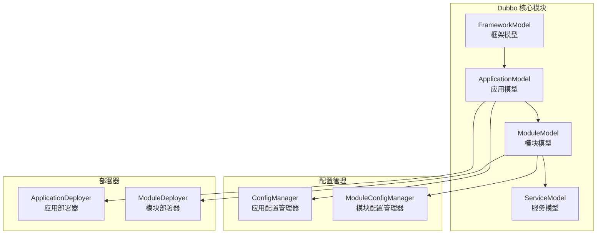
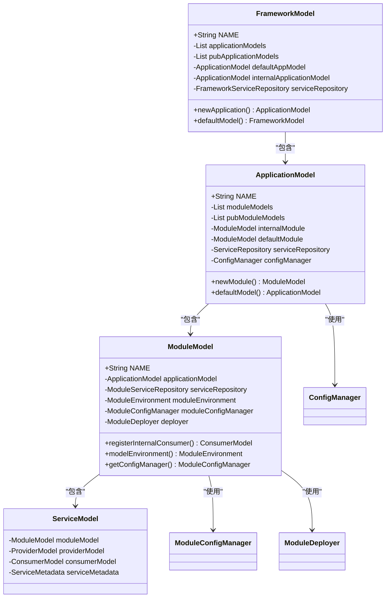
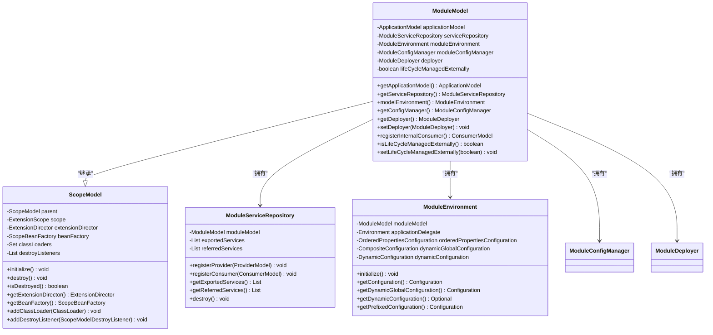
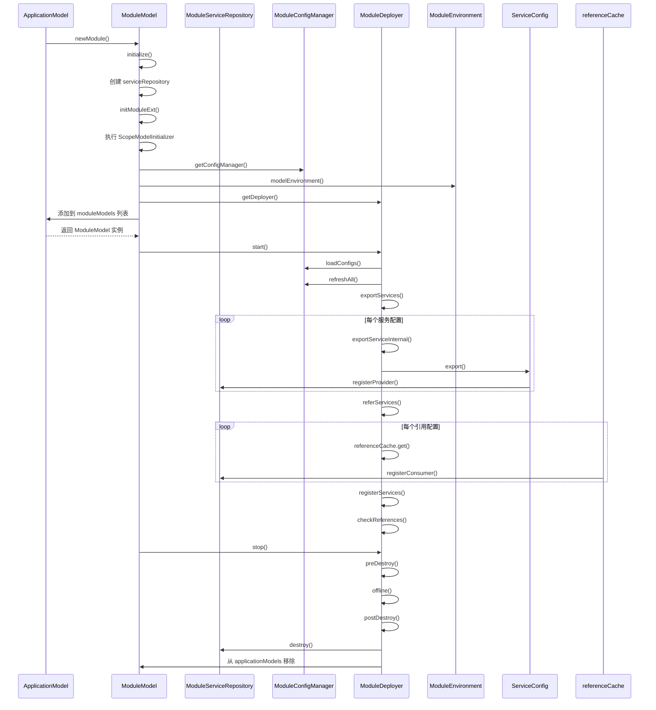
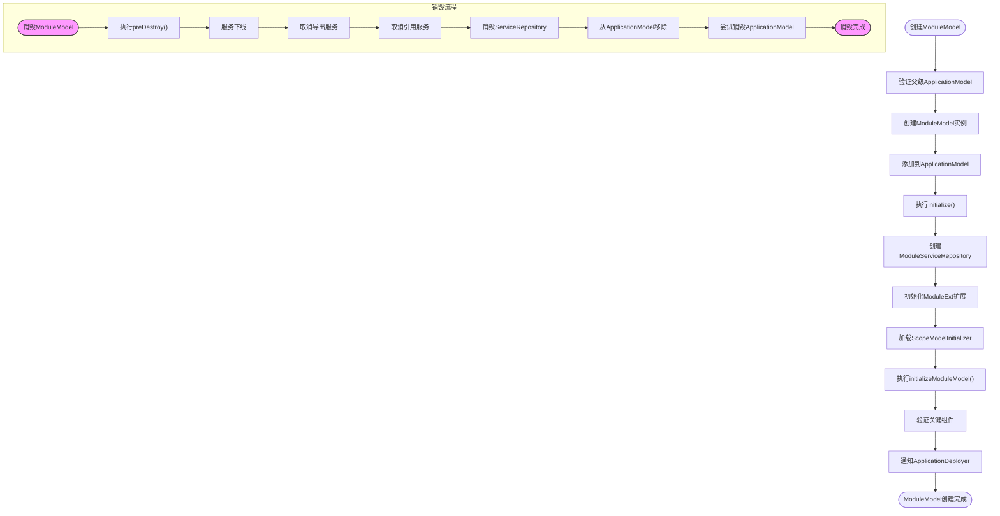
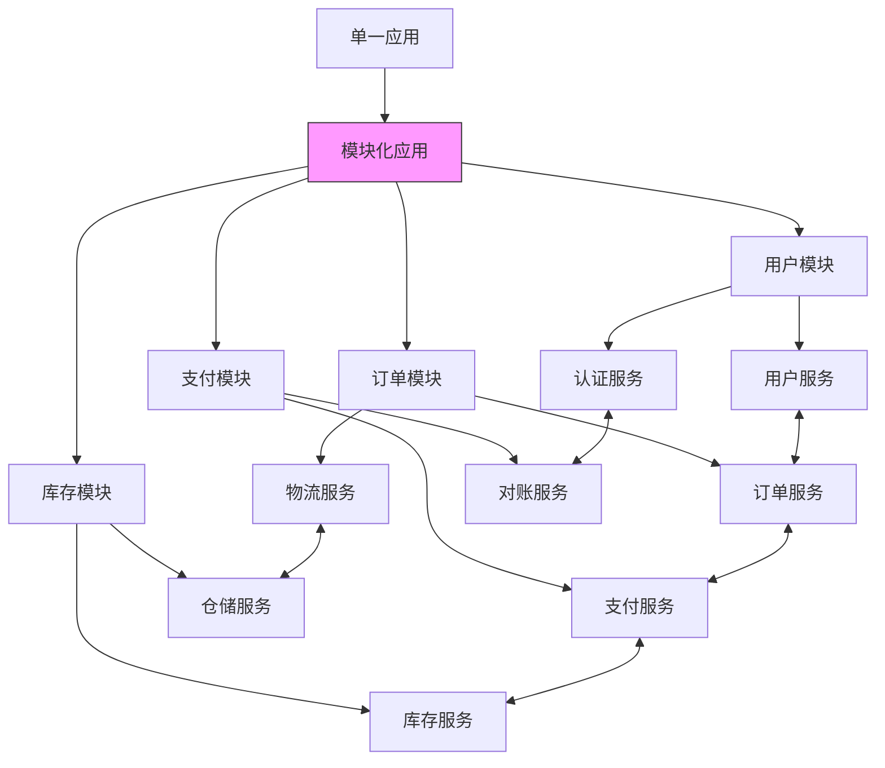
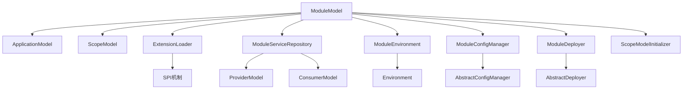

# ModuleModel

<cite>
**本文档引用的文件**   
- [ModuleModel.java](file://dubbo-common\src\main\java\org\apache\dubbo\rpc\model\ModuleModel.java)
- [ApplicationModel.java](file://dubbo-common\src\main\java\org\apache\dubbo\rpc\model\ApplicationModel.java)
- [ScopeModel.java](file://dubbo-common\src\main\java\org\apache\dubbo\rpc\model\ScopeModel.java)
- [DefaultModuleDeployer.java](file://dubbo-config\dubbo-config-api\src\main\java\org\apache\dubbo\config\deploy\DefaultModuleDeployer.java)
- [ModuleConfigManager.java](file://dubbo-common\src\main\java\org\apache\dubbo\config\context\ModuleConfigManager.java)
- [ModuleConfig.java](file://dubbo-common\src\main\java\org\apache\dubbo\config\ModuleConfig.java)
- [ModuleEnvironment.java](file://dubbo-common\src\main\java\org\apache\dubbo\common\config\ModuleEnvironment.java)
- [FrameworkModel.java](file://dubbo-common\src\main\java\org\apache\dubbo\rpc\model\FrameworkModel.java)
</cite>

## 目录
1. [引言](#引言)
2. [项目结构](#项目结构)
3. [核心组件](#核心组件)
4. [架构概述](#架构概述)
5. [详细组件分析](#详细组件分析)
6. [依赖分析](#依赖分析)
7. [性能考虑](#性能考虑)
8. [故障排除指南](#故障排除指南)
9. [结论](#结论)

## 引言
ModuleModel是Dubbo框架中用于实现模块级作用域管理的核心组件，作为ApplicationModel和ServiceModel之间的中间层，它提供了细粒度的资源管理和配置隔离能力。ModuleModel允许在单个应用内划分多个逻辑模块，每个模块可以独立管理其服务提供者、消费者、配置和生命周期，从而实现功能模块化和解耦。这种分层架构不仅支持复杂的微服务系统设计，还为大型应用的独立部署和维护提供了基础。

## 项目结构
Dubbo项目采用分层的模块化结构，其中ModuleModel位于dubbo-common模块的rpc.model包中，作为核心模型层的一部分。整个项目结构清晰地划分了不同功能模块，从基础的common组件到具体的rpc、registry、config等模块，形成了完整的微服务解决方案。ModuleModel与ApplicationModel、FrameworkModel共同构成了Dubbo的三级模型体系，为服务治理提供了坚实的基础。

**图源**
- [ModuleModel.java](file://dubbo-common\src\main\java\org\apache\dubbo\rpc\model\ModuleModel.java)
- [ApplicationModel.java](file://dubbo-common\src\main\java\org\apache\dubbo\rpc\model\ApplicationModel.java)
- [FrameworkModel.java](file://dubbo-common\src\main\java\org\apache\dubbo\rpc\model\FrameworkModel.java)

**节源**
- [ModuleModel.java](file://dubbo-common\src\main\java\org\apache\dubbo\rpc\model\ModuleModel.java#L1-L50)
- [ApplicationModel.java](file://dubbo-common\src\main\java\org\apache\dubbo\rpc\model\ApplicationModel.java#L1-L50)

## 核心组件
ModuleModel作为模块级作用域模型，提供了服务模块的完整生命周期管理，包括模块的创建、初始化、启动、停止和销毁。它通过继承ScopeModel基类，获得了扩展加载器、Bean工厂和类加载器管理等核心能力。ModuleModel与ApplicationModel紧密协作，每个ApplicationModel可以包含多个ModuleModel实例，实现了应用内功能的逻辑分组和隔离。

**节源**
- [ModuleModel.java](file://dubbo-common\src\main\java\org\apache\dubbo\rpc\model\ModuleModel.java#L43-L100)
- [ScopeModel.java](file://dubbo-common\src\main\java\org\apache\dubbo\rpc\model\ScopeModel.java#L42-L100)

## 架构概述
Dubbo的模型架构采用分层设计，从上到下依次为FrameworkModel、ApplicationModel和ModuleModel。这种层次化结构实现了不同粒度的作用域隔离：FrameworkModel代表整个Dubbo框架实例，ApplicationModel代表一个完整的Dubbo应用，而ModuleModel则代表应用内的功能模块。每个层级都拥有独立的资源管理、配置体系和生命周期控制，同时保持父子层级间的继承和通信机制。

**图源**
- [FrameworkModel.java](file://dubbo-common\src\main\java\org\apache\dubbo\rpc\model\FrameworkModel.java#L85-L200)
- [ApplicationModel.java](file://dubbo-common\src\main\java\org\apache\dubbo\rpc\model\ApplicationModel.java#L69-L200)
- [ModuleModel.java](file://dubbo-common\src\main\java\org\apache\dubbo\rpc\model\ModuleModel.java#L43-L100)

## 详细组件分析

### ModuleModel 分析
ModuleModel是Dubbo中服务模块的模型表示，作为ApplicationModel的子级和ServiceModel的父级，它在Dubbo的三级模型体系中扮演着承上启下的关键角色。ModuleModel不仅管理着模块内的服务提供者和消费者，还负责模块级别的配置、环境和部署生命周期。

#### 对象导向组件

**图源**
- [ModuleModel.java](file://dubbo-common\src\main\java\org\apache\dubbo\rpc\model\ModuleModel.java#L43-L360)
- [ScopeModel.java](file://dubbo-common\src\main\java\org\apache\dubbo\rpc\model\ScopeModel.java#L42-L200)
- [ModuleEnvironment.java](file://dubbo-common\src\main\java\org\apache\dubbo\common\config\ModuleEnvironment.java#L36-L72)

#### API/服务组件

**图源**
- [ModuleModel.java](file://dubbo-common\src\main\java\org\apache\dubbo\rpc\model\ModuleModel.java#L67-L115)
- [DefaultModuleDeployer.java](file://dubbo-config\dubbo-config-api\src\main\java\org\apache\dubbo\config\deploy\DefaultModuleDeployer.java#L97-L245)
- [ModuleConfigManager.java](file://dubbo-common\src\main\java\org\apache\dubbo\config\context\ModuleConfigManager.java#L113-L200)

#### 复杂逻辑组件

**图源**
- [ModuleModel.java](file://dubbo-common\src\main\java\org\apache\dubbo\rpc\model\ModuleModel.java#L67-L173)
- [ApplicationModel.java](file://dubbo-common\src\main\java\org\apache\dubbo\rpc\model\ApplicationModel.java#L370-L381)

**节源**
- [ModuleModel.java](file://dubbo-common\src\main\java\org\apache\dubbo\rpc\model\ModuleModel.java#L1-L360)
- [ModuleModelTest.java](file://dubbo-common\src\test\java\org\apache\dubbo\rpc\model\ModuleModelTest.java#L33-L90)

### 概念概述
ModuleModel的设计理念是将大型应用分解为多个可独立管理的功能模块，每个模块拥有自己的服务注册表、配置管理和生命周期。这种设计不仅提高了系统的可维护性，还支持更灵活的部署策略。通过ModuleModel，开发者可以在同一个JVM进程中运行多个逻辑上独立的模块，每个模块可以有不同的配置、类加载器和资源管理策略。

## 依赖分析
ModuleModel的实现依赖于多个核心组件和扩展机制，形成了复杂的依赖网络。它直接依赖于ApplicationModel作为父级容器，依赖于ModuleConfigManager进行配置管理，依赖于ModuleDeployer处理部署生命周期，同时通过SPI机制加载各种扩展组件。

**图源**
- [ModuleModel.java](file://dubbo-common\src\main\java\org\apache\dubbo\rpc\model\ModuleModel.java#L19-L35)
- [ScopeModel.java](file://dubbo-common\src\main\java\org\apache\dubbo\rpc\model\ScopeModel.java#L19-L38)
- [DefaultModuleDeployer.java](file://dubbo-config\dubbo-config-api\src\main\java\org\apache\dubbo\config\deploy\DefaultModuleDeployer.java#L48-L88)

**节源**
- [ModuleModel.java](file://dubbo-common\src\main\java\org\apache\dubbo\rpc\model\ModuleModel.java#L1-L50)
- [ScopeModel.java](file://dubbo-common\src\main\java\org\apache\dubbo\rpc\model\ScopeModel.java#L1-L50)

## 性能考虑
ModuleModel的设计在性能方面进行了充分考虑。通过层级化的模型结构，实现了资源的隔离和复用，避免了全局锁的竞争。每个ModuleModel拥有独立的ExtensionDirector和BeanFactory，减少了跨模块的资源争用。同时，ModuleModel的懒加载机制确保了只有在实际使用时才创建相关组件，降低了内存占用和初始化开销。

## 故障排除指南
在使用ModuleModel时可能遇到的常见问题包括模块创建失败、配置无法继承、服务注册异常等。这些问题通常源于模块生命周期管理不当或配置冲突。通过监控ModuleModel的生命周期状态、检查配置继承链和验证服务注册状态，可以有效诊断和解决这些问题。

**节源**
- [ModuleModel.java](file://dubbo-common\src\main\java\org\apache\dubbo\rpc\model\ModuleModel.java#L133-L173)
- [ModuleModelTest.java](file://dubbo-common\src\test\java\org\apache\dubbo\rpc\model\ModuleModelTest.java#L70-L90)

## 结论
ModuleModel作为Dubbo框架中的模块级作用域模型，为大型微服务系统的功能解耦和独立部署提供了坚实的基础。通过精细的资源管理和配置隔离，ModuleModel使得复杂应用能够被分解为多个可独立管理的功能模块，每个模块拥有自己的生命周期、配置体系和服务注册表。这种设计不仅提高了系统的可维护性和可扩展性，还支持更灵活的部署策略和故障隔离机制，是构建现代化微服务架构的重要组成部分。