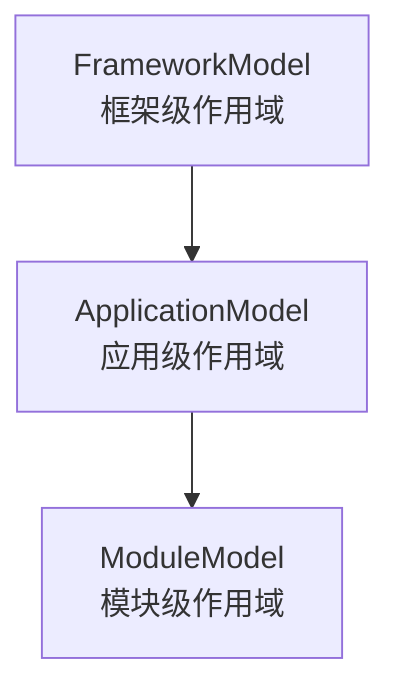
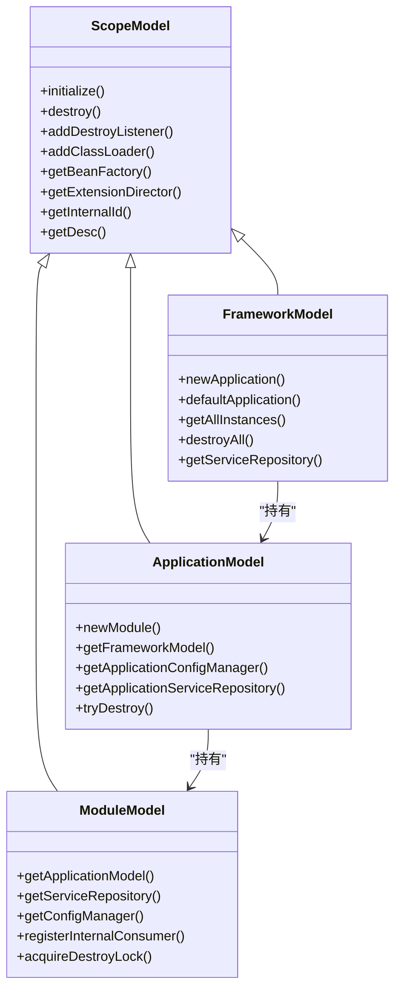
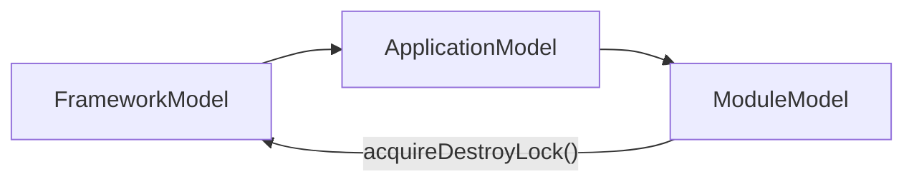
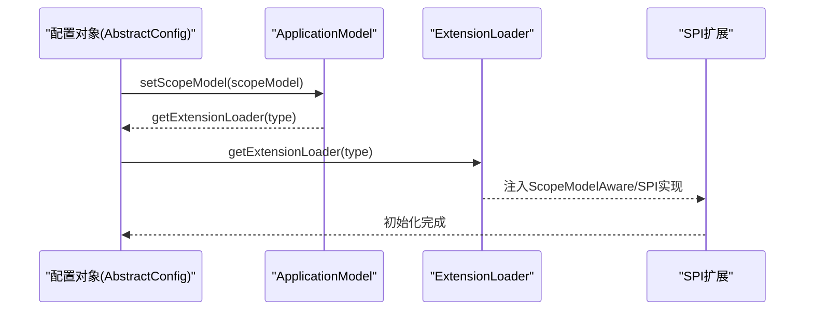

# 作用域模型层次

<cite>
**本文引用的文件**
- [ScopeModel.java](file://dubbo-common/src/main/java/org/apache/dubbo/rpc/model/ScopeModel.java)
- [FrameworkModel.java](file://dubbo-common/src/main/java/org/apache/dubbo/rpc/model/FrameworkModel.java)
- [ApplicationModel.java](file://dubbo-common/src/main/java/org/apache/dubbo/rpc/model/ApplicationModel.java)
- [ModuleModel.java](file://dubbo-common/src/main/java/org/apache/dubbo/rpc/model/ModuleModel.java)
- [ScopeModelUtil.java](file://dubbo-common/src/main/java/org/apache/dubbo/rpc/model/ScopeModelUtil.java)
- [ScopeModelInitializer.java](file://dubbo-common/src/main/java/org/apache/dubbo/rpc/model/ScopeModelInitializer.java)
- [ScopeModelAware.java](file://dubbo-common/src/main/java/org/apache/dubbo/rpc/model/ScopeModelAware.java)
- [FrameworkModelTest.java](file://dubbo-common/src/test/java/org/apache/dubbo/rpc/model/FrameworkModelTest.java)
- [ApplicationModelTest.java](file://dubbo-common/src/test/java/org/apache/dubbo/rpc/model/ApplicationModelTest.java)
- [ModuleModelTest.java](file://dubbo-common/src/test/java/org/apache/dubbo/rpc/model/ModuleModelTest.java)
- [ScopeModelUtilTest.java](file://dubbo-common/src/test/java/org/apache/dubbo/rpc/model/ScopeModelUtilTest.java)
- [ExtensionDirectorTest.java](file://dubbo-common/src/test/java/org/apache/dubbo/common/extension/ExtensionDirectorTest.java)
- [ScopeModelAwareExtensionProcessorTest.java](file://dubbo-common/src/test/java/org/apache/dubbo/rpc/model/ScopeModelAwareExtensionProcessorTest.java)
- [AbstractConfig.java](file://dubbo-common/src/main/java/org/apache/dubbo/config/AbstractConfig.java)
</cite>

## 目录
1. [简介](#简介)
2. [项目结构与定位](#项目结构与定位)
3. [核心组件总览](#核心组件总览)
4. [架构概览](#架构概览)
5. [详细组件分析](#详细组件分析)
6. [依赖关系分析](#依赖关系分析)
7. [性能与资源管理特性](#性能与资源管理特性)
8. [故障排查指南](#故障排查指南)
9. [结论](#结论)
10. [附录：常见用法与最佳实践](#附录常见用法与最佳实践)

## 简介
本文件系统性解析 Dubbo 的作用域模型层次架构，聚焦 FrameworkModel、ApplicationModel 和 ModuleModel 三层，阐明其职责边界、生命周期、父子继承关系与资源共享机制；解释如何通过模型层次实现扩展点、配置、监听器等资源的组织与隔离；并给出在多应用、多模块场景下的优势与最佳实践。

## 项目结构与定位
- 作用域模型位于公共模块 dubbo-common 的 rpc.model 包中，是 Dubbo 运行期资源组织的核心抽象。
- FrameworkModel 代表整个框架级作用域，ApplicationModel 代表应用级作用域，ModuleModel 代表模块级作用域。
- 三者共同构成树形层级：FrameworkModel -> ApplicationModel -> ModuleModel，形成“框架-应用-模块”的逐层继承与资源下沉。

图表来源
- [FrameworkModel.java](file://dubbo-common/src/main/java/org/apache/dubbo/rpc/model/FrameworkModel.java#L145-L177)
- [ApplicationModel.java](file://dubbo-common/src/main/java/org/apache/dubbo/rpc/model/ApplicationModel.java#L135-L188)
- [ModuleModel.java](file://dubbo-common/src/main/java/org/apache/dubbo/rpc/model/ModuleModel.java#L77-L115)

章节来源
- [FrameworkModel.java](file://dubbo-common/src/main/java/org/apache/dubbo/rpc/model/FrameworkModel.java#L145-L177)
- [ApplicationModel.java](file://dubbo-common/src/main/java/org/apache/dubbo/rpc/model/ApplicationModel.java#L135-L188)
- [ModuleModel.java](file://dubbo-common/src/main/java/org/apache/dubbo/rpc/model/ModuleModel.java#L77-L115)

## 核心组件总览
- ScopeModel：抽象基类，统一管理扩展点、Bean 工厂、类加载器、属性、销毁监听器等通用能力，并提供内部 ID 与描述信息。
- FrameworkModel：框架级容器，维护全局实例列表、默认实例、内部应用模型、框架级服务仓库与销毁策略。
- ApplicationModel：应用级容器，维护模块列表、应用级配置与服务仓库、应用部署器、内部模块与默认模块。
- ModuleModel：模块级容器，维护模块级服务仓库、模块级配置与环境、模块部署器、内部消费者注册等。
- ScopeModelUtil：提供从任意 ScopeModel 推导上层模型的工具方法，以及根据 SPI 范围获取默认作用域模型。
- ScopeModelInitializer：SPI 扩展点，允许在各层模型初始化阶段注入自定义逻辑。
- ScopeModelAware：SPI 扩展点，允许组件感知当前所处的 Framework/Application/Module 作用域。

章节来源
- [ScopeModel.java](file://dubbo-common/src/main/java/org/apache/dubbo/rpc/model/ScopeModel.java#L41-L113)
- [FrameworkModel.java](file://dubbo-common/src/main/java/org/apache/dubbo/rpc/model/FrameworkModel.java#L145-L177)
- [ApplicationModel.java](file://dubbo-common/src/main/java/org/apache/dubbo/rpc/model/ApplicationModel.java#L135-L188)
- [ModuleModel.java](file://dubbo-common/src/main/java/org/apache/dubbo/rpc/model/ModuleModel.java#L77-L115)
- [ScopeModelUtil.java](file://dubbo-common/src/main/java/org/apache/dubbo/rpc/model/ScopeModelUtil.java#L24-L120)
- [ScopeModelInitializer.java](file://dubbo-common/src/main/java/org/apache/dubbo/rpc/model/ScopeModelInitializer.java#L22-L31)
- [ScopeModelAware.java](file://dubbo-common/src/main/java/org/apache/dubbo/rpc/model/ScopeModelAware.java#L22-L48)

## 架构概览
- 层次化继承：FrameworkModel -> ApplicationModel -> ModuleModel，每层持有父模型引用，形成树状结构。
- 资源隔离：每层拥有独立的扩展目录、Bean 工厂、配置与仓库，避免跨层污染。
- 生命周期：从创建到销毁，遵循“子先父后”的顺序，确保资源有序释放。
- 继承传播：下层模型的 ExtensionDirector 会继承上层，保证 SPI 查找链路贯通。

图表来源
- [ScopeModel.java](file://dubbo-common/src/main/java/org/apache/dubbo/rpc/model/ScopeModel.java#L41-L113)
- [FrameworkModel.java](file://dubbo-common/src/main/java/org/apache/dubbo/rpc/model/FrameworkModel.java#L327-L357)
- [ApplicationModel.java](file://dubbo-common/src/main/java/org/apache/dubbo/rpc/model/ApplicationModel.java#L262-L323)
- [ModuleModel.java](file://dubbo-common/src/main/java/org/apache/dubbo/rpc/model/ModuleModel.java#L180-L206)

章节来源
- [FrameworkModelTest.java](file://dubbo-common/src/test/java/org/apache/dubbo/rpc/model/FrameworkModelTest.java#L30-L52)
- [ApplicationModelTest.java](file://dubbo-common/src/test/java/org/apache/dubbo/rpc/model/ApplicationModelTest.java#L120-L149)
- [ModuleModelTest.java](file://dubbo-common/src/test/java/org/apache/dubbo/rpc/model/ModuleModelTest.java#L33-L57)

## 详细组件分析

### FrameworkModel（框架级作用域）
- 职责范围
  - 维护全局框架实例列表与默认实例，提供框架级服务仓库。
  - 提供创建应用模型的能力，并维护内部应用模型（用于框架内部使用）。
  - 负责框架级销毁流程：销毁所有应用模型、检查销毁完整性、清理全局静态资源。
- 生命周期
  - 构造：注册自身、初始化类型定义构建器、创建框架服务仓库、执行 ScopeModelInitializer 列表、创建内部应用模型。
  - 销毁：遍历销毁应用模型、校验销毁完成、通知销毁、从全局列表移除并重置默认实例、必要时销毁全局静态资源。
- 关键行为
  - defaultModel()/getAllInstances()/destroyAll() 提供全局生命周期管理入口。
  - newApplication()/defaultApplication() 支持应用模型的创建与默认实例获取。
  - tryDestroyProtocols()/tryDestroy() 用于在特定条件下提前销毁协议资源。
- 资源隔离
  - 通过内部应用模型与公共应用模型分离，避免用户应用与框架内部资源互相影响。
  - 框架级 Environment 不可访问，防止误用导致配置污染。

章节来源
- [FrameworkModel.java](file://dubbo-common/src/main/java/org/apache/dubbo/rpc/model/FrameworkModel.java#L145-L177)
- [FrameworkModel.java](file://dubbo-common/src/main/java/org/apache/dubbo/rpc/model/FrameworkModel.java#L192-L239)
- [FrameworkModel.java](file://dubbo-common/src/main/java/org/apache/dubbo/rpc/model/FrameworkModel.java#L283-L296)
- [FrameworkModel.java](file://dubbo-common/src/main/java/org/apache/dubbo/rpc/model/FrameworkModel.java#L327-L357)
- [FrameworkModel.java](file://dubbo-common/src/main/java/org/apache/dubbo/rpc/model/FrameworkModel.java#L414-L421)
- [FrameworkModel.java](file://dubbo-common/src/main/java/org/apache/dubbo/rpc/model/FrameworkModel.java#L538-L567)
- [FrameworkModelTest.java](file://dubbo-common/src/test/java/org/apache/dubbo/rpc/model/FrameworkModelTest.java#L30-L52)
- [FrameworkModelTest.java](file://dubbo-common/src/test/java/org/apache/dubbo/rpc/model/FrameworkModelTest.java#L62-L81)

### ApplicationModel（应用级作用域）
- 职责范围
  - 维护模块列表（含内部模块与公共模块），提供应用级配置管理器与服务仓库。
  - 负责应用级部署器与初始化监听器，支持应用级扩展初始化。
  - 提供默认模块与内部模块，支持模块的创建与移除。
- 生命周期
  - 构造：加入框架模型、初始化、创建内部模块、创建应用服务仓库、初始化应用扩展、执行 ScopeModelInitializer 列表。
  - 销毁：从框架模型移除、预销毁（停止注册中心等）、销毁除内部模块外的所有模块、最后销毁内部模块、后销毁（释放注册中心资源）、通知销毁、清理应用级组件、触发框架尝试销毁。
- 资源隔离
  - 内部模块与公共模块分离，内部模块用于框架内部服务，公共模块用于用户服务。
  - 通过 tryDestroy() 在模块清空后自动销毁应用，避免资源泄漏。

章节来源
- [ApplicationModel.java](file://dubbo-common/src/main/java/org/apache/dubbo/rpc/model/ApplicationModel.java#L135-L188)
- [ApplicationModel.java](file://dubbo-common/src/main/java/org/apache/dubbo/rpc/model/ApplicationModel.java#L206-L255)
- [ApplicationModel.java](file://dubbo-common/src/main/java/org/apache/dubbo/rpc/model/ApplicationModel.java#L262-L323)
- [ApplicationModel.java](file://dubbo-common/src/main/java/org/apache/dubbo/rpc/model/ApplicationModel.java#L363-L408)
- [ApplicationModelTest.java](file://dubbo-common/src/test/java/org/apache/dubbo/rpc/model/ApplicationModelTest.java#L120-L149)

### ModuleModel（模块级作用域）
- 职责范围
  - 维护模块级服务仓库、模块级配置与模块级环境，支持模块级部署器。
  - 提供内部消费者注册能力，便于动态注册内部服务消费者。
  - 通过 acquireDestroyLock() 复用框架销毁锁，确保销毁一致性。
- 生命周期
  - 构造：加入应用模型、初始化、创建模块服务仓库、初始化模块扩展、执行 ScopeModelInitializer 列表、通知应用状态变更。
  - 销毁：从应用模型移除、预销毁、后销毁、通知销毁、销毁模块服务仓库与模块环境、销毁模块配置管理器、触发应用尝试销毁。
- 资源隔离
  - 模块级 Environment 与 ConfigManager 懒加载，避免不必要的初始化。
  - 类加载器变更会刷新模块环境，确保类加载器隔离。

章节来源
- [ModuleModel.java](file://dubbo-common/src/main/java/org/apache/dubbo/rpc/model/ModuleModel.java#L77-L115)
- [ModuleModel.java](file://dubbo-common/src/main/java/org/apache/dubbo/rpc/model/ModuleModel.java#L133-L173)
- [ModuleModel.java](file://dubbo-common/src/main/java/org/apache/dubbo/rpc/model/ModuleModel.java#L180-L206)
- [ModuleModel.java](file://dubbo-common/src/main/java/org/apache/dubbo/rpc/model/ModuleModel.java#L213-L234)
- [ModuleModelTest.java](file://dubbo-common/src/test/java/org/apache/dubbo/rpc/model/ModuleModelTest.java#L33-L57)
- [ModuleModelTest.java](file://dubbo-common/src/test/java/org/apache/dubbo/rpc/model/ModuleModelTest.java#L70-L90)

### 模型工具与扩展点
- ScopeModelUtil
  - 提供 getFrameworkModel()/getApplicationModel()/getModuleModel() 与 getOrDefault() 等方法，用于从任意 ScopeModel 推导上层模型或获取默认模型。
  - 根据 SPI 的作用域范围自动选择默认模型（FRAMEWORK/APPLICATION/MODULE）。
- ScopeModelInitializer
  - SPI 接口，允许在 Framework/Application/Module 三个层次分别注入初始化逻辑。
- ScopeModelAware
  - SPI 接口，允许组件在初始化后注入当前作用域模型（FrameworkModel/ApplicationModel/ModuleModel），便于按需使用。

章节来源
- [ScopeModelUtil.java](file://dubbo-common/src/main/java/org/apache/dubbo/rpc/model/ScopeModelUtil.java#L24-L120)
- [ScopeModelInitializer.java](file://dubbo-common/src/main/java/org/apache/dubbo/rpc/model/ScopeModelInitializer.java#L22-L31)
- [ScopeModelAware.java](file://dubbo-common/src/main/java/org/apache/dubbo/rpc/model/ScopeModelAware.java#L22-L48)
- [ScopeModelAwareExtensionProcessorTest.java](file://dubbo-common/src/test/java/org/apache/dubbo/rpc/model/ScopeModelAwareExtensionProcessorTest.java#L41-L80)

## 依赖关系分析

### 模型继承与依赖
- 继承关系：FrameworkModel -> ApplicationModel -> ModuleModel，均继承自 ScopeModel。
- 依赖关系：
  - FrameworkModel 持有 ApplicationModel 列表与内部应用模型。
  - ApplicationModel 持有 ModuleModel 列表与内部模块。
  - ModuleModel 依赖 ApplicationModel 的框架销毁锁，确保销毁顺序一致。

图表来源
- [FrameworkModel.java](file://dubbo-common/src/main/java/org/apache/dubbo/rpc/model/FrameworkModel.java#L327-L357)
- [ApplicationModel.java](file://dubbo-common/src/main/java/org/apache/dubbo/rpc/model/ApplicationModel.java#L262-L323)
- [ModuleModel.java](file://dubbo-common/src/main/java/org/apache/dubbo/rpc/model/ModuleModel.java#L254-L263)

章节来源
- [FrameworkModel.java](file://dubbo-common/src/main/java/org/apache/dubbo/rpc/model/FrameworkModel.java#L327-L357)
- [ApplicationModel.java](file://dubbo-common/src/main/java/org/apache/dubbo/rpc/model/ApplicationModel.java#L262-L323)
- [ModuleModel.java](file://dubbo-common/src/main/java/org/apache/dubbo/rpc/model/ModuleModel.java#L254-L263)

### 扩展点与配置的组织
- 扩展点组织
  - 每层模型都有独立的 ExtensionDirector 与 ScopeBeanFactory，且下层继承上层的 ExtensionDirector，保证 SPI 查找链路贯通。
  - ScopeModelAware 与 ScopeModelInitializer 通过 ExtensionLoader 注册与调用，按作用域注入。
- 配置组织
  - ApplicationModel 与 ModuleModel 分别提供 ConfigManager，避免跨层配置污染。
  - AbstractConfig 中对 ScopeModel 的设置会触发扩展重新初始化，确保配置变更生效。

图表来源
- [AbstractConfig.java](file://dubbo-common/src/main/java/org/apache/dubbo/config/AbstractConfig.java#L446-L503)
- [ScopeModel.java](file://dubbo-common/src/main/java/org/apache/dubbo/rpc/model/ScopeModel.java#L100-L113)
- [ExtensionDirectorTest.java](file://dubbo-common/src/test/java/org/apache/dubbo/common/extension/ExtensionDirectorTest.java#L91-L109)

章节来源
- [ExtensionDirectorTest.java](file://dubbo-common/src/test/java/org/apache/dubbo/common/extension/ExtensionDirectorTest.java#L91-L109)
- [ScopeModelAwareExtensionProcessorTest.java](file://dubbo-common/src/test/java/org/apache/dubbo/rpc/model/ScopeModelAwareExtensionProcessorTest.java#L41-L80)
- [AbstractConfig.java](file://dubbo-common/src/main/java/org/apache/dubbo/config/AbstractConfig.java#L446-L503)

## 性能与资源管理特性
- 类加载器隔离与回收
  - ScopeModel 维护类加载器集合，支持 add/remove 并向上冒泡通知父模型；FrameworkModel 在销毁时检查类加载器是否可移除，避免内存泄漏。
- 销毁锁与一致性
  - ModuleModel 复用框架销毁锁，确保销毁顺序与并发安全。
- 懒加载与最小化初始化
  - Environment、ConfigManager、ServiceRepository 等组件采用懒加载，减少无用初始化成本。
- 默认模型与全局实例管理
  - FrameworkModel.defaultModel()/destroyAll() 提供全局生命周期管理入口，避免重复初始化与资源泄漏。

章节来源
- [ScopeModel.java](file://dubbo-common/src/main/java/org/apache/dubbo/rpc/model/ScopeModel.java#L224-L251)
- [FrameworkModel.java](file://dubbo-common/src/main/java/org/apache/dubbo/rpc/model/FrameworkModel.java#L575-L581)
- [ModuleModel.java](file://dubbo-common/src/main/java/org/apache/dubbo/rpc/model/ModuleModel.java#L254-L263)
- [FrameworkModelTest.java](file://dubbo-common/src/test/java/org/apache/dubbo/rpc/model/FrameworkModelTest.java#L83-L107)

## 故障排查指南
- 模型销毁顺序错误
  - 现象：销毁过程中抛出“未完全销毁”或“已销毁”异常。
  - 排查：确认销毁顺序为 Module -> Application -> Framework；检查是否存在未销毁的模块或应用。
- 默认模型被销毁
  - 现象：调用 defaultModel() 返回损坏模型或抛出异常。
  - 排查：避免在销毁默认 FrameworkModel 期间继续使用默认模型；优先使用显式模型实例。
- SPI 注入不生效
  - 现象：ScopeModelAware 未注入或注入层级不正确。
  - 排查：确认 ExtensionDirector 的继承链是否正确；验证 ScopeModelAwareExtensionProcessor 的处理逻辑。
- 配置变更未生效
  - 现象：切换 ScopeModel 后扩展未重新初始化。
  - 排查：确认 AbstractConfig 的 setScopeModel 与 postProcessAfterScopeModelChanged 流程是否执行。

章节来源
- [FrameworkModel.java](file://dubbo-common/src/main/java/org/apache/dubbo/rpc/model/FrameworkModel.java#L241-L257)
- [FrameworkModelTest.java](file://dubbo-common/src/test/java/org/apache/dubbo/rpc/model/FrameworkModelTest.java#L83-L107)
- [ScopeModelAwareExtensionProcessorTest.java](file://dubbo-common/src/test/java/org/apache/dubbo/rpc/model/ScopeModelAwareExtensionProcessorTest.java#L41-L80)
- [AbstractConfig.java](file://dubbo-common/src/main/java/org/apache/dubbo/config/AbstractConfig.java#L446-L503)

## 结论
Dubbo 的作用域模型层次通过“框架-应用-模块”三级抽象实现了资源的分层管理与隔离：每层拥有独立的扩展点、配置与仓库，同时通过继承的 ExtensionDirector 保持 SPI 查找链路贯通；销毁流程严格遵循“子先父后”，配合类加载器回收与默认模型管理，有效避免资源泄漏与配置冲突。在多应用、多模块场景下，该层次结构提供了清晰的边界与可控的生命周期，是实现高内聚、低耦合与可维护性的关键基础。

## 附录：常见用法与最佳实践
- 获取与使用不同层次的模型实例
  - 使用 ScopeModelUtil.getFrameworkModel()/getApplicationModel()/getModuleModel() 从任意 ScopeModel 推导上层模型。
  - 使用 ScopeModelUtil.getOrDefault() 根据 SPI 范围获取默认模型，避免空指针。
- 自定义组件中的资源管理
  - 实现 ScopeModelAware，在组件初始化后自动注入当前作用域模型，按需使用对应仓库与配置。
  - 通过 ScopeModelInitializer 在各层初始化阶段注册自定义逻辑，确保与模型生命周期一致。
- 避免配置冲突
  - ApplicationModel 与 ModuleModel 各自维护 ConfigManager，避免跨层配置污染。
  - 在切换 ScopeModel 时，确保扩展重新初始化（参考 AbstractConfig 的 setScopeModel 流程）。
- 多应用、多模块场景
  - 每个应用独立创建 ApplicationModel，模块按需创建 ModuleModel。
  - 通过 tryDestroy()/tryDestroyProtocols() 在合适时机触发销毁，减少资源占用。
  - 使用内部模块隔离框架内部服务，避免与用户服务混淆。

章节来源
- [ScopeModelUtil.java](file://dubbo-common/src/main/java/org/apache/dubbo/rpc/model/ScopeModelUtil.java#L24-L120)
- [ScopeModelAware.java](file://dubbo-common/src/main/java/org/apache/dubbo/rpc/model/ScopeModelAware.java#L22-L48)
- [ScopeModelInitializer.java](file://dubbo-common/src/main/java/org/apache/dubbo/rpc/model/ScopeModelInitializer.java#L22-L31)
- [ApplicationModel.java](file://dubbo-common/src/main/java/org/apache/dubbo/rpc/model/ApplicationModel.java#L363-L408)
- [FrameworkModel.java](file://dubbo-common/src/main/java/org/apache/dubbo/rpc/model/FrameworkModel.java#L414-L421)
- [AbstractConfig.java](file://dubbo-common/src/main/java/org/apache/dubbo/config/AbstractConfig.java#L446-L503)