# 动态配置

<cite>
**本文档引用的文件**   
- [DynamicConfiguration.java](file://dubbo-common\src\main\java\org\apache\dubbo\common\config\configcenter\DynamicConfiguration.java)
- [AbstractDynamicConfiguration.java](file://dubbo-common\src\main\java\org\apache\dubbo\common\config\configcenter\AbstractDynamicConfiguration.java)
- [CompositeDynamicConfiguration.java](file://dubbo-common\src\main\java\org\apache\dubbo\common\config\configcenter\wrapper\CompositeDynamicConfiguration.java)
- [ConfigurationListener.java](file://dubbo-common\src\main\java\org\apache\dubbo\common\config\configcenter\ConfigurationListener.java)
- [ConfigChangedEvent.java](file://dubbo-common\src\main\java\org\apache\dubbo\common\config\configcenter\ConfigChangedEvent.java)
- [ConfigItem.java](file://dubbo-common\src\main\java\org\apache\dubbo\common\config\configcenter\ConfigItem.java)
- [TreePathDynamicConfiguration.java](file://dubbo-common\src\main\java\org\apache\dubbo\common\config\configcenter\TreePathDynamicConfiguration.java)
- [ApolloDynamicConfiguration.java](file://dubbo-configcenter\dubbo-configcenter-apollo\src\main\java\org\apache\dubbo\configcenter\support\apollo\ApolloDynamicConfiguration.java)
- [NacosDynamicConfiguration.java](file://dubbo-configcenter\dubbo-configcenter-nacos\src\main\java\org\apache\dubbo\configcenter\support\nacos\NacosDynamicConfiguration.java)
- [ZookeeperDynamicConfiguration.java](file://dubbo-configcenter\dubbo-configcenter-zookeeper\src\main\java\org\apache\dubbo\configcenter\support\zookeeper\ZookeeperDynamicConfiguration.java)
- [DynamicConfigurationFactory.java](file://dubbo-common\src\main\java\org\apache\dubbo\common\config\configcenter\DynamicConfigurationFactory.java)
- [DefaultGovernanceRuleRepositoryImpl.java](file://dubbo-cluster\src\main\java\org\apache\dubbo\rpc\cluster\governance\DefaultGovernanceRuleRepositoryImpl.java)
</cite>

## 目录
1. [引言](#引言)
2. [核心接口设计](#核心接口设计)
3. [配置中心实现](#配置中心实现)
4. [配置监听机制](#配置监听机制)
5. [配置组织与隔离](#配置组织与隔离)
6. [配置读取与发布](#配置读取与发布)
7. [复合配置管理](#复合配置管理)
8. [容错与性能优化](#容错与性能优化)
9. [实际应用示例](#实际应用示例)
10. [总结](#总结)

## 引言

Dubbo的动态配置机制为分布式系统提供了强大的配置管理能力，通过集中式配置中心实现配置的动态更新和管理。该机制允许在运行时修改服务配置，而无需重启服务实例，极大地提高了系统的灵活性和可维护性。动态配置不仅支持基本的键值对配置，还能够管理复杂的治理规则，如路由规则、限流规则等。通过与Nacos、Zookeeper、Apollo等主流配置中心集成，Dubbo实现了跨环境、跨应用的统一配置管理。

## 核心接口设计

### DynamicConfiguration接口

`DynamicConfiguration`接口是Dubbo动态配置机制的核心，定义了配置管理的基本操作。该接口继承自`Configuration`和`AutoCloseable`，提供了配置的读取、监听和发布功能。

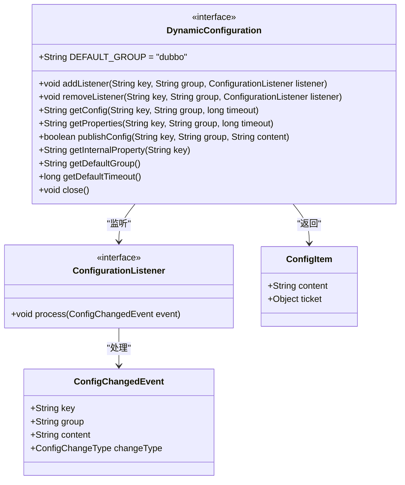
```mermaid
classDiagram
class DynamicConfiguration {
<<interface>>
+String DEFAULT_GROUP = "dubbo"
+void addListener(String key, String group, ConfigurationListener listener)
+void removeListener(String key, String group, ConfigurationListener listener)
+String getConfig(String key, String group, long timeout)
+String getProperties(String key, String group, long timeout)
+boolean publishConfig(String key, String group, String content)
+String getInternalProperty(String key)
+String getDefaultGroup()
+long getDefaultTimeout()
+void close()
}
class ConfigurationListener {
<<interface>>
+void process(ConfigChangedEvent event)
}
class ConfigChangedEvent {
+String key
+String group
+String content
+ConfigChangeType changeType
}
class ConfigItem {
+String content
+Object ticket
}
DynamicConfiguration --> ConfigurationListener : "监听"
ConfigurationListener --> ConfigChangedEvent : "处理"
DynamicConfiguration --> ConfigItem : "返回"
```

**图表来源**
- [DynamicConfiguration.java](file://dubbo-common\src\main\java\org\apache\dubbo\common\config\configcenter\DynamicConfiguration.java#L36-L225)
- [ConfigurationListener.java](file://dubbo-common\src\main\java\org\apache\dubbo\common\config\configcenter\ConfigurationListener.java#L24-L33)
- [ConfigChangedEvent.java](file://dubbo-common\src\main\java\org\apache\dubbo\common\config\configcenter\ConfigChangedEvent.java#L27-L94)
- [ConfigItem.java](file://dubbo-common\src\main\java\org\apache\dubbo\common\config\configcenter\ConfigItem.java#L22-L55)

**接口来源**
- [DynamicConfiguration.java](file://dubbo-common\src\main\java\org\apache\dubbo\common\config\configcenter\DynamicConfiguration.java#L36-L225)

### AbstractDynamicConfiguration抽象类

`AbstractDynamicConfiguration`为`DynamicConfiguration`接口提供了基础实现，封装了通用的功能，如线程池管理和超时处理。该抽象类通过模板方法模式，将具体的配置操作留给子类实现。

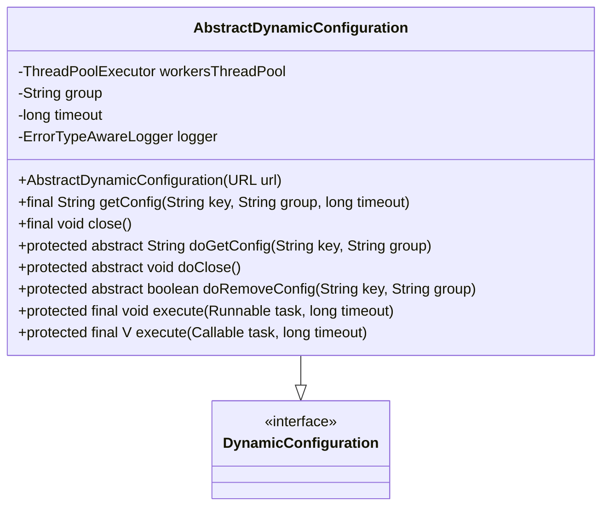
```mermaid
classDiagram
class AbstractDynamicConfiguration {
-ThreadPoolExecutor workersThreadPool
-String group
-long timeout
-ErrorTypeAwareLogger logger
+AbstractDynamicConfiguration(URL url)
+final String getConfig(String key, String group, long timeout)
+final void close()
+protected abstract String doGetConfig(String key, String group)
+protected abstract void doClose()
+protected abstract boolean doRemoveConfig(String key, String group)
+protected final void execute(Runnable task, long timeout)
+protected final <V> V execute(Callable<V> task, long timeout)
}
class DynamicConfiguration {
<<interface>>
}
AbstractDynamicConfiguration --|> DynamicConfiguration
```

**图表来源**
- [AbstractDynamicConfiguration.java](file://dubbo-common\src\main\java\org\apache\dubbo\common\config\configcenter\AbstractDynamicConfiguration.java#L40-L312)

**接口来源**
- [AbstractDynamicConfiguration.java](file://dubbo-common\src\main\java\org\apache\dubbo\common\config\configcenter\AbstractDynamicConfiguration.java#L40-L312)

## 配置中心实现

### 配置中心工厂模式

Dubbo通过`DynamicConfigurationFactory`接口和SPI机制实现配置中心的可扩展性。不同的配置中心通过实现该接口来创建对应的`DynamicConfiguration`实例。

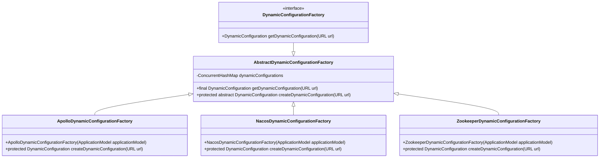
```mermaid
classDiagram
class DynamicConfigurationFactory {
<<interface>>
+DynamicConfiguration getDynamicConfiguration(URL url)
}
class AbstractDynamicConfigurationFactory {
-ConcurrentHashMap<String, DynamicConfiguration> dynamicConfigurations
+final DynamicConfiguration getDynamicConfiguration(URL url)
+protected abstract DynamicConfiguration createDynamicConfiguration(URL url)
}
class ApolloDynamicConfigurationFactory {
+ApolloDynamicConfigurationFactory(ApplicationModel applicationModel)
+protected DynamicConfiguration createDynamicConfiguration(URL url)
}
class NacosDynamicConfigurationFactory {
+NacosDynamicConfigurationFactory(ApplicationModel applicationModel)
+protected DynamicConfiguration createDynamicConfiguration(URL url)
}
class ZookeeperDynamicConfigurationFactory {
+ZookeeperDynamicConfigurationFactory(ApplicationModel applicationModel)
+protected DynamicConfiguration createDynamicConfiguration(URL url)
}
DynamicConfigurationFactory --|> AbstractDynamicConfigurationFactory
AbstractDynamicConfigurationFactory <|-- ApolloDynamicConfigurationFactory
AbstractDynamicConfigurationFactory <|-- NacosDynamicConfigurationFactory
AbstractDynamicConfigurationFactory <|-- ZookeeperDynamicConfigurationFactory
```

**图表来源**
- [DynamicConfigurationFactory.java](file://dubbo-common\src\main\java\org\apache\dubbo\common\config\configcenter\DynamicConfigurationFactory.java#L27-L29)
- [AbstractDynamicConfigurationFactory.java](file://dubbo-common\src\main\java\org\apache\dubbo\common\config\configcenter\AbstractDynamicConfigurationFactory.java#L37-L42)
- [ApolloDynamicConfigurationFactory.java](file://dubbo-configcenter\dubbo-configcenter-apollo\src\main\java\org\apache\dubbo\configcenter\support\apollo\ApolloDynamicConfigurationFactory.java#L24-L35)
- [NacosDynamicConfigurationFactory.java](file://dubbo-configcenter\dubbo-configcenter-nacos\src\main\java\org\apache\dubbo\configcenter\support\nacos\NacosDynamicConfigurationFactory.java#L24-L35)
- [ZookeeperDynamicConfigurationFactory.java](file://dubbo-configcenter\dubbo-configcenter-zookeeper\src\main\java\org\apache\dubbo\configcenter\support\zookeeper\ZookeeperDynamicConfigurationFactory.java#L24-L35)

**接口来源**
- [DynamicConfigurationFactory.java](file://dubbo-common\src\main\java\org\apache\dubbo\common\config\configcenter\DynamicConfigurationFactory.java#L27-L29)

### 具体配置中心实现

#### Apollo配置中心

Apollo配置中心的实现通过`ApolloDynamicConfiguration`类完成，该类与Apollo客户端集成，实现了配置的读取、监听和发布功能。

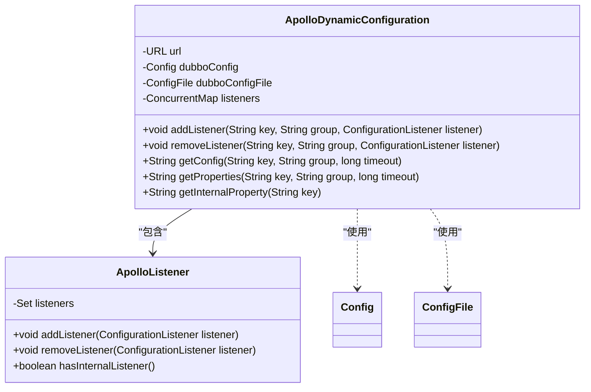
```mermaid
classDiagram
class ApolloDynamicConfiguration {
-URL url
-Config dubboConfig
-ConfigFile dubboConfigFile
-ConcurrentMap<String, ApolloListener> listeners
+void addListener(String key, String group, ConfigurationListener listener)
+void removeListener(String key, String group, ConfigurationListener listener)
+String getConfig(String key, String group, long timeout)
+String getProperties(String key, String group, long timeout)
+String getInternalProperty(String key)
}
class ApolloListener {
-Set<ConfigurationListener> listeners
+void addListener(ConfigurationListener listener)
+void removeListener(ConfigurationListener listener)
+boolean hasInternalListener()
}
ApolloDynamicConfiguration --> ApolloListener : "包含"
ApolloDynamicConfiguration ..> Config : "使用"
ApolloDynamicConfiguration ..> ConfigFile : "使用"
```

**图表来源**
- [ApolloDynamicConfiguration.java](file://dubbo-configcenter\dubbo-configcenter-apollo\src\main\java\org\apache\dubbo\configcenter\support\apollo\ApolloDynamicConfiguration.java#L76-L302)

**接口来源**
- [ApolloDynamicConfiguration.java](file://dubbo-configcenter\dubbo-configcenter-apollo\src\main\java\org\apache\dubbo\configcenter\support\apollo\ApolloDynamicConfiguration.java#L76-L302)

#### Nacos配置中心

Nacos配置中心的实现通过`NacosDynamicConfiguration`类完成，该类与Nacos客户端集成，提供了配置管理功能。

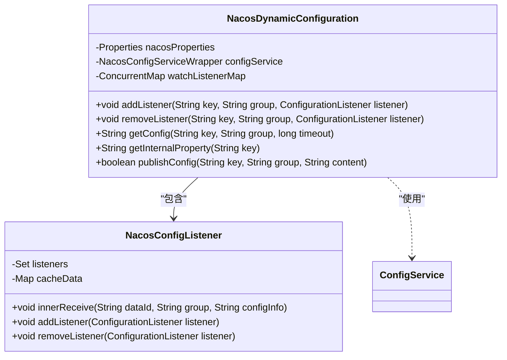
```mermaid
classDiagram
class NacosDynamicConfiguration {
-Properties nacosProperties
-NacosConfigServiceWrapper configService
-ConcurrentMap<String, NacosConfigListener> watchListenerMap
+void addListener(String key, String group, ConfigurationListener listener)
+void removeListener(String key, String group, ConfigurationListener listener)
+String getConfig(String key, String group, long timeout)
+String getInternalProperty(String key)
+boolean publishConfig(String key, String group, String content)
}
class NacosConfigListener {
-Set<ConfigurationListener> listeners
-Map<String, String> cacheData
+void innerReceive(String dataId, String group, String configInfo)
+void addListener(ConfigurationListener listener)
+void removeListener(ConfigurationListener listener)
}
NacosDynamicConfiguration --> NacosConfigListener : "包含"
NacosDynamicConfiguration ..> ConfigService : "使用"
```

**图表来源**
- [NacosDynamicConfiguration.java](file://dubbo-configcenter\dubbo-configcenter-nacos\src\main\java\org\apache\dubbo\configcenter\support\nacos\NacosDynamicConfiguration.java#L63-L397)

**接口来源**
- [NacosDynamicConfiguration.java](file://dubbo-configcenter\dubbo-configcenter-nacos\src\main\java\org\apache\dubbo\configcenter\support\nacos\NacosDynamicConfiguration.java#L63-L397)

#### Zookeeper配置中心

Zookeeper配置中心的实现通过`ZookeeperDynamicConfiguration`类完成，该类基于Zookeeper的树形结构组织配置。

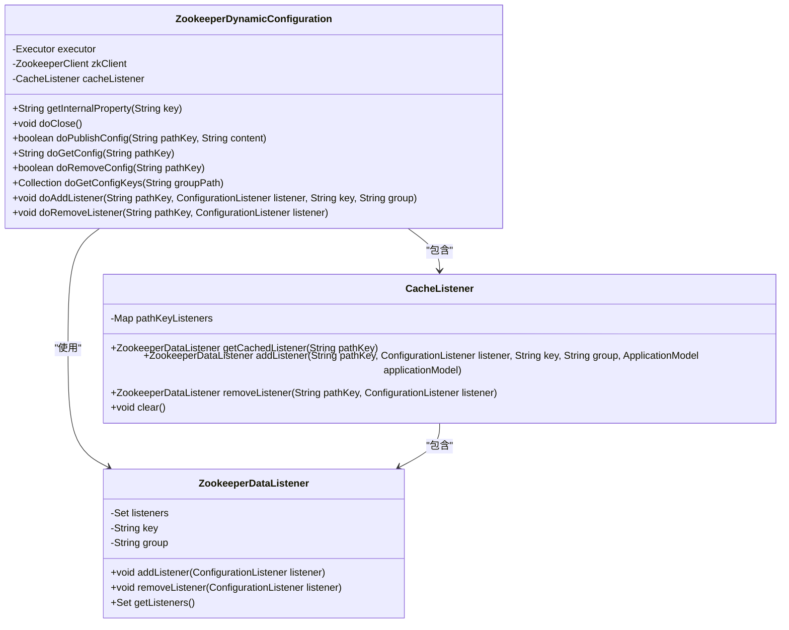
```mermaid
classDiagram
class ZookeeperDynamicConfiguration {
-Executor executor
-ZookeeperClient zkClient
-CacheListener cacheListener
+String getInternalProperty(String key)
+void doClose()
+boolean doPublishConfig(String pathKey, String content)
+String doGetConfig(String pathKey)
+boolean doRemoveConfig(String pathKey)
+Collection<String> doGetConfigKeys(String groupPath)
+void doAddListener(String pathKey, ConfigurationListener listener, String key, String group)
+void doRemoveListener(String pathKey, ConfigurationListener listener)
}
class CacheListener {
-Map<String, ZookeeperDataListener> pathKeyListeners
+ZookeeperDataListener getCachedListener(String pathKey)
+ZookeeperDataListener addListener(String pathKey, ConfigurationListener listener, String key, String group, ApplicationModel applicationModel)
+ZookeeperDataListener removeListener(String pathKey, ConfigurationListener listener)
+void clear()
}
class ZookeeperDataListener {
-Set<ConfigurationListener> listeners
-String key
-String group
+void addListener(ConfigurationListener listener)
+void removeListener(ConfigurationListener listener)
+Set<ConfigurationListener> getListeners()
}
ZookeeperDynamicConfiguration --> CacheListener : "包含"
ZookeeperDynamicConfiguration --> ZookeeperDataListener : "使用"
CacheListener --> ZookeeperDataListener : "包含"
```

**图表来源**
- [ZookeeperDynamicConfiguration.java](file://dubbo-configcenter\dubbo-configcenter-zookeeper\src\main\java\org\apache\dubbo\configcenter\support\zookeeper\ZookeeperDynamicConfiguration.java#L42-L177)
- [CacheListener.java](file://dubbo-configcenter\dubbo-configcenter-zookeeper\src\main\java\org\apache\dubbo\configcenter\support\zookeeper\CacheListener.java)
- [ZookeeperDataListener.java](file://dubbo-configcenter\dubbo-configcenter-zookeeper\src\main\java\org\apache\dubbo\configcenter\support\zookeeper\ZookeeperDataListener.java)

**接口来源**
- [ZookeeperDynamicConfiguration.java](file://dubbo-configcenter\dubbo-configcenter-zookeeper\src\main\java\org\apache\dubbo\configcenter\support\zookeeper\ZookeeperDynamicConfiguration.java#L42-L177)

## 配置监听机制

### 监听器注册与管理

Dubbo的配置监听机制通过`ConfigurationListener`接口实现，当配置发生变化时，系统会通知所有注册的监听器。

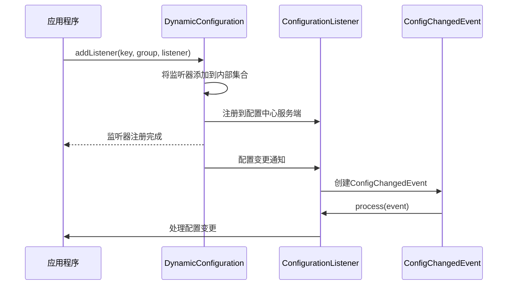
```mermaid
sequenceDiagram
participant 应用 as 应用程序
participant 配置中心 as DynamicConfiguration
participant 监听器 as ConfigurationListener
participant 事件 as ConfigChangedEvent
应用->>配置中心 : addListener(key, group, listener)
配置中心->>配置中心 : 将监听器添加到内部集合
配置中心->>监听器 : 注册到配置中心服务端
配置中心-->>应用 : 监听器注册完成
配置中心->>监听器 : 配置变更通知
监听器->>事件 : 创建ConfigChangedEvent
事件->>监听器 : process(event)
监听器->>应用 : 处理配置变更
```

**图表来源**
- [DynamicConfiguration.java](file://dubbo-common\src\main\java\org\apache\dubbo\common\config\configcenter\DynamicConfiguration.java#L70-L78)
- [ConfigurationListener.java](file://dubbo-common\src\main\java\org\apache\dubbo\common\config\configcenter\ConfigurationListener.java#L32-L33)
- [ConfigChangedEvent.java](file://dubbo-common\src\main\java\org\apache\dubbo\common\config\configcenter\ConfigChangedEvent.java#L27-L94)

**接口来源**
- [DynamicConfiguration.java](file://dubbo-common\src\main\java\org\apache\dubbo\common\config\configcenter\DynamicConfiguration.java#L70-L78)

### 配置变更事件处理

配置变更事件通过`ConfigChangedEvent`类表示，包含变更的配置键、组、内容和变更类型。

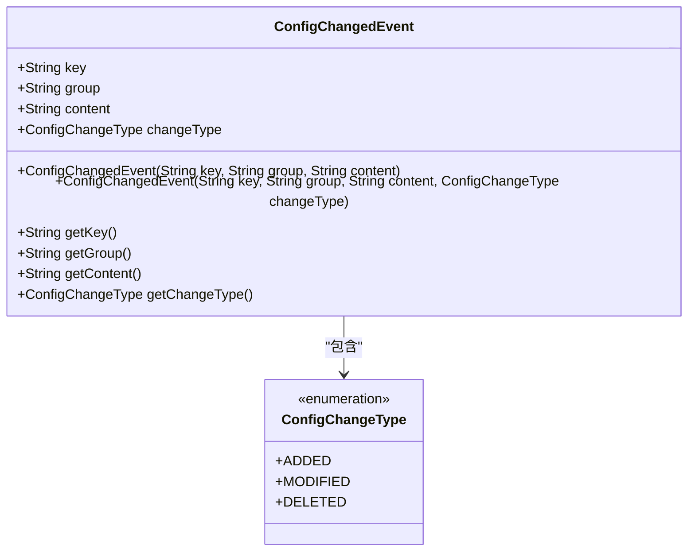
```mermaid
classDiagram
class ConfigChangeType {
<<enumeration>>
+ADDED
+MODIFIED
+DELETED
}
class ConfigChangedEvent {
+String key
+String group
+String content
+ConfigChangeType changeType
+ConfigChangedEvent(String key, String group, String content)
+ConfigChangedEvent(String key, String group, String content, ConfigChangeType changeType)
+String getKey()
+String getGroup()
+String getContent()
+ConfigChangeType getChangeType()
}
ConfigChangedEvent --> ConfigChangeType : "包含"
```

**图表来源**
- [ConfigChangeType.java](file://dubbo-common\src\main\java\org\apache\dubbo\common\config\configcenter\ConfigChangeType.java#L22-L36)
- [ConfigChangedEvent.java](file://dubbo-common\src\main\java\org\apache\dubbo\common\config\configcenter\ConfigChangedEvent.java#L27-L94)

**接口来源**
- [ConfigChangedEvent.java](file://dubbo-common\src\main\java\org\apache\dubbo\common\config\configcenter\ConfigChangedEvent.java#L27-L94)

## 配置组织与隔离

### 配置分组与命名空间

Dubbo通过group和namespace概念实现配置的组织与隔离，确保不同应用和环境的配置互不干扰。

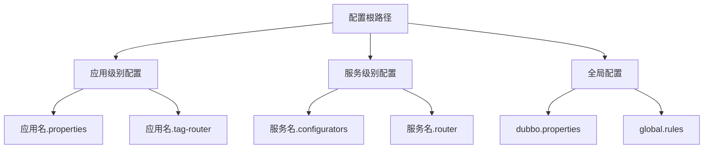
```mermaid
flowchart TD
A[配置根路径] --> B[应用级别配置]
A --> C[服务级别配置]
A --> D[全局配置]
B --> B1[应用名.properties]
B --> B2[应用名.tag-router]
C --> C1[服务名.configurators]
C --> C2[服务名.router]
D --> D1[dubbo.properties]
D --> D2[global.rules]
```

**图表来源**
- [TreePathDynamicConfiguration.java](file://dubbo-common\src\main\java\org\apache\dubbo\common\config\configcenter\TreePathDynamicConfiguration.java#L40-L102)
- [ZookeeperDynamicConfiguration.java](file://dubbo-configcenter\dubbo-configcenter-zookeeper\src\main\java\org\apache\dubbo\configcenter\support\zookeeper\ZookeeperDynamicConfiguration.java#L42-L177)

**接口来源**
- [TreePathDynamicConfiguration.java](file://dubbo-common\src\main\java\org\apache\dubbo\common\config\configcenter\TreePathDynamicConfiguration.java#L40-L102)

### 树形路径配置

`TreePathDynamicConfiguration`抽象类为基于树形结构的配置中心提供了统一的实现，通过路径构建实现配置的层次化组织。

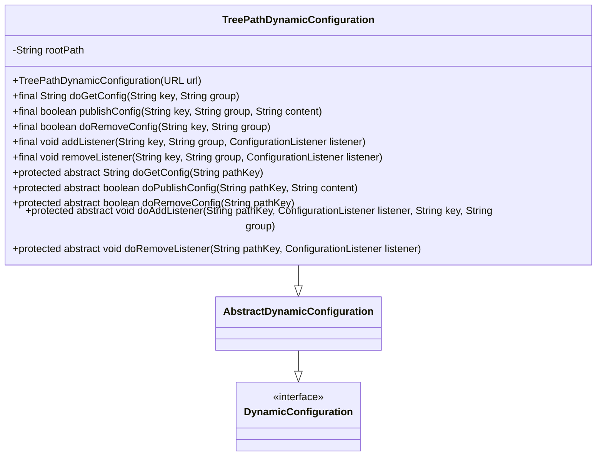
```mermaid
classDiagram
class TreePathDynamicConfiguration {
-String rootPath
+TreePathDynamicConfiguration(URL url)
+final String doGetConfig(String key, String group)
+final boolean publishConfig(String key, String group, String content)
+final boolean doRemoveConfig(String key, String group)
+final void addListener(String key, String group, ConfigurationListener listener)
+final void removeListener(String key, String group, ConfigurationListener listener)
+protected abstract String doGetConfig(String pathKey)
+protected abstract boolean doPublishConfig(String pathKey, String content)
+protected abstract boolean doRemoveConfig(String pathKey)
+protected abstract void doAddListener(String pathKey, ConfigurationListener listener, String key, String group)
+protected abstract void doRemoveListener(String pathKey, ConfigurationListener listener)
}
class DynamicConfiguration {
<<interface>>
}
class AbstractDynamicConfiguration {
}
TreePathDynamicConfiguration --|> AbstractDynamicConfiguration
AbstractDynamicConfiguration --|> DynamicConfiguration
```

**图表来源**
- [TreePathDynamicConfiguration.java](file://dubbo-common\src\main\java\org\apache\dubbo\common\config\configcenter\TreePathDynamicConfiguration.java#L40-L102)

**接口来源**
- [TreePathDynamicConfiguration.java](file://dubbo-common\src\main\java\org\apache\dubbo\common\config\configcenter\TreePathDynamicConfiguration.java#L40-L102)

## 配置读取与发布

### 配置读取流程

配置读取通过`getConfig`方法实现，支持超时控制和默认值处理。

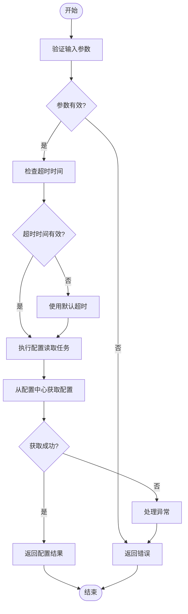
```mermaid
flowchart TD
Start([开始]) --> ValidateInput["验证输入参数"]
ValidateInput --> InputValid{"参数有效?"}
InputValid --> |否| ReturnError["返回错误"]
InputValid --> |是| CheckTimeout["检查超时时间"]
CheckTimeout --> TimeoutValid{"超时时间有效?"}
TimeoutValid --> |是| ExecuteTask["执行配置读取任务"]
TimeoutValid --> |否| UseDefault["使用默认超时"]
UseDefault --> ExecuteTask
ExecuteTask --> GetConfig["从配置中心获取配置"]
GetConfig --> ConfigResult{"获取成功?"}
ConfigResult --> |是| ReturnResult["返回配置结果"]
ConfigResult --> |否| HandleError["处理异常"]
HandleError --> ReturnError
ReturnResult --> End([结束])
ReturnError --> End
```

**图表来源**
- [AbstractDynamicConfiguration.java](file://dubbo-common\src\main\java\org\apache\dubbo\common\config\configcenter\AbstractDynamicConfiguration.java#L114-L116)
- [DynamicConfiguration.java](file://dubbo-common\src\main\java\org\apache\dubbo\common\config\configcenter\DynamicConfiguration.java#L115-L116)

**接口来源**
- [AbstractDynamicConfiguration.java](file://dubbo-common\src\main\java\org\apache\dubbo\common\config\configcenter\AbstractDynamicConfiguration.java#L114-L116)

### 配置发布流程

配置发布通过`publishConfig`方法实现，支持CAS（Compare-And-Swap）操作确保配置更新的原子性。

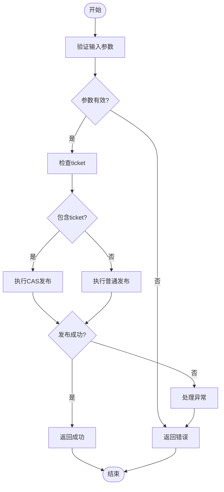
```mermaid
flowchart TD
Start([开始]) --> ValidateInput["验证输入参数"]
ValidateInput --> InputValid{"参数有效?"}
InputValid --> |否| ReturnError["返回错误"]
InputValid --> |是| CheckTicket["检查ticket"]
CheckTicket --> HasTicket{"包含ticket?"}
HasTicket --> |是| PublishCas["执行CAS发布"]
HasTicket --> |否| PublishNormal["执行普通发布"]
PublishCas --> Result{"发布成功?"}
PublishNormal --> Result
Result --> |是| ReturnSuccess["返回成功"]
Result --> |否| HandleError["处理异常"]
HandleError --> ReturnError
ReturnSuccess --> End([结束])
ReturnError --> End
```

**图表来源**
- [DynamicConfiguration.java](file://dubbo-common\src\main\java\org\apache\dubbo\common\config\configcenter\DynamicConfiguration.java#L157-L158)
- [NacosDynamicConfiguration.java](file://dubbo-configcenter\dubbo-configcenter-nacos\src\main\java\org\apache\dubbo\configcenter\support\nacos\NacosDynamicConfiguration.java#L297-L308)
- [ZookeeperDynamicConfiguration.java](file://dubbo-configcenter\dubbo-configcenter-zookeeper\src\main\java\org\apache\dubbo\configcenter\support\zookeeper\ZookeeperDynamicConfiguration.java#L122-L133)

**接口来源**
- [DynamicConfiguration.java](file://dubbo-common\src\main\java\org\apache\dubbo\common\config\configcenter\DynamicConfiguration.java#L157-L158)

## 复合配置管理

### CompositeDynamicConfiguration

`CompositeDynamicConfiguration`类允许同时管理多个配置中心，提供统一的配置访问接口。

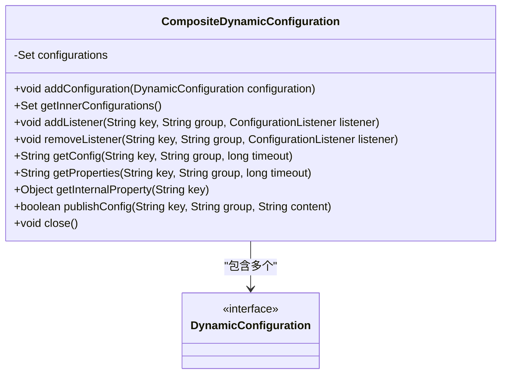
```mermaid
classDiagram
class CompositeDynamicConfiguration {
-Set<DynamicConfiguration> configurations
+void addConfiguration(DynamicConfiguration configuration)
+Set<DynamicConfiguration> getInnerConfigurations()
+void addListener(String key, String group, ConfigurationListener listener)
+void removeListener(String key, String group, ConfigurationListener listener)
+String getConfig(String key, String group, long timeout)
+String getProperties(String key, String group, long timeout)
+Object getInternalProperty(String key)
+boolean publishConfig(String key, String group, String content)
+void close()
}
class DynamicConfiguration {
<<interface>>
}
CompositeDynamicConfiguration --> DynamicConfiguration : "包含多个"
```

**图表来源**
- [CompositeDynamicConfiguration.java](file://dubbo-common\src\main\java\org\apache\dubbo\common\config\configcenter\wrapper\CompositeDynamicConfiguration.java#L41-L122)

**接口来源**
- [CompositeDynamicConfiguration.java](file://dubbo-common\src\main\java\org\apache\dubbo\common\config\configcenter\wrapper\CompositeDynamicConfiguration.java#L41-L122)

### 复合配置读取策略

复合配置管理采用优先级策略，当从多个配置中心读取配置时，返回第一个非空的结果。

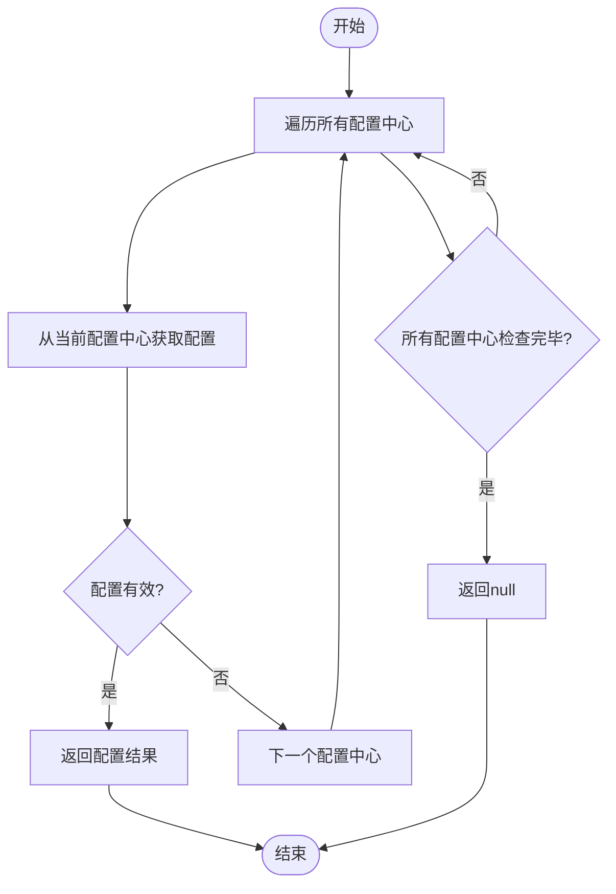
```mermaid
flowchart TD
Start([开始]) --> IterateConfigs["遍历所有配置中心"]
IterateConfigs --> GetConfig["从当前配置中心获取配置"]
GetConfig --> ConfigValid{"配置有效?"}
ConfigValid --> |是| ReturnResult["返回配置结果"]
ConfigValid --> |否| NextConfig["下一个配置中心"]
NextConfig --> IterateConfigs
IterateConfigs --> AllChecked{"所有配置中心检查完毕?"}
AllChecked --> |是| ReturnNull["返回null"]
AllChecked --> |否| IterateConfigs
ReturnResult --> End([结束])
ReturnNull --> End
```

**图表来源**
- [CompositeDynamicConfiguration.java](file://dubbo-common\src\main\java\org\apache\dubbo\common\config\configcenter\wrapper\CompositeDynamicConfiguration.java#L113-L121)

**接口来源**
- [CompositeDynamicConfiguration.java](file://dubbo-common\src\main\java\org\apache\dubbo\common\config\configcenter\wrapper\CompositeDynamicConfiguration.java#L113-L121)

## 容错与性能优化

### 容错机制

Dubbo的动态配置机制内置了多种容错策略，确保在配置中心不可用时系统仍能正常运行。

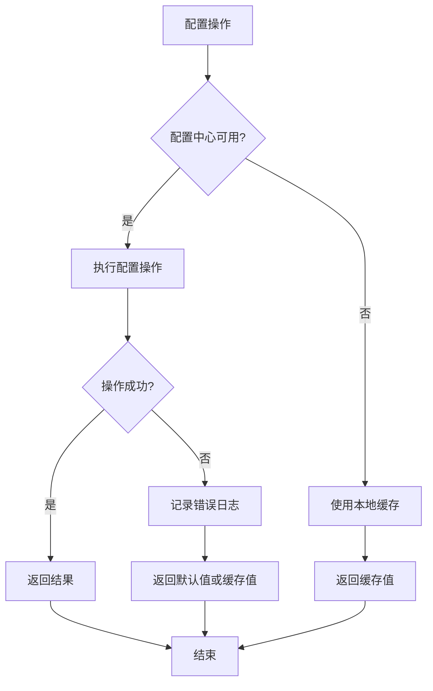
```mermaid
flowchart TD
A[配置操作] --> B{配置中心可用?}
B --> |是| C[执行配置操作]
B --> |否| D[使用本地缓存]
C --> E{操作成功?}
E --> |是| F[返回结果]
E --> |否| G[记录错误日志]
G --> H[返回默认值或缓存值]
D --> I[返回缓存值]
F --> J[结束]
H --> J
I --> J
```

**图表来源**
- [AbstractDynamicConfiguration.java](file://dubbo-common\src\main\java\org\apache\dubbo\common\config\configcenter\AbstractDynamicConfiguration.java#L206-L221)
- [NacosDynamicConfiguration.java](file://dubbo-configcenter\dubbo-configcenter-nacos\src\main\java\org\apache\dubbo\configcenter\support\nacos\NacosDynamicConfiguration.java#L254-L264)

**接口来源**
- [AbstractDynamicConfiguration.java](file://dubbo-common\src\main\java\org\apache\dubbo\common\config\configcenter\AbstractDynamicConfiguration.java#L206-L221)

### 性能优化

通过线程池管理和本地缓存机制，Dubbo优化了配置操作的性能。

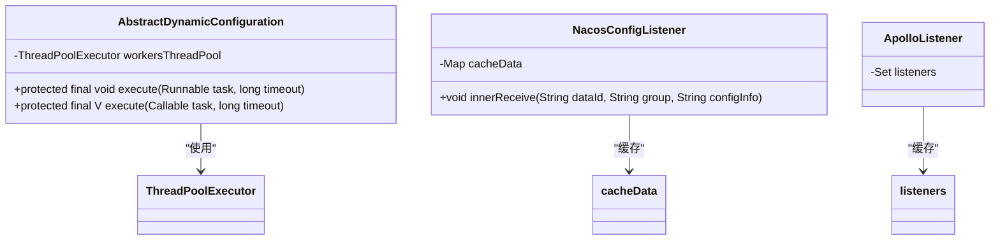
```mermaid
classDiagram
class AbstractDynamicConfiguration {
-ThreadPoolExecutor workersThreadPool
+protected final void execute(Runnable task, long timeout)
+protected final <V> V execute(Callable<V> task, long timeout)
}
class NacosConfigListener {
-Map<String, String> cacheData
+void innerReceive(String dataId, String group, String configInfo)
}
class ApolloListener {
-Set<ConfigurationListener> listeners
}
AbstractDynamicConfiguration --> ThreadPoolExecutor : "使用"
NacosConfigListener --> cacheData : "缓存"
ApolloListener --> listeners : "缓存"
```

**图表来源**
- [AbstractDynamicConfiguration.java](file://dubbo-common\src\main\java\org\apache\dubbo\common\config\configcenter\AbstractDynamicConfiguration.java#L85-L247)
- [NacosDynamicConfiguration.java](file://dubbo-configcenter\dubbo-configcenter-nacos\src\main\java\org\apache\dubbo\configcenter\support\nacos\NacosDynamicConfiguration.java#L339-L362)
- [ApolloDynamicConfiguration.java](file://dubbo-configcenter\dubbo-configcenter-apollo\src\main\java\org\apache\dubbo\configcenter\support\apollo\ApolloDynamicConfiguration.java#L85-L302)

**接口来源**
- [AbstractDynamicConfiguration.java](file://dubbo-common\src\main\java\org\apache\dubbo\common\config\configcenter\AbstractDynamicConfiguration.java#L85-L247)

## 实际应用示例

### 配置监听示例

以下示例展示了如何注册配置监听器并处理配置变更事件。

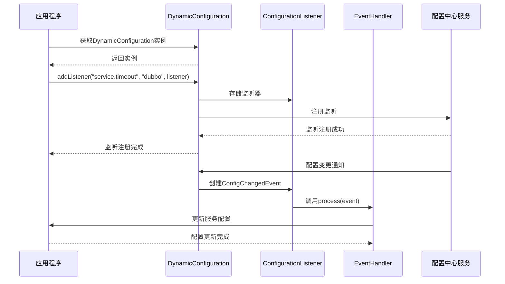
```mermaid
sequenceDiagram
participant 应用 as 应用程序
participant 配置中心 as DynamicConfiguration
participant 监听器 as ConfigurationListener
participant 事件处理器 as EventHandler
应用->>配置中心 : 获取DynamicConfiguration实例
配置中心-->>应用 : 返回实例
应用->>配置中心 : addListener("service.timeout", "dubbo", listener)
配置中心->>监听器 : 存储监听器
配置中心->>配置中心服务 : 注册监听
配置中心服务-->>配置中心 : 监听注册成功
配置中心-->>应用 : 监听注册完成
配置中心服务->>配置中心 : 配置变更通知
配置中心->>监听器 : 创建ConfigChangedEvent
监听器->>事件处理器 : 调用process(event)
事件处理器->>应用 : 更新服务配置
应用-->>事件处理器 : 配置更新完成
```

**图表来源**
- [DynamicConfiguration.java](file://dubbo-common\src\main\java\org\apache\dubbo\common\config\configcenter\DynamicConfiguration.java#L70-L78)
- [ConfigurationListener.java](file://dubbo-common\src\main\java\org\apache\dubbo\common\config\configcenter\ConfigurationListener.java#L32-L33)
- [ConfigChangedEvent.java](file://dubbo-common\src\main\java\org\apache\dubbo\common\config\configcenter\ConfigChangedEvent.java#L27-L94)

**接口来源**
- [DynamicConfiguration.java](file://dubbo-common\src\main\java\org\apache\dubbo\common\config\configcenter\DynamicConfiguration.java#L70-L78)

### 治理规则管理

`DefaultGovernanceRuleRepositoryImpl`类展示了如何使用动态配置管理治理规则。

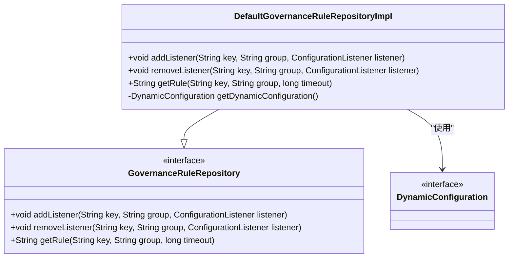
```mermaid
classDiagram
class DefaultGovernanceRuleRepositoryImpl {
+void addListener(String key, String group, ConfigurationListener listener)
+void removeListener(String key, String group, ConfigurationListener listener)
+String getRule(String key, String group, long timeout)
-DynamicConfiguration getDynamicConfiguration()
}
class GovernanceRuleRepository {
<<interface>>
+void addListener(String key, String group, ConfigurationListener listener)
+void removeListener(String key, String group, ConfigurationListener listener)
+String getRule(String key, String group, long timeout)
}
class DynamicConfiguration {
<<interface>>
}
DefaultGovernanceRuleRepositoryImpl --|> GovernanceRuleRepository
DefaultGovernanceRuleRepositoryImpl --> DynamicConfiguration : "使用"
```

**图表来源**
- [DefaultGovernanceRuleRepositoryImpl.java](file://dubbo-cluster\src\main\java\org\apache\dubbo\rpc\cluster\governance\DefaultGovernanceRuleRepositoryImpl.java#L31-L58)
- [GovernanceRuleRepository.java](file://dubbo-cluster\src\main\java\org\apache\dubbo\rpc\cluster\governance\GovernanceRuleRepository.java#L70-L91)

**接口来源**
- [DefaultGovernanceRuleRepositoryImpl.java](file://dubbo-cluster\src\main\java\org\apache\dubbo\rpc\cluster\governance\DefaultGovernanceRuleRepositoryImpl.java#L31-L58)

## 总结

Dubbo的动态配置机制通过精心设计的接口和实现，提供了强大而灵活的配置管理能力。`DynamicConfiguration`接口作为核心，定义了配置管理的基本操作，而具体的配置中心实现则通过SPI机制进行扩展。配置监听机制确保了配置变更的实时通知，树形路径配置和复合配置管理提供了灵活的配置组织方式。通过容错机制和性能优化，系统在高并发场景下仍能保持稳定和高效。开发者可以基于这些机制实现复杂的配置管理需求，如动态路由、流量控制和熔断降级等，从而构建更加健壮和灵活的分布式系统。