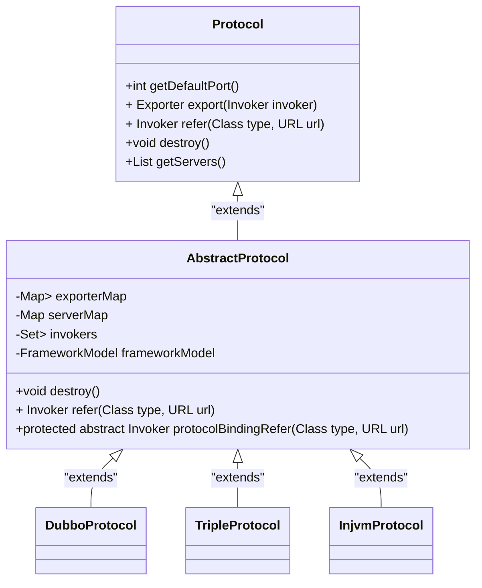
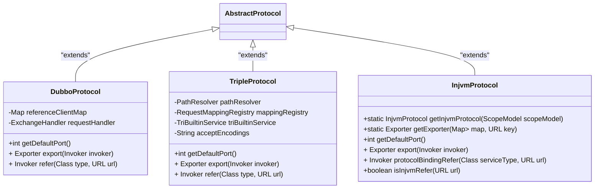
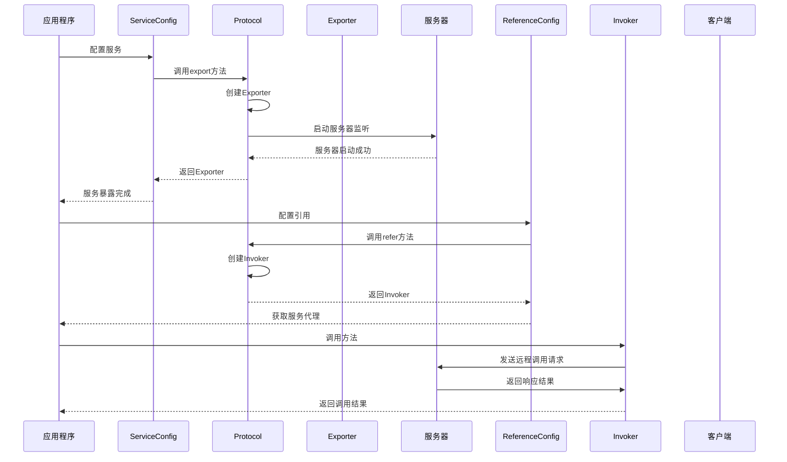
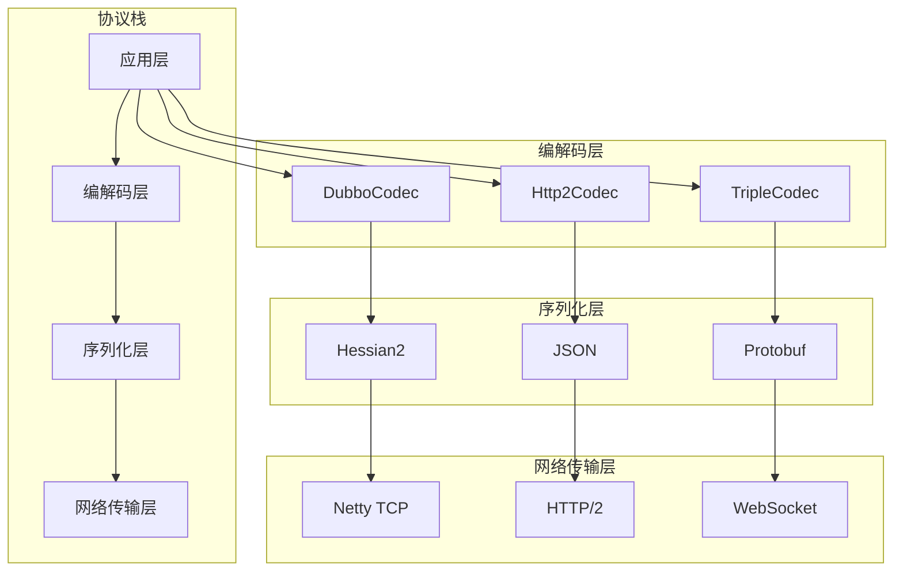

# 多协议支持

<cite>
**本文档引用的文件**   
- [Protocol.java](file://dubbo-rpc\dubbo-rpc-api\src\main\java\org\apache\dubbo\rpc\Protocol.java)
- [AbstractProtocol.java](file://dubbo-rpc\dubbo-rpc-api\src\main\java\org\apache\dubbo\rpc\protocol\AbstractProtocol.java)
- [DubboProtocol.java](file://dubbo-rpc\dubbo-rpc-dubbo\src\main\java\org\apache\dubbo\rpc\protocol\dubbo\DubboProtocol.java)
- [TripleProtocol.java](file://dubbo-rpc\dubbo-rpc-triple\src\main\java\org\apache\dubbo\rpc\protocol\tri\TripleProtocol.java)
- [GrpcProtocol.java](file://dubbo-rpc\dubbo-rpc-triple\src\main\java\org\apache\dubbo\rpc\protocol\tri\GrpcProtocol.java)
- [RestProtocol.java](file://dubbo-rpc\dubbo-rpc-triple\src\main\java\org\apache\dubbo\rpc\protocol\tri\RestProtocol.java)
- [InjvmProtocol.java](file://dubbo-rpc\dubbo-rpc-injvm\src\main\java\org\apache\dubbo\rpc\protocol\injvm\InjvmProtocol.java)
- [ProtocolBuilder.java](file://dubbo-config\dubbo-config-api\src\main\java\org\apache\dubbo\config\bootstrap\builders\ProtocolBuilder.java)
- [ConfigManager.java](file://dubbo-common\src\main\java\org\apache\dubbo\config\context\ConfigManager.java)
</cite>

## 目录
1. [引言](#引言)
2. [Protocol接口设计原理](#protocol接口设计原理)
3. [核心协议实现机制](#核心协议实现机制)
4. [协议暴露与引用流程](#协议暴露与引用流程)
5. [协议栈构建与组件组合](#协议栈构建与组件组合)
6. [多协议配置与使用示例](#多协议配置与使用示例)
7. [性能权衡与最佳实践](#性能权衡与最佳实践)

## 引言

Dubbo的多协议支持架构是其核心特性之一，通过Protocol接口实现了不同通信协议的抽象和可插拔设计。该架构允许开发者在同一应用中使用多种协议进行服务暴露和引用，如dubbo、rest、triple等，从而满足不同场景下的性能、兼容性和功能需求。Protocol接口作为SPI（Service Provider Interface）扩展点，通过Dubbo的扩展机制实现了协议的动态加载和选择，使得协议的添加和替换变得简单而灵活。

## Protocol接口设计原理

Protocol接口是Dubbo多协议支持的核心，它定义了服务暴露和引用的基本契约。该接口通过SPI机制进行扩展，允许不同的协议实现类提供具体的通信逻辑。接口设计遵循了单一职责原则，将服务暴露（export）和引用（refer）操作分离，同时通过泛型支持不同类型的服务。



**代码来源**
- [Protocol.java](file://dubbo-rpc\dubbo-rpc-api\src\main\java\org\apache\dubbo\rpc\Protocol.java#L27-L118)
- [AbstractProtocol.java](file://dubbo-rpc\dubbo-rpc-api\src\main\java\org\apache\dubbo\rpc\protocol\AbstractProtocol.java#L56-L194)

## 核心协议实现机制

Dubbo提供了多种协议实现，每种协议都有其特定的应用场景和优势。核心协议实现包括DubboProtocol、TripleProtocol、InjvmProtocol等，它们都继承自AbstractProtocol，实现了Protocol接口的具体逻辑。

### DubboProtocol

DubboProtocol是Dubbo默认的高性能RPC协议，基于Netty实现，采用自定义的二进制协议进行通信。它支持长连接、多路复用和连接共享，能够有效减少网络开销。协议通过DubboCodec进行编解码，支持多种序列化方式。

### TripleProtocol

TripleProtocol是基于gRPC的协议实现，支持HTTP/2和gRPC语义。它继承自TripleProtocol基类，提供了对流式调用、双向流等高级特性的支持。该协议特别适合需要跨语言互操作的场景。

### InjvmProtocol

InjvmProtocol用于JVM内部调用，当服务消费者和服务提供者位于同一JVM时，可以直接进行内存调用，避免了网络开销。这种协议在微服务架构中用于服务间的本地调用优化。



**代码来源**
- [DubboProtocol.java](file://dubbo-rpc\dubbo-rpc-dubbo\src\main\java\org\apache\dubbo\rpc\protocol\dubbo\DubboProtocol.java#L95-L651)
- [TripleProtocol.java](file://dubbo-rpc\dubbo-rpc-triple\src\main\java\org\apache\dubbo\rpc\protocol\tri\TripleProtocol.java#L59-L224)
- [InjvmProtocol.java](file://dubbo-rpc\dubbo-rpc-injvm\src\main\java\org\apache\dubbo\rpc\protocol\injvm\InjvmProtocol.java#L39-L108)

## 协议暴露与引用流程

Dubbo的协议暴露和引用流程是其多协议支持的关键。通过URL中的协议参数，系统能够选择相应的Protocol实现进行服务暴露和引用。

### 协议暴露流程

服务暴露流程从ServiceConfig开始，经过一系列的配置和验证后，最终调用Protocol的export方法。该方法接收一个Invoker对象，将其包装成Exporter并注册到exporterMap中。同时，协议会启动相应的服务器监听指定端口。

### 协议引用流程

服务引用流程从ReferenceConfig开始，通过Protocol的refer方法获取远程服务的本地代理。该方法返回一个Invoker对象，通过动态代理机制转换为业务接口的实现。调用时，Invoker会将请求发送到远程服务。



**代码来源**
- [DubboProtocol.java](file://dubbo-rpc\dubbo-rpc-dubbo\src\main\java\org\apache\dubbo\rpc\protocol\dubbo\DubboProtocol.java#L336-L364)
- [TripleProtocol.java](file://dubbo-rpc\dubbo-rpc-triple\src\main\java\org\apache\dubbo\rpc\protocol\tri\TripleProtocol.java#L102-L150)
- [InjvmProtocol.java](file://dubbo-rpc\dubbo-rpc-injvm\src\main\java\org\apache\dubbo\rpc\protocol\injvm\InjvmProtocol.java#L74-L81)

## 协议栈构建与组件组合

Dubbo的协议栈构建采用了分层设计，将编解码、序列化、网络传输等组件进行解耦和组合。这种设计使得各个组件可以独立演进和替换，提高了系统的灵活性和可维护性。

### 编解码层

编解码层负责将RPC请求和响应转换为网络传输的字节流。Dubbo提供了多种编解码器，如DubboCodec、Http2Codec等，支持不同的协议格式。编解码器通过SPI机制进行扩展，可以根据需要选择合适的实现。

### 序列化层

序列化层负责将Java对象转换为字节流，支持多种序列化方式，如Hessian2、JSON、Protobuf等。序列化方式可以通过配置进行选择，满足不同场景下的性能和兼容性需求。

### 网络传输层

网络传输层基于Netty实现，提供了高性能的网络通信能力。它支持TCP、HTTP/2等多种传输协议，能够适应不同的网络环境。传输层还提供了连接管理、心跳检测等机制，确保通信的可靠性和稳定性。



**代码来源**
- [DubboProtocol.java](file://dubbo-rpc\dubbo-rpc-dubbo\src\main\java\org\apache\dubbo\rpc\protocol\dubbo\DubboProtocol.java#L399-L403)
- [TripleHttp2Protocol.java](file://dubbo-rpc\dubbo-rpc-triple\src\main\java\org\apache\dubbo\rpc\protocol\tri\TripleHttp2Protocol.java#L144-L248)
- [TripleProtocol.java](file://dubbo-rpc\dubbo-rpc-triple\src\main\java\org\apache\dubbo\rpc\protocol\tri\TripleProtocol.java#L184-L190)

## 多协议配置与使用示例

Dubbo提供了灵活的多协议配置方式，可以通过XML、注解或编程方式进行配置。以下是一些常见的使用示例：

### 配置多个协议

```java
// 创建协议配置
ProtocolConfig dubboProtocol = new ProtocolConfig();
dubboProtocol.setName("dubbo");
dubboProtocol.setPort(20880);

ProtocolConfig restProtocol = new ProtocolConfig();
restProtocol.setName("rest");
restProtocol.setPort(8080);

// 在服务配置中使用多个协议
ServiceConfig<DemoService> service = new ServiceConfig<>();
service.setProtocols(Arrays.asList(dubboProtocol, restProtocol));
service.setInterface(DemoService.class);
service.setRef(new DemoServiceImpl());
service.export();
```

### 使用不同协议暴露服务

```java
// 使用dubbo协议暴露服务
ServiceConfig<DemoService> dubboService = new ServiceConfig<>();
dubboService.setProtocol(dubboProtocol);
dubboService.setInterface(DemoService.class);
dubboService.setRef(new DemoServiceImpl());
dubboService.export();

// 使用rest协议暴露服务
ServiceConfig<DemoService> restService = new ServiceConfig<>();
restService.setProtocol(restProtocol);
restService.setInterface(DemoService.class);
restService.setRef(new DemoServiceImpl());
restService.export();
```

### 引用不同协议的服务

```java
// 引用dubbo协议的服务
ReferenceConfig<DemoService> dubboReference = new ReferenceConfig<>();
dubboReference.setProtocol("dubbo");
dubboReference.setInterface(DemoService.class);
dubboReference.setUrl("dubbo://127.0.0.1:20880");
DemoService dubboService = dubboReference.get();

// 引用rest协议的服务
ReferenceConfig<DemoService> restReference = new ReferenceConfig<>();
restReference.setProtocol("rest");
restReference.setInterface(DemoService.class);
restReference.setUrl("rest://127.0.0.1:8080");
DemoService restService = restReference.get();
```

**代码来源**
- [ProtocolBuilder.java](file://dubbo-config\dubbo-config-api\src\main\java\org\apache\dubbo\config\bootstrap\builders\ProtocolBuilder.java#L405-L446)
- [ConfigManager.java](file://dubbo-common\src\main\java\org\apache\dubbo\config\context\ConfigManager.java#L266-L301)

## 性能权衡与最佳实践

在使用Dubbo的多协议支持时，需要根据具体场景进行性能权衡和最佳实践选择。

### 性能权衡

- **Dubbo协议**：性能最优，适合内部服务间的高性能调用
- **Triple协议**：支持流式调用和跨语言互操作，适合需要高级特性的场景
- **REST协议**：兼容性好，适合对外提供API服务
- **Injvm协议**：无网络开销，适合JVM内部调用

### 最佳实践

1. **合理选择协议**：根据服务的使用场景和性能要求选择合适的协议
2. **协议组合使用**：可以同时使用多个协议，满足不同客户端的需求
3. **配置优化**：根据实际负载调整协议的连接数、线程池等参数
4. **监控和调优**：通过Dubbo的监控功能，及时发现和解决性能瓶颈

通过合理使用多协议支持，可以充分发挥Dubbo的灵活性和高性能优势，构建稳定可靠的服务架构。

**代码来源**
- [DubboProtocol.java](file://dubbo-rpc\dubbo-rpc-dubbo\src\main\java\org\apache\dubbo\rpc\protocol\dubbo\DubboProtocol.java#L452-L534)
- [TripleProtocol.java](file://dubbo-rpc\dubbo-rpc-triple\src\main\java\org\apache\dubbo\rpc\protocol\tri\TripleProtocol.java#L140-L143)
- [InjvmProtocol.java](file://dubbo-rpc\dubbo-rpc-injvm\src\main\java\org\apache\dubbo\rpc\protocol\injvm\InjvmProtocol.java#L83-L107)