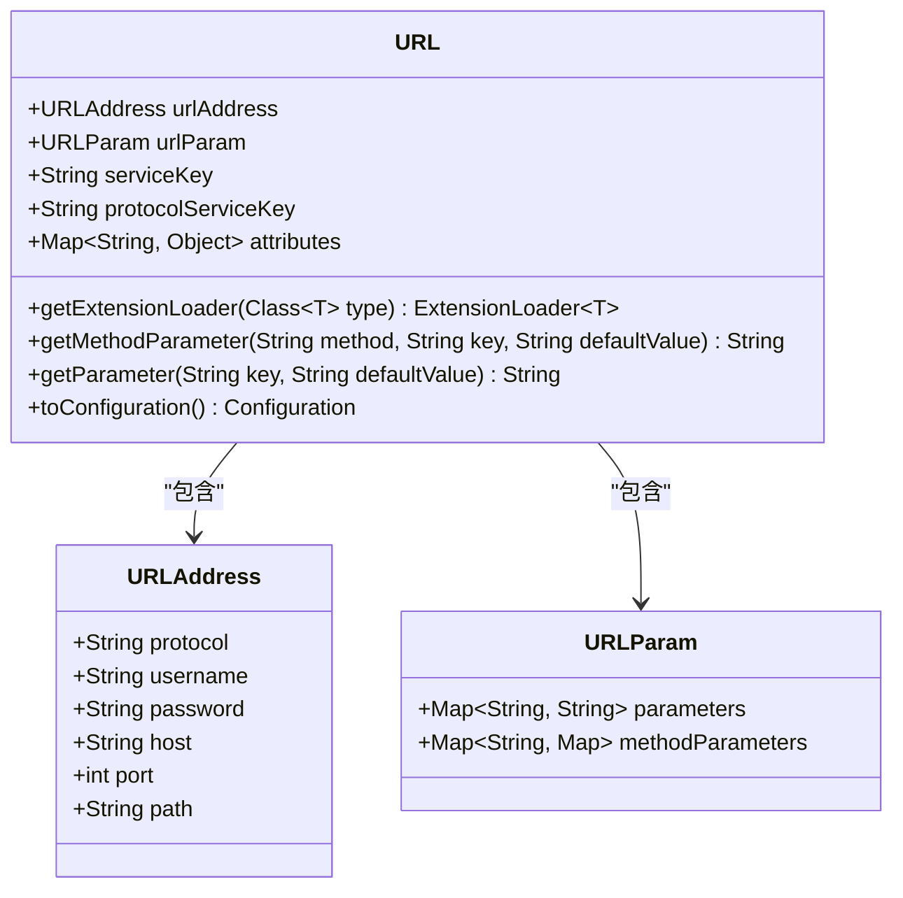
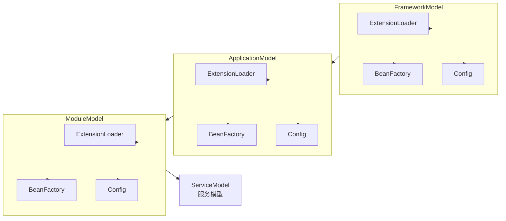
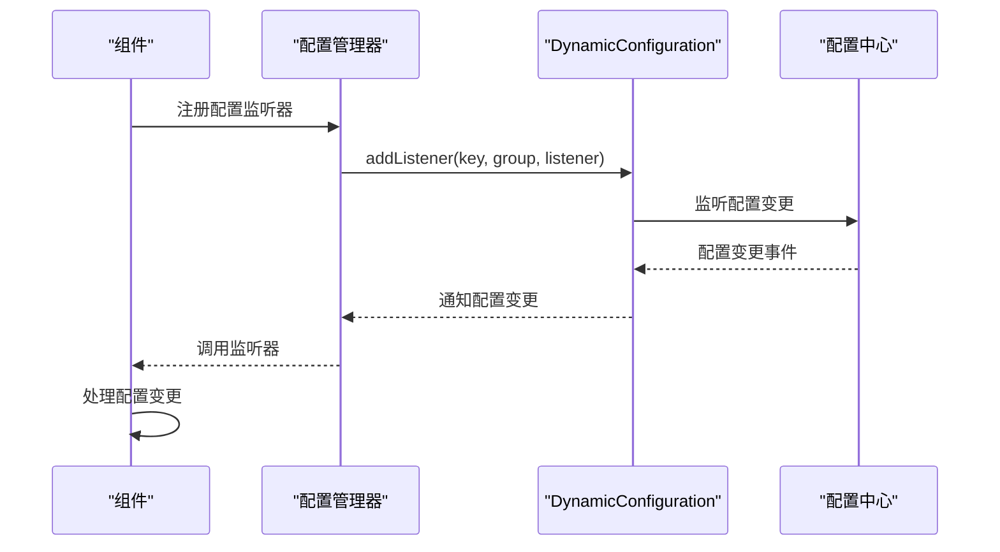

# 核心概念

<cite>
**本文档引用的文件**   
- [ExtensionLoader.java](file://dubbo-common\src\main\java\org\apache\dubbo\common\extension\ExtensionLoader.java)
- [ScopeModel.java](file://dubbo-common\src\main\java\org\apache\dubbo\rpc\model\ScopeModel.java)
- [FrameworkModel.java](file://dubbo-common\src\main\java\org\apache\dubbo\rpc\model\FrameworkModel.java)
- [ApplicationModel.java](file://dubbo-common\src\main\java\org\apache\dubbo\rpc\model\ApplicationModel.java)
- [ModuleModel.java](file://dubbo-common\src\main\java\org\apache\dubbo\rpc\model\ModuleModel.java)
- [URL.java](file://dubbo-common\src\main\java\org\apache\dubbo\common\URL.java)
- [DynamicConfiguration.java](file://dubbo-common\src\main\java\org\apache\dubbo\common\config\configcenter\DynamicConfiguration.java)
- [ScopeModelUtil.java](file://dubbo-common\src\main\java\org\apache\dubbo\rpc\model\ScopeModelUtil.java)
</cite>

## 目录
1. [SPI扩展机制](#spi扩展机制)
2. [URL配置总线](#url配置总线)
3. [作用域模型层次](#作用域模型层次)
4. [动态配置机制](#动态配置机制)
5. [多协议支持](#多协议支持)

## SPI扩展机制

Dubbo框架的核心是其强大的SPI（Service Provider Interface）扩展机制，该机制允许框架在不修改源代码的情况下，通过配置文件动态加载和替换组件实现。`ExtensionLoader`类是SPI机制的核心实现，负责加载、缓存和管理所有的扩展实现。

SPI扩展机制的主要功能包括：
- **扩展加载**：根据接口类型和名称加载对应的实现类
- **依赖注入（IOC）**：自动为扩展实例注入其依赖的其他扩展
- **AOP包装**：通过Wrapper模式自动包装扩展，实现切面功能
- **自适应扩展**：生成自适应实例，根据运行时参数动态选择具体实现
- **扩展激活**：根据条件激活特定的扩展实例

`ExtensionLoader`通过读取`META-INF/dubbo/internal/`、`META-INF/dubbo/`和`META-INF/services/`目录下的配置文件来发现扩展实现。每个扩展接口的配置文件中定义了名称到实现类的映射关系。框架在启动时会加载这些配置，并根据需要实例化相应的扩展。

**Section sources**
- [ExtensionLoader.java](file://dubbo-common\src\main\java\org\apache\dubbo\common\extension\ExtensionLoader.java)

## URL配置总线

在Dubbo框架中，`URL`类扮演着配置总线的角色，作为统一的配置载体贯穿整个调用链路。`URL`对象不仅包含网络地址信息（协议、主机、端口、路径），还通过参数映射（parameters）携带了丰富的配置信息。

`URL`的设计理念是将所有配置信息集中在一个对象中，避免了配置的分散和重复。在服务提供者和服务消费者之间，`URL`作为配置的传递媒介，确保了配置的一致性。`URL`的参数映射支持嵌套结构，可以表示复杂的数据结构。

`URL`类提供了丰富的API来操作和查询配置参数，包括获取基本参数、方法级参数、布尔参数等。通过`URL`，框架可以在运行时动态调整行为，实现灵活的配置管理。

**Diagram sources **
- [URL.java](file://dubbo-common\src\main\java\org\apache\dubbo\common\URL.java)

**Section sources**
- [URL.java](file://dubbo-common\src\main\java\org\apache\dubbo\common\URL.java)

## 作用域模型层次

Dubbo框架采用分层的作用域模型来管理组件的生命周期和依赖关系。这种层次化的模型设计实现了组件的隔离和复用，支持多应用共享框架实例的场景。

作用域模型由三个层次组成：
- **FrameworkModel**：框架模型，代表整个Dubbo框架实例，是模型层次的最顶层
- **ApplicationModel**：应用模型，代表一个使用Dubbo的应用程序，隶属于某个框架模型
- **ModuleModel**：模块模型，代表应用中的一个逻辑模块，隶属于某个应用模型

每个模型都维护自己的扩展加载器（ExtensionLoader）、Bean工厂和配置环境，实现了组件的隔离。同时，子模型可以访问父模型的资源，形成了一个层次化的依赖关系。当父模型销毁时，会级联销毁所有子模型，确保资源的正确释放。

**Diagram sources **
- [FrameworkModel.java](file://dubbo-common\src\main\java\org\apache\dubbo\rpc\model\FrameworkModel.java)
- [ApplicationModel.java](file://dubbo-common\src\main\java\org\apache\dubbo\rpc\model\ApplicationModel.java)
- [ModuleModel.java](file://dubbo-common\src\main\java\org\apache\dubbo\rpc\model\ModuleModel.java)

**Section sources**
- [ScopeModel.java](file://dubbo-common\src\main\java\org\apache\dubbo\rpc\model\ScopeModel.java)
- [FrameworkModel.java](file://dubbo-common\src\main\java\org\apache\dubbo\rpc\model\FrameworkModel.java)
- [ApplicationModel.java](file://dubbo-common\src\main\java\org\apache\dubbo\rpc\model\ApplicationModel.java)
- [ModuleModel.java](file://dubbo-common\src\main\java\org\apache\dubbo\rpc\model\ModuleModel.java)

## 动态配置机制

Dubbo框架提供了灵活的动态配置机制，支持配置的热更新和监听。`DynamicConfiguration`接口是动态配置机制的核心，定义了配置的读取、监听和更新操作。

动态配置机制的实现方式包括：
- **配置中心集成**：支持Nacos、Zookeeper、Apollo等配置中心
- **配置监听**：允许组件注册配置变更监听器，实现配置的实时响应
- **配置优先级**：支持多级配置的合并和覆盖，确保配置的正确性

`DynamicConfiguration`通过`getDynamicConfiguration()`方法从模块环境中获取，实现了配置的隔离。不同应用和模块可以使用不同的配置源，避免了配置的冲突。配置的变更会通过事件机制通知所有监听器，触发相应的处理逻辑。

**Diagram sources **
- [DynamicConfiguration.java](file://dubbo-common\src\main\java\org\apache\dubbo\common\config\configcenter\DynamicConfiguration.java)
- [ScopeModelUtil.java](file://dubbo-common\src\main\java\org\apache\dubbo\rpc\model\ScopeModelUtil.java)

**Section sources**
- [DynamicConfiguration.java](file://dubbo-common\src\main\java\org\apache\dubbo\common\config\configcenter\DynamicConfiguration.java)

## 多协议支持

Dubbo框架通过`Protocol`接口实现了多协议支持的设计理念。`Protocol`接口定义了服务暴露和引用的统一契约，不同的协议实现类（如DubboProtocol、HttpProtocol等）提供了具体的通信协议支持。

多协议支持的关键特性包括：
- **协议抽象**：通过统一的接口屏蔽不同协议的差异
- **协议扩展**：通过SPI机制支持自定义协议的扩展
- **协议选择**：根据服务配置动态选择合适的协议
- **协议共存**：支持同一服务通过多种协议暴露

`Protocol`接口的设计使得框架可以灵活地支持各种通信协议，同时保持核心逻辑的简洁。通过`ExtensionLoader`加载不同的协议实现，框架可以在运行时动态切换协议，满足不同场景的需求。

**Section sources**
- [URL.java](file://dubbo-common\src\main\java\org\apache\dubbo\common\URL.java)
- [ExtensionLoader.java](file://dubbo-common\src\main\java\org\apache\dubbo\common\extension\ExtensionLoader.java)