# dubbo-cluster模块

<cite>
**本文档引用的文件**
- [Cluster.java](file://dubbo-cluster\src\main\java\org\apache\dubbo\rpc\cluster\Cluster.java)
- [LoadBalance.java](file://dubbo-cluster\src\main\java\org\apache\dubbo\rpc\cluster\LoadBalance.java)
- [Directory.java](file://dubbo-cluster\src\main\java\org\apache\dubbo\rpc\cluster\Directory.java)
- [Merger.java](file://dubbo-cluster\src\main\java\org\apache\dubbo\rpc\cluster\Merger.java)
- [AbstractCluster.java](file://dubbo-cluster\src\main\java\org\apache\dubbo\rpc\cluster\support\wrapper\AbstractCluster.java)
- [AbstractClusterInvoker.java](file://dubbo-cluster\src\main\java\org\apache\dubbo\rpc\cluster\support\AbstractClusterInvoker.java)
- [RouterChain.java](file://dubbo-cluster\src\main\java\org\apache\dubbo\rpc\cluster\RouterChain.java)
- [Router.java](file://dubbo-cluster\src\main\java\org\apache\dubbo\rpc\cluster\Router.java)
- [AbstractLoadBalance.java](file://dubbo-cluster\src\main\java\org\apache\dubbo\rpc\cluster\loadbalance\AbstractLoadBalance.java)
- [RandomLoadBalance.java](file://dubbo-cluster\src\main\java\org\apache\dubbo\rpc\cluster\loadbalance\RandomLoadBalance.java)
- [RoundRobinLoadBalance.java](file://dubbo-cluster\src\main\java\org\apache\dubbo\rpc\cluster\loadbalance\RoundRobinLoadBalance.java)
- [ConsistentHashLoadBalance.java](file://dubbo-cluster\src\main\java\org\apache\dubbo\rpc\cluster\loadbalance\ConsistentHashLoadBalance.java)
- [ConditionStateRouter.java](file://dubbo-cluster\src\main\java\org\apache\dubbo\rpc\cluster\router\condition\ConditionStateRouter.java)
</cite>

## 目录
1. [简介](#简介)
2. [核心组件设计](#核心组件设计)
3. [集群容错机制](#集群容错机制)
4. [负载均衡策略](#负载均衡策略)
5. [路由机制](#路由机制)
6. [合并器(Merger)](#合并器merger)
7. [调用流程与示例](#调用流程与示例)
8. [总结](#总结)

## 简介

dubbo-cluster模块是Apache Dubbo框架的核心组件之一，负责处理服务调用的集群容错、负载均衡、路由和合并等关键功能。该模块通过一系列精心设计的接口和实现类，为分布式服务调用提供了高可用性和高性能的保障。

本模块主要包含以下几个核心概念：
- **集群(Cluster)**：将多个服务提供者虚拟化为一个整体，对外提供统一的服务调用接口
- **目录(Directory)**：管理服务提供者的列表，提供服务发现和调用者列表的功能
- **路由(Router)**：根据特定规则过滤服务提供者列表，实现流量控制和灰度发布
- **负载均衡(LoadBalance)**：从可用的服务提供者中选择一个进行调用，实现流量的合理分配
- **合并器(Merger)**：将多个服务提供者的调用结果合并为一个结果返回

这些组件协同工作，构成了Dubbo强大的集群调用能力。

## 核心组件设计

### Cluster接口设计

Cluster接口是集群模块的核心，定义了将多个服务调用者合并为一个虚拟调用者的能力。该接口通过SPI机制实现可扩展性，支持多种集群策略。

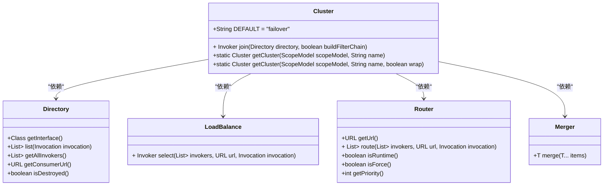

**图源**
- [Cluster.java](file://dubbo-cluster\src\main\java\org\apache\dubbo\rpc\cluster\Cluster.java)
- [Directory.java](file://dubbo-cluster\src\main\java\org\apache\dubbo\rpc\cluster\Directory.java)
- [LoadBalance.java](file://dubbo-cluster\src\main\java\org\apache\dubbo\rpc\cluster\LoadBalance.java)
- [Merger.java](file://dubbo-cluster\src\main\java\org\apache\dubbo\rpc\cluster\Merger.java)
- [Router.java](file://dubbo-cluster\src\main\java\org\apache\dubbo\rpc\cluster\Router.java)

**本节源码**
- [Cluster.java](file://dubbo-cluster\src\main\java\org\apache\dubbo\rpc\cluster\Cluster.java#L27-L80)
- [Directory.java](file://dubbo-cluster\src\main\java\org\apache\dubbo\rpc\cluster\Directory.java#L28-L102)
- [LoadBalance.java](file://dubbo-cluster\src\main\java\org\apache\dubbo\rpc\cluster\LoadBalance.java#L29-L50)
- [Merger.java](file://dubbo-cluster\src\main\java\org\apache\dubbo\rpc\cluster\Merger.java#L19-L26)
- [Router.java](file://dubbo-cluster\src\main\java\org\apache\dubbo\rpc\cluster\Router.java#L27-L121)

### 组件关系与工作流程

dubbo-cluster模块的各个组件通过清晰的职责划分和协作关系，共同完成集群调用的复杂任务。从服务消费者发起调用到最终结果返回，整个流程涉及多个组件的协同工作。

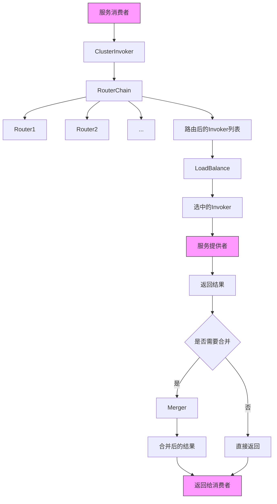

**图源**
- [AbstractClusterInvoker.java](file://dubbo-cluster\src\main\java\org\apache\dubbo\rpc\cluster\support\AbstractClusterInvoker.java)
- [RouterChain.java](file://dubbo-cluster\src\main\java\org\apache\dubbo\rpc\cluster\RouterChain.java)
- [LoadBalance.java](file://dubbo-cluster\src\main\java\org\apache\dubbo\rpc\cluster\LoadBalance.java)
- [Merger.java](file://dubbo-cluster\src\main\java\org\apache\dubbo\rpc\cluster\Merger.java)

**本节源码**
- [AbstractClusterInvoker.java](file://dubbo-cluster\src\main\java\org\apache\dubbo\rpc\cluster\support\AbstractClusterInvoker.java#L345-L370)
- [RouterChain.java](file://dubbo-cluster\src\main\java\org\apache\dubbo\rpc\cluster\RouterChain.java#L100-L122)
- [LoadBalance.java](file://dubbo-cluster\src\main\java\org\apache\dubbo\rpc\cluster\LoadBalance.java#L47-L48)
- [Merger.java](file://dubbo-cluster\src\main\java\org\apache\dubbo\rpc\cluster\Merger.java#L24)

## 集群容错机制

### AbstractClusterInvoker核心实现

AbstractClusterInvoker是集群调用的核心实现类，负责协调路由、负载均衡和实际调用的整个流程。它通过模板方法模式定义了调用的基本流程，具体的集群策略由子类实现。

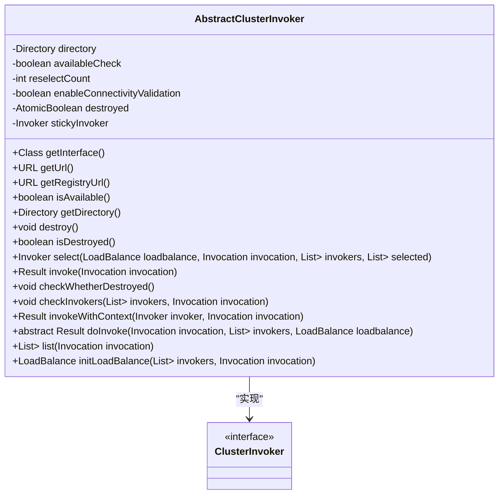

**图源**
- [AbstractClusterInvoker.java](file://dubbo-cluster\src\main\java\org\apache\dubbo\rpc\cluster\support\AbstractClusterInvoker.java)

**本节源码**
- [AbstractClusterInvoker.java](file://dubbo-cluster\src\main\java\org\apache\dubbo\rpc\cluster\support\AbstractClusterInvoker.java#L62-L501)

### 调用选择与重试机制

AbstractClusterInvoker中的select方法实现了智能的服务提供者选择机制，包括粘性连接、权重计算和重选策略。当首选的服务提供者不可用或已被选中时，会进行重选以确保调用的成功率。

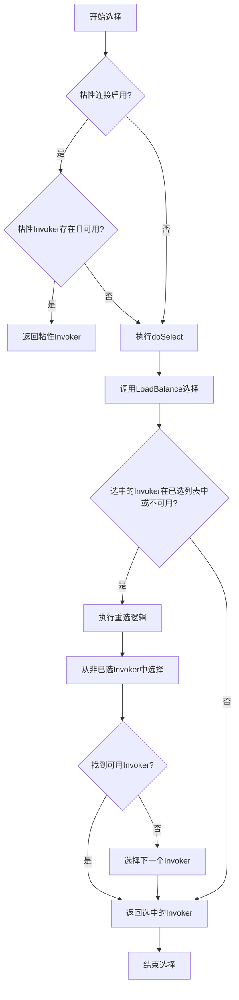

**图源**
- [AbstractClusterInvoker.java](file://dubbo-cluster\src\main\java\org\apache\dubbo\rpc\cluster\support\AbstractClusterInvoker.java#L155-L240)

**本节源码**
- [AbstractClusterInvoker.java](file://dubbo-cluster\src\main\java\org\apache\dubbo\rpc\cluster\support\AbstractClusterInvoker.java#L155-L240)

## 负载均衡策略

### 负载均衡基类设计

AbstractLoadBalance是所有负载均衡策略的基类，提供了权重计算和预热机制的通用实现。通过继承该基类，各种负载均衡策略可以专注于实现特定的选择算法。

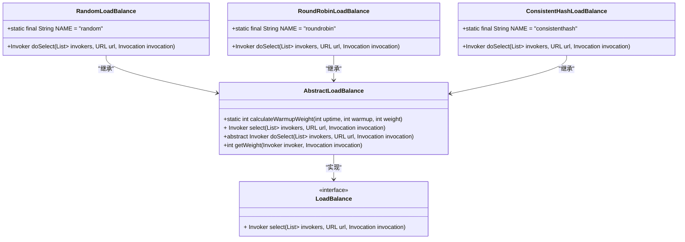

**图源**
- [AbstractLoadBalance.java](file://dubbo-cluster\src\main\java\org\apache\dubbo\rpc\cluster\loadbalance\AbstractLoadBalance.java)
- [RandomLoadBalance.java](file://dubbo-cluster\src\main\java\org\apache\dubbo\rpc\cluster\loadbalance\RandomLoadBalance.java)
- [RoundRobinLoadBalance.java](file://dubbo-cluster\src\main\java\org\apache\dubbo\rpc\cluster\loadbalance\RoundRobinLoadBalance.java)
- [ConsistentHashLoadBalance.java](file://dubbo-cluster\src\main\java\org\apache\dubbo\rpc\cluster\loadbalance\ConsistentHashLoadBalance.java)

**本节源码**
- [AbstractLoadBalance.java](file://dubbo-cluster\src\main\java\org\apache\dubbo\rpc\cluster\loadbalance\AbstractLoadBalance.java#L36-L101)
- [RandomLoadBalance.java](file://dubbo-cluster\src\main\java\org\apache\dubbo\rpc\cluster\loadbalance\RandomLoadBalance.java#L42-L130)
- [RoundRobinLoadBalance.java](file://dubbo-cluster\src\main\java\org\apache\dubbo\rpc\cluster\loadbalance\RoundRobinLoadBalance.java#L35-L135)
- [ConsistentHashLoadBalance.java](file://dubbo-cluster\src\main\java\org\apache\dubbo\rpc\cluster\loadbalance\ConsistentHashLoadBalance.java#L33-L136)

### 随机负载均衡实现

RandomLoadBalance实现了随机负载均衡策略，支持权重分配。当所有服务提供者的权重相同时，采用简单的随机选择；当权重不同时，采用加权随机算法，确保高权重的服务提供者获得更多的调用机会。

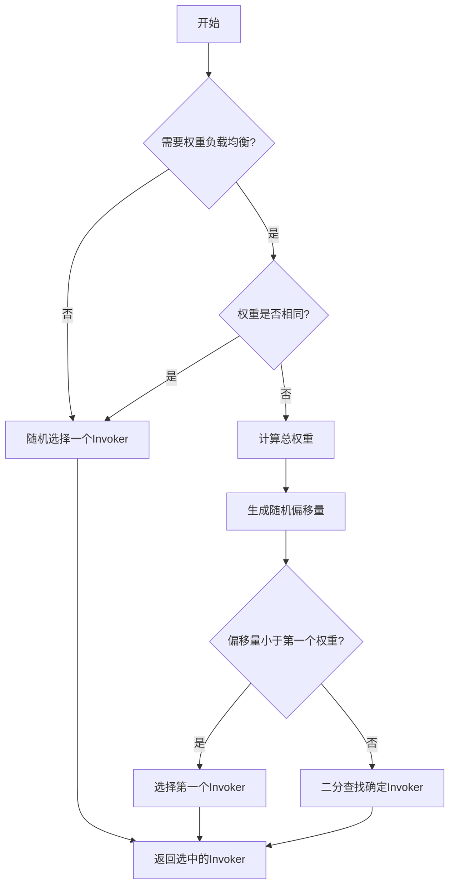

**图源**
- [RandomLoadBalance.java](file://dubbo-cluster\src\main\java\org\apache\dubbo\rpc\cluster\loadbalance\RandomLoadBalance.java#L56-L106)

**本节源码**
- [RandomLoadBalance.java](file://dubbo-cluster\src\main\java\org\apache\dubbo\rpc\cluster\loadbalance\RandomLoadBalance.java#L56-L106)

### 轮询负载均衡实现

RoundRobinLoadBalance实现了加权轮询负载均衡策略，通过维护每个服务提供者的当前权重值来实现公平的调用分配。该实现使用了AtomicLong来保证线程安全，并通过缓存机制提高了性能。

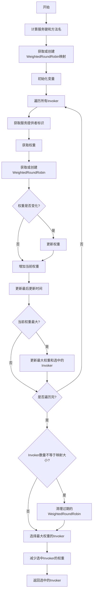

**图源**
- [RoundRobinLoadBalance.java](file://dubbo-cluster\src\main\java\org\apache\dubbo\rpc\cluster\loadbalance\RoundRobinLoadBalance.java#L93-L134)

**本节源码**
- [RoundRobinLoadBalance.java](file://dubbo-cluster\src\main\java\org\apache\dubbo\rpc\cluster\loadbalance\RoundRobinLoadBalance.java#L93-L134)

### 一致性哈希负载均衡实现

ConsistentHashLoadBalance实现了基于一致性哈希的负载均衡策略，特别适合需要会话保持的场景。通过将服务提供者和请求参数映射到哈希环上，确保相同参数的请求总是被路由到相同的服务提供者。

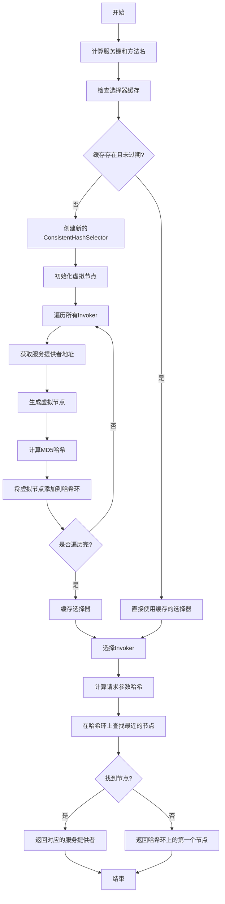

**图源**
- [ConsistentHashLoadBalance.java](file://dubbo-cluster\src\main\java\org\apache\dubbo\rpc\cluster\loadbalance\ConsistentHashLoadBalance.java#L50-L68)

**本节源码**
- [ConsistentHashLoadBalance.java](file://dubbo-cluster\src\main\java\org\apache\dubbo\rpc\cluster\loadbalance\ConsistentHashLoadBalance.java#L50-L68)

## 路由机制

### 路由链设计

RouterChain是路由机制的核心，管理着多个路由器的执行顺序。通过维护主备链的双缓冲机制，实现了路由规则更新时的平滑切换，避免了更新过程中的服务中断。

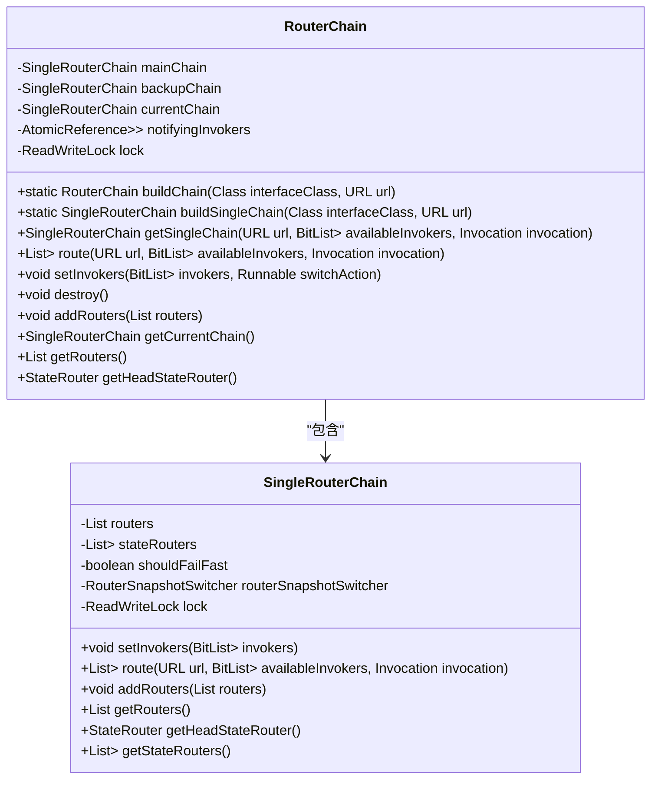

**图源**
- [RouterChain.java](file://dubbo-cluster\src\main\java\org\apache\dubbo\rpc\cluster\RouterChain.java)

**本节源码**
- [RouterChain.java](file://dubbo-cluster\src\main\java\org\apache\dubbo\rpc\cluster\RouterChain.java#L44-L247)

### 条件路由实现

ConditionStateRouter实现了基于条件表达式的路由规则，支持复杂的匹配逻辑。通过解析"when=>then"格式的规则，可以实现灵活的流量控制和灰度发布策略。

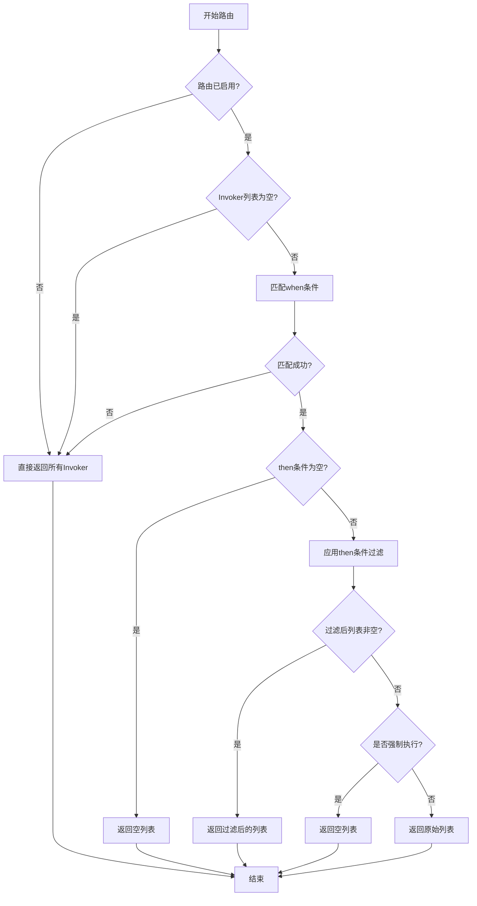

**图源**
- [ConditionStateRouter.java](file://dubbo-cluster\src\main\java\org\apache\dubbo\rpc\cluster\router\condition\ConditionStateRouter.java#L204-L279)

**本节源码**
- [ConditionStateRouter.java](file://dubbo-cluster\src\main\java\org\apache\dubbo\rpc\cluster\router\condition\ConditionStateRouter.java#L204-L279)

## 合并器(Merger)

### Merger接口与工厂

Merger接口定义了结果合并的能力，通过SPI机制支持多种合并策略。MergerFactory负责根据返回类型自动选择合适的合并器，实现了类型安全的合并操作。

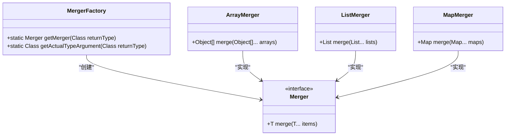

**图源**
- [Merger.java](file://dubbo-cluster\src\main\java\org\apache\dubbo\rpc\cluster\Merger.java)
- [merger包下的各类合并器实现]

**本节源码**
- [Merger.java](file://dubbo-cluster\src\main\java\org\apache\dubbo\rpc\cluster\Merger.java#L22-L25)

## 调用流程与示例

### 完整调用流程

从服务消费者发起调用到最终结果返回，dubbo-cluster模块的完整调用流程如下：

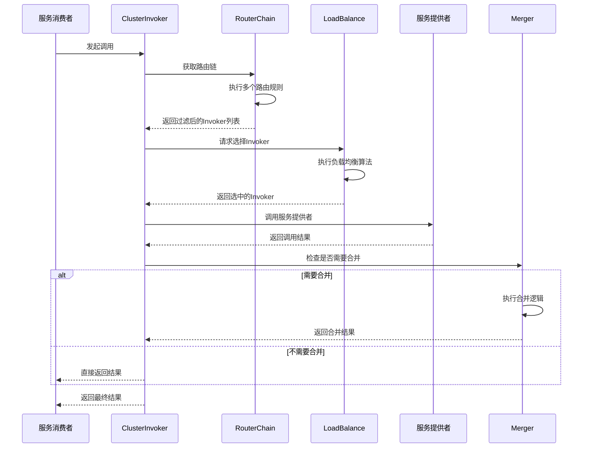

**图源**
- [AbstractClusterInvoker.java](file://dubbo-cluster\src\main\java\org\apache\dubbo\rpc\cluster\support\AbstractClusterInvoker.java#L345-L367)
- [RouterChain.java](file://dubbo-cluster\src\main\java\org\apache\dubbo\rpc\cluster\RouterChain.java#L120-L122)
- [LoadBalance.java](file://dubbo-cluster\src\main\java\org\apache\dubbo\rpc\cluster\LoadBalance.java#L47-L48)
- [Merger.java](file://dubbo-cluster\src\main\java\org\apache\dubbo\rpc\cluster\Merger.java#L24)

### 负载均衡策略对比

| 策略 | 算法描述 | 适用场景 | 优点 | 缺点 |
|------|---------|---------|------|------|
| 随机负载均衡 | 根据权重随机选择服务提供者 | 服务提供者性能相近 | 实现简单，分布均匀 | 可能出现热点问题 |
| 轮询负载均衡 | 按权重循环选择服务提供者 | 需要公平分配调用 | 分配公平，避免热点 | 需要维护状态，内存开销 |
| 一致性哈希 | 基于请求参数的哈希值选择服务提供者 | 需要会话保持的场景 | 减少服务提供者变动时的影响 | 哈希环可能不均匀 |
| 最少活跃数 | 选择当前处理请求数最少的服务提供者 | 服务处理能力差异大 | 能够动态适应服务负载 | 需要维护活跃数统计 |
| 短响应优先 | 选择平均响应时间最短的服务提供者 | 对响应时间敏感的场景 | 提升整体响应性能 | 需要收集响应时间数据 |

**本节源码**
- [LoadBalance.java](file://dubbo-cluster\src\main\java\org\apache\dubbo\rpc\cluster\LoadBalance.java#L36)
- [RandomLoadBalance.java](file://dubbo-cluster\src\main\java\org\apache\dubbo\rpc\cluster\loadbalance\RandomLoadBalance.java#L44)
- [RoundRobinLoadBalance.java](file://dubbo-cluster\src\main\java\org\apache\dubbo\rpc\cluster\loadbalance\RoundRobinLoadBalance.java#L36)
- [ConsistentHashLoadBalance.java](file://dubbo-cluster\src\main\java\org\apache\dubbo\rpc\cluster\loadbalance\ConsistentHashLoadBalance.java#L34)
- [LeastActiveLoadBalance.java](file://dubbo-cluster\src\main\java\org\apache\dubbo\rpc\cluster\loadbalance\LeastActiveLoadBalance.java)
- [ShortestResponseLoadBalance.java](file://dubbo-cluster\src\main\java\org\apache\dubbo\rpc\cluster\loadbalance\ShortestResponseLoadBalance.java)

## 总结

dubbo-cluster模块通过精心设计的架构和丰富的功能，为分布式服务调用提供了强大的集群容错能力。其核心价值体现在以下几个方面：

1. **灵活的扩展性**：通过SPI机制，所有核心组件都支持自定义扩展，可以根据业务需求灵活定制集群行为。

2. **完善的容错机制**：提供了多种集群策略（如failover、failfast、failsafe等），能够应对不同的故障场景，确保服务的高可用性。

3. **智能的负载均衡**：支持多种负载均衡算法，能够根据服务提供者的权重、活跃数、响应时间等指标进行智能选择，优化系统整体性能。

4. **精细的路由控制**：通过条件路由、标签路由等多种路由方式，实现了精细化的流量控制和灰度发布能力。

5. **高效的合并处理**：针对多播调用场景，提供了类型安全的结果合并机制，简化了客户端的处理逻辑。

这些特性使得dubbo-cluster模块成为构建高可用、高性能分布式系统的重要基石。开发者可以根据具体业务场景，灵活配置和组合这些功能，构建出满足特定需求的服务调用体系。